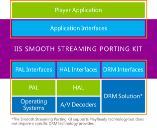

# Licensing Microsoft&reg; Smooth Streaming Client Porting Kit 
## Overview
Microsoft Smooth Streaming Client Porting Kit (**SSPK** for short) is a Smooth Streaming client implementation that is optimized to help embedded device manufacturers, cable and mobile operators, content service providers, handset manufacturers, independent software vendors (ISVs), and solution providers to create products and services for streaming adaptive content in Smooth Streaming format. SSPK is a device and platform-independent implementation of Smooth Streaming client that can be ported by the licensee to any device and platform. 

Included below is a high-level architecture and IIS Smooth Streaming Porting Kit box is the Smooth Streaming Client implementation provided by Microsoft and includes all the core logic for playback of Smooth Streaming content. This content is then ported by partners for a specific device or platform by implementing appropriate interfaces. 

## Description
SSPK is licensed on terms that offer excellent business value. SSPK license provides the industry with:

* Smooth Streaming Porting Kit source in C++ 
  * implements Smooth Streaming Client functionality
  * adds format parsing, heuristics, buffering logic, etc.
* Player application APIs 
  * programming interfaces for interaction with a media player application
* Platform Abstraction Layer (PAL) Interface 
  * programming interfaces for interaction with the operating system (threads, sockets)
* Hardware Abstraction Layer (HAL) Interface 
  * programming interfaces for interaction with hardware A/V decoders (decoding, rendering)
* Digital Rights Management (DRM) Interface 
  * programming interfaces for handling DRM through the DRM Abstraction Layer (DAL)
  * Microsoft PlayReady Porting Kit ships separately but integrates through this interface. For more details on Microsoft PlayReady Device licensing, click [here](https://www.microsoft.com/playready/licensing/device_technology.mspx#pddipdl).
* Implementation samples 
  * sample PAL implementation for Linux
  * sample HAL implementation for GStreamer

## Licensing Options
Microsoft Smooth Streaming Client Porting Kit is made available to licensees under two distinct license agreements: one for developing Smooth Streaming Client Interim Products and another for distributing Smooth Streaming Client Final Products to end users.

* For chipset manufacturers, system integrators, or independent software vendors (ISVs) who require a source code porting kit to develop Interim Products, a Microsoft Smooth Streaming Client Porting Kit **Interim Product License** should be executed.
* For device manufacturers or ISVs who require distribution rights for Smooth Streaming Client Final Products to end users, the Microsoft Smooth Streaming Client Porting Kit **Final Product License** should be executed.

### Microsoft Smooth Streaming Client Porting Kit Interim Product License
Under this license, Microsoft offers a Smooth Streaming Client Porting Kit and the necessary intellectual property rights to develop and distribute Smooth Streaming Client Interim Products to other Smooth Streaming Client Porting Kit device licensees that distribute Smooth Streaming Client Final Products.

#### Fee structure
A U.S. $50,000 one-time license fee provides access to the Smooth Streaming Client Porting Kit. 

### Microsoft Smooth Streaming Client Porting Kit Final Product License
Under this license, Microsoft offers all necessary intellectual property rights to receive Smooth Streaming Client Interim Products from other Smooth Streaming Client Porting Kit licensees and to distribute company-branded Smooth Streaming Client Final Products to end users.

#### Fee structure
The Smooth Streaming Client Final Product is offered under a royalty model as under:

* $0.10 per device implementation shipped
* The royalty is capped at $50,000 each year
* No royalty for first 10,000 device implementations each year 

## Licensing Procedure and SSPK access
Email [sspkinfo@microsoft.com](mailto:sspkinfo@microsoft.com) for all licensing queries.

The SSPK Distribution portal is accessible to registered Interim licensees.

Interim and Final SSPK licensees can submit technical questions to [smoothpk@microsoft.com](mailto:smoothpk@microsoft.com).

## Microsoft Smooth Streaming Client Interim Product Agreement Licensees

* Adroit Business Solutions, Inc
* Advanced Digital Broadcast SA
* AirTies Kablosuz Iletism Sanayive Dis Ticaret A.S.
* Albis Technologies Ltd.
* Alticast Corporation
* Amazon Digital Services, Inc.
* Arion Technology, Inc.
* AVC Multimedia Software Co., Ltd.
* Cavium, Inc.
* EchoStar Purchasing Corporation
* Enseo, Inc.
* Fluendo S.A.
* Guangzhou Shikun Electronics., Ltd.
* HANDAN BroadInfoCom Co., Ltd.
* Infomir GMBH
* Irdeto USA Inc.
* Liberty Global Services BV
* MediaTek Inc.
* MStar Co, Ltd
* Nintendo Co., Ltd.
* OpenTV, Inc.
* Saffron Digital Limited
* Sichuan Changhong Electric Co., Ltd
* SoftAtHome
* Sony Corporation
* Tatung Technology Inc.
* Top Victory Investments, Ltd.
* Vestel Elektronik Sanayi ve Ticaret A.S.
* VisualOn, Inc.
* ZTE Corporation

## Microsoft Smooth Streaming Client Final Product Agreement Licensees
* Advanced Digital Broadcast SA
* AirTies Kablosuz Iletism Sanayive Dis Ticaret A.S.
* Arcadyan Technology Corporation
* Arcelik A.S
* Compal Electronics, Inc.
* EXPRESS LUCK TECHNOLOGY LIMITED
* Fluendo S.A.
* FUNAI ELECTRIC CO., LTD
* Hisense International Co., Ltd. 
* HKC Corporation Limited
* Hong Kong Konka Ltd
* Innolux Corporation
* Innopia Technologies, Inc
* Kaonmedia Co., Ltd.
* KDDI Corporation
* Mega Fame Electronics Co. Limited
* MIRC Electronics Limited
* Nintendo Co., Ltd.
* ONEPLUS ELECTRONICS (SHENZHEN) CO., LTD.
* Panasonic Corporation
* Qingdao Haier Optronics Co., Ltd.
* Shenzhen ATEKO PHOTO Electricity Co.,Ltd.
* Shenzhen Chuangwei-RGB Electronics Co.,Ltd.
* Shenzhen Jiuzhou Electric Co., Ltd
* Shenzhen KTC Technology Co., Ltd. 
* Shenzhen Maxmade Technology Co., Ltd
* Shenzhen MTC Co., Ltd
* Shenzhen Skyworth Digital Technology Co., Ltd
* Sichuan Changhong Electric Co., Ltd.
* Skardin Industrial Corp.
* Sky Deutschland Fernsehen GmbH & Co. KG
* SMARDTV GLOBAL SAS
* SoftAtHome
* Sony Corporation
* Technicolor Delivery Technologies, SAS
* Top Victory Investments, Ltd.
* UMC Poland sp. z .o.o.
* ZTE Corporation

## Media Services learning paths
[!INCLUDE [media-services-learning-paths-include](../../../includes/media-services-learning-paths-include.md)]

## Provide feedback
[!INCLUDE [media-services-user-voice-include](../../../includes/media-services-user-voice-include.md)]

