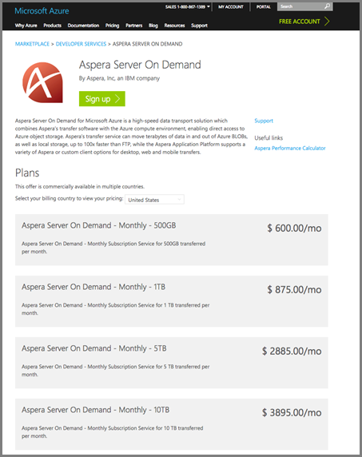
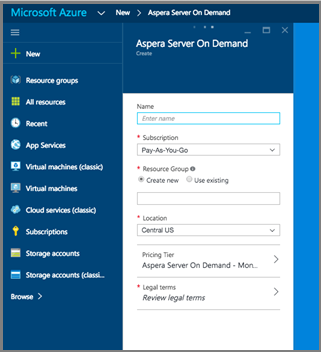
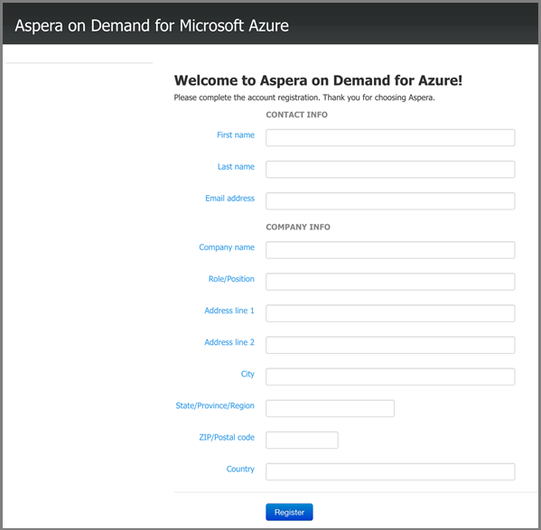
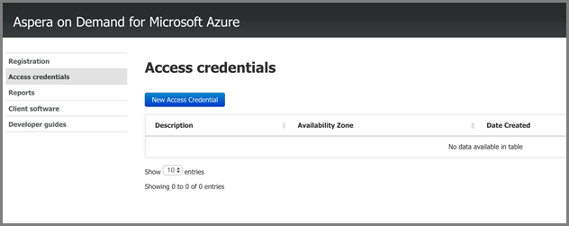

# Upload files into a Media Services account using the Aspera Server On-Demand service on Azure 

## Overview

**Aspera** is a high-speed file transfer software. **Aspera Server On Demand** for Azure enables high-speed upload and download of large files directly into Azure Blob object storage. For information about **Aspera On Demand**, see the [Aspera Cloud](http://cloud.asperasoft.com/) site. 
  
**Aspera Server On Demand** for Azure is available for purchase from the [Azure marketplace](https://azure.microsoft.com/marketplace/). In order to complete a purchase of **Aspera Server On Demand** for Azure, please log into Azure Marketplace with your Windows Live ID.

This tutorial walks you through the steps of uploading files into a storage account that is associated with a Media Services account using the **Aspera Server On-Demand** service on Azure. 

You can find an example that shows how to use Azure functions with Aspera and Media Services [here](https://github.com/Azure-Samples/media-services-dotnet-functions-integration/tree/master/103-aspera-ingest).

>[!NOTE]
>There is a limit to the maximum file size supported for processing with Azure Media Services media processors (MPs). See [this](media-services-quotas-and-limitations.md) article for details about the file size limitation.
>

## Prerequisites 

To complete this tutorial, you need:

* A Windows Live ID
* An [Azure account](https://azure.microsoft.com). For details, see [Azure Free Trial](https://azure.microsoft.com/pricing/free-trial/). 
* An [Azure Media Services account](media-services-portal-create-account.md).

## Purchase Aspera On Demand for Azure

Once you have logged into Azure Marketplace,  follow these basic steps to complete your purchase of Aspera On Demand for Azure.

1. Search for Aspera and select 'Server On Demand'.

   

2. Review the subscription plans and click on 'Sign Up'

   

3. Fill in the specifics for your Server on-Demand subscription.

   

4. Click on the **Pricing Tier** and select your desired monthly volume in the sub panel. In the **Plan details** panel, select **OK**. Then, in the **Choose your Pricing Tier** panel, click **Select**.

   

5. Click on **Legal terms** to view and accept the legal terms in the sub panel. Once you have reviewed the legal terms, click **Purchase**.

   

6. Complete the purchase by clicking **Create**.

   

7. The Azure dashboard will announce that it is provisioning the service.  Once it is completed with provisioning, you can find the new subscription by searching in your resources for the name of the service. Once you have found the service, double click on it to launch the service management portal.

   

8. Launch the Aspera management portal. Once you have found your new Aspera service, you can gain access to the management portal, by clicking on the service.  A new panel will be launched. From within that new panel, you need to click on the **Resource Name** of your new service.  In the following screenshot, the resource name is 'AsperaTransferDemo'. Once you click on the resource name, another panel is launched. In that newly launched panel, you will see a 'Manage' link. Click on the 'Manage' link to launch the Aspera management portal.

   

9. By clicking on the manage link, you will get to the registration page, which is required to access the service.

   

10. At this point, you should have access to the Aspera service management portal, where you can create access keys, download Aspera clients and licenses, view usage and learn about the APIs.

	The following screenshot shows the access creation. 

    

	The following screenshot shows the usage reporting interfaces in the portal. 

    

## Upload files with Aspera

1. Download and install the Aspera client software:
	
	* [Browser plugin](https://downloads.asperasoft.com/connect2/)
	* [Rich client](https://downloads.asperasoft.com/en/downloads/2)

2. Make your first transfer. In order to use the Aspera client to transfer with the Aspera transfer service, you need to complete the following: 

   1. Create an access key, using the Aspera portal.  
   2. Download, install, and license the Aspera client (software can be found in the Aspera portal).  

      >[!NOTE]
      >Please read the Aspera client guide for configuration information.
	
   3. Retrieve some information of your storage account that is associated with your Azure Media Account using the [Azure portal](https://portal.azure.com/). Specifically, name and key, and the storage blob container name in to which you want to place your content. 

       * To get the storage info from the portal: find your storage account, click on the Access keys and copy the name and the key of your account.
       * To get the container name: find your storage account, select **Blobs**, select the name of the container you want to upload the content into. 

      Below is the screenshot of the Aspera client **Connection Manager** where you must specify the 'Azure' storage type and credentials as well as the blob container.

      

## Resources

The following resources were mentioned in this article. 

* [Connect Browser Plugin](https://downloads.asperasoft.com/connect2/)
* [Connect Guide](https://downloads.asperasoft.com/en/documentation/8)
* [Aspera Client](https://downloads.asperasoft.com/en/downloads/2)
* [Client Guide](https://downloads.asperasoft.com/en/documentation/2)

## Next steps

You can now [copy blobs from a storage account into an AMS account](media-services-copying-existing-blob.md#copy-blobs-from-a-storage-account-into-an-ams-account).

## Media Services learning paths
[!INCLUDE [media-services-learning-paths-include](../../../includes/media-services-learning-paths-include.md)]

## Provide feedback
[!INCLUDE [media-services-user-voice-include](../../../includes/media-services-user-voice-include.md)]

