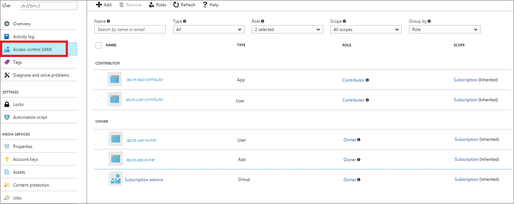

# Access the Azure Media Services API with Azure AD authentication  

> [!NOTE]
> No new features or functionality are being added to Media Services v2.  Check out the latest version, [Media Services v3](https://docs.microsoft.com/azure/media-services/latest/). Also, see [migration guidance from v2 to v3](../latest/migrate-from-v2-to-v3.md)

The Azure Media Services API is a RESTful API. You can use it to perform operations on media resources by using a REST API or by using available client SDKs. Azure Media Services offers a Media Services client SDK for Microsoft .NET. To be authorized to access Media Services resources and the Media Services API, you must first be authenticated. 

Media Services supports [Azure Active Directory (Azure AD)-based authentication](../../active-directory/fundamentals/active-directory-whatis.md). The Azure Media REST service requires that the user or application that makes the REST API requests have either the **Contributor** or **Owner** role to access the resources. For more information, see [Get started with Role-Based Access Control in the Azure portal](../../role-based-access-control/overview.md).  

This document gives an overview of how to access the Media Services API by using REST or .NET APIs.

> [!NOTE]
> Access Control authorization was deprecated on June 1, 2018.

## Access control

For the Azure Media REST request to succeed, the calling user must have a Contributor or Owner role for the Media Services account it is trying to access.  
Only a user with the Owner role can give media resource (account) access to new users or apps. The Contributor role can access only the media resource.
Unauthorized requests fail, with status code of 401. If you see this error code, check whether your user has the Contributor or Owner role assigned for the user's Media Services account. You can check this in the Azure portal. Search for your media account, and then click the **Access control** tab. 

## Types of authentication 
 
When you use Azure AD authentication with Azure Media Services, you have two authentication options:

- **User authentication**. Authenticate a person who is using the app to interact with Media Services resources. The interactive application should first prompt the user for the user's credentials. An example is a management console app used by authorized users to monitor encoding jobs or live streaming. 
- **Service principal authentication**. Authenticate a service. Applications that commonly use this authentication method are apps that run daemon services, middle-tier services, or scheduled jobs. Examples are web apps, function apps, logic apps, API, and microservices.

### User authentication 

Applications that should use the user authentication method are management or monitoring native apps: mobile apps, Windows apps, and Console applications. This type of solution is useful when you want human interaction with the service in one of the following scenarios:

- Monitoring dashboard for your encoding jobs.
- Monitoring dashboard for your live streams.
- Management application for desktop or mobile users to administer resources in a Media Services account.

> [!NOTE]
> This authentication method should not be used for consumer-facing applications. 

A native application must first acquire an access token from Azure AD, and then use it when you make HTTP requests to the Media Services REST API. Add the access token to the request header. 

The following diagram shows a typical interactive application authentication flow: 

In the preceding diagram, the numbers represent the flow of the requests in chronological order.

> [!NOTE]
> When you use the user authentication method, all apps share the same (default) native application client ID and native application redirect URI. 

1. Prompt a user for credentials.
2. Request an Azure AD access token with the following parameters:  

   * Azure AD tenant endpoint.

       The tenant information can be retrieved from the Azure portal. Place your cursor over the name of the signed-in user in the top right corner.
   * Media Services resource URI. 

       This URI is the same for Media Services accounts that are in the same Azure environment (for example, https://rest.media.azure.net).

   * Media Services (native) application client ID.
   * Media Services (native) application redirect URI.
   * Resource URI for REST Media Services.
		
       The URI represents the REST API endpoint (for example, https://test03.restv2.westus.media.azure.net/api/).

     To get values for these parameters, see [Use the Azure portal to access Azure AD authentication settings](media-services-portal-get-started-with-aad.md) using the user authentication option.

3. The Azure AD access token is sent to the client.
4. The client sends a request to the Azure Media REST API with the Azure AD access token.
5. The client gets back the data from Media Services.

For information about how to use Azure AD authentication to communicate with REST requests by using the Media Services .NET client SDK, see [Use Azure AD authentication to access the Media Services API with .NET](media-services-dotnet-get-started-with-aad.md). 

If you are not using the Media Services .NET client SDK, you must manually create an Azure AD access token request by using the parameters described in step 2. For more information, see [How to use the Azure AD Authentication Library to get the Azure AD token](../../active-directory/develop/active-directory-authentication-libraries.md).

### Service principal authentication

Applications that commonly use this authentication method are apps that run middle-tier services and scheduled jobs: web apps, function apps, logic apps, APIs, and microservices. This authentication method also is suitable for interactive applications in which you might want to use a service account to manage resources.

When you use the service principal authentication method to build consumer scenarios, authentication typically is handled in the middle tier (through some API) and not directly in a mobile or desktop application. 

To use this method, create an Azure AD application and service principal in its own tenant. After you create the application, give the app Contributor or Owner role access to the Media Services account. You can do this in the Azure portal, by using the Azure CLI, or with a PowerShell script. You also can use an existing Azure AD application. You can register and manage your Azure AD app and service principal [in the Azure portal](media-services-portal-get-started-with-aad.md). You also can do this by using [Azure CLI](media-services-use-aad-auth-to-access-ams-api.md) or [PowerShell](media-services-powershell-create-and-configure-aad-app.md). 

After you create your Azure AD application, you get values for the following settings. You need these values for authentication:

- Client ID 
- Client secret 

In the preceding figure, the numbers represent the flow of the requests in chronological order:
	
1. A middle-tier app (web API or web application) requests an Azure AD access token that has the following parameters:  

   * Azure AD tenant endpoint.

       The tenant information can be retrieved from the Azure portal. Place your cursor over the name of the signed-in user in the top right corner.
   * Media Services resource URI. 

       This URI is the same for Media Services accounts that are located in the same Azure environment (for example, https://rest.media.azure.net).

   * Resource URI for REST Media Services.

       The URI represents the REST API endpoint (for example, https://test03.restv2.westus.media.azure.net/api/).

   * Azure AD application values: the client ID and client secret.
	
     To get values for these parameters, see [Use the Azure portal to access Azure AD authentication settings](media-services-portal-get-started-with-aad.md) by using the service principal authentication option.

2. The Azure AD access token is sent to the middle tier.
4. The middle tier sends request to the Azure Media REST API with the Azure AD token.
5. The middle tier gets back the data from Media Services.

For more information about how to use Azure AD authentication to communicate with REST requests by using the Media Services .NET client SDK, see [Use Azure AD authentication to access Azure Media Services API with .NET](media-services-dotnet-get-started-with-aad.md). 

If you are not using the Media Services .NET client SDK, you must manually create an Azure AD token request by using parameters described in step 1. For more information, see [How to use the Azure AD Authentication Library to get the Azure AD token](../../active-directory/develop/active-directory-authentication-libraries.md).

## Troubleshooting

Exception: "The remote server returned an error: (401) Unauthorized."

Solution: For the Media Services REST request to succeed, the calling user must be a Contributor or Owner role in the Media Services account it is trying to access. For more information, see the [Access control](media-services-use-aad-auth-to-access-ams-api.md#access-control) section.

## Resources

The following articles are overviews of Azure AD authentication concepts: 

- [Authentication scenarios addressed by Azure AD](../../active-directory/develop/authentication-scenarios.md)
- [Add, update, or remove an application in Azure AD](../../active-directory/develop/quickstart-v1-integrate-apps-with-azure-ad.md)
- [Configure and manage Role-Based Access Control by using PowerShell](../../role-based-access-control/role-assignments-powershell.md)

## Next steps

* Use the Azure portal to [access Azure AD authentication to consume Azure Media Services API](media-services-portal-get-started-with-aad.md).
* Use Azure AD authentication to [access Azure Media Services API with .NET](media-services-dotnet-get-started-with-aad.md).

