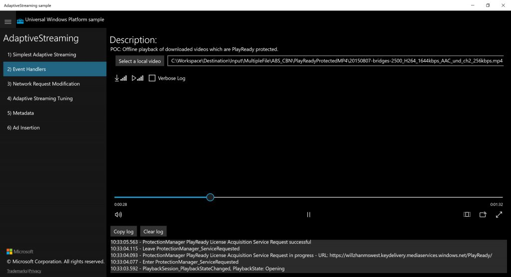

# Offline PlayReady Streaming for Windows 10  

> [!div class="op_single_selector" title1="Select the version of Media Services that you are using:"]
> * [Version 3](../latest/offline-plaready-streaming-for-windows-10.md)
> * [Version 2](offline-playready-streaming-windows-10.md)

> [!NOTE]
> No new features or functionality are being added to Media Services v2. <br/>Check out the latest version, [Media Services v3](https://docs.microsoft.com/azure/media-services/latest/). Also, see [migration guidance from v2 to v3](../latest/migrate-from-v2-to-v3.md)

Azure Media Services support offline download/playback with DRM protection. This article covers offline support of Azure Media Services for Windows 10/PlayReady clients. You can read about the offline mode support for iOS/FairPlay and Android/Widevine devices in the following articles:

- [Offline FairPlay Streaming for iOS](media-services-protect-hls-with-offline-fairplay.md)
- [Offline Widevine Streaming for Android](offline-widevine-for-android.md)

## Overview

This section gives some background on offline mode playback, especially why:

* In some countries/regions, Internet availability and/or bandwidth is still limited. Users may choose to download first to be able to watch content in high enough resolution for satisfactory viewing experience. In this case, more often, the issue is not network availability, rather it is limited network bandwidth. OTT/OVP providers are asking for offline mode support.
* As disclosed at Netflix 2016 Q3 shareholder conference, downloading content is a “oft-requested feature”, and “we are open to it” said by Reed Hastings, Netflix CEO.
* Some content providers may disallow DRM license delivery beyond a country/region's border. If a user needs to travel abroad and still wants to watch content, offline download is needed.
 
The challenge we face in implementing offline mode is the following:

* MP4 is supported by many players, encoder tools, but there is no binding between MP4 container and DRM;
* In the long term, CFF with CENC is the way to go. However, today, the tools/player support ecosystem is not there yet. We need a solution, today.
 
The idea is: smooth streaming ([PIFF](https://docs.microsoft.com/iis/media/smooth-streaming/protected-interoperable-file-format)) file format with H264/AAC has a binding with PlayReady (AES-128 CTR). Individual smooth streaming .ismv file (assuming audio is muxed in video) is itself a fMP4 and can be used for playback. If a smooth streaming content goes through PlayReady encryption, each .ismv file becomes a PlayReady protected fragmented MP4. We can choose an .ismv file with the preferred bitrate and rename it as .mp4 for download.

There are two options for hosting the PlayReady protected MP4 for progressive download:

* One can put this MP4 in the same container/media service asset and leverage Azure Media Services streaming endpoint for progressive download;
* One can use SAS locator for progressive download directly from Azure Storage, bypassing Azure Media Services.
 
You can use two types of PlayReady license delivery:

* PlayReady license delivery service in Azure Media Services;
* PlayReady license servers hosted anywhere.

Below are two sets of test assets, the first one using PlayReady license delivery in AMS while the second one using my PlayReady license server hosted on an Azure VM:

Asset #1:

* Progressive download URL: [https://willzhanmswest.streaming.mediaservices.windows.net/8d078cf8-d621-406c-84ca-88e6b9454acc/20150807-bridges-2500_H264_1644kbps_AAC_und_ch2_256kbps.mp4](https://willzhanmswest.streaming.mediaservices.windows.net/8d078cf8-d621-406c-84ca-88e6b9454acc/20150807-bridges-2500_H264_1644kbps_AAC_und_ch2_256kbps.mp4)
* PlayReady LA_URL (AMS): `https://willzhanmswest.keydelivery.mediaservices.windows.net/PlayReady/`

Asset #2:

* Progressive download URL: [https://willzhanmswest.streaming.mediaservices.windows.net/7c085a59-ae9a-411e-842c-ef10f96c3f89/20150807-bridges-2500_H264_1644kbps_AAC_und_ch2_256kbps.mp4](https://willzhanmswest.streaming.mediaservices.windows.net/7c085a59-ae9a-411e-842c-ef10f96c3f89/20150807-bridges-2500_H264_1644kbps_AAC_und_ch2_256kbps.mp4)
* PlayReady LA_URL (on-prem): `https://willzhan12.cloudapp.net/playready/rightsmanager.asmx`

For playback testing, I used a Universal Windows Application on Windows 10. In [Windows 10 Universal samples](https://github.com/Microsoft/Windows-universal-samples), there is a basic player sample called [Adaptive Streaming Sample](https://github.com/Microsoft/Windows-universal-samples/tree/master/Samples/AdaptiveStreaming). All we have to do is to add the code for us to pick downloaded video and use it as the source, instead of adaptive streaming source. The changes are in button click event handler:

```csharp
private async void LoadUri_Click(object sender, RoutedEventArgs e)
{
    //Uri uri;
    //if (!Uri.TryCreate(UriBox.Text, UriKind.Absolute, out uri))
    //{
    // Log("Malformed Uri in Load text box.");
    // return;
    //}
    //LoadSourceFromUriTask = LoadSourceFromUriAsync(uri);
    //await LoadSourceFromUriTask;

    //willzhan change start
    // Create and open the file picker
    FileOpenPicker openPicker = new FileOpenPicker();
    openPicker.ViewMode = PickerViewMode.Thumbnail;
    openPicker.SuggestedStartLocation = PickerLocationId.ComputerFolder;
    openPicker.FileTypeFilter.Add(".mp4");
    openPicker.FileTypeFilter.Add(".ismv");
    //openPicker.FileTypeFilter.Add(".mkv");
    //openPicker.FileTypeFilter.Add(".avi");

    StorageFile file = await openPicker.PickSingleFileAsync();

    if (file != null)
    {
       //rootPage.NotifyUser("Picked video: " + file.Name, NotifyType.StatusMessage);
       this.mediaPlayerElement.MediaPlayer.Source = MediaSource.CreateFromStorageFile(file);
       this.mediaPlayerElement.MediaPlayer.Play();
       UriBox.Text = file.Path;
    }
    else
    {
       // rootPage.NotifyUser("Operation cancelled.", NotifyType.ErrorMessage);
    }

    // On small screens, hide the description text to make room for the video.
    DescriptionText.Visibility = (ActualHeight < 500) ? Visibility.Collapsed : Visibility.Visible;
}
```

 

Since the video is under PlayReady protection, the screenshot will not be able to include the video.

In summary, we have achieved offline mode on Azure Media Services:

* Content transcoding and PlayReady encryption can be done in Azure Media Services or other tools;
* Content can be hosted in Azure Media Services or Azure Storage for progressive download;
* PlayReady license delivery can be from Azure Media Services or elsewhere;
* The prepared smooth streaming content can still be used for online streaming via DASH or smooth with PlayReady as the DRM.

## Additional notes

* Widevine is a service provided by Google Inc. and subject to the terms of service and Privacy Policy of Google, Inc.

## Next steps

[Hybrid DRM system design](hybrid-design-drm-sybsystem.md)
