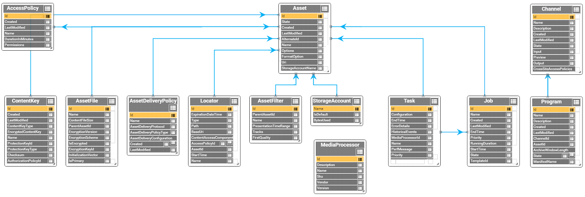
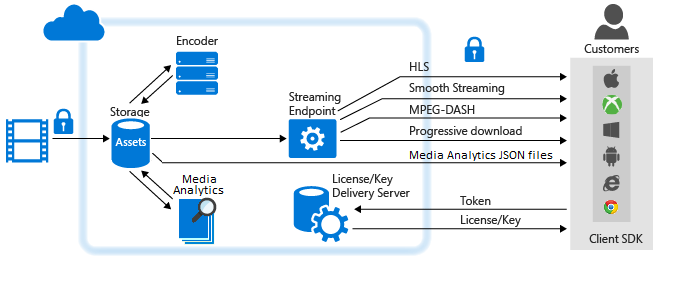
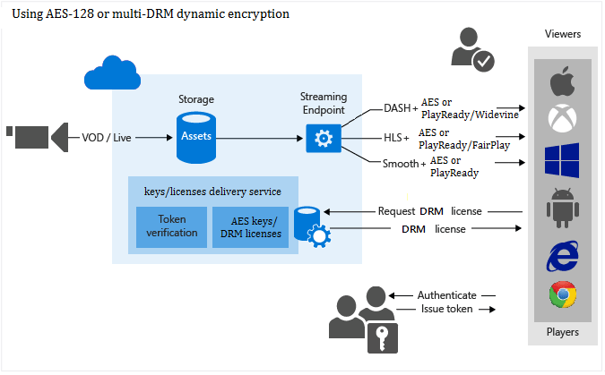

# Scenarios and availability of Media Services features across datacenters

Microsoft Azure Media Services (AMS) enables you to securely upload, store, encode, and package video or audio content for both on-demand and live streaming delivery to various clients (for example, TV, PC, and mobile devices).

AMS operates in multiple datacenters around the world. These datacenters are grouped in to geographic regions, giving you flexibility in choosing where to build your applications. You can review the [list of regions and their locations](https://azure.microsoft.com/regions/). 

This topic shows common scenarios for delivering your content [live](#live_scenarios) or [on-demand](#vod_scenarios). The topic also provides details about availability of media features and services across datacenters.

## Overview

### Prerequisites

To start using Azure Media Services, you should have the following:

* An Azure account. If you don't have an account, you can create a free trial account in just a couple of minutes. For details, see [Azure Free Trial](https://azure.microsoft.com).
* An Azure Media Services account. For more information, see [Create Account](media-services-portal-create-account.md).
* The streaming endpoint from which you want to stream content has to be in the **Running** state.

    When your AMS account is created, a **default** streaming endpoint is added to your account in the **Stopped** state. To start streaming your content and take advantage of dynamic packaging and dynamic encryption, the streaming endpoint has to be in the **Running** state.

### Commonly used objects when developing against the AMS OData model

The following image shows some of the most commonly used objects when developing against the Media Services OData model.

Click the image to view it full size.  

 

You can view the whole model [here](https://media.windows.net/API/$metadata?api-version=2.15).  

## Protect content in storage and deliver streaming media in the clear (non-encrypted)

1. Upload a high-quality media file into an asset.

    It is recommended to apply storage encryption option to your asset in order to protect your content during upload and while at rest in storage.
2. Encode to a set of adaptive bitrate MP4 files.

    It is recommended to apply storage encryption option to the output asset in order to protect your content at rest.
3. Configure asset delivery policy (used by dynamic packaging).

    If your asset is storage encrypted, you **must** configure asset delivery policy.
4. Publish the asset by creating an OnDemand locator.
5. Stream published content.

For information about availability in datacenters, see the [Availability](#availability) section.

## Protect content in storage, deliver dynamically encrypted streaming media

1. Upload a high-quality media file into an asset. Apply storage encryption option to the asset.
2. Encode to a set of adaptive bitrate MP4 files. Apply storage encryption option to the output asset.
3. Create encryption content key for the asset you want to be dynamically encrypted during playback.
4. Configure content key authorization policy.
5. Configure asset delivery policy (used by dynamic packaging and dynamic encryption).
6. Publish the asset by creating an OnDemand locator.
7. Stream published content.

For information about availability in datacenters, see the [Availability](#availability) section.

## Use Media Analytics to derive actionable insights from your videos

Media Analytics is a collection of speech and vision components that make it easier for organizations and enterprises to derive actionable insights from their video files. For more information, see [Azure Media Services Analytics Overview](media-services-analytics-overview.md).

1. Upload a high-quality media file into an asset.
2. Process your videos with one of the Media Analytics services described in the [Media Analytics overview](media-services-analytics-overview.md) section.
3. Media Analytics media processors produce MP4 files or JSON files. If a media processor produced an MP4 file, you can progressively download the file. If a media processor produced a JSON file, you can download the file from the Azure blob storage.

For information about availability in datacenters, see the [Availability](#availability) section.

## Deliver progressive download

1. Upload a high-quality media file into an asset.
2. Encode to a single MP4 file.
3. Publish the asset by creating an OnDemand or SAS locator.

	If using SAS locator, the content is downloaded from the Azure blob storage. In this case, you do not need to have streaming endpoints in started state.
4. Progressively download content.

## Delivering live-streaming events 

1. Ingest live content using various live streaming protocols (for example RTMP or Smooth Streaming).
2. (optionally) Encode your stream into adaptive bitrate stream.
3. Preview your live stream.
4. Deliver the content through common streaming protocols (for example, MPEG DASH, Smooth, HLS) directly to your customers, or to a Content Delivery Network (CDN) for further distribution.

    -or-

    Record and store the ingested content in order to be streamed later (Video-on-Demand).

When doing live streaming, you can choose one of the following routes:

### Working with channels that receive multi-bitrate live stream from on-premises encoders (pass-through)

The following diagram shows the major parts of the AMS platform that are involved in the **pass-through** workflow.

For more information, see [Working with Channels that Receive Multi-bitrate Live Stream from On-premises Encoders](media-services-live-streaming-with-onprem-encoders.md).

### Working with channels that are enabled to perform live encoding with Azure Media Services

The following diagram shows the major parts of the AMS platform that are involved in Live Streaming workflow where a Channel is enabled to perform live encoding with Media Services.

For more information, see [Working with Channels that are Enabled to Perform Live Encoding with Azure Media Services](media-services-manage-live-encoder-enabled-channels.md).

For information about availability in datacenters, see the [Availability](#availability) section.

## Consuming content

Azure Media Services provides the tools you need to create rich, dynamic client player applications for most platforms including: iOS Devices, Android Devices, Windows, Windows Phone, Xbox, and Set-top boxes. The following topic provides links to SDKs and Player Frameworks that you can use to develop your own client applications that can consume streaming media from Media Services. For more information, see [Developing video payer applications](media-services-develop-video-players.md)

## Enabling Azure CDN

Media Services supports integration with Azure CDN. For information on how to enable Azure CDN, see [How to Manage Streaming Endpoints in a Media Services Account](media-services-portal-manage-streaming-endpoints.md).

## Scaling a Media Services account

AMS customers can scale streaming endpoints, media processing, and storage in their AMS accounts.

* Media Services customers can choose either a **Standard** streaming endpoint or a **Premium** streaming endpoint. A **Standard** streaming endpoint is suitable for most streaming workloads. It includes the same features as a **Premium** streaming endpoints and scales outbound bandwidth automatically. 

    **Premium** streaming endpoints are suitable for advanced workloads, providing dedicated and scalable bandwidth capacity. Customers that have a **Premium** streaming endpoint, by default get one streaming unit (SU). The streaming endpoint can be scaled by adding SUs. Each SU provides additional bandwidth capacity to the application. For more information about scaling **Premium** streaming endpoints, see the [Scaling streaming endpoints](media-services-portal-scale-streaming-endpoints.md) topic.

* A Media Services account is associated with a Reserved Unit Type, which determines the speed with which your media processing tasks are processed. You can pick between the following reserved unit types: **S1**, **S2**, or **S3**. For example, the same encoding job runs faster when you use the **S2** reserved unit type compare to the **S1** type.

	In addition to specifying the reserved unit type, you can specify to provision your account with **Reserved Units** (RUs). The number of provisioned RUs determines the number of media tasks that can be processed concurrently in a given account.

	>[!NOTE]
	>RUs work for parallelizing all media processing, including indexing jobs using Azure Media Indexer. However, unlike encoding, indexing jobs do not get processed faster with faster reserved units.

    For more information see, [Scale media processing](media-services-portal-scale-media-processing.md).
* You can also scale your Media Services account by adding storage accounts to it. Each storage account is limited to 500 TB. To expand your storage beyond the default limitations, you can choose to attach multiple storage accounts to a single Media Services account. For more information, see [Manage storage accounts](meda-services-managing-multiple-storage-accounts.md).

##  Availability of Media Services features across datacenters

This section provides details about availability of Media Services features across datacenters.

### AMS accounts

#### Availability

To determine if Media Services is available in a datacenter, browse to https://azure.microsoft.com/status/ and scroll to the MEDIA table.

### Streaming endpoints 

Media Services customers can choose either a **Standard** streaming endpoint or a **Premium** streaming endpoint. For more information, see the [scaling](#scaling) section.

#### Availability

|Name|Status|Datacenters
|---|---|---|
|Standard|GA|All|
|Premium|GA|All|

### Live encoding

#### Availability

Available in all datacenters except: Germany, Brazil South, India West, India South, and India Central. 

### Encoding media processors

AMS offers two on-demand encoders **Media Encoder Standard** and **Media Encoder Premium Workflow**. For more information, see [Overview and comparison of Azure on-demand media encoders](media-services-encode-asset.md). 

#### Availability

|Media processor name|Status|Datacenters
|---|---|---|
|Media Encoder Standard|GA|All|
|Media Encoder Premium Workflow|GA|All except China|

### Analytics media processors

Media Analytics is a collection of speech and vision components that makes it easier for organizations and enterprises to derive actionable insights from their video files. For more information, see [Azure Media Services Analytics Overview](media-services-analytics-overview.md).

#### Availability

|Media processor name|Status|Datacenters
|---|---|---|
|Azure Media Face Detector|Preview|All|
|Azure Media Hyperlapse|Preview|All|
|Azure Media Indexer|GA|All|
|Azure Media Motion Detector|Preview|All|
|Azure Media OCR|Preview|All|
|Azure Media Redactor|Preview|All|
|Azure Media Stabilizer|Preview|All|
|Azure Media Video Thumbnails|Preview|All|
|Azure Media Indexer 2|Preview|All except China and Federal Government region|

### Protection

Microsoft Azure Media Services enables you to secure your media from the time it leaves your computer through storage, processing, and delivery. For more information, see [Protecting AMS content](media-services-content-protection-overview.md).

#### Availability

|Encryption|Status|Datacenters|
|---|---|---| 
|Storage|GA|All|
|AES-128 keys|GA|All|
|Fairplay|GA|All|
|PlayReady|GA|All|
|Widevine|GA|All except Germany, Federal Government and China.

### Reserved units (RUs)

The number of provisioned reserved units determines the number of media tasks that can be processed concurrently in a given account. 

For more information, see the [scaling](#scaling) section.

#### Availability

Available in all datacenters.

### Reserved unit (RU) type

A Media Services account is associated with a Reserved unit type, which determines the speed with which your media processing tasks are processed. You can pick between the following reserved unit types: S1, S2, or S3.

For more information, see the [scaling](#scaling) section.

#### Availability

|RU type name|Status|Datacenters
|---|---|---|
|S1|GA|All|
|S2|GA|All except Brazil South, and India West|
|S3|GA|All except India West|

## Next steps

Review Media Services learning paths.

[!INCLUDE [media-services-learning-paths-include](../../../includes/media-services-learning-paths-include.md)]

## Provide feedback
[!INCLUDE [media-services-user-voice-include](../../../includes/media-services-user-voice-include.md)]

