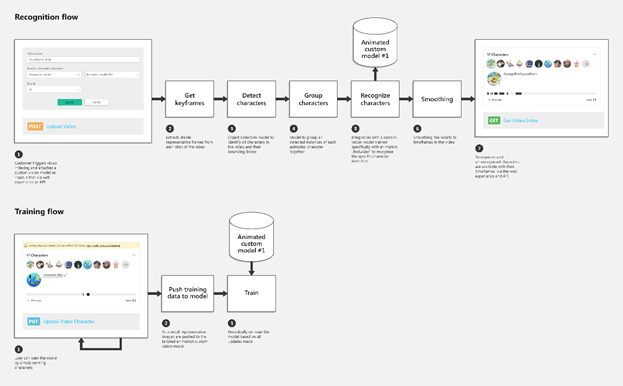

# Animated character detection (preview)

Azure Media Services Video Indexer supports detection, grouping, and recognition of characters in animated content via integration with [Cognitive Services custom vision](https://azure.microsoft.com/services/cognitive-services/custom-vision-service/). This functionality is available both through the portal and through the API.

After uploading an animated video with a specific animation model, Video Indexer extracts keyframes, detects animated characters in these frames, groups similar character, and chooses the best sample. Then, it sends the grouped characters to Custom Vision that identifies characters based on the models it was trained on. 

Before you start training your model, the characters are detected namelessly. As you add names and train the model the Video Indexer will recognize the characters and name them accordingly.

## Flow diagram

The following diagram demonstrates the flow of the animated character detection process.



## Accounts

Depending on a type of your Video Indexer account, different feature sets are available. For information on how to connect your account to Azure, see [Create a Video Indexer account connected to Azure](connect-to-azure.md).

* Trial account: Video Indexer uses an internal Custom Vision account to create model and connect it to your Video Indexer account. 
* Paid account: you connect your Custom Vision account to your Video Indexer account (if you don’t already have one, you need to create an account first).

### Trial vs. paid

|Functionality|Trial|Paid|
|---|---|---|
|Custom Vision account|Managed behind the scenes by Video Indexer. |Your Custom Vision account is connected to Video Indexer.|
|Number of animation models|One|Up to 100 models per account (Custom Vision limitation).|
|Training the model|Video Indexer trains the model for new characters additional examples of existing characters.|The account owner trains the model when they are ready to make changes.|
|Advanced options in Custom Vision|No access to the Custom Vision portal.|You can adjust the models yourself in the Custom Vision portal.|

## Use the animated character detection with portal 

This section describes the steps you need to take to start using the animated character detection model.

### Connect your Custom Vision account (paid accounts only)

If you own a Video Indexer paid account, you need to connect a Custom Vision account first. If you don’t have a Custom Vision account already, please create one. For more information, see [Custom Vision](https://docs.microsoft.com/azure/cognitive-services/custom-vision-service/home).

### Create an animated characters model

1. Browse to the [Video Indexer](https://vi.microsoft.com/) website and sign in.
1. Click on the content model customization button on the top-right corner of the page.

    
1. Go to the **Animated characters** tab in the model customization section.
1. Click on **Add model**.
1. Name you model and click enter to save the name.

> [!NOTE]
> The best practice is to have one custom vision model for each animated series. 

### Index a video with an animated model

1. Click on the **Upload** button from the top menu.
1. Choose a video to upload (from a file or a URL).
1. Click on **Advanced options**.
1. Under **People / Animated characters** choose **Animation models**.
1. If you have one model it will be chosen automatically, and if you have multiple models you can choose the relevant one out of the dropdown menu.
1. Click on upload.
1. Once the video is indexed, you will see the detected characters in the **Animated characters** section in the **Insights** pane.

> [!NOTE] 
> Before tagging and training the model, all animated characters will be named “Unknown #X”. After you train the model they will also be recognized.

### Customize the animated characters models

1. Tag and train the model.

    1. Tag the detected character by editing its name. Once a character is trained into the model it will be recognized it the next video indexed with that model. 
    1. To tag an animated character in your video, go to the **Insights** tab and click on the **Edit** button on the top-right corner of the window.
    1. In the **Insights** pane, click on any of the detected animated characters and change their names from "Unknown #X" (or the name that was previously assigned to the character).
    1. After typing in the new name, click on the check icon next to the new name. This saves the new name in the model in Video Indexer.
    1. After you finished editing all names you want, you need to train the model.

        * Trial accounts: open the customization page and click on the Animated characters tab and click on the **Train** button model you have.
        * Paid accounts: open the customization page and click on the Animated characters tab. For the relevant model, click on the **Edit in Custom Vision** link. You will then be forwarded to the model's page in Custom Vision. Click on the “Train” button there to train you model. 
    1. Once trained, any video that will be indexed or reindexed with that model will recognize the trained characters. 
    Paid accounts that have access to their Custom Vision account can see the models and tagged images there. Learn more about [improving your classifier in Custom Vision](https://docs.microsoft.com/azure/cognitive-services/custom-vision-service/getting-started-improving-your-classifier).

1. Delete an animated character.

    1. To delete an animated character in your video insights, go to the **Insights** tab and click on the **Edit** button on the top-right corner of the window.
    1. Choose the animated character and then click on the **Delete** button under their name.

    > [!NOTE]
    > This will delete the insight from this video but will not affect the model.

1. Delete a model.

    1. Click on the **Content model customization** button on the top menu and go to the **Animated characters** tab.
    1. Click on the ellipsis icon to the right of the model you wish to delete and then on the delete button.
    
    * Paid account: the model will be disconnected from Video Indexer and you will not be able to reconnect it.
    * Trial account: the model will be deleted from Customs vision as well. 
    
        > [!NOTE]
        > In a trial account, you only have one model you can use. After you delete it, you can’t train other models.

## Use the animated character detection with API 

1. Connect a Custom Vision account.

    If you own a Video Indexer paid account, you need to connect a Custom Vision account first. <br/>
    If you don’t have a Custom Vision account already, please create one. For more information, see [Custom Vision](https://docs.microsoft.com/azure/cognitive-services/custom-vision-service/home).

    [Connect your Custom Vision account using API](https://api-portal.videoindexer.ai/docs/services/Operations/operations/Connect-Custom-Vision-Account?tags=&pattern=&groupBy=tag).
1. Create an animated characters model.

    Use the [create animation model](https://api-portal.videoindexer.ai/docs/services/Operations/operations/Create-Animation-Model?&groupBy=tag) API.
1. Index or re-index a video.

    Use the [re-indexing](https://api-portal.videoindexer.ai/docs/services/operations/operations/Re-Index-Video?) API. 
1. Customize the animated characters models.

    Use the [train animation model](https://api-portal.videoindexer.ai/docs/services/Operations/operations/Train-Animation-Model?&groupBy=tag) API.

### View the output

See the animated characters in the generated JSON file.

```json
"animatedCharacters": [
    {
    "videoId": "e867214582",
    "confidence": 0,
    "thumbnailId": "00000000-0000-0000-0000-000000000000",
    "seenDuration": 201.5,
    "seenDurationRatio": 0.3175,
    "isKnownCharacter": true,
    "id": 4,
    "name": "Bunny",
    "appearances": [
        {
            "startTime": "0:00:52.333",
            "endTime": "0:02:02.6",
            "startSeconds": 52.3,
            "endSeconds": 122.6
        },
        {
            "startTime": "0:02:40.633",
            "endTime": "0:03:16.6",
            "startSeconds": 160.6,
            "endSeconds": 196.6
        },
    ]
    },
]
```

## Limitations

* Currently, the "animation identification" capability is not supported in East-Asia region.
* Characters that appear to be small or far in the video may not be identified properly if the video's quality is poor.
* The recommendation is to use a model per set of animated characters (for example per an animated series).

## Next steps

[Video Indexer overview](video-indexer-overview.md)
