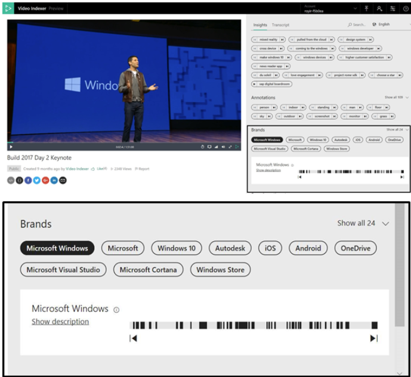

# Customize a Brands model in Video Indexer

Video Indexer supports brand detection from speech and visual text during indexing and reindexing of video and audio content. The brand detection feature identifies mentions of products, services, and companies suggested by Bing's brands database. For example, if Microsoft is mentioned in a video or audio content or if it shows up in visual text in a video, Video Indexer detects it as a brand in the content. Brands are disambiguated from other terms using context.

Brand detection is useful in a wide variety of business scenarios such as contents archive and discovery, contextual advertising, social media analysis, retail compete analysis, and many more. Video Indexer brand detection enables you to index brand mentions in speech and visual text, using Bing's brands database as well as with customization by building a custom Brands model for each Video Indexer account. The custom Brands model feature allows you to select whether or not Video Indexer will detect brands from the Bing brands database, exclude certain brands from being detected (essentially creating a black list of brands), and include brands that should be part of your model that might not be in Bing's brands database (essentially creating a white list of brands). The custom Brands model that you create will only be available in the account in which you created the model.

## Out of the box detection example

In the [Microsoft Build 2017 Day 2](https://www.videoindexer.ai/media/ed6ede78ad/) presentation, the brand "Microsoft Windows" appears multiple times. Sometimes in the transcript, sometimes as visual text and never as verbatim. Video Indexer detects with high precision that a term is indeed brand based on the context, covering over 90k brands out of the box, and constantly updating. At 02:25, Video Indexer detects the brand from speech and then again at 02:40 from visual text, which is part of the windows logo.

Talking about windows in the context of construction will not detect the word "Windows" as a brand, and same for Box, Apple, Fox, etc., based on advanced Machine Learning algorithms that know how to disambiguate from context. Brand Detection works for all our supported languages. Click here for [full Microsoft Build 2017 Day 2 keynote video and index](https://www.videoindexer.ai/media/ed6ede78ad/).

To bring your own brands, check out Next steps.

## Next steps

[Customize Brands model using APIs](customize-brands-model-with-api.md)

[Customize Brands model using the website](customize-brands-model-with-website.md)
