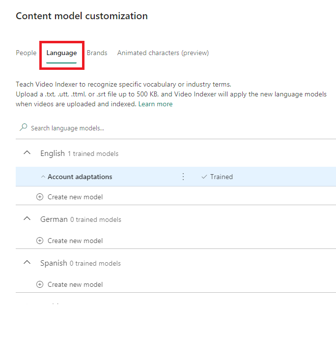
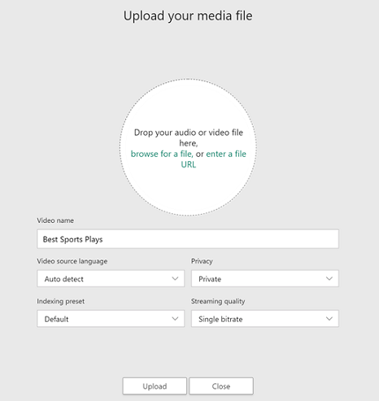
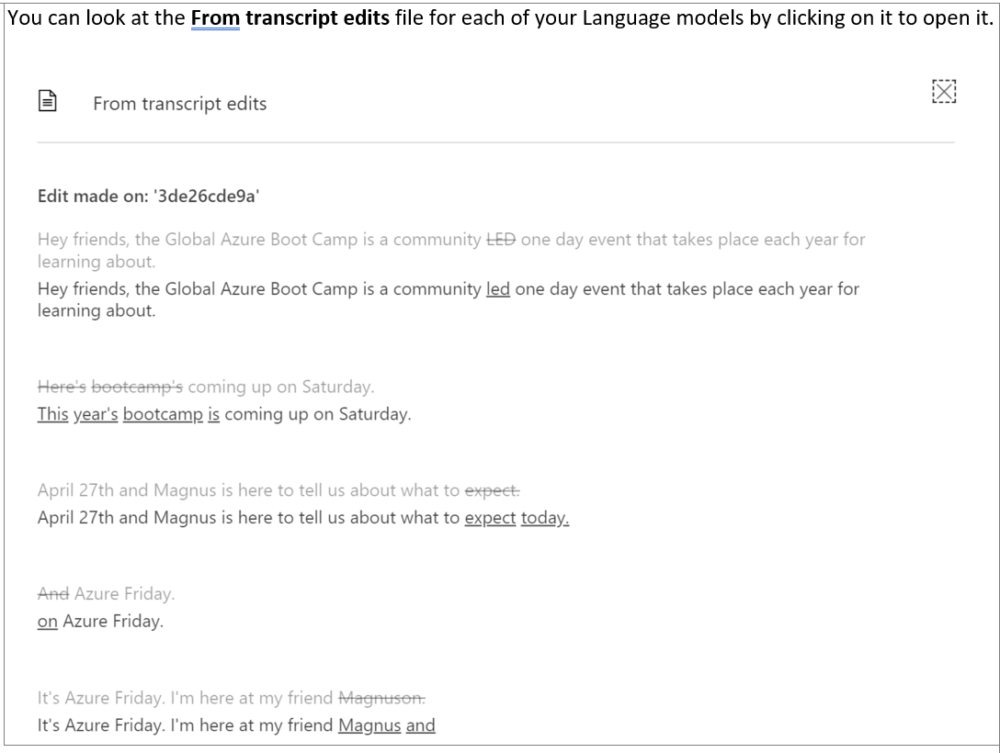

# Customize a Language model with the Video Indexer website

Video Indexer lets you create custom Language models to customize speech recognition by uploading adaptation text, namely text from the domain whose vocabulary you'd like the engine to adapt to. Once you train your model, new words appearing in the adaptation text will be recognized. 

For a detailed overview and best practices for custom language models, see [Customize a Language model with Video Indexer](customize-language-model-overview.md).

You can use the Video Indexer website to create and edit custom Language models in your account, as described in this topic. You can also use the API, as described in [Customize Language model using APIs](customize-language-model-with-api.md).

## Create a Language model

1. Browse to the [Video Indexer](https://www.videoindexer.ai/) website and sign in.
2. To customize a model in your account, click on the **Content model customization** button on the top-right corner of the page.

   

3. Select the **Language** tab.

    You see a list of supported languages. 

    

4. Under the language that you want, click **Add model**.
5. Type in the name for the Language model and hit enter.

    This creates the model and gives the option to upload text files to the model.
6. To add a text file, click **Add file**. This opens up your file explorer.

7. Navigate to and select the text file. You can add multiple text files to a Language model.

    You can also add a text file by clicking on the **...** button on the right side of the Language model and selecting **Add file**.
8. Once you are done uploading the text files, click on the green **Train** option.

    

The training process can take a few minutes. Once the training is done, you see **Trained** next to the model. You can preview, download, and delete the file from the model.

### Using a Language model on a new video

To use your Language model on a new video, do one of the following:

* Click on the **Upload** button on the top of the page 

    
* Drop your audio or video file in the circle or browse for your file

    

This will give you the option to select the **Video source language**. Click on the drop-down and select a Language model that you created from the list. It should say the language of your Language model and the name that you gave it in parentheses.

Click the **Upload** option in the bottom of the page, and your new video will be indexed using your Language model.

### Using a Language model to reindex

To use your Language model to reindex a video in your collection, go to your **Account videos** on the [Video Indexer](https://www.videoindexer.ai/) home page and hover over the name of the video that you want to reindex.

You see options to edit your video, delete you video, and reindex your video. Click on the option to reindex your video.

This gives you the option to select the **Video source language** to reindex your video with. Click on the drop-down and select a Language model that you created from the list. It should say the language of your language model and the name that you gave it in parentheses.

Click the **Re-index** button, and your video will be reindexed using you Language model.

## Edit a Language model

You can edit a Language model by changing its name, adding files to it, and deleting files from it.

If you add or delete files from the Language model, you will have to train the model again by clicking in the green **Train** option.

### Rename the Language model

You can change the name of the Language model by clicking **...** on the right side of the Language model and selecting **Rename**. 

Type in the new name and hit enter.

### Add files

To add a text file, click **Add file**. This opens up your file explorer.

Navigate to and select the text file. You can add multiple text files to a Language model.

You can also add a text file by clicking on the **...** button on the right side of the Language model and selecting **Add file**.

### Delete files

To delete a file from the Language model, click the **...** button on the right side of the text file and select **Delete**. This brings up a new window telling you that the deletion cannot be undone. Click the **Delete** option in the new window.

This action removes the file completely from the Language model.

## Delete a Language model

To delete a Language model from your account, click the **...** button on the right side of the Language model and select **Delete**.

This brings up a new window telling you that the deletion cannot be undone. Click the **Delete** option in the new window.

This action removes the Language model completely from your account. Any video that was using the deleted Language model will keep the same index until you re-index the video. If you re-index the video, you can assign a new Language model to the video. Otherwise,  Video Indexer will use its default model to re-index the video. 

## Customize Language models by correcting transcripts

Video Indexer supports automatic customization of Language models based on the actual corrections users make to the transcriptions of their videos.

1. To make corrections to a transcript, open up the video that you want to edit from your Account Videos. Select the **Timeline** tab.

    
1. Click on the pencil icon to edit the transcript of your transcription. 

    

    Video Indexer captures all lines that are corrected by you in the transcription of your video and adds them automatically to a text file called "From transcript edits". These edits are used to re-train the specific Language model that was used to index this video. 
    
    If you did not specify a Language model when indexing this video, then all edits for this video will be stored in a default Language model called Account adaptations within the detected language of the video. 
    
    In case multiple edits have been made to the same line, only the last version of the corrected line will be used for updating the Language model.  
    
    > [!NOTE]
    > Only textual corrections are used for the customization. This means that corrections that do not involve actual words (for example, punctuation marks or spaces) are not included. 
    
1. You will see transcript corrections show up in the Language tab of the Content model customization page.

    

   To look at the "From transcript edits" file for each of your Language models, click on it to open it. 

    

## Next steps

[Customize language model using APIs](customize-language-model-with-api.md)
