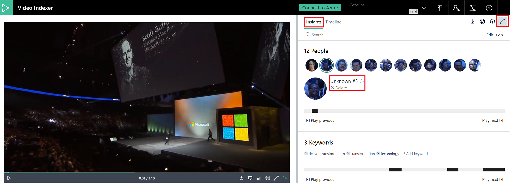

# Customize a Person model with the Video Indexer website

Video Indexer supports face detection and celebrity recognition for video content. The celebrity recognition feature covers approximately one million faces based on commonly requested data source such as IMDB, Wikipedia, and top LinkedIn influencers. Faces that are not recognized by the celebrity recognition feature are detected; however, they are left unnamed. After you upload your video to Video Indexer and get results back, you can go back and name the faces that were not recognized. Once you label a face with a name, the face and name get added to your account's Person model. Video Indexer will then recognize this face in your future videos and past videos.

You can use the Video Indexer website to edit faces that were detected in a video, as described in this topic. You can also use the API, as described in [Customize person model using APIs](customize-person-model-with-api.md).

## Edit a face

> [!NOTE]
> Names are unique for in a Person models, so if you name two different faces the same name, Video Indexer views the faces as the same person and converges them once you reindex your video. If you see that Video Indexer detected multiple different occurrences of the same face, give them the same name and reindex your video.
> You can update a face that Video Indexer recognized as a celebrity with a new name. The new name that you give will take precedence over the built-in celebrity recognition.

1. Browse to the [Video Indexer](https://www.videoindexer.ai/) website and sign in.
2. Search for a video you want to view and edit in your account.
3. To edit a face in your video, go to the **Insights** tab and click on the pencil icon on the top-right corner of the window.

    

4. Click on any of the detected faces and change their names from "Unknown #X" (or the name that was previously assigned to the face).
5. After typing in the new name, click on the check icon next to the new name. This will save the new name and recognize and name all occurrences of this face in your other current videos and in the future videos that you upload. Recognition of the face in your other current videos might take some time to take effect as this is a batch process. 

    

## Delete a face

To delete a detected face in your video, go to the **Insights** pane and click on the pencil icon on the top-right corner of the pane. Click the **Delete** option underneath the name of the face. This will remove that detected face from the video. The face will still be detected in the other videos in which they appear, but you can delete the face from those videos as well after they have been indexed. The face will also continue to exist in your account's Person model if you named it before deleting it.

## Next steps

[Customize Person model using APIs](customize-person-model-with-api.md)
