# Customize a Person model with the Video Indexer website

Video Indexer supports celebrity recognition for video content. The celebrity recognition feature covers approximately one million faces based on commonly requested data source such as IMDB, Wikipedia, and top LinkedIn influencers. For a detailed overview, see [Customize a Person model in Video Indexer](customize-person-model-overview.md).

You can use the Video Indexer website to edit faces that were detected in a video, as described in this topic. You can also use the API, as described in [Customize a Person model using APIs](customize-person-model-with-api.md).

## Central management of Person models in your account

1. To view, edit, and delete the Person models in your account, browse to the Video Indexer website and sign in.
2. Click on the content model customization button on the top-right corner of the page.

    
3. Select the People tab.

    You will see the Default Person model in your account. The Default Person model holds any faces you may have edited or changed in the insights of your videos for which you did not specify a custom Person model during indexing. 

    If you created other Person models, they will be listed on this page as well. 

    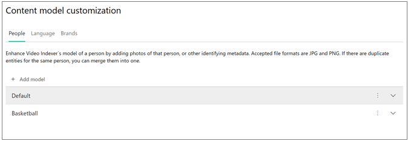

## Create a new Person model

1. Click the **+ Add model** button.

    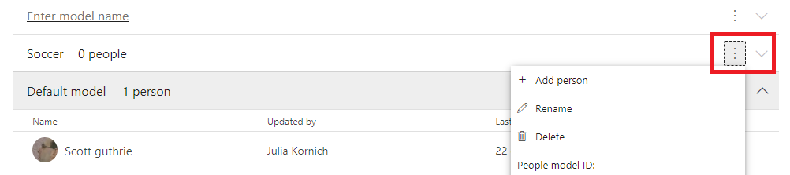
2. Enter the name of the model and click on the check button next to the name.

    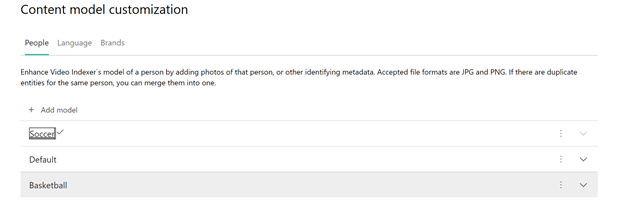

    You have created a new Person model. You can now add faces to the new Person model.
3. Click the list menu button and choose **+ Add person**.

    
    
## Add a new person to a Person model

> [!NOTE]
> Video Indexer allows you to add multiple people with the same name in a Person model. However, it is recommended that you give unque names to each person in your model for usability and clarity.

1. To add a new face to a Person model, click on the list menu button next to the Person model that you want to add the face to.
1. Click **+ Add person** from the menu.

    
 
    A pop-up will prompt you to fill out the Person's details. Type in the name of the person and click on the check button.

    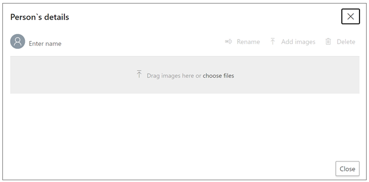
 
You can then choose from your file explorer or drag and drop the face images of the face. Video Indexer will take all standard image file types (ex: JPG, PNG, and more).

Video Indexer should be able to detect occurrences of this person in the future videos that you index and the current videos that you had already indexed, using the Person model to which you added this new face to. Recognition of the person in your current videos might take some time to take effect, as this is a batch process.

## Rename a Person model

You can rename any Person model in your account including the Default Person model. Even if you rename your default Person model, it will still serve as the Default person model in your account.

1. Click on the list menu button next to the Person model that you want to rename.
2. Click **Rename** from the menu.

    
3. Click on the current name of the model and type in your new name.

    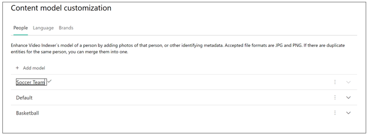
4. Click on the check button for your model to be renamed.

## Delete a Person model

You can delete any Person model that you created in your account. However, you cannot delete your Default person model.

1. Click **Delete** from the menu.

    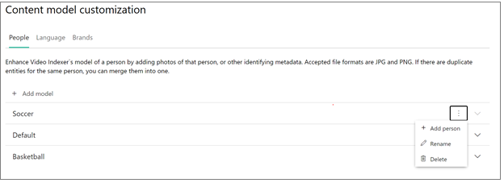
    
    A pop-up will show up and notify you that this action will delete the Person model and all of the people and files that it contains. This action cannot be undone. 

    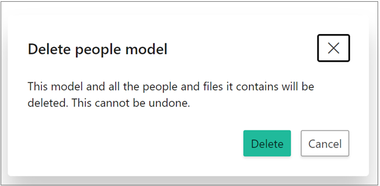
1. If you are sure, click delete again.

> [!NOTE]
> The existing videos that were indexed using this (now deleted) Person model will not support the ability for you to update the names of the faces that appear in the video. You will be able to edit the names of faces in these videos only after you reindex them using another Person model. If you reindex without specifying a Person model, the default model will be used. 

## Manage existing people in a Person model

To look at the contents of any of your Person models, click on the arrow next to the name of the Person model.
The drop-down shows you all of the people in that particular Person model. If you click on the list menu button next to each of the people, you see manage, rename, and delete options.  

### Rename a person

1. To rename a person in your Person model, click the list menu button and choose **Rename** from the list menu.
1. Click the current name of the person and type in your new name.
1. Click on the check button, and the person will be renamed.

### Delete a person

1. To delete a person from your Person model, click the list menu button and choose **Delete** from the list menu.
1. A pop-up tells you that this action will delete the person and that this action cannot be undone.
1. Click Delete again and this will remove the person from the Person model.

### Manage a person

If you click on **Manage**, you see all the faces that this Person model is being trained from. These faces come from occurrences of that person in videos that use this Person model or from images that you have manually uploaded. 

You can add more faces to the person by clicking Add images.

You can use the manage pane to rename the person and to delete the person from the Person model.

## Use a Person model to index a video

You can use a Person model to index your new video by assigning the Person model during the upload of the video.

To use your Person model on a new video, do the following:

1. Click the **Upload** button on the top of the page.

    
1. Drop your video file in the circle or browse for your file.
1. Click the Advanced options arrow.

    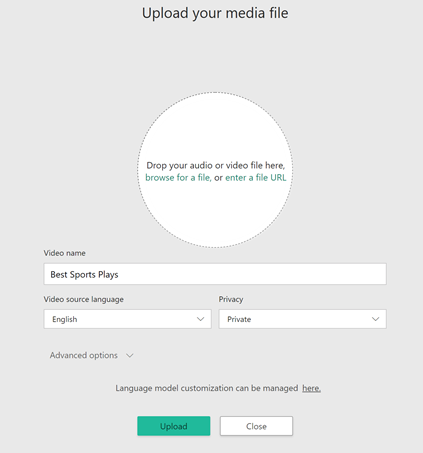
1. Click the drop-down and select the Person model that you created.

    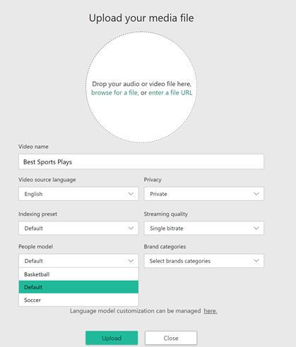
1. Click the Upload option in the bottom of the page, and your new video will be indexed using your Person model.

If you do not specify a Person model during the upload, Video Indexer will index the video using the Default Person model in your account.

## Use a Person model to reindex a video 

To use a Person model to reindex a video in your collection, go to your Account videos on the Video Indexer home page and hover over the name of the video that you want to reindex.

You see options to edit, delete, and reindex your video. 

1. Click the option to reindex your video.

    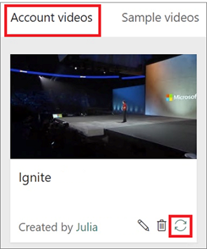

    You can now select the Person model to reindex your video with.
1. Click the drop-down and select the Person model that you want to use. 

    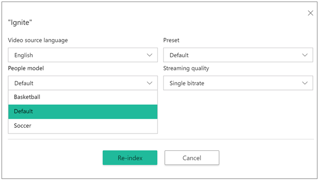

1. Click the **Reindex** button, and your video will be reindexed using your Person model.

Any new edits that you make to the faces detected and recognized in the video that you just reindexed will be saved in the Person model that you used to reindex the video.

## Managing people in your videos

You can manage the faces that are detected and people that were recognized in the videos that you index by editing and deleting faces.

Deleting a face, removes a specific face from the insights of the video.

Editing a face, renames a face that is detected and possibly recognized in your video. When you edit a face in your video, that name is saved as a person entry in the Person model that was assigned to the video during upload and indexing.

If you do not assign a Person model to the video during upload, your edit is saved in your account's Default person model.

### Edit a face

> [!NOTE]
> If a Person model has two or more different people with the same name, you will not be able to tag that name within the videos that use that Person model. You will only be able to make changes to people that share that name in the People tab of the content model customization page in Video Indexer. For this reason, it is recommended that you give unique names to each person in your Person model.

1. Browse to the Video Indexer website and sign in.
1. Search for a video you want to view and edit in your account.
1. To edit a face in your video, go to the Insights tab and click on the pencil icon on the top-right corner of the window.

    
1. Click on any of the detected faces and change their names from "Unknown #X" (or the name that was previously assigned to the face). 
1. After typing in the new name, click on the check icon next to the new name. This saves the new name and recognizes and names all occurrences of this face in your other current videos and in the future videos that you upload. Recognition of the face in your other current videos might take some time to take effect, as this is a batch process.

If you name a face with the name of an existing person in the Person model that the video is using, this will merge the detected face images from this video of that person with what already exists in the model. If you name a face with a completely new name, this will create a new Person entry in the Person model that the video is using. 

    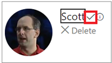

### Delete a face

To delete a detected face in your video, go to the Insights pane and click on the pencil icon on the top-right corner of the pane. Click the Delete option underneath the name of the face. 
This will remove that detected face from the video. The person’s face will still be detected in the other videos in which it appears, but you can delete the face from those videos as well after they have been indexed. The person, if it had been named, will also continue to exist in the Person model that was used to index the video from which you deleted the face unless you specifically delete the person from the Person model.

## Next steps

[Customize Person model using APIs](customize-person-model-with-api.md)
