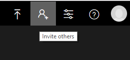
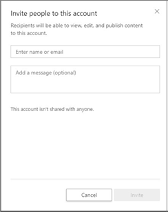

# Quickstart: Invite users to Video Indexer

To collaborate with your colleagues, you can invite them to your Video Indexer account. 

> [!NOTE]
> Only the account’s admin can add or remove users.

## Invite new users

1. Sign in on the [Video Indexer](https://www.videoindexer.ai/) website. Make sure you are connected with an admin account.
1. Click the **Invite others** button on the top menu:

   

1. Add the email addresses of the people you want to add to your Video Indexer account:

    
        
    >[!NOTE]
    > All the users you invite will have read and write permission to all of the videos in your account.
1. The users you invited will get an email with a link and will be able to access the account once they click on the **Join Video Indexer** link:

    

    The user must click on the link to join in order to gain access to the account. 

## Removing existing users

If you want to remove users that have access to your account, you can click on the **X** sign next to their name:

Users do not receive a notification upon removal. Once removed, users will not be authorized  to log in.

## Next steps

You can now use the [Video Indexer website](video-indexer-view-edit.md) or [Video Indexer Developer Portal](video-indexer-use-apis.md) to see the insights of the video.

## See also

- [Video Indexer overview](video-indexer-overview.md)
- [How to sign up and upload your first video](video-indexer-get-started.md)
- [Start using APIs](video-indexer-use-apis.md)
