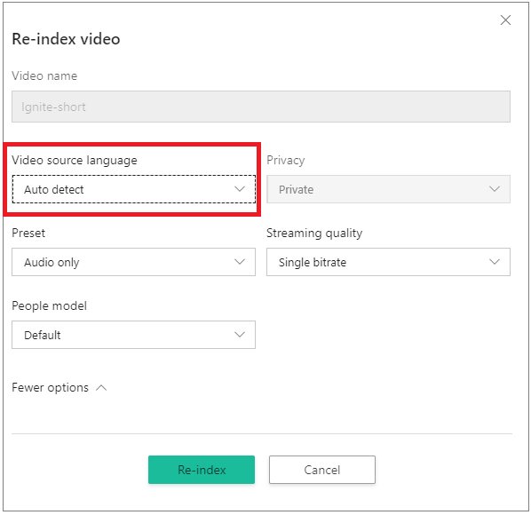

# Automatically ID the spoken language with Language Identification model

Video Indexer supports automatic language identification (LID), which is the process of automatically identifying the spoken language content from audio and sending the media file to be transcribed in the dominant identified language. Currently LID supports English, Spanish, French, German, Italian, Chinese (Simplified), Japanese, Russian, and Portuguese (Brazilian). 

## Choosing auto language identification on indexing

When indexing or [re-indexing](https://api-portal.videoindexer.ai/docs/services/operations/operations/Re-Index-Video?) a video using the API, choose the `auto detect` option in the `sourceLanguage` parameter.

When using portal, go to your **Account videos** on the [Video Indexer](https://www.videoindexer.ai/) home page and hover over the name of the video that you want to re-index. On the right-bottom corner click the re-index button. In the **Re-index video** dialog, choose *Auto detect* from the **Video source language** drop-down box.



## Model output

Video Indexer transcribes the video according to the most likely language if the confidence for that language is `> 0.6`. If the language cannot be identified with confidence, it assumes the spoken language is English. 

Model dominant language is available in the insights JSON as the `sourceLanguage` attribute (under root/videos/insights). A corresponding confidence score is also available under the `sourceLanguageConfidence` attribute.

```json
"insights": {
        "version": "1.0.0.0",
        "duration": "0:05:30.902",
        "sourceLanguage": "fr-FR",
        "language": "fr-FR",
        "transcript": [...],
        . . .
        "sourceLanguageConfidence": 0.8563
      },
```
 
In addition, a verbose response through the [Artifact auxiliary API](https://api-portal.videoindexer.ai/docs/services/operations/operations/get-video-artifact-download-url/) is available (set `languageDetection` as the `type` parameter value). The verbose response contains the dominant language and the confidence score of each supported language. The confidence for each segment detected as speech / non-speech and a detailed segmentation of the file to detected language intervals with corresponding confidence of each of the supported languages. 

## Guidelines and limitation

* Supported languages include English, Spanish, French, German, Italian, Chinese (Simplified), Japanese, Russian, and Brazilian Portuguese.
* If the audio contains languages other than the supported list above, the result is unexpected.
* If Video Indexer cannot identify the language with a high enough confidence (`>0.6`), the fallback language is English.
* There is no current support for file with mixed languages audio. If the audio contains mixed languages, the result is unexpected. 
* Low-quality audio caustic may impact the model results.
* The model requires at least one minute of speech in the audio.
* The model is designed to recognize a spontaneous conversational speech (not voice commands, singing, etc.).

## Next steps

[Overview](video-indexer-overview.md)
