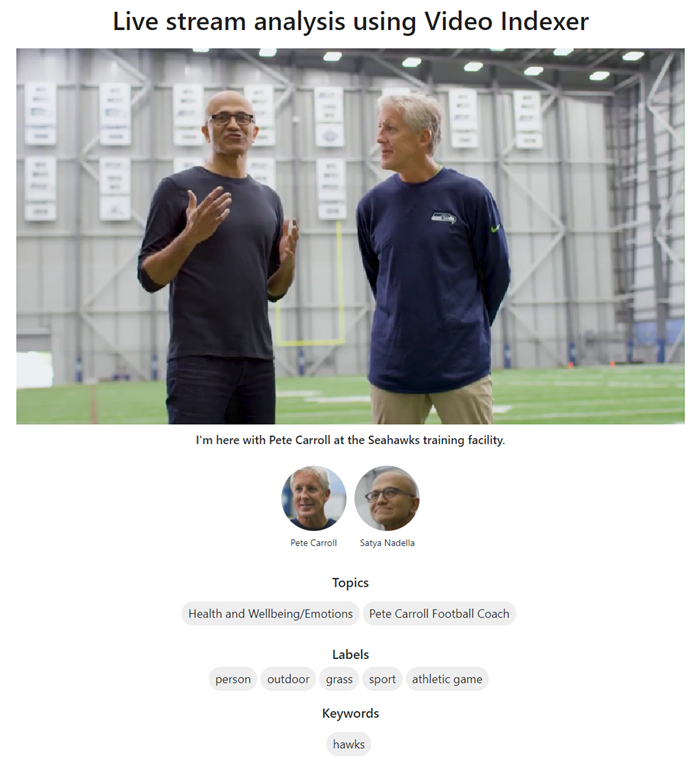

# Live stream analysis with Video Indexer

Azure Media Services Video Indexer is an Azure service designed to extract deep insights from video and audio files offline. This is to analyze a given media file already created in advance. However, for some use cases it's important to get the media insights from a live feed as quick as possible to unlock operational and other use cases pressed in time. For example, such rich metadata on a live stream could be used by content producers to automate TV production.

A solution described in this article, allows customers to use Video Indexer in near real-time resolutions on live feeds. The delay in indexing can be as low as four minutes using this solution, depending on the chunks of data being indexed, the input resolution, the type of content and the compute powered used for this process.

*Figure 1 – Sample player displaying the Video Indexer metadata on the live stream*

The [stream analysis solution](https://aka.ms/livestreamanalysis) at hand, uses Azure Functions and two Logic Apps to process a live program from a live channel in Azure Media Services with Video Indexer and displays the result with Azure Media Player showing the near real-time resulted stream.

In high level, it is comprised of two main steps. The first step runs every 60 seconds, and takes a subclip of the last 60 seconds played, creates an asset from it and indexes it via Video Indexer. Then the second step is called once indexing is complete. The insights captured are processed, sent to Azure Cosmos DB, and the subclip indexed is deleted.

The sample player plays the live stream and gets the insights from Azure Cosmos DB, using a dedicated Azure Function. It displays the metadata and thumbnails in sync with the live video.

*Figure 2 – The two logic apps processing the live stream every minute in the cloud.*

## Step-by-step guide 

The full code and a step-by-step guide to deploy the results can be found in [GitHub project for Live media analytics with Video Indexer](https://aka.ms/livestreamanalysis). 

## Next steps

[Video Indexer overview](video-indexer-overview.md)
