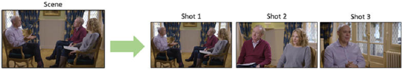
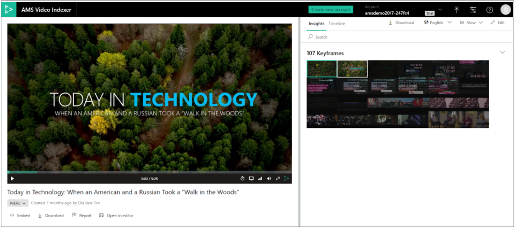

# Scenes, shots, and keyframes

Video Indexer supports segmenting videos into temporal units based on structural and semantic properties. This capability enables customers to easily browse, manage, and edit their video content based on varying granularities. For example, based on scenes, shots, and keyframes, described in this topic.   


 
## Scene detection  
 
Video Indexer determines when a scene changes in video based on visual cues. A scene depicts a single event and it is composed of a series of consecutive shots, which are semantically related. A scene thumbnail is the first keyframe of its underlying shot. Video indexer segments a video into scenes based on color coherence across consecutive shots and retrieves the beginning and end time of each scene. Scene detection is considered a challenging task as it involves quantifying semantic aspects of videos.

> [!NOTE]
> Applicable to videos that contain at least 3 scenes.

## Shot detection

Video Indexer determines when a shot changes in the video based on visual cues, by tracking both abrupt and gradual transitions in the color scheme of adjacent frames. The shot's metadata includes a start and end time, as well as the list of keyframes included in that shot. The shots are consecutive frames taken from the same camera at the same time.

## Keyframe detection

Video Indexer selects the frame(s) that best represent each shot. Keyframes are the representative frames selected from the entire video based on aesthetic properties (for example, contrast and stableness). Video Indexer retrieves a list of keyframe IDs as part of the shot's metadata, based on which customers can extract the keyframe as a high resolution image.  

### Extracting Keyframes

To extract high-resolution keyframes for your video, you must first upload and index the video.



#### With the Video Indexer website

To extract keyframes using the Video Indexer website, upload and index your video. Once the indexing job is complete, click on the **Download** button and select **Artifacts (ZIP)**. This will download the artifacts folder to your computer. 


 
Unzip and open the folder. In the *_KeyframeThumbnail* folder, and you will find all of the keyframes that were extracted from your video. 

#### With the Video Indexer API

To get keyframes using the Video Indexer API, upload and index your video using the [Upload Video](https://api-portal.videoindexer.ai/docs/services/Operations/operations/Upload-Video?) call. Once the indexing job is complete, call [Get Video Index](https://api-portal.videoindexer.ai/docs/services/Operations/operations/Get-Video-Index?). This will give you all of the insights that Video Indexer extracted from your content in a JSON file.  

You will get a list of keyframe IDs as part of each shot's metadata. 

```json
"shots":[  
    {  
      "id":0,
      "keyFrames":[  
          {  
            "id":0,
            "instances":[  
                {  
                  "thumbnailId":"00000000-0000-0000-0000-000000000000",
                  "start":"0:00:00.209",
                  "end":"0:00:00.251",
                  "duration":"0:00:00.042"
                }
            ]
          },
          {  
            "id":1,
            "instances":[  
                {  
                  "thumbnailId":"00000000-0000-0000-0000-000000000000",
                  "start":"0:00:04.755",
                  "end":"0:00:04.797",
                  "duration":"0:00:00.042"
                }
            ]
          }
      ],
      "instances":[  
          {  
            "start":"0:00:00",
            "end":"0:00:06.34",
            "duration":"0:00:06.34"
          }
      ]
    },

]
```

You will now need to run each of these keyframe IDs on the [Get Thumbnails](https://api-portal.videoindexer.ai/docs/services/Operations/operations/Get-Video-Thumbnail?) call. This will download each of the keyframe images to your computer. 

## Editorial shot type detection

Keyframes are associated with shots in the output JSON. 

The shot type associated with an individual shot in the insights JSON represents its editorial type. You may find these shot type characteristics useful when editing videos into clips, trailers, or when searching for a specific style of keyframe for artistic purposes. The different types are determined based on analysis of the first keyframe of each shot. Shots are identified by the scale, size, and location of the faces appearing in their first keyframe. 

The shot size and scale are determined based on the distance between the camera and the faces appearing in the frame. Using these properties, Video Indexer detects the following shot types:

* Wide: shows an entire person’s body.
* Medium: shows a person's upper-body and face.
* Close up: mainly shows a person’s face.
* Extreme close-up: shows a person’s face filling the screen. 

Shot types can also be determined by location of the subject characters with respect to the center of the frame. This property defines the following shot types in Video Indexer:

* Left face: a person appears in the left side of the frame.
* Center face: a person appears in the central region of the frame.
* Right face: a person appears in the right side of the frame.
* Outdoor: a person appears in an outdoor setting.
* Indoor: a person appears in an indoor setting.

Additional characteristics:

* Two shots: shows two persons’ faces of medium size.
* Multiple faces: more than two persons.


## Next steps

[Examine the Video Indexer output produced by the API](video-indexer-output-json-v2.md#scenes)
