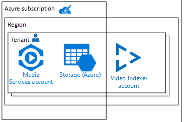
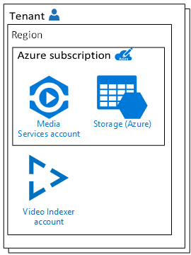

# Handle Video Indexer business continuity and disaster recovery

Azure Media Services Video Indexer does not provide instant failover of the service if there is a regional datacenter outage or failure. This article explains how to configure your environment for a failover to ensure optimal availability for applications and minimized recovery time if a disaster occurs.

We recommend that you configure business continuity disaster recovery (BCDR) across regional pairs to benefit from Azure’s isolation and availability policies. For more information, see [Azure paired regions](https://docs.microsoft.com/azure/best-practices-availability-paired-regions).

## Prerequisites 

An Azure subscription. If you don't have an Azure subscription yet, sign up for [Azure Free Trial](https://azure.microsoft.com/free/).

## Failover to a secondary account

In order to handle BCDR, you need to have two Video Indexer accounts. 

1. Review  [Manage multiple tenants](manage-multiple-tenants.md).
1. Choose one of the following multi tendency options.

    * Video Indexer account per tenant
    
        
    * Azure subscription per tenant
    
        
1. Create two [Video Indexer accounts connected to Azure](connect-to-azure.md).

## Next steps

[Manage a Video Indexer account connected to Azure](manage-account-connected-to-azure.md)
