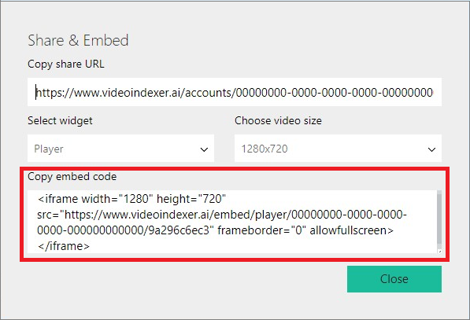

# Embed Video Indexer widgets in your applications

This article shows how you can embed Video Indexer widgets in your applications. Video Indexer supports embedding three types of widgets into your application: *Cognitive Insights*, *Player*, and *Editor*. 

Starting with version 2, the widget base URL includes the region of the specified account. For example, an account in the West US region generates: `https://wus2.videoindexer.ai/embed/insights/...`.

## Widget types

### Cognitive Insights widget

A Cognitive Insights widget includes all visual insights that were extracted from your video indexing process. The Cognitive Insights widget supports the following optional URL parameters.

|Name|Definition|Description|
|---|---|---|
|`widgets`|Strings separated by comma|Allows you to control the insights that you want to render.   Example: `https://www.videoindexer.ai/embed/insights/<accountId>/<videoId>/?widgets=people,search` renders only people and brands UI insights. Available options: people, keywords, annotations, brands, sentiments, transcript, search. Note that the `widgets` URL parameter isn't supported in version 2. |
|`locale`|A short language code|Controls the insights language. The default value is `en`.   Example: `locale=de`.|
|`tab`|The default selected tab|Controls the **Insights** tab that's rendered by default.   Example: `tab=timeline` renders the insights with the **Timeline** tab selected.|

### Player widget

You can use the Player widget to stream video by using adaptive bit rate. The Player widget supports the following optional URL parameters.

|Name|Definition|Description|
|---|---|---|
|`t`|Seconds from the start|Makes the player start playing from the specified time point.  Example: `t=60`.|
|`captions`|A language code|Fetches the caption in the specified language during the widget loading to be available on the **Captions** menu.  Example: `captions=en-US`.|
|`showCaptions`|A Boolean value|Makes the player load with the captions already enabled.  Example: `showCaptions=true`.|
|`type`||Activates an audio player skin (the video part is removed).  Example: `type=audio`.|
|`autoplay`|A Boolean value|Indicates if the player should start playing the video when loaded. The default value is `true`.  Example: `autoplay=false`.|
|`language`|A language code|Controls the player language. The default value is `en-US`. Example: `language=de-DE`.|

### Editor widget

You can use the Editor widget to create new projects and manage a video's insights. The Editor widget supports the following optional URL parameters.

|Name|Definition|Description|
|---|---|---|
|`accessToken`*|String|Provides access to videos that are only in the account that is used to embed the widget.  The Editor widget requires the `accessToken` parameter.|
|`language`|A language code|Controls the player language. The default value is `en-US`. Example: `language=de-DE`.|
|`locale`|A short language code|Controls the insights language. The default value is `en`. Example: `language=de`.|

*The owner should provide `accessToken` with caution.

## Embedding public content

1. Sign in to the [Video Indexer](https://www.videoindexer.ai/) website.
2. Select the video that you want to work with.
3. Select the **Embed** button that appears under the video.

	

	After you select the **Embed** button, you can select the widget that you want to embed in your application. 
4. Select the type of widget that you want (**Cognitive Insights**, **Player**, or **Editor**).
 
5. Copy the embed code, and then add it to your application. 

	

> [!NOTE]
> If you have issues sharing your video URLs, add the `location` parameter to the link. The parameter should be set to the [Azure regions in which Video Indexer exists](regions.md). For example: `https://www.videoindexer.ai/accounts/00000000-0000-0000-0000-000000000000/videos/b2b2c74b8e/?location=trial`.

## Embedding private content

To embed a private video, you must pass an access token in the **src** attribute of the iframe:

`https://www.videoindexer.ai/embed/[insights | player]/<accountId>/<videoId>/?accessToken=<accessToken>`
    
To get the Cognitive Insights widget content, use one of the following: 
- The [Get Insights Widget](https://api-portal.videoindexer.ai/docs/services/operations/operations/Get-Video-Insights-Widget?&pattern=widget) API. 
- The [Get Video Access Token](https://api-portal.videoindexer.ai/docs/services/authorization/operations/Get-Video-Access-Token?). Add it as a query parameter to the URL. Specify this URL as the **src** value for the iframe, as shown earlier.

To provide editing insights capabilities in your embedded widget, you must pass an access token that includes editing permissions. Use [Get Insights Widget](https://api-portal.videoindexer.ai/docs/services/operations/operations/Get-Video-Insights-Widget?&pattern=widget) or [Get Video Access Token](https://api-portal.videoindexer.ai/docs/services/authorization/operations/Get-Video-Access-Token?) with `&allowEdit=true`. 

## Widgets interaction

The Cognitive Insights widget can interact with a video on your application. This section shows how to achieve this interaction.

### Cross-origin communications

To get Video Indexer widgets to communicate with other components, the Video Indexer service:

- Uses the cross-origin communication HTML5 method **postMessage**. 
- Validates the message across VideoIndexer.ai origin. 

If you implement your own player code and integrate with Cognitive Insights widgets, it's your responsibility to validate the origin of the message that comes from VideoIndexer.ai.

### Embed widgets in your application or blog (recommended) 

This section shows how to achieve interaction between two Video Indexer widgets so that when a user selects the insight control on your application, the player jumps to the relevant moment.

1. Copy the Player widget embed code.
2. Copy the Cognitive Insights embed code.
3. Add the [Mediator file](https://breakdown.blob.core.windows.net/public/vb.widgets.mediator.js) to handle the communication between the two widgets:  
``

Now when a user selects the insight control on your application, the player jumps to the relevant moment.

For more information, see the [Video Indexer - Embed both Widgets demo](https://codepen.io/videoindexer/pen/NzJeOb).

### Embed the Cognitive Insights widget and use Azure Media Player to play the content

This section shows how to achieve interaction between a Cognitive Insights widget and an Azure Media Player instance by using the [AMP plug-in](https://breakdown.blob.core.windows.net/public/amp-vb.plugin.js).
 
1. Add a Video Indexer plug-in for the AMP player:  ``
2. Instantiate Azure Media Player with the Video Indexer plug-in.

		// Init the source.
		function initSource() {
		    var tracks = [{
			kind: 'captions',
			// To load vtt from VI, replace it with your vtt URL.
			src: this.getSubtitlesUrl("c4c1ad4c9a", "English"),
			srclang: 'en',
			label: 'English'
		    }];

		    myPlayer.src([
			{
			    "src": "//amssamples.streaming.mediaservices.windows.net/91492735-c523-432b-ba01-faba6c2206a2/AzureMediaServicesPromo.ism/manifest",
			    "type": "application/vnd.ms-sstr+xml"
			}
		    ], tracks);
		}

		// Init your AMP instance.
		var myPlayer = amp('vid1', { /* Options */
		    "nativeControlsForTouch": false,
		    autoplay: true,
		    controls: true,
		    width: "640",
		    height: "400",
		    poster: "",
		    plugins: {
			videobreakedown: {}
		    }
		}, function () {
		    // Activate the plug-in.
		    this.videobreakdown({
			videoId: "c4c1ad4c9a",
			syncTranscript: true,
			syncLanguage: true,
			location: "trial" /* location option for paid accounts (default is trial) */
		    });

		    // Set the source dynamically.
		    initSource.call(this);
		});

3. Copy the Cognitive Insights embed code.

You should be able now to communicate with Azure Media Player.

For more information, see the [Azure Media Player + VI Insights demo](https://codepen.io/videoindexer/pen/rYONrO).

### Embed the Video Indexer Cognitive Insights widget and use a different video player

If you use a video player other than Azure Media Player, you must manually manipulate the video player to achieve the communication. 

1. Insert your video player.

	For example, a standard HTML5 player:

		<video id="vid1" width="640" height="360" controls autoplay preload>
		   <source src="//breakdown.blob.core.windows.net/public/Microsoft%20HoloLens-%20RoboRaid.mp4" type="video/mp4" /> 
		   Your browser does not support the video tag.
		</video>    

2. Embed the Cognitive Insights widget.
3. Implement communication for your player by listening to the "message" event. For example:

		

For more information, see the [Azure Media Player + VI Insights demo](https://codepen.io/videoindexer/pen/YEyPLd).

## Adding subtitles

If you embed Video Indexer insights with your own [Azure Media Player](https://aka.ms/azuremediaplayer), you can use the **GetVttUrl** method to get closed captions (subtitles). You can also call a JavaScript method from the Video Indexer AMP plug-in **getSubtitlesUrl** (as shown earlier). 

## Customizing embeddable widgets

### Cognitive Insights widget

You can choose the types of insights that you want. To do this, specify them as a value to the following URL parameter that is added to the embed code that you get (from the API or from the web application): `&widgets=<list of wanted widgets>`.

The possible values are: **people**, **keywords**, **sentiments**, **transcript**, and **search**.

For example, if you want to embed a widget that contains only people and search insights, the iframe embed URL will look like this:

`https://www.videoindexer.ai/embed/insights/<accountId>/<videoId>/?widgets=people,search`

The title of the iframe window can also be customized by providing `&title=<YourTitle>` to the iframe URL. (It customizes the HTML \<title> value).
	
For example, if you want to give your iframe window the title "MyInsights", the URL will look like this:

`https://www.videoindexer.ai/embed/insights/<accountId>/<videoId>/?title=MyInsights`

Notice that this option is relevant only in cases when you need to open the insights in a new window.

### Player widget

If you embed Video Indexer player, you can choose the size of the player by specifying the size of the iframe.

For example:

`<iframe width="640" height="360" src="https://www.videoindexer.ai/embed/player/<accountId>/<videoId>/" frameborder="0" allowfullscreen />`

By default, Video Indexer player has auto-generated closed captions that are based on the transcript of the video. The transcript is extracted from the video with the source language that was selected when the video was uploaded.

If you want to embed with a different language, you can add `&captions=< Language | "all" | "false" >` to the embed player URL. If you want captions in all available languages' captions, use the value `all`. If you want the captions to be displayed by default, you can pass `&showCaptions=true`.

The embed URL then will look like this: 

`https://www.videoindexer.ai/embed/player/<accountId>/<videoId>/?captions=italian`

If you want to disable captions, you can pass the `captions` parameter value as `false`.

#### AutoPlay
By default, the player will start playing the video. you can choose not to by passing `&autoplay=false` to the preceding embed URL.

## Next steps

For information about how to view and edit Video Indexer insights, see [View and edit Video Indexer insights](video-indexer-view-edit.md).

Also, check out [Video indexer CodePen](https://codepen.io/videoindexer/pen/eGxebZ).
