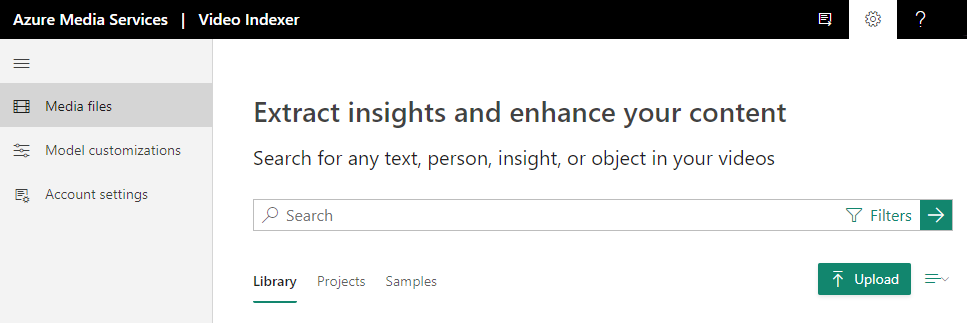
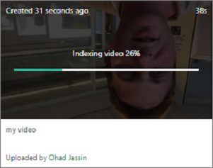

# Quickstart: How to sign up and upload your first video

This getting started quickstart shows how to sign in to the Video Indexer website and how to upload your first video.

When creating a Video Indexer account, you can choose a free trial account (where you get a certain number of free indexing minutes) or a paid option (where you are not limited by the quota). With free trial, Video Indexer provides up to 600 minutes of free indexing to website users and up to 2400 minutes of free indexing to API users. With paid option, you create a Video Indexer account that is [connected to your Azure subscription and an Azure Media Services account](connect-to-azure.md). You pay for minutes indexed as well as the Azure Media Services account related charges. 

## Sign up for Video Indexer

To start developing with Video Indexer, browse to the [Video Indexer](https://www.videoindexer.com) website and sign up.

> [!NOTE]
> Once you start using Video Indexer, all your stored data and uploaded content are encrypted at rest with a Microsoft managed key.

## Upload a video using the Video Indexer website

### Supported file formats for Video Indexer

See the [input container/file formats](../latest/media-encoder-standard-formats.md#input-containerfile-formats) article for a list of file formats that you can use with Video Indexer.

### Upload a video

1. Sign in on the [Video Indexer](https://www.videoindexer.ai/) website.
2. To upload a video, press the **Upload** button or link.

    > [!NOTE]
    > The name of the video must be no greater than 80 characters.

    

    Once your video has been uploaded, Video Indexer starts indexing and analyzing the video.

     

    Once Video Indexer is done analyzing, you will get a notification with a link to your video and a short description of what was found in your video. For example: people, topics, OCRs.

## See also

See [Upload and index videos](upload-index-videos.md) for more details.

After you upload and index a video, you can start using [Video Indexer](video-indexer-view-edit.md) website or [Video Indexer Developer Portal](video-indexer-use-apis.md) to see the insights of the video. 

[Start using APIs](video-indexer-use-apis.md)

## Next steps

For detailed introduction please visit our [introduction lab](https://github.com/Azure-Samples/media-services-video-indexer/blob/master/IntroToVideoIndexer.md). 

At the end of the workshop you will have a good understanding of the kind of information that can be extracted from video and audio content, you will be more prepared to identify opportunities related to content intelligence, pitch video AI on Azure, and demo several scenarios on Video Indexer.

