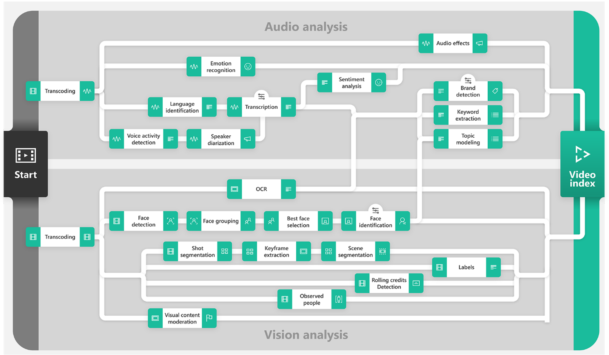

# What is Azure Media Services Video Indexer?

Video Indexer (VI) is the Azure Media Services AI solution and part of the Azure Cognitive Services brand. Video Indexer provides ability to extract deep insights (with no need for data analysis or coding skills) using machine learning models based on multiple channels (voice, vocals, visual). You can further customize and train the models. The service enables deep search, reduces operational costs, enables new monetization opportunities, and creates new user experiences on large archives of videos (with low entry barriers).

To start extracting insights with Video Indexer, you need to create an account and upload videos. When you upload your videos to Video Indexer, it analyses both visuals and audio by running different AI models. As Video Indexer analyzes your video, the insights that are extracted by the AI models.

The following diagram is an illustration and not a technical explanation of how Video Indexer works in the backend.

## Compliance, Privacy and Security

As an important reminder, you must comply with all applicable laws in your use of Video Indexer, and you may not use Video Indexer or any Azure service in a manner that violates the rights of others, or that may be harmful to others.

Before uploading any video/image to Video Indexer, You must have all the proper rights to use the video/image, including, where required by law, all the necessary consents from individuals (if any) in the video/image, for the use, processing, and storage of their data in Video Indexer and Azure. Some jurisdictions may impose special legal requirements for the collection, online processing and storage of certain categories of data, such as biometric data. Before using Video Indexer and Azure for the processing and storage of any data subject to special legal requirements, You must ensure compliance with any such legal requirements that may apply to You.

To learn about compliance, privacy and security in Video Indexer please visit the Microsoft [Trust Center](https://www.microsoft.com/TrustCenter/CloudServices/Azure/default.aspx). For Microsoft's privacy obligations, data handling and retention practices, including how to delete your data, please review Microsoft's [Privacy Statement](https://privacy.microsoft.com/PrivacyStatement), the [Online Services Terms](https://www.microsoft.com/licensing/product-licensing/products?rtc=1) ("OST") and [Data Processing Addendum](https://www.microsoftvolumelicensing.com/DocumentSearch.aspx?Mode=3&DocumentTypeId=67) ("DPA"). By using Video Indexer, you agree to be bound by the OST, DPA and the Privacy Statement.

## What can I do with Video Indexer?

Video Indexer's insights can be applied to many scenarios, among them are:

* *Deep search*: Use the insights extracted from the video to enhance the search experience across a video library. For example, indexing spoken words and faces can enable the search experience of finding moments in a video where a person spoke certain words or when two people were seen together. Search based on such insights from videos is applicable to news agencies, educational institutes, broadcasters, entertainment content owners, enterprise LOB apps, and in general to any industry that has a video library that users need to search against.
* *Content creation*: Create trailers, highlight reels, social media content, or news clips based on the insights Video Indexer extracts from your content. Keyframes, scenes markers, and timestamps for the people and label appearances make the creation process much smoother and easier, and allows you to get to the parts of the video you need for the content you're creating.
* *Accessibility*: Whether you want to make your content available for people with disabilities or if you want your content to be distributed to different regions using different languages, you can use the transcription and  translation provided by video indexer in multiple languages.
* *Monetization*: Video Indexer can help increase the value of videos. For example, industries that rely on ad revenue (news media, social media, and so on) can deliver relevant ads by using the extracted insights as additional signals to the ad server.
* *Content moderation*: Use textual and visual content moderation models to keep your users safe from inappropriate content and validate that the content you publish matches your organization's values. You can automatically block certain videos or alert your users about the content.
* *Recommendations*: Video insights can be used to improve user engagement by highlighting the relevant video moments to users. By tagging each video with additional metadata, you can recommend to users the most relevant videos and highlight the parts of the video that will match their needs.

## Features

The following list shows the insights you can retrieve from your videos using Video Indexer video and audio models:

### Video insights

* **Face detection**: Detects and groups faces appearing in the video.
* **Celebrity identification**: Video Indexer automatically identifies over 1 million celebrities—like world leaders, actors, actresses, athletes, researchers, business, and tech leaders across the globe. The data about these celebrities can also be found on various websites (IMDB, Wikipedia, and so on).
* **Account-based face identification**: Video Indexer trains a model for a specific account. It then recognizes faces in the video based on the trained model. For more information, see [Customize a Person model from the Video Indexer website](customize-person-model-with-website.md) and [Customize a Person model with the Video Indexer API](customize-person-model-with-api.md).
* **Thumbnail extraction for faces** ("best face"): Automatically identifies the best captured face in each group of faces (based on quality, size, and frontal position) and extracts it as an image asset.
* **Visual text recognition** (OCR): Extracts text that's visually displayed in the video.
* **Visual content moderation**: Detects adult and/or racy visuals.
* **Labels identification**: Identifies visual objects and actions displayed.
* **Scene segmentation**: Determines when a scene changes in video based on visual cues. A scene depicts a single event and it's composed by a series of consecutive shots, which are semantically related.
* **Shot detection**: Determines when a shot changes in video based on visual cues. A shot is a series of frames taken from the same motion-picture camera. For more information, see [Scenes, shots, and keyframes](scenes-shots-keyframes.md).
* **Black frame detection**: Identifies black frames presented in the video.
* **Keyframe extraction**: Detects stable keyframes in a video.
* **Rolling credits**: Identifies the beginning and end of the rolling credits in the end of TV shows and movies.
* **Animated characters detection** (preview): Detection, grouping, and recognition of characters in animated content via integration with [Cognitive Services custom vision](https://azure.microsoft.com/services/cognitive-services/custom-vision-service/). For more information, see [Animated character detection](animated-characters-recognition.md).
* **Editorial shot type detection**: Tagging shots based on their type (like wide shot, medium shot, close up, extreme close up, two shot, multiple people, outdoor and indoor, and so on). For more information, see [Editorial shot type detection](scenes-shots-keyframes.md#editorial-shot-type-detection).

### Audio insights

* **Audio transcription**: Converts speech to text in 12 languages and allows extensions. Supported languages include English, Spanish, French, German, Italian, Mandarin Chinese, Japanese, Arabic, Russian, Portuguese, Hindi, and Korean.
* **Automatic language detection**: Automatically identifies the dominant spoken language. Supported languages include English, Spanish, French, German, Italian, Mandarin Chinese, Japanese, Russian, and Portuguese. If the language can't be identified with confidence, Video Indexer assumes the spoken language is English. For more information, see [Language identification model](language-identification-model.md).
* **Multi-language speech identification and transcription** (preview): Automatically identifies the spoken language in different segments from audio. It sends each segment of the media file to be transcribed and then combines the transcription back to one unified transcription. For more information, see [Automatically identify and transcribe multi-language content](multi-language-identification-transcription.md).
* **Closed captioning**: Creates closed captioning in three formats: VTT, TTML, SRT.
* **Two channel processing**: Auto detects separate transcript and merges to single timeline.
* **Noise reduction**: Clears up telephony audio or noisy recordings (based on Skype filters).
* **Transcript customization** (CRIS): Trains custom speech to text models to create industry-specific transcripts. For more information, see [Customize a Language model from the Video Indexer website](customize-language-model-with-website.md) and [Customize a Language model with the Video Indexer APIs](customize-language-model-with-api.md).
* **Speaker enumeration**: Maps and understands which speaker spoke which words and when.
* **Speaker statistics**: Provides statistics for speakers' speech ratios.
* **Textual content moderation**: Detects explicit text in the audio transcript.
* **Audio effects**: Identifies audio effects like hand claps, speech, and silence.
* **Emotion detection**: Identifies emotions based on speech (what's being said) and voice tonality (how it's being said). The emotion could be joy, sadness, anger, or fear.
* **Translation**: Creates translations of the audio transcript to 54 different languages.

### Audio and video insights (multi-channels)

When indexing by one channel, partial result for those models will be available.

* **Keywords extraction**: Extracts keywords from speech and visual text.
* **Named entities extraction**: Extracts brands, locations, and people from speech and visual text via natural language processing (NLP).
* **Topic inference**: Makes inference of main topics from transcripts. The 2nd-level IPTC taxonomy is included.
* **Artifacts**: Extracts rich set of "next level of details" artifacts for each of the models.
* **Sentiment analysis**: Identifies positive, negative, and neutral sentiments from speech and visual text.

## How can I get started with Video Indexer?

You can access Video Indexer capabilities in three ways:

* Video Indexer portal: An easy to use solution that lets you evaluate the product, manage the account, and customize models.

    For more information about the portal, see [Get started with the Video Indexer website](video-indexer-get-started.md).  

* API integration: All of Video Indexer's capabilities are available through a REST API, which lets you integrate the solution into your apps and infrastructure.

    To get started as a developer, see [Use Video Indexer REST API](video-indexer-use-apis.md).

* Embeddable widget: Lets you embed the Video Indexer insights, player, and editor experiences into your app.

    For more information, see [Embed visual widgets in your application](video-indexer-embed-widgets.md).

If you're using the website, the insights are added as metadata and are visible in the portal. If you're using APIs, the insights are available as a JSON file.

## Next steps

You're ready to get started with Video Indexer. For more information, see the following articles:

- [Get started with the Video Indexer website](video-indexer-get-started.md).
- [Process content with Video Indexer REST API](video-indexer-use-apis.md).
- [Embed visual widgets in your application](video-indexer-embed-widgets.md).
