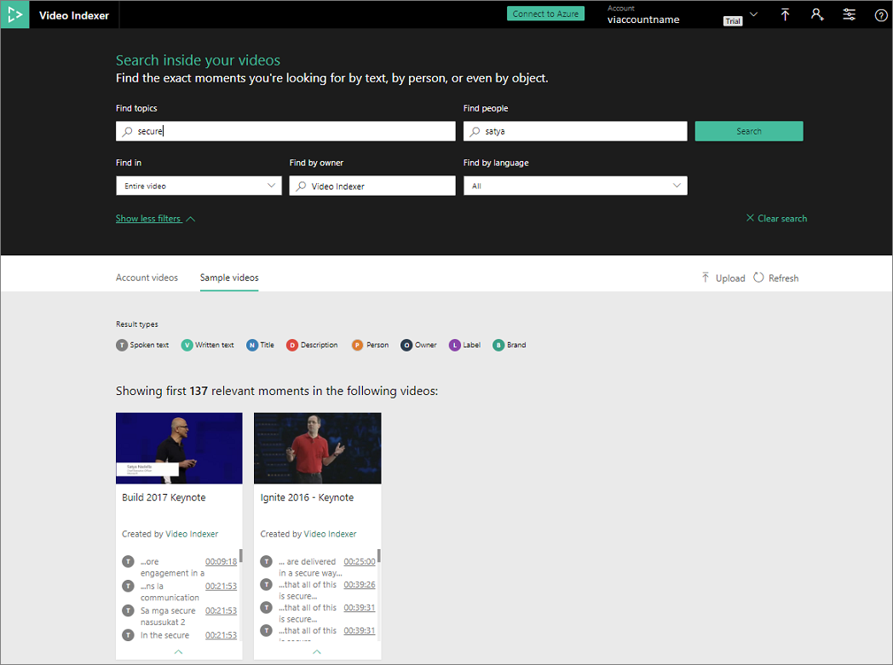
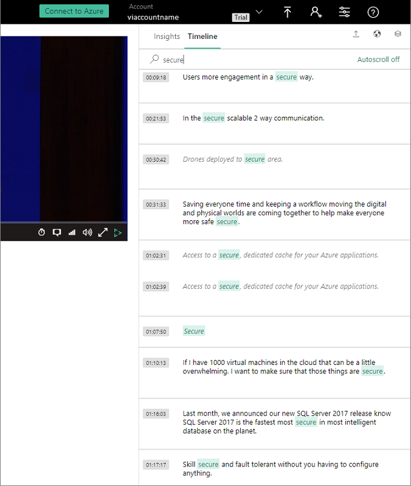
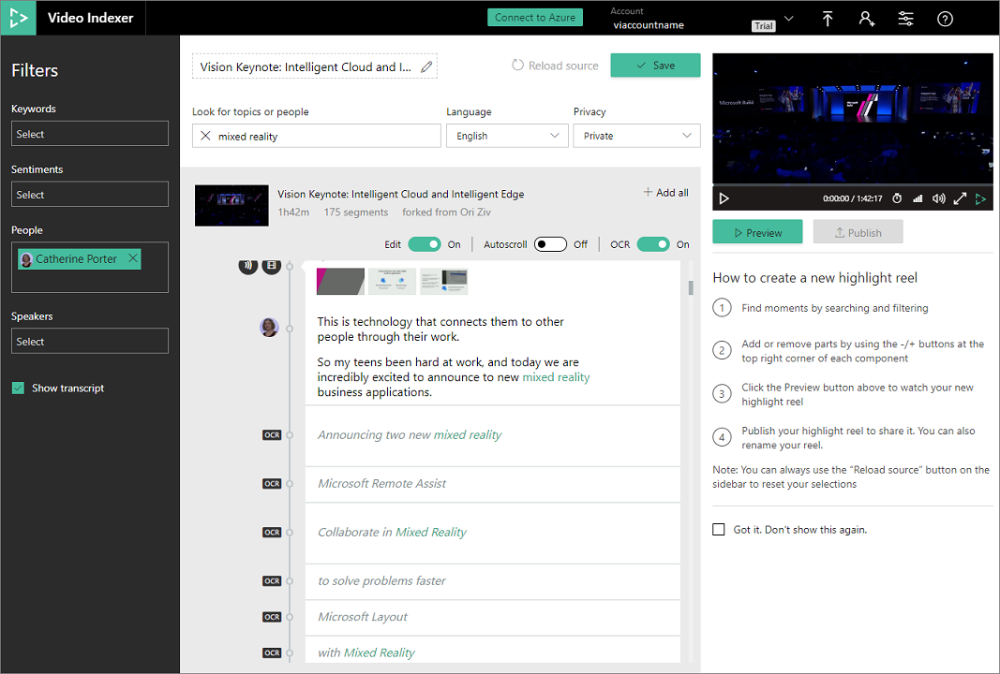

# Find exact moments within videos

This topic shows you the search options that enable you to find exact moments within videos.

1. Browse to the [Video Indexer](https://www.videoindexer.ai/) website and sign in.
2. Search among all videos in your account.

	In the following example, we search for all videos that talk about security and in which Satya appears,

	
3. Search the summarized insights of the video.

	You can then search within a video by clicking **Play** on the video. Then, you can search within the video by selecting the **Search** tab. 

    In the following example, we search for "secure" inside the selected video.

	

	If you click one of the results, the player brings you to that moment in the video. You can achieve the player/insights view and synchronization in your application. For more information, see [Embed Video Indexer widgets into your application](video-indexer-embed-widgets.md). 
4. Search the detailed breakdown of the video.
    
    If you want to create your own clip based on the video that you found, press the **Edit** button. This page shows you video along with its insights as filters. For more information, see [View and edit Video Indexer insights](video-indexer-view-edit.md). 

    You can search within the video to only show the lines you are interested in and use the side insights to filter the parts you want to see. When you finish, you can preview your clip and press **Publish** to create the new clip that appears in your gallery.
    
    In the following example, we searched for the "mixed reality" text. We also applied additional filters, as shown in the screen below.
    
	

## Next steps 

Once you find the video you want to work with, you can continue processing the video, as described in one of these topics: 

- [Use your videos' deep insights](use-editor-create-project.md)
- [Process content with Video Indexer REST API](video-indexer-use-apis.md)
- [Embed visual widgets in your application](video-indexer-embed-widgets.md)

## See also

[Video Indexer overview](video-indexer-overview.md)
