# View and edit Video Indexer insights

Video Indexer website, enables you to use your videos' deep insights to: find the right media content, locate the parts that you’re interested in, and use the results to create an entirely new project. Once created, the project can be rendered and downloaded from Video Indexer and be used in your own editing applications or downstream workflows.

Some scenarios where you may find this feature useful are: 

* Creating movie highlights for trailers.
* Using old clips of videos in news casts.
* Creating shorter content for social media.

This article shows how to create a project from scratch and also how to create a project from a video in your account.

## Create new project and manage videos

> [!NOTE]
> Currently, projects may only contain videos indexed in the same language. Once you select a video in one language, you cannot add the videos in your account that are in a different language.

1. Browse to the [Video Indexer](https://www.videoindexer.ai/) website and sign in.
1. Select the **Projects** tab. If you have created projects before, you  will see all of your other projects here.
1. Click **Create new project**.  

    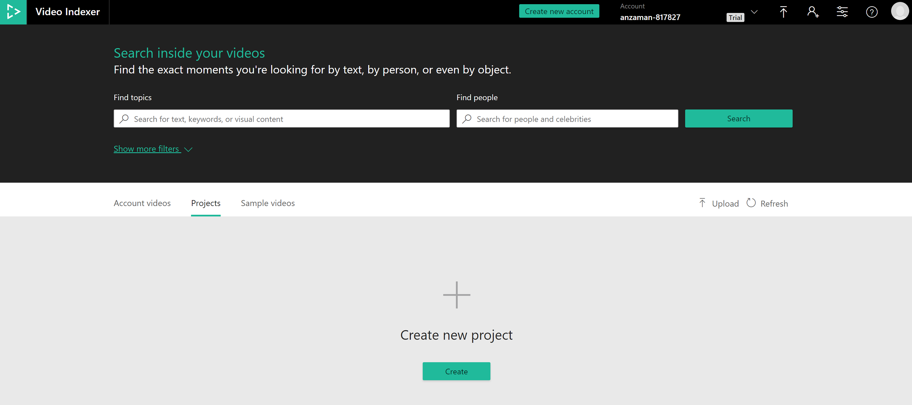
1. Give your project a name by clicking on the pencil icon. Replace the text that says "Untitled project" with your project name and click on the check.

    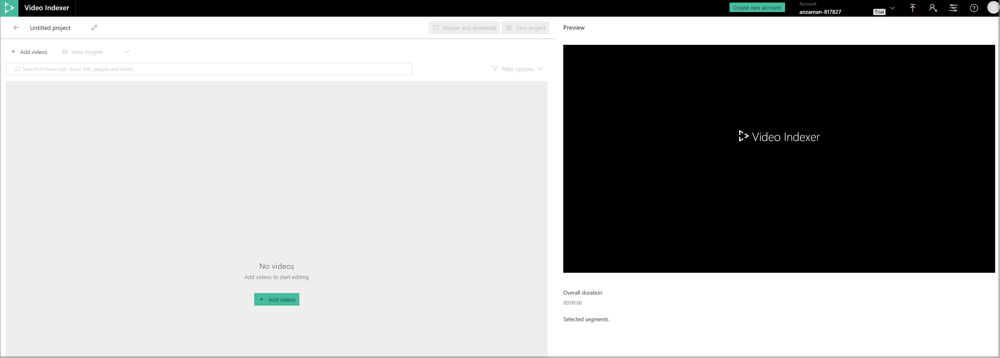
    
### Add videos to the project
1. Add videos that you want to work with in this project by selecting **Add videos**.

    You will see all the videos in your account and a search box that says "Search for text, keywords, or visual content". You can use       this search box to search for a person, label, brand, keyword, or occurrence in the transcript and OCR. 
    
    For example, in the image below, we are looking for videos that mention "GitHub".
    
    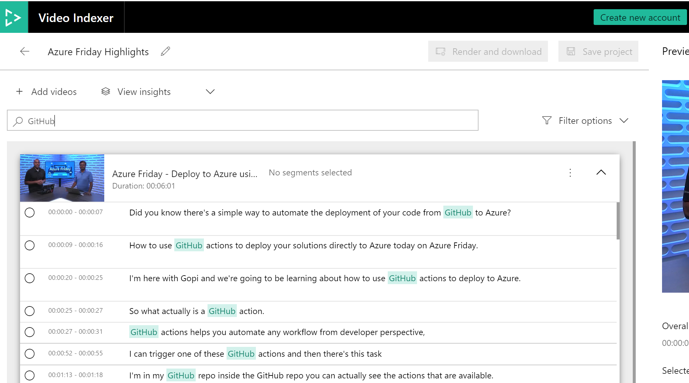

    You can further filter your results by selecting **Filter results**. You can filter to show videos that have a certain person in them or to specify that you only want to see video results that are a in a certain language or have a specific owner.   You can also specify the scope of your query. For example, if you want to search "GitHub" in the OCR, select **Visual Text**.

    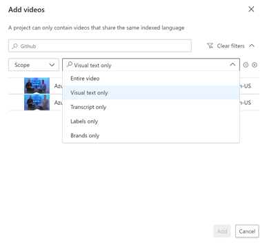

    You can layer multiple filters to your query. Use **+**/**-** button to add/remove filters. Use **Clear filters** to remove all filters.
1. To add the video, select them and then select **Add**.
1. Now, you will see all of the videos you chose. These are the videos from which you are going to select clips for your project.

You can rearrange the order of the videos by dragging and dropping or by selecting the list menu button and selecting **Move down** or **Move up**. From the list menu, you will also be able to remove the video from this project. 

    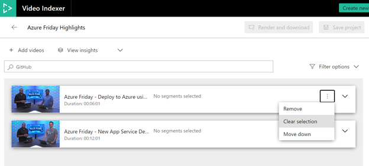
    
You have the option to add more videos to this project at any time by selecting **Add videos**. You can also add multiple occurrences of the same video to your project. You might want to do this if you want to show a clip from one video and then a clip from another and then another clip from the first video. 

### Select clips to put in your project

If you click on the downward arrow on the right side of each video, you will open up the insights in the video based on time stamps (clips of the video). 

1. Select **View Insights** to customize which insights you want to see and which you don't want to see. 

    
1. To create queries for specific clips, use the search box that says "Search in transcript, visual text, people, and labels".
1. Add filters to clips by specifying what scenes you are looking for. 

    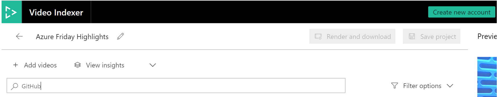
1. Include or exclude a certain insight. 

    For example, you may want to see clips where GitHub is mentioned while Donovan Brown is on the screen. For this, you need to add an "include" filter and specify which type of insight this filter is for. 

    Select People as the type of insight and then type in “Donovan Brown” in the search box for the filter.

    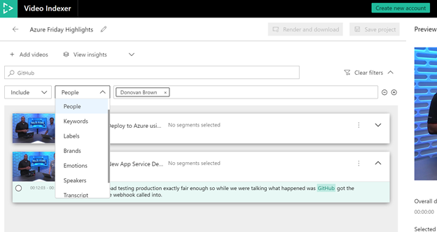

1. Add a clip to your project by selecting the segment you want to add.

    You can unselect this clip by clicking on the segment again.
1. Add all segments by clicking on the list menu option next to the video and selecting **Select all segments**. 

    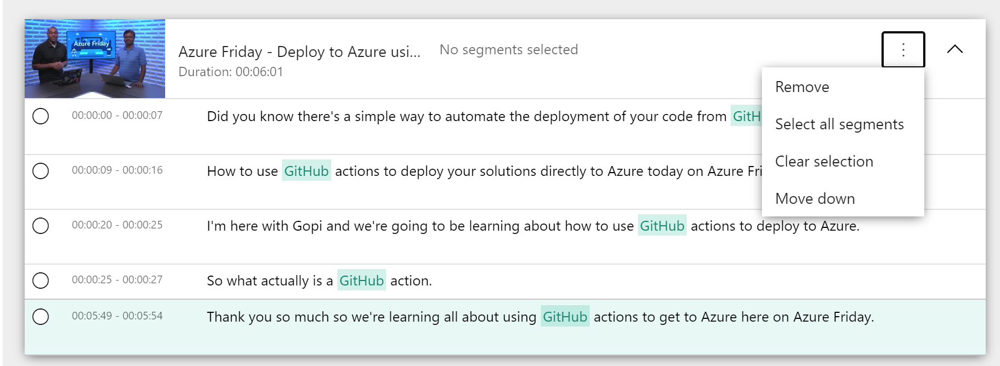

    You can clear all of your selection by selecting Clear selection.

> [!TIP]
> As you are selecting and ordering your clips, you can preview the video in the player on the right side of the page. 

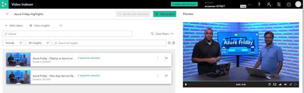

Remember to save your project when you make changes by selecting Save project. 

### Render and download the project
1. Once you are done, make sure that your project has been saved. You can now render this project. Select **Render and Download**. 

    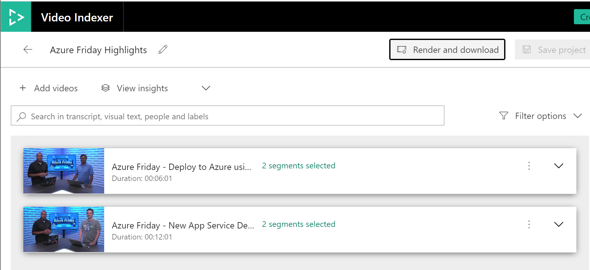

    A popup that tells you that Video indexer will render a file and then the download link will be send to your email. Select Proceed. You will see a notification that the project is being rendered. Once it is done being rendered, you will see a new notification that the project has been successfully rendered. Click here to download the project. It will download the project in mp4 format.

1. You can access saved projects from the **Project** tab. 

    If you select this project, you  see all the insights and the timeline of this project. If you select **Video editor**, you can continue making edits. 

    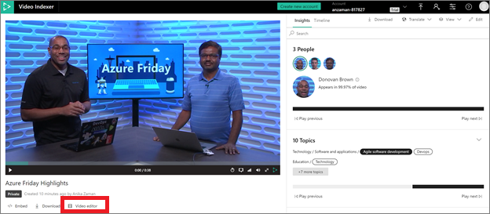

1. Click the pencil icon to make edits to the project. 
 
    Edits include adding or removing videos and clips or renaming the project.

## Create a project from your video

You can create a new project directly from a video in your account. 

1. Go to the **Library** tab of the Video Indexer website.
1. Open the video that you want to use to create your project. On the insights and timeline page, select the **Video editor** button.

    

    This takes you to the same page that you used to create a new project. Unlike the new project, you see the timestamped insights segments of the video, that you had started editing previously.

## See also

[Video Indexer overview](video-indexer-overview.md)

