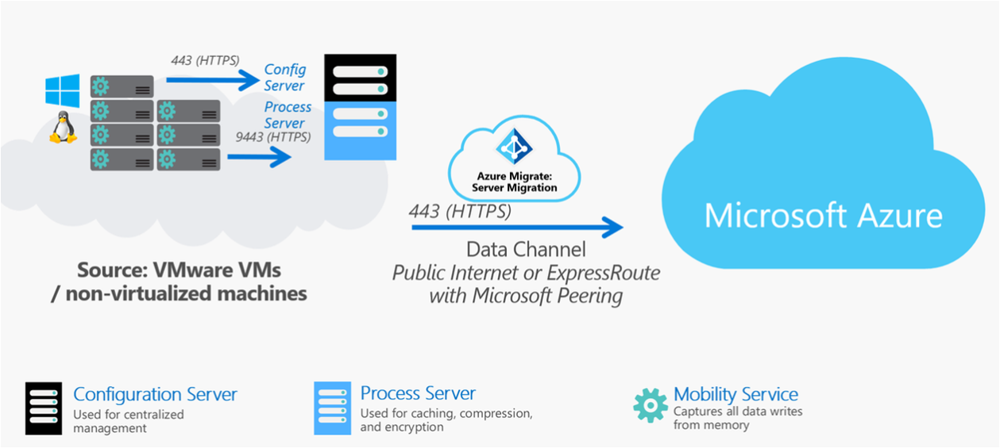

# Agent-based migration architecture

This article provides an overview of the architecture and processes used for agent-based replication of VMware VMs with the [Azure Migrate: Server Migration](migrate-services-overview.md#azure-migrate-server-assessment-tool) tool.

Using Azure Migrate: Server Migration, you can replicate VMware VMs with a couple of options:

- Migrate VMs using agent-based replication, as described in this article.
- Migrate VMware VMs using agentless replication. This migrates VMs without needing to install anything on them.

Learn more about [selecting and comparing](server-migrate-overview.md) migration methods for VMware VMs. 

## Agent-based migration

Agent-based migration is used to migrate on-premises VMware VMs and physical servers to Azure. It can also be used to migrate other on-premises virtualized servers, as well as private and public cloud VMs, including AWS instances, and GCP VMs. Agent-based migration in Azure Migrate uses some backend functionality from the [Azure Site Recovery](../site-recovery/site-recovery-overview.md) service.

## Architectural components

The diagram illustrates the components involved in agent-based migration.

The table summarizes the components used for agent-based migration.

**Component** | **Details** | **Installation**
--- | --- | ---
**Replication appliance** | The replication appliance (configuration server/process server) is an on-premises machine that acts as a bridge between the on-premises environment, and Server Migration. The appliance discovers the on-premises machine inventory, so that Server Migration can orchestrate replication and migration. The appliance has two components:   **Configuration server**: Connects to Server Migration and coordinates replication.  **Process server**: Handles data replication. The process server receives machine data, compresses and encrypts it, and sends to Azure. In Azure, Server Migration writes the data to managed disks. | By default the process server is installed together with the configuration server on the replication appliance.
**Mobility service** | The Mobility service is an agent installed on each machine you want to replicate and migrate. It sends replication data from the machine to the process server. | Installation files for different versions of the Mobility service are located on the replication appliance. You download and install the agent you need, in accordance with the operating system and version of the machine you want to replicate.

## Mobility service installation

You can deploy the Mobility Service using the following methods:

- **Push installation**: The Mobility service is installed by the process server when you enable protection for a machine. 
- **Install manually**: You can install the Mobility service manually on each machine through UI or command prompt.

The Mobility service communicates with the replication appliance and replicated machines. If you have antivirus software running on the replication appliance, process servers, or machines being replicated, the following folders should be excluded from scanning:

- C:\Program Files\Microsoft Azure Recovery Services Agent
- C:\ProgramData\ASR
- C:\ProgramData\ASRLogs
- C:\ProgramData\ASRSetupLogs
- C:\ProgramData\LogUploadServiceLogs
- C:\ProgramData\Microsoft Azure Site Recovery
- C:\Program Files (x86)\Microsoft Azure Site Recovery
- C:\ProgramData\ASR\agent (on Windows machines with the Mobility service installed)

## Replication process

1. When you enable replication for a machine, initial replication to Azure begins.
2. During initial replication, the Mobility service reads data from the machine disks, and sends it to the process server.
3. This data is used to seed a copy of the disk in your Azure subscription. 
4. After initial replication finishes, replication of delta changes to Azure begins. Replication is block-level, and near-continuous.
4. The Mobility service intercepts writes to disk memory, by integrating with the storage subsystem of the operating system. This method avoids disk I/O operations on the replicating machine, for incremental replication. 
5. Tracked changes for a machine are sent to the process server on inbound port HTTPS 9443. This port can be modified. The process server compresses and encrypts it, and sends it to Azure. 

## Ports

**Device** | **Connection**
--- | --- 
**Replicating machines** | The Mobility service running on VMs communicates with the on-premises replication appliance on port HTTPS 443 inbound, for replication management.   Machines send replication data to the process server on port HTTPS 9443 inbound. This port can be modified.
**Replication appliance** | The replication appliance orchestrates replication with Azure over port HTTPS 443 outbound.
**Process server** | The process server receives replication data, optimizes and encrypts it, and sends it to Azure storage over port 443 outbound.

## Performance and scaling

By default, you deploy a single replication appliance that runs both the configuration server and the process server. If you're only replicating a few machines, this deployment is sufficient. However, if you're replicating and migrating hundreds of machines, a single process server might not be able to handle all the replication traffic. In this case, you can deploy additional, scale-out process servers.

### Plan VMware deployment

If you're replicating VMware VMs, you can use the [Site Recovery Deployment Planner for VMware](../site-recovery/site-recovery-deployment-planner.md), to help determine performance requirements, including the daily data change rate, and the process servers you need.

### Replication appliance capacity

Use the values in this table to figure out whether you need an additional process server in your deployment.

- If your daily change rate (churn rate) is over 2 TB, deploy an additional process server.
- If you're replicating more than 200 machines, deploy an additional replication appliance.

**CPU** | **Memory** | **Free space-data caching** | **Churn rate** | **Replication limits**
--- | --- | --- | --- | ---
8 vCPUs (2 sockets * 4 cores \@ 2.5 GHz) | 16 GB | 300 GB | 500 GB or less | < 100 machines 
12 vCPUs (2 sockets * 6 cores \@ 2.5 GHz) | 18 GB | 600 GB | 501 GB to 1 TB	| 100-150 machines.
16 vCPUs (2 sockets * 8 cores \@ 2.5 GHz) | 32 G1 |  1 TB | 1 TB to 2 TB | 151-200 machines.

### Sizing scale-out process servers

If you need to deploy a scale-out process server, use this table to figure out server sizing.

**Process server** | **Free space for data caching** | **Churn rate** | **Replication limits**
--- | --- | --- | --- 
4 vCPUs (2 sockets * 2 cores \@ 2.5 GHz), 8-GB memory | 300 GB | 250 GB or less | Up to 85 machines 
8 vCPUs (2 sockets * 4 cores \@ 2.5 GHz), 12-GB memory | 600 GB | 251 GB to 1 TB	| 86-150 machines.
12 vCPUs (2 sockets * 6 cores \@ 2.5 GHz), 24-GB memory | 1 TB | 1-2 TB | 151-225 machines.

## Throttle upload bandwidth.

VMware traffic that replicates to Azure goes through a specific process server. You can limit upload throughput by throttling bandwidth on the machines that are running as process servers. You can influence bandwidth using this registry key:

- The HKEY_LOCAL_MACHINE\SOFTWARE\Microsoft\Windows Azure Backup\Replication\UploadThreadsPerVM registry value specifies the number of threads that are used for data transfer (initial or delta replication) of a disk. A higher value increases the network bandwidth that's used for replication. The default value is four. The maximum value is 32. Monitor traffic to optimize the value.
- In addition, you can throttle bandwidth on the process server machine as follows:

    1. On the process server machine, open the Azure Backup MMC snap-in. There's a shortcut on the desktop or in the folder C:\Program Files\Microsoft Azure Recovery Services Agent\bin. 
    2. In the snap-in, select **Change Properties**.
    3. In **Throttling**, select **Enable internet bandwidth usage throttling for backup operations**. Set the limits for work and non-work hours. Valid ranges are from 512 Kbps to 1,023 Mbps.

## Next steps

Try out [agent-based migration](tutorial-migrate-vmware-agent.md) for [VMware](tutorial-migrate-vmware-agent.md) or [physical servers](tutorial-migrate-physical-virtual-machines.md).
