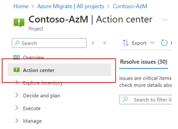
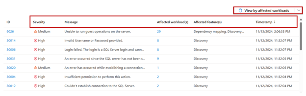
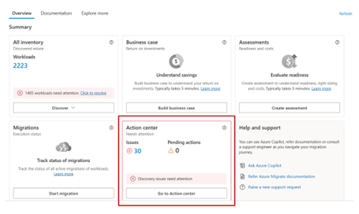
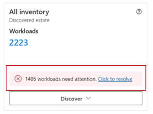

# Use Action Center for Centralized issue tracking and resolution

This article describes how you can use Action Center in Azure Migrate as a centralized issue resolution hub.

## Overview

Azure Migrate offers a comprehensive platform for migrating, modernizing, and optimizing resources in Azure. It allows users to create projects to discover datacenter inventory, conduct assessments, analyze dependencies, replicate workloads, and perform test migrations. However, managing issues and actions across these components can be challenging, particularly when users are dealing with complex environments involving numerous servers, applications, and data sources.

The new **Action Center** feature in Azure Migrate addresses this challenge by offering a **centralized hub** where users can view and manage all migration-related issues, pending actions, and jobs across their projects. This includes issues related to **discovery**, **dependency visualization**, and **assessments**, streamlining the troubleshooting process by bringing together different types of issues in a single interface. This unified view helps users stay organized and prioritize their actions effectively, enabling faster issue resolution and a smoother migration experience.

## Access Action Center

The Action Center can be accessed directly from the Azure Migrate dashboard, providing an integrated and accessible solution for managing migration issues and actions.

## Key features

- **Centralized issue management:** Action Center provides a single interface to manage issues across discovery, dependency visualization, and assessment stages. This reduces the need to switch between different tools or sections, offering users a holistic view of all issues within their migration projects.

    

- **Comprehensive issue tracking:** Users can see detailed information for each issue, including **severity level, affected workloads, affected features,** and **timestamps**. Each issue is accompanied by specific messages, allowing users to understand the nature of the problem and respond accordingly. Users can also sort and filter issues based on **severity, affected workload(s), timestamps**, and other parameters, enabling efficient prioritization of tasks and quick identification of high-severity issues that require immediate attention. Users can also have a view by affected workloads, where they can identify different issues by workloads.

    

- **Easy accessibility from Azure Migrate dashboard:** Action Center is accessible directly from the Azure Migrate dashboard, ensuring a seamless experience for users managing their migration projects.

    

- **Actionable insights and notifications:** Action Center offers real-time alerts for critical issues, enabling users to take timely action on tasks that require immediate attention. Users can also view real-time job statuses, pending actions, and alerts, making it easier to monitor the overall health of their migration project.

    

- **Integrated remediation resources:** The Action Center provides links to resources and troubleshooting documentation for specific issue types:

   - **Discovery issues:** [Troubleshoot Discovery Issues in Azure Migrate](/azure/migrate/troubleshoot-discovery).
  
   - **Dependency visualization issues:** [Troubleshoot Dependency Visualization Issues in Azure Migrate](/azure/migrate/troubleshoot-dependencies).
  
   - **Assessment issues:** [Troubleshoot Assessment Issues in Azure Migrate](/azure/migrate/troubleshoot-assessment).
   
    These resources guide users in addressing issues, helping to minimize delays in the migration process.

