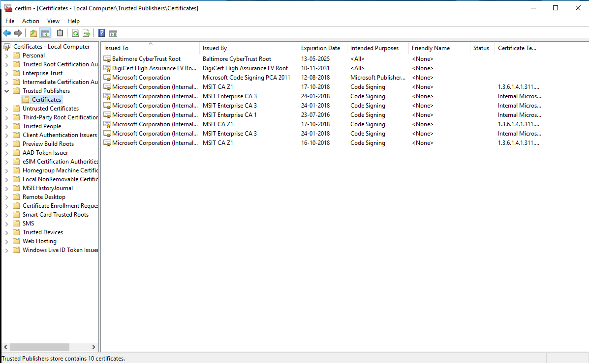
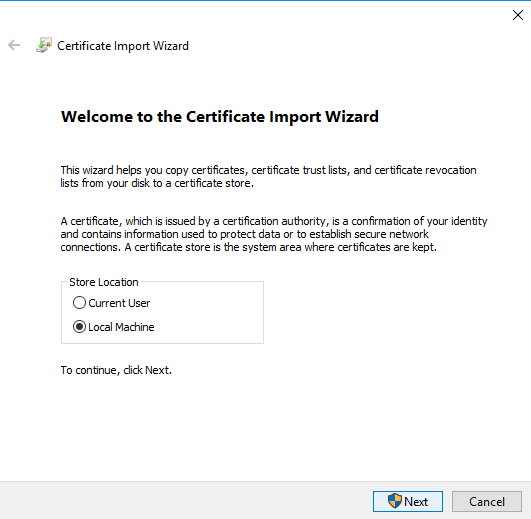
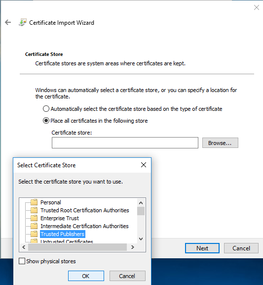

# About the Collector appliance

 This article provides information about Azure Migrate Collector.

The Azure Migrate Collector is a lightweight appliance that can be used to discover an on-premises vCenter environment for the purposes of assessment with the [Azure Migrate](migrate-overview.md) service, before migration to Azure.  


## Deploying the Collector

You deploy the Collector appliance using an OVF template:

- You download the OVF template from an Azure Migrate project in the Azure portal. You import the downloaded file to vCenter Server, to set up the Collector appliance VM.
- From the OVF, VMware sets up a VM with 4 cores, 8 GB RAM, and one disk of 80 GB. The operating system is Windows Server 2012 R2 (64 bit).
- When you run the Collector, a number of prerequisite checks run to make sure that the Collector can connect to Azure Migrate.

- [Learn more](tutorial-assessment-vmware.md#create-the-collector-vm) about creating the Collector.


## Collector prerequisites

The Collector must pass a few prerequisite checks to ensure it can connect to the Azure Migrate service over the internet, and upload discovered data.

- **Check internet connection**: The Collector can connect to the internet directly, or via a proxy.
    - The prerequisite check verifies connectivity to [required and optional URLs](#connect-to-urls).
    - If you have a direct connection to the internet, no specific action is required, other than making sure that the Collector can reach the required URLs.
    - If you're connecting via a proxy, note the [requirements below](#connect-via-a-proxy).
- **Verify time synchronization**: The Collector should synchronized with the internet time server to ensure the requests to the service are authenticated.
    - The portal.azure.com url should be reachable from the Collector so that the time can be validated.
    - If the machine isn't synchronized, you need to change the clock time on the Collector VM to match the current time. To do this open an admin prompt on the VM, run **w32tm /tz** to check the time zone. Run **w32tm /resync** to synchronize the time.
- **Check collector service running**:  The Azure Migrate Collector service should be running on the Collector VM.
    - This service is started automatically when the machine boots.
    - If the service isn't running, start it from the Control Panel.
    - The Collector service connects to vCenter Server, collects the VM metadata and performance data, and sends it to the Azure Migrate service.
- **Check VMware PowerCLI 6.5 installed**: The VMware PowerCLI 6.5 PowerShell module must be installed on the Collector VM, so that it can communicate with vCenter Server.
    - If the Collector can access the URLs required to install the module, it's install automatically during Collector deployment.
    - If the Collector can't install the module during deployment, you must [install it manually](#install-vwware-powercli-module-manually).
- **Check connection to vCenter Server**: The Collector must be able to vCenter Server and query for VMs, their metadata, and performance counters. [Verify prerequisites](#connect-to-vcenter-server) for connecting.


### Connect to the internet via a proxy

- If the proxy server requires authentication, you can specify the username and password when you set up the Collector.
- The IP address/FQDN of the Proxy server should specified as *http://IPaddress* or *http://FQDN*.
- Only HTTP proxy is supported. HTTPS-based proxy servers aren't supported by the Collector.
- If the proxy server is an intercepting proxy, you must import the proxy certificate to the Collector VM.
    1. In the collector VM, go to **Start Menu** > **Manage computer certificates**.
    2. In the Certificates tool, under **Certificates - Local Computer**, find **Trusted Publishers** > **Certificates**.

        

    3. Copy the proxy certificate to the collector VM. You might need to obtain it from your network admin.
    4. Double-click to open the certificate, and click **Install Certificate**.
    5. In the Certificate Import Wizard > Store Location, choose **Local Machine**.

    

    6. Select **Place all certificates in the following store** > **Browse** > **Trusted Publishers**. Click **Finish** to import the certificate.

    

    7. Check that the certificate is imported as expected, and check that the internet connectivity prerequisite check works as expected.


### Connect to URLs

The connectivity check is validated by connecting to a list of URLs.

**URL** | **Details**  | **Prerequisite check**
--- | --- | ---
*.portal.azure.com | Checks connectivity with the Azure service, and time synchronization. | Access to URL required.<br/><br/> Prerequisites check fails if there's no connectivity.
*.oneget.org:443<br/><br/> *.windows.net:443<br/><br/> *.windowsazure.com:443<br/><br/> *.powershellgallery.com:443<br/><br/> *.msecnd.net:443<br/><br/> *.visualstudio.com:443| Used to download the PowerShell vCenter PowerCLI module. | Access to URLs optional.<br/><br/> Prerequisites check won't fail.<br/><br/> Automatic module installation on the Collector VM will fail. You'll need to install the module manually.


### Install VMware PowerCLI module manually

1. Install the module using [these steps](https://blogs.vmware.com/PowerCLI/2017/04/powercli-install-process-powershell-gallery.html). These steps describe both online and offline installation.
2. If the Collector VM is offline and install on the module on a different machine with internet access, you need to copy the VMware.* files from that machine to the Collector VM.
3. After installation, you can restart the prerequisites checks to confirm that PowerCLI is installed.

### Connect to vCenter Server

The Collector connects to the vCenter Server and queries for VM metadata, and performance counters. Here's what you need for the connection.

- Only vCenter Server versions 5.5, 6.0 and 6.5 are supported.
- You need a read-only account with the permissions summarized below for discovery. Only datacenters accessible with the account can be accessed for discovery.
- By default you connect to vCenter Server with an FQDN or IP address. If vCenter Server listens on a different port, you connect to it using the form *IPAddress:Port_Number* or *FQDN:Port_Number*.
- To collect performance data for storage and networking, the statistics settings for vCenter Server must be set to level three.
- If the level is lower than three, discovery works but the performance data won't be collected. Some counters might be collected, but other will be set to zero.
- If performance data for storage and networking isn't collected, assessment size recommendations are based performance data for CPU and memory, and on configuration data for disk and network adapters.
- The Collector should have a network line of sight to the vCenter server.

#### Account permissions

**Account** | **Permissions**
--- | ---
At least a read-only user account | Data Center object –> Propagate to Child Object, role=Read-only   


## Collector communications

The collector communicates as summarized in the following diagram and table.


**Collector communicates with** | **Port** | **Details**
--- | --- | ---
Azure Migrate service | TCP 443 | Collector communicates with Azure Migrate service over SSL 443.
vCenter Server | TCP 443 | The Collector must be able to communicate with the vCenter Server.<br/><br/> By default, it connects to vCenter on 443.<br/><br/> If vCenter Server listens on a different port, that port should be available as outgoing port on the Collector.
RDP | TCP 3389 |


## Securing the Collector appliance

We recommend the following steps to secure the Collector appliance:

- Don't share or misplace administrator passwords with unauthorized parties.
- Shut down the appliance when not in use.
- Place the appliance in a secured network.
- After migration is finished, delete the appliance instance.
- In addition, after migration, also delete the disk backup files (VMDKs), as the disks might have vCenter credentials cached on them.

## OS license in the collector VM

The collector comes with a Windows Server 2012 R2 evaluation license which is valid for 180 days. If the evaluation period is expiring for your collector VM, it is recommended to download a new OVA and create a new appliance.

## Updating the OS of the Collector VM

Although the collector appliance has an evaluation license for 180 days, you need to continuously update the OS on the appliance to avoid auto-shut down of the appliance.

- If the Collector isn't updated for 60 days, it starts shutting down the machine automatically.
- If a discovery is running, the machine won't be turned off, even if 60 days have passed. The machine will be turned off after the discovery completes.
- If you've used the Collector for more than 60 days, we recommend keeping the machine updated at all times by running Windows update.

## Upgrading the Collector appliance version

You can upgrade the Collector to the latest version without downloading the OVA again.

1. Download the [latest listed upgrade package](concepts-collector-upgrade.md)
2. To ensure that the downloaded hotfix is secure, open Administrator command window and run the following command to generate the hash for the ZIP file. The generated hash should match with the hash mentioned against the specific version:

	```C:\>CertUtil -HashFile <file_location> [Hashing Algorithm]```

	(example usage C:\>CertUtil -HashFile C:\AzureMigrate\CollectorUpdate_release_1.0.9.14.zip SHA256)
3. Copy the zip file to the Azure Migrate collector virtual machine (collector appliance).
4. Right-click on the zip file and select Extract All.
5. Right-click on Setup.ps1 and select Run with PowerShell and follow the instructions on screen to install the update.


## Discovery methods

There are two methods that the Collector appliance can use for discovery, one-time discovery, or continuous discovery.


### One-time discovery

The Collector communicates on a one-time basis with vCenter Server to gather metadata about the VMs. Using this method:

- The appliance isn't continuously connected to the Azure Migrate project.
- Changes in the on-premises environment aren't reflected in Azure Migrate after discovery finishes. To reflect any changes, you need to discover the same environment in the same project again.
- For this discovery method, you need to set the statistics settings in vCenter Server to level three.
- After setting the level to three, it takes up to a day to generate the performance counters. We therefore recommend that you run the discovery after a day.
- When collecting performance data for a VM, the appliance relies on the historical performance data stored in vCenter Server. It collects performance history for the past month.
- Azure Migrate collects an average counter (rather than a peak counter) for each metric.

### Continuous discovery

The Collector appliance is continuously connected to the Azure Migrate project.

- The Collector continuously profiles the on-premises environment to gather real-time utilization data every 20 seconds.
- This model doesn't depend on the vCenter Server statistics settings to collect performance data.
- The appliance rolls up the 20-second samples, and creates a single data point every 15 minutes.
- To create the data point the appliance selects the peak value from the 20-second samples, and sends it to Azure.
- You can stop continuous profiling at anytime from the Collector.

> [!NOTE]
> Continuous discovery functionality is in preview. If the vCenter Server statistics settings isn't set to level 3, we recommend that you use this method.


## Discovery process

After the appliance is set up, you can run discovery. Here's how that works:

- You run a discovery by scope. All VMs in the specified vCenter inventory path will be discovered.
    - You set one scope at a time.
    - The scope can include 1500 VMs or less.
    - The scope can be a datacenter, folder, or ESXi host.
- After connecting to vCenter Server, you connect by specifying a migration project for the collection.
- VMs are discovered, and their metadata and performance data is sent to Azure. These actions are part of a collection job.
    - The Collector appliance is given a specific Collector ID that's persistent for a given machine across discoveries.
    - A running collection job is given a specific session ID. The ID changes for each collection job, and can be used for troubleshooting.

### Collected metadata

The collector appliance discovers the following static metadata for VMs:

- VM display name (on vCenter Server)
- VM’s inventory path (the host/folder on vCenter Server)
- IP address
- MAC address
- Operating system
- Number of cores, disks, NICs
- Memory size, Disk sizes
- Performance counters of the VM, disk and network.

#### Performance counters

- **One-time discovery**: When counters are collected for a one-time discovery, note the following:

    - It can take up to 15 minutes to collect and send configuration metadata to the project.
    - After configuration data is collected, it can take up to an hour for performance data to be available in the portal.
    - After the metadata is available in the portal, the list of VMs appears, and you can start creating groups for assessment.
- **Continuous discovery**: For continuous discovery, note the following:
    - Configuration data for the VM is available an hour after you start discovery
    - Performance data starts becoming available after 2 hours.
    - After you start discovery, wait for at least a day for the appliance to profile the environment, before you create assessments.

**Counter** | **Level** | **Per-device level** | **Impact on assessment**
--- | --- | --- | ---
cpu.usage.average | 1 | NA | Recommended VM size and cost  
mem.usage.average | 1 | NA | Recommended VM size and cost  
virtualDisk.read.average | 2 | 2 | Calculates disk size, storage cost, VM size
virtualDisk.write.average | 2 | 2  | Calculates disk size, storage cost, VM size
virtualDisk.numberReadAveraged.average | 1 | 3 |  Calculates disk size, storage cost, VM size
virtualDisk.numberWriteAveraged.average | 1 | 3 |   Calculates disk size, storage cost, VM size
net.received.average | 2 | 3 |  Calculates VM size and network cost                        |
net.transmitted.average | 2 | 3 | Calculates VM size and network cost    

## Next steps

[Set up an assessment for on-premises VMware VMs](tutorial-assessment-vmware.md)
