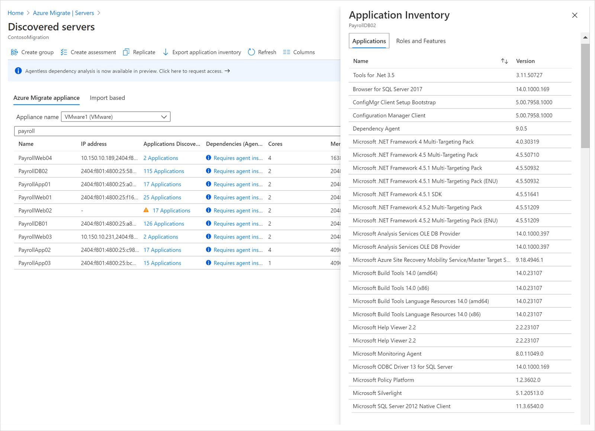
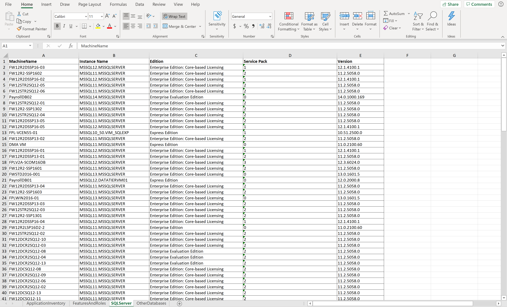
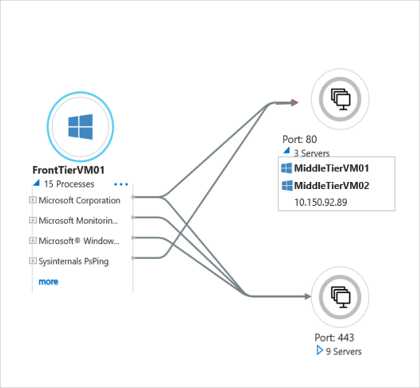
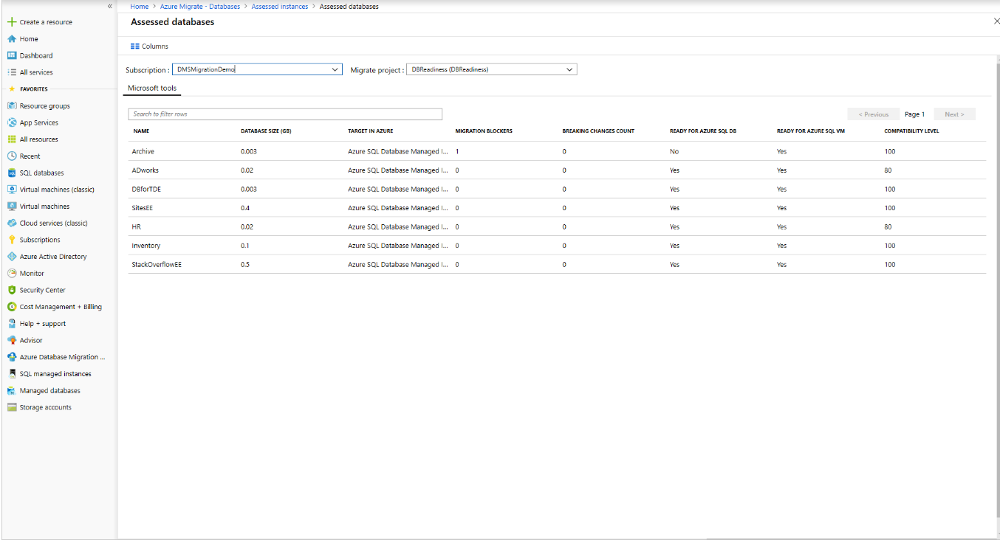
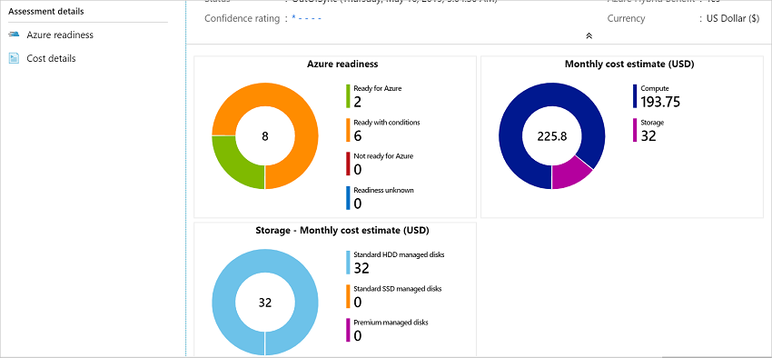

# Build migration plan with Azure Migrate

Follow this article to build your migration plan to Azure with [Azure Migrate](migrate-services-overview.md). 

## Define cloud migration goals

Before you start, understanding and evaluating your [motivation](/azure/cloud-adoption-framework/strategy/motivations) for moving to the cloud can contribute to a successful business outcome. As explained in the [Cloud Adoption Framework](/azure/cloud-adoption-framework), there are a number of triggers and outcomes.

**Business event** | **Migration outcome**
--- | ---
Datacenter exit | Cost
Merger, acquisition, or divestiture | Reduction in vendor/technical complexity
Reduction in capital expenses | Optimization of internal operations
End of support for mission-critical technologies | Increase in business agility
Response to regulatory compliance changes | Preparation for new technical capabilities
New data sovereignty requirements | Scaling to meet market demands
Reduction in disruptions, and IT stability improvements | Scaling to meet geographic demands

Identifying your motivation helps you to pin down your strategic migration goals. The next step is to identify and plan a migration path that's tailored for your workloads. The [Azure Migrate: Discovery and Assessment](migrate-services-overview.md#azure-migrate-discovery-and-assessment-tool) tool helps you to assess on-premises workloads, and provides guidance and tools to help you migrate.

## Understand your digital estate

Start by identifying your on-premises infrastructure, applications, and dependencies. This helps you to identify workloads for migration to Azure, and to gather optimized cost projections. The Discovery and assessment tool helps you to identify the workloads you have in use, dependencies between workloads, and workload optimization.

### Workloads in use

Azure Migrate uses a lightweight Azure Migrate appliance to perform agentless discovery of on-premises VMware VMs, Hyper-V VMs, other virtualized servers, and physical servers. Continuous discovery collects server configuration information, and performance metadata, and application data. Here's what the appliance collects from on-premises servers:

- Server, disk, and NIC metadata.

- Installed applications, roles, and features.

- Performance data, including CPU and memory utilization, disk IOPS, and throughput.

After collecting data, you can export the application inventory list to find apps, and SQL Server instances running on your servers. You can use the Azure Migrate: Database Assessment tool to understand SQL Server readiness.

 

 

Along with data discovered with the Discovery and assessment tool, you can use your Configuration Management Database (CMDB) data to build a view of your server and database estate, and to understand how your servers are distributed across business units, application owners, geographies, etc. This helps decide which workloads to prioritize for migration.

### Dependencies between workloads

After server discovery, you can [analyze dependencies](concepts-dependency-visualization.md), to visualize and identify cross-server dependencies, and optimization strategies for moving interdependent servers to Azure. The visualization helps to understand whether certain servers are in use, or if they can be decommissioned, instead of being migrated.  Analyzing dependencies helps ensure that nothing is left behind, and to  surprise outages during migration. With your application inventory and dependency analysis done, you can create high-confidence groups of servers, and start assessing them.

 

### Optimization and sizing

Azure provides flexibility to resize your cloud capacity over time, and migration provides an opportunity for you to optimize the CPU and memory resources allocated to your servers. Creating an assessment on servers you've identity helps you to understand your workload performance history. This is crucial for right sizing Azure VM SKUs, and disk recommendations in Azure.

## Assess migration readiness

### Readiness/suitability analysis

You can export the assessment report, and filter on these categories to understand Azure readiness:

- **Ready for Azure**: Servers can be migrated as-is to Azure, without any changes.
- **Conditionally ready for Azure**: Servers can be migrated to Azure, but need minor changes, in accordance with the remediation guidance provided in the assessment.
- **Not ready for Azure**: Servers can't be migrated to Azure as-is. Issues must be fixed in accordance with remediation guidance, before migration.
- **Readiness unknown**: Azure Migrate can't determine server readiness, because of insufficient metadata.

Using database assessments, you can assess the readiness of your SQL Server data estate for migration to Azure SQL Database, or Azure SQL Managed Instances. The assessment shows migration readiness status percentage for each of your SQL server instances. In addition, for each instance you can see the recommended target in Azure, potential migration blockers, a count of breaking changes, readiness for Azure SQL DB or Azure SQL VM, and a compatibility level. You can dig deeper to understand the impact of migration blockers, and recommendations for fixing them.

 

### Sizing Recommendations

After a server is marked as ready for Azure, Discovery and assessment makes sizing recommendations that identify the Azure VM SKU and disk type for your servers. You can get sizing recommendations based on performance history (to optimize resources as you migrate), or based on on-premises server settings, without performance history. In a database assessment, you can see recommendations for the database SKU, pricing tier, and compute level.

### Get compute costs

Performance-based sizing option in Azure Migrate assessments helps you to right-size VMs, and should be used as a best practice for optimizing workloads in Azure. In addition to right-sizing, there are a few other options to help save Azure costs:

- **Reserved Instances**: With [reserved instances(RI)](https://azure.microsoft.com/pricing/reserved-vm-instances/), you can significantly reduce costs compared to [pay-as-you-go pricing](https://azure.microsoft.com/pricing/purchase-options/pay-as-you-go/).
- **Azure Hybrid Benefit**: With [Azure Hybrid Benefit](https://azure.microsoft.com/pricing/purchase-options/pay-as-you-go/), you can bring on-premises Windows Server licenses with active Software Assurance, or Linux subscriptions, to Azure, and combine with reserved instances options.
- **Enterprise Agreement**: Azure [Enterprise Agreements (EA)](../cost-management-billing/manage/ea-portal-agreements.md) can offer savings for Azure subscriptions and services.
- **Offers**: There are multiple [Azure Offers](https://azure.microsoft.com/support/legal/offer-details/). For example, [Pay-As-You-Go Dev/Test](https://azure.microsoft.com/pricing/dev-test/), or [Enterprise Dev/Test offer](https://azure.microsoft.com/offers/ms-azr-0148p/), to provide lower rates for dev/test VMs
- **VM uptime**: You can review days per month and hours per day in which Azure VMs run. Shutting off servers when they're not in use can reduce your costs   (not applicable for RIs).
- **Target region**: You can create assessments in different regions, to figure out whether migrating to a specific region might be more cost effective.

### Visualize data

You can view Discovery and assessment reports (with Azure readiness information, and monthly cost distribution) in the portal. You can also export assessment, and enrich your migration plan with additional visualizations. You can create multiple assessments, with different combinations of properties, and choose the set of properties that work best for your business.

 

### Evaluate gaps/blockers

As you figure out the apps and workloads you want to migrate, identify downtime constraints for them, and look for any operational dependencies between your apps and the underlying infrastructure. This analysis helps you to plan migrations that meet your recovery time objective (RTO), and ensure minimal to zero data loss. Before you migrate, we recommend that you review and mitigate any compatibility issues, or unsupported features that may block server/SQL database migration. The Azure Migrate Discovery and assessment report, and Azure Migrate Database Assessment, can help with this.

### Prioritize workloads

After you've collected information about your inventory, you can identify which apps and workloads to migrate first. Develop an “apply and learn” approach to migrate apps in a systematic and controllable way, so that you can iron out any flaws before starting a full-scale migration.

To prioritize migration order, you can use strategic factors such as complexity, time-to-migrate, business urgency, production/non-production considerations, compliance, security requirements, application knowledge, etc.

A few recommendations:

- **Prioritize quick wins**: Use the assessment reports to identify low-hanging fruit, including servers and databases that are fully ready, and require minimal effort to migrate to Azure. The table summarizes a few ways to do this.

    **State** | **Action**
    --- | ---
    **Azure ready VMs** | Export the assessment report, and filter all servers with state *Ready for Azure*. This might be the first group of servers that you lift and shift to Azure, using the [Migration and modernization](migrate-services-overview.md#migration-and-modernization-tool) tool.
    **End-of-support operating systems** | Export the assessment report, and filter all servers running Windows Server 2008 R2/Windows Server 2008. These operating systems are at the end of support, and only Azure provides a free three years of security updates when you migrate them to Azure. If you combine Azure Hybrid Benefit, and use RIs, the savings could be higher.
    **SQL Server migration** | Use the database assessment recommendations to migrate databases that are ready for Azure SQL Database, using the Azure Migrate: Database Migration tool. Migrate the databases ready for Azure SQL VM using the Migration and modernization tool.
    **End-of-support software** | Export your application inventory, and filter for any software/extensions that might be reaching end-of-support. Prioritize these applications for migration.
    **Under-provisioned servers** | Export the assessment report, and filter for servers with low CPU utilization (%) and memory utilization (%).  Migrate to a right-sized Azure VM, and save on costs for underutilized resources.
    **Over-provisioned servers** | Export the assessment report and filter for servers with high CPU utilization (%) and memory utilization (%).  Solve capacity constraints, prevent overstrained servers from breaking, and increase performance by migrating these servers to Azure. In Azure, use autoscaling capabilities to meet demand.   Analyze assessment reports to investigate storage constraints. Analyze disk IOPS and throughput, and the recommended disk type.

- **Start small, then go big**: Start by moving apps and workloads that  present minimal risk and complexity, to build confidence in your migration strategy. Analyze Azure Migrate assessment recommendations together with your CMDB repository, to find and migrate dev/test workloads that might be candidates for pilot migrations. Feedback and learnings from pilot migrations can be helpful as you begin migrating production workloads.
- **Comply**: Azure maintains the largest compliance portfolio in the industry, in terms of breadth and depth of offerings. Use compliance requirements to prioritize migrations, so that apps and workloads comply with your national/regional and industry-specific standards and laws. This is especially true for organizations that deal with business-critical process, hold sensitive information, or are in heavily regulated industries. In these types of organizations, standards and regulations abound, and might change often, being difficult to keep up with.

## Finalize the migration plan

Before finalizing your migration plan, make sure you consider and mitigate other potential blockers, as follows:

- **Network requirements**: Evaluate network bandwidth and latency constraints, which might cause unforeseen delays and disruptions to migration replication speed.
- **Testing/post-migration tweaks**: Allow a time buffer to conduct performance and user acceptance testing for migrated apps, or to configure/tweak apps post-migration, such as updating database connection strings, configuring web servers, performing cut-overs/cleanup etc.
- **Permissions**: Review recommended Azure permissions, and server/database access roles and permissions needed for migration.
- **Training**: Prepare your organization for the digital transformation. A solid training foundation is important for successful organizational change. Check out free [Microsoft Learn training](/training/azure/?ocid=CM_Discovery_Checklist_PDF), including courses on Azure fundamentals, solution architectures, and security. Encourage your team to explore [Azure certifications](/certifications). 
- **Implementation support**: Get support for your implementation if you need it. Many organizations opt for outside help to support their cloud migration. To move to Azure quickly and confidently with personalized assistance, consider an [Azure Expert Managed Service Provider](https://www.microsoft.com/solution-providers/search?cacheId=9c2fed4f-f9e2-42fb-8966-4c565f08f11e&ocid=CM_Discovery_Checklist_PDF), or [FastTrack for Azure](https://azure.microsoft.com/programs/azure-fasttrack/?ocid=CM_Discovery_Checklist_PDF). 

Create an effective cloud migration plan that includes detailed information about the apps you want to migrate, app/database availability, downtime constraints, and migration milestones. The plan considers how long the data copy takes, and include a realistic buffer for post-migration testing, and cut-over activities.

A post-migration testing plan should include functional, integration, security, and performance testing and use cases, to ensure that migrated apps work as expected, and that all database objects, and data relationships, are transferred successfully to the cloud.

Build a migration roadmap, and declare a maintenance window to migrate your apps and databases with minimal to zero downtime, and limit the potential operational and business impact during migration.

## Migrate

We recommend that you run a test migration in Azure Migrate, before starting a full-scale migration. A test migration helps you to estimate the time involved, and tweak your migration plan. It provides an opportunity to discover any potential issues, and fix them before the full migration.

When you're ready for migration, use the Migration and modernization tool, and the Azure Data Migration Service (DMS), for a seamless and integrated migration experience, with end-to-end tracking.

- With the Migration and modernization tool, you can migrate on-premises VMs and servers, or VMs located in other private or public cloud (including AWS, GCP) with around zero downtime.
- Azure DMS provides a fully managed service that's designed to enable seamless migrations from multiple database sources to Azure Data platforms, with minimal downtime.

### Upgrade Windows OS

Azure Migrate provides an option to customers to upgrade their Windows Server OS seamlessly during the migration. Azure Migrate OS upgrade allows you to move from an older operating system to a newer one while keeping your settings, server roles, and data intact. [Learn more](how-to-upgrade-windows.md).

Azure Migrate OS upgrade uses an Azure VM [Custom script extension](../virtual-machines/extensions/custom-script-windows.md) to perform the following activities for an in-place upgrade experience:

- A data disk containing Windows Server setup files is created and attached to the VM.
- A Custom Script Extension called `InPlaceOsUpgrade` is enabled on the VM, which downloads a script from the storage account and initiates the upgrade in a quiet mode.

## Next steps

- Investigate the [cloud migration journey](/azure/architecture/cloud-adoption/getting-started/migrate) in the Azure Cloud Adoption Framework.
- Get a [quick overview](migrate-services-overview.md) of Azure Migrate, and watch a [getting started video](https://youtu.be/wFfq3YPxYHE).
- Learn more about assessing VMs for migration to [Azure VMs](concepts-assessment-calculation.md).
