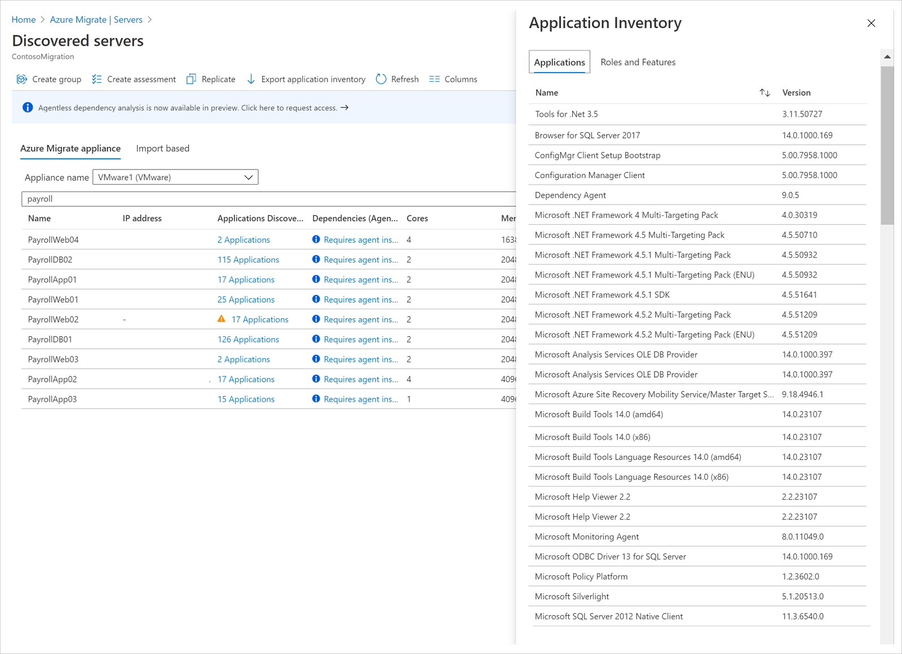

# Build migration plan with Azure Migrate

This article provides a quick guide to help build your migration plan to Azure with [Azure Migrate](migrate-services-overview.md). If you have other questions, check these resources:

- [General questions](resources-faq.md) about Azure Migrate
- Questions about the [Azure Migrate appliance](common-questions-appliance.md)
- Questions about [server migration](common-questions-server-migration.md)
- Get questions answered in the [Azure Migrate forum](https://aka.ms/AzureMigrateForum)

## Define the goals of cloud migration

Before building out a migration plan, it is important to understand and evaluate the [motivation](https://docs.microsoft.com/azure/cloud-adoption-framework/strategy/motivations) to move to the cloud that can help produce more successful business outcomes. As the [Cloud Adoption Framework for Azure](https://docs.microsoft.com/azure/cloud-adoption-framework) explains, there could be different triggers and migration approaches suitable for your business:  

**Critical business events** | **Migration outcome**
--- | ---
Datacenter exit | Cost savings
Merger, acquisition, or divestiture | Reduction in vendor or technical complexity
Reduction in capital expenses | Optimization of internal operations
End of support for mission-critical technologies | Increase in business agility
Response to regulatory compliance changes | Preparation for new technical capabilities
New data sovereignty requirements | Scaling to meet market demands
Reduction of disruptions and improvement of IT stability | Scaling to meet geographic demands

Your migration motivation can also help you reflect on the strategic goals and outcomes that you would like to achieve by migrating to Azure. The next step is to identify and plan a migration path to Azure that is tailored for your workloads. Azure Migrate: Server Assessment tool helps you assess on-premises workloads and provides guidance and tools to help you migrate.

## Understand your digital estate

Start with understanding your on-premises infrastructure, applications, and dependencies to help identify workloads that you wish to migrate to Azure and get optimized cost projections. The Server Assessment tool will help you answer the following questions:

### What workloads are in use?

Use the lightweight Azure Migrate appliance to perform an agentless discovery of your on-premises VMware VMs, Hyper-V VMs, and physical servers. The continuous discovery collects machine configuration and performance metadata and can also be used to get the inventory of installed applications, and roles/features running on your on-premises machines. The Azure Migrate appliance collects:

- Metadata details of the machines, disks, and NICs

- Installed applications including applications and roles/features  

- Performance data including CPU and memory utilization, disk IOPS, and throughput

Next, export the application inventory list to find out all SQL Server instances running on your workloads and use the Azure Migrate: Database Assessment tool to understand their readiness.

 

 

Along with the discovery data from the Server Assessment tool, use your existing CMDB data to build our view of your server and database estate and understand server distribution across business units, application owners, geographies, etc., which can in turn help in prioritizing the workloads to be migrated.

### What dependencies exist between workloads?

Once you’ve discovered your servers, use agentless dependency mapping to visualize and identify cross-server dependencies and optimization strategies for moving interdependent servers to Azure. The visualization helps to understand whether certain machines are in use, or if they can be decommissioned instead of being migrated.  Make sure you analyze dependencies to ensure that nothing is left behind and avoid surprise outages during migration. Once you have performed application inventory and dependency mapping, you can create high-confidence groups and start assessing your servers.

 

### Are they optimized and sized properly?

As Azure provides flexibility to resize your cloud capacity over time, migration is an opportunity for you to optimize the CPU and memory resources allocated to your servers. Create an assessment on the group identified before to understand the performance history of the workloads, which will be very crucial in rightsized VM SKUs and disks recommendations on Azure.

## Assess your readiness for migration

### Readiness and suitability analysis for Azure
Export the Azure VM assessment report and filter by the following readiness categories to understand VM readiness for Azure:

- **Ready for Azure**: You can migrate these machines as-is to Azure without any changes  

- **Conditionally ready for Azure**: You can migrate these machines to Azure but you will need minor changes on these servers as per the remediation guidance provided in the assessment

- **Not ready for Azure**: You cannot migrate these machines to Azure as-is and need to fix the issues as per the remediation guidance before migration

- **Readiness unknown**: Azure Migrate is unable to determine the readiness of the machine because of insufficient metadata

Using the database assessments, you can assess the readiness for migrating your SQL Server data estate to Azure SQL Databases or Azure SQL Database managed instances. You can see the migration readiness status percentage for each of your SQL server instances. Also, for each of the instances, you can see the recommended target in Azure, potential migration blockers, breaking changes count, readiness for Azure SQL DB / Azure SQL VM, and compatibility level. You can dig deeper to understand the impact of the migration blockers and recommendations to fix them.

 

### Sizing Recommendations

After the machine is marked as ready for Azure, Server Assessment makes sizing recommendations to identify the Azure VM and disk SKU for your VMs. You can choose to see the sizing recommendation based on the performance history (so that you are optimizing resources as you migrate), or as based on their on-premises configuration without considering the performance history. For databases, you can see the recommendations around database SKU, pricing tier, and compute level in your database assessment.  

### Compute assessments to get estimated costs for running the workloads in Azure

The *performance-based* right-sizing option in assessments lets you optimize workloads for Azure. In addition to rightsizing there are few other avenues to help save cost:

- **Reserved Instances**: With Reserved Instances, you can significantly reduce costs compared to pay-as-you-go pricing with 1-year or 3-year terms on Windows and Linux (VMs)

- **Azure Hybrid Benefits**: You can bring Windows Server on-premises licenses with Software Assurance to Azure and combine it with Reserved instances options

- **Enterprise Agreement Offer (EA)**: The Enterprise Agreement offers built-in savings applicable to your subscription

- **Offers**: There are multiple Azure Offers, for example, Pay-As-You-Go Dev/Test and Enterprise Dev/Test that provides lower rates for Dev or Test VMs

- **VM uptime**: you can mention the duration in days per month and hours per day when the Azure VMs will run to reduce your costs (not applicable for RI)

- **Target Region**: You can create multiple assessments in different regions to compare if migrating to a certain region in a geography might be more cost-effective

- **Performance-based recommendations**: As a best practice, try to use rightsized Azure VM recommendations that will help you save cloud costs

### Visualize data

You can see the Server Assessment report with Azure readiness and monthly cost distribution in the portal as well as export the assessment to apply more visualizations on the discovery and assessment data to make the migration plan richer. You can create multiple assessments for different combinations of properties and choose the set of properties that work best for your business.  

 

### Evaluate gaps and potential blockers

While determining the applications and underlying infrastructure to migrate, identify the downtime constraints for these applications, and look for any operational dependencies, between your applications and the underlying infrastructure. This analysis can help you plan migrations that meet your recovery time objective (RTO) and ensure minimal to zero data loss. Before you migrate, we recommend you to review and mitigate any compatibility issues or unsupported features that may block migrating your servers and SQL databases with the help of the Server Assessment report and Azure Migrate: Database Assessment recommendations.

### First workloads to target and approach

Now that you have all the crucial information to take your migration decision, you should prioritize which applications and workloads should be migrated first. Develop an “apply and learn” approach to migrate your intended applications in a systematic and controllable way so that you can iron out any flaws in this strategy before embarking on a full-scale migration. You can also use strategic factors such as - complexity and time to migrate, business urgency, production/not production environment, compliance, and security requirements, application knowledge, etc. to prioritize which application groups to migrate.

Few recommended migration strategies are:

- **Prioritize your quick wins**: You can use the assessment reports to identify low-hanging fruit, including the servers and databases that are fully ready and require minimal effort to migrate to Azure:
    - Azure Ready: Export your assessment report and filter all machines that are “Ready for Azure”. This can be your first group of machines that you can lift and shift with the Azure Migrate: Server Migration tool.
    - OS end of support: Export your assessment report and filter all machines that are running the Windows Server 2008 and Windows Server 2008 R2 operating systems. These SKUs are end of support and only Azure provides you with free 3-years of security updates when you migrate them to Azure. When you combine, Azure Hybrid Benefit and use Reserved Instances, the saving could be much higher.
    - SQL Server Migration: Use the database assessment recommendations to migrate the databases ready for Azure SQL databases using the Azure Migrate: Database Migration and the databases ready for Azure SQL VM using the Azure Migrate: Server Migration.
    - Software end of support: Export your application inventory and filter any of the software/extensions that might be reaching end of support. You should prioritize these applications.
    - Over-provisioned VMs: Export your assessment report and filter out machines with low CPU utilization (%) and memory utilization (%).  You can use this opportunity to migrate to a rightsized VM in Azure and save what you have been paying for underutilized resources.
    - Capacity Constraints: Export your assessment report and filter out machines with high CPU utilization (%) and memory utilization (%).  You can prevent the overstrained VMs from breaking and increase performance by migrating them to Azure and utilize auto-scaling capability to meet demand. You can also look at the assessment report to understand your storage constraints by analyzing the disk IOPS and throughput and find the recommended disk type that will best fit your needs.

- **Start small and then go big**: Start with moving applications and workloads that are minimal risk and less complex, to build confidence in your migration strategy. You could also intersect your Azure Migrate assessment recommendations with your organizations’ CMDB repository to find and migrate Dev/Test environment workloads in your pilot migrations. The learnings from these pilots can be used when migrating production workloads.  

- **Comply with your regulatory/industry requirements**: Azure maintains the largest compliance portfolio across the industry, in terms of breadth and depth of offerings. Use this as an opportunity to prioritize your migrations to Azure and comply with your national, regional, and industry-specific standards and laws. This is especially true for organizations that deal with business-critical or hold sensitive information or are in heavily regulated industries, where the standards and regulations abound and in certain cases may change often, making it difficult to keep up with.  

## Finalize the migration plan and prepare for migration

Before finalizing your migration plan, ensure that these key migration considerations do not play hindrance to your migration planning:

- Evaluate constraints of network bandwidth and latency which can cause unforeseen delays and disrupt the migration replication speed.

- Buffer in time to conduct performance and user acceptance testing on the migrated applications or execute any post-migration app tweaks, such as updating database connection strings and web server configurations, performing cutover and cleanup, etc.

- Review the recommended Azure permissions, and your server/database access roles and permissions model needed for the migration.

- Prepare your organization and ensure workforce alignment to the digital transformation. A solid training foundation is important for successful organizational change. Check out the free training available on [Microsoft Learn](https://docs.microsoft.com/learn/azure/?ocid=CM_Discovery_Checklist_PDF), including courses on Azure fundamentals, solution architecture, and security. Encourage your team to explore [Azure certification](https://www.microsoft.com/learning/certification-overview.aspx?ocid=CM_Discovery_Checklist_PDF) as well.  

- Get support for your implementation if required. Many organizations opt for outside help to support their cloud migration. To move to Azure quickly and confidently with personalized assistance, consider an [Azure Expert Managed Service Provider](https://www.microsoft.com/solution-providers/search?cacheId=9c2fed4f-f9e2-42fb-8966-4c565f08f11e&ocid=CM_Discovery_Checklist_PDF) or [FastTrack for Azure](https://azure.microsoft.com/programs/azure-fasttrack/?ocid=CM_Discovery_Checklist_PDF).  

Create an effective cloud migration plan that includes detailed information on the list/groups of applications you want to migrate, your app and database availability and downtime constraints, and desired migration milestones. Your migration plan should also factor in how long the data copy will take and include a considerate buffer for post-migration testing and cutover activities. The post-migration testing must include functional, integration, security, and performance testing use cases to ensure that the migrated applications work as expected and all the database objects and data relationships have successfully transferred to the Cloud. The post-migration testing must include functional, integration, security, and performance testing use cases to ensure that the migrated applications work as expected and all the database objects and data relationships have successfully transferred to the Cloud.  

Use this analysis to build a migration roadmap and declare a maintenance window to migrate your applications and databases with minimal to zero downtime and limit the potential operational/business impact during migration.  

We recommend you to always test and proceed using the Azure Migrate’s *Test Migration* capability before kicking off full-scale migrations to Azure. This real data will help you estimate the actual time involved and make necessary tweaks to your migration plan. The test migration also provides an opportunity to discover any potential issues with the migration plan and fix them before the actual migration takes place.  

Once you are ready to migrate, use Azure Migrate’s *Server Migration tool* and Azure Migrate’s *Data Migration Service* for a seamless and integrated migration experience with end to end tracking. The Server Migration tool supports the migration of VMs and servers hosted on-premises in customers’ datacenter or any other private or public cloud including AWS, GCP, etc. with around zero downtime. The Azure Database Migration Service is a fully managed service designed to enable seamless migrations from multiple database sources to Azure Data platforms with minimal downtime.  

> [!NOTE]
> For VMware VMs, Server Assessment uses the operating system specified for the VM in vCenter Server to handle the guest OS analysis. For Linux VMs running on VMware, it currently does not identify the exact kernel version of the guest OS.

## Next steps

- Investigate the [cloud migration journey](https://docs.microsoft.com/azure/architecture/cloud-adoption/getting-started/migrate) in the Azure Cloud Adoption Framework.
- [Get started](https://youtu.be/wFfq3YPxYHE) with Azure Migrate.
- Create an assessment for [VMware VMs](tutorial-assess-vmware.md) or [Hyper-V VMs](tutorial-assess-hyper-v.md).
