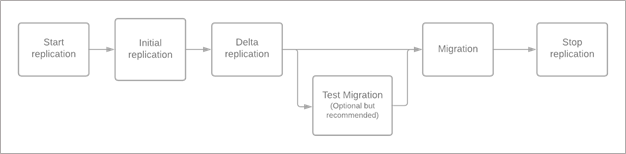
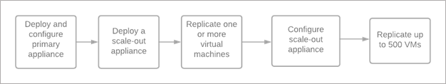

# Azure Migrate agentless migration of VMware virtual machines

This article describes the replication concepts when migrating VMware VMs using the Migration and modernization tool's agentless migration method.

## Replication process

The agentless replication option works by using VMware snapshots and VMware changed block tracking (CBT) technology to replicate data from virtual machine disks. The following block diagram shows you various steps involved when you migrate your virtual machines using the Migration and modernization tool.

 

When replication is configured for a virtual machine, it first goes through an initial replication phase. During initial replication, a VM snapshot is taken, and a full copy of data from the snapshot disks is replicated to managed disks in your target subscription.

After initial replication for the VM is complete, the replication process transitions to an incremental replication (delta replication) phase. In the incremental replication phase, data changes that have occurred since the beginning of the last completed replication cycle are replicated and written to the replica managed disks, thus keeping replication in sync with changes happening on the VM.

VMware changed block tracking (CBT) technology is used to keep track of changes between replication cycles. At the start of the replication cycle, a VM snapshot is taken and changed block tracking is used to get the changes between the current snapshot and the last successfully replicated snapshot. Only the data that has changed since the previous completed replication cycle is replicated to keep replication for the VM in sync. At the end of each replication cycle, the snapshot is released, and snapshot consolidation is performed for the virtual machine.

When you perform the migrate operation on a replicating virtual machine, there's an on-demand delta replication cycle that replicates the remaining changes since the last replication cycle. After the on-demand cycle completes, the replica managed disks corresponding to the virtual machine are used to create the virtual machine in Azure. Right before triggering migrate/failover, you must shut down the on-premises virtual machine. Shutting down the virtual machine ensures zero data loss during migration.


Once the migration is successful and the VM boots up in Azure, ensure that you stop the replication of the VM. Stopping the replication will delete the intermediate disks (seed disks) that were created during data replication, and you'll also avoid incurring extra charges associated with the storage transactions on these disks.

## Replication cycles

> [!Note]
> Ensure you check for snapshots present from earlier replication attempts or from other third party apps. Change tracking cannot be enabled on the VM if snapshots are already present for the VM. Delete the existing snapshots or enable change block tracking on the VM.

Replication cycles refer to the periodic process of transferring data from on-premises environment to Azure managed disks. A full replication cycle consists of the following steps:

1. Create VMware snapshot for each disk associated with the VM
2. Upload data to log storage account in Azure
3. Release snapshot
4. Consolidate VMware disks

A cycle is said to be complete once the disks are consolidated.

## Components involved in replication

**On-premises components:** Azure Migrate appliance has the following components that are responsible for replication

- DRA agent
- Gateway agent

**Azure components:** The following table summarizes various Azure Artifacts that are created while using the agentless method of VMware VM migration.

| Component | Region | Subscription | Description |
| --- | --- | --- | --- |
| Recovery services vault | Azure Migrate project's region | Azure Migrate project's subscription | Used to orchestrate data replication |
| Service Bus | Target region | Azure Migrate project's subscription | Used for communication between cloud service and Azure Migrate appliance |
| Log storage account | Target region | Azure Migrate project's subscription | Used to store replication data, which is read by the service and applied on customer's managed disk |
| Gateway storage account | Target region | Azure Migrate project's subscription | Used to store machine states during replication |
| Key vault | Target region | Azure Migrate project's subscription | Manages connection strings for service bus and access keys for the log storage account |
| Azure Virtual Machine | Target region | Target subscription | VM created in Azure when you migrate |
| Azure Managed Disks | Target region | Target subscription | Managed disks attached to Azure VMs |
| Network interface cards | Target region | Target subscription | The NICs attached to the VMs created in Azure |

## Permissions required

When you start replication for the first time, the logged-in user must be assigned the following roles:

- Owner or Contributor and User Access Administrator on the Azure Migrate project's Resource Group and the target Resource Group

For the subsequent replications, the logged-in user must be assigned the following roles:

- Owner or Contributor on the Azure Migrate project's Resource Group and the target Resource Group

In addition to the roles described above, the logged-in user would need the following permission at a subscription level - Microsoft.Resources/subscriptions/resourceGroups/read


## Data integrity

There are two stages in every replication cycle that ensures data integrity between the on-premises disk (source disk) and the replica disk in Azure (target disk).

1. First, we validate if every sector that has changed in the source disk is replicated to the target disk. Validation is performed using bitmaps.
Source disk is divided into sectors of 512 bytes. Every sector in the source disk is mapped to a bit in the bitmap. When data replication starts, bitmap is created for all the changed blocks (in delta cycle) in the source disk that needs to be replicated. Similarly, when the data is transferred to the target Azure disk, a bitmap is created. Once the data transfer completes successfully, the cloud service compares the two bitmaps to ensure no changed block is missed. In case there's any mismatch between the bitmaps, the cycle is considered failed. As every cycle is resynchronization, the mismatch will be fixed in the next cycle.

1. Next we ensure that the data that's transferred to the Azure disks is the same as the data that was replicated from the source disks. Every changed block that is uploaded is compressed and encrypted before it's written as a blob in the log storage account. We compute the checksum of this block before compression. This checksum is stored as metadata along with the compressed data. Upon decompression, the checksum for the data is calculated and compared with the checksum computed in the source environment. If there's a mismatch, the data isn't written to the Azure disks, and the cycle is considered failed. As every cycle is resynchronization, the mismatch will be fixed in the next cycle.

## Security

The Azure Migrate appliance compresses data and encrypts before uploading. Data is transmitted over a secure communication channel over https and uses TLS 1.2 or later. Additionally, Azure Storage automatically encrypts your data when it's persisted it to the cloud (encryption-at-rest).

## Replication status 

When a VM undergoes replication (data copy), there are a few possible states:
- **Initial replication queued**: The VM is queued for replication (or migration) as there might be other VMs that are consuming the on-premises resources (during replication or migration). Once the resources are free, this VM will be processed.
- **Initial replication in progress**: The VM is being scheduled for initial replication. 
- **Initial replication**: The VM is undergoing initial replication. When the VM is undergoing initial replication, you can't proceed with test migration and migration. You can only stop replication at this stage.
- **Initial replication (x%)**: The initial replication is active and has progressed by x%. 
- **Delta sync**: The VM might be undergoing a delta replication cycle that replicates the remaining data churn since the last replication cycle.
- **Pause in progress**: The VM is undergoing an active delta replication cycle and will be paused in some time.  
- **Paused**: The replication cycles have been paused. The replication cycles can be resumed by performing a resume replication operation. 
- **Resume queued**: The VM is queued for resuming replication as there are other VMs that are currently consuming the on-premises resources. 
- **Resume in progress (x%)**: The replication cycle is being resumed for the VM and has progressed by x%. 
- **Stop replication in progress**: Replication cleanup is in progress. When you stop replication, the intermediate managed disks (seed disks) created during replication will be deleted. [Learn more](#stop-replicationcomplete-migration).  
- **Complete migration in progress**: Migration cleanup is in progress. When you complete migration, the intermediate managed disks (seed disks) created during replication will be deleted. [Learn more](#stop-replicationcomplete-migration).  
- **–** : When the VM has successfully migrated and/or when you have stopped replication, the status changes to “-“. Once you stop replication / complete migration and the operation finishes successfully, the VM will be removed from the list of replicating machines. You can find the VM in the virtual machines tab in the replicate wizard.

### Other states

- **Initial replication failed**: The initial data couldn't be copied for the VM. Follow the remediation guidance to resolve. 
- **Repair pending**: There was an issue in the replication cycle.  You can select the link to understand possible causes and actions to remediate (as applicable). If you had opted for **Automatically repair replication** by selecting **Yes** when you triggered replication of VM, the tool will try to repair it for you. Else, select the VM, and select **Repair Replication**. If you didn't opt for **Automatically repair replication** or if the above step didn't work for you, then stop replication for the virtual machine, reset the changed block tracking on the virtual machine, and then reconfigure the replication.
- **Repair replication queued**: The VM is queued for replication repair as there are other VMs that are consuming the on-premises resources. Once the resources are free, the VM will be processed for repair replication.
- **Resync (x%)**: The VM is undergoing a data resynchronization. This can happen if there was some issue / mismatch during data replication. 
- **Stop replication/complete migration failed**: Select the link to understand the possible causes for failure and actions to remediate (as applicable).

> [!Note]
> Some VMs are put in queued state to ensure minimal impact on the source environment due to storage IOPS consumption. These VMs are processed based on the scheduling logic as described in the next section.

## Migration/test migration status 

- **Test migration pending**: The VM is in delta replication phase, and you can now perform test migration (or migration).
- **Test migration clean up pending**: After test migration is complete, perform a test migration clean up to avoid charges in Azure. 
- **Ready to migrate**: The VM is ready to be migrated to Azure. 
- **Migration in progress queued**: The VM is queued for migration as there are other VMs that are consuming the on-premises resources during replication (or migration). Once the resources are free, the VM will be processed.
- **Test migration/Migration in progress**: The VM is undergoing a test migration/migration. You can select the link to check the ongoing migration job. 
- **Date, timestamp**: The migration/test migration date and timestamp. 
- **–**: Initial replication is in progress. You can perform a migration or test migration after the replication process transitions to a delta sync (incremental replication) phase. 


### Other states

- **Completed with info**: The migration/test migration job completed with information. You can select the link to check the last migration job for possible causes and actions to remediate (as applicable). 
- **Failed**: The migration/test migration job failed. You can select the link to check the last migration job for possible causes and actions to remediate.

## Scheduling logic

Initial replication is scheduled when replication is configured for a VM. It's followed by incremental replications (delta replications).

Delta replication cycles are scheduled as follows:

- First delta replication cycle is scheduled immediately after the initial replication cycle completes
- Next delta replication cycles are scheduled according to the following logic: 
  min[max[1 hour, (Previous delta replication cycle time/2)], 12 hours]

That is, the next delta replication will be scheduled no sooner than one hour and no later than 12 hours. For example, if a VM takes four hours for a delta replication cycle, the next delta replication cycle is scheduled in two hours, and not in the next hour.

> [!Note]
> The scheduling logic is different after the initial replication completes. The first delta cycle is scheduled immediately after the initial replication completes and subsequent cycles follow the scheduling logic described above.

- When you trigger migration, an on-demand delta replication cycle (pre-failover delta replication cycle) is performed for the VM prior to migration.

**Prioritization of VMs for various stages of replication**

- Ongoing VM replications are prioritized over scheduled replications (new replications)
- Pre-failover (on-demand delta replication) cycle has the highest priority followed by initial replication cycle. Delta replication cycle has the least priority.

That is, whenever a migrate operation is triggered, the on-demand replication cycle for the VM is scheduled and other ongoing replications take back seat if they're competing for resources.

**Constraints:**

We use the following constraints to ensure that we don't exceed the IOPS limits on the SANs.

- Each Azure Migrate appliance supports replication of 52 disks in parallel
- Each ESXi host supports 8 disks. Every ESXi host has a 32-MB NFC buffer. So, we can schedule 8 disks on the host (Each disk takes up 4 MB of buffer for IR, DR).
- Each datastore can have a maximum of 15 disk snapshots. The only exception is when a VM has more than 15 disks attached to it.

## Scale-out replication

Azure Migrate supports concurrent replication of 500 virtual machines. When you're planning to replicate more than 300 virtual machines, you must deploy a scale-out appliance. The scale-out appliance is similar to an Azure Migrate primary appliance but consists only of gateway agent to facilitate data transfer to Azure. The following diagram shows the recommended way to use the scale-out appliance.




You can deploy the scale-out appliance anytime after configuring the primary appliance, but isn't required until there are 300 VMs replicating concurrently. When there are 300 VMs replicating concurrently, you must deploy the scale-out appliance to proceed.

## Stop replication/Complete migration

When you stop replication, the intermediate managed disks (seed disks) created during replication will be deleted. You can stop replication only during an active replication. You can select **Complete migration** to stop the replication after the VM was migrated.

The VM for which the replication is stopped, can be replicated by enabling replication again. If the VM was migrated, you can resume replication and migration again.

As a best practice, you should always complete the migration after the VM has migrated successfully to Azure to ensure that you don't incur extra charges for storage transactions on the intermediate managed disks (seed disks). In some cases, you'll notice that stop replication takes time. It's because whenever you stop replication, the ongoing replication cycle is completed (only when the VM is in delta sync) before deleting the artifacts.

## Impact of churn

We try to minimize the amount of data transfer in each replication cycle by allowing the data to fold as much as possible before we schedule the next cycle. Because agentless replication folds in data, the _churn pattern_ is more important than the _churn rate_. When a file is written again and again, the rate doesn't have much impact. However, a pattern in which every other sector is written causes high churn in the next cycle.

## Management of replication

### Throttling

You can increase or decrease the replication bandwidth using the _NetQosPolicy._ The _AppNamePrefix_ to use in the _NetQosPolicy_ is "GatewayWindowsService.exe". 

You could create a policy on the Azure Migrate appliance to throttle replication traffic from the appliance by creating a policy such as this one:

```New-NetQosPolicy -Name "ThrottleReplication" -AppPathNameMatchCondition "GatewayWindowsService.exe" -ThrottleRateActionBitsPerSecond 1MB```

> [!NOTE]
> This is applicable to all the replicating VMs from the Azure Migrate appliance simultaneously.

You can also increase and decrease replication bandwidth based on a schedule using the [sample script](./common-questions-server-migration.md).

### Blackout window

Azure Migrate provides a configuration-based mechanism through which customers can specify the time interval during which they don't want any replications to proceed. This time interval is called the blackout window. The need for a blackout window can arise in multiple scenarios such as when the source environment is resource constrained or when customers want replication to go through only during non-business hours, etc.

> [!NOTE]
> - The existing replication cycles at the start of the blackout window will complete before the replication pauses.
> - For any migration initiated during the blackout window, the final replication will not run, causing the migration to fail.

A blackout window can be specified for the appliance by creating/updating the file GatewayDataWorker.json in C:\ProgramData\Microsoft Azure\Config. A typical file would be of the form:

```
{
    
    "BlackoutWindows": "List of blackout windows"
    
}
```

    
The list of blackout windows is a "|" delimited string of the format "DayOfWeek;StartTime;Duration". The duration can be specified in days, hours, and minutes. For example, the blackout windows can be specified as:

```
{
    
    "BlackoutWindows": "Monday;7:00;7h | Tuesday;8:00;1d7h | Wednesday;16:00;1d | Thursday;18:00;5h | Friday;13:00;8m"
    
}
```
    
The first value in the above example indicates a blackout window starting every Monday at 7:00 AM local time (time on the appliance) and lasting 7 hours.

Once the GatewayDataWorker.json is created/updated with these contents, the Gateway service on the appliance needs to be restarted for these changes to take effect.

In the scale-out scenario, the primary appliance and the scale-out appliance honor the blackout windows independently. As a best practice, we recommend keeping the windows consistent across appliances.

## Next steps
[Migrate VMware VMs](tutorial-migrate-vmware.md) with agentless migration.
