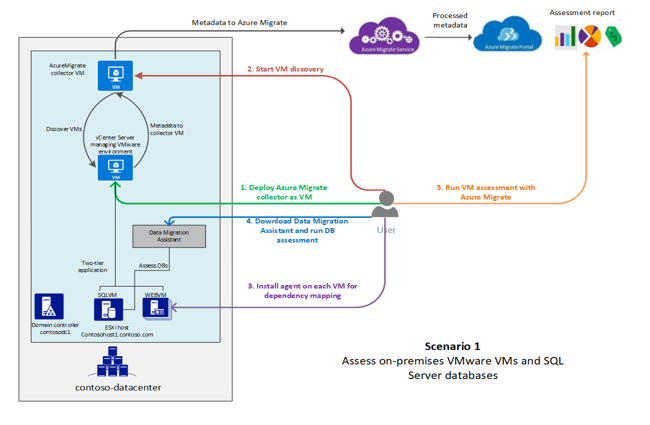

# Contoso migration: Assess on-premises workloads for migration to Azure

This article shows you how Contoso assesses its on-premises SmartHotel app, in preparation for its migration to Azure.

This document is the third in series of articles that document how the fictitious company Contoso migrates its on-premises resources to the Microsoft Azure cloud. The series includes background information, and a series of deployment scenarios that illustrate how to set up a migration infrastructure, assess the suitability of on-premises resources for migration, and run different types of migrations. Scenarios grow in complexity, and we'll be adding additional articles over time.

**Article** | **Details** | **Status**
--- | --- | ---
[Article 1: Overview](contoso-migration-overview.md) | Provides an overview of Contoso's migration strategy, the article series, and the sample apps we use. | Available
[Article 2: Deploy an Azure infrastructure](contoso-migration-infrastructure.md) | Describes how Contoso prepares its on-premises and Azure infrastructure for migration. The same infrastructure is used for all migration articles. | Available
Article 3: Assess on-premises resources for migration to Azure  | Shows how Contoso runs an assessment of an on-premises two-tier SmartHotel app running on VMware. Contoso assesses app VMs with the [Azure Migrate](migrate-overview.md) service, and the app SQL Server database with the [Database Migration Assistant](https://docs.microsoft.com/sql/dma/dma-overview?view=sql-server-2017). | This article.
[Article 4: Rehost an app on Azure VMs and a SQL Managed Instance](contoso-migration-rehost-vm-sql-managed-instance.md) | Demonstrates how Contoso runs a lift-and-shift migration to Azure for the on-premises SmartHotel app. Contoso migrates the app frontend VM using [Azure Site Recovery](https://docs.microsoft.com/azure/site-recovery/site-recovery-overview), and the app database to a SQL Managed Instance, using the [Azure Database Migration Service](https://docs.microsoft.com/azure/dms/dms-overview). | Available
[Article 5: Rehost an app on Azure VMs](contoso-migration-rehost-vm.md) | Shows how Contoso migrate the SmartHotel app VMs to Azure VMs, using the Site Recovery service. | Available
[Article 6: Rehost an app on Azure VMs and SQL Server Always On Availability Group](contoso-migration-rehost-vm-sql-ag.md) | Shows how Contoso migrates the SmartHotel app. Contoso uses Site Recovery to migrate the app VMs, and the Database Migration service to migrate the app database to a SQL Server cluster protected by an AlwaysOn availability group. | Available
[Article 7: Rehost a Linux app on Azure VMs](contoso-migration-rehost-linux-vm.md) | Shows how Contoso does a lift-and-shift migration of the Linux osTicket app to Azure VMs, using Site Recovery | Available
[Article 8: Rehost a Linux app on Azure VMs and Azure MySQL](contoso-migration-rehost-linux-vm-mysql.md) | Demonstrates how Contoso migrates the Linux osTicket app to Azure VMs using Site Recovery, and migrates the app database to an Azure MySQL Server instance using MySQL Workbench. | Available
[Article 9: Refactor an app on Azure Web Apps and Azure SQL database](contoso-migration-refactor-web-app-sql.md) | Demonstrates how Contoso migrates the SmartHotel app to an Azure Web App, and migrates the app database to Azure SQL Server instance | Available
[Article 10: Refactor a Linux app on Azure Web Apps and Azure MySQL](contoso-migration-refactor-linux-app-service-mysql.md) | Shows how Contoso migrates the Linux osTicket app to Azure Web Apps in multiple sites, integrated with GitHub for continuous delivery. They migrate the app database to an Azure MySQL instance. | Available
[Article 11: Refactor TFS on VSTS](contoso-migration-tfs-vsts.md) | Shows how Contoso migrates their on-premises Team Foundation Server (TFS) deployment by migrating it to Visual Studio Team Services (VSTS) in Azure. | Available
[Article 12: Rearchitect an app on Azure containers and Azure SQL Database](contoso-migration-rearchitect-container-sql.md) | Shows how Contoso migrates and rearchitects their SmartHotel app to Azure. They rearchitect the app web tier as a Windows container, and the app database in an Azure SQL Database. | Available
[Article 13: Rebuild an app in Azure](contoso-migration-rebuild.md) | Shows how Contoso rebuild their SmartHotel app using a range of Azure capabilities and services, including App Services, Azure Kubernetes, Azure Functions, Cognitive services, and Cosmos DB. | Available


## Overview

As they consider migration to Azure, Contoso company wants to run a technical and financial assessment to figure out whether its on-premises workloads are suitable for migration to the cloud. In particular, the Contoso team want to assess machine and database compatibility for migration, and estimate capacity and costs for running their resources in Azure.

To get their feet wet and better understand the technologies involved, they're going to assess two of their on-premises apps, summarized in the following table. Note that they're assessing for migration scenarios that rehost and refactor apps for migration. Learn more about rehosting and refactoring in the [Contoso migration overview](contoso-migration-overview.md).

**App name** | **Platform** | **App tiers** | **Details**
--- | --- | --- | ---
SmartHotel<br/><br/> Manages Contoso travel requirements | Running on Windows with a SQL Server database | Two-tiered app with the frontend ASP.NET website running on one VM (WEBVM), and the SQL Server running on another VM (SQLVM) | VMs are VMware, running on an ESXi host managed by vCenter server.<br/><br/> The sample app can be downloaded from [GitHub](https://github.com/Microsoft/SmartHotel360).
OSTicket<br/><br/> Contoso Service Desk app | Running on Linux/Apache, with a MySQL PHP (LAMP). | Two-tiered app with a frontend PHP website  on one VM (OSTICKETWEB), and the MySQL database running on another VM (OSTICKETMYSQL) | The app is used by customer service apps to track issues for internal employees and external customers.<br/><br/> The sample app can be downloaded from [GitHub](https://github.com/osTicket/osTicket).

## Current architecture


Here's a diagram showing the current Contoso on-premises infrastructure.

  

- Contoso has one main datacenter located in the city of New York in the Eastern United States.
- They have three additional local branches across the United States.
- The main datacenter is connected to the internet with a fiber metro ethernet connection (500 mbps).
- Each branch is connected locally to the internet using business class connections, with IPSec VPN tunnels back to the main datacenter. This allows their entire network to be permanently connected, and optimizes internet connectivity.
- The main datacenter is fully virtualized with VMware. They have two ESXi 6.5 virtualization hosts, managed by vCenter Server 6.5.
- Contoso uses Active Directory for identity management, and DNS servers on the internal network.
- The domain controllers in the datacenter run on VMware VMs. The domain controllers at local branches run on physical servers.


## Business drivers

The IT Leadership team has worked closely with their business partners to understand what the business wants to achieve with this migration:

- **Address business growth**: Contoso is growing and as a result there is pressure on their on-premises systems and infrastructure.
- **Increase efficiency**: Contoso needs to remove unnecessary procedures, and streamline processes for their developers and users.  The business needs IT to be fast and not waste time or money, thus delivering faster on customer requirements.
- **Increase agility**:  Contoso IT needs to be more responsive to the needs of the business. It must be able to react faster than the changes in the marketplace, to enable the success in a global economy.  It mustn't get in the way, or become a business blocker.
- **Scale**: As the business grows successfully, Contoso IT must provide systems that are able to grow at the same pace.

## Assessment goals

The Contoso cloud team has pinned down goals for their migration assessments:

- After migration, apps in Azure should have the same performance capabilities as it does today in their on-premises VMWare environment.  Moving to the cloud doesn't mean that app performance is less critical.
- Contoso needs to understand the compatibility of their applications and databases with Azure requirements, as well as their hosting options in Azure.
- Contoso's database administration should be minimized after apps have moved to the cloud.  
- Contoso wants to understand not only the migration options,  but also the costs associated with the infrastructure after it's moved to the cloud.

## Assessment tools
Contoso is using Microsoft tools for the assessment. These tools align with their goals and should provide them with all the information they need.

**Technology** | **Description** | **Cost**
--- | --- | ---
[Database Migration Assistant (DMA)](https://docs.microsoft.com/sql/dma/dma-overview?view=ssdt-18vs2017) | They'll use DMA to assess and detect compatibility issues that might impact their database functionality in Azure. DMA assesses feature parity between SQL sources and targets, and recommends performance and reliability improvements. | It's a downloadable tool free of charge.
[Azure Migrate](https://docs.microsoft.com/azure/migrate/migrate-overview) | Contoso will use this service to assess their VMware VMs. It assesses the migration suitability of the machines, and provides sizing and cost estimations for running in Azure.  | There's currently (May 2018) no charge for using this service.
[Service Map](https://docs.microsoft.com/azure/operations-management-suite/operations-management-suite-service-map) | Azure Migrate uses Service Map to show dependencies between machines you want to migrate. |  Service Map is part of Azure Log Analytics. It can currently be used for 180 days without incurring charges.

In this scenario, Contoso downloads and runs the DMA to assess the on-premises SQL Server database for their travel app. They use Azure migrate with dependency mapping to assess the app VMs, before migration to Azure.


## Assessment architecture


- Contoso is a fictitious name representing a typical enterprise organization.
- Contoso has an on-premises datacenter (**contoso-datacenter**), with on-premises domain controllers (CONTOSODC1, CONTOSODC2).
- VMware VMs are located on a VMware ESXI hosts running version 6.5. Hosts: **contosohost1**, **contosohost2**
- The VMware environment is managed by vCenter server 6.5 (**venter**, running on a VM.
- The SmartHotel travel app:
    - The app is tiered across two VMware VMs, **WEBVM** and **SQLVM**.
    - The VMs are located on VMware ESXi host **contosohost1.contoso.com**.
    - The VMs are running Windows Server 2008 R2 Datacenter with SP1.
- The VMware environment is managed by vCenter Server (**vcenter.contoso.com**) running on a VM.
- The OSTicket Service Desk app:
    - The app is tiered across two VMs, **OSTICKETWEB** and **OSTICKETMYSQL**.
    - The VMs are running on Ubuntu Linux Server 16.04-LTS.
    - The OSTICKETWEB VM is running Apache 2 and PHP 7.0.
    - The OSTICKETMYSQL VM is running MySQL 5.7.22.




## Prerequisites

Here's what Contoso (and you) needs for the assessment:

- Owner or Contributor access for the Azure subscription, or for a Resource Group in the Azure Subscription.
- An on-premises vCenter server running version 5.5, 6.0, or 6.5.
- A read-only account in vCenter server, or permissions to create one.
- Permissions to create a VM on the vCenter server, using an .OVA template.
- At least one ESXi host running version 5.0 or higher.
- At least two on-premises VMware VMs, one running a SQL Server database.
- Permissions to install Azure Migrate agents on each VM.
- The VMs should have direct internet connectivity.
        - You can restrict internet access to the [required URLs](https://docs.microsoft.com/azure/migrate/concepts-collector#collector-pre-requisites).
        - If machines with no internet connectivity, the [OMS gateway](../log-analytics/log-analytics-oms-gateway.md) needs to be installed on them.
- The FQDN of the VM running the SQL Server instance, for database assessment.
- Windows Firewall running on the SQL Server VM should allow external connections on TCP port 1433 (default), so that the DMA can connect.


## Assessment overview

Here's how Contoso is going to do the assessment:


> [!div class="checklist"]
> * **Step 1: Download and install DMA**: Prepare DMA for assessment of the on-premises SQL Server database.
> * **Step 2: Assess the database with DMA**: Run and analyze the database assessment.
> * **Step 3: Prepare for VM assessment with Azure Migrate**: Set up on-premises accounts, and tweak VMware settings.
> * **Step 4: Discover on-premises VMs with Azure Migrate**: Create an Azure Migrate collector VM. Then, they run the collector to discover VMs for assessment.
> * **Step 5: Prepare for dependency analysis with Azure Migrate**: Install Azure Migrate agents on the VMs, so that they can see dependency mapping between VMs.
> * **Step 6: Assess the VMs with Azure Migrate**: Check dependencies, group the VMs, and run the assessment. After the assessment is ready, they analyze it in preparation for migration.


## Step 1: Download and install the DMA

1. Contoso downloads the DMA from the [Microsoft Download Center](https://www.microsoft.com/download/details.aspx?id=53595).
    - The Assistant can be installed on any machine that can connect to the SQL instance. You don't need to run it on the SQL Server machine.
    - It shouldn't be run on the SQL Server host machine.
2. They run the downloaded setup file (DownloadMigrationAssistant.msi), to start the installation.
3. On the **Finish** page, they select **Launch Microsoft Data Migration Assistant** before finishing the wizard.

## Step 2: Run and analyze the database assessment for SmartHotel

Now Contoso can run an assessment to analyze their on-premises SQL Server for the SmartHotel app.

1. In the Database Migration Assistant, they click **New**, select **Assessment**, and give the assessment a project name - **SmartHotel**.
2. They select the **Source server type** as **SQL Server on Azure Virtual Machines**.

    

    > [!NOTE]
      At present DMA doesn't support assessment for migrating to a SQL Managed Instance. As a workaround, Contoso is using SQL Server on Azure VM as the supposed target for the assessment.

3. In **Select Target Version**, they select SQL Server 2017 as the target version. They need to select this because it's the version used by SQL Managed Instance.
4. They select to discover information about compatibility and new features:
    - **Compatibility Issues** note changes that might break migration, or that require a minor adjustment before migration. It keeps you informed about any features currently in use that have been deprecated. Issues are organized by compatibility level.
    - **New features' recommendation** notes new features in the target SQL Server platform that can be used for the database after migration. These are organized by Performance, Security, and Storage.

    

2. In **Connect to a server**, they enter the name of the VM running the database, and credentials to access it. They need to enable **Trust server certificate** to make sure they can get to the SQL Server. Then they click **Connect**.

    

3. In **Add source**, they add the database they want to assess, and  click **Next** to start the assessment.
4. The assessment is created.

    

5. In **Review Results**, they can see the assessment results.


### Analyze the database assessment

Results are displayed as soon as they're available. If they fix issues they need to click **Restart Assessment** to rerun the assessment.

1. In the **Compatibility Issues** report, they check for any issues at each compatibility level. Compatibility levels map to SQL Server versions as follows:

    - 100: SQL Server 2008/Azure SQL Database
    - 110: SQL Server 2012/Azure SQL Database
    - 120: SQL Server 2014/Azure SQL Database
    - 130: SQL Server 2016/Azure SQL Database
    - 140: SQL Server 2017/Azure SQL Database

    

2. In the **Feature recommendations** report, Contoso can view performance, security, and storage features that the assessment recommends after migration. A variety of features are recommended, including In-Memory OLTP and Columnstore, Stretch Database, Always Encrypted, Dynamic Data Masking, and Transparent Data Encryption (TDE).

    

    > [!NOTE]
    > We recommend that Contoso [enables TDE](https://docs.microsoft.com/sql/relational-databases/security/encryption/transparent-data-encryption?view=sql-server-2017) for all SQL Server databases, and this is even more critical when databases are in the cloud. TDE should only be enabled after migration. If TDE is already enabled, you will need to move the certificate or asymmetric key to the master database of the target server. [Learn more](https://docs.microsoft.com/sql/relational-databases/security/encryption/move-a-tde-protected-database-to-another-sql-server?view=sql-server-2017).

2. They can export the assessment in JSON or CSV format.

Note that if you're running a larger scale assessment you can:

- Run multiple assessments concurrently and view the state of the assessments by opening the **All Assessments** page.
- [Consolidate assessments into a SQL Server database](https://docs.microsoft.com/sql/dma/dma-consolidatereports?view=ssdt-18vs2017#import-assessment-results-into-a-sql-server-database).
- [Consolidate assessments into a PowerBI report](https://docs.microsoft.com/sql/dma/dma-powerbiassesreport?view=ssdt-18vs2017).


## Step 3: Prepare for VM assessment with Azure Migrate

Contoso needs to create a VMware account that Azure Migrate will use to automatically discover VMs for assessment, verify permissions to create a VM, note the ports that need to be opened, and set the statistics settings level.

### Set up a VMware account

 VM discovery requires a read-only account in vCenter, with the following properties:

- User type: At least a read-only user.
- Permissions: Data Center object –> Propagate to Child Object, role=Read-only.
- Details: User assigned at datacenter level, and has access to all the objects in the datacenter.
- To restrict access, assign the **No access** role with the **Propagate to child** object, to the child objects (vSphere hosts, datastores, VMs and networks).

### Verify permissions to create a VM

Contoso verifies it has permissions to create a VM by importing a file in .OVA format. [Learn more](https://kb.vmware.com/s/article/1023189?other.KM_Utility.getArticleLanguage=1&r=2&other.KM_Utility.getArticleData=1&other.KM_Utility.getArticle=1&ui-comm-runtime-components-aura-components-siteforce-qb.Quarterback.validateRoute=1&other.KM_Utility.getGUser=1).

### Verify ports

The Contoso assessment uses dependency mapping. This feature requires an agent installed on VMs you want to assess. The agent needs to be able to connect to Azure from TCP port 443 on each VM. [Learn more](https://docs.microsoft.com/azure/log-analytics/log-analytics-concept-hybrid)  about connection requirements.


### Set statistics settings

Before they begin the deployment, Contoso must set the statistics settings for the vCenter Server to level 3. Note that:

- After setting the level, you need to wait at least a day before you run the assessment. Otherwise it might not work as expected.
- If the level is higher than 3, the assessment will work, but:
    - Performance data for disks and networking won't be collected.
    - For storage, Azure Migrate recommends a standard disk in Azure, with the same size as the on-premises disk.
    - For networking, for each on-premises network adapter, a network adapter will be recommended in Azure.
    - For compute, Azure Migrate will look at the VM cores and memory size, and recommends an Azure VM with the same configuration. If there are multiple eligible Azure VM sizes, the one with the lowest cost is recommended.
- [Learn more](https://docs.microsoft.com/azure/migrate/concepts-assessment-calculation#sizing) about sizing with level 3.

They set the level as follows:

1. In the vSphere Web Client, they open the vCenter server instance.
2. In **Manage** > **Settings** > **General**, they click **Edit**.
3. In **Statistics**, they set the statistic level settings to **Level 3**.

    


## Step 4: Discover VMs

To discover VMs, Contoso creates an Azure Migrate project. They download and set up the collector VM, and run the collector to discover their on-premises VMs.

### Create a project

1. In the [Azure portal](https://portal.azure.com), they search for **Azure Migrate**, and create a project (ContosoMigration).
2. They specify a project name, the Azure subscription, and create a new Azure resource group, **ContosoFailoverRG**. Note that:

    - You can only create an Azure Migrate project in the West Central US or East US region.
    - You can plan a migration for any target location.
    - The project location is only used to store the metadata gathered from on-premises VMs.

    


### Download the collector appliance

Azure Migrate creates an on-premises VM known as the collector appliance. This VM discovers on-premises VMware VMs, and sends metadata about them to the Azure Migrate service. To set up the collector appliance, Contoso downloads an .OVA template, and imports it to the on-premises vCenter server to create the VM.

1. In the Azure Migrate project > **Getting Started** > **Discover & Assess** > **Discover Machines**, they download the .OVA template file.
2. They copy the project ID and key. These are needed to configure the collector.

    

### Verify the collector appliance

Before deploying the VM, Contoso checks that the .OVA file is secure.

1. On the machine on which the file downloaded, they open an administrator command window.
2. They run the following command to generate the hash for the OVA:
    - ```C:\>CertUtil -HashFile <file_location> [Hashing Algorithm]```
    - Example usage: ```C:\>CertUtil -HashFile C:\AzureMigrate\AzureMigrate.ova SHA256```
3. The generated hash should match these settings (version 1.0.9.12)

**Algorithm** | **Hash value**
--- | ---
MD5 | d0363e5d1b377a8eb08843cf034ac28a
SHA1 | df4a0ada64bfa59c37acf521d15dcabe7f3f716b
SHA256 | f677b6c255e3d4d529315a31b5947edfe46f45e4eb4dbc8019d68d1d1b337c2e

### Create the collector appliance

Now Contoso can import the downloaded file to the vCenter Server and provision the configuration server VM.

1. In the vSphere Client console, they click **File** > **Deploy OVF Template**.

    

2. In the Deploy OVF Template Wizard > **Source**, they specify the location of the .OVA file.
3. In **Name and Location**, they specify a friendly name for the collector VM, and the inventory location in which the VM will be hosted. They also specify the host or cluster on which the collector appliance will run.
5. In **Storage**, they specify the storage location, and in **Disk Format**, how they want to provision the storage.
7. In **Network Mapping**, they specify the network to which the collector VM will connect. The network needs internet connectivity, to send metadata to Azure.
8. They review the settings, and select **Power on after deployment**> **Finish**. A message confirming successful completion is issued after the appliance is created.

### Run the collector to discover VMs

Now they run the collector to discover VMs. Note that the collector currently only supports "English (United States)" as the operating system language and the collector interface language.

1. In the vSphere Client console > **Open Console**, they specify the language, time zone, and password preferences for the collector VM.
2. On the desktop, they click the **Run collector** shortcut.

    

4. In the Azure Migrate Collector > **Set up prerequisites**, they accept the license terms, and read the third-party information.
5. The collector checks that the VM has internet access, that the time is synchronized, and that the collector service is running (it's installed by default on the VM). It also installs VMWare PowerCLI.

    > [!NOTE]
    > We're presuming that the VM has direct access to the internet, without a proxy.

    


5. In **Specify vCenter Server details**, they specify the name (FQDN) or IP address of the vCenter server, and the read-only credentials used for discovery.
7. They select a scope for VM discovery. The collector can only discover VMs within the specified scope. Scope can be set to a specific folder, datacenter, or cluster. It shouldn't contain more than 1500 VMs.

	

6. In **Specify migration project**, they specify the Azure Migrate project ID and key that was copied from the portal. You can obtain them again in the project **Overview** page > **Discover Machines**.  

    

7. In **View collection progress** Contoso can monitor discovery, and check that metadata collected from the VMs is in scope. The collector provides an approximate discovery time.

    


### Verify VMs in the portal

After collection completes, Contoso checks that the VMs appear in the portal.

1. In the Azure Migrate project > **Manage** > **Machines**, they check that the VMs you want to discover appear.

    

3. Note that the machines currently don't have the Azure Migrate agents installed. Contoso needs to install these in order to view dependencies.

    


## Step 5: Prepare for dependency analysis

To view dependencies between VMs that Contoso want to access, they download and install agents on the app VMs. Contoso does this on all VMs for their apps, both Windows and Linux.

### Take a snapshot

They keep a copy of VM before modifying them, by taking a snapshot before the agents are installed.


### Download and install the VM agents

1. On the **Machines** page, they select the machine, and then **Requires installation** in the **Dependencies** column.
2. On the **Discover Machines** page they do the following:
	- Download the MMA and dependency agent for each Windows VM
	- Download the MMA and dependency agent for each Linux VM
3. Now they copy the workspace ID and key. They need these when installing the MMA.

    

### Install the agents on Windows VMs

They run the installation on each VM.

#### Install the MMA on Windows VMs

1. They double-click the downloaded agent.
2. In **Destination Folder**, they keep the default installation folder > **Next**.
2. In **Agent Setup Options**, they select **Connect the agent to Azure Log Analytics** > **Next**.

    

5. In **Azure Log Analytics**, they paste in the workspace ID and key that you copied from the portal.

	

6. In **Ready to Install**, they can now install the MMA.

#### Install the Dependency agent on Windows VMs

1. They double-click the downloaded Dependency agent.
2. They accept the license terms and wait for the installation to finish.

    


### Install the agents on Linux VMs

They run the installation on each VM.

#### Install the MMA on Linux VMs

1. They install the python ctypes library on each VM using: **sudo apt-get install python-ctypeslib**.
2. They should run the command to install the MMA agent as root.  To become root run the following command and enter the root password: **sudo -i**.
3. Now they install the MMA agent.
    - Insert your correct workspace ID and key into the command.
    - Commands are for 64-bit.
    - The **Workspace ID** and **Primary Key** can be found inside the OMS Portal > **Settings**, in the **Connected Sources** tab.
    - Run the following commands to download the OMS agent, validate the checksum, and install/onboard the agent.

    ```
    wget https://raw.githubusercontent.com/Microsoft/OMS-Agent-for-Linux/master/installer/scripts/onboard_agent.sh && sh onboard_agent.sh -w 6b7fcaff-7efb-4356-ae06-516cacf5e25d -s k7gAMAw5Bk8pFVUTZKmk2lG4eUciswzWfYLDTxGcD8pcyc4oT8c6ZRgsMy3MmsQSHuSOcmBUsCjoRiG2x9A8Mg==
    ```


#### Install the Dependency agent on Linux VMs

After MMA is installed, Contoso can install the Dependency agent on the Linux VMs.

1. The Dependency Agent is installed on Linux computers using InstallDependencyAgent-Linux64.bin, a shell script with a self-extracting binary. They can run the file by using sh, or add execute permissions to the file itself.

2. They install the Linux Dependency agent as root:

    ```
    wget --content-disposition https://aka.ms/dependencyagentlinux -O InstallDependencyAgent-Linux64.bin && sudo sh InstallDependencyAgent-Linux64.bin -s
    ```


## Step 6: Run and analyze the VM assessment

Contoso can now verify machine dependencies and create a group. Then, they run the assessment for the group.

### Verify dependencies and create a group


1. For the machines to analyze, they click **View Dependencies**.

    

2. For the SQLVM, the dependency map shows the following details:

    - Process groups/processes with active network connections running on SQLVM, during the specified time period (an hour by default)
    - Inbound (client) and outbound (server) TCP connections to and from all dependent machines.
    - Dependent machines with the Azure Migrate agents installed are shown as separate boxes
    - Machines without the agents installed show port and IP address information.

3. For machines with the agent installed (WEBVM), they click on the machine box to view more information, including the FQDN, operating system, and MAC address.

    

4. Now they select the VMs to add to the group (SQLVM and WEBVM).  They can use CTRL+click to select multiple VMs.
5. They click **Create Group**, and specify a name (smarthotelapp).

> [!NOTE]
    > To view more granular dependencies, you can expand the time range. You can select a specific duration, or start and end dates.


### Run an assessment


1. On the **Groups** page, they open the group (smarthotelapp), and click **Create assessment**.

    

2. The assessment appears in the **Manage** > **Assessments** page.

Contoso used the default assessment settings, but you can customize settings. [Learn more](how-to-modify-assessment.md).


### Analyze the VM assessment

An Azure Migrate assessment includes information about on-premises VMs compatibility for Azure, suggested right-sizing for Azure VM, and estimated monthly Azure costs.


#### Review confidence rating


An assessment gets a confidence rating from 1 star to 5 star (1 star being the lowest and 5 star being the highest).
- The confidence rating is assigned to an assessment based on the availability of data points needed to compute the assessment.
- The rating helps you to estimate the reliability of the size recommendations provided by Azure Migrate.
- Confidence rating is useful when you are doing *performance-based sizing* as Azure Migrate might not have enough data points to do utilization-based sizing. For *as on-premises sizing*, the confidence rating is always 5-star as Azure Migrate has all the data points it needs to size the VM.
- Depending on the percentage of data points available, the confidence rating for the assessment is provided:

   **Availability of data points** | **Confidence rating**
   --- | ---
   0%-20% | 1 Star
   21%-40% | 2 Star
   41%-60% | 3 Star
   61%-80% | 4 Star
   81%-100% | 5 Star

#### Verify readiness

  

The assessment report shows the information summarized in the table. Note that to show performance-based sizing, Azure Migrate needs the following information. If this information can't be collected, sizing assessment might not be accurate.

- Utilization data for CPU and memory.
- Read/write IOPS and throughput for each disk attached to the VM.
- Network in/out information for each network adapter attached to the VM.


**Setting** | **Indication** | **Details**
--- | --- | ---
**Azure VM readiness** | Indicates whether the VM is ready for migration | Possible states:</br><br/>- Ready for Azure<br/><br/>- Ready with conditions <br/><br/>- Not ready for Azure<br/><br/>- Readiness unknown<br/><br/> If a VM isn't ready, we'll show some remediation steps.
**Azure VM size** | For ready VMs, we recommend an Azure VM size. | Sizing recommendation depends on assessment properties:<br/><br/>- If you used performance-based sizing, sizing considers the performance history of the VMs.<br/><br/>-If you used 'as on-premises', sizing is based on the on-premises VM size, and utilization data isn't used.
**Suggested tool** | Since our machines are running the agents, Azure Migrate looks at the processes running inside the machine and identifies whether the machine is a database machine or not.
**VM information** | The report shows settings for the on-premises VM, including operating system, boot type, disk and storage information.


#### Review monthly cost estimates

This view shows the total compute and storage cost of running the VMs in Azure, along with the details for each machine.


- Cost estimates are calculated using the size recommendations for a machine.
- Estimated monthly costs for compute and storage are aggregated for all VMs in the group.


## Clean up after assessment

- After the assessment finishes, Contoso retains the Azure Migration appliance for future evaluations.
- They turn off the VM VMware. They'll start it again when they evaluate additional VMs.
- They'll keep the Contoso Migration project in Azure.  It's currently deployed in the ContosoFailoverRG resource group, in the East US Azure Region.
-  The collector VM does have a 180-day evaluation license. If this limit expires, they'll need to download and set up the collector again.


## Conclusion

In this scenario Contoso assessed its SmartHotel app database using the DMA tool, and the on-premises VMs using the Azure Migrate service. They then reviewed the assessments to make sure on-premises resources are ready for migration to Azure.

## Next steps

In the next article in this series, Contoso rehosts its SmartHotel app in Azure with a lift-and-shift migration. Contoso migrates the frontend WEBVM for the app using Azure Site Recovery, and the app database to an Azure SQL Managed Instance, using the Database Migration Service. [Get started](contoso-migration-rehost-vm-sql-managed-instance.md) with this deployment.
