# Contoso migration: Assess on-premises workloads for migration to Azure

In this article, Contoso assesses its on-premises SmartHotel360 app for migration to Azure.

This article is part of a series that documents how the fictitious company Contoso migrates its on-premises resources to the Microsoft Azure cloud. The series includes background informatio, and detailed deployment scenarios that illustrate how to set up a migration infrastructure, assess the suitability of on-premises resources for migration, and run different types of migrations. Scenarios grow in complexity. Articles will be added to the series over time.

Article | Details | Status
--- | --- | ---
[Article 1: Overview](contoso-migration-overview.md) | Overview of the article series, Contoso's migration strategy, and the sample apps that are used in the series. | Available
[Article 2: Deploy an Azure infrastructure](contoso-migration-infrastructure.md) | Contoso prepares its on-premises infrastructure and its Azure infrastructure for migration. The same infrastructure is used for all articles in the series. | Available
Article 3: Assess on-premises resources for migration to Azure | Contoso runs an assessment of its on-premises SmartHotel360 app running on VMware. Contoso assesses app VMs using the Azure Migrate service, and the app SQL Server database using Data Migration Assistant. | This article
[Article 4: Rehost an app on an Azure VM and SQL Database Managed Instance](contoso-migration-rehost-vm-sql-managed-instance.md) | Contoso runs a lift-and-shift migration to Azure for its on-premises SmartHotel360 app. It migrates the app front-end using the Azure Site Recovery service. It migrates the app database to an Azure SQL Database Managed Instance using the Azure Database Migration Service. | Available
[Article 5: Rehost an app on Azure VMs](contoso-migration-rehost-vm.md) | Contoso migrates its SmartHotel360 app VMs to Azure VMs using the Site Recovery service. | Available
[Article 6: Rehost an app on Azure VMs and in a  SQL Server AlwaysOn availability group](contoso-migration-rehost-vm-sql-ag.md) | Contoso migrates the SmartHotel360 app, using Site Recovery to migrate the app VMs, and the Database Migration Service to migrate the app database to a SQL Server cluster that's protected by an AlwaysOn availability group. | Available
[Article 7: Rehost a Linux app on Azure VMs](contoso-migration-rehost-linux-vm.md) | Contoso completes a lift-and-shift migration of its Linux osTicket app to Azure VMs, using the Site Recovery service. | Available
[Article 8: Rehost a Linux app on Azure VMs and Azure Database for MySQL](contoso-migration-rehost-linux-vm-mysql.md) | Contoso migrates its Linux osTicket app to Azure VMs using Site Recovery. It migrates the app database to Azure Database for MySQL using MySQL Workbench. | Available
[Article 9: Refactor an app in an Azure web app and Azure SQL Database](contoso-migration-refactor-web-app-sql.md) | Contoso migrates its SmartHotel360 app to an Azure web app, and migrates the app database to an Azure SQL Server instance with the Databse Migration Assistant. | Available
[Article 10: Refactor a Linux app in an Azure web app and Azure Database for MySQL](contoso-migration-refactor-linux-app-service-mysql.md) | Contoso migrates its Linux osTicket app to an Azure web app on multiple Azure regions using Azure Traffic Manager, integrated with GitHub for continuous delivery. Contoso migrates the app database to an Azure Database for MySQL instance. | Available
[Article 11: Refactor Team Foundation Server on Azure DevOps Services](contoso-migration-tfs-vsts.md) | Contoso migrates its on-premises Team Foundation Server deployment to Azure DevOps Services in Azure. | Available
[Article 12: Rearchitect an app in Azure containers and Azure SQL Database](contoso-migration-rearchitect-container-sql.md) | Contoso migrates its SmartHotel app to Azure. Then, it rearchitects the app web tier as a Windows container running in Azure Service Fabric, and the database with Azure SQL Database. | Available
[Article 13: Rebuild an app in Azure](contoso-migration-rebuild.md) | Contoso rebuilds its SmartHotel app by using a range of Azure capabilities and services, including Azure App Service, Azure Kubernetes Service (AKS), Azure Functions, Azure Cognitive Services, and Azure Cosmos DB. | Available
[Article 14: Scale a migration to Azure](contoso-migration-scale.md) | After trying out migration combinations, Contoso prepares to scale to a full migration to Azure. | Available


## Overview

As Contoso considers migrating to Azure, the company wants to run a technical and financial assessment to determine whether its on-premises workloads are suitable for migration to the cloud. In particular, the Contoso team wants to assess machine and database compatibility for migration. It wants to estimate capacity and costs for running Contoso's resources in Azure.

To get started and to better understand the technologies involved, Contoso assesses two of its on-premises apps, summarized in the following table. The company assesses for migration scenarios that rehost and refactor apps for migration. Learn more about rehosting and refactoring in the [Contoso migration overview](contoso-migration-overview.md).

App name | Platform | App tiers | Details
--- | --- | --- | ---
SmartHotel360<br/><br/> (manages Contoso travel requirements) | Runs on Windows with a SQL Server database | Two-tiered app. The front-end ASP.NET website runs on one VM (**WEBVM**) and the SQL Server runs on another VM (**SQLVM**). | VMs are VMware, running on an ESXi host managed by vCenter Server.<br/><br/> You can download the sample app from [GitHub](https://github.com/Microsoft/SmartHotel360).
osTicket<br/><br/> (Contoso service desk app) | Runs on Linux/Apache with MySQL PHP (LAMP) | Two-tiered app. A front-end PHP website runs on one VM (**OSTICKETWEB**) and the MySQL database runs on another VM (**OSTICKETMYSQL**). | The app is used by customer service apps to track issues for internal employees and external customers.<br/><br/> You can download the sample from [GitHub](https://github.com/osTicket/osTicket).

## Current architecture

This diagram shows the current Contoso on-premises infrastructure:

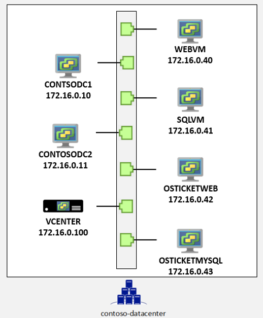  

- Contoso has one main datacenter. The datacenter is located in the city of New York in the Eastern United States.
- Contoso has three additional local branches across the United States.
- The main datacenter is connected to the internet with a fiber Metro Ethernet connection (500 MBps).
- Each branch is connected locally to the internet by using business-class connections with IPsec VPN tunnels back to the main datacenter. The setup allows Contoso's entire network to be permanently connected and optimizes internet connectivity.
- The main datacenter is fully virtualized with VMware. Contoso has two ESXi 6.5 virtualization hosts that are managed by vCenter Server 6.5.
- Contoso uses Active Directory for identity management. Contoso uses DNS servers on the internal network.
- The domain controllers in the datacenter run on VMware VMs. The domain controllers at local branches run on physical servers.

## Business drivers

Contoso's IT leadership team has worked closely with the company's business partners to understand what the business wants to achieve with this migration:

- **Address business growth**: Contoso is growing. As a result, pressure has increased on the company's on-premises systems and infrastructure.
- **Increase efficiency**: Contoso needs to remove unnecessary procedures and streamline processes for its developers and users. The business needs IT to be fast and to not waste time or money, so the company can deliver faster on customer requirements.
- **Increase agility**:  Contoso IT needs to be more responsive to the needs of the business. It must be able to react faster than the changes that occur in the marketplace for the company to be successful in a global economy. IT at Contoso must not get in the way or become a business blocker.
- **Scale**: As the company's business grows successfully, Contoso IT must provide systems that can grow at the same pace.

## Assessment goals

The Contoso cloud team has identified goals for its migration assessments:

- After migration, apps in Azure should have the same performance capabilities that apps have today in Contoso's on-premises VMWare environment. Moving to the cloud doesn't mean that app performance is less critical.
- Contoso needs to understand the compatibility of its applications and databases with Azure requirements. Contoso also needs to understand its hosting options in Azure.
- Contoso's database administration should be minimized after apps move to the cloud.  
- Contoso wants to understand not only its migration options, but also the costs associated with the infrastructure after it moves to the cloud.

## Assessment tools

Contoso uses Microsoft tools for its migration assessment. The tools align with the company's goals and should provide Contoso with all the information it needs.

Technology | Description | Cost
--- | --- | ---
[Data Migration Assistant](https://docs.microsoft.com/sql/dma/dma-overview?view=ssdt-18vs2017) | Contoso uses Data Migration Assistant to assess and detect compatibility issues that might affect its database functionality in Azure. Data Migration Assistant assesses feature parity between SQL sources and targets. It recommends performance and reliability improvements. | Data Migration Assistant is a free, downloadable tool.
[Azure Migrate](https://docs.microsoft.com/azure/migrate/migrate-overview) | Contoso uses the Azure Migrate service to assess its VMware VMs. Azure Migrate assesses the migration suitability of the machines. It provides sizing and cost estimates for running in Azure.  | As of May 2018, Azure Migrate is a free service.
[Service Map](https://docs.microsoft.com/azure/operations-management-suite/operations-management-suite-service-map) | Azure Migrate uses Service Map to show dependencies between machines that the company wants to migrate. | Service Map is part of Azure Log Analytics. Currently, Contoso can use Service Map for 180 days without incurring charges.

In this scenario, Contoso downloads and runs Data Migration Assistant to assess the on-premises SQL Server database for its travel app. Contoso uses Azure Migrate with dependency mapping to assess the app VMs before migration to Azure.

## Assessment architecture

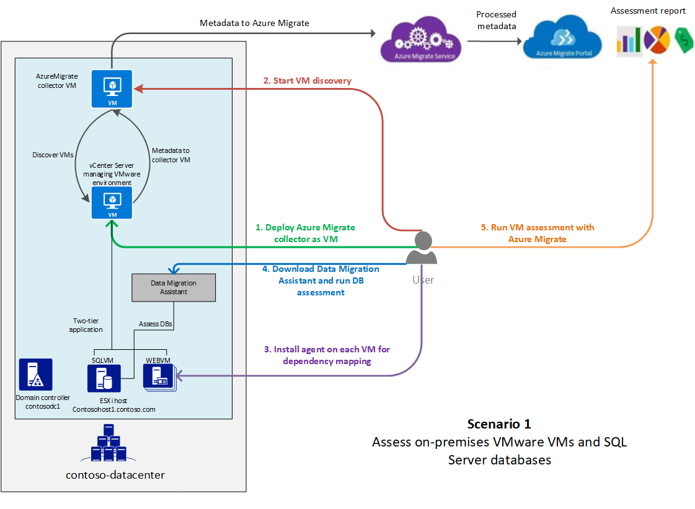

- Contoso is a fictitious name that represents a typical enterprise organization.
- Contoso has an on-premises datacenter (**contoso-datacenter**) and on-premises domain controllers (**CONTOSODC1**, **CONTOSODC2**).
- VMware VMs are located on VMware ESXi hosts running version 6.5 (**contosohost1**, **contosohost2**).
- The VMware environment is managed by vCenter Server 6.5 (**vcenter.contoso.com**, running on a VM).
- The SmartHotel360 travel app has these characteristics:
    - The app is tiered across two VMware VMs (**WEBVM** and **SQLVM**).
    - The VMs are located on VMware ESXi host **contosohost1.contoso.com**.
    - The VMs are running Windows Server 2008 R2 Datacenter with SP1.
- The VMware environment is managed by vCenter Server (**vcenter.contoso.com**) running on a VM.
- The osTicket service desk app:
    - The app is tiered across two VMs (**OSTICKETWEB** and **OSTICKETMYSQL**).
    - The VMs are running Ubuntu Linux Server 16.04-LTS.
    - **OSTICKETWEB** is running Apache 2 and PHP 7.0.
    - **OSTICKETMYSQL** is running MySQL 5.7.22.

## Prerequisites

Contoso and other users must meet the following prerequisites for the assessment:

- Owner or Contributor permissions for the Azure subscription, or for a resource group in the Azure subscription.
- An on-premises vCenter Server instance running version 6.5, 6.0, or 5.5.
- A read-only account in vCenter Server, or permissions to create one.
- Permissions to create a VM on the vCenter Server instance by using an .ova template.
- At least one ESXi host running version 5.0 or later.
- At least two on-premises VMware VMs, one running a SQL Server database.
- Permissions to install Azure Migrate agents on each VM.
- The VMs should have direct internet connectivity.  
        - You can restrict internet access to the [required URLs](https://docs.microsoft.com/azure/migrate/concepts-collector#collector-pre-requisites).  
        - If your VMs don't have internet connectivity, the Azure [Log Analytics Gateway](../log-analytics/log-analytics-oms-gateway.md) must be installed on them, and agent traffic directed through it.
- The FQDN of the VM running the SQL Server instance, for database assessment.
- Windows Firewall running on the SQL Server VM should allow external connections on TCP port 1433 (default). This setup allows Data Migration Assistant to connect.

## Assessment overview

Here's how Contoso performs its assessment:

> [!div class="checklist"]
> * **Step 1: Download and install Data Migration Assistant**: Contoso prepares Data Migration Assistant for assessment of the on-premises SQL Server database.
> * **Step 2: Assess the database by using Data Migration Assistant**: Contoso runs and analyzes the database assessment.
> * **Step 3: Prepare for VM assessment by using Azure Migrate**: Contoso sets up on-premises accounts and adjusts VMware settings.
> * **Step 4: Discover on-premises VMs by using Azure Migrate**: Contoso creates an Azure Migrate collector VM. Then, Contoso runs the collector to discover VMs for assessment.
> * **Step 5: Prepare for dependency analysis by using Azure Migrate**: Contoso installs Azure Migrate agents on the VMs, so the company can see dependency mapping between VMs.
> * **Step 6: Assess the VMs by using Azure Migrate**: Contoso checks dependencies, groups the VMs, and runs the assessment. When the assessment is ready, Contoso analyzes the assessment in preparation for migration.

## Step 1: Download and install Data Migration Assistant

1. Contoso downloads Data Migration Assistant from the [Microsoft Download Center](https://www.microsoft.com/download/details.aspx?id=53595).
    - Data Migration Assistant can be installed on any machine that can connect to the SQL Server instance. Contoso doesn't need to run it on the SQL Server machine.
    - Data Migration Assistant shouldn't be run on the SQL Server host machine.
2. Contoso runs the downloaded setup file (DownloadMigrationAssistant.msi) to begin the installation.
3. On the **Finish** page, Contoso selects **Launch Microsoft Data Migration Assistant** before finishing the wizard.

## Step 2: Run and analyze the database assessment for SmartHotel360

Now, Contoso can run an assessment to analyze its on-premises SQL Server database for the SmartHotel360 app.

1. In Data Migration Assistant, Contoso selects **New** > **Assessment**, and then gives the assessment a project name.
2. For **Source server type**, Contoso selects **SQL Server on Azure Virtual Machines**.

    

    > [!NOTE]
      Currently, Data Migration Assistant doesn't support assessment for migrating to an Azure SQL Database Managed Instance. As a workaround, Contoso uses SQL Server on an Azure VM as the supposed target for the assessment.

3. In **Select Target Version**, Contoso selects SQL Server 2017 as the target version. Contoso needs to select this version because it's the version that's used by the SQL Database Managed Instance.
4. Contoso selects reports to help it discover information about compatibility and new features:
    - **Compatibility Issues** note changes that might break migration or that require a minor adjustment before migration. This report keeps Contoso informed about any features currently in use that are deprecated. Issues are organized by compatibility level.
    - **New features' recommendation** notes new features in the target SQL Server platform that can be used for the database after migration. New feature recommendations are organized under the headings **Performance**, **Security**, and **Storage**.

    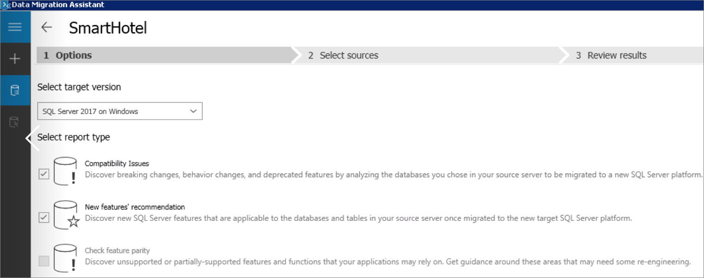

2. In **Connect to a server**, Contoso enters the name of the VM that's running the database and credentials to access it. Contoso selects **Trust server certificate** to make sure the VM can access SQL Server. Then, Contoso selects **Connect**.

    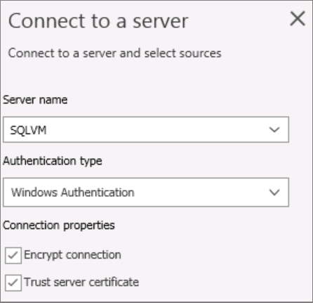

3. In **Add source**, Contoso adds the database it wants to assess, and then selects **Next** to start the assessment.
4. The assessment is created.

    

5. In **Review Results**, Contoso views the assessment results.

### Analyze the database assessment

Results are displayed as soon as they're available. If Contoso fixes issues, it must select **Restart Assessment** to rerun the assessment.

1. In the **Compatibility issues** report, Contoso checks for any issues at each compatibility level. Compatibility levels map to SQL Server versions as follows:

    - 100: SQL Server 2008/Azure SQL Database
    - 110: SQL Server 2012/Azure SQL Database
    - 120: SQL Server 2014/Azure SQL Database
    - 130: SQL Server 2016/Azure SQL Database
    - 140: SQL Server 2017/Azure SQL Database

    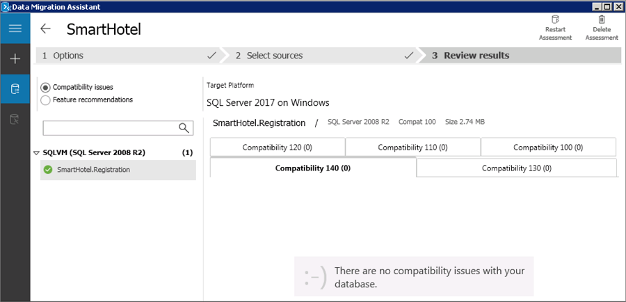

2. In the **Feature recommendations** report, Contoso views performance, security, and storage features that the assessment recommends after migration. A variety of features are recommended, including In-Memory OLTP, columnstore indexes, Stretch Database, Always Encrypted, dynamic data masking, and transparent data encryption.

    

    > [!NOTE]
    > Contoso should [enable transparent data encryption](https://docs.microsoft.com/sql/relational-databases/security/encryption/transparent-data-encryption?view=sql-server-2017) for all SQL Server databases. This is even more critical when a database is in the cloud than when it's hosted on-premises. Transparent data encryption should be enabled only after migration. If transparent data encryption is already enabled, Contoso must move the certificate or asymmetric key to the master database of the target server. Learn how to [move a transparent data encryption-protected database to another SQL Server instance](https://docs.microsoft.com/sql/relational-databases/security/encryption/move-a-tde-protected-database-to-another-sql-server?view=sql-server-2017).

2. Contoso can export the assessment in JSON or CSV format.

> [!NOTE]
> For large-scale assessments:
> - Run multiple assessments concurrently and view the state of the assessments on the **All Assessments** page.
> - Consolidate assessments into a [SQL Server database](https://docs.microsoft.com/sql/dma/dma-consolidatereports?view=ssdt-18vs2017#import-assessment-results-into-a-sql-server-database).
> - Consolidate assessments into a [Power BI report](https://docs.microsoft.com/sql/dma/dma-powerbiassesreport?view=ssdt-18vs2017).

## Step 3: Prepare for VM assessment by using Azure Migrate

Contoso needs to create a VMware account that Azure Migrate can use to automatically discover VMs for assessment, verify rights to create a VM, note the ports that need to be opened, and set the statistics settings level.

### Set up a VMware account

VM discovery requires a read-only account in vCenter Server that has the following properties:

- **User type**: At least a read-only user.
- **Permissions**: For the datacenter object, select the **Propagate to Child Objects** checkbox. For **Role**, select **Read-only**.
- **Details**: The user is assigned at the datacenter level, with access to all objects in the datacenter.
- To restrict access, assign the **No access** role with the **Propagate to child** object to the child objects (vSphere hosts, datastores, VMs, and networks).

### Verify permissions to create a VM

Contoso verifies that it has permissions to create a VM by importing a file in .ova format. Learn how to [create and assign a role with privileges](https://kb.vmware.com/s/article/1023189?other.KM_Utility.getArticleLanguage=1&r=2&other.KM_Utility.getArticleData=1&other.KM_Utility.getArticle=1&ui-comm-runtime-components-aura-components-siteforce-qb.Quarterback.validateRoute=1&other.KM_Utility.getGUser=1).

### Verify ports

The Contoso assessment uses dependency mapping. Dependency mapping requires an agent to be installed on VMs that will be assessed. The agent must be able to connect to Azure from TCP port 443 on each VM. Learn about [connection requirements](https://docs.microsoft.com/azure/log-analytics/log-analytics-concept-hybrid).

### Set statistics settings

Before Contoso begins the deployment, it must set the statistics settings for the vCenter Server to level 3. 

> [!NOTE]
> - After setting the level, Contoso must wait at least a day before it runs the assessment. Otherwise, the assessment might not work as expected.
> - If the level is higher than 3, the assessment works, but:
>    - Performance data for disks and networking isn't collected.
>    - For storage, Azure Migrate recommends a standard disk in Azure, with the same size as the on-premises disk.
>    - For networking, for each on-premises network adapter, a network adapter is  recommended in Azure.
>    - For compute, Azure Migrate looks at the VM cores and memory size and recommends an Azure VM with the same configuration. If there are multiple eligible Azure VM sizes, the one with the lowest cost is recommended.
> - For more information about sizing by using level 3, see [Sizing](https://docs.microsoft.com/azure/migrate/concepts-assessment-calculation#sizing).

To set the level:

1. In the vSphere Web Client, Contoso opens the vCenter Server instance.
2. Contoso selects **Manage** > **Settings** > **General** > **Edit**.
3. In **Statistics**, Contoso sets the statistic level settings to **Level 3**.

    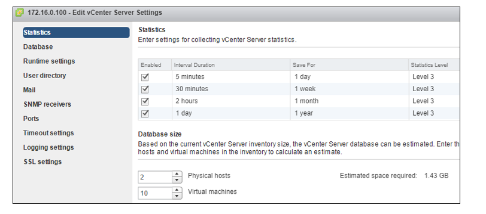

## Step 4: Discover VMs

To discover VMs, Contoso creates an Azure Migrate project. Contoso downloads and sets up the collector VM. Then, Contoso runs the collector to discover its on-premises VMs.

### Create a project

1. In the [Azure portal](https://portal.azure.com), Contoso searches for **Azure Migrate**. Then, Contoso creates a project.
2. Contoso specifies a project name (**ContosoMigration**) and the Azure subscription. It creates a new Azure resource group (**ContosoFailoverRG**). 
    > [!NOTE]
    > - You can create an Azure Migrate project only in the West Central US or East US region.
    > - You can plan a migration for any target location.
    > - The project location is used only to store the metadata that's gathered from on-premises VMs.

    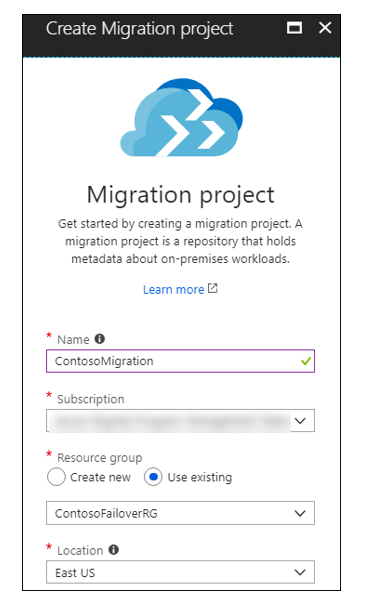

### Download the collector appliance

Azure Migrate creates an on-premises VM known as the *collector appliance*. The VM discovers on-premises VMware VMs and sends metadata about the VMs to the Azure Migrate service. To set up the collector appliance, Contoso downloads an OVA template, and then imports it to the on-premises vCenter Server instance to create the VM.

1. In the Azure Migrate project, Contoso selects **Getting Started** > **Discover & Assess** > **Discover Machines**. Contoso downloads the OVA template file.
2. Contoso copies the project ID and key. The project and ID are required for configuring the collector.

    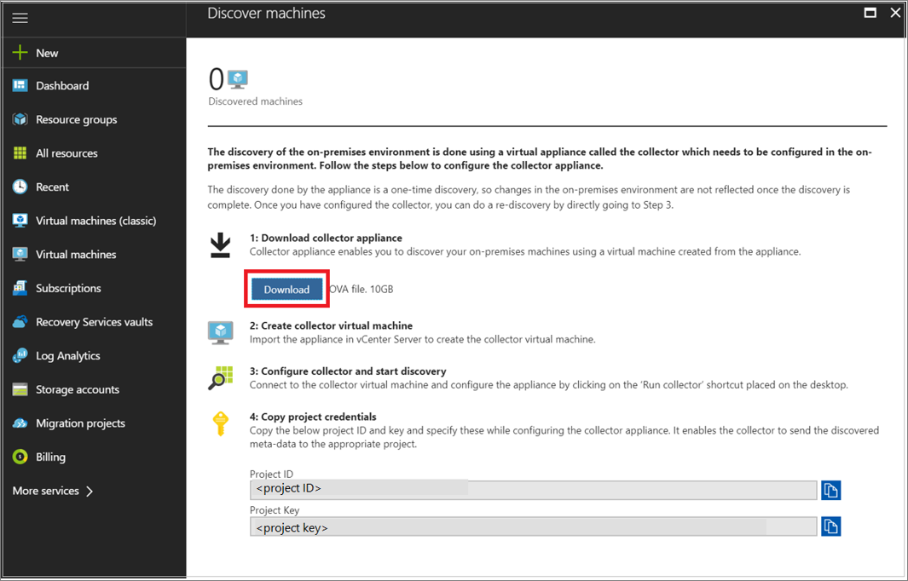

### Verify the collector appliance

Before deploying the VM, Contoso checks that the OVA file is secure:

1. On the machine on which the file was downloaded, Contoso opens an administrator Command Prompt window.
2. Contoso runs the following command to generate the hash for the OVA file:

    ```C:\>CertUtil -HashFile <file_location> [Hashing Algorithm]```
    
    **Example** 
    
    ```C:\>CertUtil -HashFile C:\AzureMigrate\AzureMigrate.ova SHA256```
3. The generated hash should match these settings (version 1.0.9.14):

    **Algorithm** | **Hash value**
    --- | ---
    MD5 | 6d8446c0eeba3de3ecc9bc3713f9c8bd
    SHA1 | e9f5bdfdd1a746c11910ed917511b5d91b9f939f
    SHA256 | 7f7636d0959379502dfbda19b8e3f47f3a4744ee9453fc9ce548e6682a66f13c

### Create the collector appliance

Now, Contoso can import the downloaded file to the vCenter Server instance and provision the collector appliance VM:

1. In the vSphere Client console, Contoso selects **File** > **Deploy OVF Template**.

    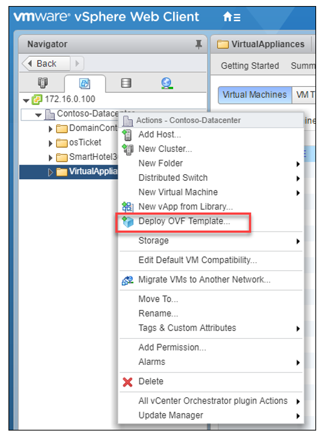

2. In the Deploy OVF Template Wizard, Contoso selects **Source**, and then specifies the location of the OVA file.
3. In **Name and Location**, Contoso specifies a display name for the collector VM. Then, it selects the inventory location in which to host the VM. Contoso also specifies the host or cluster on which to run the collector appliance.
4. In **Storage**, Contoso specifies the storage location. In **Disk Format**, Contoso selects how it wants to provision the storage.
5. In **Network Mapping**, Contoso specifies the network in which to connect the collector VM. The network needs internet connectivity to send metadata to Azure.
6. Contoso reviews the settings, and then selects **Power on after deployment** > **Finish**. A message that confirms successful completion appears when the appliance is created.

### Run the collector to discover VMs

Now, Contoso runs the collector to discover VMs. Currently, the collector currently supports only **English (United States)** as the operating system language and collector interface language.

1. In the vSphere Client console, Contoso selects **Open Console**. Contoso specifies the language, time zone, and password preferences for the collector VM.
2. On the desktop, Contoso selects the **Run collector** shortcut.

    

3. In Azure Migrate Collector, Contoso selects **Set up prerequisites**. Contoso accepts the license terms and reads the third-party information.
4. The collector checks that the VM has internet access, that the time is synced, and that the collector service is running. (The collector service is installed by default on the VM.) Contoso also installs VMware PowerCLI.

    > [!NOTE]
    > It's assumed that the VM has direct access to the internet without using a proxy.

    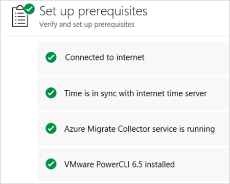

5. In **Specify vCenter Server details**, Contoso enters the name (FQDN) or IP address of the vCenter Server instance and the read-only credentials used for discovery.
6. Contoso selects a scope for VM discovery. The collector can discover only VMs that are within the specified scope. The scope can be set to a specific folder, datacenter, or cluster. The scope shouldn't contain more than 1,500 VMs.

	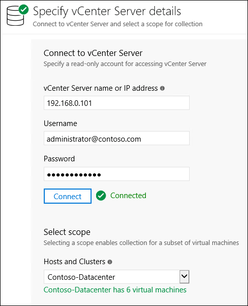

7. In **Specify migration project**, Contoso enters the Azure Migrate project ID and key that were copied from the portal. To get the project ID and key, Contoso can go to the project **Overview** page > **Discover Machines**.  

    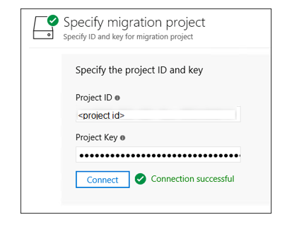

8. In **View collection progress**, Contoso can monitor discovery and check that metadata collected from the VMs is in scope. The collector provides an approximate discovery time.

    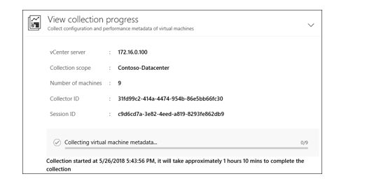

### Verify VMs in the portal

When collection is finished, Contoso checks that the VMs appear in the portal:

1. In the Azure Migrate project, Contoso selects **Manage** > **Machines**. Contoso checks that the VMs that it wants to discover are shown.

    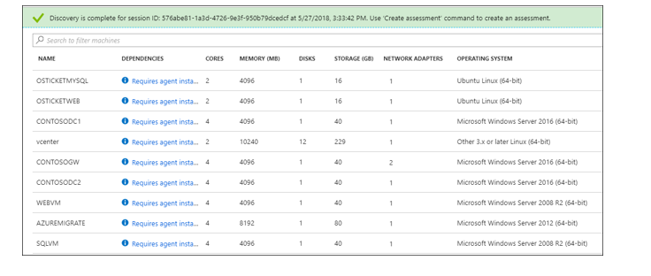

2. Currently, the machines don't have the Azure Migrate agents installed. Contoso must install the agents to view dependencies.

    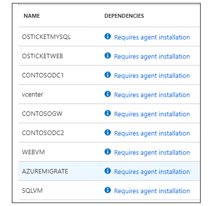

## Step 5: Prepare for dependency analysis

To view dependencies between VMs that it wants to assess, Contoso downloads and installs agents on the app VMs. Contoso installs agents on all VMs for its apps, both for Windows and Linux.

### Take a snapshot

To keep a copy of the VMs before modifying them, Contoso takes a snapshot before the agents are installed.

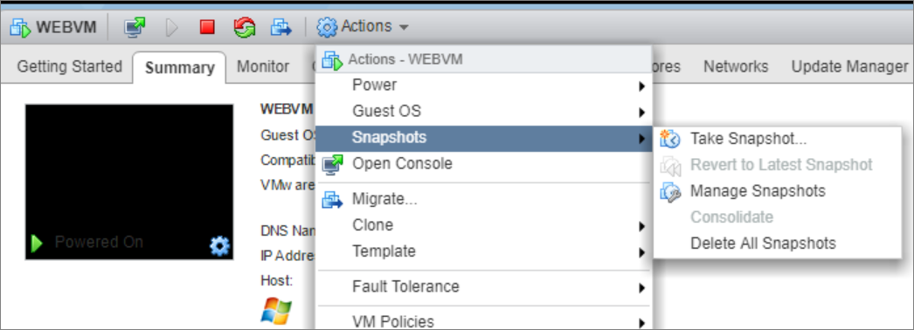

### Download and install the VM agents

1. In **Machines**, Contoso selects the machine. In the **Dependencies** column, Contoso selects **Requires installation**.
2. In the **Discover Machines** pane, Contoso:
	- Downloads the Microsoft Monitoring Agent (MMA) and Dependency Agent for each Windows VM.
	- Downloads the MMA and Dependency Agent for each Linux VM.
3. Contoso copies the workspace ID and key. Contoso needs the workspace ID and key when it installs the MMA.

    

### Install the agents on Windows VMs

Contoso runs the installation on each VM.

#### Install the MMA on Windows VMs

1. Contoso double-clicks the downloaded agent.
2. In **Destination Folder**, Contoso keeps the default installation folder, and then selects **Next**.
3. In **Agent Setup Options**, Contoso selects **Connect the agent to Azure Log Analytics** > **Next**.

    

4. In **Azure Log Analytics**, Contoso pastes the workspace ID and key that it copied from the portal.

	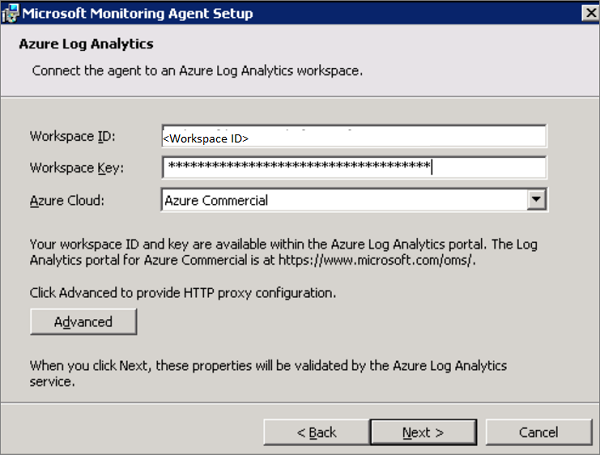

5. In **Ready to Install**, Contoso installs the MMA.

#### Install the Dependency agent on Windows VMs

1. Contoso double-clicks the downloaded Dependency Agent.
2. Contoso accepts the license terms and waits for the installation to finish.

    

### Install the agents on Linux VMs

Contoso runs the installation on each VM.

#### Install the MMA on Linux VMs

1. Contoso installs the Python ctypes library on each VM by using the following command:

    `sudo apt-get install python-ctypeslib`
2. Contoso must run the command to install the MMA agent as root. To become root, Contoso runs the following command, and then enters the root password:

    `sudo -i`
3. Contoso installs the MMA:
    - Contoso enters the workspace ID and key in the command.
    - Commands are for 64-bit.
    - The workspace ID and primary key are located in the Microsoft Operations Management Suite (OMS) portal. Select **Settings**, and then select the **Connected Sources** tab.
    - Run the following commands to download the OMS agent, validate the checksum, and install and onboard the agent:

    ```
    wget https://raw.githubusercontent.com/Microsoft/OMS-Agent-for-Linux/master/installer/scripts/onboard_agent.sh && sh onboard_agent.sh -w 6b7fcaff-7efb-4356-ae06-516cacf5e25d -s k7gAMAw5Bk8pFVUTZKmk2lG4eUciswzWfYLDTxGcD8pcyc4oT8c6ZRgsMy3MmsQSHuSOcmBUsCjoRiG2x9A8Mg==
    ```

#### Install the Dependency Agent on Linux VMs

After the MMA is installed, Contoso installs the Dependency Agent on the Linux VMs:

1. The Dependency Agent is installed on Linux computers by using InstallDependencyAgent-Linux64.bin, a shell script that has a self-extracting binary. Contoso runs the file by using sh, or it adds execute permissions to the file itself.

2. Contoso installs the Linux Dependency Agent as root:

    ```
    wget --content-disposition https://aka.ms/dependencyagentlinux -O InstallDependencyAgent-Linux64.bin && sudo sh InstallDependencyAgent-Linux64.bin -s
    ```

## Step 6: Run and analyze the VM assessment

Contoso can now verify machine dependencies and create a group. Then, it runs the assessment for the group.

### Verify dependencies and create a group

1. To determine which machines to analyze, Contoso selects **View Dependencies**.

    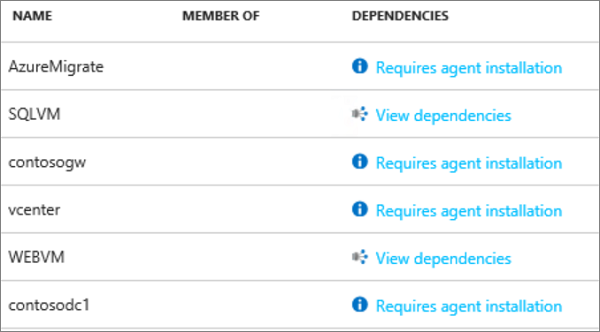

2. For SQLVM, the dependency map shows the following details:

    - Process groups or processes that have active network connections running on SQLVM during the specified time period (an hour, by default).
    - Inbound (client) and outbound (server) TCP connections to and from all dependent machines.
    - Dependent machines that have the Azure Migrate agents installed are shown as separate boxes.
    - Machines that don't have the agents installed show port and IP address information.

3. For machines that have the agent installed (WEBVM), Contoso selects the machine box to view more information. The information includes the FQDN, operating system, and MAC address.

    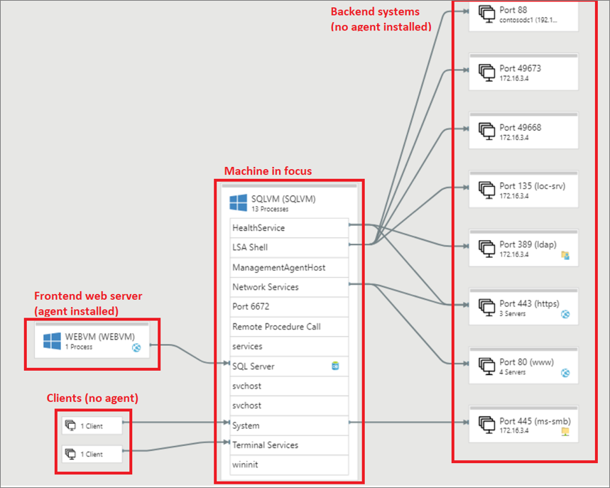

4. Contoso selects the VMs to add to the group (SQLVM and WEBVM). Contoso uses Ctrl+Click to select multiple VMs.
5. Contoso selects **Create Group**, and then enters a name (**smarthotelapp**).

    > [!NOTE]
    > To view more granular dependencies, you can expand the time range. You can select a specific duration or select start and end dates.

### Run an assessment

1. In **Groups**, Contoso opens the group (**smarthotelapp**), and then selects **Create assessment**.

    

2. To view the assessment, Contoso selects **Manage** > **Assessments**.

Contoso uses the default assessment settings, but you can [customize settings](how-to-modify-assessment.md).

### Analyze the VM assessment

An Azure Migrate assessment includes information about the compatibility of on-premises with Azure, suggested right-sizing for Azure VM, and estimated monthly Azure costs.

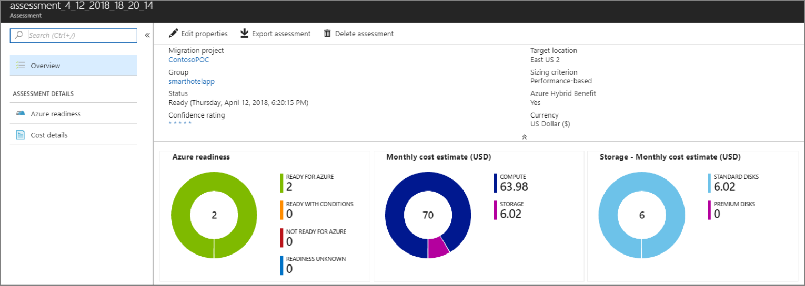

#### Review confidence rating


An assessment has a confidence rating of from 1 star to 5 stars (1 star is the lowest and 5 stars is the highest).
- The confidence rating is assigned to an assessment based on the availability of data points that are needed to compute the assessment.
- The rating helps you estimate the reliability of the size recommendations that are provided by Azure Migrate.
- The confidence rating is useful when you are doing *performance-based sizing*. Azure Migrate might not have enough data points for utilization-based sizing. For *as on-premises* sizing, the confidence rating is always 5 stars because Azure Migrate has all the data points it needs to size the VM.
- Depending on the percentage of data points available, the confidence rating for the assessment is provided:

   Availability of data points | Confidence rating
   --- | ---
   0%-20% | 1 star
   21%-40% | 2 stars
   41%-60% | 3 stars
   61%-80% | 4 stars
   81%-100% | 5 stars

#### Verify Azure readiness

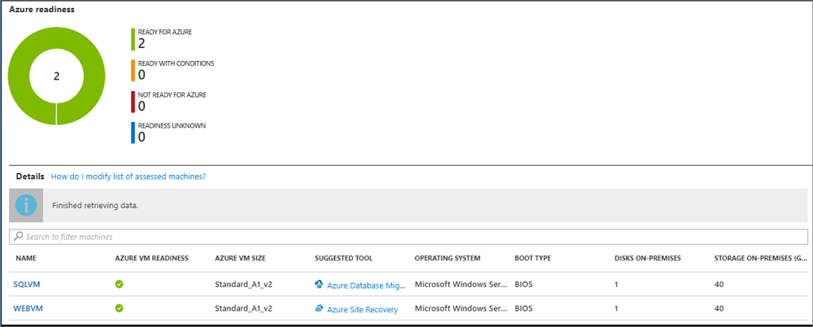  

The assessment report shows the information that's summarized in the table. To show performance-based sizing, Azure Migrate needs the following information. If the information can't be collected, sizing assessment might not be accurate.

- Utilization data for CPU and memory.
- Read/write IOPS and throughput for each disk attached to the VM.
- Network in/out information for each network adapter attached to the VM.

Setting | Indication | Details
--- | --- | ---
**Azure VM readiness** | Indicates whether the VM is ready for migration. | Possible states:</br><br/>- Ready for Azure<br/><br/>- Ready with conditions <br/><br/>- Not ready for Azure<br/><br/>- Readiness unknown<br/><br/> If a VM isn't ready, Azure Migrate shows some remediation steps.
**Azure VM size** | For ready VMs, Azure Migrate provides an Azure VM size recommendation. | Sizing recommendation depends on assessment properties:<br/><br/>- If you used performance-based sizing, sizing considers the performance history of the VMs.<br/><br/>- If you used *as on-premises*, sizing is based on the on-premises VM size and utilization data isn't used.
**Suggested tool** | Because Azure machines are running the agents, Azure Migrate looks at the processes that are running inside the machine. It identifies whether the machine is a database machine.
**VM information** | The report shows settings for the on-premises VM, including operating system, boot type, and disk and storage information.

#### Review monthly cost estimates

This view shows the total compute and storage cost of running the VMs in Azure. It also shows details for each machine.

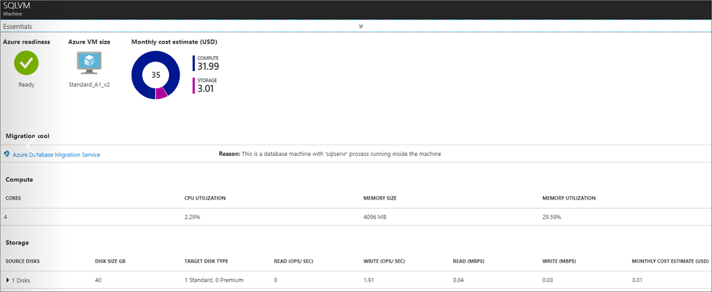

- Cost estimates are calculated by using the size recommendations for a machine.
- Estimated monthly costs for compute and storage are aggregated for all VMs in the group.

## Clean up after assessment

- When the assessment finishes, Contoso retains the Azure Migrate appliance to use in future evaluations.
- Contoso turns off the VMware VM. Contoso will use it again when it evaluates additional VMs.
- Contoso keeps the **Contoso Migration** project in Azure. The project currently is deployed in the **ContosoFailoverRG** resource group in the East US Azure region.
-  The collector VM has a 180-day evaluation license. If this limit expires, Contoso will need to download the collector and set it up again.

## Conclusion

In this scenario, Contoso assesses its SmartHotel360 app database by using the Data Migration Assessment tool. It assesses the on-premises VMs by using the Azure Migrate service. Contoso reviews the assessments to make sure that on-premises resources are ready for migration to Azure.

## Next steps

In the next article in the series, Contoso rehosts its SmartHotel360 app in Azure by using a lift-and-shift migration. Contoso migrates the front-end WEBVM for the app by using Azure Site Recovery. It migrates the app database to an Azure SQL Database Managed Instance by using the Database Migration Service. [Get started](contoso-migration-rehost-vm-sql-managed-instance.md) with this deployment.
