# Contoso migration: Rearchitect an on-premises app to an Azure container and Azure SQL Database

This article demonstrates how Contoso migrates and rearchitect its SmartHotel360 app in Azure. Contoso migrates the app frontend VM to an Azure Windows container, and the app database to an Azure SQL database.

This document is one in a series of articles that show how the fictitious company Contoso migrates on-premises resources to the Microsoft Azure cloud. The series includes background information, and scenarios that illustrate setting up a migration infrastructure, assessing on-premises resources for migration, and running different types of migrations. Scenarios grow in complexity. Additional articles will be added over time.

**Article** | **Details** | **Status**
--- | --- | ---
[Article 1: Overview](contoso-migration-overview.md) | Overview of the article series, Contoso's migration strategy, and the sample apps that are used in the series. | Available
[Article 2: Deploy Azure infrastructure](contoso-migration-infrastructure.md) | Contoso prepares its on-premises infrastructure and its Azure infrastructure for migration. The same infrastructure is used for all migration articles in the series. | Available
[Article 3: Assess on-premises resources for migration to Azure](contoso-migration-assessment.md)  | Contoso runs an assessment of its on-premises SmartHotel360 app running on VMware. Contoso assesses app VMs using the Azure Migrate service, and the app SQL Server database using Data Migration Assistant. | Available
[Article 4: Rehost an app on an Azure VM and SQL Database Managed Instance](contoso-migration-rehost-vm-sql-managed-instance.md) | Contoso runs a lift-and-shift migration to Azure for its on-premises SmartHotel360 app. Contoso migrates the app front-end VM using [Azure Site Recovery](https://docs.microsoft.com/azure/site-recovery/site-recovery-overview). Contoso migrates the app database to an Azure SQL Database Managed Instance using the [Azure Database Migration Service](https://docs.microsoft.com/azure/dms/dms-overview). | Available	
[Article 5: Rehost an app on Azure VMs](contoso-migration-rehost-vm.md) | Contoso migrates its SmartHotel360 app VMs to Azure VMs using the Site Recovery service. | Available
[Article 6: Rehost an app on Azure VMs and in a  SQL Server AlwaysOn availability group](contoso-migration-rehost-vm-sql-ag.md) | Contoso migrates the SmartHotel360 app. Contoso uses Site Recovery to migrate the app VMs. It uses the Database Migration Service to migrate the app database to a SQL Server cluster that's protected by an AlwaysOn availability group. | Available	
[Article 7: Rehost a Linux app on Azure VMs](contoso-migration-rehost-linux-vm.md) | Contoso completes a lift-and-shift migration of the Linux osTicket app to Azure VMs, using Azure Site Recovery | Available
[Article 8: Rehost a Linux app on Azure VMs and Azure MySQL](contoso-migration-rehost-linux-vm-mysql.md) | Contoso migrates the Linux osTicket app to Azure VMs using Azure Site Recovery, and migrates the app database to an Azure MySQL Server instance using MySQL Workbench. | Available
[Article 9: Refactor an app on Azure Web Apps and Azure SQL database](contoso-migration-refactor-web-app-sql.md) | Contoso migrates the SmartHotel360 app to an Azure Web App, and migrates the app database to an Azure SQL Server instance with Database Migration Assistant | Available
[Article 10: Refactor a Linux app on Azure Web Apps and Azure MySQL](contoso-migration-refactor-linux-app-service-mysql.md) | Contoso migrates its Linux osTicket app to an Azure web app on multiple Azure regions using Azure Traffic Manager, integrated with GitHub for continuous delivery. Contoso migrates the app database to an Azure Database for MySQL instance. | Available	
[Article 11: Refactor TFS on Azure DevOps Services](contoso-migration-tfs-vsts.md) | Contoso migrates its on-premises Team Foundation Server deployment to Azure DevOps Services in Azure. | Available
Article 12: Rearchitect an app on Azure Containers and Azure SQL Database | Contoso migrates its SmartHotel app to Azure. Then, it rearchitects the app web tier as a Windows container running in Azure Service Fabric, and the database with Azure SQL Database. | This article
[Article 13: Rebuild an app in Azure](contoso-migration-rebuild.md) | Contoso rebuilds its SmartHotel app by using a range of Azure capabilities and services, including Azure App Service, Azure Kubernetes Service (AKS), Azure Functions, Azure Cognitive Services, and Azure Cosmos DB. | Available	
[Article 14: Scale a migration to Azure](contoso-migration-scale.md) | After trying out migration combinations, Contoso prepares to scale to a full migration to Azure. | Available

In this article, Contoso migrates the two-tier Windows WPF, XAML forms SmartHotel360 app running on VMware VMs to Azure. If you'd like to use this app, it's provided as open source and you can download it from [GitHub](https://github.com/Microsoft/SmartHotel360).

## Business drivers

The Contoso IT leadership team has worked closely with business partners to understand what they want to achieve with this migration:

- **Address business growth**: Contoso is growing, and as a result there is pressure on its on-premises systems and infrastructure.
- **Increase efficiency**: Contoso needs to remove unnecessary procedures, and streamline processes for developers and users.  The business needs IT to be fast and not waste time or money, thus delivering faster on customer requirements.
- **Increase agility**:  Contoso IT needs to be more responsive to the needs of the business. It must be able to react faster than the changes in the marketplace, to enable the success in a global economy.  It mustn't get in the way, or become a business blocker.
- **Scale**: As the business grows successfully, Contoso IT must provide systems that are able to grow at the same pace.
- **Costs**: Contoso wants to minimize licensing costs.

## Migration goals

The Contoso cloud team has pinned down goals for this migration. These goals were used to determine the best migration method.

**Goals** | **Details**
--- | --- 
**App reqs** | The app in Azure will remain as critical as it is today.<br/><br/> It should have the same performance capabilities as it currently does in VMWare.<br/><br/> Contoso wants to stop supporting Windows Server 2008 R2, on which the app currently runs, and are willing to invest in the app.<br/><br/> Contoso wants to move away from SQL Server 2008 R2 to a modern PaaS Database platform, which will minimize the need for management.<br/><br/> Contoso want to leverage its investment in SQL Server licensing and Software Assurance where possible.<br/><br/> Contoso wants to be able to scale up the app web tier.
**Limitations** | The app consists of an ASP.NET app and a WCF service running on the same VM. Contoso wants to split this across two web apps using the Azure App Service. 
**Azure reqs** | Contoso wants to move the app to Azure, and run it in a container to extend app life. It doesn't want to start completely from scratch to implement the app in Azure. 
**DevOps** | Contoso wants to move to a DevOps model using Azure DevOps Services for code builds and release pipeline.

## Solution design

After pinning down goals and requirements, Contoso designs and review a deployment solution, and identifies the migration process, including the Azure services that Contoso will use for the migration.

### Current app

- The SmartHotel360 on-premises app is tiered across two VMs (WEBVM and SQLVM).
- The VMs are located on VMware ESXi host **contosohost1.contoso.com** (version 6.5)
- The VMware environment is managed by vCenter Server 6.5 (**vcenter.contoso.com**), running on a VM.
- Contoso has an on-premises datacenter (contoso-datacenter), with an on-premises domain controller (**contosodc1**).
- The on-premises VMs in the Contoso datacenter will be decommissioned after the migration is done.


### Proposed architecture

- For the database tier of the app, Contoso compared Azure SQL Database with SQL Server using [this article](https://docs.microsoft.com/azure/sql-database/sql-database-features). It decided to go with Azure SQL Database for a few reasons:
    - Azure SQL Database is a relational-database managed service. It delivers predictable performance at multiple service levels, with near-zero administration. Advantages include dynamic scalability with no downtime, built-in intelligent optimization, and global scalability and availability.
    - Contoso leverages the lightweight Data Migration Assistant (DMA) to assess and migrate the on-premises database to Azure SQL.
    - With Software Assurance, Contoso can exchange its existing licenses for discounted rates on a SQL Database, using the Azure Hybrid Benefit for SQL Server. This could provide savings of up to 30%.
    - SQL Database provides a number of security features including always encrypted, dynamic data masking, and row-level security/threat detection.
- For the app web tier, Contoso has decided convert it to the Windows Container using Azure DevOps services.
    - Contoso will deploy the app using Azure Service Fabric, and pull the Windows container image from the Azure Container Registry (ACR).
    - A prototype for extending the app to include sentiment analysis will be implemented as another service in Service Fabric, connected to Cosmos DB.  This will read information from Tweets, and display on the app.
- To implement a DevOps pipeline, Contoso will use Azure DevOps for source code management (SCM), with Git repos.  Automated builds and releases will be used to build code, and deploy it to the Azure Container Registry and Azure Service Fabric.

    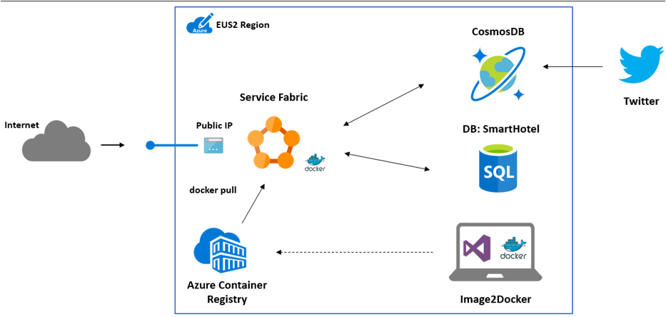 

  
### Solution review
Contoso evaluates the proposed design by putting together a pros and cons list.

**Consideration** | **Details**
--- | ---
**Pros** | The SmartHotel360 app code will need to be altered for migration to Azure Service Fabric. However, the effort is minimal, using the Service Fabric SDK tools for the changes.<br/><br/> With the move to Service Fabric, Contoso can start to develop microservices to add to the application quickly over time, without risk to the original code base.<br/><br/> Windows Containers offer the same benefits as containers in general. They improve agility, portability, and control.<br/><br/> Contoso can leverage its investment in Software Assurance using the Azure Hybrid Benefit for both SQL Server and Windows Server.<br/><br/> After the migration it will no longer need to support Windows Server 2008 R2. [Learn more](https://support.microsoft.com/lifecycle).<br/><br/> Contoso can configure the web tier of the app with multiple instances, so that it's no longer a single point of failure.<br/><br/> It will no longer be dependent on the aging SQL Server 2008 R2.<br/><br/> SQL Database supports Contoso's technical requirements. Contoso admins assessed the on-premises database using the Database Migration Assistant and found it compatible.<br/><br/> SQL Database has built-in fault tolerance that Contoso doesn't need to set up. This ensures that the data tier is no longer a single point of failover.
**Cons** | Containers are more complex than other migration options. The learning curve on containers could be an issue for Contoso.  They introduce a new level of complexity that provides a lot of value in spite of the curve.<br/><br/> The operations team at Contoso will need to ramp up to understand and support Azure, containers and microservices for the app.<br/><br/> If Contoso uses the Data Migration Assistant instead of Data Migration Service to migrate the database, It won’t have the infrastructure ready for migrating databases at scale.


### Migration process

1. Contoso provisions the Azure service fabric cluster for Windows.
2. It provisions an Azure SQL instance, and migrates the SmartHotel360 database to it.
3. Contoso converts the Web tier VM to a Docker container using the Service Fabric SDK tools.
4. It connects the service fabric cluster and the ACR, and deploys the app using Azure service fabric.

    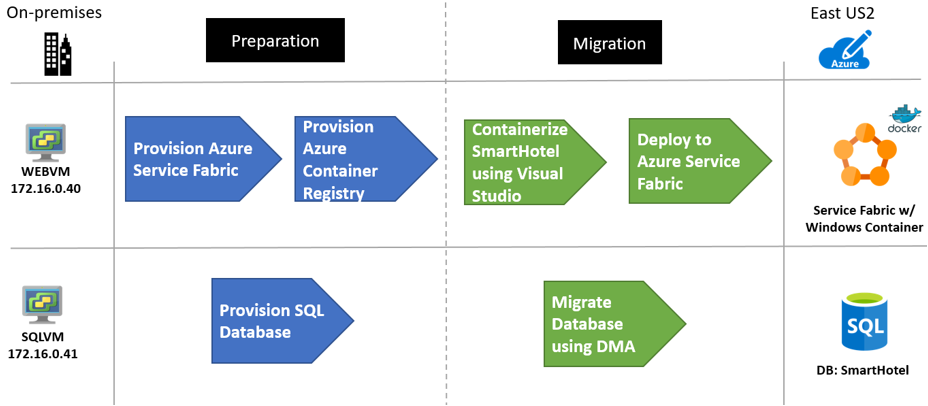 

### Azure services

**Service** | **Description** | **Cost**
--- | --- | ---
[Database Migration Assistant (DMA)](https://docs.microsoft.com/sql/dma/dma-overview?view=ssdt-18vs2017) | Assesses and detect compatibility issues that might impact database functionality in Azure. DMA assesses feature parity between SQL sources and targets, and recommends performance and reliability improvements. | It's a downloadable tool free of charge.
[Azure SQL Database](https://azure.microsoft.com/services/sql-database/) | Provides an intelligent, fully managed relational cloud database service. | Cost based on features, throughput and size. [Learn more](https://azure.microsoft.com/pricing/details/sql-database/managed/).
[Azure Container Registry](https://azure.microsoft.com/services/container-registry/) | Stores images for all types of container deployments. | Cost based on features, storage, and usage duration. [Learn more](https://azure.microsoft.com/pricing/details/container-registry/).
[Azure Service Fabric](https://azure.microsoft.com/services/service-fabric/) | Builds and operate always-on, scalable and distributed apps | Cost based on size, location, and duration of the compute nodes. [Learn more](https://azure.microsoft.com/pricing/details/service-fabric/).
[Azure DevOps](https://docs.microsoft.com/azure/azure-portal/tutorial-azureportal-devops) | Provides a continuous integration and continuous deployment (CI/CD) pipeline for app development. The pipeline starts with a Git repository for managing app code, a build system for producing packages and other build artifacts, and a Release Management system to deploy changes in dev, test, and production environments.

## Prerequisites

Here's what Contoso needs to run this scenario:

**Requirements** | **Details**
--- | ---
**Azure subscription** | Contoso created subscriptions earlier in this article series. If you don't have an Azure subscription, create a [free account](https://azure.microsoft.com/pricing/free-trial/).<br/><br/> If you create a free account, you're the administrator of your subscription and can perform all actions.<br/><br/> If you use an existing subscription and you're not the administrator, you need to work with the admin to assign you Owner or Contributor permissions.
**Azure infrastructure** | [Learn how](contoso-migration-infrastructure.md) Contoso previously set up an Azure infrastructure.
**Developer prerequisites** | Contoso needs the following tools on a developer workstation:<br/><br/> - [Visual Studio 2017 Community Edition: Version 15.5](https://www.visualstudio.com/)<br/><br/> - .NET workload enabled.<br/><br/> - [Git](https://git-scm.com/)<br/><br/> - [Service Fabric SDK v 3.0 or later](https://docs.microsoft.com/azure/service-fabric/service-fabric-get-started)<br/><br/> - [Docker CE (Windows 10) or Docker EE (Windows Server)](https://docs.docker.com/docker-for-windows/install/) set to use Windows Containers.


## Scenario steps

Here's how Contoso runs the migration:

> [!div class="checklist"]
> * **Step 1: Provision a SQL Database instance in Azure**: Contoso provisions a SQL instance in Azure. After the frontend web VM is migrated to an Azure container, the container instance with the app web frontend will point to this database.
> * **Step 2: Create an Azure Container Registry (ACR)**: Contoso provisions an enterprise container registry for the docker container images.
> * **Step 3: Provision Azure Service Fabric**: It provisions a Service Fabric Cluster.
> * **Step 4: Manage service fabric certificates**: Contoso sets up certificates for Azure DevOps Services access to the cluster.
> * **Step 5: Migrate the database with DMA**: It migrates the app database with the Database Migration Assistant.
> * **Step 6: Set up Azure DevOps Services**: Contoso sets up a new project in Azure DevOps Services, and imports the code into the Git Repo.
> * **Step 7: Convert the app**: Contoso converts the app to a container using Azure DevOps and SDK tools.
> * **Step 8: Set up build and release**: Contoso sets up the build and release pipelines to create and publish the app to the ACR and Service Fabric Cluster.
> * **Step 9: Extend the app**: After the app is public, Contoso extends it to take advantage of Azure capabilities, and republishes it to Azure using the pipeline.


## Step 1: Provision an Azure SQL Database

Contoso admins provision an Azure SQL database.

1. They select to create a **SQL Database** in Azure. 

    

2. They specify a database  name to match the database running on the on-premises VM (**SmartHotel.Registration**). They place the database in the ContosoRG resource group. This is the resource group they use for production resources in Azure.

    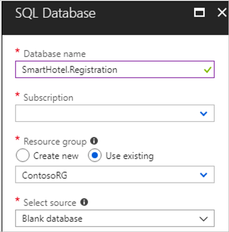

3. They set up a new SQL Server instance (**sql-smarthotel-eus2**) in the primary region.

    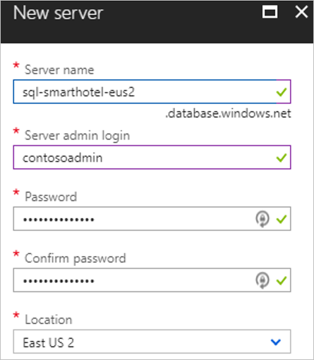

4. They set the pricing tier to match server and database needs. And they select to save money with Azure Hybrid Benefit because they already have a SQL Server license.
5. For sizing they use v-Core-based purchasing, and set the limits for the expected requirements.

    

6. Then they create the database instance.

    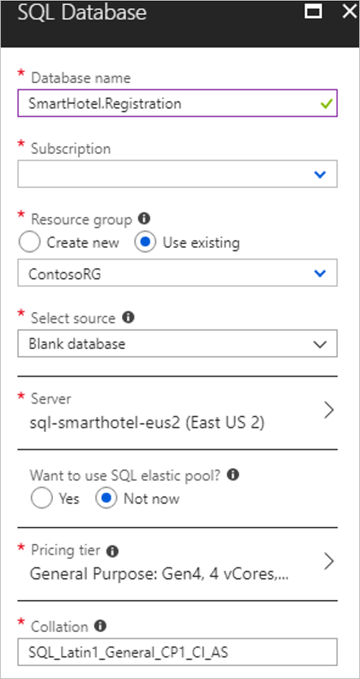

7. After the instance is created, they open the database, and note details they need when they use the Database Migration Assistance for migration.

    


**Need more help?**

- [Get help](https://docs.microsoft.com/azure/sql-database/sql-database-get-started-portal) provisioning a SQL Database.
- [Learn about](https://docs.microsoft.com/azure/sql-database/sql-database-vcore-resource-limits-elastic-pools) v-Core resource limits.


## Step 2: Create an ACR and provision an Azure Container

The Azure container is created using the exported files from the Web VM. The container is housed in the Azure Container Registry (ACR).


1. Contoso admins create a Container Registry in the Azure portal.

     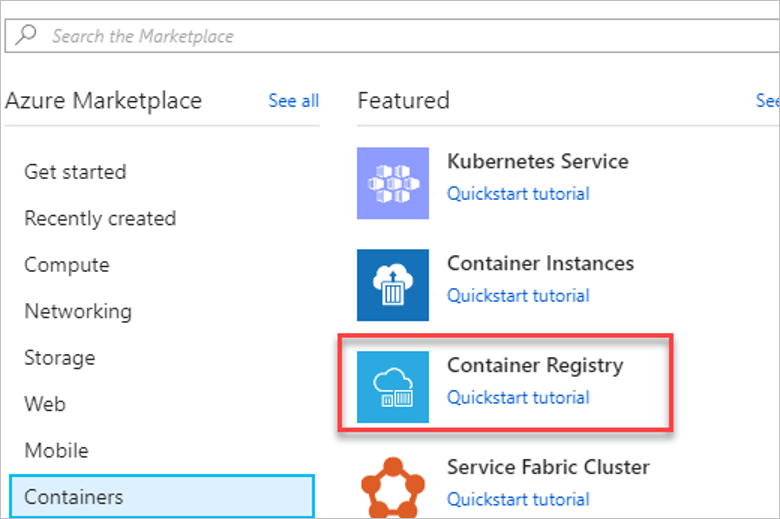

2. They provide a name for the registry (**contosoacreus2**), and place it in the primary region, in the resource group they use for their infrastructure resources. They enable access for admin users, and set it as a premium SKU so that they can leverage geo-replication.

    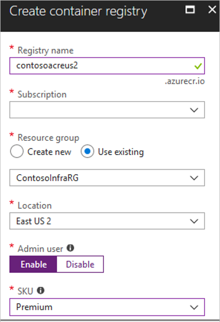  


## Step 3: Provision Azure Service Fabric

The SmartHotel360 container will run in the Azure Service Fabric Sluster. Contoso admins create the Service Fabric Cluster as follows:

1. Create a Service Fabric resource from the Azure Marketplace

     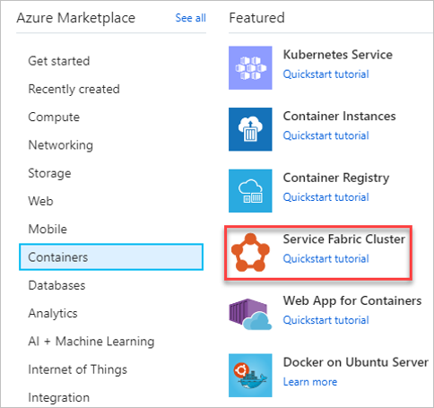

2. In **Basics**, they provide a unique DS name for the cluster, and credentials for accessing the on-premises VM. They place the resource in the production resource group (**ContosoRG**) in the primary East US 2 region.

    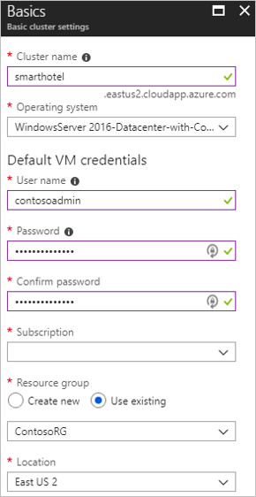 

3. In **Node type configuration**, they input a node type name, durability settings, VM size, and app endpoints.

    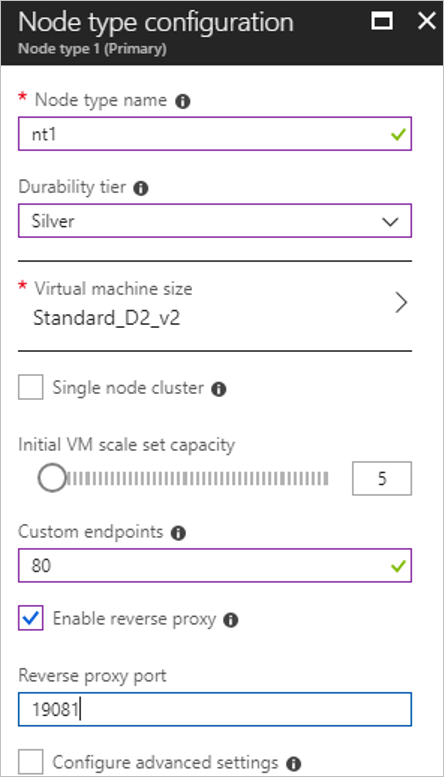 


4. In **Create key vault**, they create a new key vault in their infrastructure resource group, to house the certificate.

    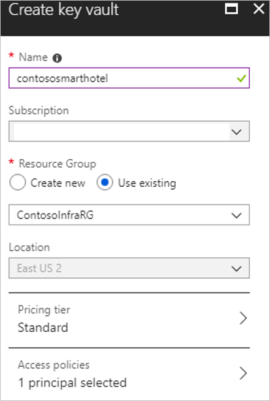 


5. In **Access Policies** they enable access to virtual machines to deploy the key vault.

    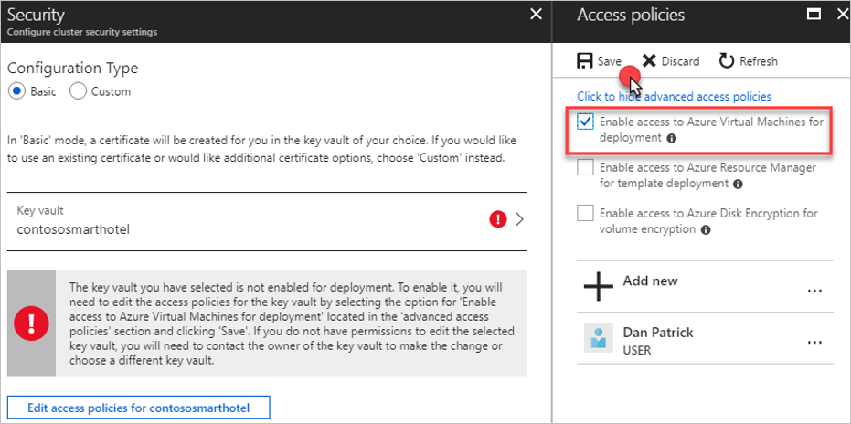 

6. They specify a name for the certificate.

    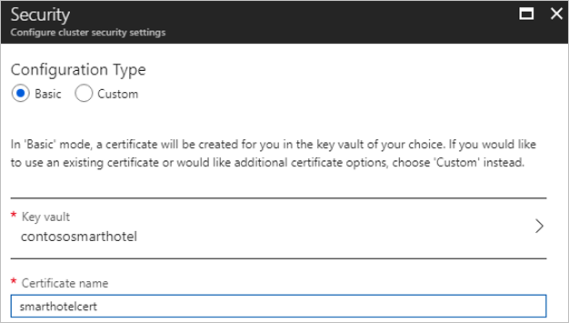 

7. In the summary page, they copy the link that's used to download the certificate. They need this to connect to the Service Fabric Cluster.

     

    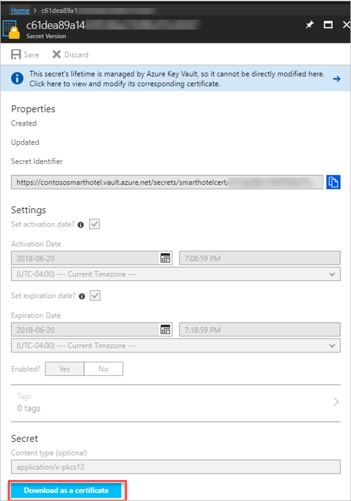 

8. After validation passes, they provision the cluster.

    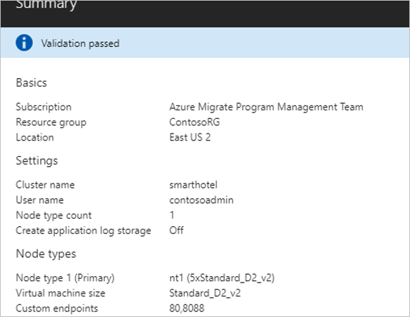 

9. In the Certificate Import Wizard, they import the downloaded certificate to dev machines. The certificate is used to authenticate to the cluster.

    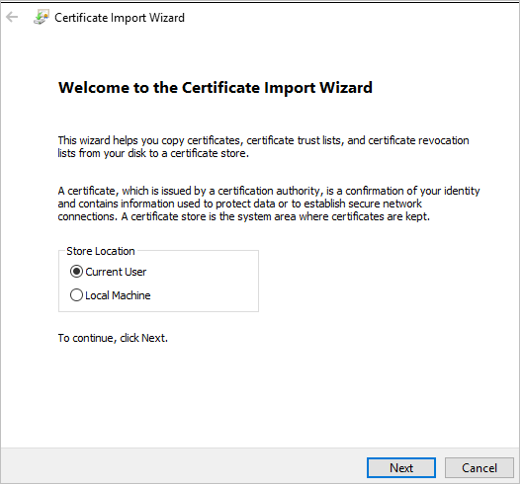 

10. After the cluster is provisioned, they connect to the Service Fabric Cluster Explorer.

    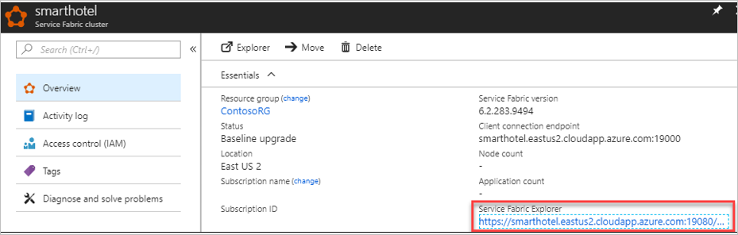 

11. They need to select the correct certificate.

    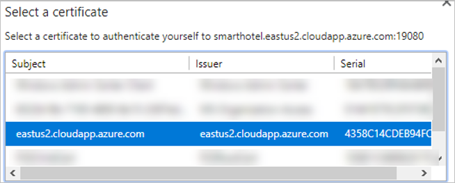 

12. The Service Fabric Explorer loads, and the Contoso Admin can manage the cluster.

     


## Step 4: Manage Service Fabric certificates

Contoso needs cluster certificates to allow Azure DevOps Services access to the cluster. Contoso admins set this up.

1. They open the Azure portal and browse to the KeyVault.
2. They open the certificates, and copy the thumbprint of the certificate that was created during the provisioning process.

    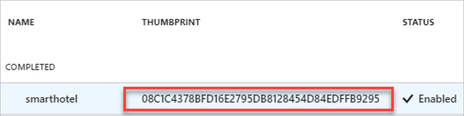
 
3. They copy it to a text file for later reference.
4. Now, they add a client certificate that will become an Admin client certificate on the cluster. This allows Azure DevOps Services to connect to the cluster for the app deployment in the release pipeline. To do they, they open KeyVault in the portal, and select **Certificates** > **Generate/Import**.

    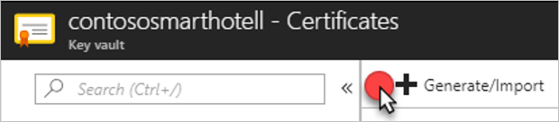

5. They enter the name of the certificate, and provide an X.509 distinguished name in **Subject**.

     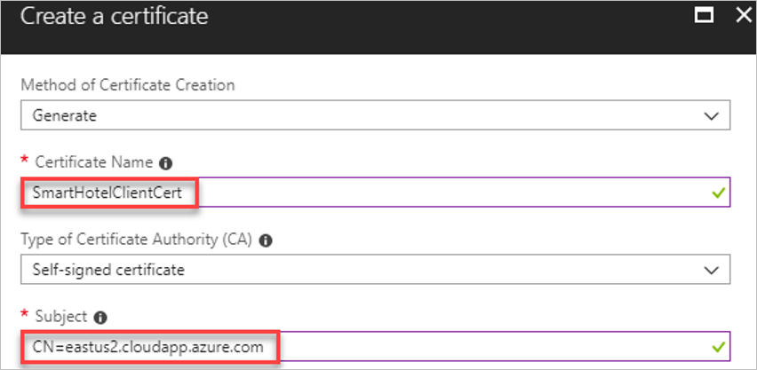

6. After the certificate is created, they download it locally in PFX format.

     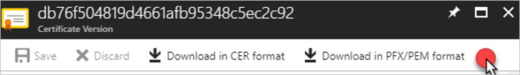

7. Now, they go back to the certificates list in the KeyVault, and copy the thumbprint of the client certificate that's just been created. They save it in the text file.

     

8. For Azure DevOps Services deployment, they need to determine the Base64 value of the certificate. They do this on the local developer workstation using PowerShell. They paste the output into a text file for later use.

    ```
    	[System.Convert]::ToBase64String([System.IO.File]::ReadAllBytes("C:\path\to\certificate.pfx")) 
    ```

     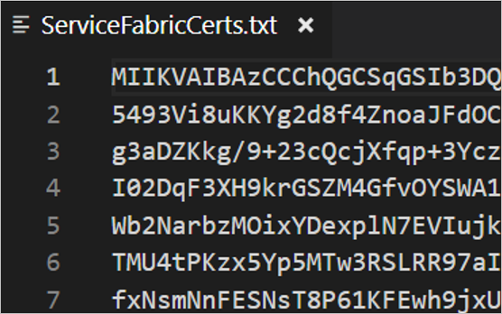

9. Finally, they add the new certificate to the Service Fabric cluster. To do this, in the portal they open the cluster, and click **Security**.

     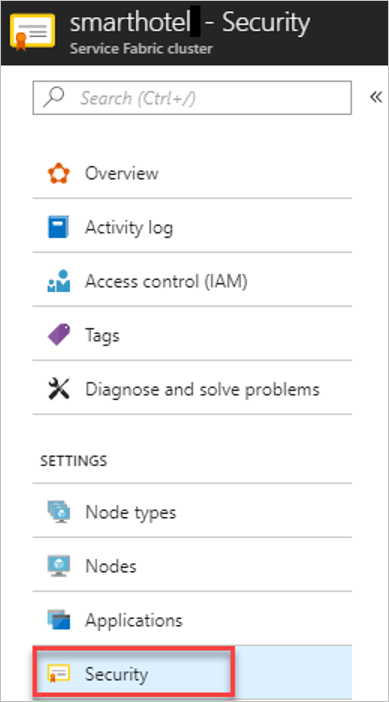

10. They click **Add** > **Admin Client**, and paste in the thumbprint of the new client certificate. Then they click **Add**. This can take up to 15 minutes.

     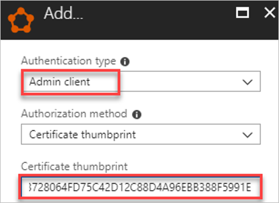

## Step 5: Migrate the database with DMA

Contoso admins can now migrate the SmartHotel360 database using DMA.

### Install DMA

1. They download the tool from the [Microsoft Download Center](https://www.microsoft.com/download/details.aspx?id=53595) to the on-premises SQL Server VM (**SQLVM**).
2. They run setup (DownloadMigrationAssistant.msi) on the VM.
3. On the **Finish** page, they select **Launch Microsoft Data Migration Assistant** before finishing the wizard.

### Configure the firewall

To connect to the Azure SQL Database, Contoso admins set up a firewall rule to allow access.

1. In the **Firewall and virtual networks** properties for the database, they allow access to Azure services, and add a rule for the client IP address of the on-premises SQL Server VM.
2. A server-level firewall rule is created.

    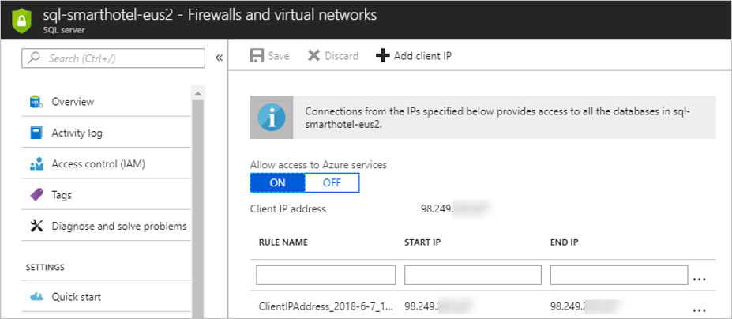

Need more help?

[Learn about](https://docs.microsoft.com/azure/sql-database/sql-database-firewall-configure#creating-and-managing-firewall-rules) creating and managing firewall rules for Azure SQL Database.

### Migrate

Contoso admins now migrate the database.

1. In the DMA create a new project (**SmartHotelDB**) and select **Migration** 
2. They select the source server type as **SQL Server**, and the target as **Azure SQL Database**. 

    

3. In the migration details, they add **SQLVM** as the source server, and the **SmartHotel.Registration** database. 

     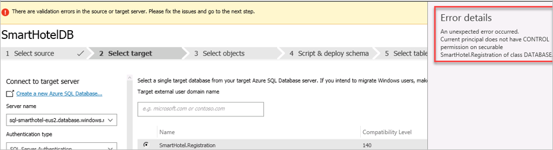

4. They receive an error which seems to be associated with authentication. However after investigating, the issue is the period (.) in the database name. As a workaround, they decided to provision a new SQL database using the name **SmartHotel-Registration**, to resolve the issue. When they run DMA again, they're able to select **SmartHotel-Registration**, and continue with the wizard.

    

5. In **Select Objects**, they select the database tables, and generate a SQL script.

    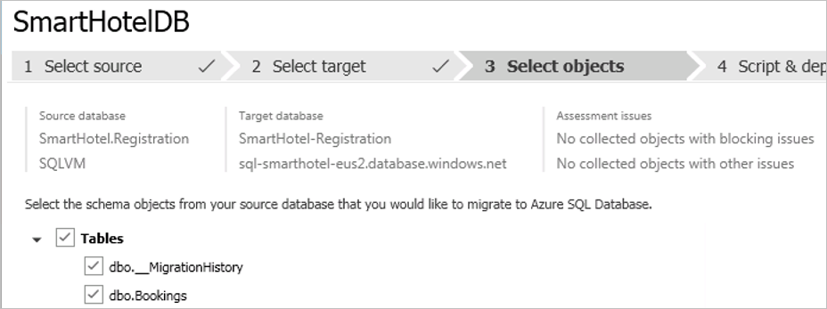

6. After DMS creates the script, they click **Deploy schema**.

    

7. DMA confirms that the deployment succeeded.

    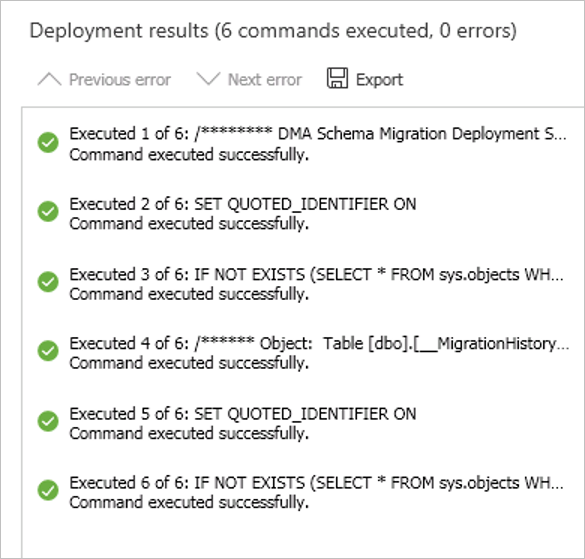

8. Now they start the migration.

    

9. After the migration finishes, Contoso can verify that the database is running on the Azure SQL instance.

     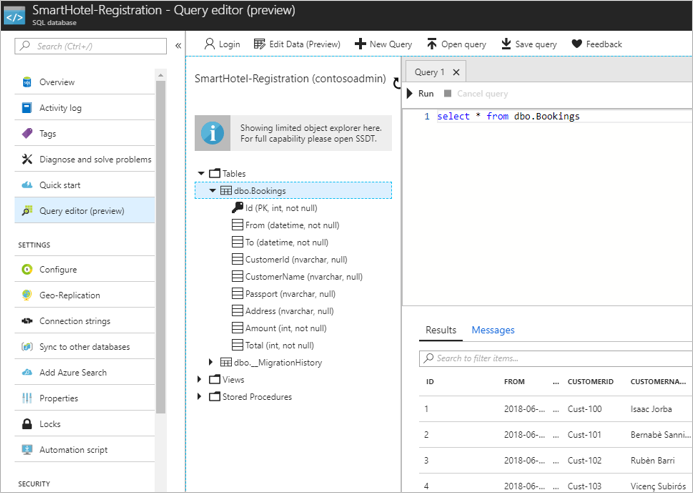

10. They delete the extra SQL database **SmartHotel.Registration** in the Azure portal.

     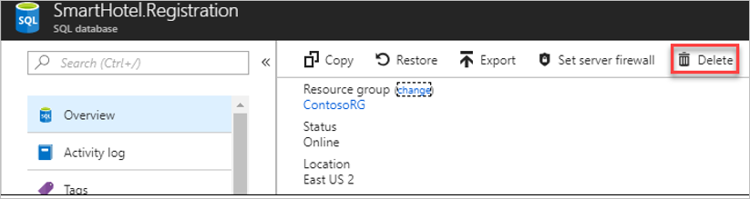


## Step 6: Set up Azure DevOps Services

Contoso needs to build the DevOps infrastructure and pipelines for the application.  To do this, Contoso admins create a new Azure DevOps project, import their code, and then build and release pipelines.

1.	 In the Contoso Azure DevOps account, they create a new project (**ContosoSmartHotelRearchitect**), and select **Git** for version control.
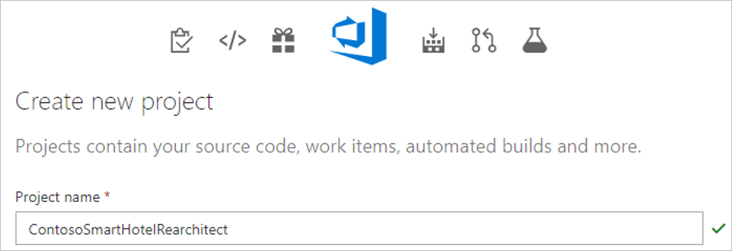

2. They import the Git Repo that currently holds their app code. It's in a [public repo](https://github.com/Microsoft/SmartHotel360-internal-booking-apps) and you can download it.

    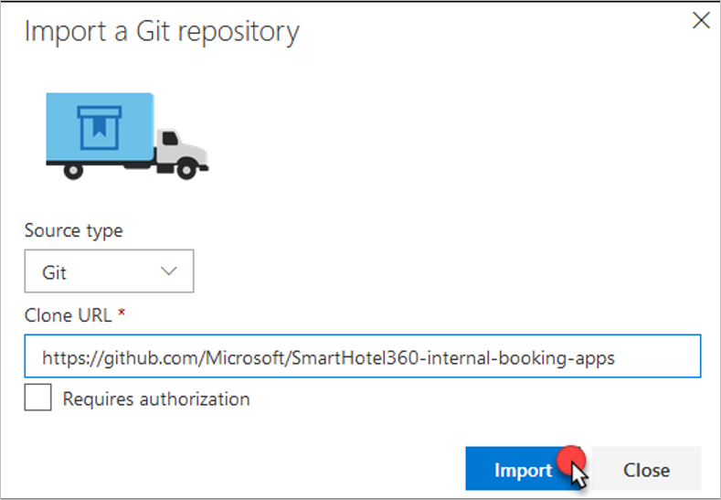

3. After the code is imported, they connect Visual Studio to the repo, and clone the code using Team Explorer.

4. After the repo is cloned to the developer machine, they open the Solution file for the app. The web app and wcf service each have separate project within the file.

    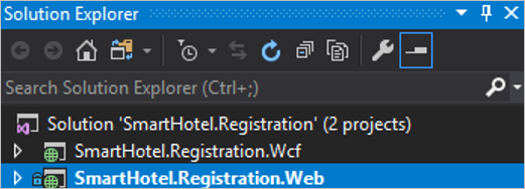

## Step 7: Convert the app to a container

The  on-premises app is a traditional three tier app:

- It contains WebForms and a WCF Service connecting to SQL Server.
- It uses Entity Framework to integrate with the data in the SQL database, exposing it through a WCF service.
- The WebForms application  interacts with the WCF service.

Contoso admins will convert the app to a container using isual Studio and the SDK Tools, as follows:


1. Using Visual Studio, they review the open solution file (SmartHotel.Registration.sln) in the **SmartHotel360-internal-booking-apps\src\Registration** directory of the local repo.  Two apps are shown. The web frontend SmartHotel.Registration.Web and the WCF service app SmartHotel.Registration.WCF.

    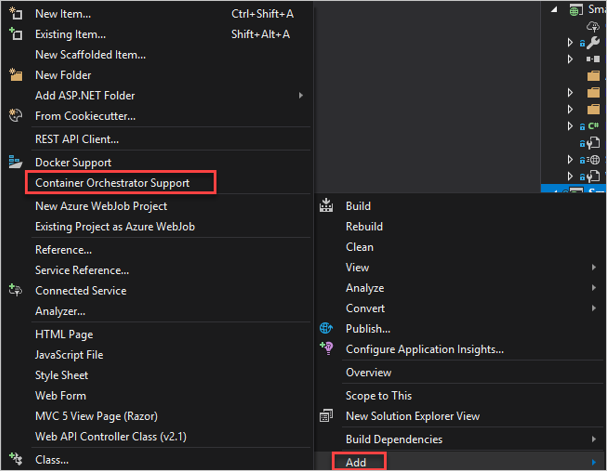


2. They right-click the web app > **Add** > **Container Orchestrator Support**.
3. In **Add Container Orchestra Support**, they select **Service Fabric**.

    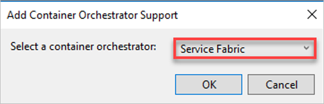
    
4. They repeat the process for SmartHotel.Registration.WCF app.
5. Now, they check how the solution has changed.

    - The new app is **SmartHotel.RegistrationApplication/**
    - It contains two services: **SmartHotel.Registration.WCF** and **SmartHotel.Registration.Web**.

    

6. Visual Studio created the Docker file, and pulled down the required images locally to the developer machine.

    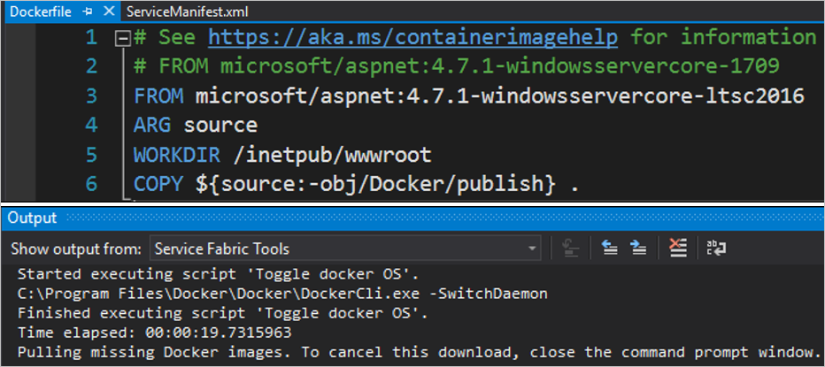

7. A manifest file (**ServiceManifest.xml**) is created and opened by Visual Studio. This file tells Service Fabric how to configure the container when it's deployed to Azure.

    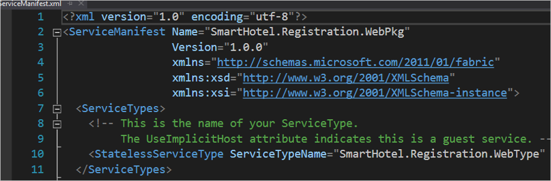

8. Another manifest file (**ApplicationManifest.xml) contains the configuration applications for the containers.

    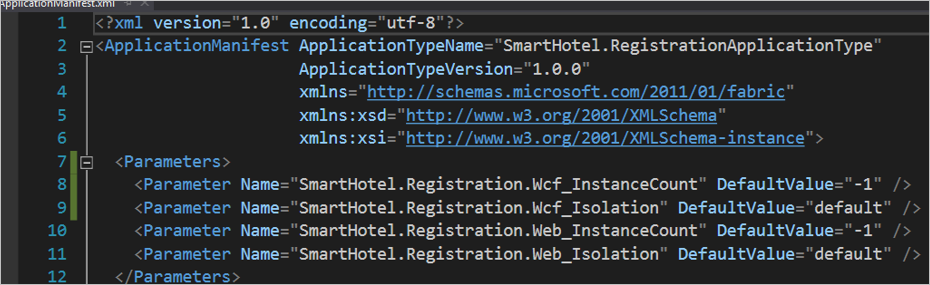

9. They open the **ApplicationParameters/Cloud.xml** file, and update the connection string to connect the app to the Azure SQL database. The connection string can be located in the database in the Azure portal.

    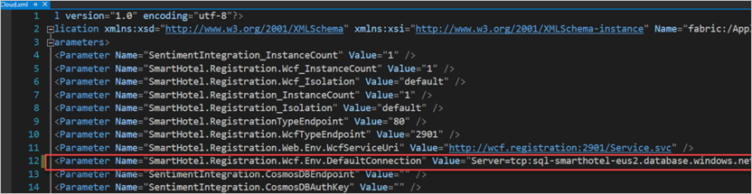

10. They commit the updated code and push to Azure DevOps Services.

    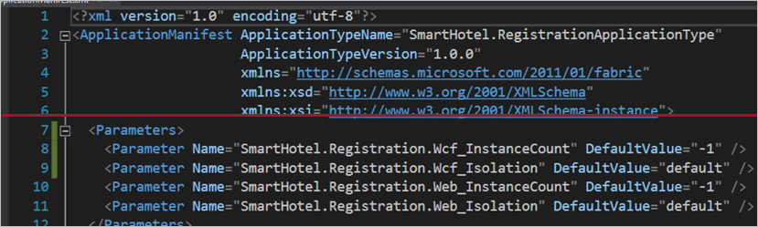

## Step 8: Build and release pipelines in Azure DevOps Services

Contoso admins now configure Azure DevOps Services to perform build and release process to action the DevOps practices.

1. In Azure DevOps Services, they click **Build and release** > **New pipeline**.

    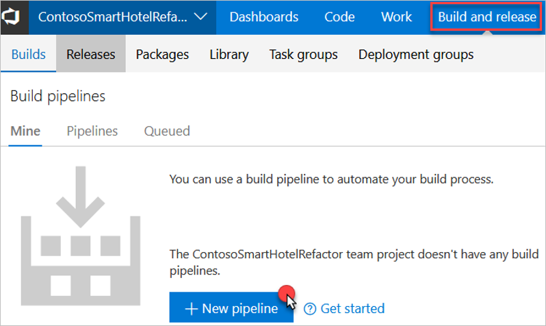

2. They select **Azure DevOps Services Git** and the relevant repo.

    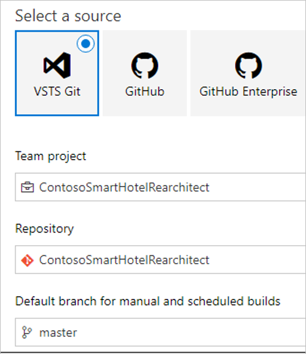

3. In **Select a template**, they select fabric with Docker support.

     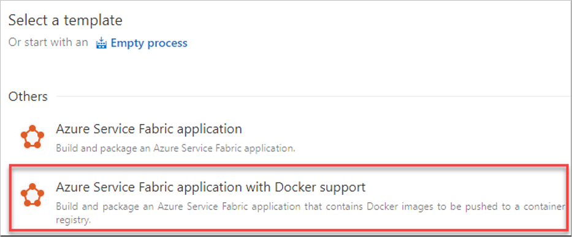
    
4. They change the Action Tag images to **Build an image**, and configure the task to use the provisioned ACR.

     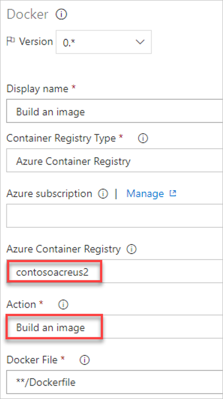

5. In the **Push images** task, they configure the image to be pushed to the ACR, and select to include the latest tag.
6. In **Triggers**, they enable continuous integration, and add the master branch.

    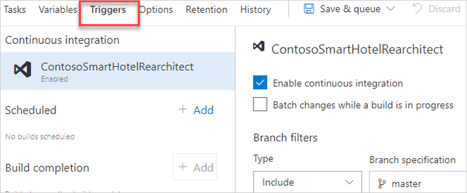

7. They click **Save and Queue** to start a build.
8. After the build succeeds, they move onto the release pipeline. In Azure DevOps Services they click **Releases** > **New pipeline**.

    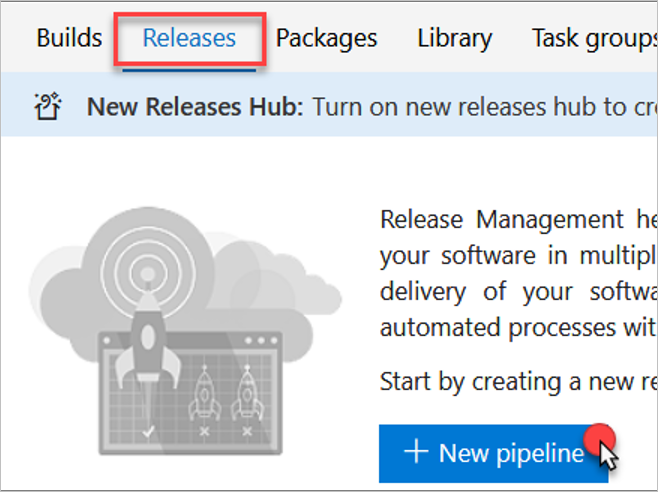    

9. They select the **Azure Service Fabric deployment** template, and name the Stage (**SmartHotelSF**).

    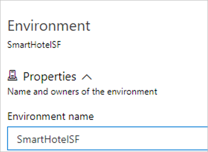

10. They provide a pipeline name (**ContosoSmartHotel360Rearchitect**). For the stage, they click **1 job, 1 task** to configure the Service Fabric deployment.

    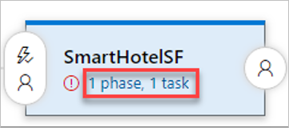

11. Now, they click **New** to add a new cluster connection.

    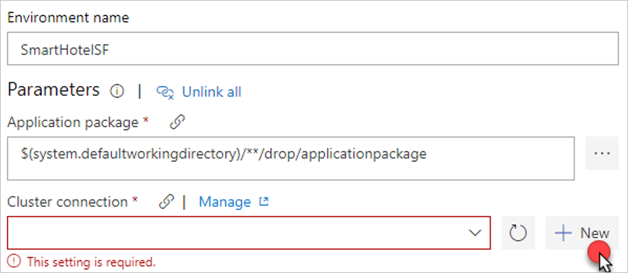

12. In **Add Service Fabric service connection**, they configure the connection, and the authentication settings that will be used by Azure DevOps Services to deploy the app. The cluster endpoint can be located in the Azure portal, and they add **tcp://** as a prefix.
13. The certificate information they collected is input in **Server Certificate Thumbprint** and **Client Certificate**.

    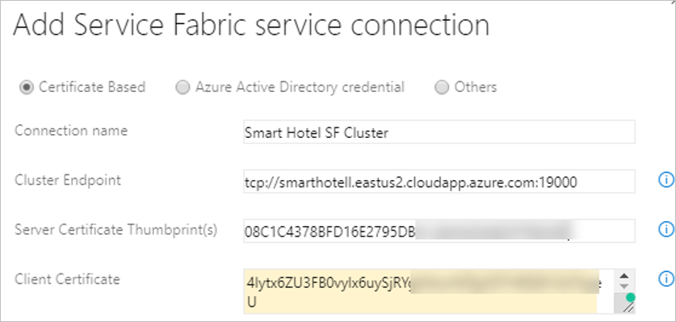

13. They click the pipeline > **Add an artifact**.

     

14. They select the project and build pipeline, using the latest version.

     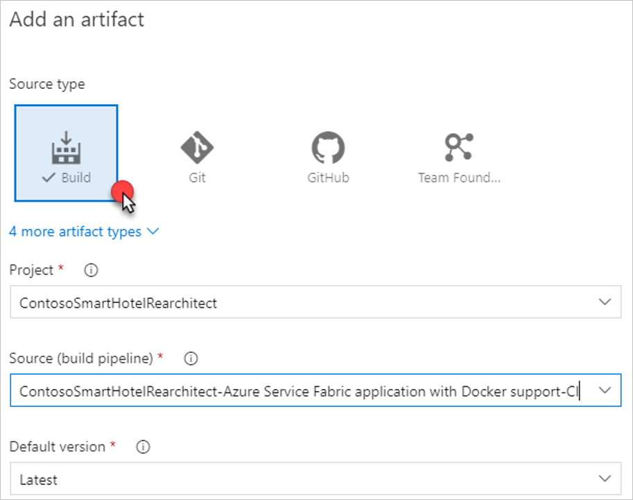

15. Note that the lightning bolt on the artifact is checked.

     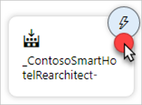

16. In addition, note that the continuous deployment trigger is enabled.

   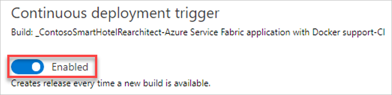 

17. They click **Save** > **Create a release**.

    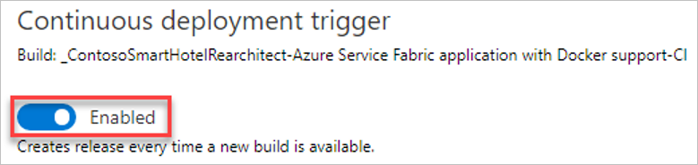

18. After the deployment finishes, SmartHotel360 will now be running Service Fabric.

    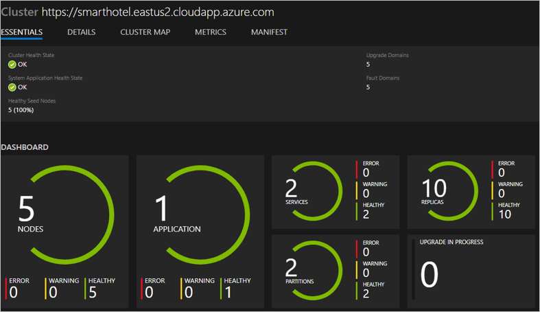

19. To connect to the app, they direct traffic to the public IP address of the Azure load balancer in front of the Service Fabric nodes.

    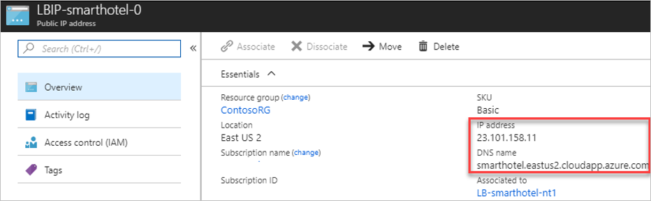

## Step 9: Extend the app and republish

After the SmartHotel360 app and database are running in Azure, Contoso wants to extend the app.

- Contoso’s developers are prototyping a new .NET Core application which will run on the Service Fabric cluster.
- The app will be used to pull sentiment data from CosmosDB.
- This data will be in the form of Tweets that are processed using a Serverless Azure Function, and the Cognitive Services Text Analysis API.

### Provision Azure Cosmos DB

As a first step, Contoso admins provision an Azure Cosmos database.

1. They create an Azure Cosmos DB resource from the Azure Marketplace.

    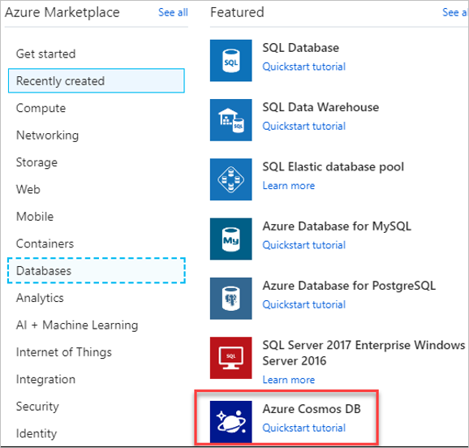

2. They provide a database name (**contososmarthotel**), select the SQL API, and place the resource in the production resource group, in the primary East US 2 region.

    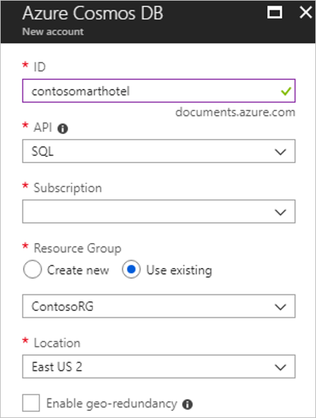

3. In **Getting Started**, they select **Data Explorer**, and add a new collection.
4. In **Add Collection** they provide IDs and set storage capacity and throughput.

    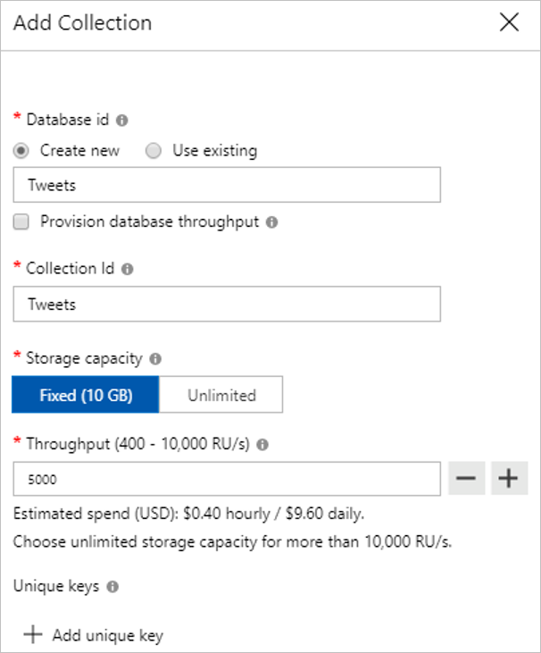

5. In the portal, they open the new database > **Collection** > **Documents** and click **New Document**.
6. They paste the following JSON code into the document window. This is sample data in the form of a single tweet.

    ```
    {
            "id": "2ed5e734-8034-bf3a-ac85-705b7713d911",
            "tweetId": 927750234331580911,
            "tweetUrl": "https://twitter.com/status/927750237331580911",
            "userName": "CoreySandersWA",
            "userAlias": "@CoreySandersWA",
            "userPictureUrl": "",
            "text": "This is a tweet about #SmartHotel360",
            "language": "en",
            "sentiment": 0.5,
            "retweet_count": 1,
            "followers": 500, 
            "hashtags": [
                ""
            ]
    }
    ```

    

7. They locate the Cosmos DB endpoint, and the authentication key. These are used in the app to connect to the collection. In the database, they click **Keys**, and copy the URI and primary key to Notepad.

    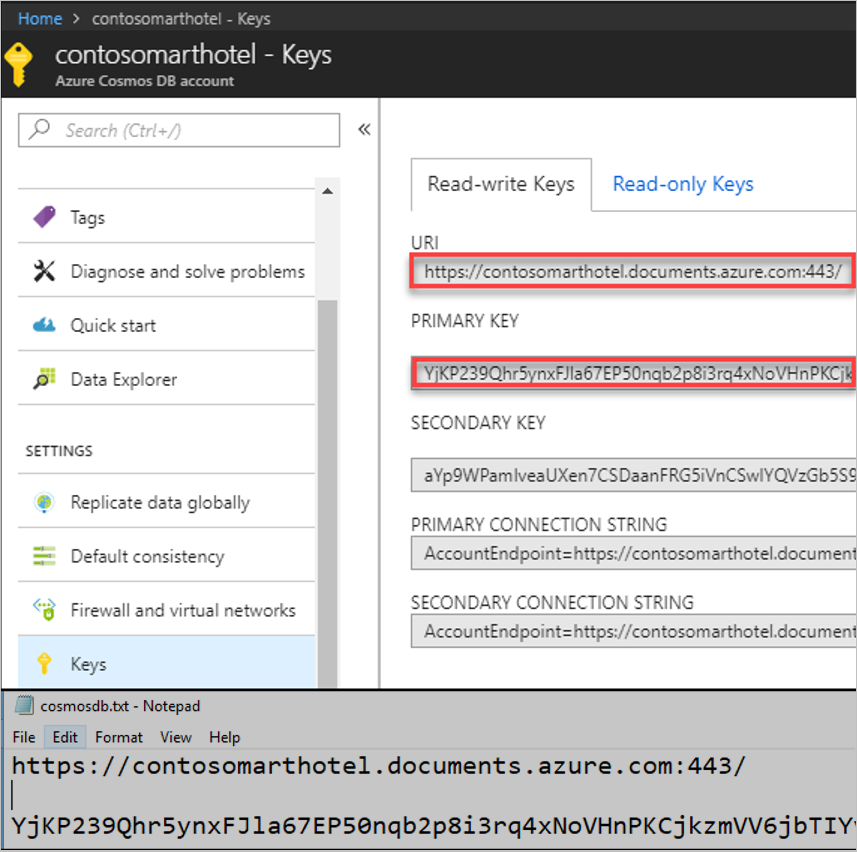

### Update the sentiment app

With the Cosmos DB provisioned, Contoso admins can configure the app to connect to it.

1. In Visual Studio, they open file ApplicationModern\ApplicationParameters\cloud.xml in Solution Explorer.

    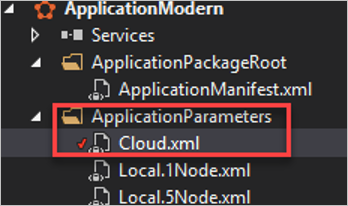

2. They fill in the following two parameters:

   ```
   <Parameter Name="SentimentIntegration.CosmosDBEndpoint" Value="[URI]" />
   ```
   
   ```
   <Parameter Name="SentimentIntegration.CosmosDBAuthKey" Value="[Key]" />
   ```

    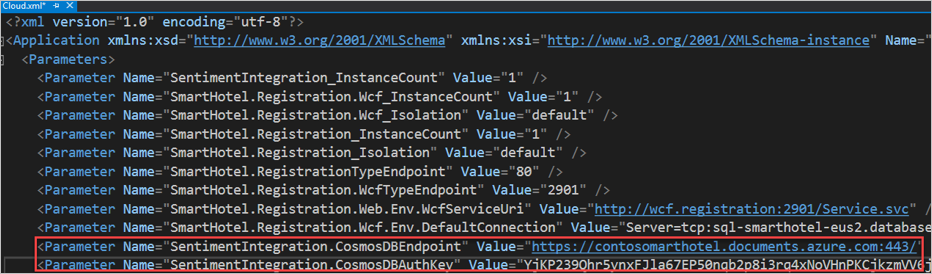

### Republish the app

After extending the app, Contoso admins republish it to Azure using the pipeline.

1. They commit and push their code to Azure DevOps Services. This kicks off the build and release pipelines.

2. After the build and deployment finishes, SmartHotel360 will now be running Service Fabric. The Servie Fabric Management console now shows three services.

    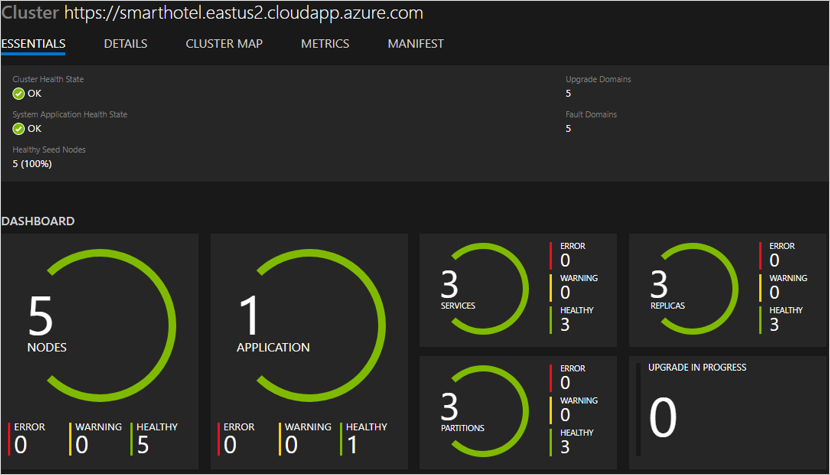

3. They can now click through the services to see that the SentimentIntegration app is up and running

    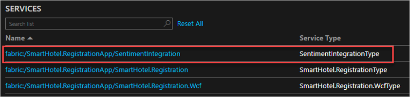

## Clean up after migration

After migration, Contoso needs to complete these cleanup steps:  

- Remove the on-premises VMs from the vCenter inventory.
- Remove the VMs from local backup jobs.
- Update internal documentation to show the new locations for the SmartHotel360 app. Show the database as running in Azure SQL database, and the front end as running in Service Fabric.
- Review any resources that interact with the decommissioned VMs, and update any relevant settings or documentation to reflect the new configuration.


## Review the deployment

With the migrated resources in Azure, Contoso needs to fully operationalize and secure their new infrastructure.

### Security

- Contoso admins need to ensure that their new **SmartHotel-Registration** database is secure. [Learn more](https://docs.microsoft.com/azure/sql-database/sql-database-security-overview).
- In particular, they should update the container to use SSL with certificates.
- They should consider using KeyVault to protect secrets for their Service Fabric apps. [Learn more](https://docs.microsoft.com/azure/service-fabric/service-fabric-application-secret-management).

### Backups

- Contoso needs to review backup requirements for the Azure SQL Database. [Learn more](https://docs.microsoft.com/azure/sql-database/sql-database-automated-backups).
- Contoso admins should consider implementing failover groups to provide regional failover for the database. [Learn more](https://docs.microsoft.com/azure/sql-database/sql-database-geo-replication-overview).
- They can leverage geo-replication for the ACR premium SKU. [Learn more](https://docs.microsoft.com/azure/container-registry/container-registry-geo-replication).
- Contoso need to consider deploying the Web App in the main East US 2 and Central US region when Web App for Containers becomes available. Contoso admins could configure Traffic Manager to ensure failover in case of regional outages.
- Cosmos DB backs up automatically. Contoso [read about](https://docs.microsoft.com/azure/cosmos-db/online-backup-and-restore) this process to learn more.

### Licensing and cost optimization

- After all resources are deployed, Contoso should assign Azure tags based on  [infrastructure planning](contoso-migration-infrastructure.md#set-up-tagging).
- All licensing is built into the cost of the PaaS services that Contoso is consuming. This will be deducted from the EA.
- Contoso will enable Azure Cost Management licensed by Cloudyn, a Microsoft subsidiary. It's a multi-cloud cost management solution that helps you to utilize and manage Azure and other cloud resources.  [Learn more](https://docs.microsoft.com/azure/cost-management/overview) about Azure Cost Management.

## Conclusion

In this article, Contoso refactored the SmartHotel360 app in Azure by migrating the app frontend VM to Service Fabric. The app database was migrated to an Azure SQL database.


