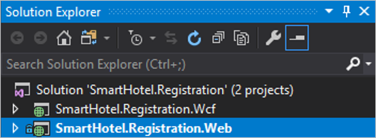
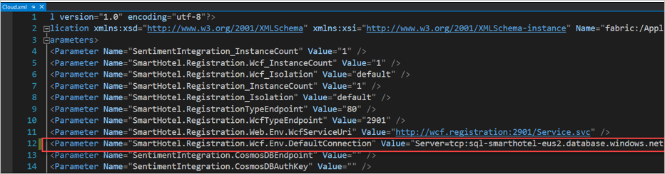
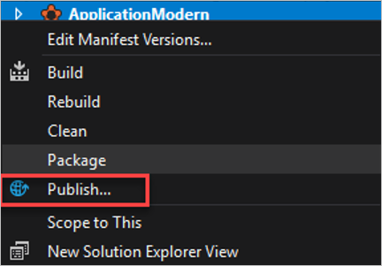
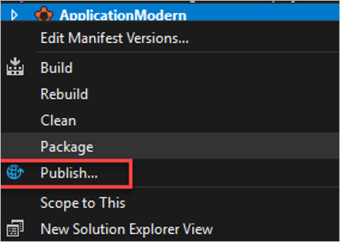
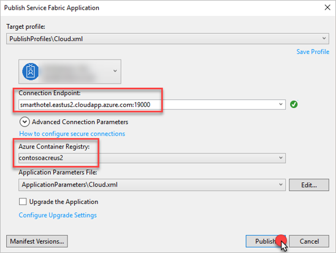

# Contoso migration: Rearchitect an on-premises app to an Azure container and Azure SQL Database

This article demonstrates how Contoso migrates and rearchitect their SmartHotel app in Azure. They migrate the app frontend VM to an Azure Windows container, and the app database to an Azure SQL database.

This document is one in a series of articles that show how the fictitious company Contoso migrates their on-premises resources to the Microsoft Azure cloud. The series includes background information, and scenarios that illustrate setting up a migration infrastructure, assessing on-premises resources for migration, and running different types of migrations. Scenarios grow in complexity, and we'll add additional articles over time.

**Article** | **Details** | **Status**
--- | --- | ---
[Article 1: Overview](contoso-migration-overview.md) | Provides an overview of Contoso's migration strategy, the article series, and the sample apps we use. | Available
[Article 2: Deploy an Azure infrastructure](contoso-migration-infrastructure.md) | Describes how Contoso prepares its on-premises and Azure infrastructure for migration. The same infrastructure is used for all migration articles. | Available
[Article 3: Assess on-premises resources](contoso-migration-assessment.md)  | Shows how Contoso runs an assessment of an on-premises two-tier SmartHotel app running on VMware. Contoso assesses app VMs with the [Azure Migrate](migrate-overview.md) service, and the app SQL Server database with the [Database Migration Assistant](https://docs.microsoft.com/sql/dma/dma-overview?view=sql-server-2017). | Available
[Article 4: Rehost an app to Azure VMs and a SQL Managed Instance](contoso-migration-rehost-vm-sql-managed-instance.md) | Demonstrates how Contoso runs a lift-and-shift migration to Azure for the SmartHotel app. Contoso migrates the app frontend VM using [Azure Site Recovery](https://docs.microsoft.com/azure/site-recovery/site-recovery-overview), and the app database to a SQL Managed Instance, using the [Azure Database Migration Service](https://docs.microsoft.com/azure/dms/dms-overview). | Available
[Article 5: Rehost an app to Azure VMs](contoso-migration-rehost-vm.md) | Shows how Contoso migrate the SmartHotel app VMs using Site Recovery only. | Available
[Article 6: Rehost an app to Azure VMs and SQL Server Always On Availability Group](contoso-migration-rehost-vm-sql-ag.md) | Shows how Contoso migrates the SmartHotel app. Contoso uses Site Recovery to migrate the app VMs, and the Database Migration service to migrate the app database to a SQL Server cluster protected by an AlwaysOn availability group. | Available
[Article 7: Rehost a Linux app to Azure VMs](contoso-migration-rehost-linux-vm.md) | Shows how Contoso does a lift-and-shift migration of the Linux osTicket app to Azure VMs, using Site Recovery | Available
[Article 8: Rehost a Linux app to Azure VMs and Azure MySQL Server](contoso-migration-rehost-linux-vm-mysql.md) | Demonstrates how Contoso migrates the Linux osTicket app to Azure VMs using Site Recovery, and migrates the app database to an Azure MySQL Server instance using MySQL Workbench. | Available
[Article 9: Refactor an app to an Azure Web App and Azure SQL database](contoso-migration-refactor-web-app-sql.md) | Demonstrates how Contoso migrates the SmartHotel app to an Azure Web App, and migrates the app database to Azure SQL Server instance | Available
[Article 10: Refactor a Linux app to Azure Web Apps and Azure MySQL](contoso-migration-refactor-linux-app-service-mysql.md) | Shows how Contoso migrates the Linux osTicket app to Azure Web Apps in multiple sites, integrated with GitHub for continuous delivery. They migrate the app database to an Azure MySQL instance. | Available
Article 11: Rearchitect an app on Azure containers and Azure SQL Database | Shows how Contoso migrates and rearchitects their SmartHotel app to Azure. They rearchitect the app web tier as a Windows container, and the app database in an Azure SQL Database. | This article.
[Article 12: Rearchitect an app on Azure containers and Azure SQL Database](contoso-migration-rearchitect-container-sql.md) | Shows how Contoso migrates and rearchitects their SmartHotel app to Azure. They rearchitect the app web tier as a Windows container, and the app database in an Azure SQL Database. | Available
[Article 13: Rebuild an app in Azure](contoso-migration-rebuild.md) | Shows how Contoso rebuild their SmartHotel app using a range of Azure capabilities and services, including App Services, Azure Kubernetes, Azure Functions, Cognitive services, and Cosmos DB. | Available

In this article, Contoso migrates the two-tier Windows. NET SmartHotel app running on VMware VMs to Azure. If you'd like to use this app, it's provided as open source and you can download it from [GitHub](https://github.com/Microsoft/SmartHotel360).

## Business drivers

The IT leadership team has worked closely with their business partners to understand what they want to achieve with this migration:

- **Address business growth**: Contoso is growing, and as a result there is pressure on their on-premises systems and infrastructure.
- **Increase efficiency**: Contoso needs to remove unnecessary procedures, and streamline processes for developers and users.  The business needs IT to be fast and not waste time or money, thus delivering faster on customer requirements.
- **Increase agility**:  Contoso IT needs to be more responsive to the needs of the business. It must be able to react faster than the changes in the marketplace, to enable the success in a global economy.  It mustn't get in the way, or become a business blocker.
- **Scale**: As the business grows successfully, Contoso IT must provide systems that are able to grow at the same pace.
- **Costs**: Contoso wants to minimize licensing costs.

## Migration goals

The Contoso cloud team has pinned down goals for this migration. These goals were used to determine the best migration method.

**Goals** | **Details**
--- | --- 
**App reqs** | The app in Azure will remain as critical as it is today.<br/><br/> It should have the same performance capabilities as it currently does in VMWare.<br/><br/> They want to stop supporting Windows Server 2008 R2, on which the app currently runs, and are willing to invest in the app.<br/><br/> They want to move away from SQL Server 2008 R2 to a modern PaaS Database platform, which will minimize the need for management.<br/><br/> Contoso want to leverage their investment in SQL Server licensing and Software Assurance where possible.<br/><br/> They want to be able to scale up the app web tier.
**Limitations** | The app consists of an ASP.NET app and a WCF service running on the same VM. They want to split this across two web apps using the Azure App Service. 
**Azure reqs** | They want to move the app to Azure, and run it in a container to extend app life. They don't want to start completely from scratch to implement the app in Azure. 

## Solution design

After pinning down their goals and requirements, Contoso designs and review a deployment solution, and identifies the migration process, including the Azure services that they'll use for the migration.

### Current app

- The SmartHotel on-premises app is tiered across two VMs (WEBVM and SQLVM).
- The VMs are located on VMware ESXi host **contosohost1.contoso.com** (version 6.5)
- The VMware environment is managed by vCenter Server 6.5 (**vcenter.contoso.com**), running on a VM.
- Contoso has an on-premises datacenter (contoso-datacenter), with an on-premises domain controller (**contosodc1**).
- The on-premises VMs in the Contoso datacenter will be decommissioned after the migration is done.


### Proposed architecture

- For the database tier of the app, Contoso compared Azure SQL Database with SQL Server using [this article](https://docs.microsoft.com/azure/sql-database/sql-database-features). They decided to go with Azure SQL Database for a few reasons:
    - Azure SQL Database is a relational-database managed service. It delivers predictable performance at multiple service levels, with near-zero administration. Advantages include dynamic scalability with no downtime, built-in intelligent optimization, and global scalability and availability.
    - They can leverage the lightweight Data Migration Assistant (DMA) to assess and migrate the on-premises database to Azure SQL.
    - With Software Assurance, they can exchange their existing licenses for discounted rates on a SQL Database, using the Azure Hybrid Benefit for SQL Server. This could provide savings of up to 30%.
    - SQL Database provides a number of security features including always encrypted, dynamic data masking, and row-level security/threat detection.
- For the app web tier, they've decided convert it to the Windows Container using Visual Studio.
    - They'll deploy the app using Azure Service Fabric, and pull the Windows container image from the Azure Container Registry (ACR).
    - A prototype for extending the app to include sentiment analysis will be implemented as another service in Service Fabric, connected to Cosmos DB.  This will read information from Tweets, and display on the app.

     

  
### Solution review
Contoso evaluates their proposed design by putting together a pros and cons list.

**Consideration** | **Details**
--- | ---
**Pros** | The SmartHotel app code will need to be altered for migration to Azure Service Fabric. However, the effort is minimal, using the Service Fabric SDK tools for the changes.<br/><br/> With the move to Service Fabric, they can start to develop microservices to add to the application quickly over time, without risk to the original code base.<br/><br/> Windows Containers offer the same benefits as containers in general. They improve agility, portability, and control.<br/><br/> They can leverage their investment in Software Assurance using the Azure Hybrid Benefit for both SQL Server and Windows Server.<br/><br/> After the migration they'll no longer need to support Windows Server 2008 R2. [Learn more](https://support.microsoft.com/lifecycle).<br/><br/> They can configure the web tier of the app with multiple instances, so that it's no longer a single point of failure.<br/><br/> They'll no longer be dependent on the aging SQL Server 2008 R2.<br/><br/> SQL Database supports Contoso's technical requirements. They assessed the on-premises database using the Database Migration Assistant and found that it's compatible.<br/><br/> SQL Database has built-in fault tolerance that Contoso don't need to set up. This ensures that the data tier is no longer a single point of failover.
**Cons** | Containers are more complex than other migration options. The learning curve on containers could be an issue for Contoso.  They introduce a new level of complexity that provides a lot of value in spite of the curve.<br/><br/> The operations team at Contoso will need to ramp up to understand and support Azure, containers and microservices for the app.<br/><br/> If they use the Data Migration Assistant instead of Data Migration Service to migrate their database, Contoso won’t have the infrastructure ready for migrating databases at scale.


### Migration process

1. Contoso provision the Azure service fabric cluster for Windows.
2. They provision an Azure SQL instance, and migrate the SmartHotel database to it.
3. They convert the Web tier VM to a Docker container using the Service Fabric SDK tools.
4. They connect the service fabric cluster and the ACR, and deploy the app using Azure service fabric.

     

### Azure services

**Service** | **Description** | **Cost**
--- | --- | ---
[Database Migration Assistant (DMA)](https://docs.microsoft.com/sql/dma/dma-overview?view=ssdt-18vs2017) | They'll use DMA to assess and detect compatibility issues that might impact their database functionality in Azure. DMA assesses feature parity between SQL sources and targets, and recommends performance and reliability improvements. | It's a downloadable tool free of charge.
[Azure SQL Database](https://azure.microsoft.com/services/sql-database/) | An intelligent, fully managed relational cloud database service. | Cost based on features, throughput and size. [Learn more](https://azure.microsoft.com/pricing/details/sql-database/managed/).
[Azure Container Registry](https://azure.microsoft.com/services/container-registry/) | Store images for all types of container deployments. | Cost based on features, storage, and usage duration. [Learn more](https://azure.microsoft.com/pricing/details/container-registry/).
[Azure Service Fabric](https://azure.microsoft.com/services/service-fabric/) | Build and operate always-on, scalable and distributed apps | Cost based on size, location, and duration of the compute nodes. [Learn more](https://azure.microsoft.com/pricing/details/service-fabric/).

## Prerequisites

Here's what you (and Contoso) need to run this scenario:

**Requirements** | **Details**
--- | ---
**Azure subscription** | You should have already created a subscription when  you performed the assessment in the first article in this series. If you don't have an Azure subscription, create a [free account](https://azure.microsoft.com/pricing/free-trial/).<br/><br/> If you create a free account, you're the administrator of your subscription and can perform all actions.<br/><br/> If you use an existing subscription and you're not the administrator, you need to work with the admin to assign you Owner or Contributor permissions.
**Azure infrastructure** | [Learn how](contoso-migration-infrastructure.md) Contoso set up an Azure infrastructure.
**Developer prerequisites** | Contoso needs the following tools on a developer workstation:<br/><br/> - [Visual Studio 2017 Community Edition: Version 15.5](https://www.visualstudio.com/)<br/><br/> - .NET workload enabled.<br/><br/> - [Git](https://git-scm.com/)<br/><br/> - [Service Fabric SDK v 3.0 or later](https://docs.microsoft.com/azure/service-fabric/service-fabric-get-started)<br/><br/> - [Docker CE (Windows 10) or Docker EE (Windows Server)](https://docs.docker.com/docker-for-windows/install/) set to use Windows Containers.


## Scenario steps

Here's how Contoso will run the migration:

> [!div class="checklist"]
> * **Step 1: Provision a SQL Database instance in Azure**: Contoso provisions a SQL instance in Azure. After the frontend web VM is migrated to an Azure container, the container instance with the app web frontend will point to this database.
> * **Step 2: Provision Azure Service Fabric**: They provision a Service Fabric Cluster.
> * **Step 4: Migrate the database with DMA**: They migrate the app database with the Database Migration Assistant.
> * **Step 5: Convert the app to a container**: They convert the app to a container using Visual Studio and SDK Tools.
> * **Step 6: Publish the app**: They publish to app to the ACR and Service Fabric Cluster.
> * **Step 7: Extend the app**: After the app is public, they extend it to take advantage of Azure capabilities, and republish it to Azure.


## Step 1: Provision an Azure SQL Database

1. They select to create a SQL Database in Azure. 

    

2. They specify a database  name to match the database running on the on-premises VM (**SmartHotel.Registration**). They place the database in the ContosoRG resource group. This is the resource group they use for production resources in Azure.

    

3. They set up a new SQL Server instance (**sql-smarthotel-eus2**) in the primary region.

    

4. They set the pricing tier to match their server and database needs. And they select to save money with Azure Hybrid Benefit because they already have a SQL Server license.
5. For sizing they use v-Core-based purchasing, and set the limits for their expected requirements.

    

6. Then they create the database instance.

    

7. After the instance is created, they open the database, and note details they need when they use the Database Migration Assistance for migration.

    


**Need more help?**

- [Get help](https://docs.microsoft.com/azure/sql-database/sql-database-get-started-portal) provisioning a SQL Database.
- [Learn about](https://docs.microsoft.com/azure/sql-database/sql-database-vcore-resource-limits-elastic-pools) v-Core resource limits.


## Step 2: Create an ACR and provision an Azure Container

The Azure container is created using the exported files from the Web VM. The container is housed in the Azure Container Registry (ACR).


1. Contoso creates a Container Registry in the Azure portal.

     

2. They provide a name for the registry (**contosoacreus2**), and place it in the primary region, in the resource group they use for their infrastructure resources. They enable access for admin users, and set it as a premium SKU so that they can leverage geo-replication.

      


## Step 3: Provision Azure Service Fabric

The SmartHotel container will run in the Azure Service Fabric Sluster. Contoso creates the Service Fabric Cluster as follows:

1. Create a Service Fabric resource from the Azure Marketplace

     

2. In **Basic**, they provide a unique DS name for the cluster, and credentials for accessing the on-premises VM. They place the resource in the production resource group (**ContosoRG**) in the primary East US 2 region.

     

3. In **Node type configuration**, they input a node type name, durability settings, VM size, and app endpoints.

     


4. In **Create key vault**, they create a new key vault in their infrastructure resource group, to house the certificate.

     


5. In **Access Policies** they eanble access to virtual machines to deploy the key vault.

     

6. They specify a name for the certificate.

     

7. In the summary page, they copy the link that's used to download the certificate. They need this to connect to the Service Fabric Cluster.

     

     

8. After validation passes, they provision the cluster.

     

9. In the Certificate Import Wizard, they import the downloaded certificate to dev machines. The certificate is used to authenticate to the cluster.

     

10. After the cluster is provisioned, they connect to the Service Fabric Cluster Explorer.

     

11. They need to select the correct certificate.

     

12. The Service Fabric Explorer loads, and the Contoso Admin can manage the cluster.

     


## Step 3: Migrate the database with DMA

Contoso will migrate the SmartHotel database using DMA.

### Install DMA

1. They download the tool from the [Microsoft Download Center](https://www.microsoft.com/download/details.aspx?id=53595) to the on-premises SQL Server VM (**SQLVM**).
2. They run setup (DownloadMigrationAssistant.msi) on the VM.
3. On the **Finish** page, they select **Launch Microsoft Data Migration Assistant** before finishing the wizard.

### Configure the firewall

To connect to the Azure SQL Database, a firewall rule is needed.

1. In the **Firewall and virtual networks** properties for the database, they allow access to Azure services, and add a rule for the client IP address of the on-premises SQL Server VM.
2. A server-level firewall rule is created.

    

Need more help?

[Learn about](https://docs.microsoft.com/azure/sql-database/sql-database-firewall-configure#creating-and-managing-firewall-rules) creating and managing firewall rules for Azure SQL Database.

### Migrate

1. In the DMA create a new project (**SmartHotelDB**) and select **Migration** 
2. They select the source server type as **SQL Server**, and the target as **Azure SQL Database**. 

    

3. In the migration details, they add **SQLVM** as the source server, and the **SmartHotel.Registration** database. 

     

4. They receive an error which seems to be associated with authentication. However after investigating, the issue is the period (.) in the database name. As a workaround, they decided to provision a new SQL database using the name **SmartHotel-Registration**, to resolve the issue. When they run DMA again, they're able to select **SmartHotel-Registration**, and continue with the wizard.

    

5. In **Select Objects**, they select the database tables, and generate a SQL script.

    

6. After DMS creates the script, they click **Deploy schema**.

    

7. DMA confirms that the deployment succeeded.

    

8. Now they start the migration.

    

9. After the migration finishes, Contoso can verify that the database is running on the Azure SQL instance.

     

10. They delete the extra SQL database **SmartHotel.Registration** in the Azure portal.

     


## Step 4: Convert the app to a container

The  on-premises app is a traditional three tier app:

- It contains WebForms and a WCF Service connecting to SQL Server.
- It uses Entity Framework to integrate with the data in the SQL database, exposing it through a WCF service.
- The WebForms application  interacts with the WCF service.

Contoso will convert the app to a container using isual Studio and the SDK Tools, as follows:

1. They clone the repo locally to a developer machine:

    **git clone https://github.com/Microsoft/SmartHotel360-internal-booking-apps.git**

    

2. Using Visual Studio, they open the solution file (SmartHotel.Registration.sln) in the **SmartHotel360-internal-booking-apps\src\Registration** directory of the local repo.  Two apps are shown. The web frontend SmartHotel.Registration.Web nad the WCF service app SmartHotel.Registration.WCF.

    


3. They right-click the web app > **Add** > **Container Orchestrator Support**.
4. In **Add Container Orchestra Support**, they select **Service Fabric**.

    

5. Contoso repeats the process for SmartHotel.Registration.WCF app.
6. Now, Contoso checks how the solution has changed.

    - The new app is **SmartHotel.RegistrationApplication/**
    - It contains two services: **SmartHotel.Registration.WCF** and **SmartHotel.Registration.Web**.

    

7. Visual Studio created the Docker file, and pulled down the required images locally to the developer machine.

    

8. A manifest file (**ServiceManifest.xml**) is created and opened by Visual Studio. This file tells Service Fabric how to configure the container when it's deployed to Azure.

    

9. Another manifest file (**ApplicationManifest.xml) contains the configuration applications for the containers.

    

## Step 5: Publish the app


Finally, Contoso can publish the app to the ACR and Service Fabric Cluster.

> [!NOTE]
> Some changes related to the Service Fabric cluster were made in the SmartHotel app. You can download both the original and modernized app code from [GitHub](https://github.com/Microsoft/SmartHotel360-internal-booking-apps). The changed file is **AppliationModern/ApplicationParameters/Cloud.xml**.


1. In Visual Studio, the update the connection string to connect the app to the Azure SQL Database. The connection string can be found in the database in the Azure portal.

    

2. Contoso publishes the app to Service Fabric using Visual Studio. They right-click on the Service Fabric application > **Publish**.

    

3. They select the subscription, connection endpoint, and ACR. Then click **Publish**.

    

4. After the deployment finishes, SmartHotel will now be running Service Fabric.

    

5. To connect to the app, Contoso directs traffic to the public IP address of the Azure load balancer in fron of their Service Fabric nodes.

    

## Step 6: Extend the app and republish

After the SmartHotel app and database are running in Azure, Contoso wants to extend the app.

- Contoso’s developers are prototyping a new .NET Core application which will run on the Service Fabric cluster.
- The app will be used to pull sentiment data from CosmosDB.
- This data will be in the form of Tweets that are processed using a Serverless Azure Function, and the Cognitive Services Text Analysis API.

### Provision Azure Cosmos DB

As a first step, Contoso provision an Azure Cosmos database.

1. They create an Azure Cosmos DB resource from the Azure Marketplace.

    

2. They provide a database name (**contososmarthotel**), select the SQL API, and place the resource in the production resource group, in the primary East US 2 region.

    

3. In **Getting Started**, they select **Data Explorer**, and add a new collection.
4. In **Add Collection** they provide IDs and set storage capacity and throughput.

    

5. In the portal, they open the new database > **Collection** > **Documents** and click **New Document**.
6. They paste the following JSON code into the document window. This is sample data in the form of a single tweet.

    ```
    {
            "id": "2ed5e734-8034-bf3a-ac85-705b7713d911",
            "tweetId": 927750234331580911,
            "tweetUrl": "https://twitter.com/status/927750237331580911",
            "userName": "CoreySandersWA",
            "userAlias": "@CoreySandersWA",
            "userPictureUrl": "",
            "text": "This is a tweet about #SmartHotel",
            "language": "en",
            "sentiment": 0.5,
            "retweet_count": 1,
            "followers": 500, 
            "hashtags": [
                ""
            ]
    }
    ```

    

7. They locate the Cosmos DB endpoint, and the authentication key. These are used in the app to connect to the collection. In the database, they click **Keys**, and copy the URI and primary key to Notepad.

    

### Update the sentiment app

With the Cosmos DB provisioned, Contoso can configure the app to connect to it.

1. In Visual Studio, they open file ApplicationModern\ApplicationParameters\cloud.xml in Solution Explorer.

    

2. They fill in the following two parameters:

   ```
   <Parameter Name="SentimentIntegration.CosmosDBEndpoint" Value="[URI]" />
   ```
   
   ```
   <Parameter Name="SentimentIntegration.CosmosDBAuthKey" Value="[Key]" />
   ```

    

### Republish the app

After extending the app, Contoso republishes it to Azure.

1. In the portal, they right-click on the Service Fabric app > **Publish**.

    

2. They select the subscription, connection endpoint, and ACR. Then click **Publish**.

    

4. After the deployment finishes, SmartHotel will now be running Service Fabric. The Servie Fabric Management console now shows three services.

    

5. Contoso can click through the services to see that the SentimentIntegration app is up and running

    

## Clean up after migration

After migration, Contoso needs to complete these cleanup steps:  

- Remove the on-premises VMs from the vCenter inventory.
- Remove the VMs from local backup jobs.
- Update internal documentation to show the new locations for the SmartHotel app. Show the database as running in Azure SQL database, and the front end as running in Service Fabric.
- Review any resources that interact with the decommissioned VMs, and update any relevant settings or documentation to reflect the new configuration.


## Review the deployment

With the migrated resources in Azure, Contoso needs to fully operationalize and secure their new infrastructure.

### Security

- Contoso need to ensure that their new **SmartHotel-Registration** database is secure. [Learn more](https://docs.microsoft.com/azure/sql-database/sql-database-security-overview).
- In particular, they should update the container to use SSL with certificates.
- They should consider using KeyVault to protect secrets for their Service Fabric apps. [Learn more](https://docs.microsoft.com/azure/service-fabric/service-fabric-application-secret-management).

### Backups

- Contoso needs to review backup requirements for the Azure SQL Database. [Learn more](https://docs.microsoft.com/azure/sql-database/sql-database-automated-backups).
- They should consider implementing failover groups to provide regional failover for the database. [Learn more](https://docs.microsoft.com/azure/sql-database/sql-database-geo-replication-overview).
- They can leverage geo-replication for the ACR premium SKU. [Learn more](https://docs.microsoft.com/azure/container-registry/container-registry-geo-replication).
- Contoso need to consider deploying the Web App in the main East US 2 and Central US region when Web App for Containers becomes available. They could configure Traffic Manager to ensure failover in case of regional outages.

### Licensing and cost optimization

- After all resources are deployed, Contoso should assign Azure tags based on their [infrastructure planning](contoso-migration-infrastructure.md#set-up-tagging).
- All licensing is built into the cost of the PaaS services that Contoso is consuming. This will be deducted from the EA.
1. Contoso will enable Azure Cost Management licensed by Cloudyn, a Microsoft subsidiary. It's a multi-cloud cost management solution that helps you to utilize and manage Azure and other cloud resources.  [Learn more](https://docs.microsoft.com/azure/cost-management/overview) about Azure Cost Management. 

## Conclusion

In this article, Contoso refactored the SmartHotel app in Azure by migrating the app frontend VM to Service Fabric. They migrated the app database to an Azure SQL database.


