# Contoso migration: Rebuild an on-premises app to Azure

This article demonstrates how Contoso migrates and rebuilds their SmartHotel app in Azure. They migrate the app's front end VM to Azure App Services Web apps. The app back end is built using microservices deployed to containers managed by Azure Kubernetes Service (AKS). The site interacts with Azure Functions providing pet photo functionality. 

This document is one in a series of articles that show how the fictitious company Contoso migrates their on-premises resources to the Microsoft Azure cloud. The series includes background information, and scenarios that illustrate setting up a migration infrastructure, assessing on-premises resources for migration, and running different types of migrations. Scenarios grow in complexity, and we'll add additional articles over time.

**Article** | **Details** | **Status**
--- | --- | ---
[Article 1: Overview](contoso-migration-overview.md) | Provides an overview of Contoso's migration strategy, the article series, and the sample apps we use. | Available
[Article 2: Deploy an Azure infrastructure](contoso-migration-infrastructure.md) | Describes how Contoso prepares its on-premises and Azure infrastructure for migration. The same infrastructure is used for all migration articles. | Available
[Article 3: Assess on-premises resources](contoso-migration-assessment.md)  | Shows how Contoso runs an assessment of an on-premises two-tier SmartHotel app running on VMware. Contoso assesses app VMs with the [Azure Migrate](migrate-overview.md) service, and the app SQL Server database with the [Database Migration Assistant](https://docs.microsoft.com/sql/dma/dma-overview?view=sql-server-2017). | Available
[Article 4: Rehost an app on Azure VMs and a SQL Managed Instance](contoso-migration-rehost-vm-sql-managed-instance.md) | Demonstrates how Contoso runs a lift-and-shift migration to Azure for the SmartHotel app. Contoso migrates the app frontend VM using [Azure Site Recovery](https://docs.microsoft.com/azure/site-recovery/site-recovery-overview), and the app database to a SQL Managed Instance, using the [Azure Database Migration Service](https://docs.microsoft.com/azure/dms/dms-overview). | Available
[Article 5: Rehost an app on Azure VMs](contoso-migration-rehost-vm.md) | Shows how Contoso migrate the SmartHotel app VMs using Site Recovery only. | Available
[Article 6: Rehost an app to Azure VMs and SQL Server Always On Availability Group](contoso-migration-rehost-vm-sql-ag.md) | Shows how Contoso migrates the SmartHotel app. Contoso uses Site Recovery to migrate the app VMs, and the Database Migration service to migrate the app database to a SQL Server cluster protected by an AlwaysOn availability group. | Available
[Article 7: Rehost a Linux app on Azure VMs](contoso-migration-rehost-linux-vm.md) | Shows how Contoso does a lift-and-shift migration of the Linux osTicket app to Azure VMs, using Site Recovery | Available
[Article 8: Rehost a Linux app on Azure VMs and Azure MySQL Server](contoso-migration-rehost-linux-vm-mysql.md) | Demonstrates how Contoso migrates the Linux osTicket app to Azure VMs using Site Recovery, and migrates the app database to an Azure MySQL Server instance using MySQL Workbench. | Available
[Article 9: Refactor an app on Azure Web Apps and Azure SQL database](contoso-migration-refactor-web-app-sql.md) | Demonstrates how Contoso migrates the SmartHotel app to an Azure Web App, and migrates the app database to Azure SQL Server instance | Available
[Article 10: Refactor a Linux app to Azure Web Apps and Azure MySQL](contoso-migration-refactor-linux-app-service-mysql.md) | Shows how Contoso migrates the Linux osTicket app to Azure Web Apps in multiple sites, integrated with GitHub for continuous delivery. They migrate the app database to an Azure MySQL instance. | Available
[Article 11: Refactor TFS on VSTS](contoso-migration-tfs-vsts.md) | Shows how Contoso migrates the on-premises Team Foundation Server (TFS) deployment by migrating it to Visual Studio Team Services (VSTS) in Azure. | Available
[Article 12: Rearchitect an app to Azure containers and SQL Database](contoso-migration-rearchitect-container-sql.md) | Shows how Contoso migrates and rearchitects their SmartHotel app to Azure. They rearchitect the app web tier as a Windows container, and the app database in an Azure SQL Database. | Available
Article 13: Rebuild an app to Azure | Shows how Contoso rebuild their SmartHotel app using a range of Azure capabilities and services, including App Services, Azure Kubernetes, Azure Functions, Cognitive services, and Cosmos DB. | This article.

In this article, Contoso migrates the two-tier Windows. NET SmartHotel app running on VMware VMs to Azure. If you'd like to use this app, it's provided as open source and you can download it from [GitHub](https://github.com/Microsoft/SmartHotel360).

## Business drivers

The IT leadership team has worked closely with their business partners to understand what they want to achieve with this migration:

- **Address business growth**: Contoso is growing. They want to provide differentiated experiences for their customers on their websites.
- **Agility**: Contoso must be able to react faster than the changes in the marketplace, to enable the success in a global economy. 
- **Scale**: As the business grows successfully, Contoso IT must provide systems that are able to grow at the same pace.
- **Costs**: Contoso wants to minimize licensing costs.

## Migration goals

The Contoso cloud team has pinned down app requirements for this migration. These requirements were used to determine the best migration method:
 - The app in Azure will remain as critical as it is today. It should perform well and scale easily.
 - The app shouldn't use IaaS components. Everything should be built to use PaaS or serverless services.
 - The app builds should run in cloud services, and containers should reside in a private Enterprise-wide container registry in the cloud.
 - The API service used for pet photos should be accurate and reliable in the real world, since decisions made by the app must be honored in their hotels. Any pet granted access is allowed to stay at the hotels.

## Solution design

After pinning down their goals and requirements, Contoso designs and review a deployment solution, and identifies the migration process, including the Azure services that they'll use for the migration.

### Current app

- The SmartHotel on-premises app is tiered across two VMs (WEBVM and SQLVM).
- The VMs are located on VMware ESXi host **contosohost1.contoso.com** (version 6.5)
- The VMware environment is managed by vCenter Server 6.5 (**vcenter.contoso.com**), running on a VM.
- Contoso has an on-premises datacenter (contoso-datacenter), with an on-premises domain controller (**contosodc1**).
- The on-premises VMs in the Contoso datacenter will be decommissioned after the migration is done.


### Proposed architecture

- The frontend of the app will be deployed as an Azure App Services Web app, in their primary region.
- An Azure function will provide uploads of pet photos, and the site will interact with this functionality.
- The pet photo function leverages Cognitive Services Vision API, and CosmosDB.
- The back end of the site is built using microservices. These will be deployed to containers managed on the Azure Kubernetes service (AKS).
- Containers will be built using VSTS, and pushed to the Azure Container Registry (ACR).
- For now, Contoso will manually deploy the Web app and function code using Visual Studio.
- Microservices will be deployed using a PowerShell script that calls Kubernetes command-line tools.

     

  
### Solution review
Contoso evaluates their proposed design by putting together a pros and cons list.

**Consideration** | **Details**
--- | ---
**Pros** | Using PaaS and serverless solutions for the end-to-end deployment significantly reduces management time that Contoso must provide.<br/><br/> Moving to a microservice architecture allows Contoso to easily extend their solution over time.<br/><br/> New functionality can be brought online without disrupting any of the existing solutions code bases.<br/><br/> The Web App will be configured with multiple instances with no single point of failure.<br/><br/> Autoscaling will be enabled so that the app can handle differing traffic volumes.<br/><br/> With the move to PaaS services Contoso can retire out-of-date solutions running on Windows Server 2008 R2 operating system.<br/><br/> CosmosDB has built-in fault tolerance, which requires no configuration by Contoso. This means that the data tier is no longer a single point of failover.
**Cons** | Containers are more complex than other migration options. The learning curve could be an issue for Contoso.  They introduce a new level of complexity that provides a lot of value in spite of the curve.<br/><br/> The operations team at Contoso will need to ramp up to understand and support Azure, containers and microservices for the app.<br/><br/> Contoso hasn't fully implemented DevOps for the entire solution. They need to think about that for the deployment of services to AKS, functions, and App Services.


### Migration process

1. Contoso provision the ACR, AKS, and CosmosDB.
2. They provision the infrastructure for the deployment, including the Azure Web App, storage account, function, and API. 
3. After the infrastructure is in place, they'll build their microservices container images using VSTS, which pushes them to the ACR.
4. Contoso will deploy these microservices to ASK using a PowerShell script.
5. Finally, they'll deploy the Azure function and Web App.

     

### Azure services

**Service** | **Description** | **Cost**
--- | --- | ---
[AKS](https://docs.microsoft.com/sql/dma/dma-overview?view=ssdt-18vs2017) | Simplifies Kubernetes management, deployment, and operations. Provides a fully managed Kubernetes container orchestration service.  | AKS is a free service.  Pay for only the virtual machines, and associated storage and networking resources consumed. [Learn more](https://azure.microsoft.com/pricing/details/kubernetes-service/).
[Azure Functions](https://azure.microsoft.com/services/functions/) | Accelerates development with an event-driven, serverless compute experience. Scale on demand.  | Pay only for consumed resources. Plan is billed based on per-second resource consumption and executions. [Learn more](https://azure.microsoft.com/pricing/details/functions/).
[Azure Container Registry](https://azure.microsoft.com/services/container-registry/) | Stores images for all types of container deployments. | Cost based on features, storage, and usage duration. [Learn more](https://azure.microsoft.com/pricing/details/container-registry/).
[Azure App Service](https://azure.microsoft.com/services/app-service/containers/) | Quickly build, deploy, and scale enterprise-grade web, mobile, and API apps running on any platform. | App Service plans are billed on a per second basis. [Learn more](https://azure.microsoft.com/pricing/details/app-service/windows/).

## Prerequisites

Here's what you (and Contoso) need to run this scenario:

**Requirements** | **Details**
--- | ---
**Azure subscription** | You should have already created a subscription when  you performed the assessment in the first article in this series. If you don't have an Azure subscription, create a [free account](https://azure.microsoft.com/pricing/free-trial/).<br/><br/> If you create a free account, you're the administrator of your subscription and can perform all actions.<br/><br/> If you use an existing subscription and you're not the administrator, you need to work with the admin to assign you Owner or Contributor permissions.
**Azure infrastructure** | [Learn how](contoso-migration-infrastructure.md) Contoso set up an Azure infrastructure.
**Developer prerequisites** | Contoso needs the following tools on a developer workstation:<br/><br/> - [Visual Studio 2017 Community Edition: Version 15.5](https://www.visualstudio.com/)<br/><br/> .NET workload enabled.<br/><br/> [Git](https://git-scm.com/)<br/><br/> [Azure PowerShell](https://azure.microsoft.com/downloads/)<br/><br/> [Azure CLI](https://docs.microsoft.com/cli/azure/install-azure-cli?view=azure-cli-latest)<br/><br/> [Docker CE (Windows 10) or Docker EE (Windows Server)](https://docs.docker.com/docker-for-windows/install/) set to use Windows Containers.


## Scenario steps

Here's how Contoso will run the migration:

> [!div class="checklist"]
> * **Step 1: Provision AKS and ACR**: Contoso provisions the managed AKS cluster and Azure container registry using PowerShell
> * **Step 2: Build Docker containers**: They set up CI for Docker containers using VSTS, and push them to the ACR.
> * **Step 3: Deploy back-end microservices**: They deploy the rest of the infrastructure that will be leveraged by back-end microservices.
> * **Step 4: Deploy front-end infrastructure**: They deploy the front-end infrastructure, inlcuding blob storage for the pet phones, the Cosmos DB, and Vision API.
> * **Step 5: Migrate the back end**: They deploy microservices and run on AKS, to migrate the back end.
> * **Step 6: Publish the front end**: They publish the SmartHotel app to the Azure App service, and the Function App that will be called by the pet service.


## Step 1: Provision an AKS cluster and ACR

Contoso runs a deployment script to create the managed Kubernetes cluster using AKS and the Azure Container Registry.

- The instructions for this section use the **SmartHotel360-Azure-backend** repository.
- The **SmartHotel360-Azure-backend** GitHub repo contains all of the software for this part of the deployment.

They provision as follows:

1. Before they start, Contoso ensures that all of the prerequisite software is installed on the dev machine they're using. 
2. They clone the repo locally to the dev machine using Git.

    **git clone https://github.com/Microsoft/SmartHotel360-Azure-backend.git**

3.	Contoso opens the folder using Visual Studio Code, and moves to the **/deploy/k8s** directory, which contains the script **gen-aks-env.ps1**.
4. They run the script to create the managed Kubernetes cluster, using AKS and the Container Registry.

    
 
5.	With the file open, they update the $location parameter to **eastus2**, and save the file.

    

6. They click **View** > **Integrated Terminal** to open the integrated terminal in Code.

    

7. In the PowerShell Integrated terminal, they sign into Azure using the Connect-AzureRmAccount command. [Learn more](https://docs.microsoft.com/powershell/azure/get-started-azureps) about getting started with PowerShell.

    

8. They authenticate Azure CLI by running the **az login** command, and following the instructions to authenticate using their web browser. [Learn more](https://docs.microsoft.com/cli/azure/authenticate-azure-cli?view=azure-cli-latest) about logging in with Azure CLI.

    

9. They run the following command, passing the resource group name of ContosoRG, the name of the AKS cluster smarthotel-aks-eus2, and the new registry name.

    ```
    .\gen-aks-env.ps1  -resourceGroupName ContosoRg -orchestratorName smarthotelakseus2 -registryName smarthotelacreus2
    ```

    

10. Azure creates another resource group, containing the resources for the AKS cluster.

    

11. After the deployment is finished, Contoso install the **kubectl** command-line tool. The tool is already installed on the Azure CloudShell.

    **az aks install-cli**

12. They verify the connection to the cluster by running the **kubectl get nodes** command. The node is the same name as the VM in the automatically created resource group.

    

13. They run  the following command to start the Kubernetes Dashboard: 

    **az aks browse --resource-group ContosoRG --name smarthotelakseus2**

14. A browser tab opens to the Dashboard. This is a tunneled connection using the Azure CLI. 

    


## Step 2: Build a Docker container

### Create a VSTS and build

Contoso creates a VSTS project, and configures a CI Build to create the container and then pushes it to the ACR. The instructions in this section use the [SmartHotel360-Azure-Backend](https://github.com/Microsoft/SmartHotel360-Azure-backend) repository.

1. From visualstudio.com, they create a new account (**contosodevops360.visualstudio.com**), and configure it to use Git.

2. They create a new project (**smarthotelrefactor**) using Git for version control, and Agile for the workflow.

     


3. They import the GitHub repo.

    
    
4. In **Build and Release**, they create a new definition using VSTS Git as a source, from the imported **smarthotel** repository. 

    

6. They select to start with an empty pipeline.

      

7. They select **Hosted Linux Preview** for the build definition.

     
 
8. In **Phase 1**, they add a **Docker Compose** task. This task builds the Docker compose.

     

9. They repeat and add another **Docker Compose** task. This one pushes the containers to ACR.

      

8. They select the first task (to build), and configure the build with the Azure subscription, authorization, and the ACR. 

    

9. They specify the path of the **docket-compose.yaml** file, in the **src** folder of the repo. They select to build service images, and include the latest tag. When the action changes to **Build service images**, the name of the VSTS task changes to **Build services automatically**

    

10. Now, Contoso configures the second Docker task (to push). They select the subscription and the **smarthotelacreus2** ACR. 

    

11. Again, they enter the file to the docker-compose.yaml file, and select **Push service images** and include the latest tag. When the action changes to **Push service images**, the name of the VSTS task changes to **Push services automatically**

    

12. With the VSTS tasks configured, Contoso saves the build definition, and starts the build process.

    

13. They click on the build job to check progress.

    

14. After the build finishes, the ACR shows the new repos, which are populated with the containers used by the microservices.

    


## Step 3: Deploy back-end microservices

With the AKS cluster created and the Docker images build, Contoso now deploys the rest of the infrastructure that will be leveraged by back-end microservices.

- Instructions in the section use the [SmartHotel360-Azure-Backend](https://github.com/Microsoft/SmartHotel360-Azure-backend) repo.
- In the **/deploy/k8s/arm** folder, there's a single script to create all items. 

They deploy as follows:

1. Contoso uses the deploy.cmd file to deploy the Azure resources in the ContosoRG resource group and EUS2 region, by typing the following command:

    **.\deploy azuredeploy ContosoRG -c eastus2**

    

2. They capture the connection string for each database, to be used later.

    

## Step 4: Deploy front-end infrastructure

Contoso needs to deploy the infrastructure that will be used by the front end apps. They create a blob storage container for storing the pet images; the Cosmos database, to store documents with the pet information; and the Vision API for the website. 

Instructions for this section use the [SmartHotel-public-web](https://github.com/Microsoft/SmartHotel360-public-web) repo.

### Create storage containers

1.	In Azure portal, Contoso opens the storage account that was created, and clicks **Blobs**.
2.	They create a new container (**Pets**) with the public access level set to container. Users will upload their pet photos to this container.

    

3. They create a second new container named **settings**. A file with all the front end app settings will be placed in this container.

    

4. They capture the access details for the storage account in a text file, for future reference.

    

## Provision a Cosmos database

Contoso provisions a Cosmos database to be used for pet information.

1. They create an **Azure Cosmos DB** in the Azure Marketplace.

    

2. They specify a name (**contosomarthotel**), select the SQL API, and place it in the production resource group ContosoRG, in the main East US 2 region.

    

3. They add a new collection to the database, with default capacity and throughput.

    


4. They note the connection information for the database, for future reference. 

    


## Provision Computer Vision

Contoso provisions the Computer Vision API. The API will be called by the function, to evaluate pictures uploaded by users.

1. They create a **Computer Vision** instance in the Azure Marketplace.

     

2. They provision the API (**smarthotelpets**) in the production resource group ContosoRG, in the main East US 2 region.

    

3. They save the connection settings for the API to a text file for later reference.

     

## Step 5: Deploy the back end services in Azure

Now, Contoso need to deploy the NGINX ingress controller to allow inbound traffic to the services, and then deploy the microservices to the AKS cluster.

The instructions in this section use the [SmartHotel360-Azure-Backend](https://github.com/Microsoft/SmartHotel360-Azure-backend) repo.


1. They use Visual Studio Code to update the **/deploy/k8s/config_loal.yml** file. They update the various database connections from information they noted earlier.

     

    > [!NOTE]
    > Some of the configuration settings (for example Active Directory B2C) aren't covered in this article. There's more information about these settings in the repo.

2. The deploy.ps1 file deletes all cluster content (except ingress and ingress controller), and deploys microservices. They run it as follows:

  ```
  .\deploy.ps1 -configFile .\conf_local.yml -dockerUser smarthotelacreus2  -dockerPassword [passwordhere] -registry smarthotelacreus2.azurecr.io -imageTag latest -deployInfrastructure $false -buildImages $false -pushImages $false
  ```

3. They run the following command to check the status of services:

    ```
    kubectl get services
    ```
4. They open the Kubernetes dashboard to review the deployment:

    ```
    az aks browse --resource-group ContosoRG --name smarthotelakseus2
    ```


## Step 6: Publish the frontend

As a final step, Contoso publishes the SmartHotel app to the Azure App Service, and to the Function App that's called by the Pet Service.

The instructions in this section use the [SmartHotel-public-web repo.](https://github.com/Microsoft/SmartHotel360-public-web) repo.

### Set up Web App to use Contoso resources

1. Contoso clones the repo locally to the dev machine using Git:

    **git clone https://github.com/Microsoft/SmartHotel360-public-web.git**

2. In Visual Studio, they open the folder to show all the files in the repo.

    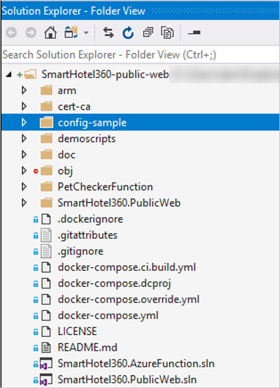

3. They make the configuration changes needed to the default setting.

    - When the web app starts up, it looks for the **SettingsUrl** app setting.
    - This variable must contain a URL to a configuration file.
    - By default, the setting used is a public endpoint.

4. They update the **/config-sample.json/sample.json** file. This is the configuration file for the web when using the public endpoint.

    - They edit both the **urls** and **pets_config** sections, with the values for the AKS API endpoints, storage accounts, and Cosmos database. 
    - The URLs should match the DNS name of the new web app that Contoso will create.
    - For Contoso, this is **smarthotelcontoso.eastus2.cloudapp.azure.com**.

    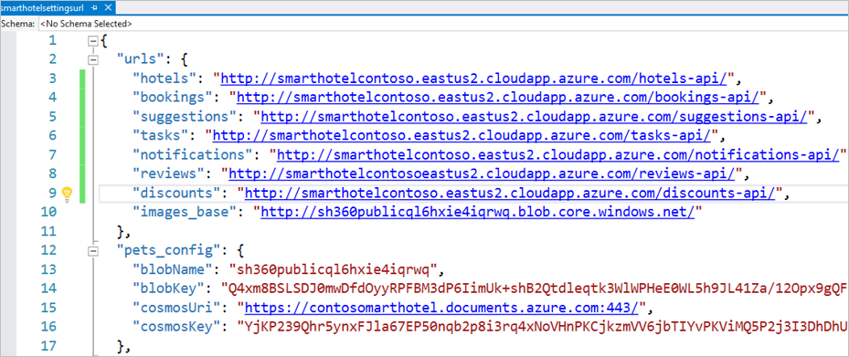

5. After the file is updated, they rename it to **smarthotelsettingsurl**, and upload it to the storage blob they created earlier.

     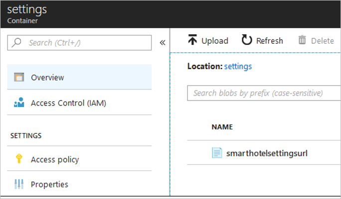

6. They click the file to get the URL. This URL is use by the app when it starts to pull down the configuration file.

    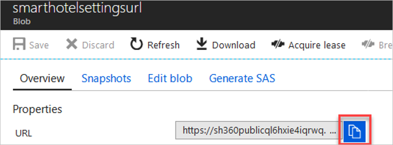

7. They update **SettingsUrl** in the **appsettings.Production.json** files, to the URL of the new file.

    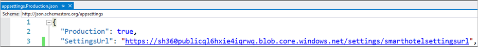


### Deploy the website to the Azure App Service

Now Contoso can publish their website.


1. They enable Application Insights monitoring in Visual Studio 2017. To do this, they select the **PublicWeb** project in Solution Explorer, and search for **Add Application Insights**. They register the app with the Application Insight instance that was created when they deployed the infrastructure.

    

2. In Visual Studio they connect the PublicWeb project to App Insights, and update to show it's configured.
 
    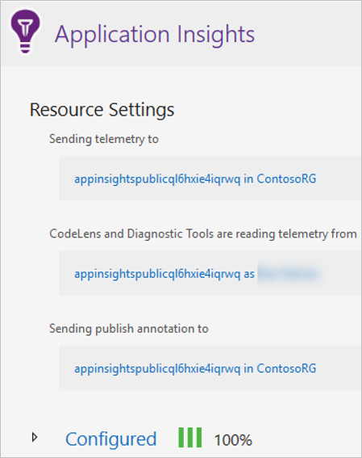

3. In Visual Studio, they create and publish their web app.

    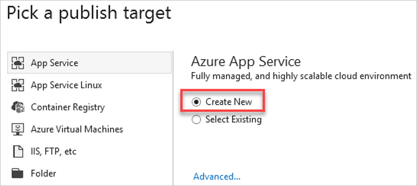

5. They specify an app name, and place it in the production resource group **ContosoRG**, in the main East US 2 region.

    

### Deploy the function to Azure

1. They use Visual Studio to create and publish the function. To do this, they right-click the **PetCheckerFunction** > **Publish**. Then they create a new App Service function.

     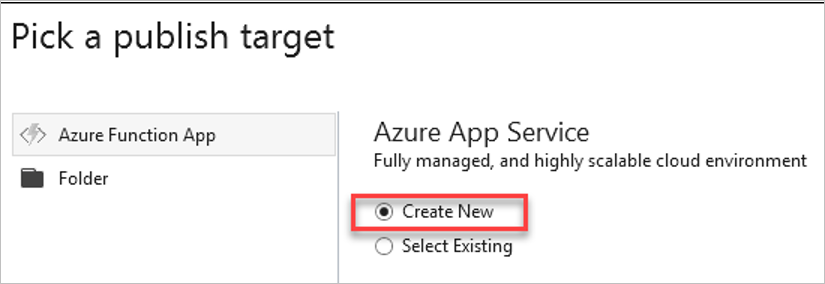

2. They specify the name **smarthotelpetchecker**, and place it in the ContosoRG resource group, and a new app service plan.

     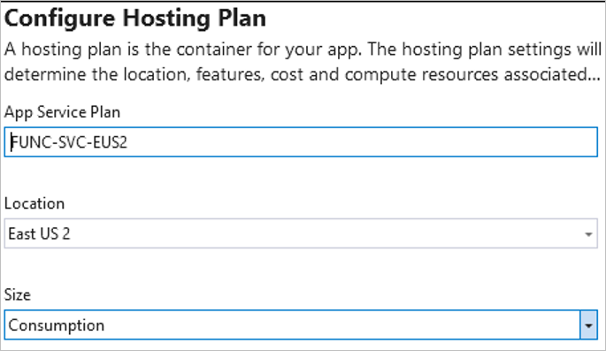

3. The select the storage account and create the function.

    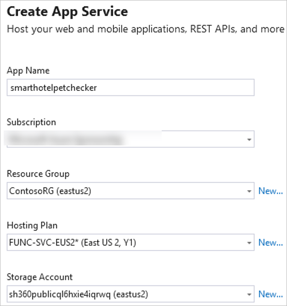

4. The deployment starts with provisioning the function app to Azure. In **Publish**, Contoso adds the app settings for storage, the Cosmos database, and the Computer Vision API.

    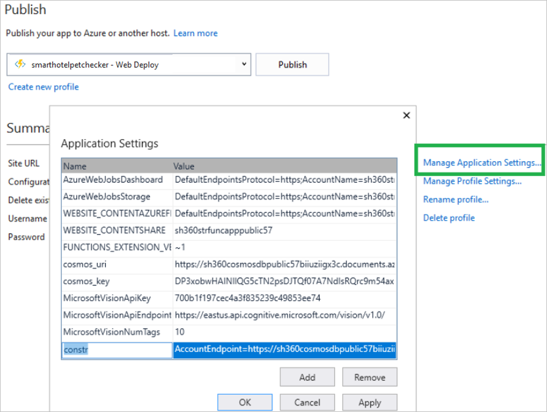

5. To run the function locally first, they update settings in **PetCheckerFunction/local.settings.json**.

    

6. After the function is deployed, it appears in the Azure portal, with the **Running** status.

    


7. They browse to the app to test that the Pet Checker AI is working as expected, at [http://smarthotel360public.azurewebsites.net/Pets](http://smarthotel360public.azurewebsites.net/Pets).
8. They click on the avatar to upload a picture.

    

9. The first photo they want to check is of a small dog.

    

10. The app returns a message of acceptance.

    


## Review the deployment

With the migrated resources in Azure, Contoso needs to fully operationalize and secure their new infrastructure.

### Security

- Contoso need to ensure that their new databases are secure. [Learn more](https://docs.microsoft.com/azure/sql-database/sql-database-security-overview).
- The app needs to be updated to use SSL with certificates. The container instance should be redeployed to answer on 443.
- They should consider using KeyVault to protect secrets for their Service Fabric apps. [Learn more](https://docs.microsoft.com/azure/service-fabric/service-fabric-application-secret-management).

### Backups and disaster recovery

- Contoso needs to review backup requirements for the Azure SQL Database. [Learn more](https://docs.microsoft.com/azure/sql-database/sql-database-automated-backups).
- They should consider implementing SQL failover groups to provide regional failover for the database. [Learn more](https://docs.microsoft.com/azure/sql-database/sql-database-geo-replication-overview).
- They can leverage geo-replication for the ACR premium SKU. [Learn more](https://docs.microsoft.com/azure/container-registry/container-registry-geo-replication)

### Licensing and cost optimization

- After all resources are deployed, Contoso should assign Azure tags based on their [infrastructure planning](contoso-migration-infrastructure.md#set-up-tagging).
- All licensing is built into the cost of the PaaS services that Contoso is consuming. This will be deducted from the EA.
- Contoso will enable Azure Cost Management licensed by Cloudyn, a Microsoft subsidiary. It's a multi-cloud cost management solution that helps you to utilize and manage Azure and other cloud resources.  [Learn more](https://docs.microsoft.com/azure/cost-management/overview) about Azure Cost Management.

## Conclusion

In this article, Contoso rebuild the SmartHotel app in Azure. They rebuilt the on-premises app front-end VM to Azure App Services Web apps. They built the app back end using microservices deployed to containers managed by Azure Kubernetes Service (AKS). They enhanced app functionality with a pet photo app.


