# Contoso migration: Rebuild an on-premises app to Azure

This article demonstrates how Contoso migrates and rebuilds the SmartHotel360 app in Azure. Contoso migrates the app's front end VM to Azure App Services Web apps. The app back end is built using microservices deployed to containers managed by Azure Kubernetes Service (AKS). The site interacts with Azure Functions to provide pet photo functionality. 

This document is one in a series of articles that show how the fictitious company Contoso migrates on-premises resources to the Microsoft Azure cloud. The series includes background information, and scenarios that illustrate setting up a migration infrastructure, assessing on-premises resources for migration, and running different types of migrations. Scenarios grow in complexity. We'll add additional articles over time.


**Article** | **Details** | **Status**
--- | --- | ---
[Article 1: Overview](contoso-migration-overview.md) | Provides an overview of Contoso's migration strategy, the article series, and the sample apps we use. | Available
[Article 2: Deploy an Azure infrastructure](contoso-migration-infrastructure.md) | Describes how Contoso prepares its on-premises and Azure infrastructure for migration. The same infrastructure is used for all migration articles. | Available
[Article 3: Assess on-premises resources](contoso-migration-assessment.md)  | Shows how Contoso runs an assessment of an on-premises two-tier SmartHotel360 app running on VMware. Contoso assesses app VMs with the [Azure Migrate](migrate-overview.md) service, and the app SQL Server database with the [Database Migration Assistant](https://docs.microsoft.com/sql/dma/dma-overview?view=sql-server-2017). | Available
[Article 4: Rehost an app on Azure VMs and a SQL Managed Instance](contoso-migration-rehost-vm-sql-managed-instance.md) | Demonstrates how Contoso runs a lift-and-shift migration to Azure for the SmartHotel360 app. Contoso migrates the app frontend VM using [Azure Site Recovery](https://docs.microsoft.com/azure/site-recovery/site-recovery-overview), and the app database to a SQL Managed Instance, using the [Azure Database Migration Service](https://docs.microsoft.com/azure/dms/dms-overview). | Available
[Article 5: Rehost an app on Azure VMs](contoso-migration-rehost-vm.md) | Shows how Contoso migrate the SmartHotel360 app VMs using Site Recovery only. | Available
[Article 6: Rehost an app to Azure VMs and SQL Server Always On Availability Group](contoso-migration-rehost-vm-sql-ag.md) | Shows how Contoso migrates the SmartHotel360 app. Contoso uses Site Recovery to migrate the app VMs, and the Database Migration service to migrate the app database to a SQL Server cluster protected by an AlwaysOn availability group. | Available
[Article 7: Rehost a Linux app on Azure VMs](contoso-migration-rehost-linux-vm.md) | Shows how Contoso does a lift-and-shift migration of the Linux osTicket app to Azure VMs, using Site Recovery | Available
[Article 8: Rehost a Linux app on Azure VMs and Azure MySQL Server](contoso-migration-rehost-linux-vm-mysql.md) | Demonstrates how Contoso migrates the Linux osTicket app to Azure VMs using Site Recovery, and migrates the app database to an Azure MySQL Server instance using MySQL Workbench. | Available
[Article 9: Refactor an app on Azure Web Apps and Azure SQL database](contoso-migration-refactor-web-app-sql.md) | Demonstrates how Contoso migrates the SmartHotel360 app to an Azure Web App, and migrates the app database to Azure SQL Server instance | Available
[Article 10: Refactor a Linux app to Azure Web Apps and Azure MySQL](contoso-migration-refactor-linux-app-service-mysql.md) | Shows how Contoso migrates the Linux osTicket app to Azure Web Apps in multiple sites, integrated with GitHub for continuous delivery. They migrate the app database to an Azure MySQL instance. | Available
[Article 11: Refactor TFS on Azure DevOps Services](contoso-migration-tfs-vsts.md) | Shows how Contoso migrates the on-premises Team Foundation Server (TFS) deployment by migrating it to Azure DevOps Services in Azure. | Available
[Article 12: Rearchitect an app to Azure containers and SQL Database](contoso-migration-rearchitect-container-sql.md) | Shows how Contoso migrates and rearchitects their SmartHotel app to Azure. They rearchitect the app web tier as a Windows container, and the app database in an Azure SQL Database. | Available
Article 13: Rebuild an app to Azure | Shows how Contoso rebuild their SmartHotel app using a range of Azure capabilities and services, including App Services, Azure Kubernetes, Azure Functions, Cognitive services, and Cosmos DB. | This article
[Article 14: Scale a migration to Azure](contoso-migration-scale.md) | After trying out migration combinations, Contoso prepares to scale to a full migration to Azure. | Available

In this article, Contoso migrates the two-tier Windows. NET SmartHotel360 app running on VMware VMs to Azure. If you'd like to use this app, it's provided as open source and you can download it from [GitHub](https://github.com/Microsoft/SmartHotel360).

## Business drivers

The IT leadership team has worked closely with business partners to understand what they want to achieve with this migration:

- **Address business growth**: Contoso is growing, and wants to provide differentiated experiences for customers on Contoso websites.
- **Agility**: Contoso must be able to react faster than the changes in the marketplace, to enable the success in a global economy. 
- **Scale**: As the business grows successfully, the Contoso IT team must provide systems that are able to grow at the same pace.
- **Costs**: Contoso wants to minimize licensing costs.

## Migration goals

The Contoso cloud team has pinned down app requirements for this migration. These requirements were used to determine the best migration method:
 - The app in Azure will remain as critical as it is today. It should perform well and scale easily.
 - The app shouldn't use IaaS components. Everything should be built to use PaaS or serverless services.
 - The app builds should run in cloud services, and containers should reside in a private Enterprise-wide container registry in the cloud.
 - The API service used for pet photos should be accurate and reliable in the real world, since decisions made by the app must be honored in their hotels. Any pet granted access is allowed to stay at the hotels.
 - To meet requirements for a DevOps pipeline, Contoso will use Azure DevOps for Source Code Management (SCM), with Git Repos.  Automated builds and releases will be used to build code, and deploy it to the Azure Web Apps, Azure Functions and AKS.
 - Different CI/CD pipelines are needed for microservices on the backend, and for the web site on the frontend.
 - The backend services have a different release cycle from the frontend web app.  To meet this requirement, they will deploy two different DevOps pipelines.
 - Contoso needs management approval for all front end website deployment, and the CI/CD pipeline must provide this.


## Solution design

After pinning down goals and requirements, Contoso designs and review a deployment solution, and identifies the migration process, including the Azure services that will be used for the migration.

### Current app

- The SmartHotel360 on-premises app is tiered across two VMs (WEBVM and SQLVM).
- The VMs are located on VMware ESXi host **contosohost1.contoso.com** (version 6.5)
- The VMware environment is managed by vCenter Server 6.5 (**vcenter.contoso.com**), running on a VM.
- Contoso has an on-premises datacenter (contoso-datacenter), with an on-premises domain controller (**contosodc1**).
- The on-premises VMs in the Contoso datacenter will be decommissioned after the migration is done.


### Proposed architecture

- The frontend of the app is deployed as an Azure App Services Web app, in the primary Azure region.
- An Azure function provides uploads of pet photos, and the site interacts with this functionality.
- The pet photo function leverages Cognitive Services Vision API, and CosmosDB.
- The back end of the site is built using microservices. These will be deployed to containers managed on the Azure Kubernetes service (AKS).
- Containers will be built using Azure DevOps, and pushed to the Azure Container Registry (ACR).
- For now, Contoso will manually deploy the Web app and function code using Visual Studio
- Microservices will be deployed using a PowerShell script that calls Kubernetes command-line tools.

    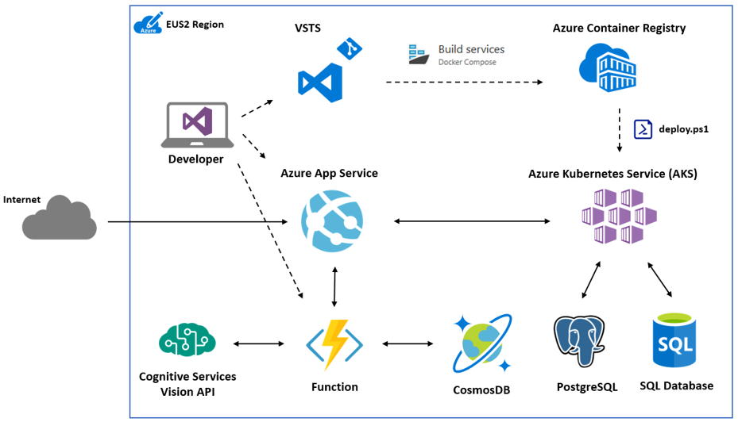 

  
### Solution review

Contoso evaluates the proposed design by putting together a pros and cons list.

**Consideration** | **Details**
--- | ---
**Pros** | Using PaaS and serverless solutions for the end-to-end deployment significantly reduces management time that Contoso must provide.<br/><br/> Moving to a microservice architecture allows Contoso to easily extend the solution over time.<br/><br/> New functionality can be brought online without disrupting any of the existing solutions code bases.<br/><br/> The Web App will be configured with multiple instances with no single point of failure.<br/><br/> Autoscaling will be enabled so that the app can handle differing traffic volumes.<br/><br/> With the move to PaaS services Contoso can retire out-of-date solutions running on Windows Server 2008 R2 operating system.<br/><br/> CosmosDB has built-in fault tolerance, which requires no configuration by Contoso. This means that the data tier is no longer a single point of failover.
**Cons** | Containers are more complex than other migration options. The learning curve could be an issue for Contoso.  They introduce a new level of complexity that provides a lot of value in spite of the curve.<br/><br/> The operations team at Contoso needs to ramp up to understand and support Azure, containers and microservices for the app.<br/><br/> Contoso hasn't fully implemented DevOps for the entire solution. Contoso needs to think about that for the deployment of services to AKS, functions, and App Services.


### Migration process

1. Contoso provision the ACR, AKS, and CosmosDB.
2. They provision the infrastructure for the deployment, including the Azure Web App, storage account, function, and API. 
3. After the infrastructure is in place, they'll build their microservices container images using Azure DevOps, which pushes them to the ACR.
4. Contoso will deploy these microservices to ASK using a PowerShell script.
5. Finally, they'll deploy the Azure function and Web App.

    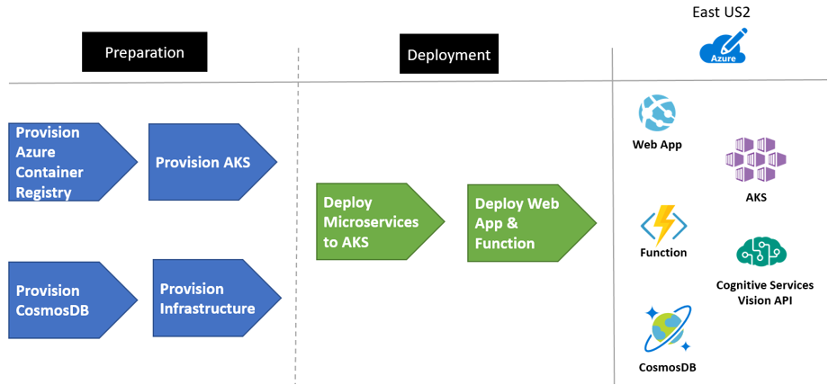 

### Azure services

**Service** | **Description** | **Cost**
--- | --- | ---
[AKS](https://docs.microsoft.com/sql/dma/dma-overview?view=ssdt-18vs2017) | Simplifies Kubernetes management, deployment, and operations. Provides a fully managed Kubernetes container orchestration service.  | AKS is a free service.  Pay for only the virtual machines, and associated storage and networking resources consumed. [Learn more](https://azure.microsoft.com/pricing/details/kubernetes-service/).
[Azure Functions](https://azure.microsoft.com/services/functions/) | Accelerates development with an event-driven, serverless compute experience. Scale on demand.  | Pay only for consumed resources. Plan is billed based on per-second resource consumption and executions. [Learn more](https://azure.microsoft.com/pricing/details/functions/).
[Azure Container Registry](https://azure.microsoft.com/services/container-registry/) | Stores images for all types of container deployments. | Cost based on features, storage, and usage duration. [Learn more](https://azure.microsoft.com/pricing/details/container-registry/).
[Azure App Service](https://azure.microsoft.com/services/app-service/containers/) | Quickly build, deploy, and scale enterprise-grade web, mobile, and API apps running on any platform. | App Service plans are billed on a per second basis. [Learn more](https://azure.microsoft.com/pricing/details/app-service/windows/).

## Prerequisites

Here's what Contoso needs for this scenario:

**Requirements** | **Details**
--- | ---
**Azure subscription** | Contoso created subscriptions during an earlier article. If you don't have an Azure subscription, create a [free account](https://azure.microsoft.com/pricing/free-trial/).<br/><br/> If you create a free account, you're the administrator of your subscription and can perform all actions.<br/><br/> If you use an existing subscription and you're not the administrator, you need to work with the admin to assign you Owner or Contributor permissions.
**Azure infrastructure** | [Learn how](contoso-migration-infrastructure.md) Contoso set up an Azure infrastructure.
**Developer prerequisites** | Contoso needs the following tools on a developer workstation:<br/><br/> - [Visual Studio 2017 Community Edition: Version 15.5](https://www.visualstudio.com/)<br/><br/> .NET workload enabled.<br/><br/> [Git](https://git-scm.com/)<br/><br/> [Azure PowerShell](https://azure.microsoft.com/downloads/)<br/><br/> [Azure CLI](https://docs.microsoft.com/cli/azure/install-azure-cli?view=azure-cli-latest)<br/><br/> [Docker CE (Windows 10) or Docker EE (Windows Server)](https://docs.docker.com/docker-for-windows/install/) set to use Windows Containers.


## Scenario steps

Here's how Contoso will run the migration:

> [!div class="checklist"]
> * **Step 1: Provision AKS and ACR**: Contoso provisions the managed AKS cluster and Azure container registry using PowerShell
> * **Step 2: Build Docker containers**: They set up CI for Docker containers using Azure DevOps, and push them to the ACR.
> * **Step 3: Deploy back-end microservices**: They deploy the rest of the infrastructure that will be leveraged by back-end microservices.
> * **Step 4: Deploy front-end infrastructure**: They deploy the front-end infrastructure, inlcuding blob storage for the pet phones, the Cosmos DB, and Vision API.
> * **Step 5: Migrate the back end**: They deploy microservices and run on AKS, to migrate the back end.
> * **Step 6: Publish the front end**: They publish the SmartHotel360 app to the Azure App service, and the Function App that will be called by the pet service.


## Step 1: Provision back-end resources

Contoso admins run a deployment script to create the managed Kubernetes cluster using AKS and the Azure Container Registry (ACR).

- The instructions for this section use the **SmartHotel360-Azure-backend** repository.
- The **SmartHotel360-Azure-backend** GitHub repo contains all of the software for this part of the deployment.

### Prerequisites

1. Before they start, Contoso admins ensure that all prerequisitie software in installed on the dev machine they're using for the deployment.
2. They clone the repo local to the dev machine using Git: **git clone https://github.com/Microsoft/SmartHotel360-Azure-backend.git**


### Provision AKS and ACR

The Contoso admins provision as follows:

1.	They open the folder using Visual Studio Code, and moves to the **/deploy/k8s** directory, which contains the script **gen-aks-env.ps1**.
2. They run the script to create the managed Kubernetes cluster, using AKS and ACR.

    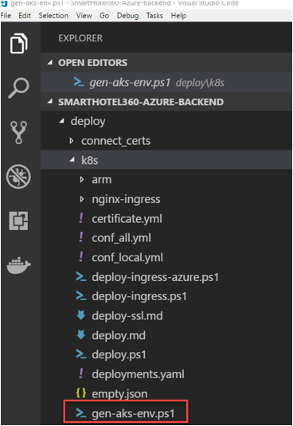
 
3.	With the file open, they update the $location parameter to **eastus2**, and save the file.

    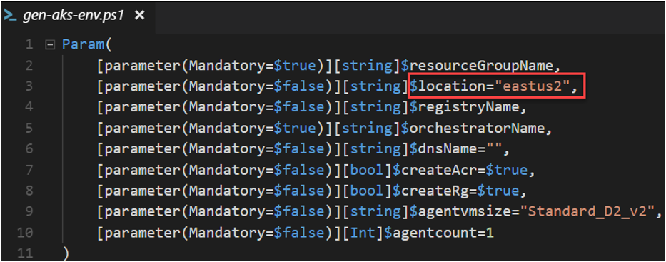

4. They click **View** > **Integrated Terminal** to open the integrated terminal in Code.

    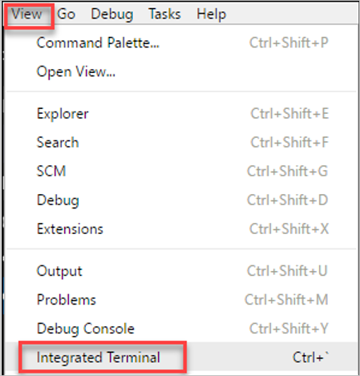

5. In the PowerShell Integrated terminal, they sign into Azure using the Connect-AzureRmAccount command. [Learn more](https://docs.microsoft.com/powershell/azure/get-started-azureps) about getting started with PowerShell.

    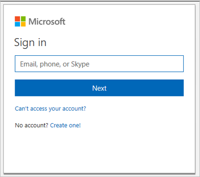

6. They authenticate Azure CLI by running the **az login** command, and following the instructions to authenticate using their web browser. [Learn more](https://docs.microsoft.com/cli/azure/authenticate-azure-cli?view=azure-cli-latest) about logging in with Azure CLI.

    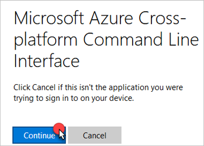

7. They run the following command, passing the resource group name of ContosoRG, the name of the AKS cluster smarthotel-aks-eus2, and the new registry name.

    ```
    .\gen-aks-env.ps1  -resourceGroupName ContosoRg -orchestratorName smarthotelakseus2 -registryName smarthotelacreus2
    ```
    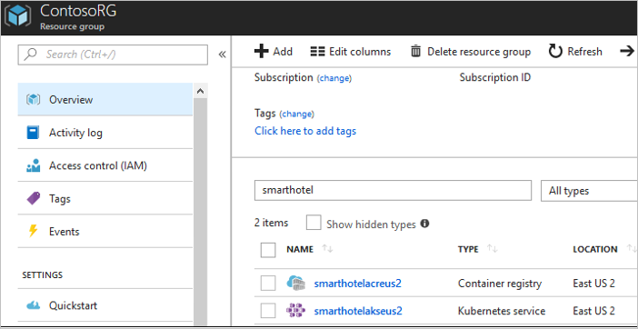

8. Azure creates another resource group, containing the resources for the AKS cluster.

    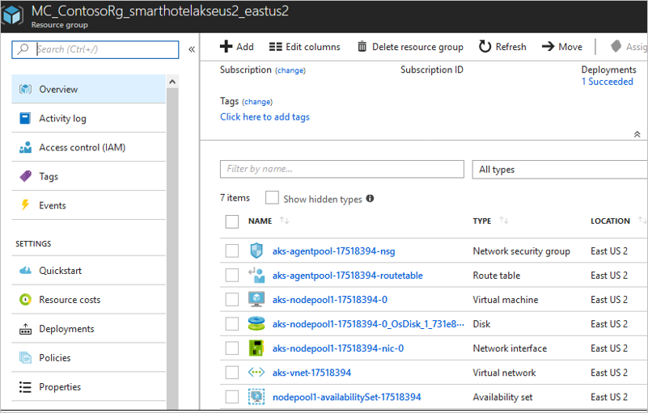

9. After the deployment is finished, they install the **kubectl** command-line tool. The tool is already installed on the Azure CloudShell.

    **az aks install-cli**

10. They verify the connection to the cluster by running the **kubectl get nodes** command. The node is the same name as the VM in the automatically created resource group.

    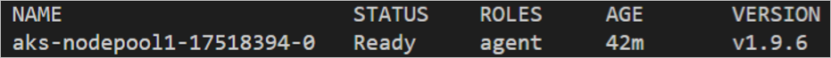

11. They run  the following command to start the Kubernetes Dashboard: 

    **az aks browse --resource-group ContosoRG --name smarthotelakseus2**

12. A browser tab opens to the Dashboard. This is a tunneled connection using the Azure CLI. 

    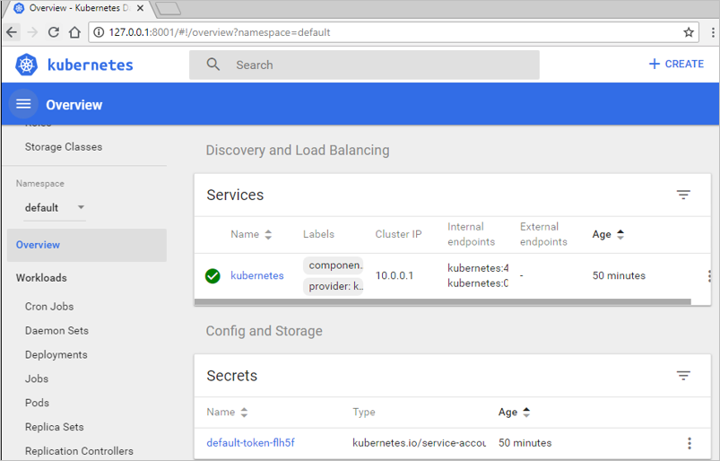


## Step 2: Configure the back-end pipeline

### Create an Azure DevOps project and build

Contoso creates an Azure DevOps project, and configures a CI Build to create the container and then pushes it to the ACR. The instructions in this section use the [SmartHotel360-Azure-Backend](https://github.com/Microsoft/SmartHotel360-Azure-backend) repository.r

1. From visualstudio.com, they create a new organization (**contosodevops360.visualstudio.com**), and configure it to use Git.

2. They create a new project (**SmartHotelBackend**) using Git for version control, and Agile for the workflow.

    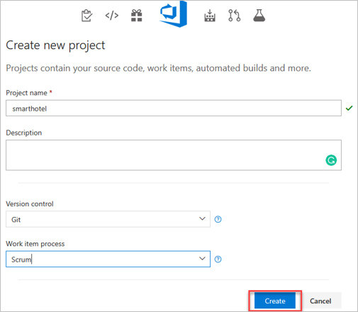 


3. They import the [GitHub repo](https://github.com/Microsoft/SmartHotel360-Azure-backend.git).

    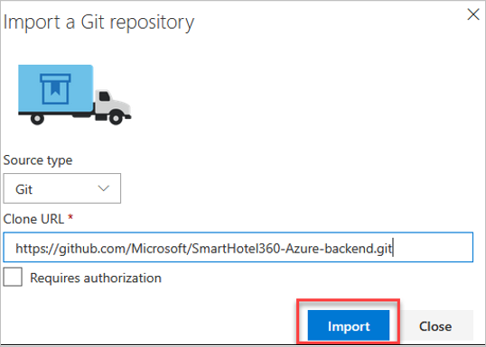
    
4. In **Pipelines**, they click **Build**, and create a new pipeline using Azure Repos Git as a source, from the repository. 

    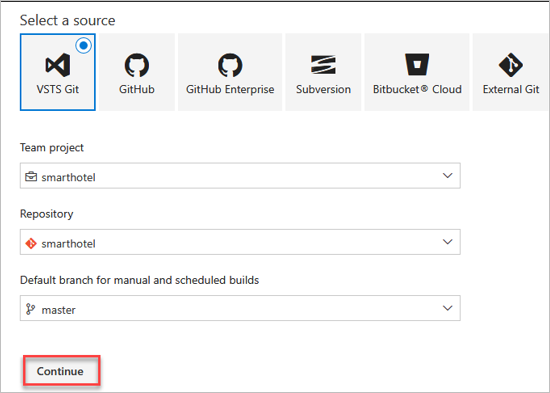

6. They select to start with an empty job.

    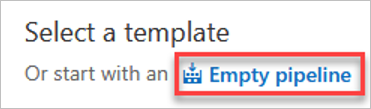  

7. They select **Hosted Linux Preview** for the build pipeline.

     
 
8. In **Phase 1**, they add a **Docker Compose** task. This task builds the Docker compose.

    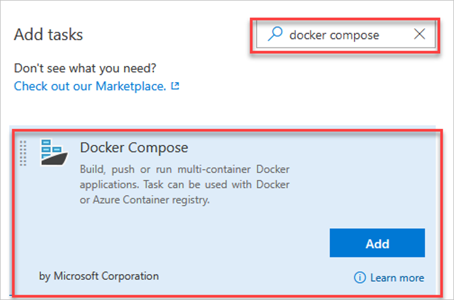 

9. They repeat and add another **Docker Compose** task. This one pushes the containers to ACR.

     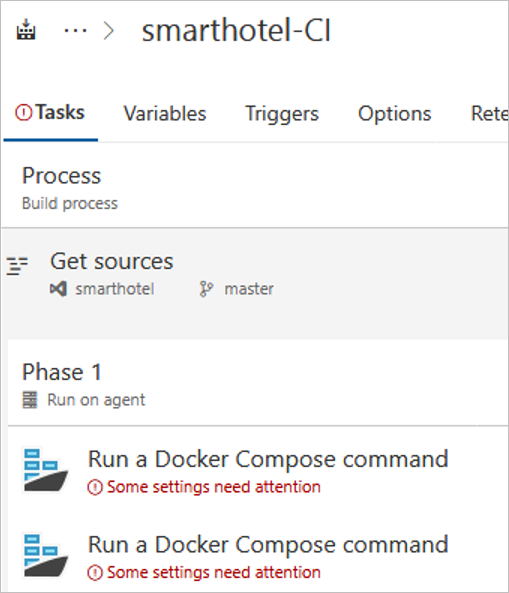 

8. They select the first task (to build), and configure the build with the Azure subscription, authorization, and the ACR. 

    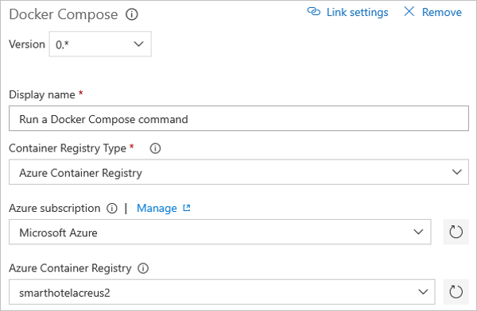

9. They specify the path of the **docker-compose.yaml** file, in the **src** folder of the repo. They select to build service images and include the latest tag. When the action changes to **Build service images**, the name of the Azure DevOps task changes to **Build services automatically**

    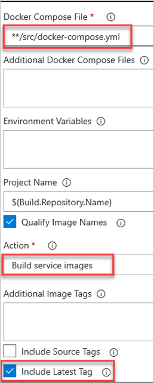

10. Now, they configure the second Docker task (to push). They select the subscription and the **smarthotelacreus2** ACR. 

    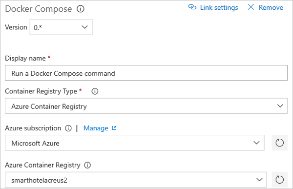

11. Again, they enter the file to the docker-compose.yaml file, and select **Push service images** and include the latest tag. When the action changes to **Push service images**, the name of the Azure DevOps task changes to **Push services automatically**

    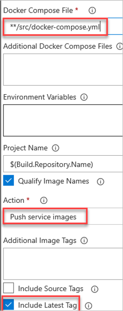

12. With the Azure DevOps tasks configured, Contoso saves the build pipeline, and starts the build process.

    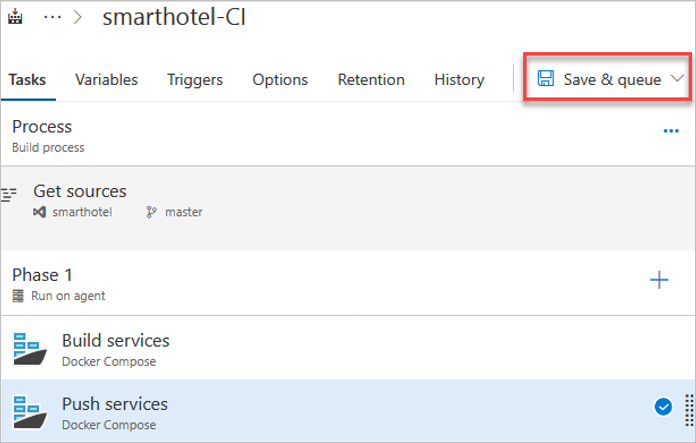

13. They click on the build job to check progress.

    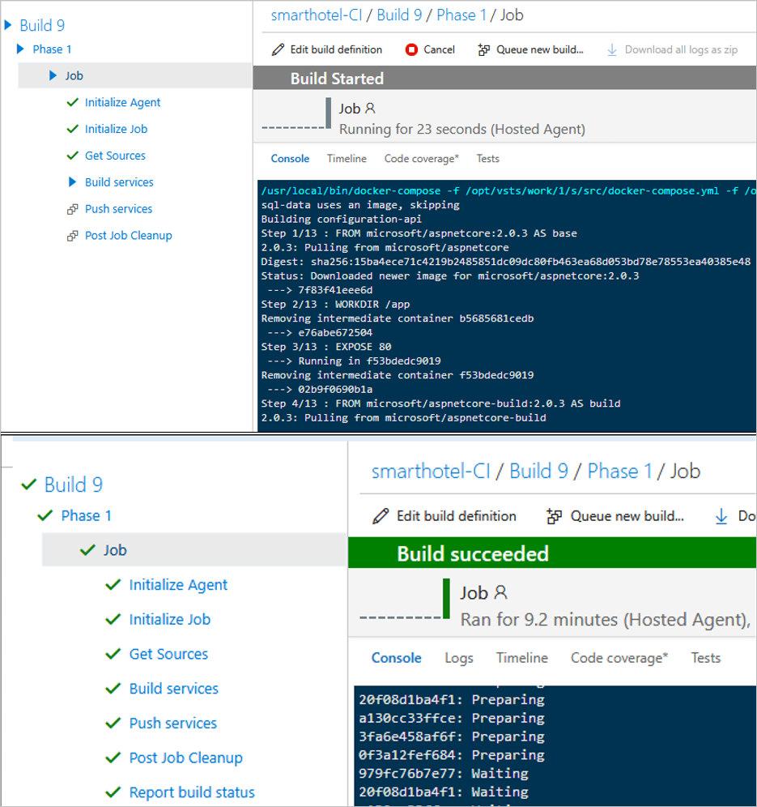

14. After the build finishes, the ACR shows the new repos, which are populated with the containers used by the microservices.

    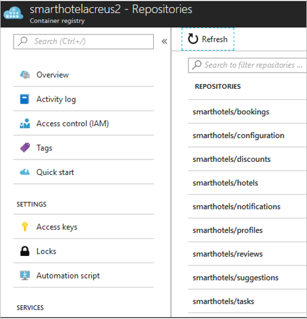


### Deploy the back-end infrastructure

With the AKS cluster created and the Docker images built, Contoso admins now deploy the rest of the infrastructure that will be leveraged by back-end microservices.

- Instructions in the section use the [SmartHotel360-Azure-Backend](https://github.com/Microsoft/SmartHotel360-Azure-backend) repo.
- In the **/deploy/k8s/arm** folder, there's a single script to create all items. 

They deploy as follows:

1. They open a developer command prompt, and use the command az login for the Azure subscription.
2. They use the deploy.cmd file to deploy the Azure resources in the ContosoRG resource group and EUS2 region, by typing the following command:

    **.\deploy.cmd azuredeploy ContosoRG -c eastus2**

    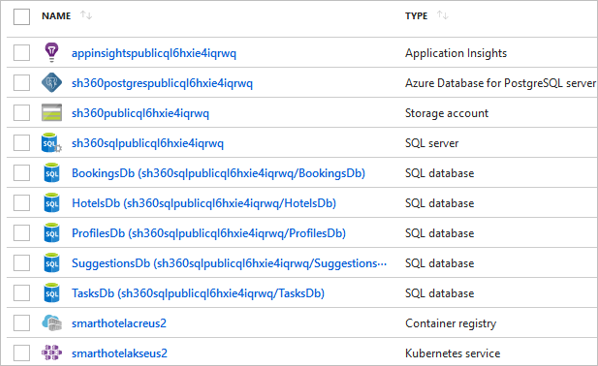

2. In the Azure portal, they capture the connection string for each database, to be used later.

    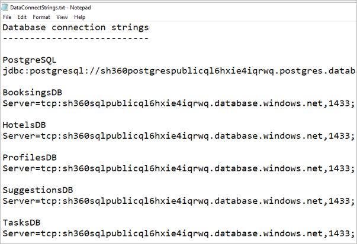

### Create the back-end release pipeline

Now, Contoso admins do the following:

- Deploy the NGINX ingress controller to allow inbound traffic to the services.
- Deploy the microservices to the AKS cluster.
- As a first step they update the connection strings to the microservices using Azure DevOps. They then configure a new Azure DevOps Release pipeline to deploy the microservices.
- The instructions in this section use the [SmartHotel360-Azure-Backend](https://github.com/Microsoft/SmartHotel360-Azure-backend) repo.
- Note that Some of the configuration settings (for example Active Directory B2C) aren’t covered in this article. Read more information about these settings in the repo.

They create the pipeline:

1. Using Visual Studio they update the **/deploy/k8s/config_local.yml** file with the database connection information they noted earlier.

    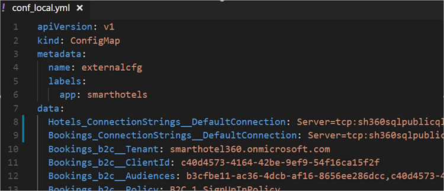

2. They open Azure DevOps, and in the SmartHotel360 project, in **Releases**, they click **+New Pipeline**.

    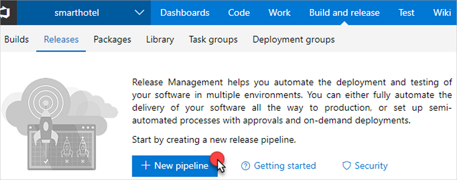

3. They click **Empty Job** to start the pipeline without a template.
4. They provide the stage and pipeline names.

      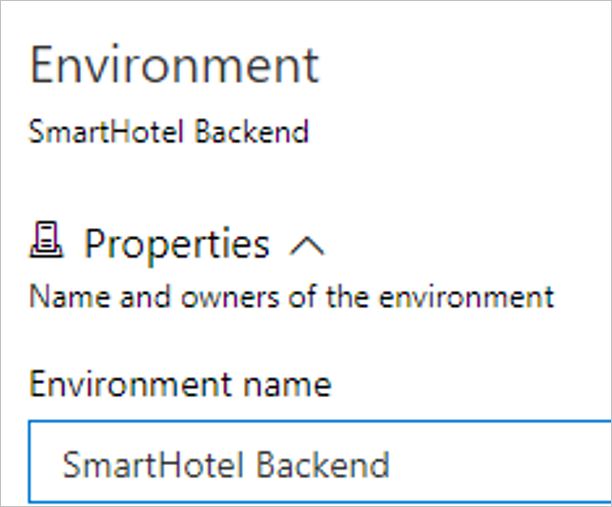

      

5. They add an artifact.

     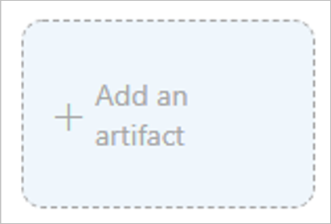

6. They select **Git** as the source type, and specify the project, source, and master branch for the SmartHotel360 app.

    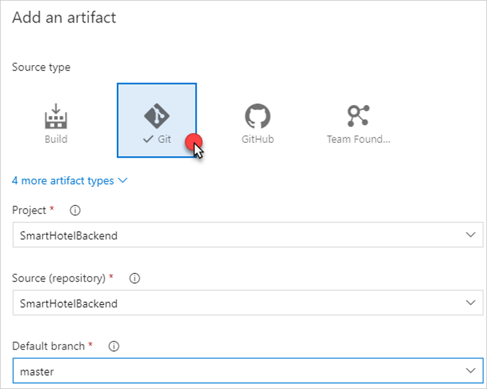

7. They click the task link.

    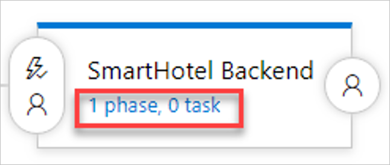

8. They add a new Azure PowerShell task so that they can run a PowerShell script in an Azure environment.

    

9. They select the Azure subscription for the task, and select the **deploy.ps1** script from the Git repo.

    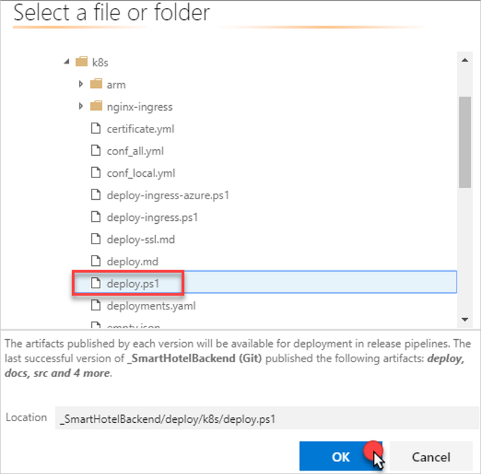


10. They add arguments to the script. the script will delete all cluster content (except **ingress** and **ingress controller**), and deploy the microservices.

    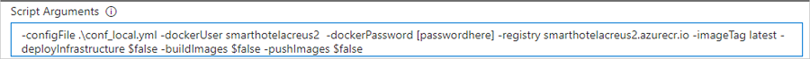

11. They set the preferred Azure PowerShell version to the latest, and save the pipeline.
12. They move back to the **Release** page, and manually create a new release.

    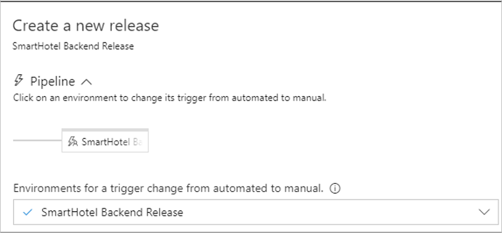

13. They click the release after creating it, and in **Actions**, they click **Deploy**.

      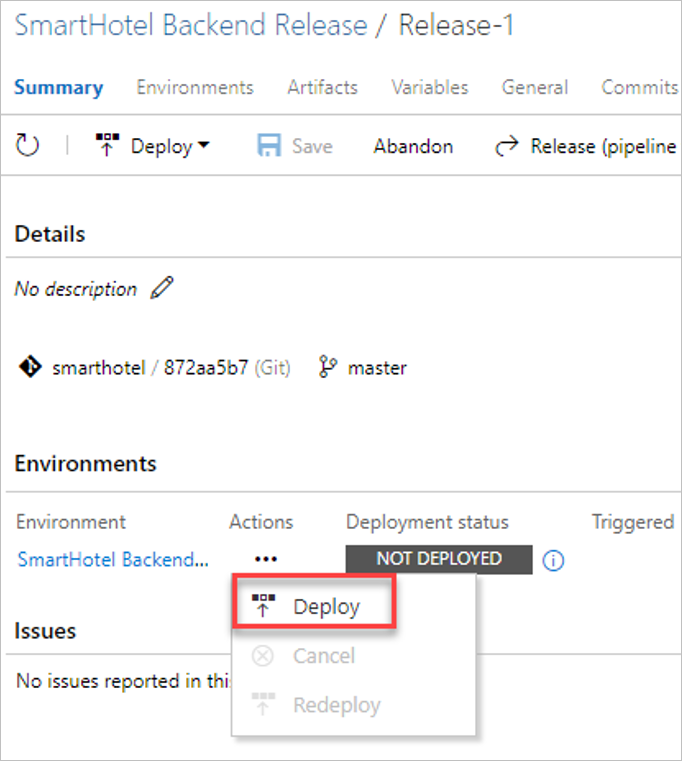  

14. When the deployment is complete, they run the following command to check the status of services, using the Azure Cloud Shell: **kubectl get services**.


## Step 3: Provision front-end services

Contoso admins need to deploy the infrastructure that will be used by the front end apps. They create a blob storage container for storing the pet images; the Cosmos database to store documents with the pet information; and the Vision API for the website. 

Instructions for this section use the [SmartHotel360-public-web](https://github.com/Microsoft/SmartHotel360-public-web) repo.

### Create blob storage containers

1.	In Azure portal, they open the storage account that was created, and clicks **Blobs**.
2.	They create a new container (**Pets**) with the public access level set to container. Users will upload their pet photos to this container.

    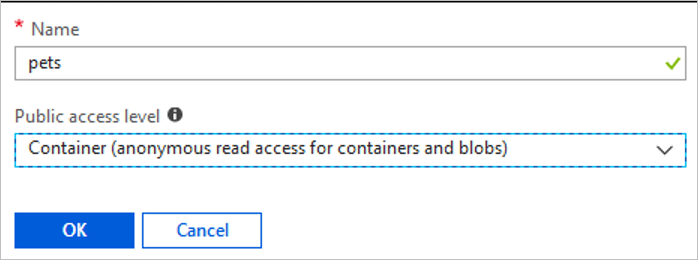

3. They create a second new container named **settings**. A file with all the front end app settings will be placed in this container.

    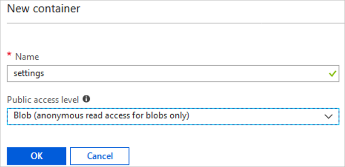

4. They capture the access details for the storage account in a text file, for future reference.

    

### Provision a Cosmos database

Contoso admins provision a Cosmos database to be used for pet information.

1. They create an **Azure Cosmos DB** in the Azure Marketplace.

    

2. They specify a name (**contosomarthotel**), select the SQL API, and place it in the production resource group ContosoRG, in the main East US 2 region.

    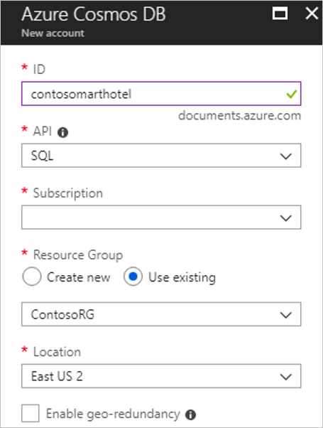

3. They add a new collection to the database, with default capacity and throughput.

    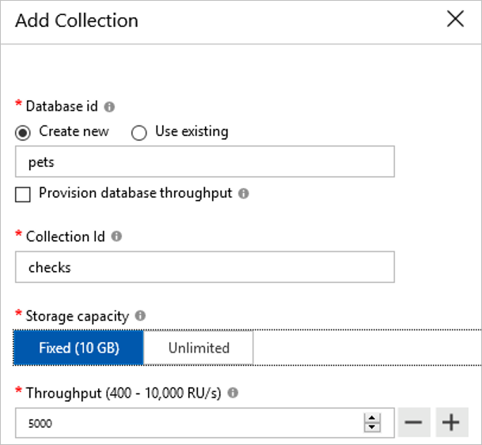


4. They note the connection information for the database, for future reference. 

    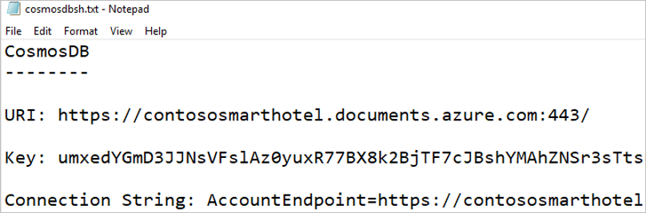


### Provision Computer Vision

Contoso admins provision the Computer Vision API. The API will be called by the function, to evaluate pictures uploaded by users.

1. They create a **Computer Vision** instance in the Azure Marketplace.

     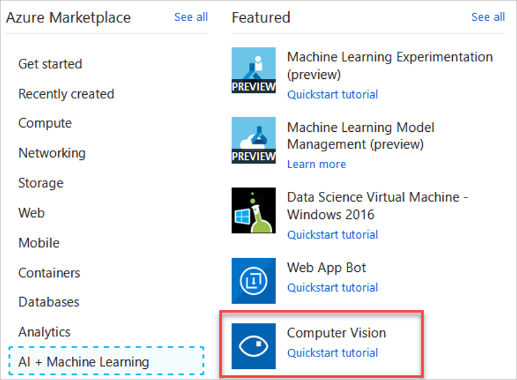

2. They provision the API (**smarthotelpets**) in the production resource group ContosoRG, in the main East US 2 region.

    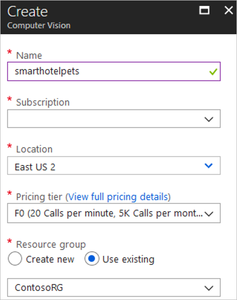

3. They save the connection settings for the API to a text file for later reference.

     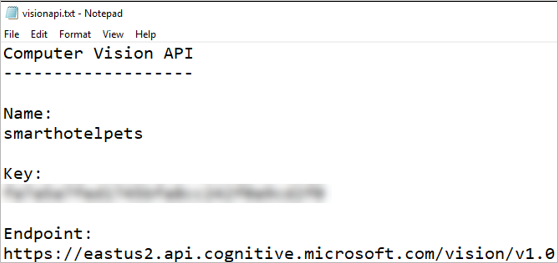


### Provision the Azure Web App

Contoso admins provision the web app using the Azure portal.


1. They select **Web App** in the portal.

    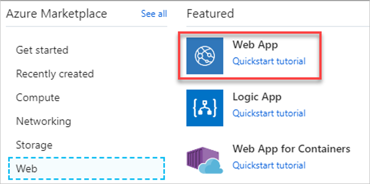

2. They provide an app name (**smarthotelcontoso**), run it on Windows, and place it in the production resources group **ContosoRG**. They create a new Application Insights instance for app monitoring..

    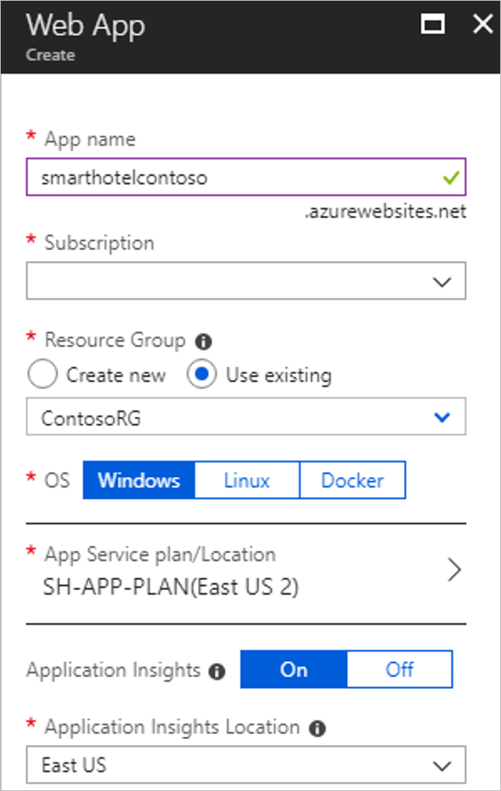

3. After they're done, they browse to the address of the app to check it's been created successfully.

4. Now, in the Azure portal they create a staging slot for the code. the pipeline will deploy to this slot. This ensures that code isn't put into production until admins perform a release.

    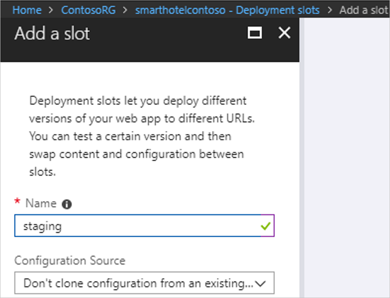


### Provision the Azure function app

In the Azure portal, Contoso admins provision the Function App.

1. They select **Function App**.

    

2. They provide an app name (**smarthotelpetchecker**). They place the app in the production resource group **ContosoRG**.They set the hosting place to **Consumption Plan**, and place the app in the East US 2 region. A new storage account is created, along with an Application Insights instance for monitoring.

    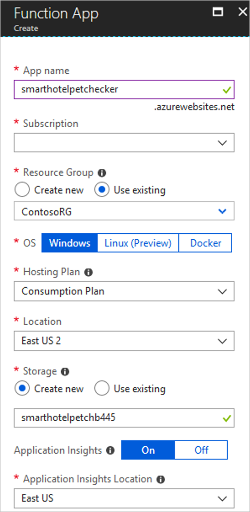


3. After the app is deployed, they browse to the app address to check it's been created successfully.


## Step 4: Set up the front-end pipeline

Contoso admins create two different projects for the front-end site. 

1. In Azure DevOps, they create a project **SmartHotelFrontend**.

    

2. They import the [SmartHotel360 front-end](https://github.com/Microsoft/SmartHotel360-public-web.git) Git repo into the new project.
3. For the Function App, they create another Azure DevOps project (SmartHotelPetChecker), and import the [PetChecker](https://github.com/Microsoft/SmartHotel360-PetCheckerFunction ) Git repo into this project.

### Configure the Web App

Now Contoso admins configure the Web App to use Contoso resources.

1. They connect to the Azure DevOps project, and clone the repo locally to the dev machine.
2. In Visual Studio, they open the folder to show all the files in the repo.

    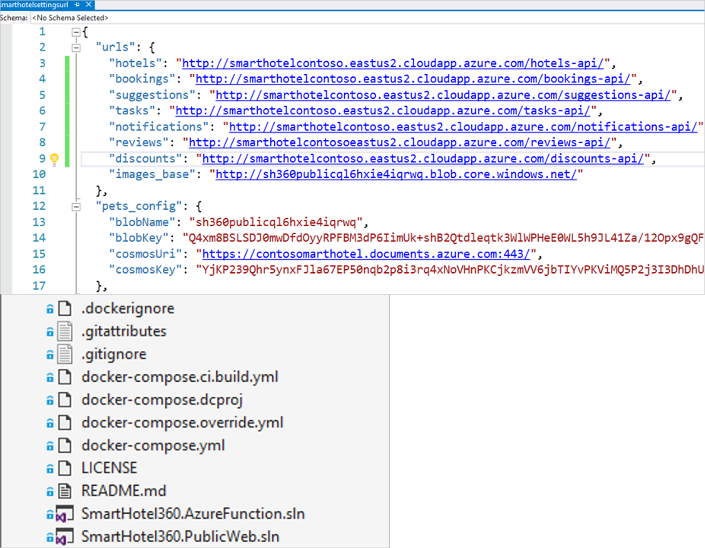

3. They update the configuration changes as required.

    - When the web app starts up, it looks for the **SettingsUrl** app setting.
    - This variable must contain a URL pointing to a configuration file.
    - By default, the setting used is a public endpoint.

4.	They update the /config-sample.json/sample.json file.

    - This is the configuration file for the web when using the public endpoint.
    - They edit the **urls** and **pets_config** sections with the values for the AKS API endpoints, storage accounts, and Cosmos database.
    - The URLs should match the DNS name of the new web app that Contoso will create.
    - For Contoso, this is **smarthotelcontoso.eastus2.cloudapp.azure.com**.

    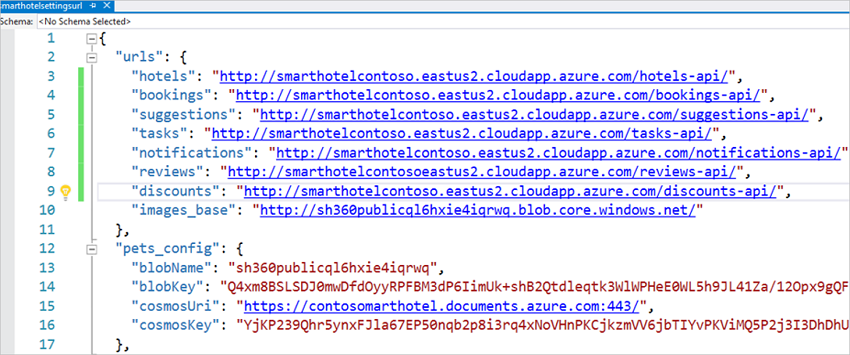

5. After the file is updated, they rename it **smarthotelsettingsurl**, and upload it to the storage blog they created earlier.

    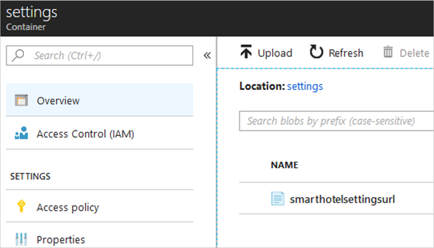

6. They click the file to get the URL. The URL is used by the app when it pulls down the configuration files.

    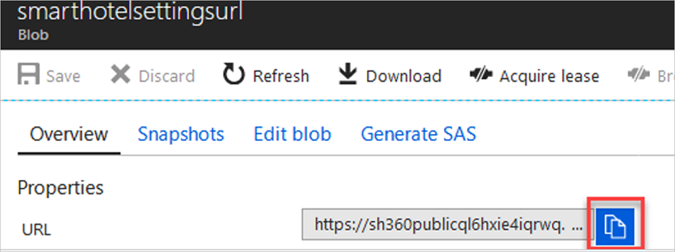

7. In the **appsettings.Production.json** file, they update the **SettingsURL** to the URL of the new file.

    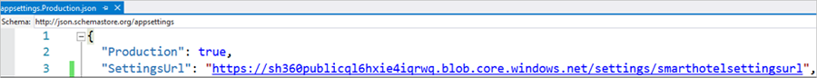

### Deploy the website to the Azure App Service

Contoso admins can now publish the website.


1. They open Azure DevOps, and in the **SmartHotelFrontend** project, in **Builds and Releases**, they click **+New Pipeline**.
2. They select **Azure DevOps Git** as a source.
3. They select the **ASP.NET Core** template.
4. They review the pipeline, and check that **Publish Web Projects** and **Zip Published Projects** are selected.

    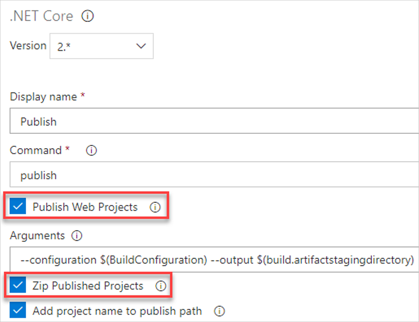

5. In **Triggers**, they enable continuous integration, and add the master branch. This ensures that each time the solution has new code committed to the master branch, the build pipeline starts.

    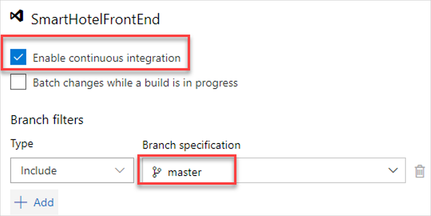

6. They click **Save & queue** to start a build.
7. After the build completes, they configure a release pipeline using the **Azure App Service Deployment**.
8. They provide a Stage name **Staging**.

    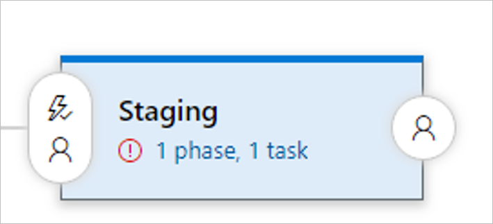

9. They add an artifact and select the build they just configured.

     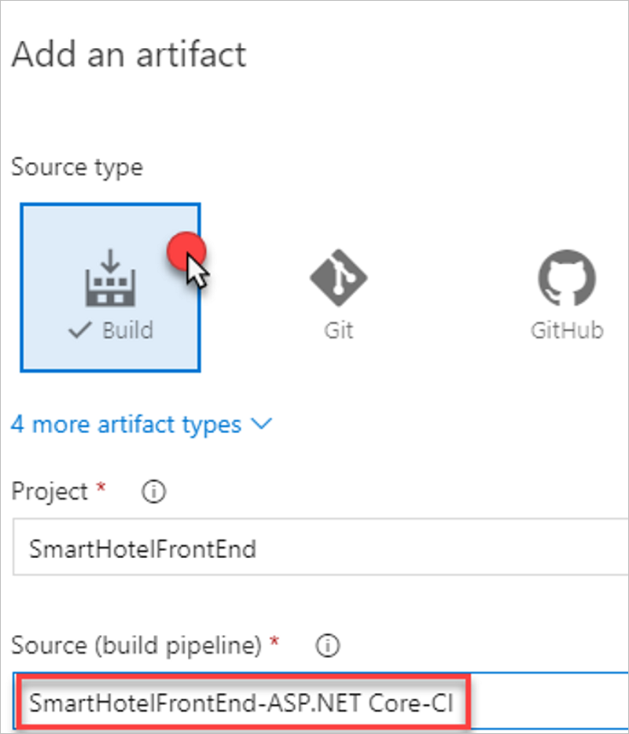

10. They click the lightning bolt icon on the artifact, and enable continuous deployment.

    
11. In **Environment**, they click **1 job, 1 task** under **Staging**.
12. After selecting the subscription, and app name, they open the **Deploy Azure App Service** task. The deployment is configured to use the **staging** deployment slot. This automatically builds code for review and approval in this slot.

     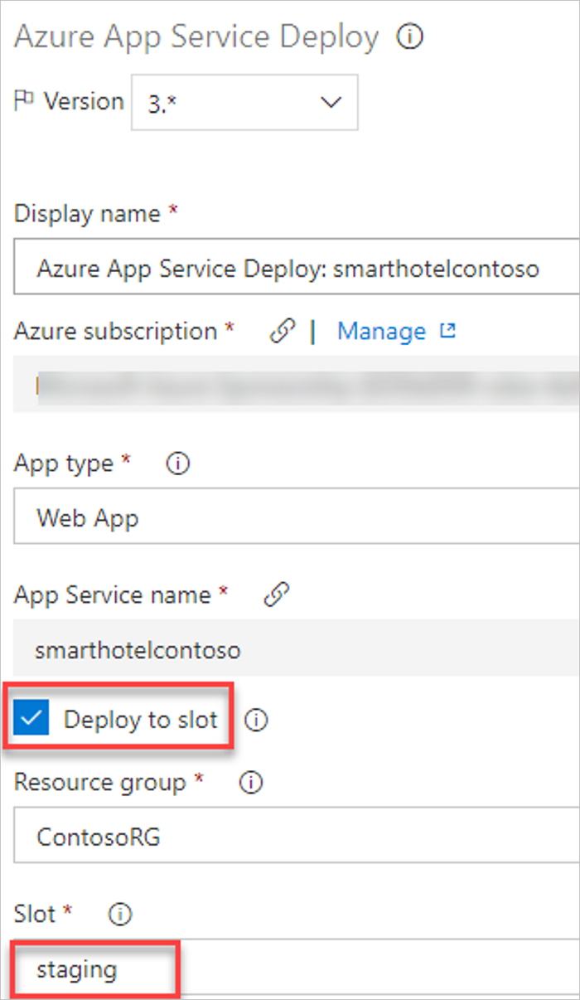

13. In the **Pipeline**, they add a new stage.

    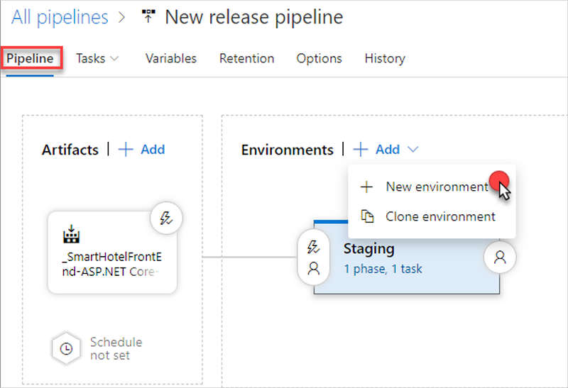

14. They select **Azure App Service deployment with slot**, and name the enviroment **Prod**.
15. They click on **1 job, 2 tasks**, and select the subscription, app service name, and the **staging** slot.

    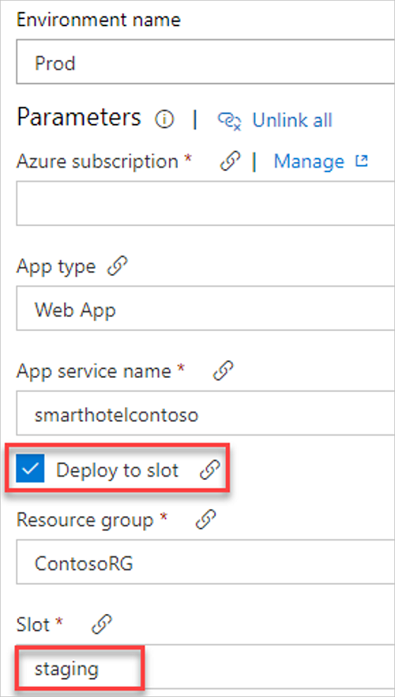

16. They remove the **Deploy Azure App Service to Slot** from the pipeline. It was placed there by the previous steps.

    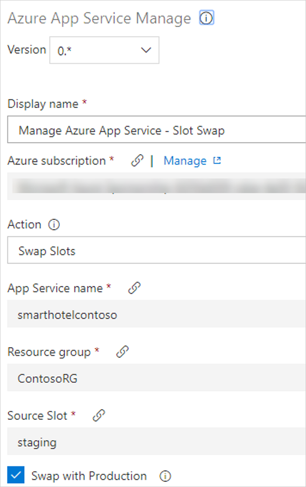

13. They save the pipeline. On the pipeline, they click on **Post-deployment conditions**.

    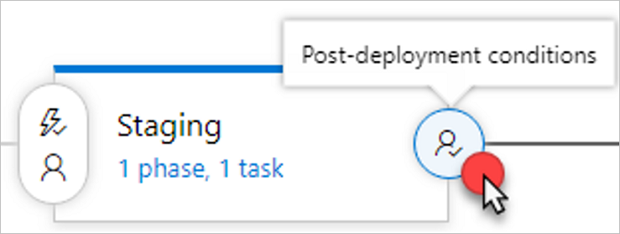

14. They enable **Post-deployment approvals**, and add a dev lead as the approver.

    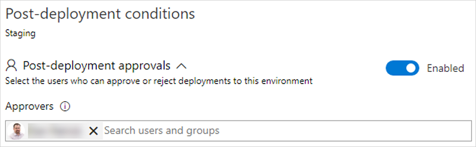

15. In the Build pipeline, they manually kick off a build. This triggers the new release pipeline, which deploys the site to the staging slot. For Contoso, the URL for the slot is **https://smarthotelcontoso-staging.azurewebsites.net/**.
16. After the build finishes, and the release deploys to the slot, Azure DevOps emails the dev lead for approval.
17. The dev lead clicks **View approval**, and can approve or reject the request in the Azure DevOps portal.

    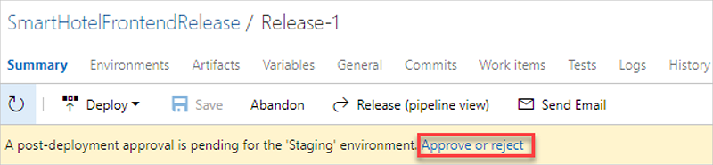

16. The lead makes a comment and approves. This starts the swap of the **staging** and **prod** slots, and moves the build into production.

    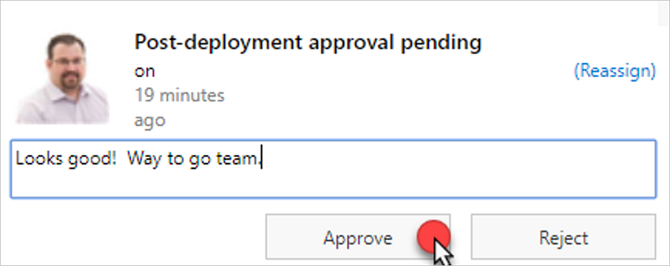

17. The pipeline completes the swap.

    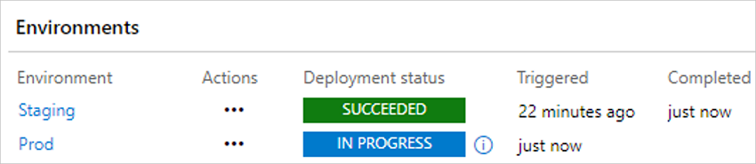

18. The team checks the **prod** slot to verify that the web app is in production at **https://smarthotelcontoso.azurewebsites.net/**.


### Deploy the PetChecker Function App

Contoso admins deploy the app as follows.

1. They clone the repo locally to the dev machine by connecting to the Azure DevOps project.
2. In Visual Studio, they open the folder to show all the files in the repo.
3. They open the **src/PetCheckerFunction/local.settings.json** file, and add the app settings for storage, the Cosmos database, and the Computer Vision API.

    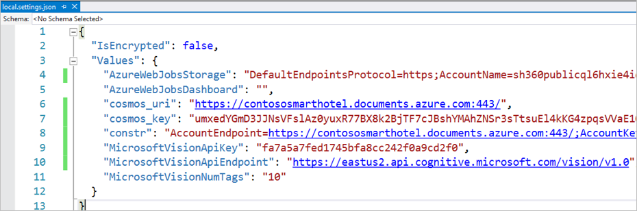

4. They commit the code, and sync it back to Azure DevOps, pushing their changes.
5. They add a new Build pipeline, and select **Azure DevOps Git** for the source.
6. They select the **ASP.NET Core (.NET Framework)** template.
7. They accept the defaults for the template.
8. In **Triggers**, then select to **Enable continuous integration**, and click **Save & Queue** to start a build.
9. After the build succeeds, they build a Release pipeline, adding the **Azure App Service deployment with slot**.
10. They name the environment **Prod**, and select the subscription. They set the **App type** to **Function App**, and the app service name as **smarthotelpetchecker**.

    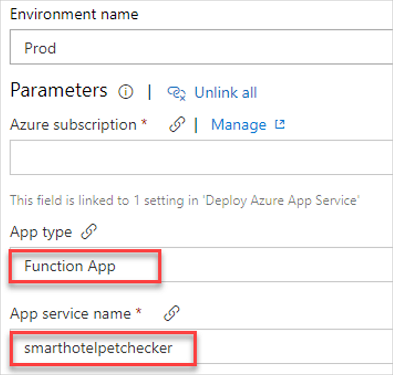

11. They add an artifact **Build**.

    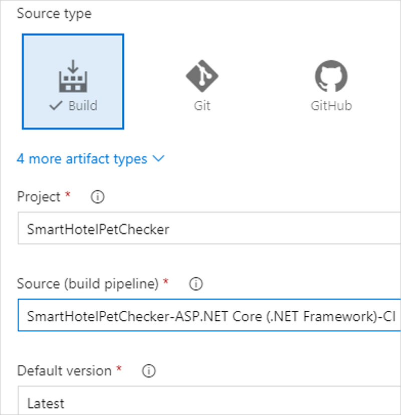

12. They enable **Continuous deployment trigger**, and click **Save**.
13. They click **Queue new build** to run the full CI/CD pipeline.
14. After the function is deployed, it appears in the Azure portal, with the **Running** status.

    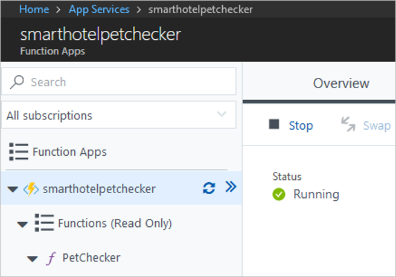


7. They browse to the app to test that the Pet Checker app is working as expected, at [http://smarthotel360public.azurewebsites.net/Pets](http://smarthotel360public.azurewebsites.net/Pets).
8. They click on the avatar to upload a picture.

    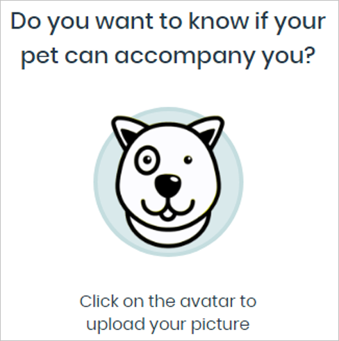

9. The first photo they want to check is of a small dog.

    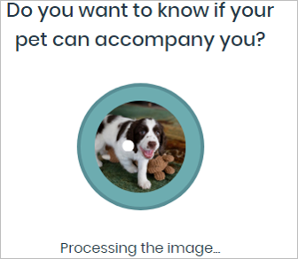

10. The app returns a message of acceptance.

    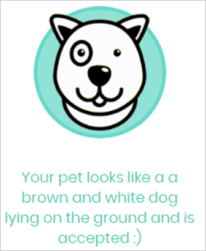


## Review the deployment

With the migrated resources in Azure, Contoso now needs to fully operationalize and secure the new infrastructure.

### Security

- Contoso needs to ensure that the new databases are secure. [Learn more](https://docs.microsoft.com/azure/sql-database/sql-database-security-overview).
- The app needs to be updated to use SSL with certificates. The container instance should be redeployed to answer on 443.
- Contoso should consider using KeyVault to protect secrets for their Service Fabric apps. [Learn more](https://docs.microsoft.com/azure/service-fabric/service-fabric-application-secret-management).

### Backups and disaster recovery

- Contoso needs to review backup requirements for the Azure SQL Database. [Learn more](https://docs.microsoft.com/azure/sql-database/sql-database-automated-backups).
- Contoso should consider implementing SQL failover groups to provide regional failover for the database. [Learn more](https://docs.microsoft.com/azure/sql-database/sql-database-geo-replication-overview).
- Contoso can leverage geo-replication for the ACR premium SKU. [Learn more](https://docs.microsoft.com/azure/container-registry/container-registry-geo-replication).
- Cosmos DB backs up automatically. Contoso can [learn more](https://docs.microsoft.com/azure/cosmos-db/online-backup-and-restore) about this process.

### Licensing and cost optimization

- After all resources are deployed, Contoso should assign Azure tags based on their [infrastructure planning](contoso-migration-infrastructure.md#set-up-tagging).
- All licensing is built into the cost of the PaaS services that Contoso is consuming. This will be deducted from the EA.
- Contoso will enable Azure Cost Management licensed by Cloudyn, a Microsoft subsidiary. It's a multi-cloud cost management solution that helps you to utilize and manage Azure and other cloud resources.  [Learn more](https://docs.microsoft.com/azure/cost-management/overview) about Azure Cost Management.

## Conclusion

In this article, Contoso rebuilds the SmartHotel360 app in Azure. The on-premises app front-end VM is rebuilt to Azure App Services Web Apps. The app back end is built using microservices deployed to containers managed by Azure Kubernetes Service (AKS). Contoso enhanced app functionality with a pet photo app.


