# Contoso migration: Refactor a Contoso Linux service desk app to multiple regions with Azure App Service, Traffic Manager, and Azure MySQL

This article shows how Contoso refactors their on-premises two-tier Linux service desk app (osTicket), by migrating it to Azure App Service with GitHub integration, and Azure MySQL.

This document is one in a series of articles that show how the fictitious company Contoso migrates its on-premises resources to the Microsoft Azure cloud. The series includes background information, and scenarios that illustrate how to set up a migration infrastructure, and run different types of migrations. Scenarios grow in complexity. We'll add additional articles over time.

**Article** | **Details** | **Status**
--- | --- | ---
[Article 1: Overview](contoso-migration-overview.md) | Overview of the article series, Contoso's migration strategy, and the sample apps that are used in the series. | Available
[Article 2: Deploy Azure infrastructure](contoso-migration-infrastructure.md) | Contoso prepares its on-premises infrastructure and its Azure infrastructure for migration. The same infrastructure is used for all migration articles in the series. | Available
[Article 3: Assess on-premises resources for migration to Azure](contoso-migration-assessment.md)  | Contoso runs an assessment of its on-premises SmartHotel360 app running on VMware. Contoso assesses app VMs using the Azure Migrate service, and the app SQL Server database using Data Migration Assistant. | Available
[Article 4: Rehost an app on an Azure VM and SQL Database Managed Instance](contoso-migration-rehost-vm-sql-managed-instance.md) | Contoso runs a lift-and-shift migration to Azure for its on-premises SmartHotel360 app. Contoso migrates the app front-end VM using [Azure Site Recovery](https://docs.microsoft.com/azure/site-recovery/site-recovery-overview). Contoso migrates the app database to an Azure SQL Database Managed Instance using the [Azure Database Migration Service](https://docs.microsoft.com/azure/dms/dms-overview). | Available	
[Article 5: Rehost an app on Azure VMs](contoso-migration-rehost-vm.md) | Contoso migrates its SmartHotel360 app VMs to Azure VMs using the Site Recovery service. | Available
[Article 6: Rehost an app on Azure VMs and in a  SQL Server AlwaysOn availability group](contoso-migration-rehost-vm-sql-ag.md) | Contoso migrates the SmartHotel360 app. Contoso uses Site Recovery to migrate the app VMs. It uses the Database Migration Service to migrate the app database to a SQL Server cluster that's protected by an AlwaysOn availability group. | Available	
[Article 7: Rehost a Linux app on Azure VMs](contoso-migration-rehost-linux-vm.md) | Contoso completes a lift-and-shift migration of the Linux osTicket app to Azure VMs, using Azure Site Recovery | Available
[Article 8: Rehost a Linux app on Azure VMs and Azure MySQL](contoso-migration-rehost-linux-vm-mysql.md) | Contoso migrates the Linux osTicket app to Azure VMs using Azure Site Recovery, and migrates the app database to an Azure MySQL Server instance using MySQL Workbench. | Available
[Article 9: Refactor an app on Azure Web Apps and Azure SQL database](contoso-migration-refactor-web-app-sql.md) | Contoso migrates the SmartHotel360 app to an Azure Web App, and migrates the app database to an Azure SQL Server instance with Database Migration Assistant | Available
Article 10: Refactor a Linux app on Azure Web Apps and Azure MySQL | Contoso migrates its Linux osTicket app to an Azure web app on multiple Azure regions using Azure Traffic Manager, integrated with GitHub for continuous delivery. Contoso migrates the app database to an Azure Database for MySQL instance. | This article
[Article 11: Refactor TFS on Azure DevOps Services](contoso-migration-tfs-vsts.md) | Contoso migrates its on-premises Team Foundation Server deployment to Azure DevOps Services in Azure. | Available
[Article 12: Rearchitect an app on Azure containers and Azure SQL Database](contoso-migration-rearchitect-container-sql.md) | Contoso migrates its SmartHotel app to Azure. Then, it rearchitects the app web tier as a Windows container running in Azure Service Fabric, and the database with Azure SQL Database. | Available
[Article 13: Rebuild an app in Azure](contoso-migration-rebuild.md) | Contoso rebuilds its SmartHotel360 app by using a range of Azure capabilities and services, including Azure App Service, Azure Kubernetes Service (AKS), Azure Functions, Azure Cognitive Services, and Azure Cosmos DB. | Available
[Article 14: Scale a migration to Azure](contoso-migration-scale.md) | After trying out migration combinations, Contoso prepares to scale to a full migration to Azure. | Available

In this article, Contoso migrates a two-tier Linux Apache MySQL PHP (LAMP) service desk app (osTicket) to Azure. If you'd like to use this open-source app, you can download it from [GitHub](https://github.com/osTicket/osTicket).

## Business drivers

The IT Leadership team has worked closely with business partners to understand what they want to achieve:

- **Address business growth**: Contoso is growing and moving into new markets. It needs additional customer service agents. 
- **Scale**: The solution should be built so that Contoso can add more customer service agents as the business scales.
- **Increase resiliency**:  In the past issues with the system affected internal users only. With the new business model, external users will be affected, and Contoso need the app up and running at all times.

## Migration goals

The Contoso cloud team has pinned down goals for this migration, in order to determine the best migration method:

- The application should scale beyond current on-premises capacity and performance.  Contoso is moving the application to take advantage of Azure's on-demand scaling.
- Contoso want to move the app code base to a continuous delivery pipeline.  As app changes are pushed to GitHub, Contoso want to deploy those changes without tasks for operations staff.
- The application must be resilient with capabilities for growth and failover. Contoso want to deploy the app in two different Azure regions, and set it up to scale automatically.
- Contoso wants to minimize database admin tasks after the app is moved to the cloud.

## Solution design
After pinning down their goals and requirements, Contoso designs and reviews a deployment solution, and identifies the migration process, including the Azure services that will be used for the migration.

## Current architecture

- The app is tiered across two VMs (OSTICKETWEB and OSTICKETMYSQL).
- The VMs are located on VMware ESXi host **contosohost1.contoso.com** (version 6.5).
- The VMware environment is managed by vCenter Server 6.5 (**vcenter.contoso.com**), running on a VM.
- Contoso has an on-premises datacenter (contoso-datacenter), with an on-premises domain controller (**contosodc1**).

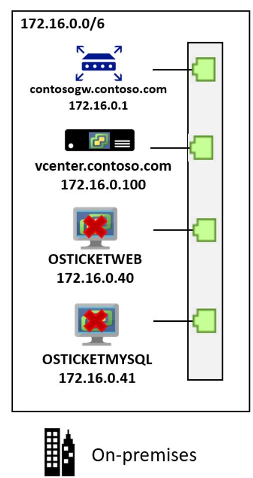 

## Proposed architecture

Here's the proposed architecture:

- The web tier app on OSTICKETWEB will be migrated by building an Azure App Service in two Azure regions. Azure App Service for Linux will be implemented using the PHP 7.0 Docker container.
- The app code will be moved to GitHub, and Azure Web App will be configured for continuous delivery with GitHub.
- Azure App Servers will be deployed in both the primary (East US 2) and secondary (Central US) region.
- Traffic Manager will be set up in front of the two Azure Web Apps in both regions.
- Traffic Manager will be configured in priority mode to force the traffic through East US 2.
- If the Azure App Server in East US 2 goes offline, users can access the failed over app in Central US.
- The app database will be migrated to the Azure MySQL PaaS service using MySQL Workbench tools. The on-premises database will be backed up locally, and restored directly to Azure MySQL.
- The database will reside in the primary East US 2 region, in the database subnet (PROD-DB-EUS2) in the production network (VNET-PROD-EUS2):
- Since they're migrating a production workload, Azure resources for the app will reside in the production resource group **ContosoRG**.
- The Traffic Manager resource will be deployed in Contoso's infrastructure resource group **ContosoInfraRG**.
- The on-premises VMs in the Contoso datacenter will be decommissioned after the migration is done.

 

## Migration process

Contoso will complete the migration process as follows:

1. As a first step, Contoso admins set up the Azure infrastructure, including provisioning Azure App Services, setting up Traffic Manager, and provisioning an Azure MySQL instance.
2. After preparing the Azure, they migrate the database using MySQL Workbench. 
3. After the database is running in Azure, they up a GitHub private repo for the Azure App Service with continuous delivery, and load it with the osTicket app.
4. In the Azure portal, they load the app from GitHub to the Docker container running Azure App Service. 
5. They tweak DNS settings, and configure autoscaling for the app.

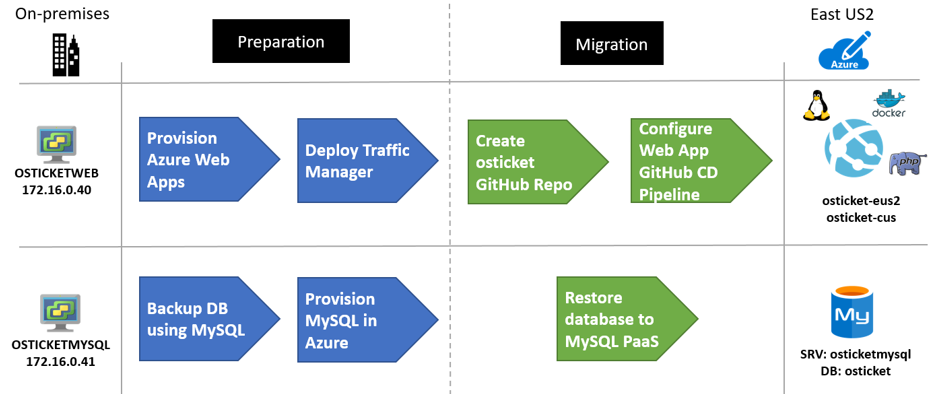 

### Azure services

**Service** | **Description** | **Cost**
--- | --- | ---
[Azure App Service](https://azure.microsoft.com/services/app-service/) | The service runs and scales applications using the Azure PaaS service for websites.  | Pricing is based on the size of the instances, and the features required. [Learn more](https://azure.microsoft.com/pricing/details/app-service/windows/).
[Traffic Manager](https://azure.microsoft.com/services/traffic-manager/) | A load balancer that uses DNS to direct users to Azure, or external websites and services. | Pricing is based on the number of DNS queries received, and the number of monitored endpoints. | [Learn more](https://azure.microsoft.com/pricing/details/traffic-manager/).
[Azure Database for MySQL](https://docs.microsoft.com/azure/mysql/) | The database is based on the open-source MySQL Server engine. It provides a fully managed, enterprise-ready community MySQL database, as a service for app development and deployment. | Pricing based on compute, storage, and backup requirements. [Learn more](https://azure.microsoft.com/pricing/details/mysql/).

 
## Prerequisites

Here's what Contoso needs to run this scenario.

**Requirements** | **Details**
--- | ---
**Azure subscription** | Contoso created subscriptions earlier in this article series. If you don't have an Azure subscription, create a [free account](https://azure.microsoft.com/pricing/free-trial/).   If you create a free account, you're the administrator of your subscription and can perform all actions.   If you use an existing subscription and you're not the administrator, you need to work with the admin to assign you Owner or Contributor permissions. 
**Azure infrastructure** | Contoso set up their Azure infrastructure as described in [Azure infrastructure for migration](contoso-migration-infrastructure.md).

## Scenario steps

Here's how Contoso will complete the migration:

> [!div class="checklist"]
> * **Step 1: Provision Azure App Services**: Contoso admins will provision Web Apps in the primary and secondary regions.
> * **Step 2: Set up Traffic Manager**: They set up Traffic Manager in front of the Web Apps, for routing and load balancing traffic.
> * **Step 3: Provision MySQL**: In Azure, they provision an instance of Azure MySQL database.
> * **Step 4: Migrate the database**: They migrate the database using MySQL Workbench. 
> * **Step 5: Set up GitHub**: They set up a local GitHub repository for the app web sites/code.
> * **Step 6: Deploy the web apps**: They deploy the web apps from GitHub.

## Step 1: Provision Azure App Services

Contoso admins provision two Web apps (one in each region) using Azure App Services.

1. They create a Web App resource in the primary East US 2 region (**osticket-eus2**) from the Azure Marketplace.
2. They put the resource in the production resource group **ContosoRG**.

    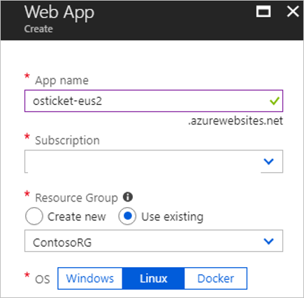 

3. They create a new App Service plan in the primary region (**APP-SVP-EUS2**), using the standard size.

     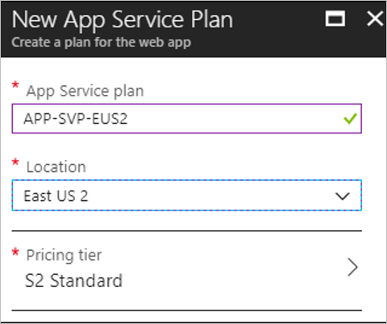 
    
4. They select a Linux OS with PHP 7.0 runtime stack, which is a Docker container.

    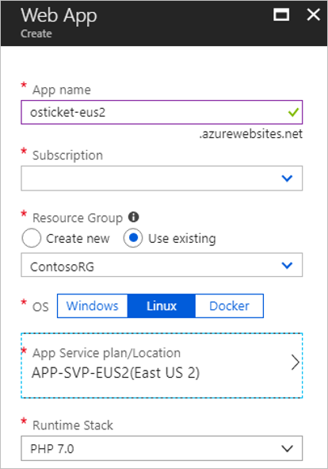 

5. They create a second web app (**osticket-cus**), and App service plan for the Central US region.

    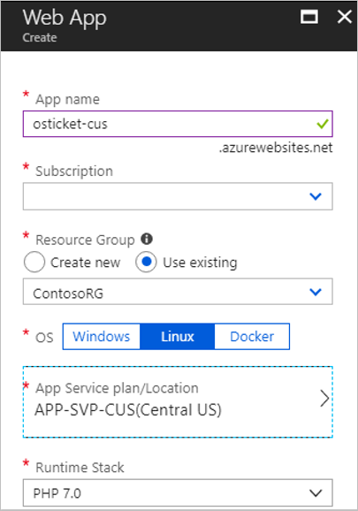 

**Need more help?**

- Learn about [Azure App Service Web apps](https://docs.microsoft.com/azure/app-service/app-service-web-overview).
- Learn about [Azure App Service on Linux](https://docs.microsoft.com/azure/app-service/containers/app-service-linux-intro).

## Step 2: Set up Traffic Manager

Contoso admins set up Traffic Manager to direct inbound web requests to Web Apps running on the osTicket web tier.

1. They create a Traffic Manager resource (**osticket.trafficmanager.net**) from the Azure Marketplace. They use priority routing so that East US 2 is the primary site. They place the resource in their infrastructure resource group (**ContosoInfraRG**). Note that Traffic Manager is global and not bound to a specific location

    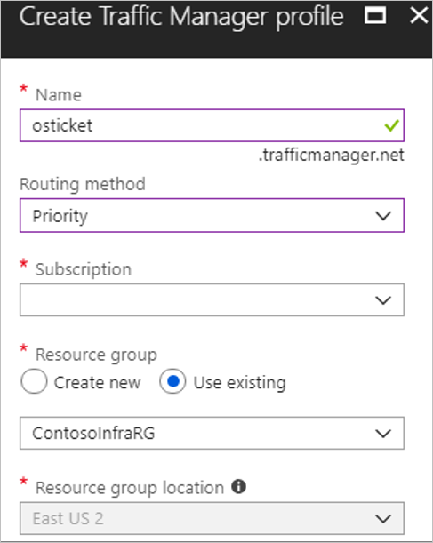 

2. Now, they configure Traffic Manager with endpoints. They add East US 2 Web app as the primary site (**osticket-eus2**), and the Central US app as secondary (**osticket-cus**).

    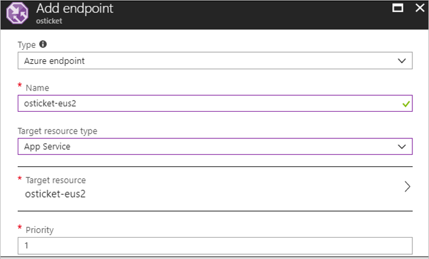 

3. After adding the endpoints, they can monitor them.

    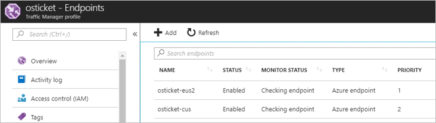

**Need more help?**

- Learn about [Traffic Manager](https://docs.microsoft.com/azure/traffic-manager/traffic-manager-overview).
- Learn about [routing traffic to a priority endpoint](https://docs.microsoft.com/azure/traffic-manager/traffic-manager-configure-priority-routing-method).
 
## Step 3: Provision Azure Database for MySQL

Contoso admins provision a MySQL database instance in the primary East US 2 region.

1. In the Azure portal, they create an Azure Database for MySQL resource. 

    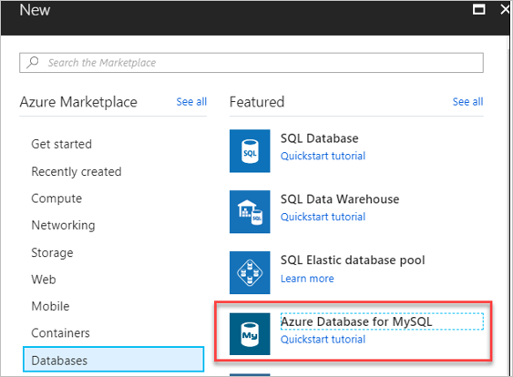

2. They add the name **contosoosticket** for the Azure database. They add the database to the production resource group **ContosoRG**, and specify credentials for it.
3. The on-premises MySQL database is version 5.7, so they select this version for compatibility. They use the default sizes, which match their database requirements.

     

4. For **Backup Redundancy Options**, they select to use **Geo-Redundant**. This option allows them to restore the database in their secondary Central US region if an outage occurs. They can only configure this option when they provision the database.

    

4. They set up connection security. In the database > **Connection Security**, they set up Firewall rules to allow the database to access Azure services.
5. They add the local workstation client IP address to the start and end IP addresses. This allows the Web apps to access the MySQL database, along with the database client that's performing the migration.

    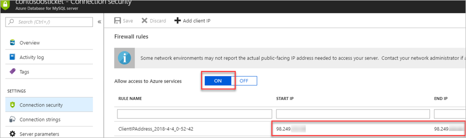

## Step 4: Migrate the database

Contoso admins migrate the database using backup and restore, with MySQL tools. They install MySQL Workbench, back up the database from OSTICKETMYSQL, and then restore it to Azure Database for MySQL Server.

### Install MySQL Workbench

1. They check the [prerequisites and downloads MySQL Workbench](https://dev.mysql.com/downloads/workbench/?utm_source=tuicool).
2. They install MySQL Workbench for Windows in accordance with the [installation instructions](https://dev.mysql.com/doc/workbench/en/wb-installing.html). The machine on which they install must be accessible to the OSTICKETMYSQL VM, and Azure via the internet.
3. In MySQL Workbench, they create a MySQL connection to OSTICKETMYSQL. 

    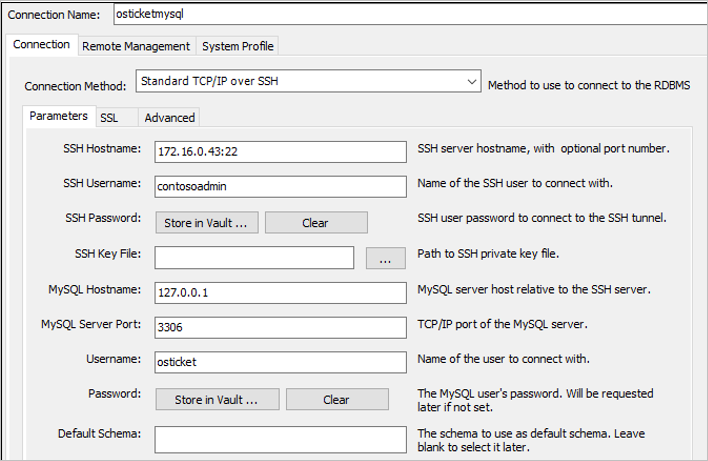

4. They export the database as **osticket**, to a local self-contained file.

    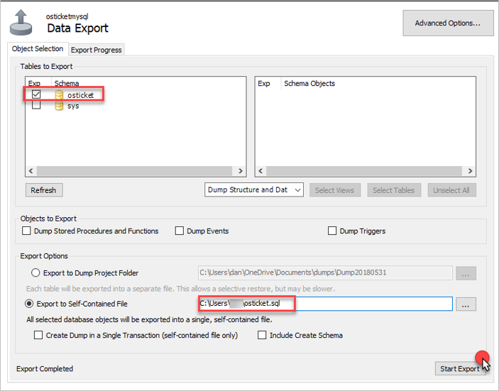

5. After the database has been backed up locally, they create a connection to the Azure Database for MySQL instance.

    

6. Now, they can import (restore) the database in the Azure MySQL instance, from the self-contained file. A new schema (osticket) is created for the instance.

    

7. After data is restored, it can be queried using Workbench, and appears in the Azure portal.

    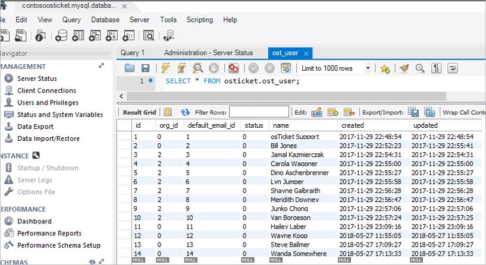

    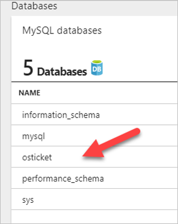

8. Finally, they need to update the database information on the web apps. On the MySQL instance, they open **Connection Strings**. 

     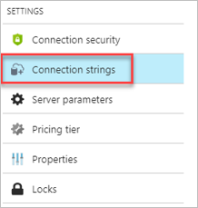

9. In the strings list, they locate the Web App settings, and click to copy them.

    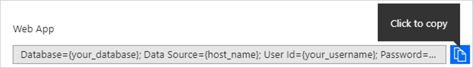

10. They open a Notepad window and paste the string into a new file, and update it to match the osticket database, MySQL instance, and credentials settings.

     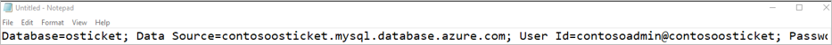

11. Tney can verify the server name and login from **Overview** in the MySQL instance in the Azure portal.

    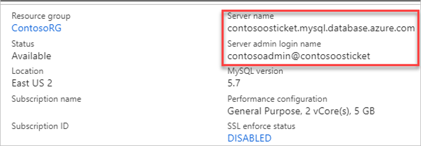

## Step 5: Set up GitHub

Contoso admins create a new private GitHub repo, and sets up a connection to the osTicket database in Azure MySQL. Then, they load the Azure Web App with the app.  

1.	They browse to the OsTicket software public GitHub repo, and fork it to the Contoso GitHub account.

    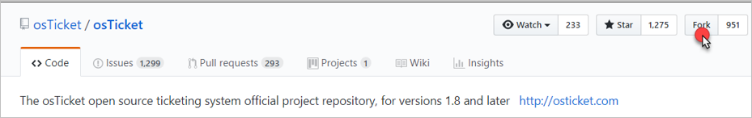

2. After forking, they navigate to the **include** folder, and find the **ost-config.php** file.

    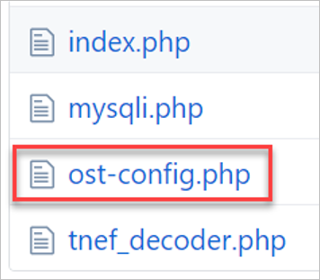

3. The file opens in the browser and they edit it.

    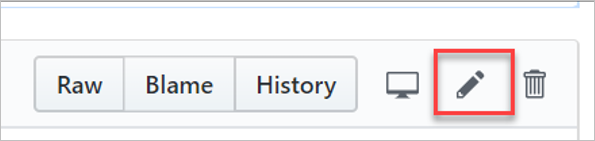

4. In the editor, they update the database details, specifically **DBHOST** and **DBUSER**. 

    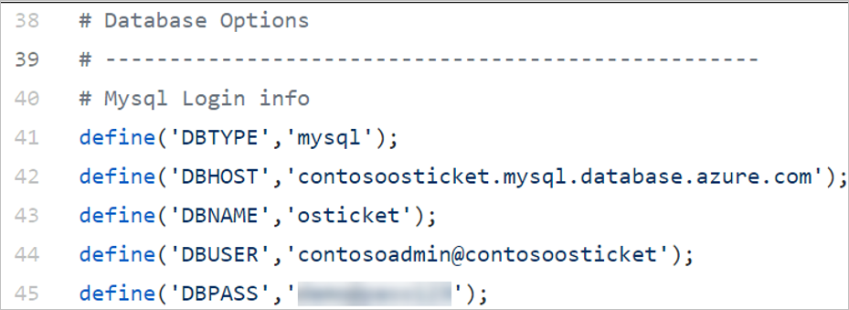

5. Then they commit the changes.

    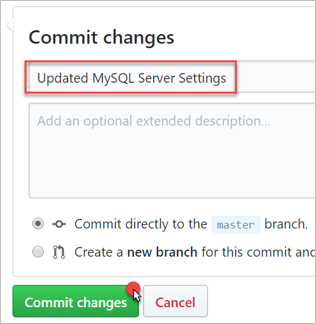

6. For each web app (**osticket-eus2** and **osticket-cus**), they modify the **Application settings** in the Azure portal.

    

7. They enter the connection string with the name **osticket**, and copy the string from notepad into the **value area**. They select **MySQL** in the dropdown list next to the string, and save the settings.

    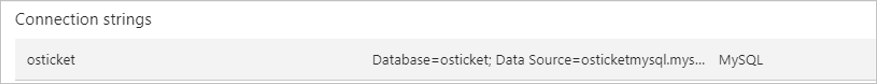

## Step 6: Configure the Web Apps

As the final step in the migration process, Contoso admins configure the web apps with the osTicket web sites.

1. In the primary web app (**osticket-eus2**) they open **Deployment option** and set the source to **GitHub**.

    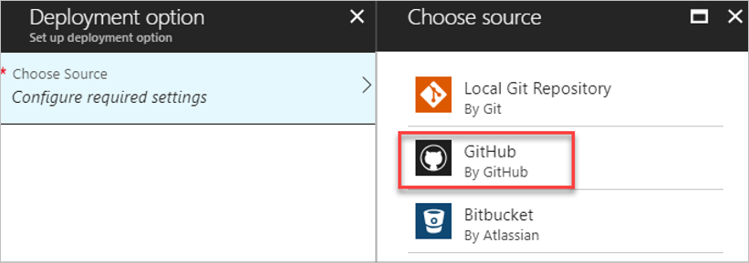

2. They select the deployment options.

    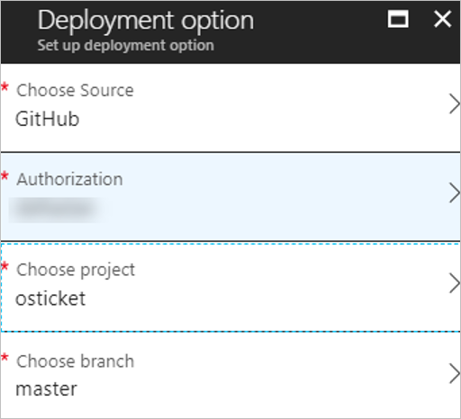

3. After setting the options, the configuration shows as pending in the Azure portal.

    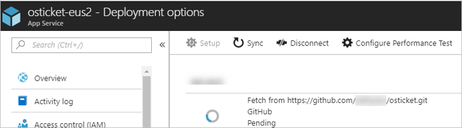

4. After the configuration is updated and the osTicket web app is loaded from GitHub to the Docket container running the Azure App Service, the site shows as Active.

    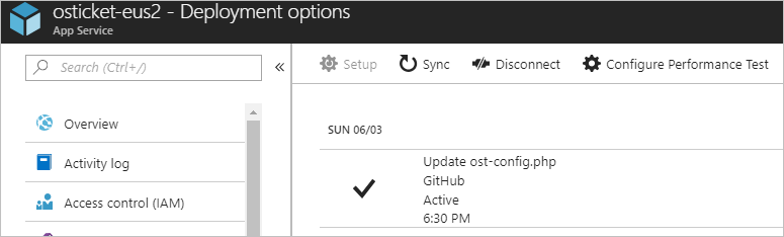

5. They repeat the above steps for the secondary web app (**osticket-cus**).
6. After the site is configured, it's accessible via the Traffic Manager profile. The DNS name is the new location of the osTicket app. [Learn more](https://docs.microsoft.com/azure/app-service/app-service-web-tutorial-custom-domain#map-a-cname-record).

    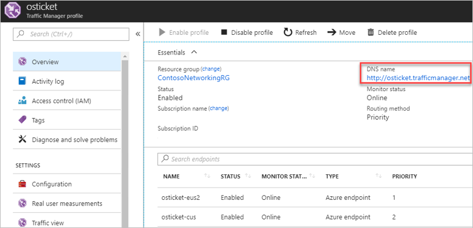
    
7. Contoso wants a DNS name that's easy to remember. They create an alias record (CNAME) **osticket.contoso.com** which points to the Traffic Manager name, in the DNS on their domain controllers.

    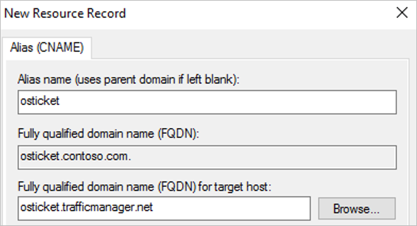

8. They configure both the **osticket-eus2** and **osticket-cus** web apps to allow the custom hostnames.

    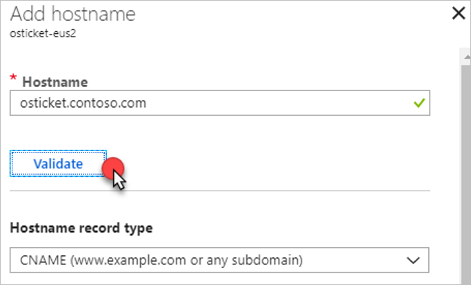

### Set up autoscaling

Finally, they set up automatic scaling for the app. This ensures that as agents use the app, the app instances increase and decrease according to business needs. 

1. In App Service **APP-SRV-EUS2**, they open **Scale Unit**.
2. They configure a new autoscale setting with a single rule that increases the instance count by one when the CPU percentage for the current instance is above 70% for 10 minutes.

    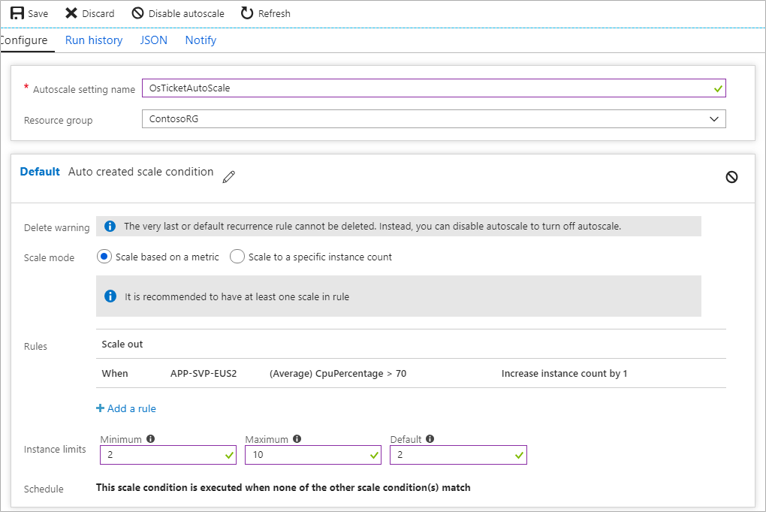

3. They configure the same setting on **APP-SRV-CUS** to ensure that the same behavior applies if the app fails over to the secondary region. The only difference is that they set the instance limit to 1 since this is for failovers only.

   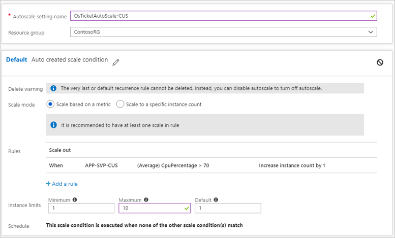

##  Clean up after migration

With migration complete, the osTicket app is refactored to running in an Azure Web app with continuous delivery using a private GitHub repo. The app's running in two regions for increased resilience. The osTicket database is running in Azure database for MySQL after migration to the PaaS platform.

For clean up, Contoso needs to do the following: 
- Remove the VMware VMs from the vCenter inventory.
- Remove the on-premises VMs from local backup jobs.
- Update internal documentation show new locations and IP addresses. 
- Review any resources that interact with the on-premises VMs, and update any relevant settings or documentation to reflect the new configuration.
- Reconfigure monitoring to point at the osticket-trafficmanager.net URL, to track that the app is up and running.

## Review the deployment

With the app now running, Contoso need to fully operationalize and secure their new infrastructure.

### Security

The Contoso security team reviewed the app to determine any security issues. They identified that the communication between the osTicket app and the MySQL database instance isn't configured for SSL. They will need to do this to ensure that database traffic can't be hacked. [Learn more](https://docs.microsoft.com/azure/mysql/howto-configure-ssl).

### Backups

- The osTicket web apps don't contain state data and thus don't need to be backed up.
- They don't need to configure backup for the database. Azure Database for MySQL automatically creates server backups and stores. They selected to use geo-redundancy for the database, so it's resilient and production-ready. Backups can be used to restore your server to a point-in-time. [Learn more](https://docs.microsoft.com/azure/mysql/concepts-backup).

### Licensing and cost optimization

- There are no licensing issues for the PaaS deployment.
- Contoso will enable Azure Cost Management licensed by Cloudyn, a Microsoft subsidiary. It's a multi-cloud cost management solution that helps you to utilize and manage Azure and other cloud resources.  [Learn more](https://docs.microsoft.com/azure/cost-management/overview) about Azure Cost Management.

