# Contoso migration: Rehost an on-premises Linux app to Azure VMs and Azure MySQL

This article shows how Contoso rehosts its on-premises two-tier Linux service desk app (osTicket), by migrating it to Azure and Azure MySQL.

This document is one in a series of articles that show how the fictitious company Contoso migrates its on-premises resources to the Microsoft Azure cloud. The series includes background information, and scenarios that illustrate how to set up a migration infrastructure, and run different types of migrations. Scenarios grow in complexity. We'll add additional articles over time.

**Article** | **Details** | **Status**
--- | --- | ---
[Article 1: Overview](contoso-migration-overview.md) | Overview of the article series, Contoso's migration strategy, and the sample apps that are used in the series. | Available
[Article 2: Deploy Azure infrastructure](contoso-migration-infrastructure.md) | Contoso prepares its on-premises infrastructure and its Azure infrastructure for migration. The same infrastructure is used for all migration articles in the series. | Available
[Article 3: Assess on-premises resources for migration to Azure](contoso-migration-assessment.md)  | Contoso runs an assessment of its on-premises SmartHotel360 app running on VMware. Contoso assesses app VMs using the Azure Migrate service, and the app SQL Server database using Data Migration Assistant. | Available
[Article 4: Rehost an app on an Azure VM and SQL Database Managed Instance](contoso-migration-rehost-vm-sql-managed-instance.md) | Contoso runs a lift-and-shift migration to Azure for its on-premises SmartHotel360 app. Contoso migrates the app front-end VM using [Azure Site Recovery](https://docs.microsoft.com/azure/site-recovery/site-recovery-overview). Contoso migrates the app database to an Azure SQL Database Managed Instance using the [Azure Database Migration Service](https://docs.microsoft.com/azure/dms/dms-overview). | Available	
[Article 5: Rehost an app on Azure VMs](contoso-migration-rehost-vm.md) | Contoso migrates its SmartHotel360 app VMs to Azure VMs using the Site Recovery service. | Available
[Article 6: Rehost an app on Azure VMs and in a  SQL Server AlwaysOn availability group](contoso-migration-rehost-vm-sql-ag.md) | Contoso migrates the SmartHotel360 app. Contoso uses Site Recovery to migrate the app VMs. It uses the Database Migration Service to migrate the app database to a SQL Server cluster that's protected by an AlwaysOn availability group. | Available	
[Article 7: Rehost a Linux app on Azure VMs](contoso-migration-rehost-linux-vm.md) | Contoso completes a lift-and-shift migration of the Linux osTicket app to Azure VMs, using Azure Site Recovery | Available
Article 8: Rehost a Linux app on Azure VMs and Azure MySQL | Contoso migrates the Linux osTicket app to Azure VMs using Azure Site Recovery, and migrates the app database to an Azure MySQL Server instance using MySQL Workbench. | This article
[Article 9: Refactor an app on Azure Web Apps and Azure SQL database](contoso-migration-refactor-web-app-sql.md) | Contoso migrates the SmartHotel360 app to an Azure Web App, and migrates the app database to an Azure SQL Server instance with Database Migration Assistant | Available
[Article 10: Refactor a Linux app on Azure Web Apps and Azure MySQL](contoso-migration-refactor-linux-app-service-mysql.md) | Contoso migrates its Linux osTicket app to an Azure web app on multiple Azure regions using Azure Traffic Manager, integrated with GitHub for continuous delivery. Contoso migrates the app database to an Azure Database for MySQL instance. | Available	
[Article 11: Refactor TFS on Azure DevOps Services](contoso-migration-tfs-vsts.md) | Contoso migrates its on-premises Team Foundation Server deployment to Azure DevOps Services in Azure. | Available
[Article 12: Rearchitect an app on Azure containers and Azure SQL Database](contoso-migration-rearchitect-container-sql.md) | Contoso migrates its SmartHotel app to Azure. Then, it rearchitects the app web tier as a Windows container running in Azure Service Fabric, and the database with Azure SQL Database. | Available
[Article 13: Rebuild an app in Azure](contoso-migration-rebuild.md) | Contoso rebuilds its SmartHotel app by using a range of Azure capabilities and services, including Azure App Service, Azure Kubernetes Service (AKS), Azure Functions, Azure Cognitive Services, and Azure Cosmos DB. | Available
[Article 14: Scale a migration to Azure](contoso-migration-scale.md) | After trying out migration combinations, Contoso prepares to scale to a full migration to Azure. | Available

In this article, Contoso migrates a two-tier Linux Apache MySQL PHP (LAMP) service desk app (osTicket) to Azure. If you'd like to use this open-source app, you can download it from [GitHub](https://github.com/osTicket/osTicket).

## Business drivers

The IT Leadership team has worked closely with business partners to understand what they want to achieve:

- **Address business growth**: Contoso is growing, and as a result there's pressure on the on-premises systems and infrastructure.
- **Limit risk**: The service desk app is critical for the business. Contoso wants to move it to Azure with zero risk.
- **Extend**:  Contoso doesn't want to change the app right now. It simply wants to keep the app stable.

## Migration goals

The Contoso cloud team has pinned down goals for this migration, in order to determine the best migration method:

- After migration, the app in Azure should have the same performance capabilities as it does today in their on-premises VMware environment.  The app will remain as critical in the cloud as it is on-premises. 
- Contoso doesn’t want to invest in this app.  It's important to the business, but in its current form Contoso simply want to move it safely to the cloud.
- Having completed a couple of Windows app migrations, Contoso wants to learn how to use a Linux-based infrastructure in Azure.
- Contoso wants to minimize database admin tasks after the application is moved to the cloud.

## Proposed architecture

In this scenario:

- The app is tiered across two VMs (OSTICKETWEB and OSTICKETMYSQL).
- The VMs are located on VMware ESXi host **contosohost1.contoso.com** (version 6.5).
- The VMware environment is managed by vCenter Server 6.5 (**vcenter.contoso.com**), running on a VM.
- Contoso has an on-premises datacenter (contoso-datacenter), with an on-premises domain controller (**contosodc1**).
- The web tier app on OSTICKETWEB will be migrated to an Azure IaaS VM.
- The app database will be migrated to the Azure Database for MySQL PaaS service.
- Since Contoso is migrating a production workload, the resources will reside in the production resource group **ContosoRG**.
- The resources will be replicated to the primary region (East US 2), and placed in the production network (VNET-PROD-EUS2):
    - The web VM will reside in the frontend subnet (PROD-FE-EUS2).
    - The database instance will reside in the database subnet (PROD-DB-EUS2).
- The app database will be migrated to Azure MySQL using MySQL tools.
- The on-premises VMs in the Contoso datacenter will be decommissioned after the migration is done.

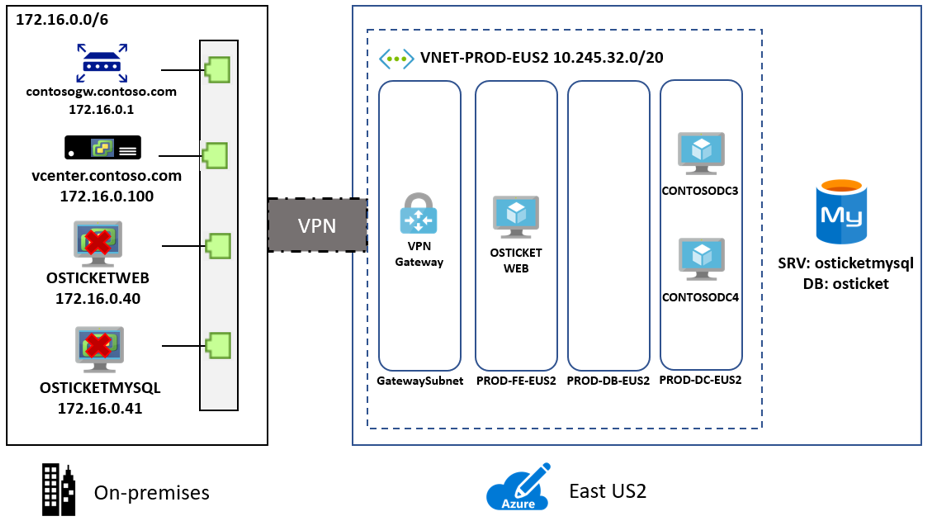 

## Migration process

Contoso will complete the migration process as follows:

To migrate the web VM:

1. As a first step, Contoso sets up the Azure and on-premises infrastructure needed to deploy Site Recovery.
2. After preparing the Azure and on-premises components, Contoso sets up and enables replication for the web VM.
3. After replication is up-and-running, Contoso migrates the VM by failing it over to Azure.

To migrate the database:

1. Contoso provisions a MySQL instance in Azure.
2. Contoso sets up MySQL workbench, and backs up the database locally.
3. Contoso then restore the database from the local backup to Azure.

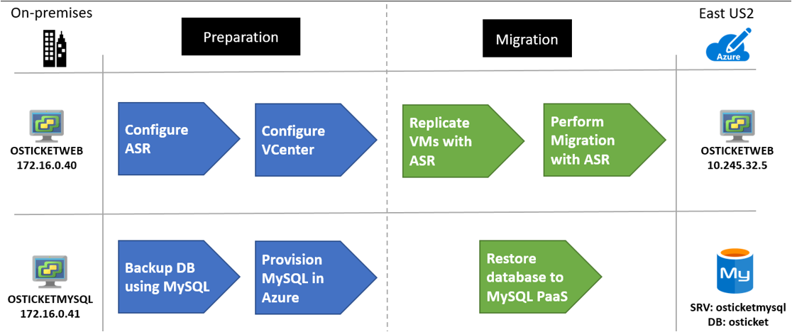 

### Azure services

**Service** | **Description** | **Cost**
--- | --- | ---
[Azure Site Recovery](https://docs.microsoft.com/azure/site-recovery/) | The service orchestrates and manages migration and disaster recovery for Azure VMs, and on-premises VMs and physical servers.  | During replication to Azure, Azure Storage charges are incurred.  Azure VMs are created, and incur charges, when failover occurs. [Learn more](https://azure.microsoft.com/pricing/details/site-recovery/) about charges and pricing.
[Azure Database for MySQL](https://docs.microsoft.com/azure/mysql/) | The database is based on the open-source MySQL Server engine. It provides a fully-managed, enterprise-ready community MySQL database, as a service for app development and deployment. 

 
## Prerequisites

Here's what Contoso needs for this scenario.

**Requirements** | **Details**
--- | ---
**Azure subscription** | Contoso created subscriptions during an earlier article. If you don't have an Azure subscription, create a [free account](https://azure.microsoft.com/pricing/free-trial/).   If you create a free account, you're the administrator of your subscription and can perform all actions.   If you use an existing subscription and you're not the administrator, you need to work with the admin to assign you Owner or Contributor permissions.   If you need more granular permissions, review [this article](../site-recovery/site-recovery-role-based-linked-access-control.md). 
**Azure infrastructure** | Contoso set up the Azure infrastructure as described in [Azure infrastructure for migration](contoso-migration-infrastructure.md).   Learn more about specific [network](https://docs.microsoft.com/azure/site-recovery/vmware-physical-azure-support-matrix#network) and [storage](https://docs.microsoft.com/azure/site-recovery/vmware-physical-azure-support-matrix#storage) requirements for Site Recovery.
**On-premises servers** | The on-premises vCenter server should be running version 5.5, 6.0, or 6.5   An ESXi host running version 5.5, 6.0 or 6.5   One or more VMware VMs running on the ESXi host.
**On-premises VMs** | [Review Linux VM requirements](https://docs.microsoft.com//azure/site-recovery/vmware-physical-azure-support-matrix#replicated-machines) that are supported for migration with Site Recovery.   Verify supported [Linux file and storage systems](https://docs.microsoft.com/azure/site-recovery/vmware-physical-azure-support-matrix#linux-file-systemsguest-storage).   VMs must meet [Azure requirements](https://docs.microsoft.com/azure/site-recovery/vmware-physical-azure-support-matrix#azure-vm-requirements).

## Scenario steps

Here's how Contoso admins will complete the migration:

> [!div class="checklist"]
> * **Step 1: Prepare Azure for Site Recovery**: They create an Azure storage account to hold replicated data, and create a Recovery Services vault.
> * **Step 2: Prepare on-premises VMware for Site Recovery**: They prepare accounts for VM discovery and agent installation, and prepare to connect to Azure VMs after failover.
 * **Step 3: Provision the database]**: In Azure, they provision an instance of Azure MySQL database.
> * **Step 4: Replicate VMs**: They configure the Site Recovery source and target environment, set up a replication policy, and start replicating VMs to Azure storage.
> * **Step 5: Migrate the database**: They set up migration with MySQL tools.
> * **Step 6: Migrate the VMs with Site Recovery**: Lastly, they run a test failover to make sure everything's working, and then run a full failover to migrate the VMs to Azure.

## Step 1: Prepare Azure for the Site Recovery service

Contoso needs a couple of Azure components for Site Recovery:

- A VNet in which failed over resources are located. Contoso already created the VNet during [Azure infrastructure deployment](contoso-migration-infrastructure.md)
- A new Azure storage account to hold replicated data. 
- A Recovery Services vault in Azure.

The Contoso admins create a storage account and vault as follows:

1. They create a storage account (**contosovmsacc20180528**) in the East US 2 region.

    - The storage account must be in the same region as the Recovery Services vault.
    - They use a general purpose account, with standard storage, and LRS replication.

    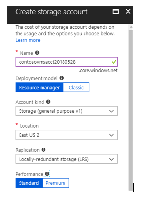

3. With the network and storage account in place, they create a vault (ContosoMigrationVault), and place it in the **ContosoFailoverRG** resource group, in the primary East US 2 region.

    

**Need more help?**

[Learn about](https://docs.microsoft.com/azure/site-recovery/tutorial-prepare-azure) setting up Azure for Site Recovery.

## Step 2: Prepare on-premises VMware for Site Recovery

Contoso admins prepare the on-premises VMware infrastructure as follows:

- They create an account on the vCenter server, to automate VM discovery.
- They create an account that allows automatic installation of the Mobility service on VMware VMs that will be replicated.
- They prepare on-premises VMs, so that they can connect to Azure VMs when they're created after the migration.

### Prepare an account for automatic discovery

Site Recovery needs access to VMware servers to:

- Automatically discover VMs. At least a read-only account is required.
- Orchestrate replication, failover, and failback. You need an account that can run operations such as creating and removing disks, and turning on VMs.

Contoso admins set up the account as follows:

1. They create a role at the vCenter level.
2. They then assign that role the required permissions.

### Prepare an account for Mobility service installation

The Mobility service must be installed on each VM that Contoso wants to migrate.

- Site Recovery can do an automatic push installation of this component when you enable replication for the VMs.
- For automatic installation. Site Recovery needs an account with permissions to access the VM. 
- Account details are input during replication setup. 
- The account can be domain or local account, as long as it has installation permissions.

### Prepare to connect to Azure VMs after failover

After failover to Azure, Contoso wants to be able to connect to the Azure VMs. To do this, Contoso admins need to do the following:

- To access over the internet, they enable SSH on the on-premises Linux VM before the migration.  For Ubuntu this can be completed using the following command: **Sudo apt-get ssh install -y**.
- After the failover, they should check **Boot diagnostics** to view a screenshot of the VM.
- If this doesn't work, they need to verify that the VM is running, and review these [troubleshooting tips](http://social.technet.microsoft.com/wiki/contents/articles/31666.troubleshooting-remote-desktop-connection-after-failover-using-asr.aspx).

**Need more help?**

- [Learn about](https://docs.microsoft.com/azure/site-recovery/vmware-azure-tutorial-prepare-on-premises#prepare-an-account-for-automatic-discovery) creating and assigning a role for automatic discovery.
- [Learn about](https://docs.microsoft.com/azure/site-recovery/vmware-azure-tutorial-prepare-on-premises#prepare-an-account-for-mobility-service-installation) creating an account for push installation of the Mobility service.

## Step 3: Provision Azure Database for MySQL

Contoso admins provision a MySQL database instance in the primary East US 2 region.

1. In the Azure portal, they create an Azure Database for MySQL resource. 

    

2. They add the name **contosoosticket** for the Azure database. They add the database to the production resource group **ContosoRG**, and specify credentials for it.
3. The on-premises MySQL database is version 5.7, so they select this version for compatibility. They use the default sizes, which match their database requirements.

     

4. For **Backup Redundancy Options**, they select to use **Geo-Redundant**. This option allows them to restore the database in their secondary Central US region if an outage occurs. They can only configure this option when they provision the database.

     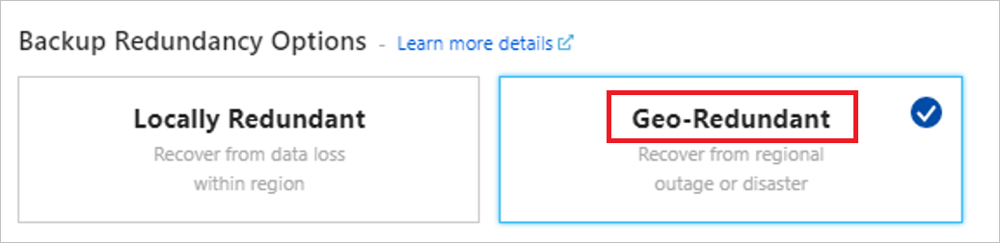

4. In the **VNET-PROD-EUS2** network > **Service endpoints**, they add a service endpoint (a database subnet) for the SQL service.

    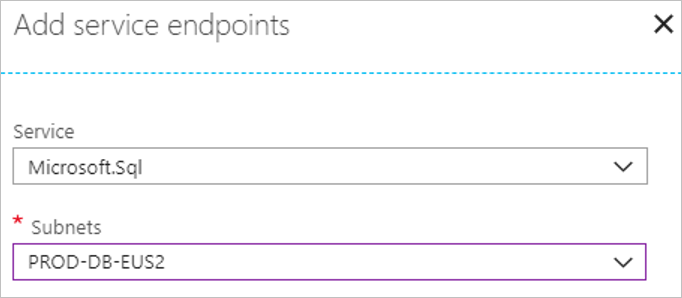

5. After adding the subnet, they create a virtual network rule that allows access from the database subnet in the production network.

    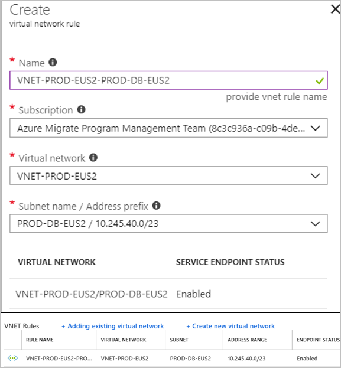

## Step 4: Replicate the on-premises VMs

Before they can migrate the web VM to Azure, Contoso admins set up and enable replication.

### Set a protection goal

1. In the vault, under the vault name (ContosoVMVault) they set a replication goal (**Getting Started** > **Site Recovery** > **Prepare infrastructure**.
2. They specify that their machines are located on-premises, that they're VMware VMs, and that they want to replicate to Azure.

    

### Confirm deployment planning

To continue, they confirm that they've completed deployment planning, by selecting **Yes, I have done it**. Contoso are only migrating a single VM in this scenario, and don't need deployment planning.

### Set up the source environment

Contoso admins now configure the source environment. To do this, using an OVF template they deploy a Site Recovery configuration server as a highly available, on-premises VMware VM. After the configuration server is up and running, they register it in the vault.

The configuration server runs a number of components:

- The configuration server component that coordinates communications between on-premises and Azure and manages data replication.
- The process server that acts as a replication gateway. It receives replication data; optimizes it with caching, compression, and encryption; and sends it to Azure storage.
- The process server also installs Mobility Service on VMs you want to replicate and performs automatic discovery of on-premises VMware VMs.

Contoso admins do this as follows:

1. They download the OVF template from **Prepare Infrastructure** > **Source** > **Configuration Server**.
    
    

2. They import the template into VMware to create the VM, and deploy the VM.

    

3. When they turn on the VM for the first time, it boots up into a Windows Server 2016 installation experience. They accept the license agreement, and enter an administrator password.
4. After the installation finishes, they sign in to the VM as the administrator. At first sign-in, the Azure Site Recovery Configuration Tool runs by default.
5. In the tool, they specify a name to use for registering the configuration server in the vault.
6. The tool checks that the VM can connect to Azure.
7. After the connection is established, they sign in to the Azure subscription. The credentials must have access to the vault in which they'll register the configuration server.

    

8. The tool performs some configuration tasks and then reboots.
9. They sign in to the machine again, and the Configuration Server Management Wizard starts automatically.
10. In the wizard, they select the NIC to receive replication traffic. This setting can't be changed after it's configured.
11. They select the subscription, resource group, and vault in which to register the configuration server.

     

12. Now, they download and install MySQL Server, and VMWare PowerCLI. 
13. After validation, they specify the FQDN or IP address of the vCenter server or vSphere host. They leave the default port, and specify a friendly name for the vCenter server.
14. They input the account that they created for automatic discovery, and the credentials that Site Recovery will use to automatically install the Mobility Service. 

    

14. After registration finishes, in the Azure portal, they check that the configuration server and VMware server are listed on the **Source** page in the vault. Discovery can take 15 minutes or more. 
15. With everything in place, Site Recovery connects to VMware servers, and discovers VMs.

### Set up the target

Now Contoso admins input target replication settings.

1. In **Prepare infrastructure** > **Target**, they select the target settings.
2. Site Recovery checks that there's an Azure storage account and network in the specified target.

### Create a replication policy

With the source and target set up, Contoso admins are ready to create a replication policy.

1. In  **Prepare infrastructure** > **Replication Settings** > **Replication Policy** >  **Create and Associate**, they create a policy **ContosoMigrationPolicy**.
2. They use the default settings:
    - **RPO threshold**: Default of 60 minutes. This value defines how often recovery points are created. An alert is generated if continuous replication exceeds this limit.
    - **Recovery point retention**. Default of 24 hours. This value specifies how long the retention window is for each recovery point. Replicated VMs can be recovered to any point in a window.
    - **App-consistent snapshot frequency**. Default of one hour. This value specifies the frequency at which application-consistent snapshots are created.
 
        

5. The policy is automatically associated with the configuration server. 

    

**Need more help?**

- You can read a full walkthrough of all these steps in [Set up disaster recovery for on-premises VMware VMs](https://docs.microsoft.com/azure/site-recovery/vmware-azure-tutorial).
- Detailed instructions are available to help you [set up the source environment](https://docs.microsoft.com/azure/site-recovery/vmware-azure-set-up-source), [deploy the configuration server](https://docs.microsoft.com/azure/site-recovery/vmware-azure-deploy-configuration-server), and [configure replication settings](https://docs.microsoft.com/azure/site-recovery/vmware-azure-set-up-replication).
- [Learn more](https://docs.microsoft.com/azure/virtual-machines/extensions/agent-linux) about the Azure Guest agent for Linux.

### Enable replication for the Web VM

Now Contoso admins can start replicating the **OSTICKETWEB** VM.

1. In **Replicate application** > **Source** > **+Replicate** they select the source settings.
2. They indicate that they want to enable virtual machines, and select the source settings, including the vCenter server, and the configuration server.

    

3. Now they specify the target settings. These include the resource group and network in which the Azure VM will be located after failover, and the storage account in which replicated data will be stored. 

     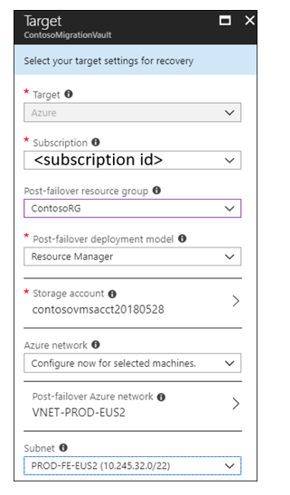

3. They select **OSTICKETWEB** for replication. 

    

4. In the VM properties, they select the account that should be used to automatically install the Mobility Service on the VM.

     

5. in **Replication settings** > **Configure replication settings**, they check that the correct replication policy is applied, and select **Enable Replication**. The Mobility service will be automatically installed.
6.  They track replication progress in **Jobs**. After the **Finalize Protection** job runs, the machine is ready for failover.

**Need more help?**

You can read a full walkthrough of all these steps in [Enable replication](https://docs.microsoft.com/azure/site-recovery/vmware-azure-enable-replication).

## Step 5: Migrate the database

Contoso admins migrate the database using backup and restore, with MySQL tools. They install MySQL Workbench, back up the database from OSTICKETMYSQL, and then restore it to Azure Database for MySQL Server.

### Install MySQL Workbench

1. They check the [prerequisites and downloads MySQL Workbench](https://dev.mysql.com/downloads/workbench/?utm_source=tuicool).
2. They install MySQL Workbench for Windows in accordance with the [installation instructions](https://dev.mysql.com/doc/workbench/en/wb-installing.html).
3. In MySQL Workbench, they create a MySQL connection to OSTICKETMYSQL. 

    

4. They export the database as **osticket**, to a local self-contained file.

    

5. After the database has been backed up locally, they create a connection to the Azure Database for MySQL instance.

    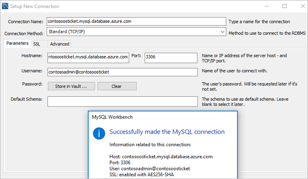

6. Now, they can import (restore) the database in the Azure MySQL instance, from the self-contained file. A new schema (osticket) is created for the instance.

    

## Step 6: Migrate the VMs with Site Recovery

Finally, Contoso admins run a quick test failover, and then migrate the VM.

### Run a test failover

Running a test failover helps verify that everything's working as expected, before the migration. 

1. They run a test failover to the latest available point in time (**Latest processed**).
2. They select **Shut down machine before beginning failover**, so that Site Recovery attempts to shut down the source VM before triggering the failover. Failover continues even if shutdown fails. 
3. Test failover runs: 

    - A prerequisites check runs to make sure all of the conditions required for migration are in place.
    - Failover processes the data, so that an Azure VM can be created. If select the latest recovery point, a recovery point is created from the data.
    - An Azure VM is created using the data processed in the previous step.

3. After the failover finishes, the replica Azure VM appears in the Azure portal. They check that the VM is the appropriate size, that it's connected to the right network, and that it's running. 
4. After verifying, they clean up the failover, and record and save any observations.

### Migrate the VM

To migrate the VM, Contoso admins creats a recovery plan that includes the VM, and fail over the plan to Azure.

1. They create a plan, and add **OSTICKETWEB** to it.

    

2. They run a failover on the plan. They select the latest recovery point, and specify that Site Recovery should try to shut down the on-premises VM before triggering the failover. They can follow the failover progress on the **Jobs** page.

    

3. During the failover, vCenter Server issues commands to stop the two VMs running on the ESXi host.

    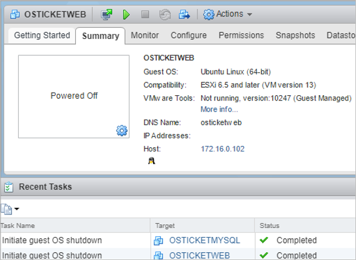

4. After the failover, they verify that the Azure VM appears as expected in the Azure portal.

      

5. After checking the VM, they complete the migration. This stops replication for the VM, and stops Site Recovery billing for the VM.

    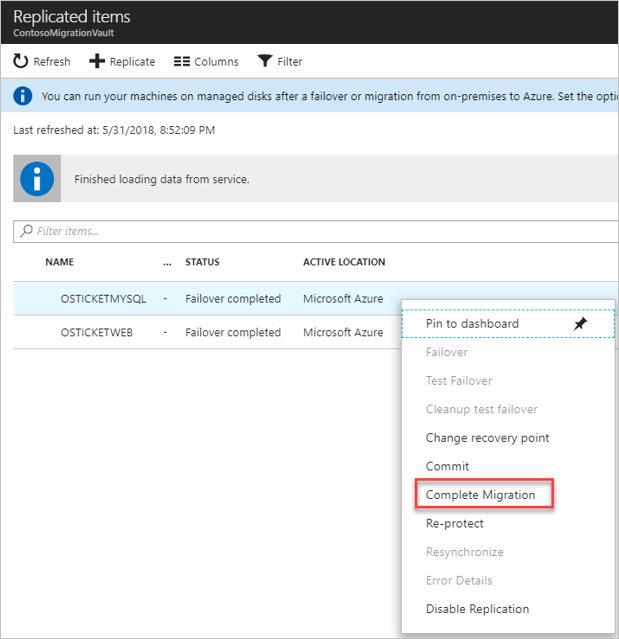

**Need more help?**

- [Learn about](https://docs.microsoft.com/azure/site-recovery/tutorial-dr-drill-azure) running a test failover. 
- [Learn](https://docs.microsoft.com/azure/site-recovery/site-recovery-create-recovery-plans) how to create a recovery plan.
- [Learn about](https://docs.microsoft.com/azure/site-recovery/site-recovery-failover) failing over to Azure.

### Connect the VM to the database

As the final step in the migration process, Contoso admins update the connection string of the app to point to the Azure Database for MySQL. 

1. They make an SSH connection to the OSTICKETWEB VM using Putty or another SSH client. The VM is private so they connect using the private IP address.

    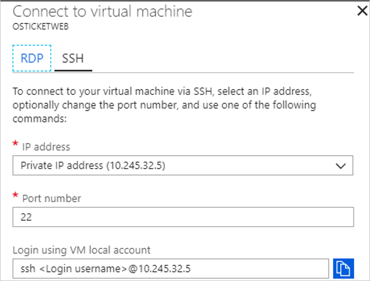  

      

2. They update settings so that the **OSTICKETWEB** VM can communicate with the **OSTICKETMYSQL** database. Currently the configuration is hardcoded with the on-premises IP address 172.16.0.43.

    **Before the update**
    
      

    **After the update**
    
    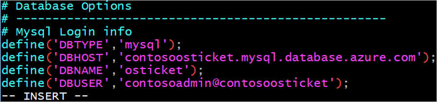 
    
    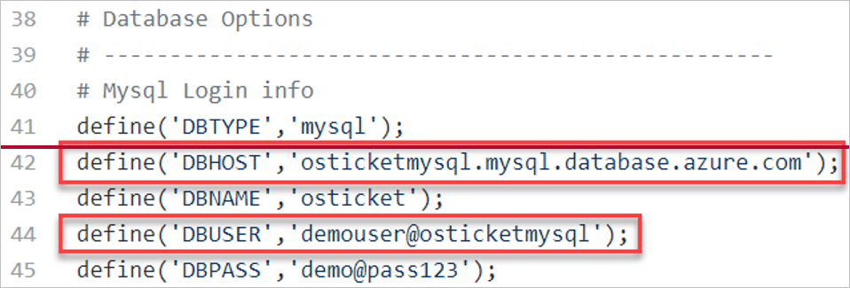 

3. They restart the service with **systemctl restart apache2**.

     

4. Finally, they update the DNS records for **OSTICKETWEB**, on one of the Contoso domain controllers.

     

##  Clean up after migration

With migration complete, the osTicket app tiers are running on Azure VMs.

Now, Contoso needs to do the following: 
- Remove the VMware VMs from the vCenter inventory
- Remove the on-premises VMs from local backup jobs.
- Update internal documentation show new locations and IP addresses. 
- Review any resources that interact with the on-premises VMs, and update any relevant settings or documentation to reflect the new configuration.
- Contoso used the Azure Migrate service with dependency mapping to assess the **OSTICKETWEB** VM for migration. They should now remove the agents (Microsoft Monitoring Agent/Dependency Agent) they installed for this purpose, from the VM.

## Review the deployment

With the app now running, Contoso need to fully operationalize and secure their new infrastructure.

### Security

The Contoso security team review the VM and database to determine any security issues.

- They review the Network Security Groups (NSGs) for the VM, to control access. NSGs are used to ensure that only traffic allowed to the application can pass.
- They consider securing the data on the VM disks using Disk encryption and Azure KeyVault.
- Communication between the VM and database instance isn't configured for SSL. They will need to do this to ensure that database traffic can't be hacked.

[Read more](https://docs.microsoft.com/azure/security/azure-security-best-practices-vms#vm-authentication-and-access-control) about security practices for VMs.

### BCDR

For business continuity and disaster recovery, Contoso takes the following actions:

- **Keep data safe**: Contoso backs up the data on the app VM using the Azure Backup service. [Learn more](https://docs.microsoft.com/azure/backup/backup-introduction-to-azure-backup?toc=%2fazure%2fvirtual-machines%2flinux%2ftoc.json). They don't need to configure backup for the database. Azure Database for MySQL automatically creates and stores server backups. They selected to use geo-redundancy for the database, so it's resilient and production-ready.
- **Keep apps up and running**: Contoso replicates the app VMs in Azure to a secondary region using Site Recovery. [Learn more](https://docs.microsoft.com/azure/site-recovery/azure-to-azure-quickstart).

### Licensing and cost optimization

- After deploying resources, Contoso assigns Azure tags, in accordance with decisions they made during the [Azure infrastructure](contoso-migration-infrastructure.md#set-up-tagging) deployment.
- There are no licensing issues for the Contoso Ubuntu servers.
- Contoso will enable Azure Cost Management licensed by Cloudyn, a Microsoft subsidiary. It's a multi-cloud cost management solution that helps you to utilize and manage Azure and other cloud resources.  [Learn more](https://docs.microsoft.com/azure/cost-management/overview) about Azure Cost Management.

## Next steps

In this scenario we showed the final rehost scenario. Contoso migrated the frontend VM of the on-premises Linux osTicket app to an Azure VM, and migrated the app database to an Azure MySQL instance.

In the next set of tutorials in the migration series, we're going to show you how Contoso performed a more complex set of migrations, involving app refactoring, rather than simple lift-and-shift migrations.
