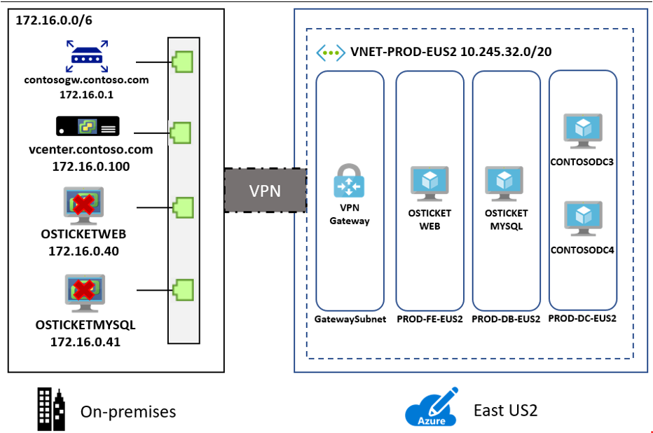
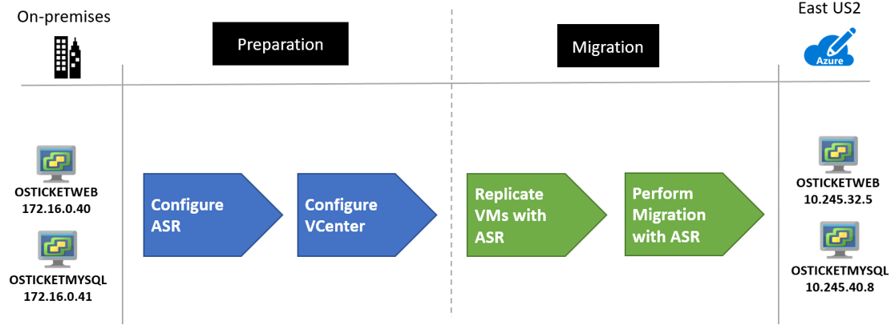
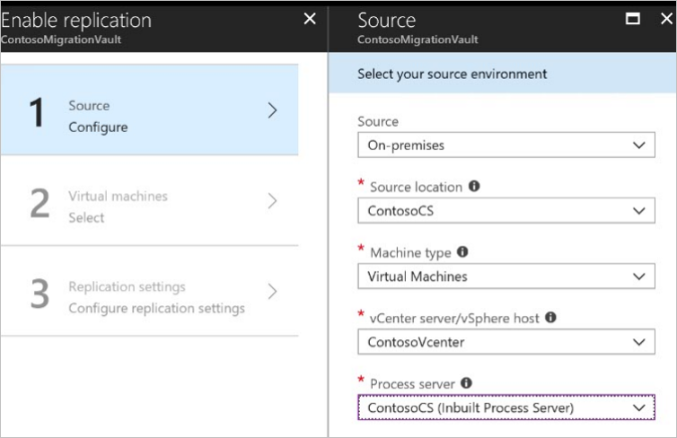
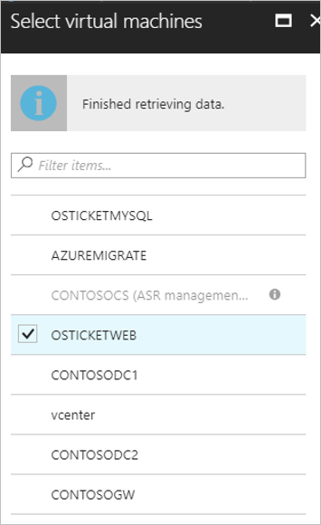
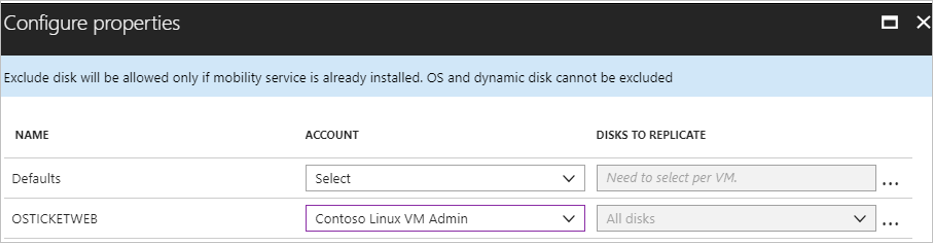
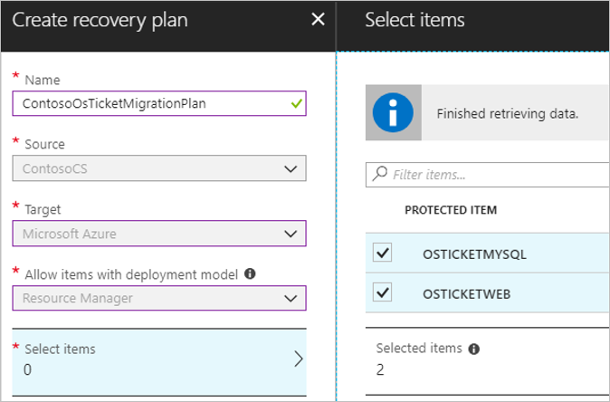
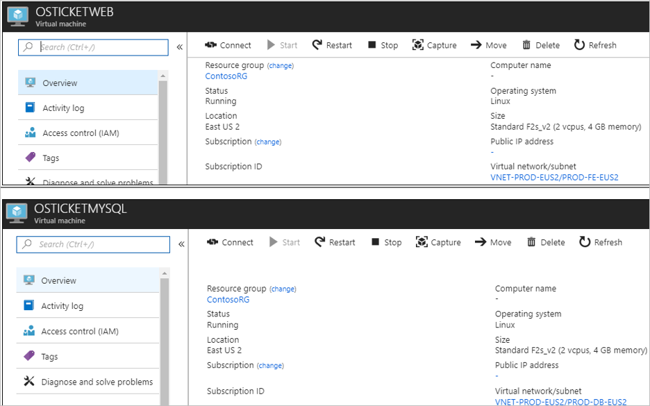
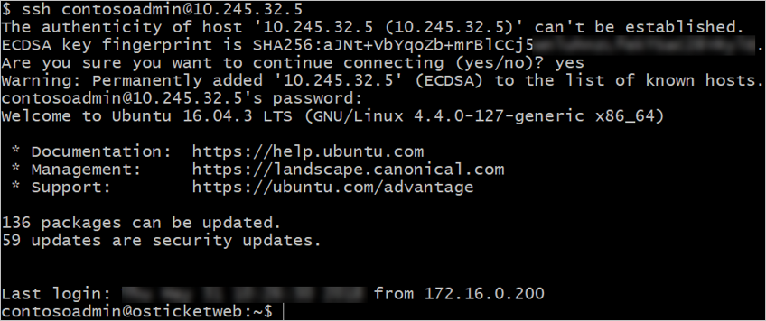
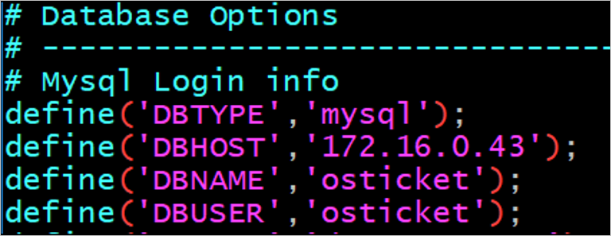
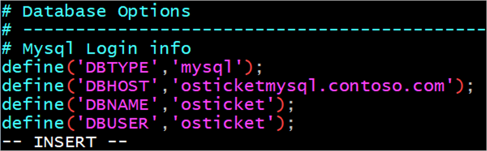

# Contoso migration: Rehost an on-premises Linux app to Azure VMs

This article shows how Contoso is rehosting an on-premises Linux-based service desk app (**osTicket**), to Azure IaaS VMs.

This document is one in a series of articles that document how the fictitious company Contoso migrates its on-premises resources to the Microsoft Azure cloud. The series includes background information, and a set of scenarios that illustrate how to set up a migration infrastructure, and run different types of migrations. Scenarios grow in complexity. We'll add additional articles over time.

**Article** | **Details** | **Status**
--- | --- | ---
[Article 1: Overview](contoso-migration-overview.md) | Overview of the article series, Contoso's migration strategy, and the sample apps that are used in the series. | Available
[Article 2: Deploy Azure infrastructure](contoso-migration-infrastructure.md) | Contoso prepares its on-premises infrastructure and its Azure infrastructure for migration. The same infrastructure is used for all migration articles in the series. | Available
[Article 3: Assess on-premises resources for migration to Azure](contoso-migration-assessment.md)  | Contoso runs an assessment of its on-premises SmartHotel360 app running on VMware. Contoso assesses app VMs using the Azure Migrate service, and the app SQL Server database using Data Migration Assistant. | Available
[Article 4: Rehost an app on an Azure VM and SQL Database Managed Instance](contoso-migration-rehost-vm-sql-managed-instance.md) | Contoso runs a lift-and-shift migration to Azure for its on-premises SmartHotel360 app. Contoso migrates the app front-end VM using [Azure Site Recovery](https://docs.microsoft.com/azure/site-recovery/site-recovery-overview). Contoso migrates the app database to an Azure SQL Database Managed Instance using the [Azure Database Migration Service](https://docs.microsoft.com/azure/dms/dms-overview). | Available	
[Article 5: Rehost an app on Azure VMs](contoso-migration-rehost-vm.md) | Contoso migrates its SmartHotel360 app VMs to Azure VMs using the Site Recovery service. | Available
[Article 6: Rehost an app on Azure VMs and in a  SQL Server AlwaysOn availability group](contoso-migration-rehost-vm-sql-ag.md) | Contoso migrates the SmartHotel360 app. Contoso uses Site Recovery to migrate the app VMs. It uses the Database Migration Service to migrate the app database to a SQL Server cluster that's protected by an AlwaysOn availability group. | Available	
Article 7: Rehost a Linux app on Azure VMs | Contoso completes a lift-and-shift migration of the Linux osTicket app to Azure VMs, using Azure Site Recovery | This article
[Article 8: Rehost a Linux app on Azure VMs and Azure MySQL](contoso-migration-rehost-linux-vm-mysql.md) | Contoso migrates the Linux osTicket app to Azure VMs using Azure Site Recovery, and migrates the app database to an Azure MySQL Server instance using MySQL Workbench. | Available
[Article 9: Refactor an app on Azure Web Apps and Azure SQL database](contoso-migration-refactor-web-app-sql.md) | Contoso migrates the SmartHotel360 app to an Azure Web App, and migrates the app database to an Azure SQL Server instance with Database Migration Assistant | Available
[Article 10: Refactor a Linux app on Azure Web Apps and Azure MySQL](contoso-migration-refactor-linux-app-service-mysql.md) | Contoso migrates its Linux osTicket app to an Azure web app on multiple Azure regions using Azure Traffic Manager, integrated with GitHub for continuous delivery. Contoso migrates the app database to an Azure Database for MySQL instance. | Available	
[Article 11: Refactor TFS on Azure DevOps Services](contoso-migration-tfs-vsts.md) | Contoso migrates its on-premises Team Foundation Server deployment to Azure DevOps Services in Azure. | Available
[Article 12: Rearchitect an app on Azure containers and Azure SQL Database](contoso-migration-rearchitect-container-sql.md) | Contoso migrates its SmartHotel app to Azure. Then, it rearchitects the app web tier as a Windows container running in Azure Service Fabric, and the database with Azure SQL Database. | Available
[Article 13: Rebuild an app in Azure](contoso-migration-rebuild.md) | Contoso rebuilds its SmartHotel app by using a range of Azure capabilities and services, including Azure App Service, Azure Kubernetes Service (AKS), Azure Functions, Azure Cognitive Services, and Azure Cosmos DB. | Available
[Article 14: Scale a migration to Azure](contoso-migration-scale.md) | After trying out migration combinations, Contoso prepares to scale to a full migration to Azure. | Available

In this article, Contoso will migrate the two-tier **osTicket** app, running on Linux Apache MySQL PHP (LAMP) to Azure. The app VMs will be migrated using the Azure Site Recovery service. If you'd like to use this open-source app, you can download it from [GitHub](https://github.com/osTicket/osTicket).

## Business drivers

The IT Leadership team has worked closely with business partners to understand what they want to achieve with this migration:

- **Address business growth**: Contoso is growing, and as a result there's pressure on the on-premises systems and infrastructure.
- **Limit risk**: The service desk app is critical for the Contoso business. Contoso wants to move it to Azure with zero risk.
- **Extend**:  Contoso don't want to change the app right now. It simply wants to ensure that the app is stable.

## Migration goals

The Contoso cloud team has pinned down goals for this migration, to determine the best migration method:

- After migration, the app in Azure should have the same performance capabilities as it does today in their on-premises VMWare environment.  The app will remain as critical in the cloud as it is on-premises. 
- Contoso doesn’t want to invest in this app.  It is important to the business, but in its current form Contoso simply wants to move it safely to the cloud.
- Contoso doesn't want to change the ops model for this app. It wants to interact with the app in the cloud in the same way that they do now.
- Contoso doesn't want to change app functionality. Only the app location will change.
- Having completed a couple of Windows app migrations, Contoso wants to learn how to use a Linux-based infrastructure in Azure.

## Solution design

After pinning down goals and requirements, Contoso designs and review a deployment solution, and identifies the migration process, including the Azure services that Contoso will use for the migration.

### Current app

- The OSTicket app is tiered across two VMs (**OSTICKETWEB** and **OSTICKETMYSQL**).
- The VMs are located on VMware ESXi host **contosohost1.contoso.com** (version 6.5).
- The VMware environment is managed by vCenter Server 6.5 (**vcenter.contoso.com**), running on a VM.
- Contoso has an on-premises datacenter (**contoso-datacenter**), with an on-premises domain controller (**contosodc1**)

### Proposed architecture

- Since the app is a production workload, the VMs in Azure will reside in the production resource group **ContosoRG**.
- The VMs will be migrated to the primary region (East US 2) and placed in the production network (VNET-PROD-EUS2):
    - The web VM will reside in the frontend subnet (PROD-FE-EUS2).
    - The database VM will reside in the database subnet (PROD-DB-EUS2).
- The on-premises VMs in the Contoso datacenter will be decommissioned after the migration is done.

 

### Solution review

Contoso evaluates the proposed design by putting together a pros and cons list.

**Consideration** | **Details**
--- | ---
**Pros** | Both the app VMs will be moved to Azure without changes, making the migration simple.   Since Contoso is using lift-and-shift for both app VMs, no special configuration or migration tools are needed for the app database.   Contoso will retain full control of the app VMs in Azure.  /br> The app VMs are running Ubuntu 16.04-TLS, which is a endorsed Linux distribution. [Learn more](https://docs.microsoft.com/azure/virtual-machines/linux/endorsed-distros).
**Cons** | The web and data tier of the app will remain a single point of failover.    Contoso will need to continue supporting the app as Azure VMs rather than moving to a managed service such as Azure App Service and Azure Database for MySQL.   Contoso is aware that by keeping things simple with a lift-and-shift VM migration, they're not taking full advantage of the features provided by [Azure Database for MySQL](https://docs.microsoft.com/azure/mysql/overview) (built-in high availability, predictable performance, simple scaling, automatic backups and built-in security).

### Migration process

Contoso will migrate as follows:

1. As a first step, Contoso sets up the Azure and on-premises infrastructure needed to deploy Site Recovery.
2. After preparing Azure and on-premises components, Contoso sets up and enables replication for the VMs.
3. After replication is working, Contoso migrates the VMs by failing them over to Azure.

### Azure services

**Service** | **Description** | **Cost**
--- | --- | ---
[Azure Site Recovery](https://docs.microsoft.com/azure/site-recovery/) | The service orchestrates and manages migration and disaster recovery for Azure VMs, and on-premises VMs and physical servers.  | During replication to Azure, Azure Storage charges are incurred.  Azure VMs are created, and incur charges, when failover occurs. [Learn more](https://azure.microsoft.com/pricing/details/site-recovery/) about charges and pricing.

 
## Prerequisites

Here's what Contoso needs for this scenario.

**Requirements** | **Details**
--- | ---
**Azure subscription** | Contoso created subscriptions in an early article in this series. If you don't have an Azure subscription, create a [free account](https://azure.microsoft.com/pricing/free-trial/).   If you create a free account, you're the administrator of your subscription and can perform all actions.   If you use an existing subscription and you're not the administrator, you need to work with the admin to assign you Owner or Contributor permissions.   If you need more granular permissions, review [this article](../site-recovery/site-recovery-role-based-linked-access-control.md). 
**Azure infrastructure** | Contoso set up their Azure infrastructure as described in [Azure infrastructure for migration](contoso-migration-infrastructure.md).   Learn more about specific [network](https://docs.microsoft.com/azure/site-recovery/vmware-physical-azure-support-matrix#network) and [storage](https://docs.microsoft.com/azure/site-recovery/vmware-physical-azure-support-matrix#storage) requirements for Site Recovery.
**On-premises servers** | The on-premises vCenter server should be running version 5.5, 6.0, or 6.5   An ESXi host running version 5.5, 6.0 or 6.5   One or more VMware VMs running on the ESXi host.
**On-premises VMs** | [Review Linux machines](https://docs.microsoft.com//azure/site-recovery/vmware-physical-azure-support-matrix#replicated-machines) that are supported for migration with Site Recovery.   Verify supported [Linux file and storage systems](https://docs.microsoft.com/azure/site-recovery/vmware-physical-azure-support-matrix#linux-file-systemsguest-storage).   VMs must meet [Azure requirements](https://docs.microsoft.com/azure/site-recovery/vmware-physical-azure-support-matrix#azure-vm-requirements).

## Scenario steps

Here's how Contoso will complete the migration:

> [!div class="checklist"]
> * **Step 1: Prepare Azure for Site Recovery**: Contoso creates an Azure storage account to hold replicated data, and creates a Recovery Services vault.
> * **Step 2: Prepare on-premises VMware for Site Recovery**: Contoso prepares accounts to be used for VM discovery and agent installation, and prepares to connect to Azure VMs after failover.
> * **Step 3: Replicate VMs**: Contoso sets up the source and target migration environment, creates a replication policy, and starts replicating VMs to Azure storage.
> * **Step 4: Migrate the VMs with Site Recovery**: Contoso runs a test failover to make sure everything's working, and then runs a full failover to migrate the VMs to Azure.

## Step 1: Prepare Azure for the Site Recovery service

Contoso needs a couple of Azure components for Site Recovery:

- A new Azure storage account to hold replicated data. 
- A Recovery Services vault in Azure.
- A VNet in which failed over resources are located. Contoso already created the VNet during [Azure infrastructure deployment](contoso-migration-infrastructure.md), so they just need to create a storage account and vault.

1. Contoso admins create an Azure storage account (contosovmsacc20180528) in the East US 2 region.

    - The storage account must be in the same region as the Recovery Services vault.
    - They use a general purpose account, with standard storage, and LRS replication.

    

2. With the network and storage account in place, they create a vault (ContosoMigrationVault), and place it in the **ContosoFailoverRG** resource group, in the primary East US 2 region.

    

**Need more help?**

[Learn about](https://docs.microsoft.com/azure/site-recovery/tutorial-prepare-azure) setting up Azure for Site Recovery.

## Step 2: Prepare on-premises VMware for Site Recovery

Contoso admins prepare the on-premises VMware infrastructure as follows:

- They create an account on the vCenter server or vSphere ESXi host, to automate VM discovery.
- They create an account that allows automatic installation of the Mobility service on VMware VMs that you want to replicate.
- They prepare on-premises VMs, so that they can connect to Azure VMs when they're created after migration.

### Prepare an account for automatic discovery

Site Recovery needs access to VMware servers to:

- Automatically discover VMs. At least a read-only account is required.
- Orchestrate replication, failover, and failback. You need an account that can run operations such as creating and removing disks, and turning on VMs.

Contoso admins set up the account as follows:

1. They create a role at the vCenter level.
2. They assign that role the required permissions.

### Prepare an account for Mobility service installation

The Mobility service must be installed on the Linux VMs that will be migrated.

- Site Recovery can do an automatic push installation of this component when replication is enabled for VMs.
- For automatic push installation, they need to prepare an account that Site Recovery will use to access the VMs.
- Accounts details are input during replication setup. 
- The account can be domain or local account, with permissions to install on VMs.

### Prepare to connect to Azure VMs after failover

After failover to Azure, Contoso wants to be able to connect to the replicated VMs in Azure. To do this, there's a couple of things that the Contoso admins need to do:

- To access Azure VMs over the internet, they enable SSH on the on-premises Linux VM before migration.  For Ubuntu this can be completed using the following command: **Sudo apt-get ssh install -y**.
- After they run the migration (failover), they can check **Boot diagnostics** to view a screenshot of the VM.
- If this doesn't work, they'll need to check that the VM is running, and review these [troubleshooting tips](http://social.technet.microsoft.com/wiki/contents/articles/31666.troubleshooting-remote-desktop-connection-after-failover-using-asr.aspx).

**Need more help?**

- [Learn about](https://docs.microsoft.com/azure/site-recovery/vmware-azure-tutorial-prepare-on-premises#prepare-an-account-for-automatic-discovery) creating and assigning a role for automatic discovery.
- [Learn about](https://docs.microsoft.com/azure/site-recovery/vmware-azure-tutorial-prepare-on-premises#prepare-an-account-for-mobility-service-installation) creating an account for push installation of the Mobility service.

## Step 3: Replicate the on-premises VMs

Before they can migrate the web VM to Azure, Contoso admins set up and enable replication.

### Set a protection goal

1. In the vault, under the vault name (ContosoVMVault) they set a replication goal (**Getting Started** > **Site Recovery** > **Prepare infrastructure**.
2. They specify that their machines are located on-premises, that they're VMware VMs, and that they want to replicate to Azure.
    

### Confirm deployment planning

To continue, they confirm that they've completed deployment planning, by selecting **Yes, I have done it**. Contoso are only migrating a single VM in this scenario, and don't need deployment planning.

### Set up the source environment

Contoso admins now need to configure the source environment. To do this, they download an OVF template and use it to deploy the Site Recovery configuration server as a highly available, on-premises VMware VM. After the configuration server is up and running, they register it in the vault.

The configuration server runs a number of components:

- The configuration server component that coordinates communications between on-premises and Azure and manages data replication.
- The process server that acts as a replication gateway. It receives replication data; optimizes it with caching, compression, and encryption; and sends it to Azure storage.
- The process server also installs Mobility Service on VMs you want to replicate and performs automatic discovery of on-premises VMware VMs.

Contoso admins perform these steps as follows:

1. They download the OVF template from **Prepare Infrastructure** > **Source** > **Configuration Server**.
    
    

2. They import the template into VMware to create the VM, and deploy the VM.

    

3. When they turn on the VM for the first time, it boots up into a Windows Server 2016 installation experience. They accept the license agreement, and enter an administrator password.
4. After the installation finishes, they sign into the VM as an administrator. At first sign-in, the Azure Site Recovery Configuration Tool runs by default.
5. In the tool, they specify a name to use for registering the configuration server in the vault.
6. The tool checks that the VM can connect to Azure. After the connection is established, they sign in to the Azure subscription. The credentials must have access to the vault in which you want to register the configuration server.

    

7. The tool performs some configuration tasks and then reboots.
8. They sign in to the machine again, and the Configuration Server Management Wizard starts automatically.
9. In the wizard, they select the NIC to receive replication traffic. This setting can't be changed after it's configured.
10. They select the subscription, resource group, and vault in which to register the configuration server.

     

11. They then download and install MySQL Server, and VMWare PowerCLI. 
12. After validation, they specify the FQDN or IP address of the vCenter server or vSphere host. They leave the default port, and specify a friendly name for the vCenter server.
13. They specify the account that they created for automatic discovery, and the credentials that should be used to automatically install the Mobility Service.

    

14. After registration finishes, in the Azure portal, they check that the configuration server and VMware server are listed on the **Source** page in the vault. Discovery can take 15 minutes or more. 
15. Site Recovery then connects to VMware servers, and discovers VMs.

### Set up the target

Now Contoso admins configure the target replication settings.

1. In **Prepare infrastructure** > **Target**, they select the target settings.
2. Site Recovery checks that there's an Azure storage account and network in the specified target.

### Create a replication policy

After the source and target are set up, they're ready to create a replication policy.

1. In  **Prepare infrastructure** > **Replication Settings** > **Replication Policy** >  **Create and Associate**, they create a policy **ContosoMigrationPolicy**.
2. They use the default settings:
    - **RPO threshold**: Default of 60 minutes. This value defines how often recovery points are created. An alert is generated if continuous replication exceeds this limit.
    - **Recovery point retention**. Default of 24 hours. This value specifies how long the retention window is for each recovery point. Replicated VMs can be recovered to any point in a window.
    - **App-consistent snapshot frequency**. Default of one hour. This value specifies the frequency at which application-consistent snapshots are created.
 
        

5. The policy is automatically associated with the configuration server. 

    

**Need more help?**

- You can read a full walkthrough of all these steps in [Set up disaster recovery for on-premises VMware VMs](https://docs.microsoft.com/azure/site-recovery/vmware-azure-tutorial).
- Detailed instructions are available to help you [set up the source environment](https://docs.microsoft.com/azure/site-recovery/vmware-azure-set-up-source), [deploy the configuration server](https://docs.microsoft.com/azure/site-recovery/vmware-azure-deploy-configuration-server), and [configure replication settings](https://docs.microsoft.com/azure/site-recovery/vmware-azure-set-up-replication).
- [Learn more](https://docs.microsoft.com/azure/virtual-machines/extensions/agent-linux) about the Azure Guest agent for Linux.

**Need more help?**

- You can read a full walkthrough of all these steps in [Set up disaster recovery for on-premises VMware VMs](https://docs.microsoft.com/azure/site-recovery/vmware-azure-tutorial).
- Detailed instructions are available to help you [set up the source environment](https://docs.microsoft.com/azure/site-recovery/vmware-azure-set-up-source), [deploy the configuration server](https://docs.microsoft.com/azure/site-recovery/vmware-azure-deploy-configuration-server), and [configure replication settings](https://docs.microsoft.com/azure/site-recovery/vmware-azure-set-up-replication).
- [Learn more](https://docs.microsoft.com/azure/virtual-machines/extensions/agent-linux) about the Azure Guest agent for Linux.

### Enable replication for OSTICKETWEB

Now Contoso admins can start replicating the **OSTICKETWEB** VM.

1. In **Replicate application** > **Source** > **+Replicate** they select the source settings.
2. They select that they want to enable virtual machines, select the source settings, including the vCenter server, and the configuration server.

    

3. They specify the target settings, including the resource group and VNet in which the Azure VM will be located after failover, and the storage account in which replicated data will be stored.

     

3. They select the **OSTICKETWEB** VM for replication. 

    - At this stage they select **OSTICKETWEB** only, because the VNet and subnet must both be selected, and the VMs aren't in the same subnet.
    - Site Recovery automatically installs the Mobility service when replication is enabled for the VM.

    

4. In the VM properties, they select the account that's used by the process server to automatically install Mobility Service on the machine.

     

5. in **Replication settings** > **Configure replication settings**, they check that the correct replication policy is applied, and select **Enable Replication**.
6.  They track replication progress in **Jobs**. After the **Finalize Protection** job runs, the machine is ready for failover.

### Enable replication for OSTICKETMYSQL

Now Contoso admins can start replicating **OSTICKETMYSQL**.

1. In **Replicate application** > **Source** > **+Replicate** they select the source and target settings.
2. They select the **OSTICKETMYSQL** VM for replication, and select the account to use for Mobility service installation.

    

3. They apply the same replication policy that was used for OSTICKETWEB, and enable replication.  

**Need more help?**

You can read a full walkthrough of all these steps in [Enable replication](https://docs.microsoft.com/azure/site-recovery/vmware-azure-enable-replication).

## Step 4: Migrate the VMs 

Contoso admins run a quick test failover, and then migrate the VMs.

### Run a test failover

Running a test failover helps ensure that everything's working as expected before the migration. 

1. They run a test failover to the latest available point in time (**Latest processed**).
2. They select **Shut down machine before beginning failover**, so that Site Recovery attempts to shut down the source VM before triggering the failover. Failover continues even if shutdown fails. 
3. Test failover runs: 
    - A prerequisites check runs to make sure all of the conditions required for migration are in place.
    - Failover processes the data, so that an Azure VM can be created. If the latest recovery point is selected, a recovery point is created from the data.
    - An Azure VM is created using the data processed in the previous step.
3. After the failover finishes, the replica Azure VM appears in the Azure portal. They check that the VM is the appropriate size, that it's connected to the right network, and that it's running. 
4. After verifying, they clean up the failover, and record and save any observations.

### Create and customize a recovery plan

 After verifying that the test failover worked as expected, Contoso admins create a recovery plan for migration. 

- A recovery plan specifies the order in which failover occurs, how Azure VMs will be brought up in Azure.
- Since they want to migrate a two-tier app, they'll customize the recovery plan so that the data VM (SQLVM) starts before the frontend (WEBVM).

1. In **Recovery Plans (Site Recovery)** > **+Recovery Plan**, they create a plan and add the VMs to it.

    

2. After creating the plan, they select it for customization (**Recovery Plans** > **OsTicketMigrationPlan** > **Customize**.
3.	They remove **OSTICKETWEB** from **Group 1: Start**.  This ensures that the first start action affects **OSTICKETMYSQL** only.

    

4.	In **+Group** > **Add protected items**, they add **OSTICKETWEB** to **Group 2: Start**.  They need these in two different groups.

    

### Migrate the VMs

Contoso admins are now ready to run a failover on the recovery plan, to migrate the VMs.

1. They select the plan > **Failover**.
2.  They select to fail over to the latest recovery point, and specify that Site Recovery should try to shut down the on-premises VM before triggering the failover. They can follow the failover progress on the **Jobs** page.

    

3. During the failover, vCenter Server issues commands to stop the two VMs running on the ESXi host.

    

3. After the failover, they verify that the Azure VM appears as expected in the Azure portal.

      

3. After verifying the VM in Azure, they complete the migration to finish the migration process for each VM. This stops replication for the VM, and stops Site Recovery billing for the VM.

    

### Connect the VM to the database

As the final step in the migration process, Contoso adins update the connection string of the application to point to the app database running on the **OSTICKETMYSQL** VM. 

1. They make an SSH connection to the **OSTICKETWEB** VM using Putty or another SSH client. The VM is private so they connect using the private IP address.

      

      

2. They need to make sure that the **OSTICKETWEB** VM can communicate with the **OSTICKETMYSQL** VM. Currently the configuration is hardcoded with the on-premises IP address 172.16.0.43.

    **Before the update**
    
      

    **After the update**
    
     
    
3. They restart the service with **systemctl restart apache2**.

     

4. Finally, they update the DNS records for **OSTICKETWEB** and **OSTICKETMYSQL**, on one of the Contoso domain controllers.

     

     

**Need more help?**

- [Learn about](https://docs.microsoft.com/azure/site-recovery/tutorial-dr-drill-azure) running a test failover. 
- [Learn](https://docs.microsoft.com/azure/site-recovery/site-recovery-create-recovery-plans) how to create a recovery plan.
- [Learn about](https://docs.microsoft.com/azure/site-recovery/site-recovery-failover) failing over to Azure.

## Clean up after migration

With migration complete, the osTicket app tiers are now running on Azure VMs.

Now, Contoso needs to clean up as follows: 

- Remove the on-premises VMs from the vCenter inventory.
- Remove the on-premises VMs from local backup jobs.
- Update their internal documentation to show the new location, and IP addresses for OSTICKETWEB and OSTICKETMYSQL.
- Review any resources that interact with the VMs, and update any relevant settings or documentation to reflect the new configuration.
- Contoso used the Azure Migrate service with dependency mapping to assess the VMs for migration. Admins should remove the Microsoft Monitoring Agent, and the Dependency Agent they installed for this purpose, from the VM.

## Review the deployment

With the app now running, Contoso needs to fully operationalize and secure their new infrastructure.

### Security

The Contoso security team review the OSTICKETWEB and OSTICKETMYSQLVMs to determine any security issues.

- The team reviews the Network Security Groups (NSGs) for the VMs to control access. NSGs are used to ensure that only traffic allowed to the application can pass.
- The team also considers securing the data on the VM disks using Disk encryption and Azure KeyVault.

[Read more](https://docs.microsoft.com/azure/security/azure-security-best-practices-vms#vm-authentication-and-access-control) about security practices for VMs.

### BCDR

For business continuity and disaster recovery, Contoso takes the following actions:

- **Keep data safe**: Contoso backs up the data on the VMs using the Azure Backup service. [Learn more](https://docs.microsoft.com/azure/backup/backup-introduction-to-azure-backup?toc=%2fazure%2fvirtual-machines%2flinux%2ftoc.json).
- **Keep apps up and running**: Contoso replicates the app VMs in Azure to a secondary region using Site Recovery. [Learn more](https://docs.microsoft.com/azure/site-recovery/azure-to-azure-quickstart).

### Licensing and cost optimization

- After deploying resources, Contoso assigns Azure tags as defined during the [Azure infrastructure deployment](contoso-migration-infrastructure.md#set-up-tagging).
- Contoso has no licensing issues with the Ubuntu servers.
- Contoso will enable Azure Cost Management licensed by Cloudyn, a Microsoft subsidiary. It's a multi-cloud cost management solution that helps you to utilize and manage Azure and other cloud resources.  [Learn more](https://docs.microsoft.com/azure/cost-management/overview) about Azure Cost Management. 

## Next steps

In this article we showed how Contoso migrated an on-premises service desk app tiered on two Linux VMs to Azure IaaS VMs, using Azure Site Recovery.

In the next article in the series, we'll show you how Contoso migrates the same service desk app to Azure. This time Contoso uses Site Recovery to migrate the frontend VM for the app, and migrates the app database using backup and restore to Azure Database for MySQL, using the MySQL workbench tool. [Get started](contoso-migration-rehost-linux-vm-mysql.md).
