# Contoso migration: Rehost an on-premises app on Azure VMs and SQL Server AlwaysOn Availability Group

This article demonstrates how Contoso rehosts the SmartHotel360 app in Azure. Contoso migrates the app frontend VM to an Azure VM, and the app database to an Azure SQL Server VM, running in a Windows Server failover cluster with SQL Server AlwaysOn Availability gGroups.

This document is one in a series of articles that show how the fictitious company Contoso migrates on-premises resources to the Microsoft Azure cloud. The series includes background information, and scenarios that illustrate setting up a migration infrastructure, assessing on-premises resources for migration, and running different types of migrations. Scenarios grow in complexity. We'll add additional articles over time.

**Article** | **Details** | **Status**
--- | --- | ---
[Article 1: Overview](contoso-migration-overview.md) | Overview of the article series, Contoso's migration strategy, and the sample apps that are used in the series. | Available
[Article 2: Deploy Azure infrastructure](contoso-migration-infrastructure.md) | Contoso prepares its on-premises infrastructure and its Azure infrastructure for migration. The same infrastructure is used for all migration articles in the series. | Available
[Article 3: Assess on-premises resources for migration to Azure](contoso-migration-assessment.md)  | Contoso runs an assessment of its on-premises SmartHotel360 app running on VMware. Contoso assesses app VMs using the Azure Migrate service, and the app SQL Server database using Data Migration Assistant. | Available
[Article 4: Rehost an app on an Azure VM and SQL Database Managed Instance](contoso-migration-rehost-vm-sql-managed-instance.md) | Contoso runs a lift-and-shift migration to Azure for its on-premises SmartHotel360 app. Contoso migrates the app front-end VM using [Azure Site Recovery](https://docs.microsoft.com/azure/site-recovery/site-recovery-overview). Contoso migrates the app database to an Azure SQL Database Managed Instance using the [Azure Database Migration Service](https://docs.microsoft.com/azure/dms/dms-overview). | Available	
[Article 5: Rehost an app on Azure VMs](contoso-migration-rehost-vm.md) | Contoso migrates its SmartHotel360 app VMs to Azure VMs using the Site Recovery service. | Available
Article 6: Rehost an app on Azure VMs and in a  SQL Server AlwaysOn availability group | Contoso migrates the SmartHotel360 app. Contoso uses Site Recovery to migrate the app VMs. It uses the Database Migration Service to migrate the app database to a SQL Server cluster that's protected by an AlwaysOn availability group. | This article
[Article 7: Rehost a Linux app on Azure VMs](contoso-migration-rehost-linux-vm.md) | Contoso completes a lift-and-shift migration of the Linux osTicket app to Azure VMs, using Azure Site Recovery | Available
[Article 8: Rehost a Linux app on Azure VMs and Azure MySQL Server](contoso-migration-rehost-linux-vm-mysql.md) | Contoso migrates the Linux osTicket app to Azure VMs using Azure Site Recovery, and migrates the app database to an Azure MySQL Server instance using MySQL Workbench. | Available
[Article 9: Refactor an app on Azure Web Apps and Azure SQL database](contoso-migration-refactor-web-app-sql.md) | Contoso migrates the SmartHotel360 app to an Azure Web App, and migrates the app database to an Azure SQL Server instance with Database Migration Assistant | Available
[Article 10: Refactor a Linux app on Azure Web Apps and Azure MySQL](contoso-migration-refactor-linux-app-service-mysql.md) | Contoso migrates its Linux osTicket app to an Azure web app on multiple Azure regions using Azure Traffic Manager, integrated with GitHub for continuous delivery. Contoso migrates the app database to an Azure Database for MySQL instance. | Available	
[Article 11: Refactor TFS on Azure DevOps Services](contoso-migration-tfs-vsts.md) | Contoso migrates its on-premises Team Foundation Server deployment to Azure DevOps Services in Azure. | Available
[Article 12: Rearchitect an app on Azure containers and Azure SQL Database](contoso-migration-rearchitect-container-sql.md) | Contoso migrates its SmartHotel app to Azure. Then, it rearchitects the app web tier as a Windows container running in Azure Service Fabric, and the database with Azure SQL Database. | Available
[Article 13: Rebuild an app in Azure](contoso-migration-rebuild.md) | Contoso rebuilds its SmartHotel app by using a range of Azure capabilities and services, including Azure App Service, Azure Kubernetes Service (AKS), Azure Functions, Azure Cognitive Services, and Azure Cosmos DB. | Available
[Article 14: Scale a migration to Azure](contoso-migration-scale.md) | After trying out migration combinations, Contoso prepares to scale to a full migration to Azure. | Available

In this article, Contoso migrates the two-tier Windows .NET SmartHotel360 app running on VMware VMs to Azure. If you'd like to use this app, it's provided as open source and you can download it from [GitHub](https://github.com/Microsoft/SmartHotel360).

## Business drivers

The IT leadership team has worked closely with business partners to understand what they want to achieve with this migration:

- **Address business growth**: Contoso is growing, and as a result there is pressure on on-premises systems and infrastructure.
- **Increase efficiency**: Contoso needs to remove unnecessary procedures, and streamline processes for developers and users.  The business needs IT to be fast and not waste time or money, thus delivering faster on customer requirements.
- **Increase agility**:  Contoso IT needs to be more responsive to the needs of the business. It must be able to react faster than the changes in the marketplace, to enable the success in a global economy.  IT mustn't get in the way, or become a business blocker.
- **Scale**: As the business grows successfully, Contoso IT must provide systems that are able to grow at the same pace.

## Migration goals

The Contoso cloud team has pinned down goals for this migration. These goals were used to determine the best migration method:

- After migration, the app in Azure should have the same performance capabilities as it does today in VMWare.  The app will remain as critical in the cloud as it is on-premises.
- Contoso doesn’t want to invest in this app.  It is important to the business, but in its current form Contoso simply want to move it safely to the cloud.
- The on-premises database for the app has had availability issues. Contoso would like to deploy it in Azure as a high-availability cluster, with failover capabilities.
- Contoso wants to upgrade from their current SQL Server 2008 R2 platform, to SQL Server 2017.
- Contoso doesn't want to use an Azure SQL Database for this app, and is looking for alternatives.

## Solution design

After pinning down their goals and requirements, Contoso designs and reviews a deployment solution, and identifies the migration process, including the Azure services that it will use for the migration.

### Current architecture

- The app is tiered across two VMs (WEBVM and SQLVM).
- The VMs are located on VMware ESXi host **contosohost1.contoso.com** (version 6.5)
- The VMware environment is managed by vCenter Server 6.5 (**vcenter.contoso.com**), running on a VM.
- Contoso has an on-premises datacenter (contoso-datacenter), with an on-premises domain controller (**contosodc1**).

### Proposed architecture

In this scenario:

- Contoso will migrate the app frontend WEBVM to an Azure IaaS VM.
    - The frontend VM in Azure will be deployed in the ContosoRG resource group (used for production resources).
    -  It will be located in the Azure production network (VNET-PROD-EUS2) in the primary East US2 region.
- The app database will be migrated to an Azure SQL Server VM.
    - It will be located in Contoso's Azure database network (PROD-DB-EUS2) in the primary East US2 region.
    - It will be placed in a Windows Server failover cluster with two nodes, that uses SQL Server Always On Availability Groups.
    - In Azure the two SQL Server VM nodes in the cluster will be deployed in the ContosoRG resource group.
    - The VM nodes will be located in the Azure production network (VNET-PROD-EUS2) in the primary East US2 region.
    - VMs will run Windows Server 2016 with SQL Server 2017 Enterprise Edition. Contoso doesn't have licenses for this operating system, so it will use an image in the Azure Marketplace that provides the license as a charge to their Azure EA commitment.
    - Apart from unique names, both VMs use the same settings.
- Contoso will deploy an internal load balancer which listens for traffic on the cluster, and directs it to the appropriate cluster node.
    - The internal load balancer will be deployed in the ContosoNetworkingRG (used for networking resources).
- The on-premises VMs in the Contoso datacenter will be decommissioned after the migration is done.

 

### Database considerations

As part of the solution design process, Contoso did a feature comparison between Azure SQL Database and SQL Server. The following considerations helped them to decide to go with an Azure Iaas VM running SQL Server:

 - Using an Azure VM running SQL Server seems to be an optimal solution if Contoso needs to customize the operating system or the database server, or if it might want to colocate and run third-party apps on the same VM.
 - Using the Data Migration Assistant, Contoso can easily assess and migrate to an Azure SQL Database.
 

### Solution review

Contoso evaluates their proposed design by putting together a pros and cons list.

**Consideration** | **Details**
--- | ---
**Pros** | WEBVM will be moved to Azure without changes, making the migration simple.   The SQL Server tier will run on SQL Server 2017 and Windows Server 2016. This retires their current Windows Server 2008 R2 operating system, and running SQL Server 2017 supports Contoso's technical requirements and goals. IT provides 100% compatibility while moving away from SQL Server 2008 R2.   Contoso can leverage their investment in Software Assurance, using the Azure Hybrid Benefit.   A high availability SQL Server deployment in Auzre provides fault tolerance so that the app data tier is no longer a single point of failover.
**Cons** | WEBVM is running Windows Server 2008 R2. The operating system is supported by Azure for specific roles (July 2018). [Learn more](https://support.microsoft.com/help/2721672/microsoft-server-software-support-for-microsoft-azure-virtual-machines).   The web tier of the app will remain a single point of failover.   Contoso will need to continue supporting the web tier as an Azure VM rather than moving to a managed service such as Azure App Service.   With the chosen solution, Contoso will need to continue managing two SQL Server VMs rather than moving to a managed platform such as Azure SQL Database Managed Instance. In addition, with Software Assurance, Contoso could exchange their existing licenses for discounted rates on Azure SQL Database Managed Instance.

### Azure services

**Service** | **Description** | **Cost**
--- | --- | ---
[Database Migration Assistant](https://docs.microsoft.com/sql/dma/dma-overview?view=ssdt-18vs2017) | DMA runs locally from the on-premises SQL Server machine, and migrates the database across a site-to-site VPN to Azure. | DMA is a free, downloadable tool.
[Azure Site Recovery](https://docs.microsoft.com/azure/site-recovery/) | Site Recovery orchestrates and manages migration and disaster recovery for Azure VMs, and on-premises VMs and physical servers.  | During replication to Azure, Azure Storage charges are incurred.  Azure VMs are created, and incur charges, when failover occurs. [Learn more](https://azure.microsoft.com/pricing/details/site-recovery/) about charges and pricing.

 

## Migration process

Contoso admins will migrate the app VMs to Azure.

- They'll migrate the frontend VM to Azure VM using Site Recovery:
    - As a first step, they'll prepare and set up Azure components, and prepare the on-premises VMware infrastructure.
    - With everything prepared, they can start replicating the VM.
    - After replication is enabled and working, they migrate the VM by failing it over to Azure.
- They'll migrate the database to a SQL Server cluster in Azure, using the Data Migration Assistant (DMA).
    - As a first step they'll need to provision SQL Server VMs in Azure, set up the cluster and an internal load balancer, and configure AlwaysOn availability groups.
    - With this in place, they can migrate the database
- After the migration, they'll enable AlwaysOn protection for the database.

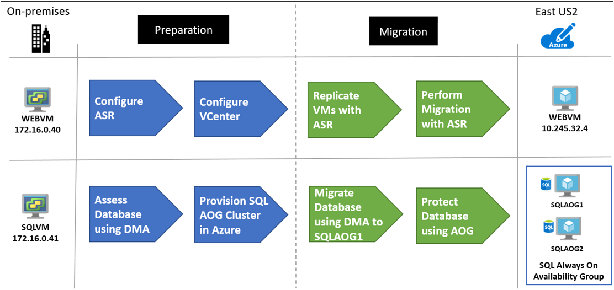 
 
## Prerequisites

Here's what Contoso needs to do for this scenario.

**Requirements** | **Details**
--- | ---
**Azure subscription** | Contoso already created a subscription in an early article in this series. If you don't have an Azure subscription, create a [free account](https://azure.microsoft.com/pricing/free-trial/).   If you create a free account, you're the administrator of your subscription and can perform all actions.   If you use an existing subscription and you're not the administrator, you need to work with the admin to assign you Owner or Contributor permissions.   If you need more granular permissions, review [this article](../site-recovery/site-recovery-role-based-linked-access-control.md). 
**Azure infrastructure** | [Learn how](contoso-migration-infrastructure.md) Contoso set up an Azure infrastructure.   Learn more about specific [network](https://docs.microsoft.com/azure/site-recovery/vmware-physical-azure-support-matrix#network) and [storage](https://docs.microsoft.com/azure/site-recovery/vmware-physical-azure-support-matrix#storage) requirements for Site Recovery.
**Site recovery (on-premises)** | The on-premises vCenter server should be running version 5.5, 6.0, or 6.5   An ESXi host running version 5.5, 6.0 or 6.5   One or more VMware VMs running on the ESXi host.   VMs must meet [Azure requirements](https://docs.microsoft.com/azure/site-recovery/vmware-physical-azure-support-matrix#azure-vm-requirements).   Supported [network](https://docs.microsoft.com/azure/site-recovery/vmware-physical-azure-support-matrix#network) and [storage](https://docs.microsoft.com/azure/site-recovery/vmware-physical-azure-support-matrix#storage) configuration.   VMs you want to replicate must meet [Azure requirements](https://docs.microsoft.com/azure/site-recovery/vmware-physical-azure-support-matrix#azure-vm-requirements).

## Scenario steps

Here's how Contoso will run the migration:

> [!div class="checklist"]
> * **Step 1: Prepare a cluster**: Create a cluster for deploying two SQL Server VM nodes in Azure.
> * **Step 2: Deploy and set up the cluster**: Prepare an Azure SQL Server cluster.  Databases are migrated into this pre-created cluster.
> * **Step 3: Deploy the load balancer**: Deploy a load balancer to balance traffic to the SQL Server nodes.
> * **Step 4: Prepare Azure for Site Recovery**: Create an Azure storage account to hold replicated data, and a Recovery Services vault. 
> * **Step 5: Prepare on-premises VMware for Site Recovery**: Prepare accounts for VM discovery and agent installation. Prepare on-premises VMs so that users can connect to Azure VMs after m;migration.
> * **Step 6: Replicate VMs**: Enable VM replication to Azure.
> * **Step 7: Install DMA**: Download and install the Database Migration Assistant.
> * **Step 7: Migrate the database with DMA**: Migrate the database to Azure.
> * **Step 9: Protect the database**: Create an Always On Availability Group for the cluster.
> * **Step 10: Migrate the web app VM**: Run a test failover to make sure everything's working as expected. Then run a full failover to Azure. 

## Step 1: Prepare a SQL Server AlwaysOn availability group cluster

Contoso admins set up the cluster as follows:

1. They create two SQL Server VMs by selecting SQL Server 2017 Enterprise Windows Server 2016 image in the Azure Marketplace. 

    

2. In the **Create virtual machine Wizard** > **Basics**, they configure:

    - Names for the VMs: **SQLAOG1** and **SQLAOG2**.
    - Since machines are business-critical, they enable SSD for the VM disk type.
    - They specify machine credentials.
    - They deploy the VMs in the primary EAST US 2 region, in the ContosoRG resource group.

3. In **Size**, they start with D2s_V3 SKU for both VMs. They'll scale later as they need to.
4. In **Settings**, they do the following:

    - Since these VMs are critical databases for the app, they use managed disks.
    - They place the machines in the production network of the EAST US 2 primary region (**VNET-PROD-EUS2**), in the database subnet (**PROD-DB-EUS2**).
    - They create a new availability set: **SQLAOGAVSET**, with two fault domains and five update domains.

    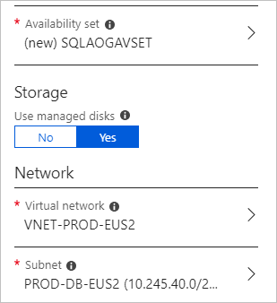

4. In **SQL Server settings**, they limit SQL connectivity to the virtual network (private), on default port 1433. For authentication they use the same credentials as they use onsite (**contosoadmin**).

    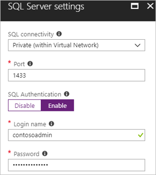

**Need more help?**

- [Get help](https://docs.microsoft.com/azure/virtual-machines/windows/sql/virtual-machines-windows-portal-sql-server-provision#1-configure-basic-settings) provisioning a SQL Server VM.
- [Learn about](https://docs.microsoft.com/azure/virtual-machines/windows/sql/virtual-machines-windows-portal-sql-availability-group-prereq#create-sql-server-vms) configuring VMs for different SQL Server SKUs.

## Step 2: Deploy and set up the cluster

Here's how Contoso admins set up the cluster:

1. They set up an Azure storage account to act as the cloud witness.
2. They add the SQL Server VMs to the Active Directory domain in the Contoso on-premises datacenter.
3. They create the cluster in Azure.
4. They configure the cloud witness.
5. Lastly, they enable SQL Always On availability groups.

### Set up a storage account as cloud witness

To set up a cloud witness, Contoso needs an Azure Storage account that will hold the blob file used for cluster arbitration. The same storage account can be used to set up cloud witness for multiple  clusters. 

Contoso admins create a storage account as follows:

1. They specify a recognizable name for the account (**contosocloudwitness**).
2. They deploy a general all-purpose account, with LRS.
3. They place the account in a third region - South Central US. They place it outside the primary and secondary region so that it remains available in case of regional failure.
4. They place it in their resource group that holds infrastructure resources - **ContosoInfraRG**.

    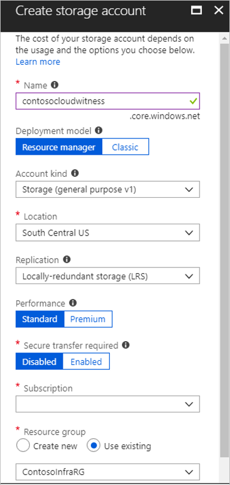

5. When they create the storage account, primary and secondary access keys are generated for it. They need the primary access key to create the cloud witness. The key appears under the storage account name > **Access Keys**.

    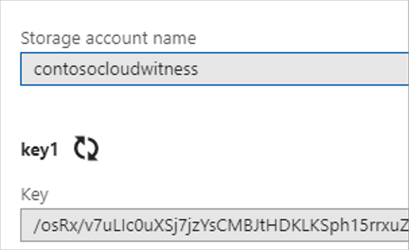

### Add SQL Server VMs to Contoso domain

1. Contoso adds SQLAOG1 and SQLAOG2 to contoso.com domain.
2. Then, on each VM they install the Windows Failover Cluster Feature and Tools.

### Set up the cluster

Before setting up the cluster, Contoso admins take a snapshot of the OS disk on each machine.

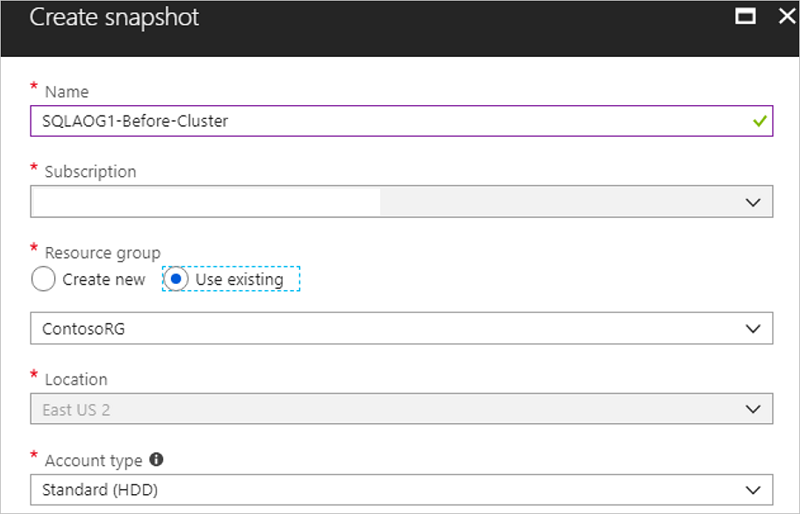

2. Then, they run a script they've put together to create the Windows Failover Cluster.

    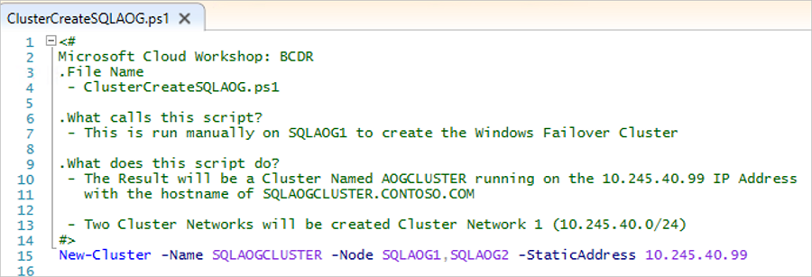

3. After they've created the cluster, they verify that the VMs appear as cluster nodes.

     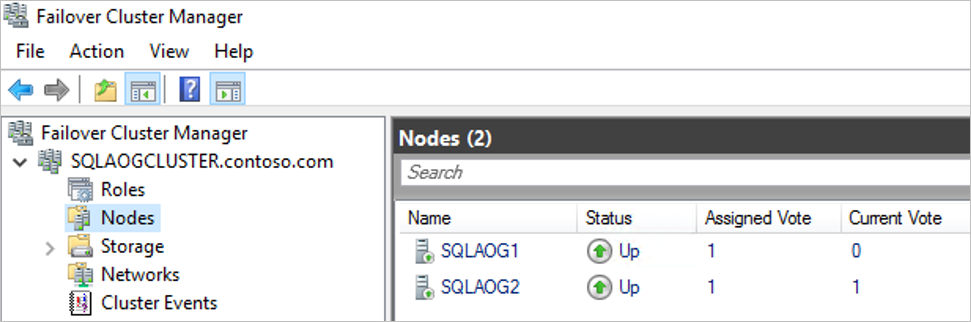

## Configure the cloud witness

1. Contoso admins configure the cloud witness using the **Quorum Configuration Wizard** in Failover Cluster Manager.
2. In the wizard they select to create a cloud witness with the storage account.
3. After the cloud witness is configured, in appears in the Failover Cluster Manager snap-in.

    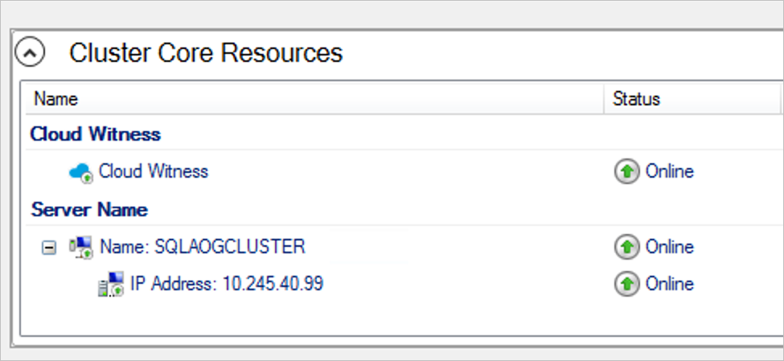
            

### Enable SQL Server Always On availability groups

Contoso admins can now enable Always On:

1. In SQL Server Configuration Manager, they enable **AlwaysOn Availability Groups** for the **SQL Server (MSSQLSERVER)** service.

    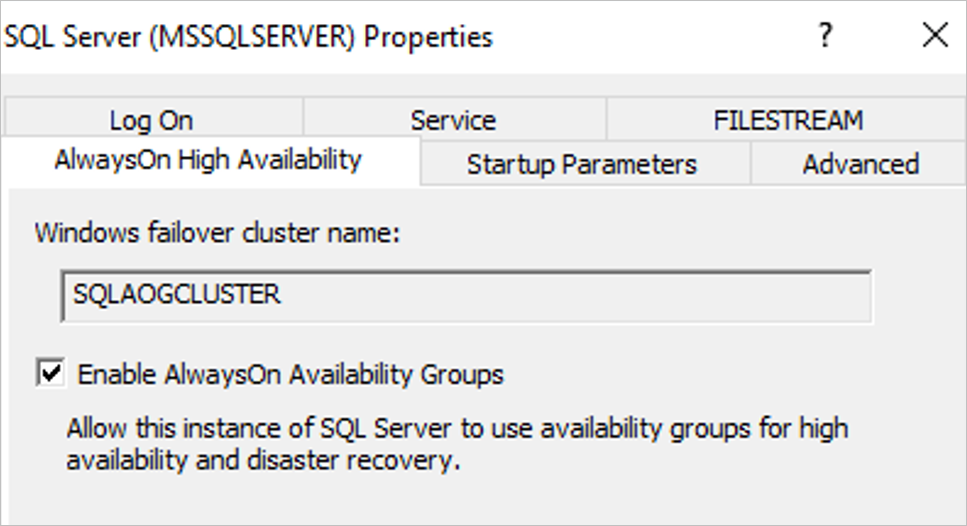

2. They restart the service for changes to take effect.

With AlwaysOn enable, Contoso can set up the AlwaysOn availability group that will protect the SmartHotel360 database.

**Need more help?**

- [Read about](https://docs.microsoft.com/windows-server/failover-clustering/deploy-cloud-witness) cloud witness and setting up a storage account for it.
- [Get instructions](https://docs.microsoft.com/azure/virtual-machines/windows/sql/virtual-machines-windows-portal-sql-availability-group-tutorial) for setting up a cluster and creating an availability group.

## Step 3: Deploy the Azure Load Balancer

Contoso admins now want to deploy an internal load balancer that sits in front of the cluster nodes. The load balancer listens for traffic, and directs it to the appropriate node.

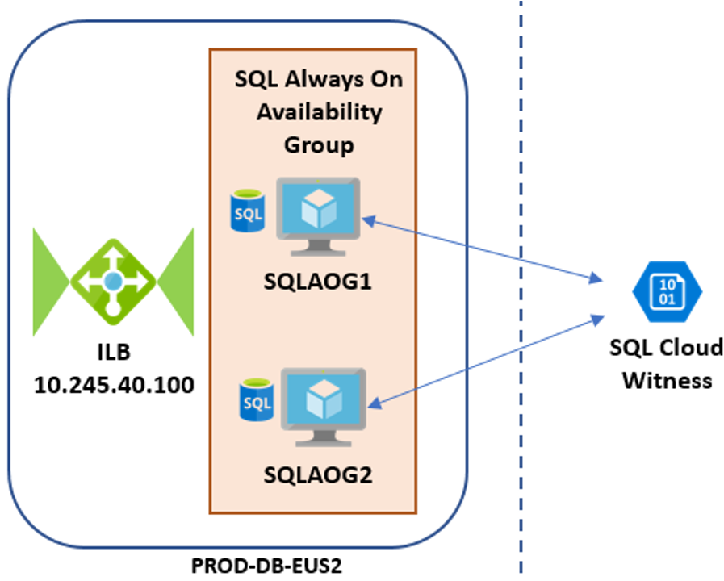

They create the load balancer as follows:

1. In Azure portal > **Networking** > **Load Balancer**, they set up a new internal load balancer: **ILB-PROD-DB-EUS2-SQLAOG**.
2. They place the load balancer in the production network **VNET-PROD-EUS2**, in the database subnet **PROD-DB-EUS2**.
3. They assign it a static IP address: 10.245.40.100.
4. As a networking element, they deploy the load balancer in the networking resource group **ContosoNetworkingRG**.

    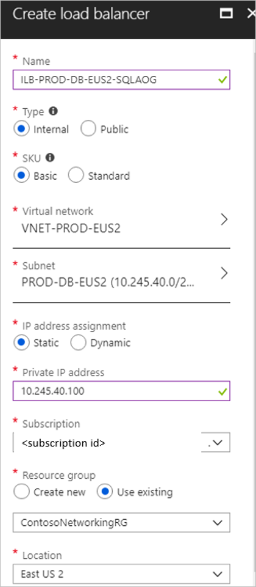

After the internal load balancer is deployed, they need to set it up. They create a backend address pool, set up a health probe, and configure a load balancing rule.

### Add a backend pool

To distribute traffic to the VMs in the cluster, Contoso admins set up a backend address pool that contains the IP addresses of the NICs for VMs that will receive network traffic from the load balancer.

1. In the load balancer settings in the portal, Contoso add a backend pool: **ILB-PROD-DB-EUS-SQLAOG-BEPOOL**.
2. They associate the pool with availability set SQLAOGAVSET. The VMs in the set (**SQLAOG1** and **SQLAOG2**) are added to the pool.

    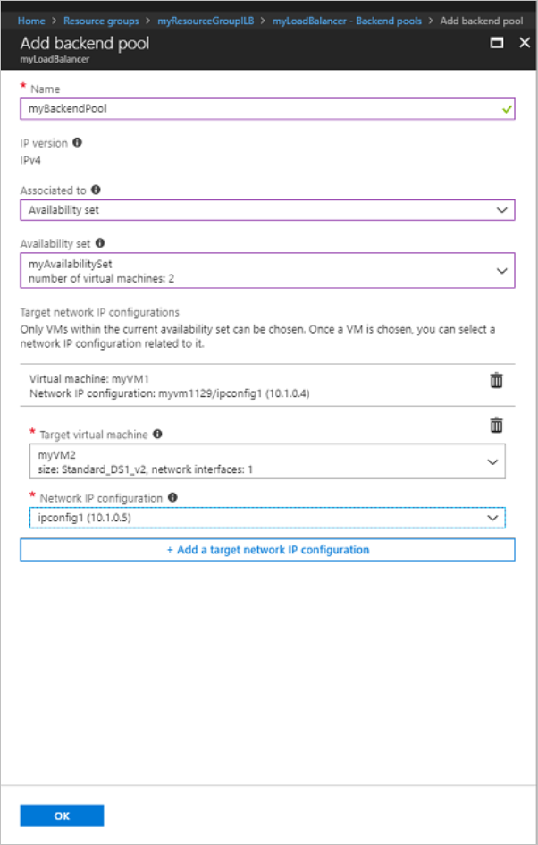

### Create a health probe

Contoso admins create a health probe so that the load balancer can monitor the app health. The probe dynamically adds or removes VMs from the load balancer rotation, based on how they respond to health checks.

They create the probe as follows: 

1. In the load balancer settings in the portal, Contoso creates a health probe: **SQLAlwaysOnEndPointProbe**.
2. They set the probe to monitor VMs on TCP port 59999.
3. They set an interval of 5 seconds between probes, and a threshold of 2. If two probes fail, the VM will be considered unhealthy.

    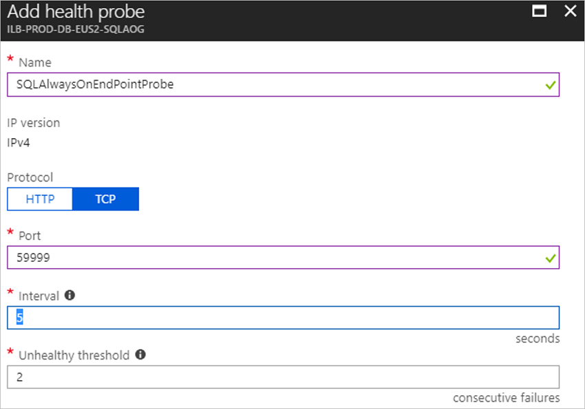

### Configure the load balancer to receive traffic

Now, Contoso admins set up a load balancer rule to define how traffic is distributed to the VMs.

- The front-end IP address handles incoming traffic.
- The back-end IP pool receives the traffic.

They create the rule as follows:

1. In the load balancer settings in the portal, they add a new load balancing rule: **SQLAlwaysOnEndPointListener**.
2. They set a front-end listener to receive incoming SQL client traffic on TCP 1433.
3. They specify the backend pool to which traffic will be routed, and the port on which VMs listen for traffic.
4. They enable floating IP (direct server return). This is always required for SQL AlwaysOn.

    

**Need more help?**

- [Get an overview](https://docs.microsoft.com/azure/load-balancer/load-balancer-overview) of Azure Load Balancer.
- [Learn about](https://docs.microsoft.com/azure/load-balancer/tutorial-load-balancer-basic-internal-portal) creating a load balancer.

## Step 4: Prepare Azure for the Site Recovery service

Here are the Azure components Contoso needs to deploy Site Recovery:

- A VNet in which VMs will be located when they're creating during failover.
- An Azure storage account to hold replicated data. 
- A Recovery Services vault in Azure.

Contoso admins set these up as follows:

1.  Contoso already created a network/subnet they can use for Site Recovery when they [deployed the Azure infrastructure](contoso-migration-rehost-vm-sql-ag.md).

    - The SmartHotel360 app is a production app, and WEBVM will be migrated to the Azure production network (VNET-PROD-EUS2) in the primary East US2 region.
    - WEBVM will be placed in the ContosoRG resource group, which is used for production resources, and in the production subnet (PROD-FE-EUS2).

2. Contoso admins create an Azure storage account (contosovmsacc20180528) in the primary region.

    - They use a general-purpose account, with standard storage, and LRS replication.
    - The account must be in the same region as the vault.

    

3. With the network and storage account in place, they now create a Recovery Services vault (**ContosoMigrationVault**), and place it in the **ContosoFailoverRG** resource group, in the primary East US 2 region.

    

**Need more help?**

[Learn about](https://docs.microsoft.com/azure/site-recovery/tutorial-prepare-azure) setting up Azure for Site Recovery.

## Step 5: Prepare on-premises VMware for Site Recovery

Here's what Contoso admins prepare on-premises:

- An account on the vCenter server or vSphere ESXi host, to automate VM discovery.
- An account that allows automatic installation of the Mobility service on VMware VMs that you want to replicate.
- On-premises VM settings, so that Contoso can connect to the replicated Azure VM after failover.

### Prepare an account for automatic discovery

Site Recovery needs access to VMware servers to:

- Automatically discover VMs. 
- Orchestrate replication, failover, and failback.
- At least a read-only account is required. You need an account that can run operations such as creating and removing disks, and turning on VMs.

Contoso admins set up the account as follows:

1. They create a role at the vCenter level.
2. They then assign that role the required permissions.

### Prepare an account for Mobility service installation

The Mobility service must be installed on each VM.

- Site Recovery can do an automatic push installation of this component when replication is enabled for the VM.
- You need an account that Site Recovery can use to access the VM for the push installation. You specify this account when you set up replication in the Azure console.
- The account can be domain or local, with permissions to install on the VM.

### Prepare to connect to Azure VMs after failover

After failover, Contoso wants to be able to connect to Azure VMs. To do this, Contoso admins do the following before migration:

1. For access over the internet they:

 - Enable RDP on the on-premises VM before failover
 - Ensure that TCP and UDP rules are added for the **Public** profile.
 - Check that RDP is allowed in **Windows Firewall** > **Allowed Apps** for all profiles.
 
2. For access over site-to-site VPN, they:

 - Enable RDP on the on-premises machine.
 - Allow RDP in the **Windows Firewall** -> **Allowed apps and features**, for **Domain and Private** networks.
 - Set the operating system's SAN policy on the on-premises VM to **OnlineAll**.

In addition, when they run a failover they need to check the following:

- There should be no Windows updates pending on the VM when triggering a failover. If there are, users won't be able to log into the VM until the update completes.
- After failover, they can check **Boot diagnostics** to view a screenshot of the VM. If this doesn't work, they should verify that the VM is running, and review these [troubleshooting tips](http://social.technet.microsoft.com/wiki/contents/articles/31666.troubleshooting-remote-desktop-connection-after-failover-using-asr.aspx).

**Need more help?**

- [Learn about](https://docs.microsoft.com/azure/site-recovery/vmware-azure-tutorial-prepare-on-premises#prepare-an-account-for-automatic-discovery) creating and assigning a role for automatic discovery.
- [Learn about](https://docs.microsoft.com/azure/site-recovery/vmware-azure-tutorial-prepare-on-premises#prepare-an-account-for-mobility-service-installation) creating an account for push installation of the Mobility service.

## Step 6: Replicate the on-premises VMs to Azure with Site Recovery

Before they can run a migration to Azure, Contoso admins need to set up and enable replication.

### Set a replication goal

1. In the vault, under the vault name (ContosoVMVault) they select a replication goal (**Getting Started** > **Site Recovery** > **Prepare infrastructure**.
2. They specify that their machines are located on-premises, running on VMware, and replicating to Azure.

    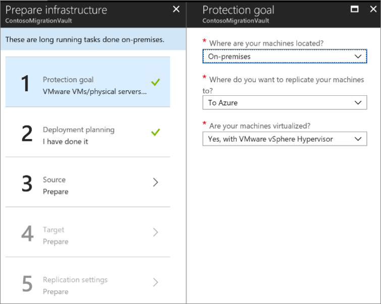

### Confirm deployment planning

To continue, they need to confirm that they have completed deployment planning, by selecting **Yes, I have done it**. In this scenario Contoso are only migrating a VM, and don't need deployment planning.

### Set up the source environment

Contoso admins need to configure their source environment. To do this, they download an OVF template and use it to deploy the Site Recovery configuration server as a highly available, on-premises VMware VM. After the configuration server is up and running, they register it in the vault.

The configuration server runs a number of components:

- The configuration server component that coordinates communications between on-premises and Azure and manages data replication.
- The process server that acts as a replication gateway. It receives replication data; optimizes it with caching, compression, and encryption; and sends it to Azure storage.
- The process server also installs Mobility Service on VMs you want to replicate and performs automatic discovery of on-premises VMware VMs.

Contoso admins perform these steps as follows:

1. In the vault, they download the OVF template from **Prepare Infrastructure** > **Source** > **Configuration Server**.
    
    

2. They import the template into VMware to create and deploy the VM.

    

3. When they turn on the VM for the first time, it boots up into a Windows Server 2016 installation experience. They accept the license agreement, and enter an administrator password.
4. After the installation finishes, they sign in to the VM as the administrator. At first sign-in, the Azure Site Recovery Configuration Tool runs by default.
5. In the tool, they specify a name to use for registering the configuration server in the vault.
6. The tool checks that the VM can connect to Azure. After the connection is established, they sign in to the Azure subscription. The credentials must have access to the vault in which you want to register the configuration server.

    

7. The tool performs some configuration tasks and then reboots.
8. They sign in to the machine again, and the Configuration Server Management Wizard starts automatically.
9. In the wizard, they select the NIC to receive replication traffic. This setting can't be changed after it's configured.
10. They select the subscription, resource group, and vault in which to register the configuration server.
         

10. They then download and install MySQL Server, and VMWare PowerCLI. 
11. After validation, they specify the FQDN or IP address of the vCenter server or vSphere host. They leave the default port, and specify a friendly name for the vCenter server.
12. They specify the account that they created for automatic discovery, and the credentials that are used to automatically install the Mobility Service. For Windows machines, the account needs local administrator privileges on the VMs.

    

7. After registration finishes, in the Azure portal, they double check that the configuration server and VMware server are listed on the **Source** page in the vault. Discovery can take 15 minutes or more. 
8. Site Recovery then connects to VMware servers using the specified settings, and discovers VMs.

### Set up the target

Now Contoso admins specify target replication settings.

1. In **Prepare infrastructure** > **Target**, they select the target settings.
2. Site Recovery checks that there's an Azure storage account and network in the specified target.

### Create a replication policy

Now, Contoso admins can create a replication policy.

1. In  **Prepare infrastructure** > **Replication Settings** > **Replication Policy** >  **Create and Associate**, they create a policy **ContosoMigrationPolicy**.
2. They use the default settings:
    - **RPO threshold**: Default of 60 minutes. This value defines how often recovery points are created. An alert is generated if continuous replication exceeds this limit.
    - **Recovery point retention**. Default of 24 hours. This value specifies how long the retention window is for each recovery point. Replicated VMs can be recovered to any point in a window.
    - **App-consistent snapshot frequency**. Default of one hour. This value specifies the frequency at which application-consistent snapshots are created.
 
        

5. The policy is automatically associated with the configuration server. 

    

### Enable replication

Now Contoso admins can start replicating WebVM.

1. In **Replicate application** > **Source** > **+Replicate** they select the source settings.
2. They indicate that they want to enable VMs, select the vCenter server, and the configuration server.

    

3. Now, they specify the target settings, including the resource group and VNet, and the storage account in which replicated data will be stored.

     

3. They select the WebVM for replication, checks the replication policy, and enables replication. Site Recovery installs the Mobility Service on the VM when replication is enabled.
 
    

4. They track replication progress in **Jobs**. After the **Finalize Protection** job runs, the machine is ready for failover.
5. In **Essentials** in the Azure portal, they can see the structure for the VMs replicating to Azure.

    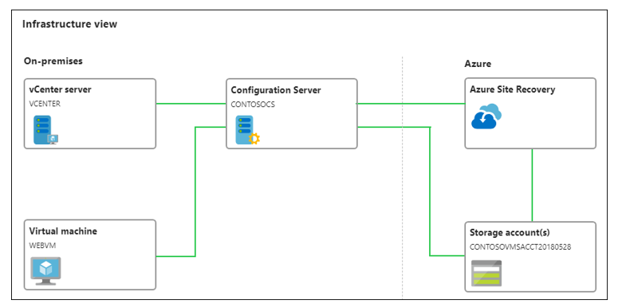

**Need more help?**

- You can read a full walkthrough of all these steps in [Set up disaster recovery for on-premises VMware VMs](https://docs.microsoft.com/azure/site-recovery/vmware-azure-tutorial).
- Detailed instructions are available to help you [set up the source environment](https://docs.microsoft.com/azure/site-recovery/vmware-azure-set-up-source), [deploy the configuration server](https://docs.microsoft.com/azure/site-recovery/vmware-azure-deploy-configuration-server), and [configure replication settings](https://docs.microsoft.com/azure/site-recovery/vmware-azure-set-up-replication).
- You can learn more about [enabling replication](https://docs.microsoft.com/azure/site-recovery/vmware-azure-enable-replication).

## Step 7: Install the Database Migration Assistant (DMA)

Contoso admins will migrate the SmartHotel360 database to Azure VM **SQLAOG1** using the DMA. They set up DMA as follows:

1. They download the tool from the [Microsoft Download Center](https://www.microsoft.com/download/details.aspx?id=53595) to the on-premises SQL Server VM (**SQLVM**).
2. They run setup (DownloadMigrationAssistant.msi) on the VM.
3. On the **Finish** page, they select **Launch Microsoft Data Migration Assistant** before finishing the wizard.

## Step 8: Migrate the database with DMA

1. In the DMA they run a new migration - **SmartHotel**.
2. They select the **Target server type** as **SQL Server on Azure Virtual Machines**. 

    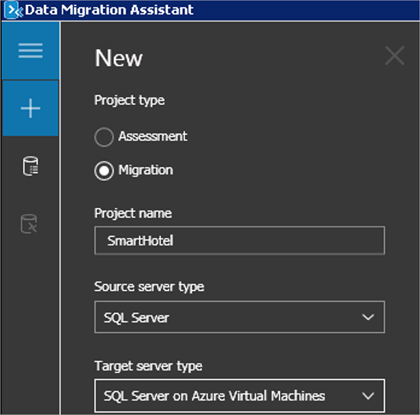

3. In the migration details, they add **SQLVM** as the source server, and **SQLAOG1** as the target. They specify credentials for each machine.

     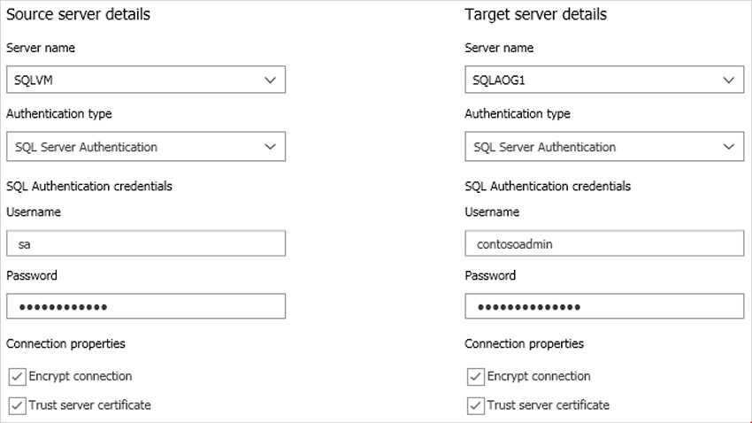

4. They create a local share for the database and configuration information. It must be accessible with write access by the SQL Service account on SQLVM and SQLAOG1.

    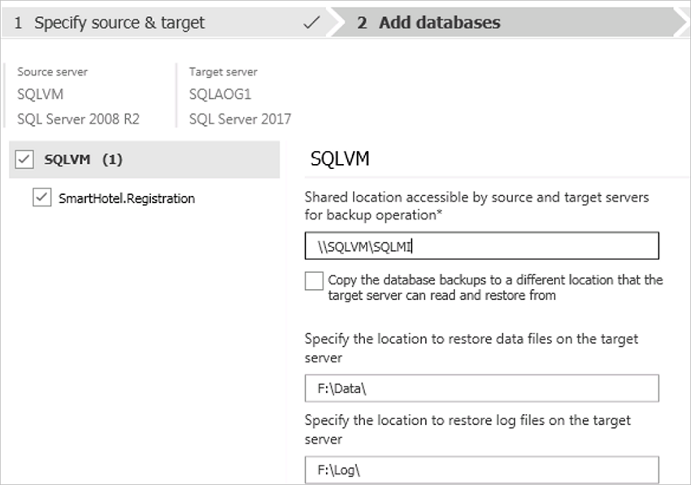

5. Contoso selects the logins that should be migrated, and starts the migration. After it finishes, DMA shows the migration as successful.

    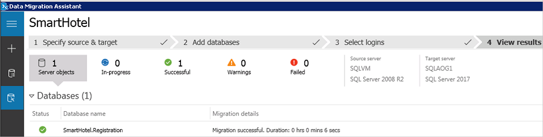

6. They verify that the database is running on **SQLAOG1**.

    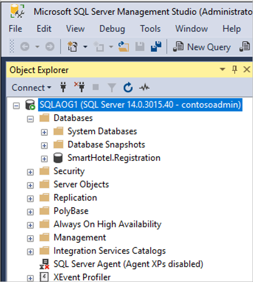

DMS connects to the on-premises SQL Server VM across a site-to-site VPN connection between the Contoso datacenter and Azure, and then migrates the database.

## Step 7: Protect the database with AlwaysOn

With the app database running on **SQLAOG1**, Contoso admins can now protect it using AlwaysOn availability groups. They configure AlwaysOn using SQL Management Studio, and then assign a listener using Windows clustering. 

### Create an AlwaysOn availability group

1. In SQL Management Studio, they right-click on **Always on High Availability** to start the **New Availability Group Wizard**.
2. In **Specify Options**, they name the availability group **SHAOG**. In **Select Databases**, they select the SmartHotel360 database.

    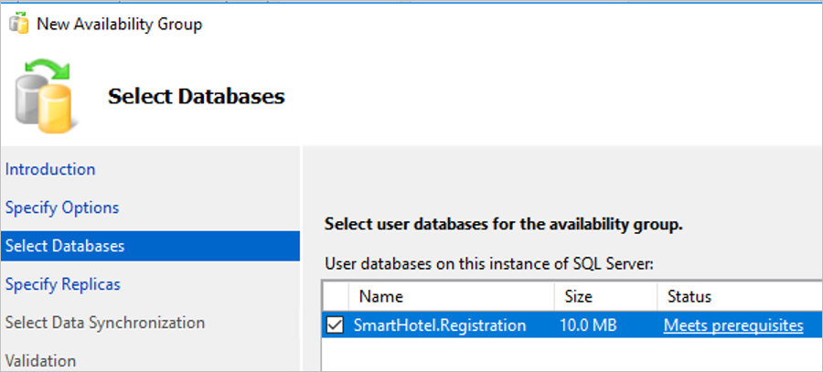

3. In **Specify Replicas**, they add the two SQL nodes as availability replicas, and configure them to provide automatic failover with synchronous commit.

     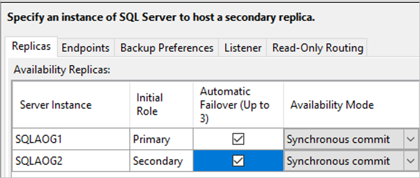

4. They configure a listener for the group (**SHAOG**) and port. The IP address of the internal load balancer is added as a static IP address (10.245.40.100).

    

5. In **Select Data Synchronization**, they enable automatic seeding. With this option, SQL Server automatically creates the secondary replicas for every database in the group, so Contoso don't have to manually back up and restore these. After validation, the availability group is created.

    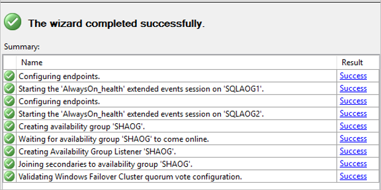

6. Contoso ran into an issue when creating the group. They aren't using Active Directory Windows Integrated security, and thus need to grant permissions to the SQL login to create the Windows Failover Cluster roles.

    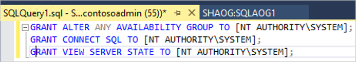

6. After the group is created, Contoso can see it in SQL Management Studio.

### Configure a listener on the cluster

As a last step in setting up the SQL deployment, Contoso admins configure the internal load balancer as the listener on the cluster, and brings the listener online. They  use a script to do this.

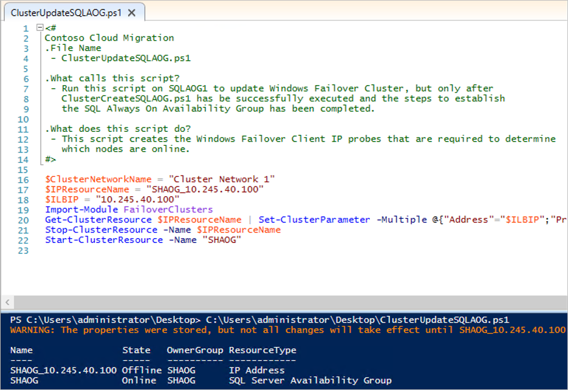

### Verify the configuration

With everything set up, Contoso now has a functional availability group in Azure that uses the migrated database. Admins verify this by connecting to the internal load balancer in SQL Management Studio.

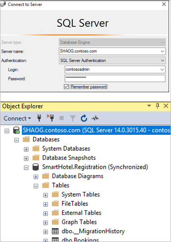

**Need more help?**
- Learn about creating an [availability group](https://docs.microsoft.com/azure/virtual-machines/windows/sql/virtual-machines-windows-portal-sql-availability-group-tutorial#create-the-availability-group) and [listener](https://docs.microsoft.com/azure/virtual-machines/windows/sql/virtual-machines-windows-portal-sql-availability-group-tutorial#configure-listener).
- Manually [set up the cluster to use the load balancer IP address](https://docs.microsoft.com/azure/virtual-machines/windows/sql/virtual-machines-windows-portal-sql-alwayson-int-listener#configure-the-cluster-to-use-the-load-balancer-ip-address).
- [Learn more](https://docs.microsoft.com/azure/storage/blobs/storage-dotnet-shared-access-signature-part-2) about creating and using SAS.

## Step 8: Migrate the VM with Site Recovery

Contoso admins run a quick test failover, and then migrate the VM.

### Run a test failover

Running a test failover helps ensure that everything's working as expected before the migration. 

1. They run a test failover to the latest available point in time (**Latest processed**).
2. They select **Shut down machine before beginning failover**, so that Site Recovery attempts to shut down the source VM before triggering the failover. Failover continues even if shutdown fails. 
3. Test failover runs: 

    - A prerequisites check runs to make sure all of the conditions required for migration are in place.
    - Failover processes the data, so that an Azure VM can be created. If select the latest recovery point, a recovery point is created from the data.
    - An Azure VM is created using the data processed in the previous step.

3. After the failover finishes, the replica Azure VM appears in the Azure portal. They check that the VM is the appropriate size, that it's connected to the right network, and that it's running. 
4. After verifying, They clean up the failover, and record and save any observations. 

### Run a failover

1. After verifying that the test failover worked as expected, Contoso admins create a recovery plan for migration, and add WEBVM to the plan.

     

2. They run a failover on the plan. They select the latest recovery point, and specify that Site Recovery should try to shut down the on-premises VM before triggering the failover.

    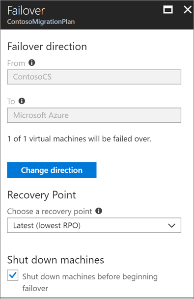

3. After the failover, they verify that the Azure VM appears as expected in the Azure portal.

    

6. After verifying the VM in Azure, they complete the migration to finish the migration process, stop replication for the VM, and stop Site Recovery billing for the VM.

    

### Update the connection string

As the final step in the migration process, Contoso admins update the connection string of the application to point to the migrated database running on the SHAOG listener. This configuration will be changed on the WEBVM now running in Azure.  This configuration is located in the web.config of the ASP application. 

1. Locate the file at C:\inetpub\SmartHotelWeb\web.config.  Change the name of the server to reflect the FQDN of the AOG: shaog.contoso.com.

    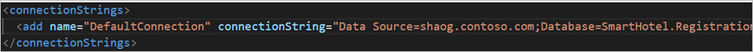  

2. After updating the file and saving it, they restart IIS on WEBVM. They do this using the IISRESET /RESTART from a cmd prompt.
2. After IIS has been restarted, the application is now using the database running on the SQL MI.

**Need more help?**

- [Learn about](https://docs.microsoft.com/azure/site-recovery/tutorial-dr-drill-azure) running a test failover. 
- [Learn](https://docs.microsoft.com/azure/site-recovery/site-recovery-create-recovery-plans) how to create a recovery plan.
- [Learn about](https://docs.microsoft.com/azure/site-recovery/site-recovery-failover) failing over to Azure.

## Clean up after migration

After migration, the SmartHotel360 app is running on an Azure VM, and the SmartHotel360 database is located in the Azure SQL cluster.

Now, Contoso needs to complete these cleanup steps:  

- Remove the on-premises VMs from the vCenter inventory.
- Remove the VMs from local backup jobs.
- Update internal documentation to show the new locations and IP addresses for VMs.
- Review any resources that interact with the decommissioned VMs, and update any relevant settings or documentation to reflect the new configuration.
- Add the two new VMs (SQLAOG1 and SQLAOG2) should be added to production monitoring systems.

## Review the deployment

With the migrated resources in Azure, Contoso needs to fully operationalize and secure their new infrastructure.

### Security

The Contoso security team reviews the Azure VMs WEBVM, SQLAOG1 and SQLAOG2 to determine any security issues. 

- The team reviews the Network Security Groups (NSGs) for the VM to control access. NSGs are used to ensure that only traffic allowed to the application can pass.
- The team considers securing the data on the disk using Azure Disk Encryption and KeyVault.
- The team should evaluate transparent data encryption (TDE), and then enable it on the SmartHotel360 database running on the new SQL AOG. [Learn more](https://docs.microsoft.com/sql/relational-databases/security/encryption/transparent-data-encryption?view=sql-server-2017).

[Read more](https://docs.microsoft.com/azure/security/azure-security-best-practices-vms#vm-authentication-and-access-control) about security practices for VMs.

## BCDR

 For business continuity and disaster recovery (BCDR), Contoso takes the following actions:
 - Keep data safe: Contoso backs up the data on the WEBVM, SQLAOG1 and SQLAOG2 VMs using the Azure Backup service. [Learn more].
(https://docs.microsoft.com/azure/backup/backup-introduction-to-azure-backup?toc=%2fazure%2fvirtual-machines%2flinux%2ftoc.json).
- Contoso will also learn about how to use Azure Storage to back up SQL Server directly to blob storage. [Learn more](https://docs.microsoft.com/azure/virtual-machines/windows/sql/virtual-machines-windows-use-storage-sql-server-backup-restore).
- Keep apps up and running: Contoso replicates the app VMs in Azure to a secondary region using Site Recovery. [Learn more](https://docs.microsoft.com/azure/site-recovery/azure-to-azure-quickstart).

### Licensing and cost optimization

1. Contoso has existing licensing for their WEBVM and will leverage the Azure Hybrid Benefit.  Contoso will convert the existing Azure VMs to take advantage of this pricing.
2. Contoso will enable Azure Cost Management licensed by Cloudyn, a Microsoft subsidiary. It's a multi-cloud cost management solution that helps you to utilize and manage Azure and other cloud resources.  [Learn more](https://docs.microsoft.com/azure/cost-management/overview) about Azure Cost Management. 

## Conclusion

In this article, Contoso rehosted the SmartHotel360 app in Azure by migrating the app frontend VM to Azure using the Site Recovery service. Contoso migrated the app database to a SQL Server cluster provisioned in Azure, and protected it in a SQL Server AlwaysOn availability group.

## Next steps

In the next article in the series, we'll show how Contoso rehost their service desk osTicket app running on Linux, and deployed with a MySQL database.

