# Contoso migration: Rehost an on-premises app on an Azure VM and SQL Database Managed Instance

In this article, Contoso migrates its SmartHotel360 app front-end VM to an Azure VM by using the Azure Site Recovery service. Contoso also migrates the app database to Azure SQL Database Managed Instance.

> [!NOTE]
> Azure SQL Database Managed Instance currently is in preview.

This article is one in a series of articles that documents how the fictitious company Contoso migrates its on-premises resources to the Microsoft Azure cloud. The series includes background information and a series of scenarios that illustrate how to set up a migration infrastructure and run different types of migrations. Scenarios grow in complexity. Articles will be added to the series over time.

**Article** | **Details** | **Status**
--- | --- | ---
[Article 1: Overview](contoso-migration-overview.md) | Overview of Contoso's migration strategy, the article series, and the sample apps that are used in the series. | Available
[Article 2: Deploy an Azure infrastructure](contoso-migration-infrastructure.md) | Contoso prepares its on-premises infrastructure and its Azure infrastructure for migration. The same infrastructure is used for all migration articles in the series. | Available
[Article 3: Assess on-premises resources for migration to Azure](contoso-migration-assessment.md) | Contoso runs an assessment of its on-premises two-tier SmartHotel app running on VMware. Contoso assesses app VMs by using the [Azure Migrate](migrate-overview.md) service. Contoso assesses the app SQL Server database by using [Data Migration Assistant](https://docs.microsoft.com/sql/dma/dma-overview?view=sql-server-2017). | Available
Article 4: Rehost an app on an Azure VM and SQL Database Managed Instance | Contoso runs a lift-and-shift migration to Azure for its on-premises SmartHotel app. Contoso migrates the app front-end VM by using [Azure Site Recovery](https://docs.microsoft.com/azure/site-recovery/site-recovery-overview). Contoso migrates the app database to an Azure SQL Database Managed Instance by using the [Azure Database Migration Service](https://docs.microsoft.com/azure/dms/dms-overview). | This article
[Article 5: Rehost an app on Azure VMs](contoso-migration-rehost-vm.md) | Contoso migrates its SmartHotel app VMs to Azure VMs by using the Site Recovery service. | Available
[Article 6: Rehost an app on Azure VMs and in a  SQL Server AlwaysOn availability group](contoso-migration-rehost-vm-sql-ag.md) | Contoso migrates the SmartHotel app. Contoso uses Site Recovery to migrate the app VMs. It uses the Database Migration Service to migrate the app database to a SQL Server cluster that's protected by an AlwaysOn availability group. | Available
[Article 7: Rehost a Linux app on Azure VMs](contoso-migration-rehost-linux-vm.md) | Contoso completes a lift-and-shift migration of its Linux osTicket app to Azure VMs by using Site Recovery. | Available
[Article 8: Rehost a Linux app on Azure VMs and Azure Database for MySQL](contoso-migration-rehost-linux-vm-mysql.md) | Contoso migrates its Linux osTicket app to Azure VMs by using Site Recovery. It migrates the app database to Azure Database for MySQL by using MySQL Workbench. | Available
[Article 9: Refactor an app in an Azure web app and Azure SQL Database](contoso-migration-refactor-web-app-sql.md) | Contoso migrates its SmartHotel app to an Azure web app and migrates the app database to an Azure SQL Server instance. | Available
[Article 10: Refactor a Linux app in an Azure web app and Azure Database for MySQL](contoso-migration-refactor-linux-app-service-mysql.md) | Contoso migrates its Linux osTicket app to an Azure web app on multiple sites. The web app is integrated with GitHub for continuous delivery. Contoso migrates the app database to an Azure Database for MySQL instance. | Available
[Article 11: Refactor Team Foundation Server on Azure DevOps Services](contoso-migration-tfs-vsts.md) | Contoso migrates its on-premises Team Foundation Server deployment by migrating it to Azure DevOps Services in Azure. | Available
[Article 12: Rearchitect an app in Azure containers and Azure SQL Database](contoso-migration-rearchitect-container-sql.md) | Contoso migrates its SmartHotel app to Azure, and then rearchitects the app. Contoso rearchitects the app web tier as a Windows container, and rearchitects the app database by using Azure SQL Database. | Available
[Article 13: Rebuild an app in Azure](contoso-migration-rebuild.md) | Contoso rebuilds its SmartHotel app by using a range of Azure capabilities and services, including Azure App Service, Azure Kubernetes Service, Azure Functions, Azure Cognitive Services, and Azure Cosmos DB. | Available
[Article 14: Scale a migration to Azure](contoso-migration-scale.md) | After trying out migration combinations, Contoso prepares to scale to a full migration to Azure. | Available

You can download the sample SmartHotel360 app that's used in this article from [GitHub](https://github.com/Microsoft/SmartHotel360).

## Business drivers

Contoso's IT leadership team has worked closely with the company's business partners to understand what the business wants to achieve with this migration:

- **Address business growth**: Contoso is growing. As a result, pressure has increased on the company's on-premises systems and infrastructure.
- **Increase efficiency**: Contoso needs to remove unnecessary procedures, and to streamline processes for its developers and users. The business needs IT to be fast and to not waste time or money, so the company can deliver faster on customer requirements.
- **Increase agility**:  Contoso IT needs to be more responsive to the needs of the business. It must be able to react faster than the changes that occur in the marketplace for the company to be successful in a global economy. IT at Contoso must not get in the way or become a business blocker.
- **Scale**: As the company's business grows successfully, Contoso IT must provide systems that can grow at the same pace.

## Migration goals

The Contoso cloud team has identified goals for this migration. The company uses migration goals to determine the best migration method.

- After migration, the app in Azure should have the same performance capabilities that the app has today in Contoso's on-premises VMWare environment. Moving to the cloud doesn't mean that app performance is less critical.
- Contoso doesn’t want to invest in the app. The app is critical and important to the business, but Contoso simply wants to move the app in its current form to the cloud.
- Database administration tasks should be minimized after the app is migrated.
- Contoso doesn't want to use an Azure SQL Database for this app. It's looking for alternatives.

## Solution design

After pinning down their goals and requirements, Contoso designs and reviews a deployment solution, and identifies the migration process, including the Azure services that it will use for the migration.

### Current architecture 

- Contoso has one main datacenter (**contoso-datacenter**) . The datacenter is located in the city of New York in the Eastern United States.
- Contoso has three additional local branches across the United States.
- The main datacenter is connected to the internet with a fiber Metro Ethernet connection (500 MBps).
- Each branch is connected locally to the internet by using business-class connections with IPsec VPN tunnels back to the main datacenter. The setup allows Contoso's entire network to be permanently connected and optimizes internet connectivity.
- The main datacenter is fully virtualized with VMware. Contoso has two ESXi 6.5 virtualization hosts that are managed by vCenter Server 6.5.
- Contoso uses Active Directory for identity management. Contoso uses DNS servers on the internal network.
- Contoso has an on-premises domain controller (**contosodc1**).
- The domain controllers run on VMware VMs. The domain controllers at local branches run on physical servers.
- The SmartHotel360 app is tiered across two VMs (**WEBVM** and **SQLVM**) that are located on a VMware ESXi version 6.5 host (**contosohost1.contoso.com**). 
- The VMware environment is managed by vCenter Server 6.5 (**vcenter.contoso.com**) running on a VM.

  

### Proposed architecture

In this scenario, Contoso wants to migrate its two-tier on-premises travel app as follows:

- Migrate the app database (**SmartHotelDB**) to an Azure SQL Database Managed Instance.
- Migrate the frontend **WebVM** to an Azure VM.
- The on-premises VMs in the Contoso datacenter will be decommissioned when the migration is finished.

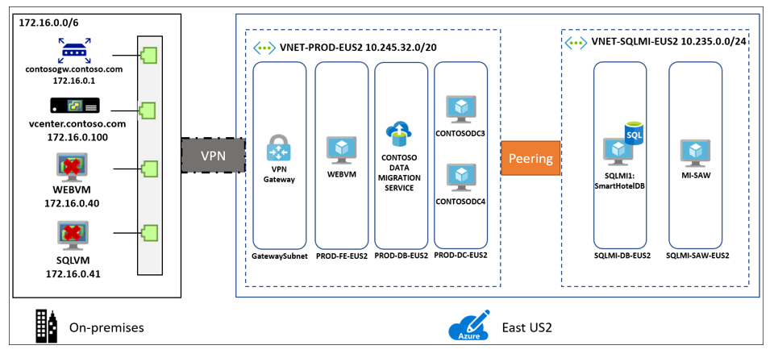 

### Database considerations

As part of the solution design process, Contoso did a feature comparison between Azure SQL Database and SQL Server Managed Instance. The following considerations helped them to decide to go with Managed Instance.

- Managed Instance aims to deliver almost 100% compatibility with the latest on-premises SQL Server version. Microsoft recommends Managed instance for customers running SQL Server on-premises or on IaaS VM who want to migrate their apps to a fully managed service with minimal design changes.
- Contoso is planning to migrate a large number of apps from on-premises to IaaS. Many of these are ISV provided. Contoso realizes that using Managed Instance will help ensure database compatibility for these apps, rather than using SQL Database which might not be supported.
- Contoso can simply do a lift-and-shift migration to Managed Instance using the fully automated Data Migration Service (DMS). With this service in place, Contoso can reuse it for future database migrations.
- SQL Managed Instance supports SQL Server Agent which is an important issue for the SmartHotel360 app. Contoso needs this compatibility, otherwise it will have to redesign maintenance plans required by the app.
- With Software Assurance, Contoso can exchange their existing licenses for discounted rates on a SQL Database Managed Instance using the Azure Hybrid Benefit for SQL Server. This can allow Contoso to save up to 30% on Managed Instance.
- Managed Instance is fully contained in the virtual network, so it provides a high level of isolation and security for Contoso’s data. Contoso can get the benefits of the public cloud, while keeping the environment isolated from the public Internet.
- Managed Instance supports many security features including Always-encrypted, dynamic data masking, row-level security, and threat detection.

### Solution review

Contoso evaluates the proposed design by putting together a pros and cons list.

**Consideration** | **Details**
--- | ---
**Pros** |	WEBVM will be moved to Azure without changes, making the migration simple.   SQL Managed Instance supports Contoso's technical requirements and goals.   Managed Instance will provide 100% compatibility with their current deployment, while moving them away from SQL Server 2008 R2.  	They can leverage their investment in Software Assurance and using the Azure Hybrid Benefit forSQL  Server and Windows Server.   They can reuse the Database Migration Service for additional future migrations.   SQL Managed Instance has built in fault tolerance which Contoso doesn't need to configures. This ensures that the data tier is no longer a single point of failover.
**Cons** | The WEBVM is running Windows Server 2008 R2.  Although this operating system is supported by Azure, it is no longer supported platform. [Learn more](https://support.microsoft.com/en-us/help/956893).   The web tier remains a single point of failover with only WEBVM providing services.   Contoso will need to continue supporting the app web tier as a VM rather than moving to a managed service, such as Azure App Service.   For the data tier, Managed Instance might not be the best solution if Contoso want to customize the operating system or the database server, or if they want to run third-party apps along with SQL Server. Running SQL Server on an IaaS VM could provide this flexibility. 

### Migration process

Contoso will migrate the web and data tiers of its SmartHotel360 app to Azure by completing these steps:

1. Contoso already has its Azure infrastructure in place, so it just needs to add a couple of specific Azure components for this scenario.
2. The data tier will be migrated by using the Data Migration Service. The Data Migration Service connects to the on-premises SQL Server VM across a site-to-site VPN connection between the Contoso datacenter and Azure. Then, the Data Migration Service migrates the database.
3. The web tier will be migrated by using a lift-and-shift migration by using Site Recovery. The process entails preparing the on-premises VMware environment, setting up and enabling replication, and migrating the VMs by failing them over to Azure.

     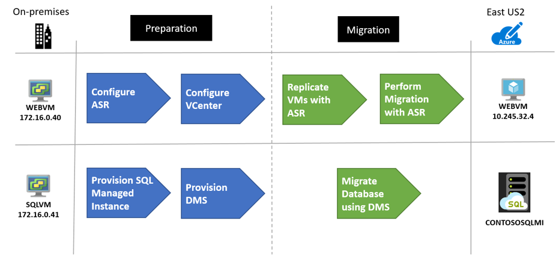 

### Azure services

Service | Description | Cost
--- | --- | ---
[Database Migration Service](https://docs.microsoft.com/azure/dms/dms-overview) | The Database Migration Service enables seamless migration from multiple database sources to Azure data platforms with minimal downtime. | Learn about [supported regions](https://docs.microsoft.com/azure/dms/dms-overview#regional-availability) and [Database Migration Service pricing](https://azure.microsoft.com/pricing/details/database-migration/).
[Azure SQL Database Managed Instance](https://docs.microsoft.com/azure/sql-database/sql-database-managed-instance) | Managed Instance is a managed database service that represents a fully managed SQL Server instance in the Azure cloud. It uses the same code as the latest version of SQL Server Database Engine, and has the latest features, performance improvements, and security patches. | Using a SQL Database Managed Instance running in Azure incurs charges based on capacity. Learn more about [Managed Instance pricing](https://azure.microsoft.com/pricing/details/sql-database/managed/). 
[Azure Site Recovery](https://docs.microsoft.com/azure/site-recovery/) | The Site Recovery service orchestrates and manages migration and disaster recovery for Azure VMs and on-premises VMs and physical servers.  | During replication to Azure, Azure Storage charges are incurred.  Azure VMs are created and incur charges when failover occurs. Learn more about [Site Recovery charges and pricing](https://azure.microsoft.com/pricing/details/site-recovery/).

 

## Prerequisites

Contoso and other users must meet the following prerequisites for this scenario:

Requirements | Details
--- | ---
**Enroll in the Managed Instance preview** | You must be enrolled in the SQL Database Managed Instance limited public preview. You need an Azure subscription to [sign up](https://portal.azure.com#create/Microsoft.SQLManagedInstance). Signup can take a few days to complete, so make sure to sign up before you begin to deploy this scenario.
**Azure subscription** | You should have already created a subscription when you perform the assessment in the first article in this series. If you don't have an Azure subscription, create a [free account](https://azure.microsoft.com/pricing/free-trial/).   If you create a free account, you're the administrator of your subscription and can perform all actions.   If you use an existing subscription and you're not the administrator of the subscription, you need to work with the admin to assign you Owner or Contributor permissions.   If you need more granular permissions, see [Use role-based access control to manage Site Recovery access](../site-recovery/site-recovery-role-based-linked-access-control.md). 
**Site Recovery (on-premises)** | Your on-premises vCenter Server instance should be running version 5.5, 6.0, or 6.5   An ESXi host running version 5.5, 6.0, or 6.5   One or more VMware VMs running on the ESXi host.   VMs must meet [Azure requirements](https://docs.microsoft.com/azure/site-recovery/vmware-physical-azure-support-matrix#azure-vm-requirements).   Supported [network](https://docs.microsoft.com/azure/site-recovery/vmware-physical-azure-support-matrix#network) and [storage](https://docs.microsoft.com/azure/site-recovery/vmware-physical-azure-support-matrix#storage) configuration.
**Database Migration Service** | For the Database Migration Service, you need a [compatible on-premises VPN device](https://docs.microsoft.com/azure/vpn-gateway/vpn-gateway-about-vpn-devices).   You must be able to configure the on-premises VPN device. It must have an external-facing public IPv4 address. The address can't be located behind a NAT device.   Make sure you have access to your on-premises SQL Server database.   Windows Firewall should be able to access the source database engine. Learn how to [configure Windows Firewall for Database Engine access](https://docs.microsoft.com/sql/database-engine/configure-windows/configure-a-windows-firewall-for-database-engine-access).   If there's a firewall in front of your database machine, add rules to allow access to the database and files via SMB port 445.   The credentials that are used to connect to the source SQL Server instance and which target Managed Instance must be members of the sysadmin server role.   You need a network share in your on-premises database that the Database Migration Service can use to back up the source database.   Make sure that the service account running the source SQL Server instance has write permissions on the network share.   Make a note of a Windows user and password that has full control permissions on the network share. The Database Migration Service impersonates these user credentials to upload backup files to the Azure Storage container.   The SQL Server Express installation process sets the TCP/IP protocol to **Disabled** by default. Make sure that it's enabled.

## Scenario steps

Here's how Contoso plans to set up the deployment:

> [!div class="checklist"]
> * **Step 1: Set up a SQL Database Managed Instance**: Contoso needs a pre-created Managed Instance to which the on-premises SQL Server database will migrate.
> * **Step 2: Prepare the Database Migration Service**: Contoso must register the database migration provider, create an instance, and then create a Database Migration Service project. Contoso also must set up a shared access signature (SAS) Uniform Resource Identifier (URI) for the Database Migration Service. An SAS URI provides delegated access to resources in Contoso's storage account, so Contoso can grant limited permissions to storage objects. Contoso sets up an SAS URI, so the Database Migration Service can access the storage account container to which the service uploads the SQL Server backup files.
> * **Step 3: Prepare Azure for Site Recovery**: Contoso must create a storage account to hold replicated data for Site Recovery. It also must create an Azure Recovery Services vault.
> * **Step 4: Prepare on-premises VMware for Site Recovery**: Contoso will prepare accounts for VM discovery and agent installation to connect to Azure VMs after failover.
> * **Step 5: Replicate VMs**: To set up replication, Contoso configure the Site Recovery source and target environments, sets up a replication policy, and starts replicating VMs to Azure Storage.
> * **Step 6: Migrate the database by using the Database Migration Service**: Contoso migrates the database.
> * **Step 7: Migrate the VMs by using Site Recovery**: Contoso runs a test failover to make sure everything's working. Then, Contoso runs a full failover to migrate the VMs to Azure.

## Step 1: Prepare a SQL Database Managed Instance

To set up an Azure SQL Database Managed Instance, Contoso needs a subnet that meets the following requirements:

- The subnet must be dedicated. It must be empty, and it can't contain any other cloud service. The subnet can't be a gateway subnet.
- After the Managed Instance is created, Contoso should not add resources to the subnet.
- The subnet can't have a network security group associated with it.
- The subnet must have a user-defined routing (UDR) route table. The only route assigned should be 0.0.0.0/0 next hop internet. 
- Optional custom DNS: If custom DNS is specified on the Azure virtual network, Azure's recursive resolvers IP address (such as 168.63.129.16) must be added to the list. Learn how to [configure custom DNS for a Managed Instance](https://docs.microsoft.com/azure/sql-database/sql-database-managed-instance-custom-dns).
- The subnet mustn't have a service endpoint (storage or SQL) associated with it. Service endpoints should be disabled on the virtual network.
- The subnet must have a minimum of 16 IP addresses. Learn how to [size the Managed Instance subnet](https://docs.microsoft.com/azure/sql-database/sql-database-managed-instance-vnet-configuration#determine-the-size-of-subnet-for-managed-instances).
- In Contoso's hybrid environment, custom DNS settings are required. Contoso configures DNS settings to use one or more of the company's Azure DNS servers. Learn more about [DNS customization](https://docs.microsoft.com/azure/sql-database/sql-database-managed-instance-custom-dns).

### Set up a virtual network for the Managed Instance

Contoso admins set up the virtual network as follows: 

1. They create a new virtual network (**VNET-SQLMI-EU2**) in the primary East US 2 region. It adds the virtual network to the **ContosoNetworkingRG** resource group.
2. They assign an address space of 10.235.0.0/24. They ensure that the range doesn't overlap with any other networks in its enterprise.
3. They add two subnets to the network:
    - **SQLMI-DS-EUS2** (10.235.0.0.25)
    - **SQLMI-SAW-EUS2** (10.235.0.128/29). This subnet is used to attach a directory to the Managed Instance.

    

4. After the virtual network and subnets are deployed, they peer networks as follows:

    - Peers **VNET-SQLMI-EUS2** with **VNET-HUB-EUS2** (the hub virtual network for the East US 2).
    - Peers **VNET-SQLMI-EUS2** with **VNET-PROD-EUS2** (the production network).

    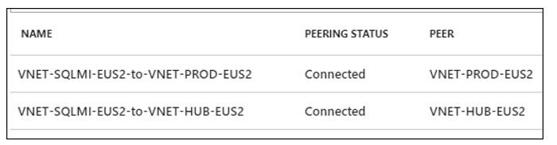

5. They set custom DNS settings. DNS points first to Contoso's Azure domain controllers. Azure DNS is secondary. The Contoso Azure domain controllers are located as follows:

    - Located in the **PROD-DC-EUS2** subnet, in the East US 2 production network (**VNET-PROD-EUS2**)
    - **CONTOSODC3** address: 10.245.42.4
    - **CONTOSODC4** address: 10.245.42.5
    - Azure DNS resolver: 168.63.129.16

     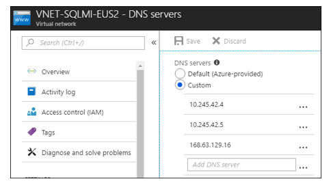

*Need more help?*

- Get an overview of [SQL Database Managed Instance](https://docs.microsoft.com/azure/sql-database/sql-database-managed-instance).
- Learn how to [create a virtual network for a SQL Database Managed Instance](https://docs.microsoft.com/azure/sql-database/sql-database-managed-instance-vnet-configuration#create-a-new-virtual-network-for-managed-instances).
- Learn how to [set up peering](https://docs.microsoft.com/azure/virtual-network/virtual-network-manage-peering).
- Learn how to [update Azure Active Directory DNS settings](https://docs.microsoft.com/azure/active-directory-domain-services/active-directory-ds-getting-started-dns).

### Set up routing

The Managed Instance is placed in a private virtual network. Contoso needs a route table for the virtual network to communicate with the Azure Management Service. If the virtual network can't communicate with the service that manages it, the virtual network becomes inaccessible.

Contoso considers these factors:

- The route table contains a set of rules (routes) that specify how packets sent from the Managed Instance should be routed in the virtual network.
- The route table is associated with subnets in which Managed Instances are deployed. Each packet that leaves a subnet is handled based on the associated route table.
- A subnet can be associated with only one route table.
- There are no additional charges for creating route tables in Microsoft Azure.

 To set up routing Contoso admins do the following:

1. They create a UDR (route) table in the **ContosoNetworkingRG** resource group.

    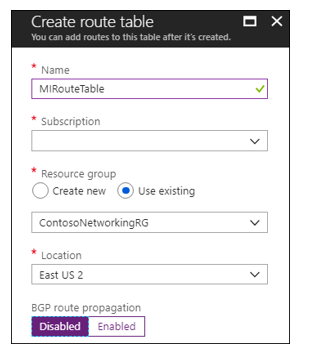

2. To comply with Managed Instance requirements, after the route table (**MIRouteTable**) is deployed, they add a route that has an address prefix of 0.0.0.0/0. The **Next hop type** option is set to **Internet**.

    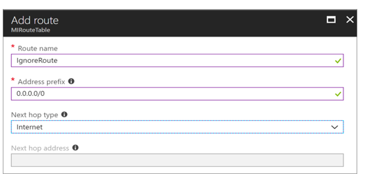
    
3. they associate the route table with the **SQLMI-DB-EUS2** subnet (in the **VNET-SQLMI-EUS2** network). 

    
    
*Need more help?*

Learn how to [set up routes for a Managed Instance](https://docs.microsoft.com/azure/sql-database/sql-database-managed-instance-create-tutorial-portal#create-new-route-table-and-a-route).

### Create a Managed Instance

Now, Contoso admins can provision a SQL Database Managed Instance:

1. Because the Managed Instance serves a business app, they deploy the Managed Instance in the company's primary East US 2 region. They add the Managed Instance to the **ContosoRG** resource group.
2. They select a pricing tier, size compute, and storage for the instance. Learn more about [Managed Instance pricing](https://azure.microsoft.com/pricing/details/sql-database/managed/).

    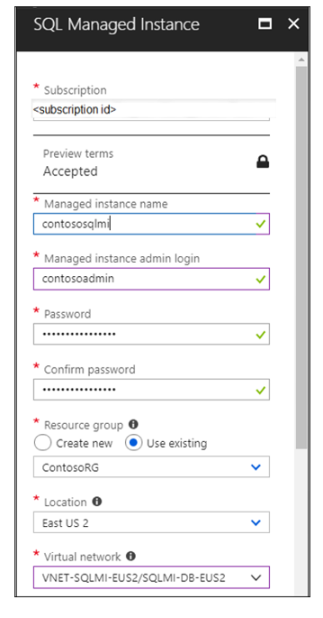

3. After the Managed Instance is deployed, two new resources appear in the **ContosoRG** resource group:

    - A virtual cluster in case Contoso has multiple Managed Instances.
    - The SQL Server Database Managed Instance. 

    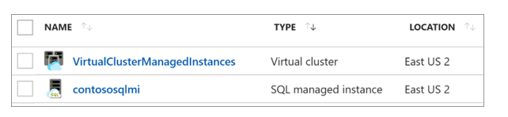

*Need more help?*

Learn how to [provision a Managed Instance](https://docs.microsoft.com/azure/sql-database/sql-database-managed-instance-create-tutorial-portal).

## Step 2: Prepare the Database Migration Service

To prepare the Database Migration Service, Contoso admins need to do a few things:

- Register the Database Migration Service provider in Azure.
- Provide the Database Migration Service with access to Azure Storage for uploading the backup files that are used to migrate a database. To provide access to Azure Storage, they create an Azure Blob storage container. They generate an SAS URI for the Blob storage container. 
- Create a Database Migration Service project.

Then, they complete the following steps:

1. They register the database migration provider under its subscription.
    

2. They create a Blob storage container. Contoso generates an SAS URI so that the Database Migration Service can access it.

    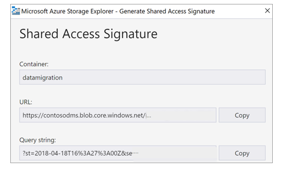

3. They create a Database Migration Service instance. 

    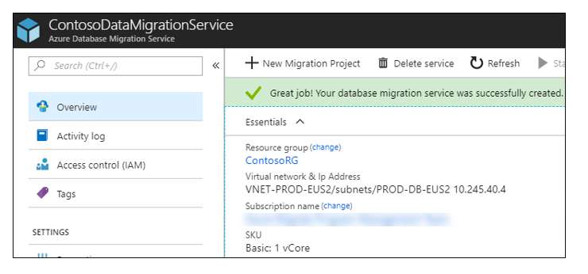

4. They place the Database Migration Service instance in the **PROD-DC-EUS2** subnet of the **VNET-PROD-DC-EUS2** virtual network.
    - The Database Migration Service is placed here because the service must be in a virtual network that can access the on-premises SQL Server VM via a VPN gateway.
    - The **VNET-PROD-EUS2** is peered to **VNET-HUB-EUS2** and is allowed to use remote gateways. The **Use remote gateways** option ensures that the Database Migration Service can communicate as required.

        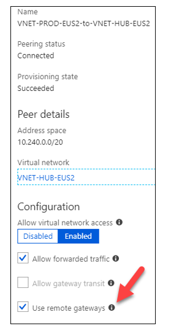

*Need more help?*

- Learn how to [set up the Database Migration Service](https://docs.microsoft.com/azure/dms/quickstart-create-data-migration-service-portal).
- Learn how to [create and use SAS](https://docs.microsoft.com/azure/storage/blobs/storage-dotnet-shared-access-signature-part-2).

## Step 3: Prepare Azure for the Site Recovery service

Several Azure elements are required for Contoso to set up Site Recovery for migration of its web tier VM (**WEBMV**):

- A virtual network in which failed-over resources are located.
- A storage account to hold replicated data. 
- A Recovery Services vault in Azure.

Contoso admins set up Site Recovery as follows:

1. Because the VM is a web front end to the SmartHotel360 app, Contoso fails over the VM to its existing production network (**VNET-PROD-EUS2**) and subnet (**PROD-FE-EUS2**). The network and subnet are located in the primary East US 2 region. Contoso set up the network when it [deployed the Azure infrastructure](contoso-migration-infrastructure.md).
2. They create a storage account (**contosovmsacc20180528**). Contoso uses a general-purpose account. Contoso selects standard storage and locally redundant storage replication.

    

3. With the network and storage account in place, they create a vault (**ContosoMigrationVault**). Contoso places the vault in the **ContosoFailoverRG** resource group, in the primary East US 2 region.

    

*Need more help?*

Learn how to [set up Azure for Site Recovery](https://docs.microsoft.com/azure/site-recovery/tutorial-prepare-azure).

## Step 4: Prepare on-premises VMware for Site Recovery

To prepare VMware for Site Recovery, Contoso admins must complete these tasks:

- Prepare an account on the vCenter Server instance or vSphere ESXi host. The account automates VM discovery.
- Prepare an account that allows automatic installation of the Mobility Service on VMware VMs that Contoso wants to replicate.
- Prepare on-premises VMs to connect to Azure VMs when they're created after failover.

### Prepare an account for automatic discovery

Site Recovery needs access to VMware servers to:

- Automatically discover VMs. A minimum of a read-only account is required.
- Orchestrate replication, failover, and failback. Contoso needs an account that can run operations such as creating and removing disks and turning on VMs.

Contoso admins set up the account by completing these tasks:

1. Creates a role at the vCenter level.
2. Assigns the required permissions to that role.

*Need more help?*

Learn how to [create and assign a role for automatic discovery](https://docs.microsoft.com/azure/site-recovery/vmware-azure-tutorial-prepare-on-premises#prepare-an-account-for-automatic-discovery).

### Prepare an account for Mobility Service installation

The Mobility Service must be installed on the VM that Contoso wants to replicate. Contoso considers these factors about the Mobility Service:

- Site Recovery can do an automatic push installation of this component when Contoso enables replication for the VM.
- For automatic push installation, Contoso must prepare an account that Site Recovery uses to access the VM.
- This account is specified when replication is configured in the Azure console.
- Contoso must have a domain or local account with permissions to install on the VM.

*Need more help*

Learn how to [create an account for push installation of the Mobility Service](https://docs.microsoft.com/azure/site-recovery/vmware-azure-tutorial-prepare-on-premises#prepare-an-account-for-mobility-service-installation).

### Prepare to connect to Azure VMs after failover

After failover to Azure, Contoso wants to be able to connect to the replicated VMs in Azure. To connect to the replicated VMs in Azure, Contoso admins must complete a few tasks on the on-premises VM before the migration: 

1. For access over the internet, they enable RDP on the on-premises VM before failover. They ensure that TCP and UDP rules are added for the **Public** profile, and that RDP is allowed in **Windows Firewall** > **Allowed Apps** for all profiles.
2. For access over Contoso's site-to-site VPN, they enable RDP on the on-premises machine. They allow RDP in **Windows Firewall** > **Allowed apps and features** for **Domain and Private** networks.
3. They set the operating system's SAN policy on the on-premises VM to **OnlineAll**.

Contoso admins also need to check these items when they run a failover:

- There should be no Windows updates pending on the VM when a failover is triggered. If Windows updates are pending, users Contoso can't sign in to the virtual machine until the update is finished.
- After failover, admins should check **Boot diagnostics** to view a screenshot of the VM. If they can't view the boot diagnostics, they should check that the VM is running, and then review [troubleshooting tips](http://social.technet.microsoft.com/wiki/contents/articles/31666.troubleshooting-remote-desktop-connection-after-failover-using-asr.aspx).

## Step 5: Replicate the on-premises VMs to Azure

Before running a migration to Azure, Contoso admins need to set up and enable replication for the on-premises VM.

### Set a replication goal

1. In the vault, under the vault name (**ContosoVMVault**), they set a replication goal (**Getting Started** > **Site Recovery** > **Prepare infrastructure**).
2. They specify that the machines are located on-premises, that they're VMware VMs, replicating to Azure.

    

### Confirm deployment planning

To continue, Contoso admins confirm that they've completed deployment planning. They select **Yes, I have done it**. In this deployment, Contoso is migrating only a single VM, deployment planning isn't needed.

### Set up the source environment

Now, Contoso admins configure the source environment. To set up its source environment, they download an OVF template, and use it to deploy the configuration server and its associated components as a highly available, on-premises VMware VM. Components on the server include:

- The configuration server that coordinates communications between the on-premises infrastructure and Azure. The configuration server manages data replication.
- The process server that acts as a replication gateway. The process server:
    - Receives replication data.
    - Optimizes replication date by using caching, compression, and encryption.
    - Sends replication date to Azure Storage.
- The process server also installs the Mobility Service on the VMs that will be replicated. The process server performs automatic discovery of on-premises VMware VMs.
- After the configuration server VM is created and started, Contoso registers the server in the vault.

To set up the source environment Contoso admins do the following:

1. They download the OVF template from the Azure portal (**Prepare Infrastructure** > **Source** > **Configuration Server**).
    
    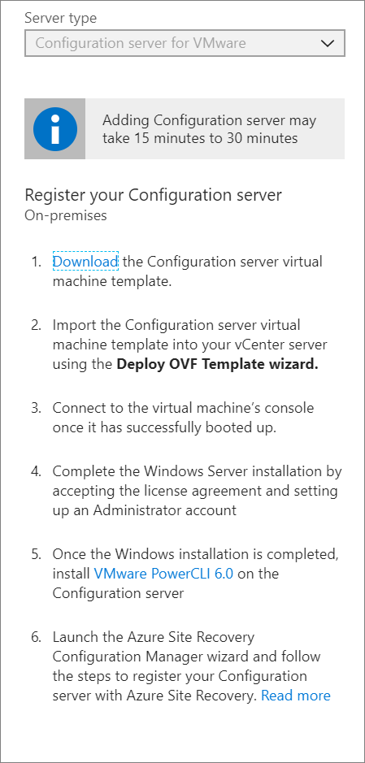

2. They import the template into VMware to create and deploy the VM.

    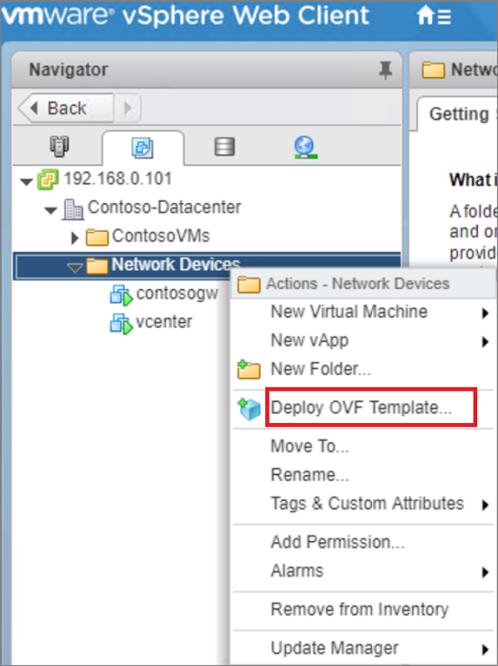

3.  When they turn on the VM for the first time, it starts in a Windows Server 2016 installation experience. They accept the license agreement and enters an administrator password.
4. When the installation is finished, they sign in to the VM as the administrator. At first time sign-in, the Azure Site Recovery Configuration Tool runs automatically.
5. In the Site Recovery Configuration Tool, they enter a name to use to register the configuration server in the vault.
6. The tool checks the VM's connection to Azure. After the connection is established, they select **Sign in** to sign in to the Azure subscription. The credentials must have access to the vault in which the configuration server is registered. 

    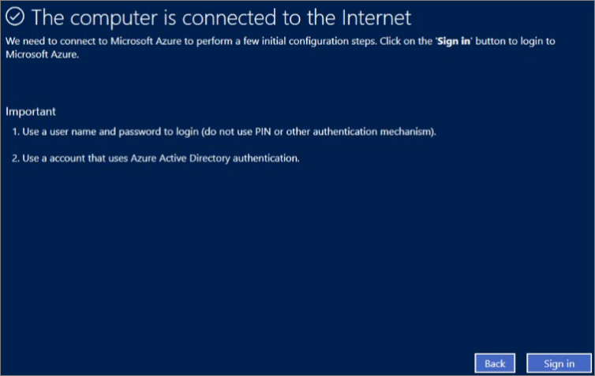

7. The tool performs some configuration tasks, and then reboots. They sign in to the machine again. The Configuration Server Management Wizard starts automatically.
8. In the wizard, they select the NIC to receive replication traffic. This setting can't be changed after it's configured.
9. They select the subscription, resource group, and Recovery Services vault in which to register the configuration server.

    

10. They download and installs MySQL Server and VMWare PowerCLI. Then, they validates the server settings.
11. After validation, they enter the FQDN or IP address of the vCenter Server instance or vSphere host. They leave the default port, and enter a display name for the vCenter Server instance in Azure.
12. They specify the account created earlier so that Site Recovery can automatically discover VMware VMs that are available for replication. 
13. They enter credentials, so the Mobility Service is automatically installed when replication is enabled. For Windows machines, the account needs local administrator permissions on the VMs. 

    

7. When registration is finished, in the Azure portal, they verify again that the configuration server and VMware server are listed on the **Source** page in the vault. Discovery can take 15 minutes or more. 
8. Site Recovery connects to VMware servers by using the specified settings, and discovers VMs.

### Set up the target

Now, Contoso admins configure the target replication environment:

1. In **Prepare infrastructure** > **Target**, they selecs the target settings.
2. Site Recovery checks that there's a storage account and network in the specified target.

### Create a replication policy

When the source and target are set up, Contoso admins create a replication policy and associates the policy with the configuration server:

1. In  **Prepare infrastructure** > **Replication Settings** > **Replication Policy** >  **Create and Associate**, they create the **ContosoMigrationPolicy** policy.
2. They use the default settings:
    - **RPO threshold**: Default of 60 minutes. This value defines how often recovery points are created. An alert is generated if continuous replication exceeds this limit.
    - **Recovery point retention**: Default of 24 hours. This value specifies how long the retention window is for each recovery point. Replicated VMs can be recovered to any point in a window.
    - **App-consistent snapshot frequency**: Default of 1 hour. This value specifies the frequency at which application-consistent snapshots are created.
 
    

3. The policy is automatically associated with the configuration server. 

    

*Need more help?*

- You can read a full walkthrough of these steps in [Set up disaster recovery for on-premises VMware VMs](https://docs.microsoft.com/azure/site-recovery/vmware-azure-tutorial).
- Detailed instructions are available to help you [set up the source environment](https://docs.microsoft.com/azure/site-recovery/vmware-azure-set-up-source), [deploy the configuration server](https://docs.microsoft.com/azure/site-recovery/vmware-azure-deploy-configuration-server), and [configure replication settings](https://docs.microsoft.com/azure/site-recovery/vmware-azure-set-up-replication).

### Enable replication

Now, Contoso admins can start replicating WebVM.

1. In **Replicate application** > **Source** > **Replicate**, they select the source settings.
2. They indicate that they want to enable virtual machines, select the vCenter Server instance, and set the configuration server.

    
 
3. They specify the target settings, including the resource group and network in which the Azure VM will be located after failover. They specify the storage account in which replicated data will be stored.

    

4. They select **WebVM** for replication. Site Recovery installs the Mobility Service on each VM when replication is enabled. 

    

5. They check that the correct replication policy is selected, and enable replication for **WEBVM**. They tracs replication progress in **Jobs**. After the **Finalize Protection** job runs, the machine is ready for failover.
6. In **Essentials** in the Azure portal, they can see status for the VMs that are replicating to Azure:

    

*Need more help?*

You can read a full walkthrough of these steps in [Enable replication](https://docs.microsoft.com/azure/site-recovery/vmware-azure-enable-replication).

## Step 6: Migrate the database 

Contoso admins need to create a Database Migration Service project, and then migrate the database.

### Create a Database Migration Service project

1. They create a Database Migration Service project. They select the **SQL Server** source server type, and **Azure SQL Database Managed Instance** as the target.

     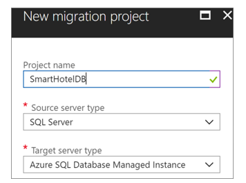

2. The Migration Wizard opens.

### Migrate the database 

1. In the Migration Wizard, they specify the source VM on which the on-premises database is located. They enter the credentials to access the database.

    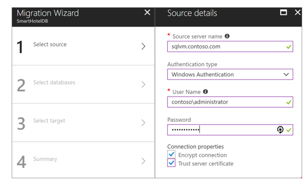

2. they select the database to migrate (**SmartHotel.Registration**):

    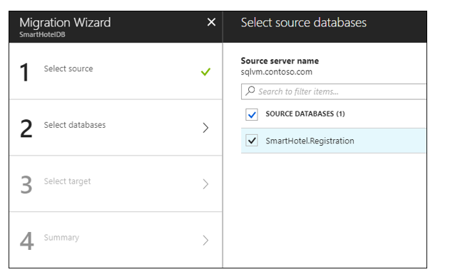

3. For the target, they enter the name of the Managed Instance in Azure, and the access credentials.

    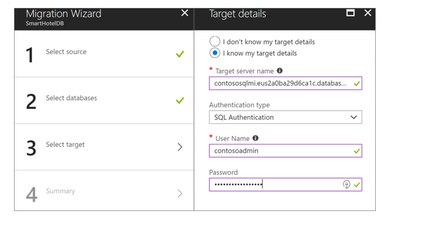

4. In **New Activity** > **Run Migration**, they specify settings to run migration:
    - Source and target credentials.
    - The database to migrate.
    - The network share created on the on-premises VM. The Database Migration Service takes source backups to this share. 
        - The service account that runs the source SQL Server instance must have write permissions on this share.
        - The FQDN path to the share must be used.
    - The SAS URI that provides the Database Migration Service with access to the storage account container to which the service uploads the backup files for migration.

        

5. They save the migration settings, and then run the migration.
6. In **Overview**, they monitos the migration status.

    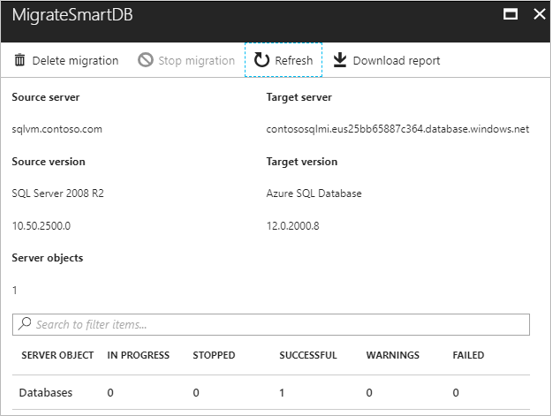

7. When migration is finished, they verify that the target databases exist on the Managed Instance.

    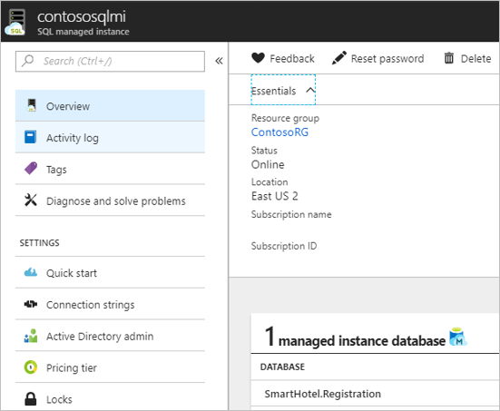

## Step 7: Migrate the VM

Contoso admins run a quick test failover, and then migrate the VM.

### Run a test failover

Before migrating WEBVM, a test failover helps ensure that everything works as expected. Admins complete the following steps:

1. They run a test failover to the latest available point in time (**Latest processed**).
2. They select **Shut down machine before beginning failover**. With this option selected, Site Recovery attempts to shut down the source VM before it triggers the failover. Failover continues, even if shutdown fails. 
3. Test failover runs: 
    1. A prerequisites check runs to make sure that all the conditions required for migration are in place.
    2. Failover processes the data so that an Azure VM can be created. If the latest recovery point is selected, a recovery point is created from the data.
    3.  Azure VM is created by using the data processed in the preceding step.
3. When the failover is finished, the replica Azure VM appears in the Azure portal. they verify that everything is working properly: the VM is the appropriate size, it's connected to the correct network, and it's running. 
4. After verifying the test failover, they clean up the failover, and record any observations. 

### Migrate the VM

1. After verifying that the test failover worked as expected, Contoso admins create a recovery plan for migration, and add WEBVM to the plan:

     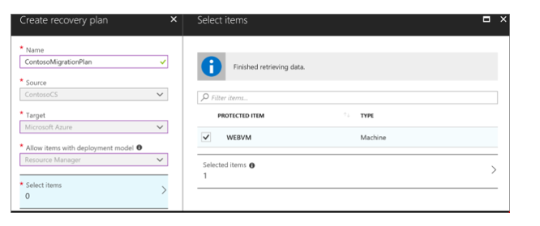

2. They run a failover on the plan, selecting the latest recovery point. They specify that Site Recovery should try to shut down the on-premises VM before it triggers the failover.

    

3. After the failover, they verify that the Azure VM appears as expected in the Azure portal.

   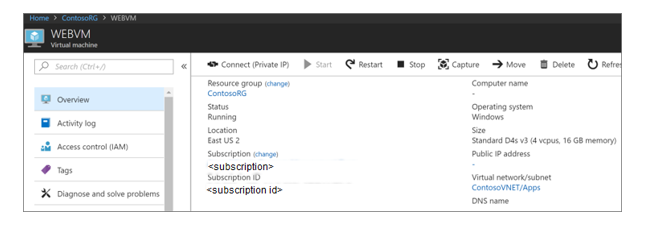

4. After verifying, they complete the migration to finish the migration process, stop replication for the VM, and stop Site Recovery billing for the VM.

    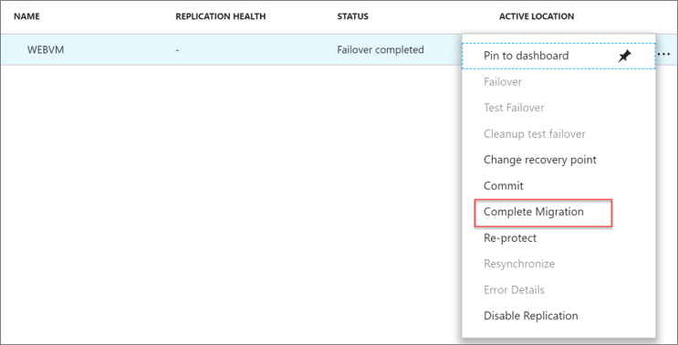

### Update the connection string

As the final step in the migration process, Contoso admins update the connection string of the application to point to the migrated database that's running on Contoso's Managed Instance.

1. In the Azure portal, they find the connection string by selecting **Settings** > **Connection Strings**.

      

2. They update the string with the user name and password of the SQL Database Managed Instance.
3. After the string is configured, they replace the current connection string in the web.config file of its application.
4. After updating the file and saving it, they restart IIS on WEBVM by running `IISRESET /RESTART` in a Command Prompt window.
5. After IIS is restarted, the app uses the database that's running on the SQL Database Managed Instance.
6. At this point, they can shut down on-premises the SQLVM machine. The migration has been completed.

*Need more help?*

- Learn how to [run a test failover](https://docs.microsoft.com/azure/site-recovery/tutorial-dr-drill-azure). 
- Learn how to [create a recovery plan](https://docs.microsoft.com/azure/site-recovery/site-recovery-create-recovery-plans).
- Learn how to [fail over to Azure](https://docs.microsoft.com/azure/site-recovery/site-recovery-failover).

## Clean up after migration

With the migration complete, the SmartHotel360 app is running on an Azure VM and the SmartHotel360 database is available in the Azure SQL Database Managed Instance.  

Now, Contoso needs to do the following cleanup tasks:  

- Remove the WEBVM machine from the vCenter Server inventory.
- Remove the SQLVM machine from the vCenter Server inventory.
- Remove WEBVM and SQLVM from local backup jobs.
- Update internal documentation to show the new location and IP address for WEBVM.
- Remove SQLVM from internal documentation. Alternatively, Contoso can revise the documentation to show SQLVM as deleted and no longer in the VM inventory.
- Review any resources that interact with the decommissioned VMs. Update any relevant settings or documentation to reflect the new configuration.

## Review the deployment

With the migrated resources in Azure, Contoso needs to fully operationalize and secure its new infrastructure.

### Security

The Contoso security team reviews the Azure VMs and SQL Database Managed Instance to check for any security issues with its implementation:

- The team reviews the network security groups that are used to control access for the VM. Network security groups help ensure that only traffic that is allowed to the app can pass.
- Contoso's security team also is considering securing the data on the disk by using Azure Disk Encryption and Azure Key Vault.
- The team enables threat detection on the Managed Instance. Threat detection sends an alert to Contoso's security team/service desk system to open a ticket if a threat is detected. Learn more about [threat detection for Managed Instance](https://docs.microsoft.com/azure/sql-database/sql-database-managed-instance-threat-detection).

     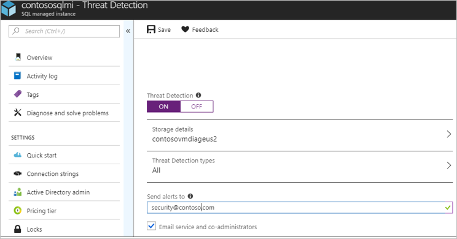  

To learn more about security practices for VMs, see [Security best practices for IaaS workloads in Azure](https://docs.microsoft.com/azure/security/azure-security-best-practices-vms#vm-authentication-and-access-control).

### BCDR

For business continuity and disaster recovery (BCDR), Contoso takes the following actions:

- Keep data safe: Contoso backs up the data on the VMs using the Azure Backup service. [Learn more]https://docs.microsoft.com/azure/backup/backup-introduction-to-azure-backup?toc=%2fazure%2fvirtual-machines%2flinux%2ftoc.json).
- Keep apps up and running: Contoso replicates the app VMs in Azure to a secondary region using Site Recovery. [Learn more](https://docs.microsoft.com/azure/site-recovery/azure-to-azure-quickstart).
- Contoso learns more about managing SQL Managed Instance, including [database backups](https://docs.microsoft.com/azure/sql-database/sql-database-automated-backups).

### Licensing and cost optimization

- Contoso has an existing licensing for WEBVM. To take advantage of pricing with Azure Hybrid Benefit, Contoso converts the existing Azure VM.
- Contoso enables Azure Cost Management licensed by Cloudyn, a Microsoft subsidiary. Cost Management is a multi-cloud cost management solution that helps Contoso use and manage Azure and other cloud resources. Learn more about [Azure Cost Management](https://docs.microsoft.com/azure/cost-management/overview). 

## Conclusion

In this article, Contoso rehosts the SmartHotel360 app in Azure by migrating the app front-end VM to Azure by using the Site Recovery service. Contoso migrates the on-premises database to an Azure SQL Database Managed Instance by using the Azure Database Migration Service.

## Next steps

In the next article in the series, Contoso [rehosts the SmartHotel360 app on Azure VMs](contoso-migration-rehost-vm.md) by using the Azure Site Recovery service.

