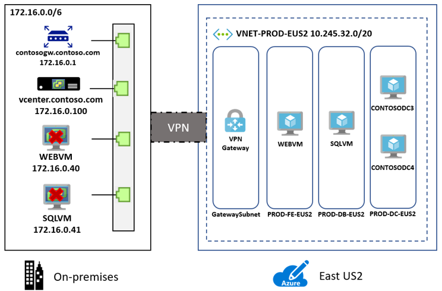
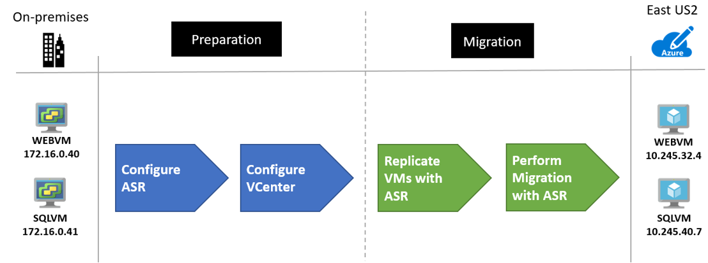
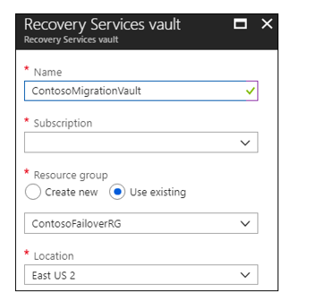
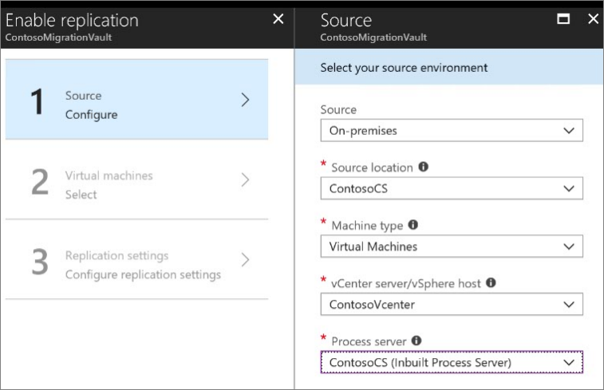
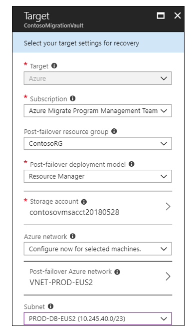
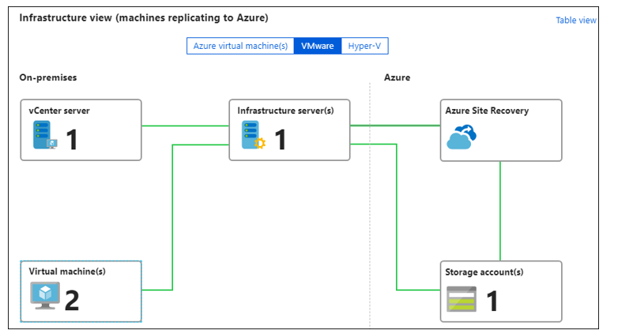
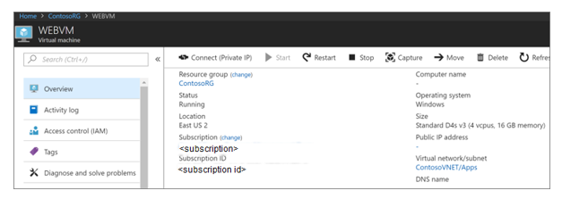
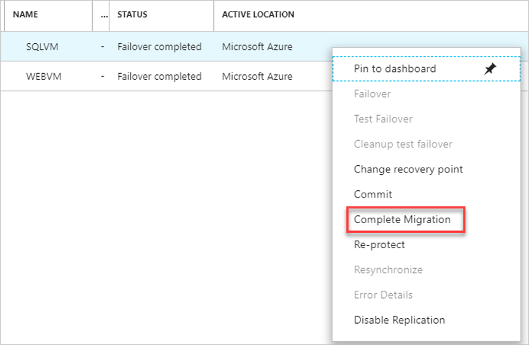

# Contoso migration: Rehost an on-premises app to Azure VMs

This article demonstrates how Contoso rehosts the on-premises SmartHotel app in Azure, by migrating the app VMs to Azure VMs.

This document is one in a series of articles that show how the fictitious company Contoso migrates n-premises resources to the Microsoft Azure cloud. The series includes background information, and scenarios that illustrate setting up a migration infrastructure, assessing on-premises resources for migration, and running different types of migrations. Scenarios grow in complexity, and we'll add additional articles over time.

**Article** | **Details** | **Status**
--- | --- | ---
[Article 1: Overview](contoso-migration-overview.md) | Provides an overview of Contoso's migration strategy, the article series, and the sample apps we use. | Available
[Article 2: Deploy an Azure infrastructure](contoso-migration-infrastructure.md) | Describes how Contoso prepares its on-premises and Azure infrastructure for migration. The same infrastructure is used for all migration articles. | Available
[Article 3: Assess on-premises resources for migration to Azure](contoso-migration-assessment.md)  | Shows how Contoso runs an assessment of an on-premises two-tier SmartHotel app running on VMware. Contoso assesses app VMs with the [Azure Migrate](migrate-overview.md) service, and the app SQL Server database with the [Database Migration Assistant](https://docs.microsoft.com/sql/dma/dma-overview?view=sql-server-2017). | Available
[Article 4: Rehost an app on Azure VMs and a SQL Managed Instance](contoso-migration-rehost-vm-sql-managed-instance.md) | Demonstrates how Contoso runs a lift-and-shift migration to Azure for the on-premises SmartHotel app. Contoso migrates the app frontend VM using [Azure Site Recovery](https://docs.microsoft.com/azure/site-recovery/site-recovery-overview), and the app database to a SQL Managed Instance, using the [Azure Database Migration Service](https://docs.microsoft.com/azure/dms/dms-overview). | Available
Article 5: Rehost an app on Azure VMs | Shows how Contoso migrate the SmartHotel app VMs to Azure VMs, using the Site Recovery service. | This article.
[Article 6: Rehost an app on Azure VMs and SQL Server Always On Availability Group](contoso-migration-rehost-vm-sql-ag.md) | Shows how Contoso migrates the SmartHotel app. Contoso uses Site Recovery to migrate the app VMs, and the Database Migration service to migrate the app database to a SQL Server cluster protected by an AlwaysOn availability group. | Available
[Article 7: Rehost a Linux app on Azure VMs](contoso-migration-rehost-linux-vm.md) | Shows how Contoso does a lift-and-shift migration of the Linux osTicket app to Azure VMs, using Site Recovery | Available
[Article 8: Rehost a Linux app on Azure VMs and Azure MySQL](contoso-migration-rehost-linux-vm-mysql.md) | Demonstrates how Contoso migrates the Linux osTicket app to Azure VMs using Site Recovery, and migrates the app database to an Azure MySQL Server instance using MySQL Workbench. | Available
[Article 9: Refactor an app on Azure Web Apps and Azure SQL database](contoso-migration-refactor-web-app-sql.md) | Demonstrates how Contoso migrates the SmartHotel app to an Azure Web App, and migrates the app database to Azure SQL Server instance | Available
[Article 10: Refactor a Linux app on Azure Web Apps and Azure MySQL](contoso-migration-refactor-linux-app-service-mysql.md) | Shows how Contoso migrates the Linux osTicket app to Azure Web Apps in multiple sites, integrated with GitHub for continuous delivery. They migrate the app database to an Azure MySQL instance. | Available
[Article 11: Refactor TFS on VSTS](contoso-migration-tfs-vsts.md) | Shows how Contoso migrates their on-premises Team Foundation Server (TFS) deployment by migrating it to Visual Studio Team Services (VSTS) in Azure. | Available
[Article 12: Rearchitect an app on Azure containers and Azure SQL Database](contoso-migration-rearchitect-container-sql.md) | Shows how Contoso migrates and rearchitects their SmartHotel app to Azure. They rearchitect the app web tier as a Windows container, and the app database in an Azure SQL Database. | Available
[Article 13: Rebuild an app in Azure](contoso-migration-rebuild.md) | Shows how Contoso rebuild their SmartHotel app using a range of Azure capabilities and services, including App Services, Azure Kubernetes, Azure Functions, Cognitive services, and Cosmos DB. | Available

In this article, Contoso will migrate the two-tier Windows. NET SmartHotel app running on VMware VMs, to Azure. If you want to use this app, it's provided as open-source and you can download it from [github](https://github.com/Microsoft/SmartHotel360).

## Business drivers

The IT Leadership team has worked closely with business partners to understand what they want to achieve with this migration:

- **Address business growth**: Contoso is growing, and as a result there is pressure on their on-premises systems and infrastructure.
- **Limit risk**: The SmartHotel app is critical for the Contoso business. They want to move it to Azure with zero risk.
- **Extend**:  Contoso doesn't want to modify the app. They simply want to ensure that it's stable.

## Migration goals

The Contoso cloud team has pinned down goals for this migration. These goals are used to determine the best migration method:

- After migration, the app in Azure should have the same performance capabilities as it does today in VMware.  The app will remain as critical in the cloud as it is on-premises. 
- Contoso doesn’t want to invest in this app.  It is important to the business, but in its current form they simply want to move it safely to the cloud.
- Contoso doesn't want to change the ops model for this app. They want to interact with it in the cloud in the same way that they do now.
- Contoso doesn't want to change any app functionality. Only the app location will change.

## Proposed architecture

Here's the current environment

- The app is tiered across two VMs (**WEBVM** and **SQLVM**).
- The VMs are located on VMware ESXi host **contosohost1.contoso.com** (version 6.5).
- The VMware environment is managed by vCenter Server 6.5 (**vcenter.contoso.com**), running on a VM.
- Contoso has an on-premises datacenter (contoso-datacenter), with an on-premises domain controller (**contosodc1**).
- The on-premises VMs in the Contoso datacenter will be decommissioned after the migration is done.

 

## Migration process

Contoso will migrate the app frontend and database VMs to Azure VMs using Site Recovery:

- As a first step, they'll prepare and set up Azure components for Site Recovery, and prepare the on-premises VMware infrastructure.
- They already have their [Azure infrastructure](contoso-migration-infrastructure.md) in place, so they just need to add a couple of Azure components specifically for Site Recovery.
- With everything prepared, they can start replicating the VMs.
-After replication is enabled and working, they migrate the VM by failing it over to Azure.

 

### Azure services

**Service** | **Description** | **Cost**
--- | --- | ---
[Azure Site Recovery](https://docs.microsoft.com/azure/site-recovery/) | The service orchestrates and manages migration and disaster recovery for Azure VMs, and on-premises VMs and physical servers.  | During replication to Azure, Azure Storage charges are incurred.  Azure VMs are created, and incur charges, when failover occurs. [Learn more](https://azure.microsoft.com/pricing/details/site-recovery/) about charges and pricing.

## Prerequisites

Here's what you (and Contoso) need to run this scenario.

**Requirements** | **Details**
--- | ---
**Azure subscription** | You should have already created a subscription during early articles in this series. If you don't have an Azure subscription, create a [free account](https://azure.microsoft.com/pricing/free-trial/).   If you create a free account, you're the administrator of your subscription and can perform all actions.   If you use an existing subscription and you're not the administrator, you need to work with the admin to assign you Owner or Contributor permissions.   If you need more granular permissions, review [this article](../site-recovery/site-recovery-role-based-linked-access-control.md). 
**Azure infrastructure** | [Learn how](contoso-migration-infrastructure.md) Contoso set up an Azure infrastructure.   Learn more about specific [network](https://docs.microsoft.com/azure/site-recovery/vmware-physical-azure-support-matrix#network) and [storage](https://docs.microsoft.com/azure/site-recovery/vmware-physical-azure-support-matrix#storage) requirements for Site Recovery.
**On-premises servers** | On-premises vCenter Servers should be running version 5.5, 6.0, or 6.5   ESXi hosts should run version 5.5, 6.0 or 6.5   One or more VMware VMs should be running on the ESXi host.
**On-premises VMs** | VMs must meet [Azure requirements](https://docs.microsoft.com/azure/site-recovery/vmware-physical-azure-support-matrix#azure-vm-requirements).

## Scenario steps

Here's how Contoso will run the migration:

> [!div class="checklist"]
> * **Step 1: Prepare Azure for Site Recovery**: They create an Azure storage account to hold replicated data, and a Recovery Services vault.
> * **Step 2: Prepare on-premises VMware for Site Recovery**: They prepare accounts for VM discovery and agent installation, and prepare to connect to Azure VMs after failover.
> * **Step 3: Replicate VMs**: They set up replication, and start replicating VMs to Azure storage.
> * **Step 4: Migrate the VMs with Site Recovery**: They run a test failover to make sure everything's working, and then run a full failover to migrate the VMs to Azure.

## Step 1: Prepare Azure for the Site Recovery service

Here are the Azure components Contoso needs to migrate the VMs to Azure:

- A VNet in which Azure VMs will be located when they're created during failover.
- An Azure storage account to hold replicated data. 
- A Recovery Services vault in Azure.

They set these up as follows:

1. Contoso already set up a network they can use for Site Recovery when they [deployed the Azure infrastructure](contoso-migration-infrastructure.md)

    - The SmartHotel app is a production app, and the VMs will be migrated to the Azure production network (VNET-PROD-EUS2) in the primary East US 2 region.
    - Both VMs will be placed in the ContosoRG resource group, which is used for production resources.
    - The app frontend VM (WEBVM) will migrate to the frontend subnet (PROD-FE-EUS2), in the production network.
    - The app database VM (SQLVM) will migrate to the database subnet (PROD-DB-EUS2), in the production network.

2. Contoso creates an Azure storage account (contosovmsacc20180528) in the primary region.
    - The storage account must be in the same region as the Recovery Services vault.
    - They use a general-purpose account, with standard storage, and LRS replication. 

    

3. With the network and storage account in place, Contoso now creates a Recovery Services vault (ContosoMigrationVault), and places it in the ContosoFailoverRG resource group in the primary East US 2 region.

    

**Need more help?**

[Learn about](https://docs.microsoft.com/azure/site-recovery/tutorial-prepare-azure) setting up Azure for Site Recovery.

## Step 2: Prepare on-premises VMware for Site Recovery

Here's what Contoso prepares on-premises:

- An account on the vCenter server or vSphere ESXi host, to automate VM discovery.
- An account that allows automatic installation of the Mobility service on the VMware VMs. 
- On-premises VM settings, so that Contoso can connect to the replicated Azure VMs after failover.

### Prepare an account for automatic discovery

Site Recovery needs access to VMware servers to:

- Automatically discover VMs. 
- Orchestrate replication, failover, and failback for VMs.
- At least a read-only account is required. The account should be able to run operations such as creating and removing disks, and turning on VMs.

Contoso sets up the account as follows:

1. They create a role at the vCenter level.
2. They assign that role the required permissions.

### Prepare an account for Mobility service installation

The Mobility service must be installed on each VM.

- Site Recovery can do an automatic push installation of the Mobility service when VM replication is enabled.
- An account is required, so that Site Recovery can access the VMs for the push installation. You specify this account when you set up replication.
- The account can be domain or local, with permissions to install on the VMs.

### Prepare to connect to Azure VMs after failover

After failover, Contoso wants to connect to the Azure VMs. To do this, they do the following before migration:

1. For access over the internet they:

 - Enable RDP on the on-premises VM before failover
 - Ensure that TCP and UDP rules are added for the **Public** profile.
 - Check that RDP is allowed in **Windows Firewall** > **Allowed Apps** for all profiles.
 
2. For access over site-to-site VPN, they:

 - Enable RDP on the on-premises machine.
 - Allow RDP in the **Windows Firewall** -> **Allowed apps and features**, for **Domain and Private** networks.
 - Set the operating system's SAN policy on the on-premises VM to **OnlineAll**.

In addition, when they run a failover they need to check the following:

- There should be no Windows updates pending on the VM when triggering a failover. If there are, they won't be able to log into the VM until the update completes.
- After failover, they can check **Boot diagnostics** to view a screenshot of the VM. If this doesn't work, they should verify that the VM is running, and review these [troubleshooting tips](http://social.technet.microsoft.com/wiki/contents/articles/31666.troubleshooting-remote-desktop-connection-after-failover-using-asr.aspx).

**Need more help?**

- [Learn about](https://docs.microsoft.com/azure/site-recovery/vmware-azure-tutorial-prepare-on-premises#prepare-an-account-for-automatic-discovery) creating and assigning a role for automatic discovery.
- [Learn about](https://docs.microsoft.com/azure/site-recovery/vmware-azure-tutorial-prepare-on-premises#prepare-an-account-for-mobility-service-installation) creating an account for push installation of the Mobility service.

## Step 3: Replicate the on-premises VMs

Before they can run a migration to Azure, Contoso needs to set up and enable replication.

### Set a replication goal

1. In the vault, under the vault name (ContosoVMVault) they select a replication goal (**Getting Started** > **Site Recovery** > **Prepare infrastructure**.
2. They specify that their machines are located on-premises, running on VMware, and replicating to Azure.

    

### Confirm deployment planning

To continue, they confirm that they have completed deployment planning, by selecting **Yes, I have done it**. In this scenario, Contoso are only migrating two VMs, and don't need deployment planning.

### Set up the source environment

Contoso needs to configure their source environment. To do this, they download an OVF template and use it to deploy the Site Recovery configuration server as a highly available, on-premises VMware VM. After the configuration server is up and running, they register it in the vault.

The configuration server runs a number of components:

- The configuration server component that coordinates communications between on-premises and Azure and manages data replication.
- The process server that acts as a replication gateway. It receives replication data; optimizes it with caching, compression, and encryption; and sends it to Azure storage.
- The process server also installs Mobility Service on VMs you want to replicate and performs automatic discovery of on-premises VMware VMs.

Contoso performs these steps as follows:

1. In the vault, they download the OVF template from **Prepare Infrastructure** > **Source** > **Configuration Server**.
    
    

2. They import the template into VMware to create and deploy the VM.

    

3.  When they turn on the VM for the first time, it boots up into a Windows Server 2016 installation experience. They accept the license agreement, and enter an administrator password.
4. After the installation finishes, they sign in to the VM as the administrator. At first sign-in, the Azure Site Recovery Configuration Tool runs by default.
5. In the tool, they specify a name to register the configuration server in the vault.
6. The tool checks that the VM can connect to Azure. After the connection is established, they sign in to the Azure subscription. The credentials must have access to the vault in which they'll register the configuration server.

    

7. The tool performs some configuration tasks and then reboots.
8. They sign in to the machine again, and the Configuration Server Management Wizard starts automatically.
9. In the wizard, they select the NIC to receive replication traffic. This setting can't be changed after it's configured.
10. They select the subscription, resource group, and the vault in which to register the configuration server.
         

10. They download and install MySQL Server, and VMWare PowerCLI. 
11. After validation, they specify the FQDN or IP address of the vCenter server or vSphere host. They leave the default port, and specify a friendly name for the server in Azure.
12. They specify the account that they created for automatic discovery, and the credentials that are used to automatically install the Mobility Service. For Windows machines, the account needs local administrator privileges on the VMs.

    

7. After registration finishes, in the Azure portal, Contoso double checks that the configuration server and VMware server are listed on the **Source** page in the vault. Discovery can take 15 minutes or more. 
8. Site Recovery then connects to VMware servers using the specified settings, and discovers VMs.

### Set up the target

Now Contoso specifies the target replication settings.

1. In **Prepare infrastructure** > **Target**, they select the target settings.
2. Site Recovery checks that there's an Azure storage account and network in the specified target location.

### Create a replication policy

Now Contoso can create a replication policy.

1. In  **Prepare infrastructure** > **Replication Settings** > **Replication Policy** >  **Create and Associate**, they create a policy **ContosoMigrationPolicy**.
2. They use the default settings:
    - **RPO threshold**: Default of 60 minutes. This value defines how often recovery points are created. An alert is generated if continuous replication exceeds this limit.
    - **Recovery point retention**. Default of 24 hours. This value specifies how long the retention window is for each recovery point. Replicated VMs can be recovered to any point in a window.
    - **App-consistent snapshot frequency**. Default of one hour. This value specifies the frequency at which application-consistent snapshots are created.

        

5. The policy is automatically associated with the configuration server. 

    

### Enable replication for WEBVM

With everything in place, Contoso can enable replication for the VMs. They start with WebVM.

1. In **Replicate application** > **Source** > **+Replicate** they select the source settings.
2. They indicate that they want to enable VMs, select the vCenter server, and the configuration server.

    

3. They select the target settings, including the resource group and Azure network, and the storage account.

     

4. Contoso selects **WebVM** for replication, checks the replication policy, and enables replication.

    - At this stage Contoso only selects WEBVM because VNet and subnet must be selected, and the Contoso is placing the app VMs in different subnets.
    - Site Recovery automatically installs the Mobility service on the VM when replication is enabled.

    

5. They track replication progress in **Jobs**. After the **Finalize Protection** job runs, the machine is ready for failover.
6. In **Essentials** in the Azure portal, Contoso can see the structure for the VMs replicating to Azure.

### Enable replication for SQLVM

Now Contoso can start replicating the SQLVM machine, using the same process as above.

1. They select source settings.

    

2. They then specify the target settings.

     

3. They select SQLVM for replication. 

    

4. They apply the same replication policy that was used for WEBVM, and enable replication.

    

**Need more help?**

- You can read a full walkthrough of all these steps in [Set up disaster recovery for on-premises VMware VMs](https://docs.microsoft.com/azure/site-recovery/vmware-azure-tutorial).
- Detailed instructions are available to help you [set up the source environment](https://docs.microsoft.com/azure/site-recovery/vmware-azure-set-up-source), [deploy the configuration server](https://docs.microsoft.com/azure/site-recovery/vmware-azure-deploy-configuration-server), and [configure replication settings](https://docs.microsoft.com/azure/site-recovery/vmware-azure-set-up-replication).
- You can learn more about [enabling replication](https://docs.microsoft.com/azure/site-recovery/vmware-azure-enable-replication).

## Step 4: Migrate the VMs 

Contoso runs a quick test failover, and then a full failover to migrate the VMs.

### Run a test failover

A test failover helps to ensure that everything's working as expected. 

1. Contoso runs a test failover to the latest available point in time (**Latest processed**).
2. They select **Shut down machine before beginning failover**, so that Site Recovery attempts to shut down the source VM before triggering the failover. Failover continues even if shutdown fails. 
3. Test failover runs: 

    - A prerequisites check runs to make sure all of the conditions required for migration are in place.
    - Failover processes the data, so that an Azure VM can be created. If select the latest recovery point, a recovery point is created from the data.
    - An Azure VM is created using the data processed in the previous step.
    
3. After the failover finishes, the replica Azure VM appears in the Azure portal. Contoso checks that the VM is the appropriate size,  connected to the right network, and is running. 
4. After verifying the test failover, they clean up the failover, and record and save any observations. 

### Create and customize a recovery plan

 After verifying that the test failover worked as expected, Contoso creates a recovery plan for migration. 

- A recovery plan specifies the order in which failover occurs, and indicates how Azure VMs will be brought online in Azure.
- Since the app is two-tier, they customize the recovery plan so that the data VM (SQLVM) starts before the frontend (WEBVM).

1. In **Recovery Plans (Site Recovery)** > **+Recovery Plan**, they create a plan and add the VMs to it.

    

2. After creating the plan, they customize it (**Recovery Plans** > **SmartHotelMigrationPlan** > **Customize**).
2.	They remove WEBVM from **Group 1: Start**.  This ensures that the first start action affects SQLVM only.
3.	In **+Group** > **Add protected items**, they add WEBVM to Group 2: Start.  The VMs need to be in two different groups.

### Migrate the VMs

Now Contoso can run a full failover to complete the migration.

1. They select the recovery plan > **Failover**.
2. They select to fail over to the latest recovery point, and that Site Recovery should try to shut down the on-premises VM before triggering the failover. They can follow the failover progress on the **Jobs** page.

    

3. After the failover, they verify that the Azure VM appears as expected in the Azure portal.

      

3. After verification, they complete the migration for each VM. This stops replication for the VM, and stops Site Recovery billing for it.

    

**Need more help?**

- [Learn about](https://docs.microsoft.com/azure/site-recovery/tutorial-dr-drill-azure) running a test failover. 
- [Learn](https://docs.microsoft.com/azure/site-recovery/site-recovery-create-recovery-plans) how to create a recovery plan.
- [Learn about](https://docs.microsoft.com/azure/site-recovery/site-recovery-failover) failing over to Azure.

## Clean up after migration

With migration complete, the SmartHotel app tiers are now running on Azure VMs.

Now, Contoso needs to complete these cleanup steps:  

- Remove the WEBVM machine from the vCenter inventory.
- Remove the SQLVM machine from the vCenter inventory.
- Remove WEBVM and SQLVM from local backup jobs.
- Update internal documentation to show the new location, and IP addresses for the VMs.
- Review any resources that interact with the VMs, and update any relevant settings or documentation to reflect the new configuration.

## Review the deployment

With the app now running, Contoso now needs to fully operationalize and secure it in Azure.

### Security

The Contoso security team reviews the Azure VMs, to determine any security issues.

- To control access, they review the Network Security Groups (NSGs) for the VMs. NSGs are used to ensure that only traffic allowed to the app can reach it.
- They also consider securing the data on the disk using Azure Disk Encryption and KeyVault.

[Read more](https://docs.microsoft.com/azure/security/azure-security-best-practices-vms#vm-authentication-and-access-control) about security practices for VMs.

### Backups

Contoso is going to back up the data on the VMs using the Azure Backup service. [Learn more](https://docs.microsoft.com/azure/backup/backup-introduction-to-azure-backup?toc=%2fazure%2fvirtual-machines%2flinux%2ftoc.json).

### Licensing and cost optimization

1. Contoso has existing licensing for their VMs, and will leverage the Azure Hybrid Benefit.  They will convert the existing Azure VMs, to take advantage of this pricing.
2. Contoso will enable Azure Cost Management licensed by Cloudyn, a Microsoft subsidiary. It's a multi-cloud cost management solution that helps to utilize and manage Azure and other cloud resources. [Learn more](https://docs.microsoft.com/azure/cost-management/overview) about Azure Cost Management. 

## Conclusion

In this article, Contoso rehosted the SmartHotel app in Azure by migrating the app VMs to Azure VMs using the Site Recovery service. 

## Next steps

In the [next article](contoso-migration-rehost-vm-sql-ag.md) in the series, we'll show you how Contoso rehosts the SmartHotel app frontend VM on an Azure VM, and migrates the database to a SQL Server AlwaysOn Availability Group in Azure.

