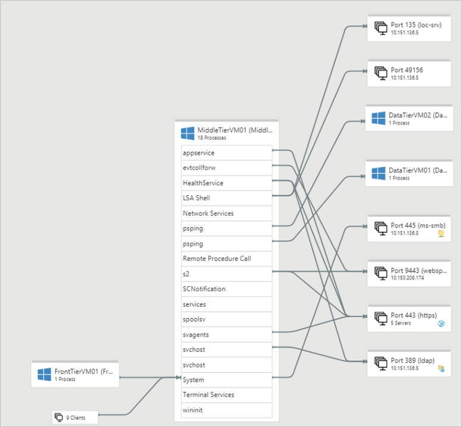
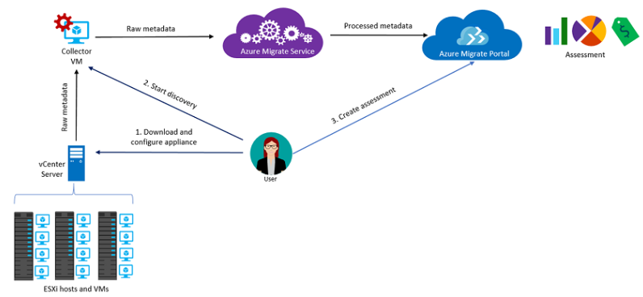
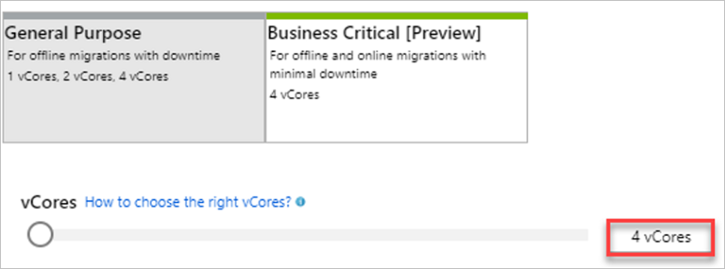
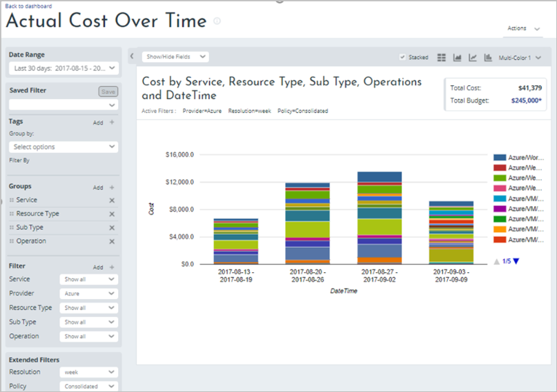

# Contoso - Scale a migration to Azure

In this article, Contoso performs a migration at scale to Azure. They consider how to plan and perform a migration of more than 3000 workloads, 8000 databases, and over 10,000 VMs.

This article is one in a series of articles that document how the fictitious company Contoso migrates its on-premises resources to the Microsoft Azure cloud. The series includes background and planning information, and deployment scenarios that illustrate how to set up a migration infrastructure, assess the suitability of on-premises resources for migration, and run different types of migrations. Scenarios grow in complexity. We'll add articles to the series over time.

**Article** | **Details** | **Status**
--- | --- | ---
[Article 1: Overview](contoso-migration-overview.md) | Overview of the article series, Contoso's migration strategy, and the sample apps that are used in the series. | Available
[Article 2: Deploy an Azure infrastructure](contoso-migration-infrastructure.md) | Contoso prepares its on-premises infrastructure and its Azure infrastructure for migration. The same infrastructure is used for all migration articles in the series. | Available.
[Article 3: Assess on-premises resources for migration to Azure](contoso-migration-assessment.md)  | Contoso runs an assessment of its on-premises SmartHotel360 app running on VMware. Contoso assesses app VMs using the Azure Migrate service, and the app SQL Server database using Data Migration Assistant. | Available
[Article 4: Rehost an app on an Azure VM and SQL Database Managed Instance](contoso-migration-rehost-vm-sql-managed-instance.md) | Contoso runs a lift-and-shift migration to Azure for its on-premises SmartHotel360 app. Contoso migrates the app front-end VM using [Azure Site Recovery](https://docs.microsoft.com/azure/site-recovery/site-recovery-overview). Contoso migrates the app database to an Azure SQL Database Managed Instance using the [Azure Database Migration Service](https://docs.microsoft.com/azure/dms/dms-overview). | Available	
[Article 5: Rehost an app on Azure VMs](contoso-migration-rehost-vm.md) | Contoso migrates its SmartHotel360 app VMs to Azure VMs using the Site Recovery service. | Available
[Article 6: Rehost an app on Azure VMs and in a  SQL Server AlwaysOn availability group](contoso-migration-rehost-vm-sql-ag.md) | Contoso migrates the app, using Site Recovery to migrate the app VMs, and the Database Migration Service to migrate the app database to a SQL Server cluster that's protected by an AlwaysOn availability group. | Available
[Article 7: Rehost a Linux app on Azure VMs](contoso-migration-rehost-linux-vm.md) | Contoso completes a lift-and-shift migration of its Linux osTicket app to Azure VMs, using the Site Recovery service. | Available
[Article 8: Rehost a Linux app on Azure VMs and Azure Database for MySQL](contoso-migration-rehost-linux-vm-mysql.md) | Contoso migrates its Linux osTicket app to Azure VMs by using Site Recovery. It migrates the app database to Azure Database for MySQL by using MySQL Workbench. | Available
[Article 9: Refactor an app in an Azure web app and Azure SQL Database](contoso-migration-refactor-web-app-sql.md) | Contoso migrates its SmartHotel360 app to an Azure web app and migrates the app database to an Azure SQL Server instance with the Database Migration Assistant. | Available	
[Article 10: Refactor a Linux app in an Azure web app and Azure Database for MySQL](contoso-migration-refactor-linux-app-service-mysql.md) | Contoso migrates its Linux osTicket app to an Azure web app on multiple sites. The web app is integrated with GitHub for continuous delivery. It migrates the app database to an Azure Database for MySQL instance. | Available
[Article 11: Refactor Team Foundation Server on Azure DevOps Services](contoso-migration-tfs-vsts.md) | Contoso migrates its on-premises Team Foundation Server deployment to Azure DevOps Services in Azure. | Available
[Article 12: Rearchitect an app in Azure containers and Azure SQL Database](contoso-migration-rearchitect-container-sql.md) | Contoso migrates its SmartHotel app to Azure. Then, it rearchitects the app web tier as a Windows container running in Azure Service Fabric, and the app database with Azure SQL Database. | Available	
[Article 13: Rebuild an app in Azure](contoso-migration-rebuild.md) | Contoso rebuilds its SmartHotel app by using a range of Azure capabilities and services, including Azure App Service, Azure Kubernetes Service (AKS), Azure Functions, Azure Cognitive Services, and Azure Cosmos DB. | Available	
Article 14: Scale a migration to Azure | After trying out migration combinations, Contoso prepares to scale to a full migration to Azure. | This article

## Business drivers

The IT leadership team has worked closely with business partners to understand what they want to achieve with this migration:

- **Address business growth**: Contoso is growing, causing pressure on on-premises systems and infrastructure.
- **Increase efficiency**: Contoso needs to remove unnecessary procedures, and streamline processes for developers and users. The business needs IT to be fast and not waste time or money, thus delivering faster on customer requirements.
- **Increase agility**: Contoso IT needs to be more responsive to the needs of the business. It must be able to react faster than the changes in the marketplace, to enable the success in a global economy. It mustn't get in the way, or become a business blocker.
- **Scale**: As the business grows successfully, the Contoso IT team must provide systems that are able to grow at the same pace.
- **Improve cost models**: Contoso wants to lessen capital requirements in the IT budget.  Contoso wants to use cloud abilities to scale and reduce the need for expensive hardware.
- **Lower licensing costs**: Contoso wants to minimize cloud costs.

## Migration goals

The Contoso cloud team has pinned down goals for this migration. These goals were used to determine the best migration method.

**Requirements** | **Details**
--- | --- 
**Move to Azure quickly** | Contoso wants to start moving apps and VMs to Azure as quickly as possible.
**Compile a full inventory** | Contoso wants a complete inventory of all apps, databases, and VMs in the organization.
**Assess and classify apps** | Contoso wants fully leverage the cloud. As a default Contoso assumes that all services will run as PaaS. IaaS will be used where PaaS isn't appropriate. 
**Train and move to DevOps** | Contoso wants to move to a DevOps model. Contoso will provide Azure and DevOps training, and reorganize teams as necessary. 

After pinning down goals and requirements, Contoso reviews the IT footprint, and identifies the migration process.

## Current deployment

After planning and setting up an [Azure infrastructure](contoso-migration-infrastructure.md) and trying out different proof-of-concept (POC) migration combinations as detailed in the table above, Contoso is ready to embark on a full migration to Azure at scale. Here's what Contoso wants to migrate.

**Item** | **Volume** | **Details**
--- | --- | ---
**Workloads** | More than 3,000 apps | Apps run on VMs.    Apps are Windows, SQL-based, and OSS LAMP.
**Databases** | Around 8,500 | Databases include SQL Server, MySQL, PostgreSQL.
**VMs** | More than 10,000 | VMs run on VMware hosts and managed by vCenter Servers.

## Migration process

Now that Contoso have pinned down business drivers and migration goals, it determines a four-pronged approach for the migration process:

- **Phase 1-Assess**: Discover the current assets, and figure out whether they're suitable for migration to Azure.
- **Phase 2-Migrate**: Move the assets to Azure. How they move apps and objects to Azure will depend upon the app, and what they want to achieve.
- **Phase 3-Optimize**: After moving resources to Azure, Contoso needs to improve and streamline them for maximum performance and efficiency.
- **Phase 4-Secure & Manage**: With everything in place, Contoso now uses Azure security and management resources and services to govern, secure, and monitor its cloud apps in Azure.

These phases aren't serial across the organization. Each piece of Contoso's migration project will be at a different stage of the assessment and migration process. Optimization, security, and management will be ongoing over time.

## Phase 1: Assess

Contoso kicks off the process by discovering and assessing on-premises apps, data, and infrastructure. Here's what Contoso will do:

- Contoso needs to discover apps, maps dependencies across apps, and decide on migration order and priority.
- As Contoso assesses, it will build out a comprehensive inventory of apps and resources. Along with the new inventory, Contoso will use and update the existing Configuration Management Database (CMDB) and Service Catalog.
    - The CMDB holds technical configurations for Contoso apps.
    - The Service Catalog documents the operational details of apps, including associated business partners, and Service Level Agreements (SLAs)

### Discover apps

Contoso runs thousands of apps across a range of servers. In addition to the CMDB and Service Catalog, Contoso needs discovery and assessment tools. 

- The tools must provide a mechanism that can feed assessment data into the migration process.
- Assessment tools must provide data that helps build up an intelligent inventory of Contoso's physical and virtual resources. Data should include profile information, and performance metrics.
- When discovery is complete, Contoso should have a complete inventory of assets, and metadata associated with them. This inventory will be used to define the migration plan.

### Identify classifications

Contoso identifies some common categories to classify assets in the inventory. These classifications are critical to Contoso’s decision making for migration. The classification list helps to establish migration priorities, and identify complex issues.

**Category** | **Assigned Value** | **Details**
--- | --- | ---
Business group | List of business group names | Which group is responsible for the inventory item?
POC candidate |	Y/N	| Can the app be used as a POC or early adopter for cloud migration?
Technical debt | None/Some/Severe | Is the inventory item running or using an out-of-support product, platform or operating system?
Firewall implications | Y/N	| Does the app communicate with the Internet/outside traffic?  Does it integrate with a firewall?
Security issues | Y/N | Are there known security issues with the app?  Does the app use unencrypted data or out-of-date platforms?

### Discover app dependencies

As part of the assessment process, Contoso needs to identify where apps are running, and figure out the dependencies and connections between app servers. Contoso maps the environment in steps.

1. As a first step, Contoso discovers how servers and machines map to individual apps, network locations, and groups.
2. With this information, Contoso can clearly identify apps that have few dependencies, and are thus suitable for a quick migration.
3. Contoso can use mapping to help them identify more complex dependencies and communications between app servers. Contoso can then group these servers logically to represent apps, and plan a migration strategy based on these groups.

With mapping completed, Contoso can ensure that all app components are identified and accounted for when building the migration plan. 

### Evaluate apps

As the last step in the discovery and assessment process, Contoso can evaluate assessment and mapping results to figure out how to migrate each app in the Service Catalog. 

To capture this evaluation process, they add a couple of additional classifications to the inventory.

**Category** | **Assigned Value** | **Details**
--- | --- | ---
Business group | List of business group names | Which group is responsible for the inventory item?
POC candidate |	Y/N	| Can the app be used as a POC or early adopter for cloud migration?
Technical debt | None/Some/Severe | Is the inventory item running or using an out-of-support product, platform or operating system?
Firewall implications | Y/N	| Does the app communicate with the Internet/outside traffic?  Does it integrate with a firewall?
Security issues | Y/N | Are there known security issues with the app?  Does the app use unencrypted data or out-of-date platforms?
Migration strategy | Rehost/Refactor/Rearchitect/Rebuild | What kind of migration is needed for the app? How will the app be deployed in Azure? [Learn more](contoso-migration-overview.md#migration-strategies).
Technical complexity | 1-5 | How complex is the migration? This value should be defined by Contoso DevOps and relevant partners.
Business criticality | 1-5 | How important is the app for the business? For example, a small workgroup app might be assigned a score of one, while a critical app used across the org might be assigned a score of five. This score will impact the migration priority level.
Migration priority | 1/2/3 | What the migration priority for the app?
Migration risk	| 1-5 | What's the risk level for migrating the app? This value should be agreed upon by Contoso DevOps and relevant partners.

### Figure out costs

To figure out costs and the potential savings of Azure migration, Contoso can use the [Total Cost of Ownership (TCO) calculator](https://azure.microsoft.com/pricing/tco/calculator/) to calculate and compare the TCO for Azure to a comparable on-premises deployment.

### Identify assessment tools

Contoso decides which tool to use for discovery, assessment, and building the inventory. Contoso identifies a mix of Azure tools and services, native app tools and scripts, and partner tools. In particular, Contoso is interested in how Azure Migrate can be used to assess at scale.

#### Azure Migrate

The Azure Migrate service helps you to discover and assess on-premises VMware VMs, in preparation for migration to Azure. Here's what Azure Migrate does:

1. Discover: Discover on-premises VMware VMs.
    - Azure Migrate supports discovery from multiple vCenter Servers (serially), and can run discoveries in separate Azure Migrate projects.
    - Azure Migrate performs discovery by means on a VMware VM running the Migrate Collector. The same collector can discover VMs on different vCenter servers, and send data to different projects.
1. Assess readiness: Assess whether on-premises machines are suitable for running in Azure. Assessment includes:
    - Size recommendations: Get size recommendations for Azure VMs, based on the performance history of on-premises VMs.
    - Estimated monthly costs: Get estimated costs for running on-premises machines in Azure.
2. Identify dependencies:  Visualize dependencies of on-premises machines, to create optimal machines groups for assessment and migration.

##### Migrate at scale

Contoso needs to use Azure Migrate correctly give the scale of this migration. 

- Contoso will do an app-by-app assessment with Azure Migrate. This ensures that Azure Migrate returns timely data to the Azure portal.
- Contoso admins read about [deploying Azure Migrate at scale](how-to-scale-assessment.md)
- Contoso notes the Azure Migrate limits summarized in the following table.

**Action** | **Limit**
--- | ---
Create Azure Migrate project | 1500 VMs
Discovery | 1500 VMs
Assessment | 1500 VMs

Contoso will use Azure Migrate as follows:

- In vCenter Contoso will organize VMs into folders. This will make it easy for them to focus as they run an assessment against VMs in a specific folder.
- Azure Migrate uses Azure Service Map to assess dependencies between machines. This requires agents to be installed on VMs to be assessed. 
    - Contoso will use automated scripts to install the required Windows or Linux agents.
    - By scripting, Contoso can push the installation to VMs within a vCenter folder.

#### Database tools

In addition to Azure Migrate, Contoso will focus on using tools specifically for database assessment. Tools such as the [Database Migration Assistant](https://docs.microsoft.com/sql/dma/dma-overview?view=sql-server-2017) will help assess SQL Server databases for migration.

The Data Migration Assistant (DMA) can help Contoso to figure out whether on-premises databases are compatible with a range of Azure database solutions, such as Azure SQL Database, SQL Server running on an Azure IaaS VM, and Azure SQL Managed Instance. 

In addition to DMS, Contoso has some other scripts that they use to discover and documenting the SQL Server databases. These are located in the GitHub repo.

#### Partner tools

There are several other partner tools which can help Contoso in assessing the on-premises environment for migration to Azure. [Learn more](https://azure.microsoft.com/migration/partners/) about Azure Migration partners.  

## Phase 2: Migrate

With their assessment complete Contoso needs to identify tools to move their apps, data, and infrastructure to Azure. 

### Migration strategies

There are four broad migration strategies that Contoso can consider. 

**Strategy** | **Details** | **Usage**
--- | --- | ---
**Rehost**	| Often referred to as “lift and shift” migration, this is a no-code option for migrating existing apps to Azure quickly.   An app is migrated as-is, with the benefits of the cloud, without the risks or costs associated with code changes. | Contoso can rehost less-strategic apps, requiring no code changes.
**Refactor** |	Also referred to as “repackaging", this strategy requires minimal app code or configuration changes need to connect the app to Azure PaaS, and take better advantage of cloud capabilities. | Contoso can refactor strategic apps to retain the same basic functionality, but move them to run on an Azure platform such as Azure App Services.   This requires minimum code changes.   On the other hand, Contoso will have to maintain a VM platform since this won't be managed by Microsoft.
**Rearchitect** | This strategy modifies or extends an app code base to optimize the app architecture for cloud capabilities and scale.   It modernizes an app into a resilient, highly scalable, independently deployable architecture.   Azure services can accelerate the process, scale applications with confidence, and manage apps with ease.
**Rebuild** | This strategy rebuilds an app from scratch using cloud-native technologies.   Azure platform as a service (PaaS) provides a complete development and deployment environment in the cloud. It eliminates some expense and complexity of software licenses, and removes the need for an underlying app infrastructure, middleware, and other resources. | Contoso can rewrite critical apps from the ground up, to take advantage of cloud technologies such as serverless computer, or microservices.   Contoso will manage the app and services it develops, and Azure manages everything else.

Data must also be considered, especially with the volume of databases that Contoso has. Contoso's default approach is to use PaaS services such as Azure SQL Database to take full advantage of cloud features. By moving to a PaaS service for databases, Contoso will only have to maintain data, leaving the underlying platform to Microsoft.

### Evaluate migration tools

Contoso are primarily using a couple of Azure services and tools for the migration:

- [Azure Site Recovery](https://docs.microsoft.com/azure/site-recovery/site-recovery-overview): Orchestrates disaster recovery, and migrates on-premises VMs to Azure.
- [Azure Database Migration Service](https://docs.microsoft.com/azure/dms/dms-overview): Migrates on-premises databases such as SQL Server, MySQL, and Oracle to Azure.

#### Azure Site Recovery

Azure Site Recovery is the primary Azure service for orchestrating disaster recovery and migration from within Azure, and from on-premises sites to Azure.

1. Site Recovery enables, orchestrates replication from your on-premises sites to Azure.
2. When replication is set up and running, on-premises machines can be failed over to Azure, completing the migration.

Contoso already [completed a POC](contoso-migration-rehost-vm.md) to see how Site Recovery can help them to migrate to the cloud.

##### Using Site Recovery at scale

Contoso plans on running multiple lift-and-shift migrations. To ensure this works, Site Recovery will be replicating batches of around 100 VMs at a time. To figure out how this will work, Contoso needs to perform capacity planning for the proposed Site Recovery migration.

- Contoso needs to gather information about their traffic volumes. In particular:
    - Contoso needs to determine the rate of change for VMs it wants to replicate.
    - Contoso also needs to take network connectivity from the on-premises site to Azure into account.
- In response to capacity and volume requirements, Contoso will need to allocate sufficient bandwidth based on the daily data change rate for the required VMs, to meet its recovery point objective (RPO).
- Lastly, they need to figure out how many servers are needed to run the Site Recovery components that are needed for the deployment.

###### Gather on-premises information
Contoso can use the [Site Recovery Deployment Planner](https://docs.microsoft.com/azure/site-recovery/site-recovery-deployment-planner) tool to complete these steps:

- Contoso can use the tool to remotely profile VMs without an impact on the production environment. This helps pinpoint bandwidth and storage requirements for replication and failover.
- Contoso can run the tool without installing any Site Recovery components on-premises.
- The tool gathers information about compatible and incompatible VMs, disks per VM, and data churn per disk. It also identifies network bandwidth requirements, and the Azure infrastructure needed for successful replication and failover.
- Contoso needs to ensure that then run the planner tool on a Windows Server machines that matches the minimum requirements for the Site Recovery configuration server. The configuration server is a Site Recovery machine that's needed in order to replicate on-premises VMware VMs.

###### Identify Site Recovery requirements

In addition to the VMs being replicated, Site Recovery requires a number of components for VMware migration.

**Component** | **Details**
--- | ---
**Configuration server** | Usually a VMware VM set up using an OVF template.   The configuration server component coordinates communications between on-premises and Azure, and manages data replication.
**Process server** | Installed by default on the configuration server.   The process server component receives replication data; optimizes it with caching, compression, and encryption; and sends it to Azure storage.   The process server also installs Azure Site Recovery Mobility Service on VMs you want to replicate, and performs automatic discovery of on-premises machines.   Scaled deployments need additional, standalone process servers to handle large volumes of replication traffic.
**Mobility Service** | The Mobility Service agent is installed on each VMware VM that will be migrated with Site Recovery. 	

Contoso needs to figure out how to deploy these components, based on capacity considerations.

**Component** |	**Capacity requirements**
--- | ---
**Maximum daily change rate** | A single process server can handle a daily change rate up to 2 TB. Since a VM can only use one process server, the maximum daily data change rate that’s supported for a replicated VM is 2 TB.
**Maximum throughput** | A standard Azure storage account can handle a maximum of 20,000 requests per second, and input/output operations per second (IOPS) across a replicating VM should be within this limit. For example, if a VM has 5 disks, and each disk generates 120 IOPS (8K size) on the VM, then it will be within the Azure per disk IOPS limit of 500.   Note that the number of storage accounts needed is equal to the total source machine IOPS, divided by 20,000. A replicated machine can only belong to a single storage account in Azure.
**Configuration server** | Based on Contoso's estimate of replicating 100=200 VMs together, and the [configuration server sizing requirements](https://docs.microsoft.com/azure/site-recovery/site-recovery-plan-capacity-vmware.md#size-recommendations-for-the-configuration-server), Contoso estimate is needs a configuration server machine as follows:   CPU: 16 vCPUs (2 sockets * 8 cores @ 2.5 GHz)   Memory: 32 GB   Cache disk: 1 TB   Data change rate: 1 TB to 2 TB.   In addition to sizing requirements Contoso will need to make sure that the configuration server is optimally located, on the same network and LAN segment as the VMs that will be migrated.
**Process server** | Contoso will deploy a standalone dedicated process server with the ability to replicate 100-200 VMs:   CPU: 16 vCPUs (2 sockets * 8 cores @ 2.5 GHz)   Memory: 32 GB   Cache disk: 1 TB   Data change rate: 1 TB to 2 TB.   The process server will be working hard, and as such should be located on an ESXi host that can handle the disk I/O, network traffic and CPU required for the replication. Contoso will consider a dedicated host for this purpose. 
**Networking** | Contoso has reviewed the current site-to-site VPN infrastructure, and decided to implement Azure ExpressRoute. The implementation is critical because it will lower latency, and improve bandwidth to Contoso's primary East US 2 Azure region.   **Monitoring**: Contoso will need to carefully monitor data flowing from the process server. If the data overloads the network bandwidth Contoso will consider [throttling the process server bandwidth](https://docs.microsoft.com/azure/site-recovery/site-recovery-plan-capacity-vmware.md#control-network-bandwidth).
**Azure storage** | For migration, Contoso must identify the right type and number of target Azure storage accounts.  Site Recovery replicates VM data to Azure storage.   Site Recovery can replicate to standard or premium (SSD) storage accounts.   To decide about storage, Contoso must review [storage limits](https://docs.microsoft.com/azure/virtual-machines/windows/premium-storage), and factor in expected growth and increased usage over time. Given the speed and priority of migrations, Contoso has decided to use premium  storage accounts.   They will create and reuse multiple storage accounts during the migration process.
Contoso has made the decision to use Managed disks for all VMs that are deployed to Azure.  The IOPS required will determine if the disks will be Standard (HDD) or Premium (SSD). . 

#### Data Migration Service 

The Azure Database Migration Service (DMS), is a fully managed service that enables seamless migrations from multiple database sources to Azure data platforms, with minimal downtime.

- DMS integrates functionality of existing tools and services. It uses the Data Migration Assistant (DMA), to generate assessment reports that pinpoint recommendations about database compatibility and any required modifications.
- DMS uses a simple, self-guided migration process, with intelligent assessment that helps address potential issues before the migration.
- DMS can migrate at scale from multiple sources to the target Azure database.
- DMS provides support from SQL Server 2005 to SQL Server 2017.

DMS isn't the only Microsoft database migration tool. Get a [comparison of tools and services](https://blogs.msdn.microsoft.com/datamigration/2017/10/13/differentiating-microsofts-database-migration-tools-and-services/).

###### Using DMS at scale

Contoso will use DMS when migrating from SQL Server.  

- When provisioning DMS, Contoso needs to ensure that it's sized correctly, and set to optimize performance for data migrations. Contoso will select the "business-critical tier with 4 vCores" option, thus allowing the service to take advantage of multiple vCPUs for parallelization and faster data transfer.

    

- Another scaling tactic for Contoso is temporarily scale up the Azure SQL or MySQL Database target instance to the Premium tier SKU during the data migration. This minimizes database throttling that could impact data transfer activities when using lower-level SKUs.

##### Using other tools

In addition to DMS, Contoso can use other tools and services to identify VM information.

- They have scripts to help with manual migrations. These are available in the GitHub repo.
- A number of [partner tools](https://azure.microsoft.com/migration/partners/) can also be used for migration.

## Phase 3: Optimize

After Contoso moves resources to Azure, they need to streamline them to improve performance, and maximize ROI with cost management tools. Given that Azure is a pay-for-use service, it's critical for Contoso to understand how systems are performing, and to ensure they're sized properly.

### Azure cost management

To make the most of their cloud investment, Contoso will leverage the free Azure Cost Management tool.

- This licensed solution built by Cloudyn, a Microsoft subsidiary, lets Contoso manage cloud spending with transparency and accuracy.  It provides tools to monitor, allocate, and trim cloud costs.
- Azure Cost Management provides simple dashboard reports to help with cost allocation, showbacks and chargebacks.
- Cost Management can optimize cloud spending by identifying underutilized resources that Contoso can then manage and adjust.
- [Learn more](https://docs.microsoft.com/azure/cost-management/overview) about Azure Cost Management.

    
  
    
 
### Native Tools

Contoso will also use scripts to locate unused resources.

- During large migrations, there are often leftover pieces of data such as virtual hard drives (VHDs), which incur a charge, but provide no value to the company. Scripts are available in the GitHub repo.
- Contoso will leverage work done by Microsoft’s IT department, and consider implementing the Azure Resource Optimization (ARO) Toolkit.
- Contoso can deploy an Azure Automation account with preconfigured runbooks and schedules to its subscription, and start saving money. Azure resource optimization happens automatically on a subscription after a schedule is enabled or created, including optimization on new resources.
- This provides decentralized automation capabilities to reduce costs. Features include:
    - Auto-snooze Azure VMs based on low CPU.
    - Schedule Azure VMs to snooze and unsnooze.
    - Schedule Azure VMs to snooze or unsnooze in ascending and descending order using Azure tags.
    - Bulk deletion of resource groups on-demand.
- Get started with the ARO toolkit in this [GitHub repo](https://github.com/Azure/azure-quickstart-templates/tree/master/azure-resource-optimization-toolkit).

### Partner Tools

Partner tools such as [Hanu](https://hanu.com/insight/) and [Scalr]( https://www.scalr.com/cost-optimization/) can be leveraged.

## Phase 4: Secure & manage

In this phase, Contoso uses Azure security and management resources to govern, secure, and monitor cloud apps in Azure. These resources help you run a secure and well-managed environment while using products available in the Azure portal. Contoso begins using these services during migration and, with Azure hybrid support, continues using many of them for a consistent experience across the hybrid cloud.

### Security
Contoso will rely on the Azure Security Center for unified security management and advanced threat protection across hybrid cloud workloads.

- The Security Center provides full visibility into, and control over, the security of cloud apps in Azure.
- Contoso can quickly detect and take action in response to threats, and reduce security exposure by enabling adaptive threat protection.

[Learn more](https://azure.microsoft.com/services/security-center/) about the Security Center. 

### Monitoring

Contoso needs visibility into the health and performance of the newly migrated apps, infrastructure, and data now running Azure. Contoso will leverage built-in Azure cloud monitoring tools such as Azure Monitor, Log Analytics, and Application Insights.
 
- Using these tools Contoso can easily collect data from sources and gain rich insights. For example, Contoso can gauge CPU disk and memory utilization for VMs, view applications and network dependencies across multiple VMs, and track application performance.
- Contoso will use these cloud monitoring tools to take action and integrate with service solutions.
- [Learn more](https://docs.microsoft.com/azure/monitoring-and-diagnostics/monitoring-overview) about Azure monitoring.

### BCDR 

Contoso will need a business continuity and disaster recovery (BCDR) strategy for their Azure resources.

- Azure provides [built-in BCDR features](https://docs.microsoft.com/azure/architecture/resiliency/disaster-recovery-azure-applications) to keep data safe and apps/services up and running. 
- In addition to built-in features, Contoso wants to ensure that it can recover from failures, avoid costly business disruptions, meet compliance goals, and protect data against ransomware and human errors. To do this
    - Contoso will deploy Azure Backup as a cost-efficient solution for backup of Azure resources. Because it’s built-in, Contoso can set up cloud backups in a few simple steps.
    - Contoso will set up disaster recovery for Azure VMs using Azure Site Recovery for replication, failover, and failback between Azure regions that it specifies.  This ensures that apps running on Azure VMs will remain available in a secondary region of Contoso's choosing if an outage occurs in the primary region. [Learn more](https://docs.microsoft.com/azure/site-recovery/azure-to-azure-quickstart).

 
## Conclusion

In this article, Contoso planned for an Azure migration at scale.  They divided the migration process into four stages. From assessment and migration, through to optimization, security, and management after migration was complete. Mostly, it's important to plan a migration project as a whole process, but to migrate systems within an organization by breaking sets down into classifications and numbers that make sense for the business. By assessing data and applying classifications, and project can be broken down into a series of smaller migrations, which can run safely and rapidly.  The sum of these smaller migrations quickly turns into a large successful migration to Azure.
