# Contoso migration:  Refactor a Team Foundation Server deployment to Azure DevOps Services

This article shows how Contoso are refactoring their on-premises Team Foundation Server (TFS) deployment by migrating it to Azure DevOps Services in Azure. Contoso's development team have used TFS for team collaboration and source control for the past five years. Now, they want to move to a cloud-based solution for dev and test work, and for source control. Azure DevOps Services will play a role as they move to an Azure DevOps model, and develop new cloud-native apps.

This document is one in a series of articles that show how the fictitious company Contoso migrates its on-premises resources to the Microsoft Azure cloud. The series includes background information, and scenarios that illustrate how to set up a migration infrastructure, and run different types of migrations. Scenarios grow in complexity. We'll add additional articles over time.

**Article** | **Details** | **Status**
--- | --- | ---
[Article 1: Overview](contoso-migration-overview.md) | Provides an overview of Contoso's migration strategy, the article series, and the sample apps we use. | Available
[Article 2: Deploy an Azure infrastructure](contoso-migration-infrastructure.md) | Describes how Contoso prepares its on-premises and Azure infrastructure for migration. The same infrastructure is used for all Contoso migration scenarios. | Available
[Article 3: Assess on-premises resources](contoso-migration-assessment.md)  | Shows how Contoso runs an assessment of their on-premises two-tier SmartHotel app running on VMware. They assess app VMs with the [Azure Migrate](migrate-overview.md) service, and the app SQL Server database with the [Azure Database Migration Assistant](https://docs.microsoft.com/sql/dma/dma-overview?view=sql-server-2017). | Available
[Article 4: Rehost to Azure VMs and a SQL Managed Instance](contoso-migration-rehost-vm-sql-managed-instance.md) | Demonstrates how Contoso migrates the SmartHotel app to Azure. They migrate the app web VM using [Azure Site Recovery](https://docs.microsoft.com/azure/site-recovery/site-recovery-overview), and the app database using the [Azure Database Migration](https://docs.microsoft.com/azure/dms/dms-overview) service, to migrate to a SQL Managed Instance. | Available
[Article 5: Rehost to Azure VMs](contoso-migration-rehost-vm.md) | Shows how Contoso migrate their SmartHotel to Azure IaaS VMs, using the Site Recovery service.
[Article 6: Rehost to Azure VMs and SQL Server Availability Groups](contoso-migration-rehost-vm-sql-ag.md) | Shows how Contoso migrates the SmartHotel app. They use Site Recovery to migrate the app VMs, and the Database Migration service to migrate the app database to a SQL Server Availability Group. | Available
[Article 7: Rehost a Linux app to Azure VMs](contoso-migration-rehost-linux-vm.md) | Shows how Contoso migrates their osTicket Linux app to Azure IaaS VMs using Azure Site Recovery.
[Article 8: Rehost a Linux app to Azure VMs and Azure MySQL Server](contoso-migration-rehost-linux-vm-mysql.md) | Demonstrates how Contoso migrates the osTicket Linux app. They use Site Recovery for VM migration, and MySQL Workbench to migrate to an Azure MySQL Server instance. | Available
[Article 9: Refactor an app to an Azure Web App and Azure SQL Database](contoso-migration-refactor-web-app-sql.md) | Demonstrates how Contoso migrates the SmartHotel app to an Azure container-based web app, and migrates the app database to Azure SQL Server. | Available
[Article 10: Refactor a Linux app to Azure App Service and Azure MySQL Server](contoso-migration-refactor-linux-app-service-mysql.md) | Shows how Contoso migrates the osTicket Linux app to Azure App Service using PHP 7.0 Docker container. The code base for the deployment is migrated to GitHub. The app database is migrated to Azure MySQL. | Available
Article 11: Refactor a TFS deployment in Azure DevOps Services | Migrate the dev app TFS to Azure DevOps Services in Azure | This article
[Article 12: Rearchitect an app on Azure containers and Azure SQL Database](contoso-migration-rearchitect-container-sql.md) | Shows how Contoso migrates and rearchitects their SmartHotel app to Azure. They rearchitect the app web tier as a Windows container, and the app database in an Azure SQL Database. | Available
[Article 13: Rebuild an app in Azure](contoso-migration-rebuild.md) | Shows how Contoso rebuild their SmartHotel app using a range of Azure capabilities and services, including App Services, Azure Kubernetes, Azure Functions, Cognitive services, and Cosmos DB. | Available
[Article 14: Scale a migration to Azure](contoso-migration-scale.md) | After trying out migration combinations, Contoso prepares to scale to a full migration to Azure. | Available

## Business drivers

The IT Leadership team has worked closely with business partners to identify future goals. Partners aren't overly concerned with dev tools and technologies, but they have captured these points:

- **Software**: Regardless of the core business, all companies are now software companies, including Contoso. Business leadership is interested in how IT can help lead the company with new working practices for users, and experiences for their customers.
- **Efficiency**: Contoso needs to streamline process and remove unnecessary procedures for developers and users. This will allow the company to deliver on customer requirements more efficiently. The business needs IT to fast, without wasting time or money.
- **Agility**:  Contoso IT needs to respond to business needs, and react more quickly than the marketplace to enable success in a global economy. IT mustn't be a blocker for the business.

## Migration goals

The Contoso cloud team has pinned down goals for the migration to Azure DevOps Services:

- The team needs a tool to migrate the data to the cloud. Few manual processes should be needed.
- Work item data and history for the last year must be migrated.
- They don't want to set up new user names and passwords. All current system assignments must be maintained.
- They want to move away from Team Foundation Version Control (TFVC) to Git for source control.
- The cutover to Git will be a "tip migration" that imports only the latest version of the source code. It will happen during a downtime when all work will be halted as the codebase shifts. They understand that only the current master branch history will be available after the move.
- They're concerned about the change and want to test it before doing a full move. They want to retain access to TFS even after the move to Azure DevOps Services.
- They have multiple collections, and want to start with one that has only a few projects to better understand the process.
- They understand that TFS collections are a one-to-one relationship with Azure DevOps Services organizations, so they'll have multiple URLs. However, this matches their current model of separation for code bases and projects.

## Proposed architecture

- Contoso will move their TFS projects to the cloud, and no longer host their projects or source control on-premises.
- TFS will be migrated to Azure DevOps Services.
- Currently Contoso has one TFS collection named **ContosoDev**, which will be migrated to an Azure DevOps Services organization called **contosodevmigration.visualstudio.com**.
- The projects, work items, bugs and iterations from the last year will be migrated to Azure DevOps Services.
- Contoso will leverage their Azure Active Directory, which they set up when they [deployed their Azure infrastructure](contoso-migration-infrastructure.md) at the beginning of their migration planning. 

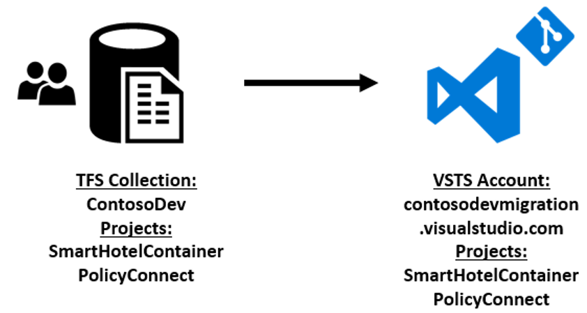 

## Migration process

Contoso will complete the migration process as follows:

1. There's a lot of  preparation involved. As a first step, Contoso needs to upgrade their TFS implementation to a supported level. Contoso is currently running TFS 2017 Update 3, but to use database migration it needs to run a supported 2018 version with the latest updates.
2. After upgrading, Contoso will run the TFS migration tool, and validate their collection.
3. Contoso will build a set of preparation files, and perform a migration dry run for testing.
4. Contoso will then run another migration, this time a full migration that includes work items, bugs, sprints, and code.
5. After the migration, Contoso will move their code from TFVC to Git.

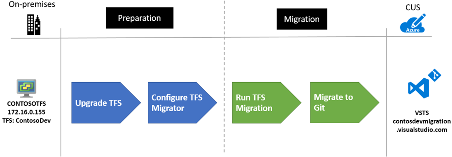 

## Scenario steps

Here's how Contoso will complete the migration:

> [!div class="checklist"]
> * **Step 1: Create an Azure storage account**: This storage account will be used during the migration process.
> * **Step 2: Upgrade TFS**: Contoso will upgrade their deployment to TFS 2018 Upgrade 2. 
> * **Step 3: Validate collection**: Contoso will validate the TFS collection in preparation for migration.
> * **Step 4: Build preparation file**: Contoso will create the migration files using the TFS Migration Tool. 

## Step 1: Create a storage account

1. In the Azure portal, Contoso admins create a storage account (**contosodevmigration**).
2. They place the account in their secondary region they use for failover - Central US. They use a general-purpose standard account with locally-redudant storage.

    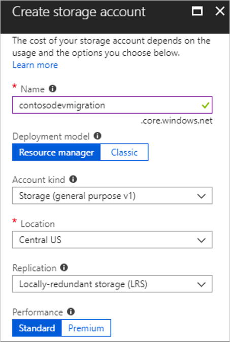 

**Need more help?**

- [Introduction to Azure storage](https://docs.microsoft.com/azure/storage/common/storage-introduction).
- [Create a storage account](https://docs.microsoft.com/azure/storage/common/storage-create-storage-account).

## Step 2: Upgrade TFS

Contoso admins upgrade the TFS server to TFS 2018 Update 2. Before they start:

- They download [TFS 2018 Update 2](https://visualstudio.microsoft.com/downloads/)
- They verify the [hardware requirements](https://docs.microsoft.com/tfs/server/requirements), and read through the [release notes](https://docs.microsoft.com/visualstudio/releasenotes/tfs2018-relnotes) and [upgrade gotchas](https://docs.microsoft.com/tfs/server/upgrade/get-started#before-you-upgrade-to-tfs-2018).

They upgrade as follows:

1. To start, they back up their TFS server (running on a VMware vM) and take a VMware snapshot.

    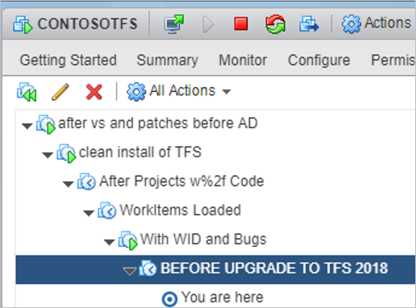 

2. The TFS installer starts, and they choose the install location. The installer needs internet access.

    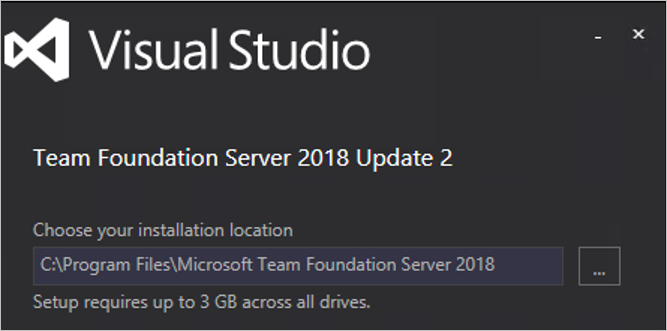 

3. After the installation finishes, the Server Configuration Wizard starts.

    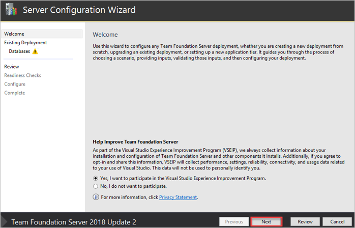 

4. After verification, the Wizard completes the upgrade.

     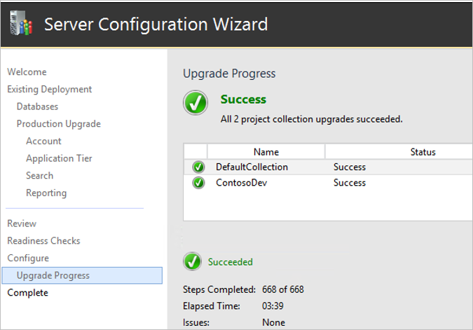 

5. They verify the TFS installation by reviewing projects, work items, and code.

     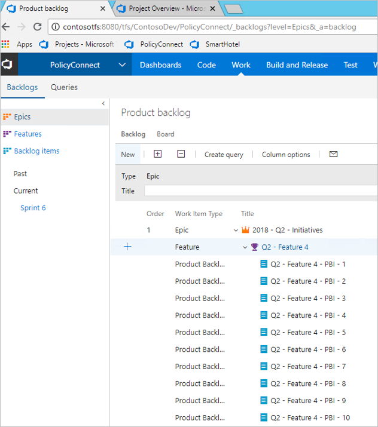 

> [!NOTE]
> Some TFS upgrades need to run the Configure Features Wizard after the upgrade completes. [Learn more](https://docs.microsoft.com/azure/devops/reference/configure-features-after-upgrade?utm_source=ms&utm_medium=guide&utm_campaign=vstsdataimportguide&view=vsts).

**Need more help?**

Learn about [upgrading TFS](https://docs.microsoft.com/tfs/server/upgrade/get-started).

## Step 3: Validate the TFS collection

Contoso admins run the TFS Migration Tool against the ContosoDev collection database to validate it before migration.

1. They download and unzip the [TFS Migration Tool](https://www.microsoft.com/download/details.aspx?id=54274). It's important to download the version for the TFS update that's running. The version can be checked in the admin console.

    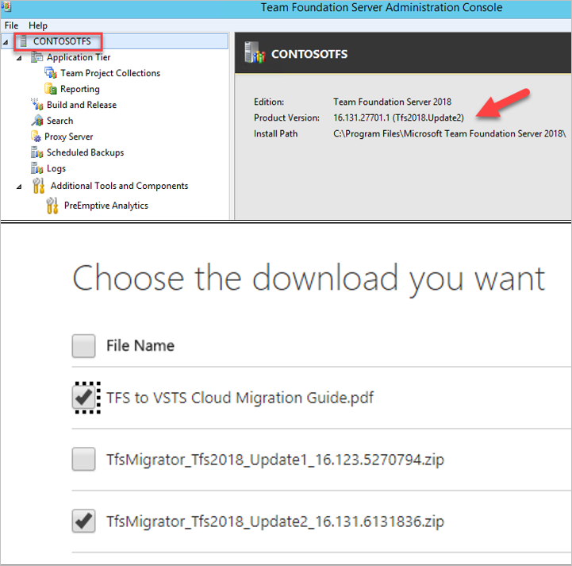

2. They run the tool to perform the validation, by specifying the URL of the project collection:

        **TfsMigrator validate /collection:http://contosotfs:8080/tfs/ContosoDev**

3. The tool shows an error.

    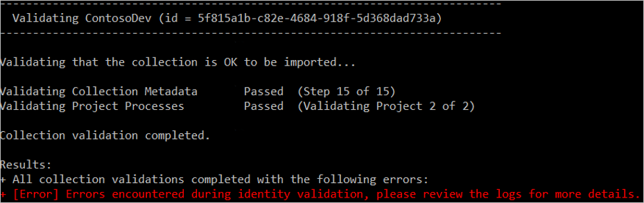

5. They located the log files are located in the **Logs** folder, just before the tool location. A log file is generated for each major validation. **TfsMigration.log** holds the main information.

    

4. They find this entry, related to identity.

    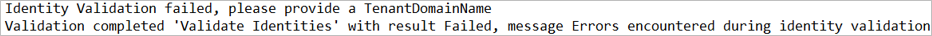

5. They run **TfsMigration validate /help** at the command line, and see that the command **/tenantDomainName** seems to be required to validate identities.

     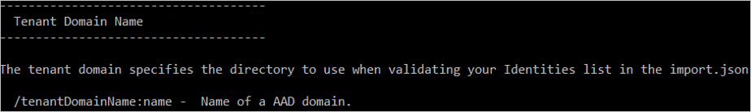

6. They run the validation command again, and include this value, along with their Azure AD name: **TfsMigrator validate /collection:http://contosotfs:8080/tfs/ContosoDev /tenantDomainName:contosomigration.onmicrosoft.com**.

    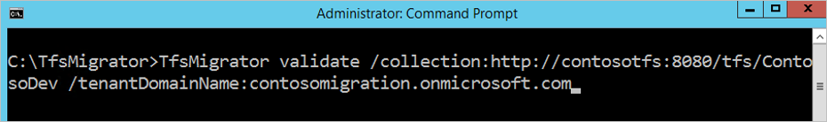

7. An Azure AD Sign In screen appears, and they enter the credentials of a Global Admin user.

     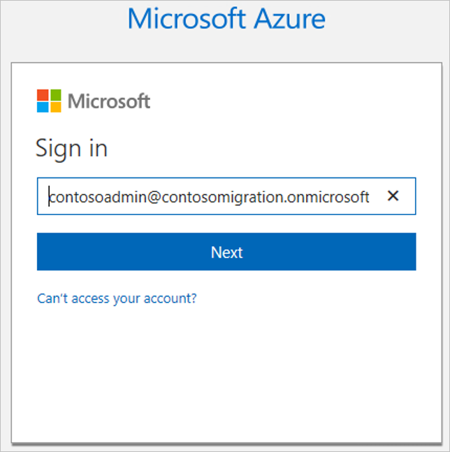

8. The validation passes, and is confirmed by the tool.

    

## Step 4: Create the migration files

With the validation complete, Contoso admins can use the TFS Migration Tool to build the migration files.

1. They run the prepare step in the tool.

    **TfsMigrator prepare /collection:http://contosotfs:8080/tfs/ContosoDev /tenantDomainName:contosomigration.onmicrosoft.com /accountRegion:cus**

     

    Prepare does the following:
    - Scans the collection to find a list of all users and populates the identify map log (**IdentityMapLog.csv**])
    - Prepares the connection to Azure Active Directory to find a match for each identity.
    - Contoso has already deployed Azure AD and synchronized it using AD Connect, so Prepare should be able to find the matching identities and mark them as Active.

2. An Azure AD Sign In screen appears, and they enter the credentials of a Global Admin.

    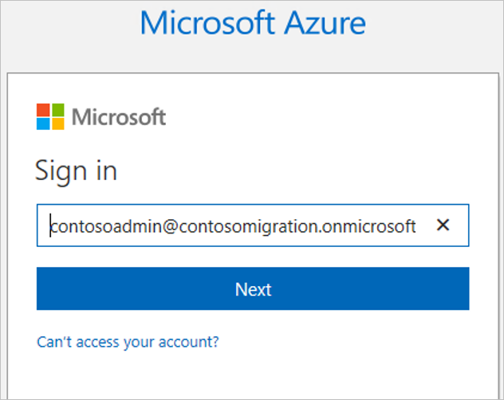

3. Prepare completes, and the tool reports that the import files have been generated successfully.

    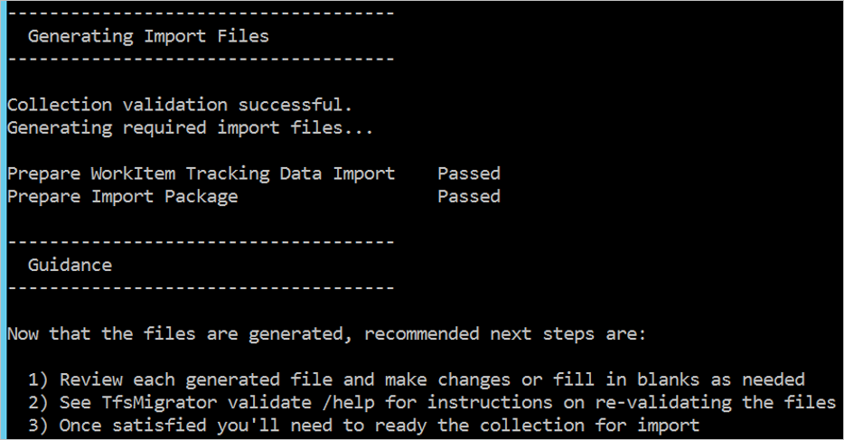

4. They can now see that both the IdentityMapLog.csv and the import.json file have been created in a new folder.

    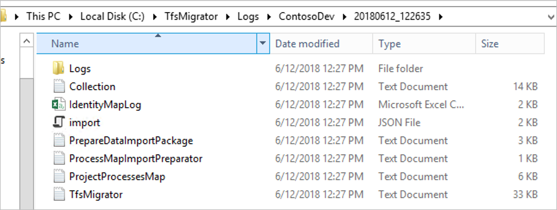

5. The import.json file provides import settings. It includes information such as the desired organization name, and storage account information. Most of the fields are populated automatically. Some fields required user input. Contoso opens the file, and adds the Azure DevOps Services organization name to be created: **contosodevmigration**. With this name, their Azure DevOps Services URL will be **contosodevmigration.visualstudio.com**.

    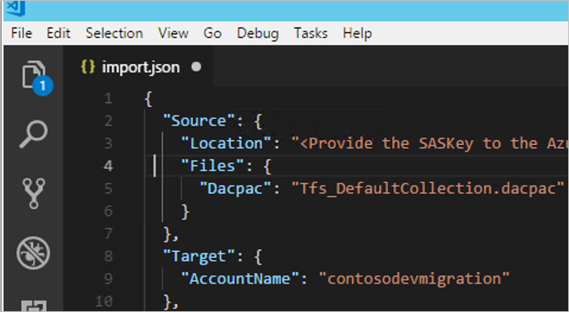

    > [!NOTE]
    > The organization must be created before the migration, It can be changed after migration is done.

6. They review the identity log map file that shows the accounts that will be brought into Azure DevOps Services during the import. 

    - Active identities refer to identities that will become users in Azure DevOps Services after the import.
    - On Azure DevOps Services, these identities will be licensed, and show up as a user in the organization after migration.
    - These identities are marked as **Active** in the **Expected Import Status** column in the file.

    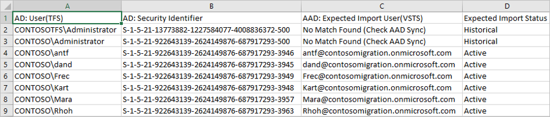

## Step 5: Migrate to Azure DevOps Services

With preparation in place, Contoso admins can now focus on the migration. After running the migration, they'll switch from using TFVC to Git for version control.

Before they start, the admins schedule downtime with the dev team, to take the collection offline for migration. These are the steps for the migration process:

1. **Detach the collection**: Identity data for the collection resides in the TFS server configuration database while the collection is attached and online. When a collection is detached from the TFS server, it takes a copy of that identity data, and packages it with the collection for transport. Without this data, the identity portion of the import cannot be executed. It's recommended that the collection stay detached until the import has been completed, as there's no way to import the changes which occurred during the import.
2. **Generate a backup**: The next step of the migration process is to generate a backup that can be imported into Azure DevOps Services. Data-tier Application Component Packages (DACPAC), is a SQL Server feature that allows database changes to be packaged into a single file, and deployed to other instances of SQL. It can also be restored directly to Azure DevOps Services, and is therefore used as the packaging method for getting collection data into the cloud. Contoso will use the SqlPackage.exe tool to generate the DACPAC. This tool is included in SQL Server Data Tools.
3. **Upload to storage**: AFter the DACPAC is created, they upload it to Azure Storage. After it's uploaded, they get a shared access signature (SAS), to allow the TFS Migration Tool access to the storage.
4. **Fill out the import**: Contoso can then fill out missing fields in the import file, including the DACPAC setting. To start with they'll specify that they want to do a **DryRun** import, to check that everything's working properly before the full migration.
5. **Do a dry run**: Dry run imports help test collection migration. Dry runs have limited life, and are deleted before a production migration runs. They're deleted automatically after a set period of time. A note about when the dry run will be deleted is included in the success email received after the import finishes. Take note and plan accordingly.
6. **Complete the production migration**: With the Dry Run migration completed, Contoso admins do the final migration by updating the import.json, and running import again.

### Detach the collection

Before starting, Contoso admins take a local SQL Server backup, and VMware snapshot of the TFS server, before detaching.

1.  In the TFS Admin console, they select the collection they want to detach  (**ContosoDev**).

    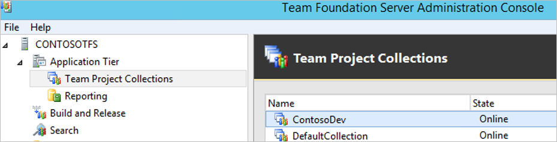

2. In **General**, they select **Detach Collection**

    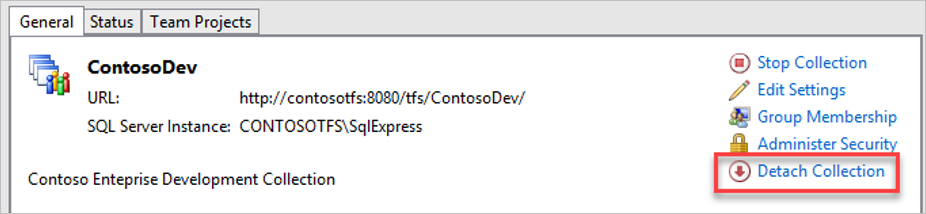

3. In the Detach Team Project Collection Wizard > **Servicing Message**, they provide a message for users who might try to connect to projects in the collection.

    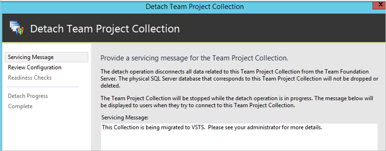

4. In **Detach Progress**, they monitor progress and click **Next** when the process finishes.

    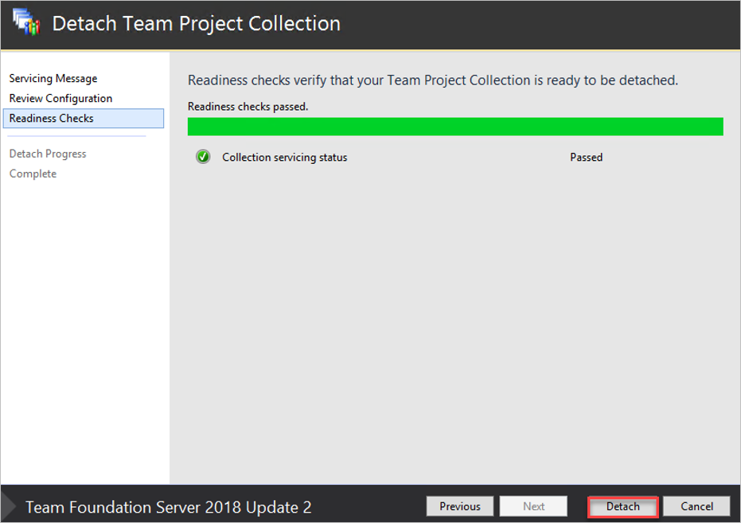

5. In **Readiness Checks**, when checks finish they click **Detach**.

    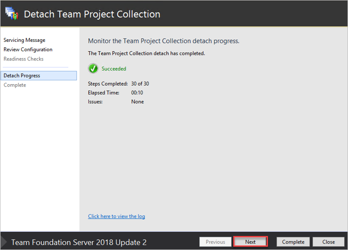

6. They click **Close** to finish up.

    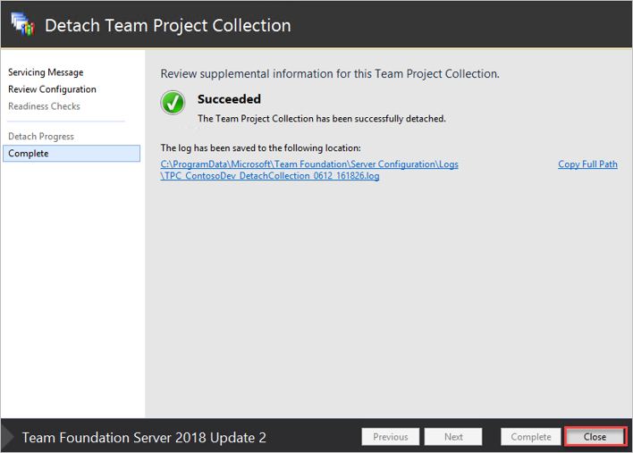

6. The collection is no longer referenced in the TFS Admin console.

    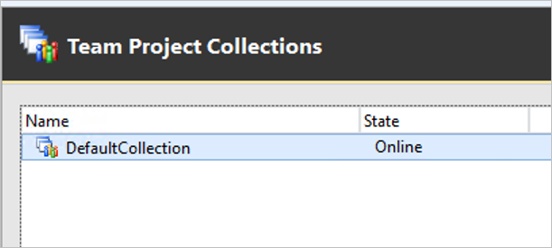

### Generate a DACPAC

Contoso creates a backup (DACPAC) for import into Azure DevOps Services.

- SqlPackage.exe in SQL Server Data Tools is used to create the DACPAC. There are multiple versions of SqlPackage.exe installed with SQL Server Data Tools, located under folders with names such as 120, 130, and 140. It's important to use the right version to prepare the DACPAC.
- TFS 2018 imports need to use SqlPackage.exe from the 140 folder or higher.  For CONTOSOTFS, this file is located in folder:
**C:\Program Files (x86)\Microsoft Visual Studio\2017\Enterprise\Common7\IDE\Extensions\Microsoft\SQLDB\DAC\140**.

Contoso admins generate the DACPAC as follows:

1. They open a command prompt and navigate to the SQLPackage.exe location. They type this following command to generate the DACPAC:

    **SqlPackage.exe /sourceconnectionstring:"Data Source=SQLSERVERNAME\INSTANCENAME;Initial Catalog=Tfs_ContosoDev;Integrated Security=True" /targetFile:C:\TFSMigrator\Tfs_ContosoDev.dacpac /action:extract /p:ExtractAllTableData=true /p:IgnoreUserLoginMappings=true /p:IgnorePermissions=true /p:Storage=Memory** 

    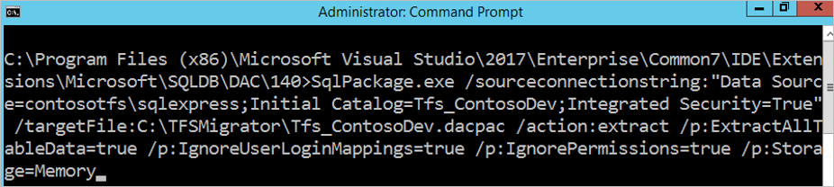

2. The following message appears after the command runs.

    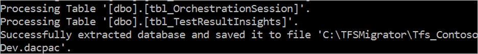

3. They verify the properties of the DACPACfile

    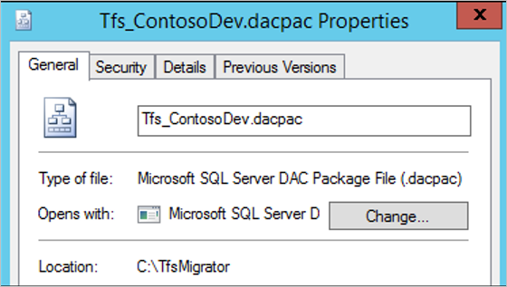

### Update the file to storage

After the DACPAC is created, Contoso uploads it to Azure Storage.

1. They [download and install](https://azure.microsoft.com/features/storage-explorer/) Azure Storage Explorer.

    

4. They connect to their subscription and locate the storage account they created for the migration (**contosodevmigration**). They create a new blob container, **azuredevopsmigration**.

    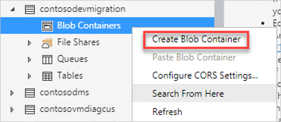

5. They specify the DACPAC file for upload as a block blob.

    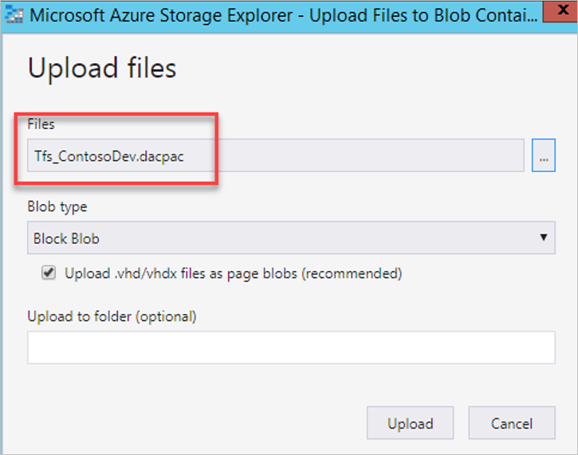
    
7. After the file's uploaded, they click the file name > **Generate SAS**. They expand the blob containers under the storage account, select the container with the import files, and click **Get Shared Access Signature**.

    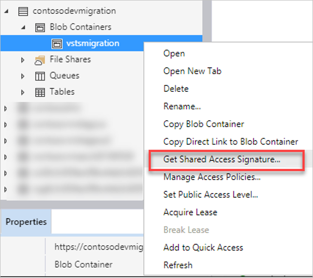

8. They accept the defaults and click **Create**. This enables access for 24 hours.

    

9. They copy the Shared Access Signature URL, so that it can be used by the TFS Migration Tool.

    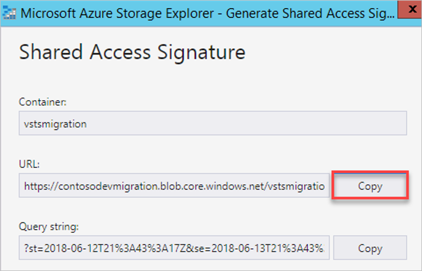

> [!NOTE]
> The migration must happen before within the allowed time window or permissions will expire.
> Don't generate an SAS key from the Azure portal. Keys generated like this are account-scoped, and won't work with the import.

### Fill in the import settings

Earlier, Contoso admins partially filled out the import specification file (import.json). Now, they need to add the remaining settings.

They open the import.json file, and fill out the following fields:
•	Location: Location of the SAS key that was generated above.
•	Dacpac: Set the name to the DACPAC file you uploaded to the storage account. Include the ".dacpac" extension.
•	ImportType: Set to DryRun for now.

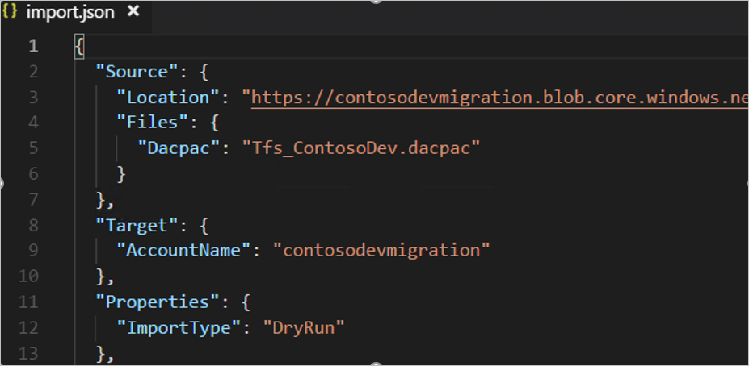

### Do a dry run migration

Contoso admins start with a dry run migration, to make sure everything's working as expected.

1. They open a command prompt, and locate to the TfsMigration location (C:\TFSMigrator).
2. As a first step they validate the import file. They want to be sure the file is formatted properly, and that the SAS key is working.

    **TfsMigrator import /importFile:C:\TFSMigrator\import.json /validateonly**

3. The validation returns an error that the SAS key needs a longer expiry time.

    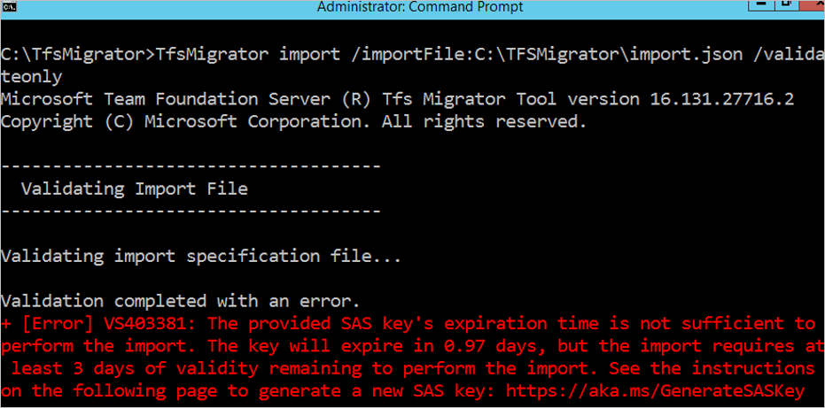

3. They use Azure Storage Explorer to create a new SAS key with expiry set to seven days.

    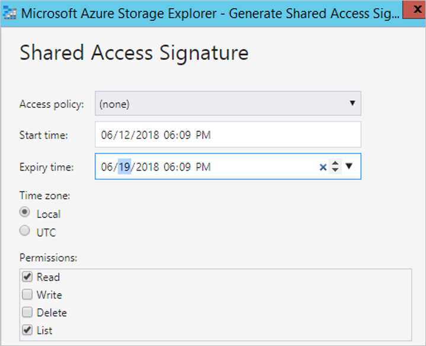

3. They update the import.json file and run the validation again. This time it completes successfully.

    **TfsMigrator import /importFile:C:\TFSMigrator\import.json /validateonly**

    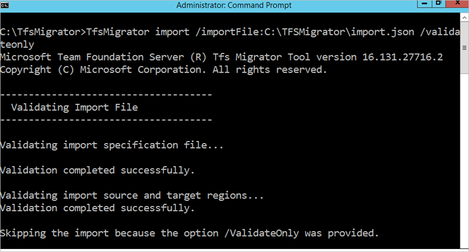
    
7. They start the dry run:

    **TfsMigrator import /importFile:C:\TFSMigrator\import.json**

8. A message is issued to confirm the migration. Note the length of time for which the staged data will be maintained after the dry run.

    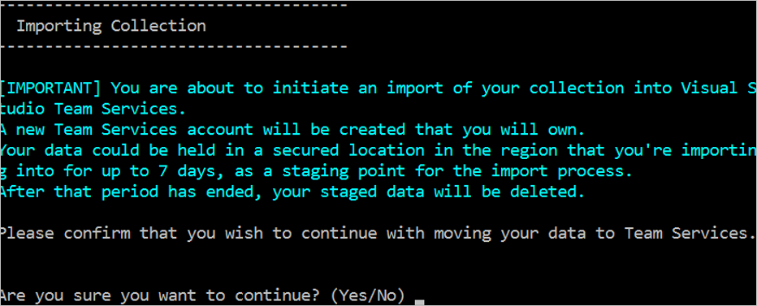

9. Azure AD Sign In appears, and should be completing with Contoso Admin sign-in.

    

10. A message shows information about the import.

    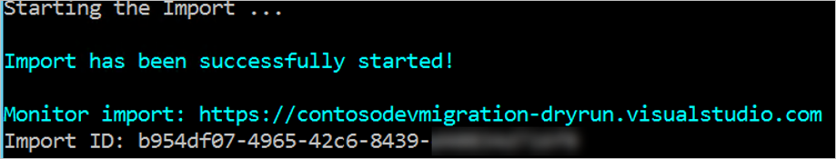

11. After 15 minutes or so, they browse to the URL, and see the following information:

     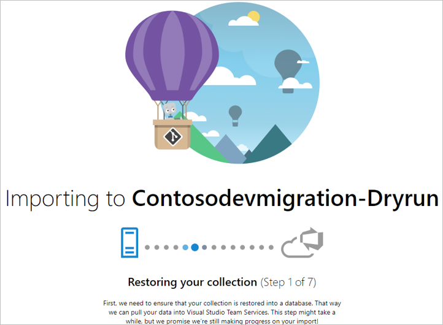

12. After the migration finishes a Contoso Dev Leads signs into Azure DevOps Services to check that the dry run worked properly. After authentication, Azure DevOps Services needs a few details to confirm the organization.

    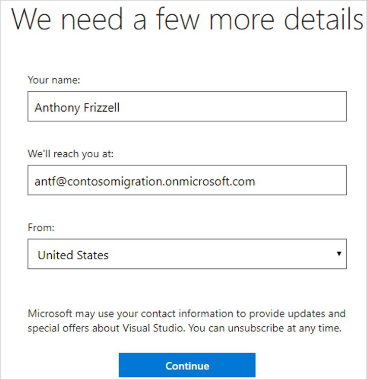

13. In Azure DevOps Services, the Dev Lead can see that the projects have been migrated to Azure DevOps Services. There's a notice that the organization will be deleted in 15 days.

    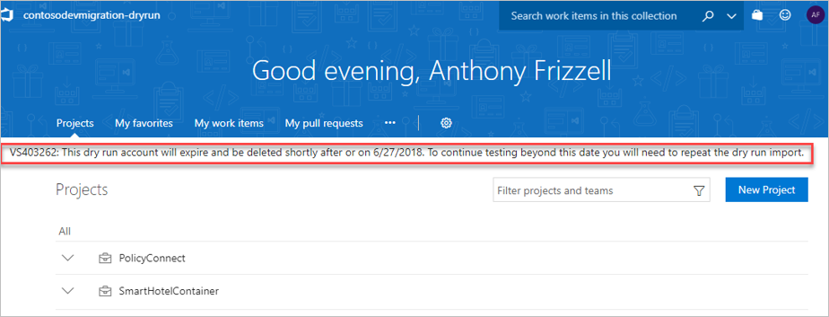

14. The Dev Lead opens one of the projects and opens **Work Items** > **Assigned to me**. This shows that work item data has been migrated, along with identity.

    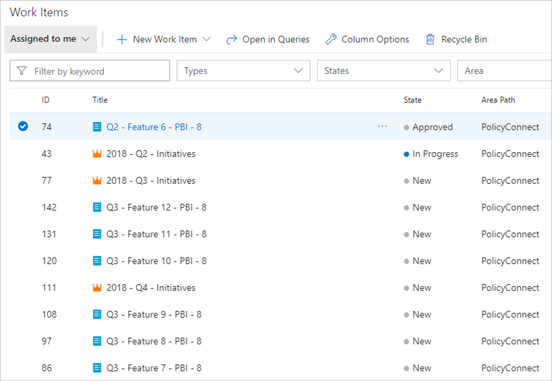

15. The lead also checks other projects and code, to confirm that the source code and history has been migrated.

    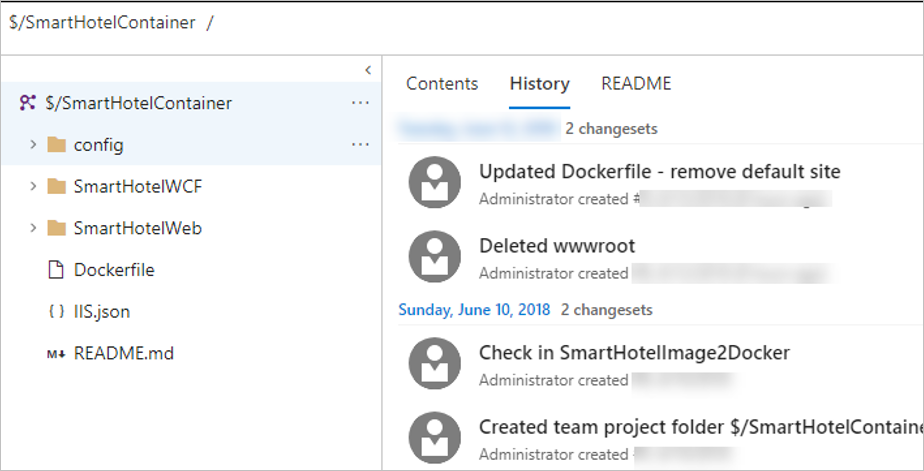

### Run the production migration

With the dry run complete, Contoso admins move on to the production migration. They delete the dry run, update the import settings, and run import again.

1. In the Azure DevOps Services portal, they delete the dry run organization.
2. They update the import.json file to set the **ImportType** to **ProductionRun**.

    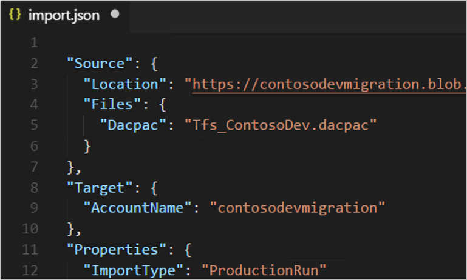

3. They start the migration as they did for the dry run: **TfsMigrator import /importFile:C:\TFSMigrator\import.json**.
4. A message shows to confirm the migration, and warns that data could be held in a secure location as a staging area for up to seven days.

    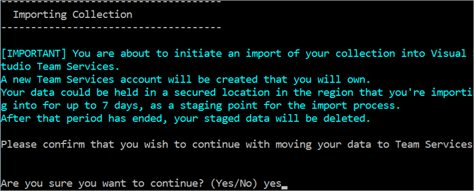

5. In Azure AD Sign In, they specify a Contoso Admin sign-in.

    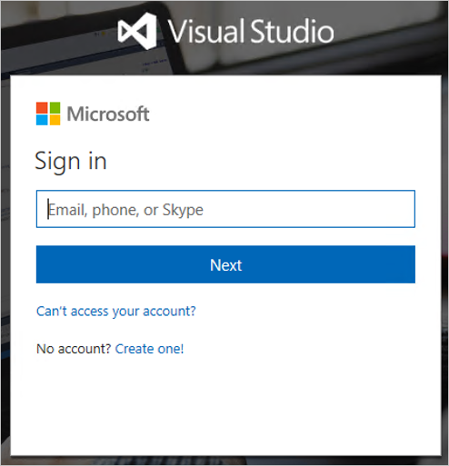

6. A message shows information about the import.

    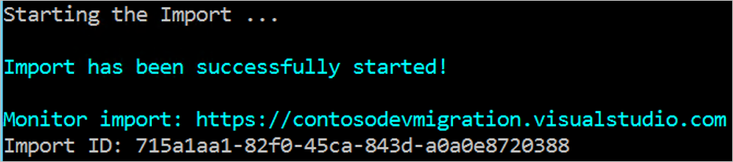

7. After around 15 minutes, they browse to the URL, and sees the following information:

    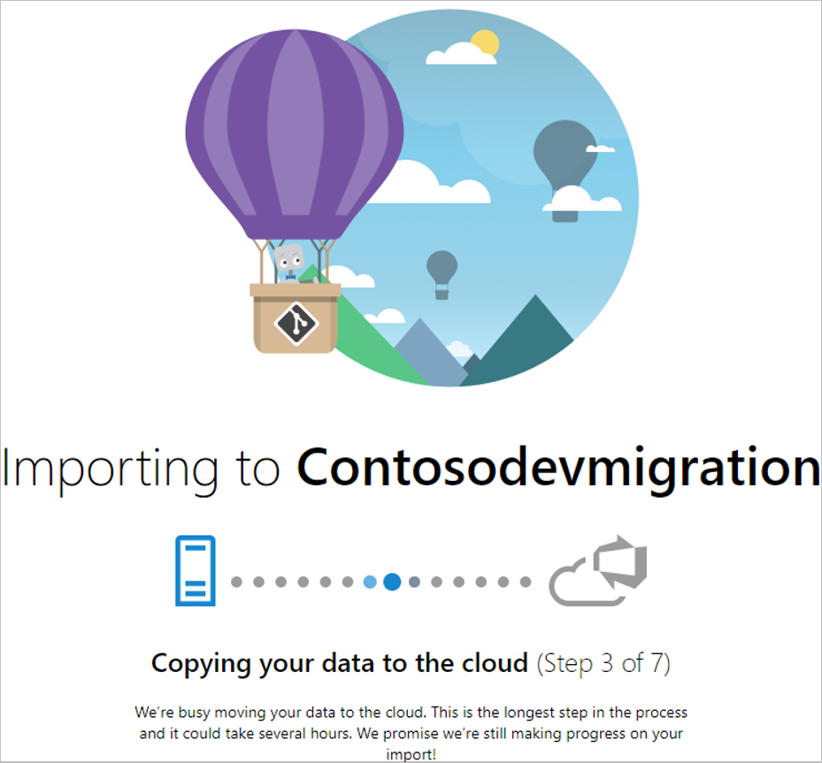

8. After the migration finishes, a Contoso Dev Lead logs onto Azure DevOps Services to check that the migration worked properly. After login, he can see that projects have been migrated.

    

8. The Dev Lead opens one of the projects and opens **Work Items** > **Assigned to me**. This shows that work item data has been migrated, along with identity.

    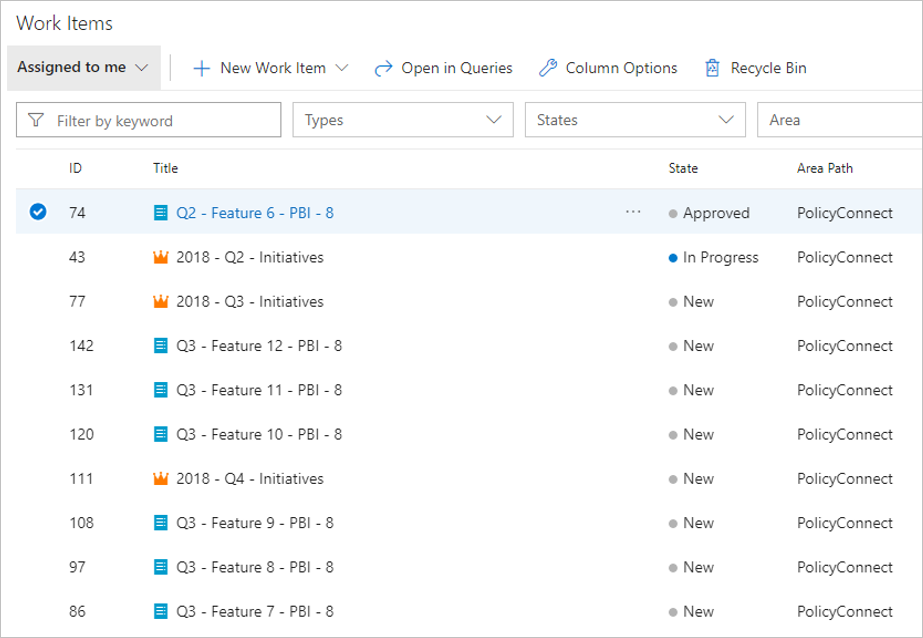

9. The lead checks other work item data to confirm.

    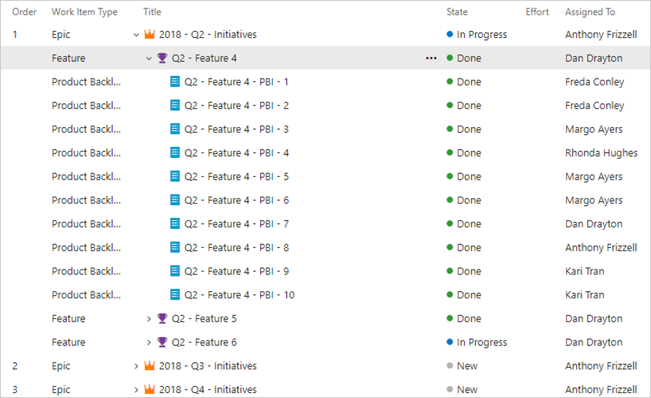

15. The lead also checks other projects and code, to confirm that the source code and history has been migrated.

    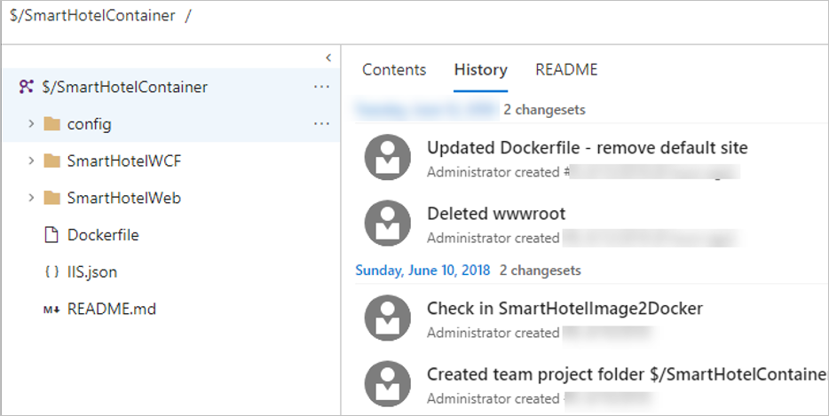

### Move source control from TFVC to GIT

With migration complete, Contoso wants to move from TFVC to Git for source code management. They need to import the source code currently in their Azure DevOps Services organization as Git repos in the same organization.

1. In the Azure DevOps Services portal, they open one of the TFVC repos (**$/PolicyConnect**) and review it.

    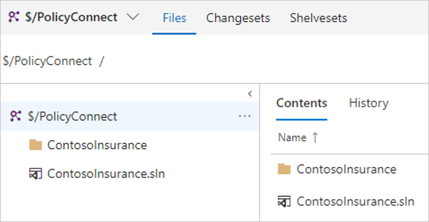

2. They click the **Source** dropdown > **Import**.

    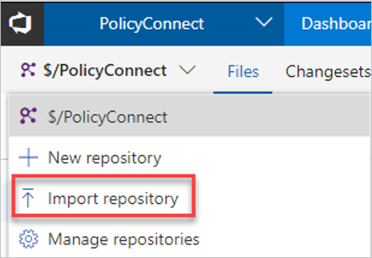

3. In **Source type** they select **TFVC**, and specify the path to the repo. They've decided not to migrate the history.

    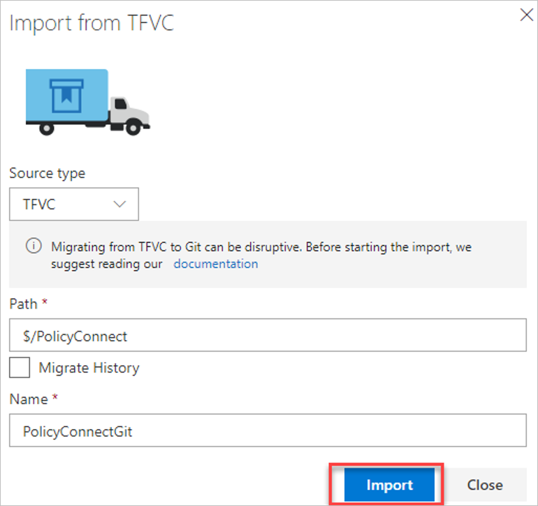

    > [!NOTE]
    > Due to differences in how TFVC and Git store version control information, we recommend that Contoso don't migrate history. This is the approach that Microsoft took when it migrated Windows and other products from centralized version control to Git.

4. After the import, admins review the code.

    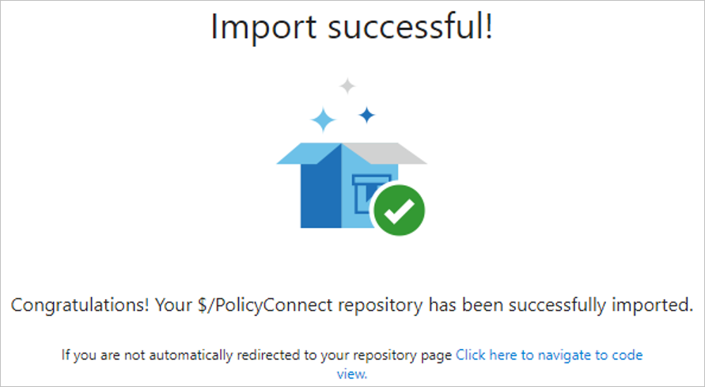

5. They repeat the process for the second repository (**$/SmartHotelContainer**).

    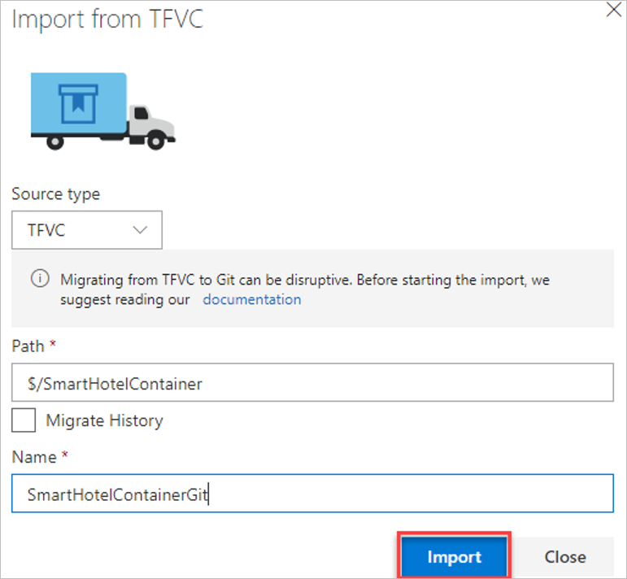

6. After reviewing the source, the Dev Leads agree that the migration to Azure DevOps Services is done. Azure DevOps Services now becomes the source for all development within teams involved in the migration.

    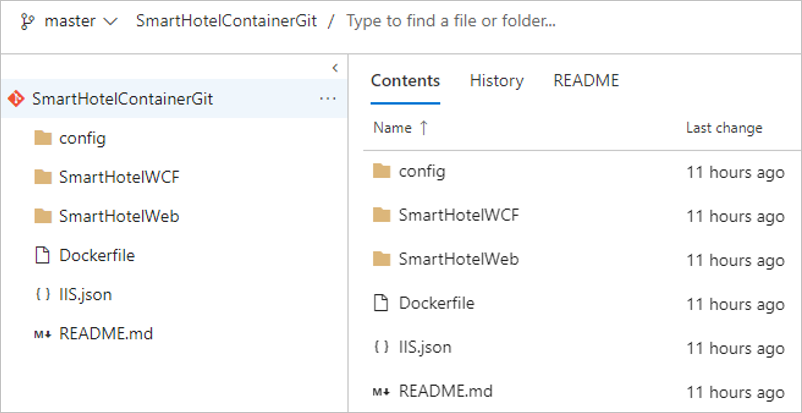

**Need more help?**

[Learn more](https://docs.microsoft.com/azure/devops/repos/git/import-from-TFVC?view=vsts) about importing from TFVC.

##  Clean up after migration

With migration complete, Contoso needs to do the following:

- Review the [post-import](https://docs.microsoft.com/azure/devops/articles/migration-post-import?view=vsts) article for information about additional import activities.
- Either delete the TFVC repos, or place them in read-only mode. The code bases mustn't used, but can be referenced for their history.

## Next steps

Contoso will need to provide Azure DevOps Services and Git training for relevant team members.

