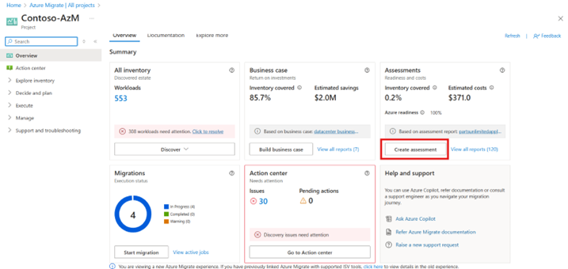

# Create an application assessment

This article shows you how to create an application assessment to migrate or modernize your application workloads using Azure Migrate. Creating an application assessment for your application provides you the multiple migration strategies that you can use to migrate your workloads identify the recommended as well as alternative targets and key insights such as **readiness**, **target right-sizing**, and **cost** to host and run these workloads on Azure month over month.  

You can also create a cross-workload assessment using the following steps. A cross-workload assessment can constitute multiple workloads that do not necessarily combine to form just one application, it can be a group of multiple applications or it can be just a group of heterogenous workloads in your datacenter.  

In this article, you’ll learn how to:  

- Set up your Azure Migrate environment to assess applications.

- Choose a set of related workloads from the inventory.  

- Customize general and advanced assessment configurations to provide your preferences while creating an assessment for each constituent workload.  

## Prerequisites 

- You discovered the inventory of all the workloads and applications you intend to assess. 

- You resolved any data collection issues that your workloads are flagged for. 

Learn about the assessment prerequisites and how to implement them.

## Create an application assessment 

1. There are multiple ways you can start with the creation of an application/cross-workload assessment: 
    a. If you're on the **Overview** page, you can start by selecting the **Create assessment** button on the **Assessments** card.

    
    
    b. If you're exploring the inventory of workloads from the **All inventory** blade, you can start by selecting the desired workloads and selecting **Create assessment**.

    c.	On the Azure Migrate project overview page, under **Decide and Plan** > **Assessments** > **Create assessment**.

2. Provide a suitable name for the assessment and select **Add workloads** to add workloads to the assessment scope.

3. Select the appropriate workloads from the inventory of workloads shown to you. Use this view to identify the relationships among different workloads. All the workloads discovered within a server are listed under it. Select the chevron to access the list and information of workloads under any server. 

4. Use appropriate filters to identify your workloads and add them to the assessment scope. If you have already tagged all the servers and workloads that constitute an application, you can use that tag to filter the list and select the workloads.

5. You can use any custom tag or column to filter the list, but the filter will be used to create the assessment scope and thus if you want to select any more workloads (to which the filter does not apply) you can come back and add more workloads. 

6. Review all the workloads and their relationships by selecting **Review selected workloads**.

7. After reviewing selected workloads, select **Next**.

8. On the **General** tab, modify assessment properties that are applicable across all Azure targets. [Learn more](assessment-properties.md) about general settings.

9. Select **Next** to move to **Advanced** tab, customize workload specific properties for different type of workloads added to the scope. Select **Edit defaults** to corresponding to the workload type to update advanced assessment properties of the selected workloads. [Learn more](assessment-properties.md) about customizing assessments.

10.	Review and create the assessment.
