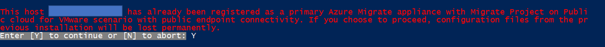

# Set up an appliance with a script

Follow this article to deploy an [Azure Migrate appliance](./migrate-appliance-architecture.md) using a PowerShell script for:
- discovery, assessment and agentless replication of servers running in VMware environment
- discovery and assessment of servers running in Hyper-V environment.

You can deploy the appliance for servers on VMware and on Hyper-V by either using a script, or using a template (OVA/VHD) that you download from the Azure portal. Using a script is useful if you're unable to create an appliance using the downloaded template.

- To use a template, follow the tutorials for [VMware](./tutorial-discover-vmware.md) and [Hyper-V](./tutorial-discover-hyper-v.md).
- To set up an appliance for physical servers, you can only use a script. Follow [this article](how-to-set-up-appliance-physical.md).
- To set up an appliance in an Azure Government cloud, you can only use a script. Follow [this article](deploy-appliance-script-government.md).

## Prerequisites

You can use the script to deploy the Azure Migrate appliance on an existing server in your VMware or Hyper-V environment.

- The server that hosts the appliance must meet the following hardware and OS requirements:

Scenario | Requirements
--- | ---
VMware | Windows Server 2022, with 32 GB of memory, eight vCPUs, around 80 GB of disk storage.
Hyper-V | Windows Server 2022, with 16 GB of memory, eight vCPUs, around 80 GB of disk storage.

- The server also needs an external virtual switch. It requires a static or dynamic IP address. 
- Before you deploy the appliance, review detailed appliance requirements for [VMware](migrate-appliance.md#appliance---vmware) and [Hyper-V](migrate-appliance.md#appliance---hyper-v).
- If you run the script on a server with Azure Migrate appliance already set up, you can choose to clean up the existing configuration and set up a fresh appliance of the desired configuration. When you execute the script, you will get a notification as shown below:

    

## Set up the appliance for VMware

1. To set up the appliance, you download the zipped file named AzureMigrateInstaller.zip either from the portal or from [here](https://go.microsoft.com/fwlink/?linkid=2191847).
1. Extract the contents on the server where you want to deploy the appliance.
1. Execute the PowerShell script to launch the appliance configuration manager.
1. Set up the appliance and configure it for the first time.

### Verify security

Check that the zipped file is secure, before you deploy it.

1. On the server to which you downloaded the file, open an administrator command window.
2. Run the following command to generate the hash for the zipped file:
    - ```C:\>CertUtil -HashFile <file_location> [Hashing Algorithm]```
    - Example usage: ```C:\>CertUtil -HashFile C:\Users\administrator\Desktop\AzureMigrateInstaller.zip SHA256 ```
3.  Verify the latest appliance version and hash value:

    **Download** | **Hash value**
    --- | ---
    [Latest version](https://go.microsoft.com/fwlink/?linkid=2191847) | 7EF01AE30F7BB8F4486EDC1688481DB656FB8ECA7B9EF6363B4DAB1CFCFDA141 

> [!NOTE]
> The same script can be used to set up VMware appliance for either Azure public or Azure Government cloud.

### Run the script

1. Extract the zipped file to a folder on the server that will host the appliance.
> [!NOTE]
> Make sure you don't run the script on a server with an existing Azure Migrate appliance. Running the script on the Azure Migrate appliance will remove the working configuration and replace it with newly defined configuration.

2. Launch PowerShell on the above server with administrative (elevated) privilege.

3. Change the PowerShell directory to the folder where the contents have been extracted from the downloaded zipped file.

4. Run the script named **AzureMigrateInstaller.ps1** by running the following command:

   `PS C:\Users\administrator\Desktop\AzureMigrateInstaller> .\AzureMigrateInstaller.ps1`

5. Select from the scenario, cloud and connectivity options to deploy an appliance with the desired configuration. For instance, the selection shown below sets up an appliance to discover, assess and migrate **servers running in your VMware environment** to an Azure Migrate project with **default _(public endpoint)_ connectivity** on **Azure public cloud**.

   :::image type="content" source="./media/deploy-appliance-script/script-vmware-default-inline.png" alt-text="Screenshot that shows how to set up VMware appliance with desired configuration." lightbox="./media/deploy-appliance-script/script-vmware-default-expanded.png":::

6. The installer script does the following:

 - Installs agents and a web application.
 - Install Windows roles, including Windows Activation Service, IIS, and PowerShell ISE.
 - Download and installs an IIS rewritable module.
 - Updates a registry key (HKLM) with persistent setting details for Azure Migrate.
 - Creates the following files under the path:
    - **Config Files**: `%ProgramData%\Microsoft Azure\Config`
    - **Log Files**: `%ProgramData%\Microsoft Azure\Logs`

After the script has executed successfully, the appliance configuration manager will be launched automatically.

> [!NOTE]
> If you come across any issues, you can access the script logs at C:\ProgramData\Microsoft Azure\Logs\AzureMigrateScenarioInstaller_<em>Timestamp</em>.log for troubleshooting.

### Verify access

Make sure that the appliance can connect to Azure URLs for the [public](migrate-appliance.md#public-cloud-urls) cloud.

## Set up the appliance for Hyper-V

1. To set up the appliance, you download the zipped file named AzureMigrateInstaller.zip either from the portal or from [here](https://go.microsoft.com/fwlink/?linkid=2191847).
1. Extract the contents on the server where you want to deploy the appliance.
1. Execute the PowerShell script to launch the appliance configuration manager.
1. Set up the appliance and configure it for the first time.

### Verify security

Check that the zipped file is secure, before you deploy it.

1. On the server to which you downloaded the file, open an administrator command window.
2. Run the following command to generate the hash for the zipped file:
    - ```C:\>CertUtil -HashFile <file_location> [Hashing Algorithm]```
    - Example usage: ```C:\>CertUtil -HashFile C:\Users\administrator\Desktop\AzureMigrateInstaller.zip SHA256 ```
3.  Verify the latest appliance version and hash value:

    **Download** | **Hash value**
    --- | ---
    [Latest version](https://go.microsoft.com/fwlink/?linkid=2191847) | 7EF01AE30F7BB8F4486EDC1688481DB656FB8ECA7B9EF6363B4DAB1CFCFDA141

> [!NOTE]
> The same script can be used to set up Hyper-V appliance for either Azure public or Azure Government cloud.

### Run the script

1. Extract the zipped file to a folder on the server that will host the appliance.
> [!NOTE]
> Make sure you don't run the script on an existing Azure Migrate appliance. Running the script on the Azure Migrate appliance will remove the working configuration and replace it with newly defined configuration.

2. Launch PowerShell on the above server with administrative (elevated) privilege.
3. Change the PowerShell directory to the folder where the contents have been extracted from the downloaded zipped file.
4. Run the script named `AzureMigrateInstaller.ps1` by running the following command:

   `PS C:\Users\administrator\Desktop\AzureMigrateInstaller> .\AzureMigrateInstaller.ps1 `

5. Select from the scenario, cloud and connectivity options to deploy an appliance with the desired configuration. For instance, the selection shown below sets up an appliance to discover and assess **servers running in your Hyper-V environment** to an Azure Migrate project with **default _(public endpoint)_ connectivity** on **Azure public cloud**.

    :::image type="content" source="./media/deploy-appliance-script/script-hyperv-default-inline.png" alt-text="Screenshot that shows how to set up Hyper-V appliance with desired configuration." lightbox="./media/deploy-appliance-script/script-hyperv-default-expanded.png":::

6. The installer script does the following:

    - Installs agents and a web application.
    - Install Windows roles, including Windows Activation Service, IIS, and PowerShell ISE.
    - Download and installs an IIS rewritable module.
    - Updates a registry key (HKLM) with persistent setting details for Azure Migrate.
    - Creates the following files under the path:
        - **Config Files**: %Programdata%\Microsoft Azure\Config
        - **Log Files**: %Programdata%\Microsoft Azure\Logs

After the script has executed successfully, the appliance configuration manager will be launched automatically.

> [!NOTE]
> If you come across any issues, you can access the script logs at C:\ProgramData\Microsoft Azure\Logs\AzureMigrateScenarioInstaller_<em>Timestamp</em>.log for troubleshooting.

### Verify access

Make sure that the appliance can connect to Azure URLs for the [public](migrate-appliance.md#public-cloud-urls) cloud.

## Next steps

After deploying the appliance, you need to configure it for the first time, and register it with project.

- Set up the appliance for [VMware](how-to-set-up-appliance-vmware.md#4-configure-the-appliance).
- Set up the appliance for [Hyper-V](how-to-set-up-appliance-hyper-v.md#configure-the-appliance).
