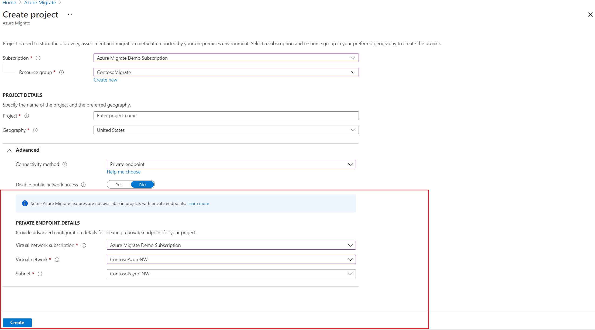

 
# Discover and assess servers for migration using Private Link 

This article describes how to create an Azure Migrate project, set up the Azure Migrate appliance, and use it to discover and assess servers for migration using [Azure Private Link](../private-link/private-endpoint-overview.md).  You can use the [Azure Migrate: Discovery and assessment](migrate-services-overview.md#azure-migrate-discovery-and-assessment-tool) tool to connect privately and securely to Azure Migrate over an Azure ExpressRoute private peering or a site-to-site (S2S) VPN connection by using Private Link.

## Create a project with private endpoint connectivity

To set up a new Azure Migrate project, see [Create and manage projects](./create-manage-projects.md#create-a-project-for-the-first-time).

> [!Note]
> You can't change the connectivity method to private endpoint connectivity for existing Azure Migrate projects.

In the **Advanced** configuration section, provide the following details to create a private endpoint for your Azure Migrate project.
1. In **Connectivity method**, choose **Private endpoint**.
1. In **Disable public endpoint access**, keep the default setting **No**. Some migration tools might not be able to upload usage data to the Azure Migrate project if public network access is disabled. Learn more about [other integrated tools](how-to-use-azure-migrate-with-private-endpoints.md#other-integrated-tools).
1. In **Virtual network subscription**, select the subscription for the private endpoint virtual network.
1. In **Virtual network**, select the virtual network for the private endpoint. The Azure Migrate appliance and other software components that need to connect to the Azure Migrate project must be on this network or a connected virtual network.
1. In **Subnet**, select the subnet for the private endpoint.

   

1. Select **Create** to create a migration project and attach a private endpoint to it. Wait a few minutes for the Azure Migrate project to deploy. Don't close this page while the project creation is in progress.

> [!Note]
> If you've already created a project, you can use that project to register more appliances to discover and assess more servers. Learn how to [manage projects](create-manage-projects.md#find-a-project). 

## Set up the Azure Migrate appliance

1. In **Discover machines** > **Are your machines virtualized?**, select the virtualization server type.
1. In **Generate Azure Migrate project key**, provide a name for the Azure Migrate appliance.
1. Select **Generate key** to create the required Azure resources.

    > [!Important]
    > Don't close the **Discover machines** page during the creation of resources.
    - At this step, Azure Migrate creates a key vault, a storage account, a Recovery Services vault (only for agentless VMware migrations), and a few internal resources. Azure Migrate attaches a private endpoint to each resource. The private endpoints are created in the virtual network selected during the project creation.
    - After the private endpoints are created, the DNS CNAME resource records for the Azure Migrate resources are updated to an alias in a subdomain with the prefix *privatelink*. By default, Azure Migrate also creates a private DNS zone corresponding to the *privatelink* subdomain for each resource type and inserts DNS A records for the associated private endpoints. This action enables the Azure Migrate appliance and other software components that reside in the source network to reach the Azure Migrate resource endpoints on private IP addresses.
    - Azure Migrate also enables a [managed identity](../active-directory/managed-identities-azure-resources/overview.md) for the migrate project and the Recovery Services vault and grants permissions to the managed identity to securely access the storage account.

1. After the key is successfully generated, copy the key details to configure and register the appliance.

### Download the appliance installer file

Azure Migrate: Discovery and assessment use a lightweight Azure Migrate appliance. The appliance performs server discovery and sends server configuration and performance metadata to Azure Migrate.

> [!Note]
> If you have deployed an appliance using a template (OVA for servers on a VMware environment and VHD for a Hyper-V environment), you can use the same appliance and register it with an Azure Migrate project with private endpoint connectivity. You will need to run the Azure Migrate installer script and select the private endpoint connectivity option mentioned in the instructions below. 

To set up the appliance:
  1. Download the zipped file that contains the installer script from the portal.
  1. Copy the zipped file on the server that will host the appliance.
  1. After you download the zipped file, verify the file security.
  1. Run the installer script to deploy the appliance.

### Verify security

Check that the zipped file is secure, before you deploy it.

1. On the server to which you downloaded the file, open an administrator command window.
2. Run the following command to generate the hash for the zipped file:
    - ```C:\>CertUtil -HashFile <file_location> [Hashing Algorithm]```
    - Example usage: ```C:\>CertUtil -HashFile C:\Users\administrator\Desktop\AzureMigrateInstaller.zip SHA256 ```
3.  Verify the latest appliance version and hash value:

    **Download** | **Hash value**
    --- | ---
    [Latest version](https://go.microsoft.com/fwlink/?linkid=2191847) | 7EF01AE30F7BB8F4486EDC1688481DB656FB8ECA7B9EF6363B4DAB1CFCFDA141

> [!NOTE]
> The same script can be used to set up an appliance with private endpoint connectivity for any of the chosen scenarios, such as VMware, Hyper-V, physical or other to deploy an appliance with the desired configuration.

Make sure the server meets the [hardware requirements](./migrate-appliance.md) for the chosen scenario, such as VMware, Hyper-V, physical or other, and can connect to the [required URLs](./migrate-appliance.md#public-cloud-urls-for-private-link-connectivity).

### Run the Azure Migrate installer script

1. Extract the zipped file to a folder on the server that will host the appliance.  Make sure you don't run the script on a server with an existing Azure Migrate appliance.

2. Launch PowerShell on the above server with administrative (elevated) privilege.

3. Change the PowerShell directory to the folder where the contents have been extracted from the downloaded zipped file.

4. Run the script named `AzureMigrateInstaller.ps1` by running the following command:

   `PS C:\Users\administrator\Desktop\AzureMigrateInstaller> .\AzureMigrateInstaller.ps1`

5. Select from the scenario, cloud and connectivity options to deploy an appliance with the desired configuration. For instance, the selection shown below sets up an appliance to discover and assess **servers running in your VMware environment** to an Azure Migrate project with **private endpoint connectivity** on **Azure public cloud**.

   :::image type="content" source="./media/how-to-use-azure-migrate-with-private-endpoints/script-vmware-private-inline.png" alt-text="Screenshot that shows how to set up appliance with desired configuration for private endpoint." lightbox="./media/how-to-use-azure-migrate-with-private-endpoints/script-vmware-private-expanded.png":::

After the script has executed successfully, the appliance configuration manager will be launched automatically.

> [!NOTE]
> If you come across any issues, you can access the script logs at C:\ProgramData\Microsoft Azure\Logs\AzureMigrateScenarioInstaller_<em>Timestamp</em>.log for troubleshooting.

## Enabling DNS Resolution to Private Endpoints

1. The DNS records required for the private endpoints can be downloaded from the Azure Migrate project. Instructions on how to download the DNS entries is [here](./troubleshoot-network-connectivity.md#verify-dns-resolution)
2. Add these DNS records to your DNS server on-premises using our [Private Endpoint Connectivity documentation](../private-link/private-endpoint-dns.md) or add these DNS records to the local host file in the Azure Migrate appliance.

## Configure the appliance and start continuous discovery

Open a browser on any machine that can connect to the appliance server. Open the URL of the appliance configuration manager, `https://appliance name or IP address: 44368`. Or, you can open the configuration manager from the appliance server desktop by selecting the shortcut for the configuration manager.

### Set up prerequisites

1. Read the third-party information, and accept the **license terms**.

#### Set up prerequisites and register the appliance

In the configuration manager, select **Set up prerequisites**, and then complete these steps:
1. **Connectivity**: The appliance checks that the server has internet access. If the server uses a proxy:
    - Select **Setup proxy** to specify the proxy address (in the form `http://ProxyIPAddress` or `http://ProxyFQDN`, where *FQDN* refers to a *fully qualified domain name*) and listening port.
    - Enter credentials if the proxy needs authentication.
    - If you have added proxy details or disabled the proxy or authentication, select **Save** to trigger connectivity and check connectivity again.
    
        Only HTTP proxy is supported.
1. **Time sync**: Check that the time on the appliance is in sync with internet time for discovery to work properly.
1. **Install updates and register appliance**: To run auto-update and register the appliance, follow these steps:

    :::image type="content" source="./media/tutorial-discover-vmware/prerequisites.png" alt-text="Screenshot that shows setting up the prerequisites in the appliance configuration manager.":::

    > [!NOTE]
    > This is a new user experience in Azure Migrate appliance which is available only if you have set up an appliance using the latest OVA/Installer script downloaded from the portal. The appliances which have already been registered will continue seeing the older version of the user experience and will continue to work without any issues.

    1. For the appliance to run auto-update, paste the project key that you copied from the portal. If you don't have the key, go to **Azure Migrate: Discovery and assessment** > **Overview** > **Manage existing appliances**. Select the appliance name you provided when you generated the project key, and then copy the key that's shown.
	2. The appliance will verify the key and start the auto-update service, which updates all the services on the appliance to their latest versions. When the auto-update has run, you can select **View appliance services** to see the status and versions of the services running on the appliance server.
    3. To register the appliance, you need to select **Login**. In **Continue with Azure Login**, select **Copy code & Login** to copy the device code (you must have a device code to authenticate with Azure) and open an Azure Login prompt in a new browser tab. Make sure you've disabled the pop-up blocker in the browser to see the prompt.
    
        :::image type="content" source="./media/tutorial-discover-vmware/device-code.png" alt-text="Screenshot that shows where to copy the device code and log in.":::
    4. In a new tab in your browser, paste the device code and sign in by using your Azure username and password. Signing in with a PIN isn't supported.
	    > [!NOTE]
        > If you close the login tab accidentally without logging in, refresh the browser tab of the appliance configuration manager to display the device code and Copy code & Login button.
	5. After you successfully log in, return to the browser tab that displays the appliance configuration manager. If the Azure user account that you used to log in has the required permissions for the Azure resources that were created during key generation, appliance registration starts.

        After the appliance is successfully registered, to see the registration details, select **View details**.

4. **Install VDDK**: _(Needed only for VMware appliance.)_ The appliance checks that the VMware vSphere Virtual Disk Development Kit (VDDK) is installed. If it isn't installed, download VDDK 6.7 from VMware. Extract the downloaded zipped contents to the specified location on the appliance, as provided in the installation instructions.

You can *rerun prerequisites* at any time during appliance configuration to check whether the appliance meets all the prerequisites.

>[!Note]
> If you get DNS resolution issues during appliance registration or at the time of starting discovery, ensure that Azure Migrate resources created during the **Generate key** step in the portal are reachable from the on-premises server that hosts the Azure Migrate appliance. Learn more about how to verify [network connectivity](./troubleshoot-network-connectivity.md).

## Assess your servers for migration to Azure
After the discovery is complete, assess your servers, such as [VMware VMs](./tutorial-assess-vmware-azure-vm.md), [Hyper-V VMs](./tutorial-assess-hyper-v.md), [physical servers](./tutorial-assess-vmware-azure-vm.md), [AWS VMs](./tutorial-assess-aws.md), and [GCP VMs](./tutorial-assess-gcp.md), for migration to Azure VMs or Azure VMware Solution by using the Azure Migrate: Discovery and assessment tool.

You can also [assess your on-premises machines](./tutorial-discover-import.md#prepare-the-csv) with the Azure Migrate: Discovery and assessment tool by using an imported CSV file.

## Next steps

- [Migrate servers to Azure using Private Link](migrate-servers-to-azure-using-private-link.md).
