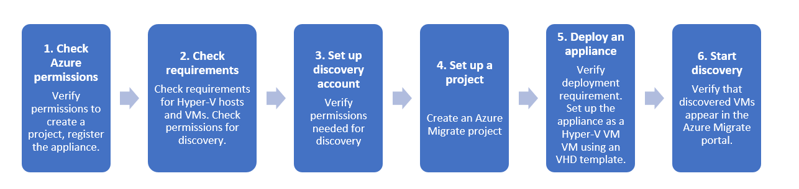

# Discover Hyper-V VMs with Server Assessment

This article helps you to discover Hyper-V VMs with the [Azure Migrate:Server Assessment](migrate-services-overview.md#azure-migrate-server-assessment-tool) tool, in preparation for VM assessment.

The Server Assessment tool uses a lightweight Azure Migrate appliance for VM discovery.

## What does Server Assessment discover?

The Azure Migrate appliance continuously discovers:

- Machine metadata (disks, NICs).
- Performance metadata (CPU, memory utilization, disk IOPS and throughput) if you enable performance-based(concepts-assessment-calculation.md#types-of-assessments) assessment.

## What's the appliance?

Server Assessment uses a lightweight appliance for discovery and assessment.

- The appliance can be set up on a Hyper-V VM, using an compressed Hyper-V VHD, or using a Windows PowerShell script.
- The appliance interacts with Hyper-V hosts to discover and assess VMs.
- [Learn more](migrate-appliance-architecture.md) about the appliance architecture.

## Discovery steps





## Step 1: Check Azure permissions

The table summarizes the permissions needed for discovery tasks.

**Requirements** | **Permissions** 
--- | --- 
**Create a project** | Your Azure account needs Contributor or Owner permissions in the resource group in which the project resides.
**Register appliance** | Your Azure account needs Contributor or Owner permissions on the Azure subscription.
**Create Azure AD apps** | When registering an appliance, Azure Migrate creates an Azure Active Directory (Azure AD) app for communication between the agents running on the appliance and Azure Migrate. <br/><br/>Your Azure account needs permissions to create Azure AD apps.

### Assign permissions to create project/register appliance

Check you have permissions to create an Azure Migrate project, and to register an appliance.

1. In the Azure portal, open the subscription, and select **Access control (IAM)**.
2. In **Check access**, find the relevant account, and click it to view permissions.
3. You should have **Contributor** or **Owner** permissions.
    - If you just created a free Azure account, you're the owner of your subscription.
    - If you're not the subscription owner, work with the owner to assign the role.
    
### Assign permissions to create Azure AD apps

To register the appliance, your Azure account needs permissions to create Azure AD apps. Assign the permissions using one of these methods:

- **Method 1: Grant permissions to the account**: A tenant/global admin can grant permissions to user accounts in the tenant, to create and register Azure AD apps.
- **Method 2: Assign a role with the permissions to a user account**: A tenant/global admin can assign the Application Developer role (that has the required permissions) to the user account.

> [!NOTE]
> You only need these permissions when you register a new appliance. You can remove the permissions after the appliance is set up.


#### Method 1: Grant permissions to the account

Grant permissions to the account as follows:

1. Make sure you're a tenant or global admin. Then, in Azure AD, navigate to **Azure Active Directory** > **Users** > **User Settings**.
2. Set **App registrations** to **Yes**. This is a default setting that isn't sensitive. [Learn more](https://docs.microsoft.com/azure/active-directory/develop/active-directory-how-applications-are-added#who-has-permission-to-add-applications-to-my-azure-ad-instance).

    


#### Method 2: Assign Application Developer role

Alternatively, the tenant/global admin can assign the Application Developer role to an account. [Learn more](https://docs.microsoft.com/azure/active-directory/fundamentals/active-directory-users-assign-role-azure-portal) about assigning a role.


## Step 2: Verify discovery requirements

Verify prerequisites and requirements for discovery, and optionally verify requirements for app-discovery, and dependency mapping.

Make sure that your Hyper-V infrastructure meets discovery requirements.

**Requirement** | **Details**
--- | ---
**Hyper-V host** | Hyper-V hosts can be standalone, or in a cluster. Machines you want to discover and assess must be located on a Hyper-V host running Windows Server 2019, Windows Server 2016, or WIndows Server 2012 R2. 
**Hyper-V VMs** | You can discover and assess all Windows and Linux operating systems.
**Hyper-V host ports** | Hosts need an inbound connection on WinRM port 5985 (HTTP) to pull metadata and performance data for Hyper-V VMs using a Common Information Model (CIM) session.
**Hyper-V host account** | The Server Assessment tool needs Administrator permissions on the Hyper-V host. <br/> If you don't want to assign Administrator permissions, you can add a local admin or domain user account to these groups- Remote Management Users, Hyper-V Administrators, and Performance Monitor Users. 
**Limits** | You can discover and assess up to 35,000 Hyper-V VMs in a single Azure Migrate project.<br/><br/> A single appliance can connect to up to 300 Hyper-V hosts.


## Step 3: Create an account for discovery

The appliance needs an account to access the Hyper-V host to discover VMs. Set up an account as follows:

- Option 1: Prepare an account with Administrator access to the Hyper-V host machine.
- Option 2: Prepare a Local Admin account, or Domain Admin account, and add the account to these groups: Remote Management Users, Hyper-V Administrators, and Performance Monitor Users. 


## Step 4: Set up an Azure Migrate project

Set up a new Azure Migrate project as follows:

1. In the Azure portal > **All services**, search for **Azure Migrate**.
2. Under **Services**, select **Azure Migrate**.
3. In **Overview**, under **Discover, assess and migrate servers**, select **Assess and migrate servers**.

   

4. In **Getting started**, select **Add tools**.
5. In **Migrate project**, select your Azure subscription, and create a resource group if you don't have one.     
6. In **Project Details**, specify the project name and the geography in which you want to create the project. Review supported geographies for [public](migrate-support-matrix.md#supported-geographies-public-cloud) and [government clouds](migrate-support-matrix.md#supported-geographies-azure-government).

   

7. Select **Next**.
8. In **Select assessment tool**, select **Azure Migrate: Server Assessment** > **Next**.

   

9. In **Select migration tool**, select **Skip adding a migration tool for now** > **Next**.
10. In **Review + add tools**, review the settings, and select **Add tools**.
11. Wait a few minutes for the Azure Migrate project to deploy. You'll be taken to the project page. If you don't see the project, you can access it from **Servers** in the Azure Migrate dashboard.


## Step 5: Set up the appliance

This article shows you how to deploy the appliance on a Hyper-V VM using a downloaded Hyper-V VHD, as follows:

- Review appliance requirements
- Download the appliance template, and check it's secure.
- Import the template to create the appliance VM. 
- After creating the appliance, you check that it can connect to Azure, configure it for the first time, and register it with the Azure Migrate project.

If you want to use PowerShell to create the appliance, instead of the template, follow the instructions in [this article](deploy-appliance-script.md##set-up-the-appliance-for-hyper-v).


### Download the VHD

Download the zipped VHD template for the appliance.

1. In **Migration Goals** > **Servers** > **Azure Migrate: Server Assessment**, click **Discover**.
2. In **Discover machines** > **Are your machines virtualized?**, click **Yes, with Hyper-V**.
3. Click **Download** to download the VHD file.

    


### Verify security

Check that the zipped file is secure, before you deploy it.

1. On the machine to which you downloaded the file, open an administrator command window.

2. Run the following PowerShell command to generate the hash for the ZIP file
    - ```C:\>Get-FileHash -Path <file_location> -Algorithm [Hashing Algorithm]```
    - Example usage: ```C:\>Get-FileHash -Path ./AzureMigrateAppliance_v1.19.06.27.zip -Algorithm SHA256```

3.  Verify the latest appliance versions and hash values:

    - For the Azure public cloud:

        **Scenario** | **Download** | **SHA256**
        --- | --- | ---
        Hyper-V (8.93 GB) | [Latest version](https://aka.ms/migrate/appliance/hyperv) |  572be425ea0aca69a9aa8658c950bc319b2bdbeb93b440577264500091c846a1

    - For Azure Government:

        **Scenario*** | **Download** | **SHA256**
        --- | --- | ---
        Hyper-V (63.1 MB) | [Latest version](https://go.microsoft.com/fwlink/?linkid=2120200&clcid=0x409) |  2c5e73a1e5525d4fae468934408e43ab55ff397b7da200b92121972e683f9aa3


### Create the appliance VM

Import the downloaded file, and create the VM.

1. After downloading the zipped VHD file to the Hyper-V host on which the appliance VM will be placed, extract the zipped file.
    - In the extracted location, the file unzips into a folder called **AzureMigrateAppliance_VersionNumber**.
    - This folder contains a subfolder, also called **AzureMigrateAppliance_VersionNumber**.
    - This subfolder contains three further subfolders - **Snapshots**, **Virtual Hard Disks**, and **Virtual Machines**.

2. Open Hyper-V Manager. In **Actions**, click **Import Virtual Machine**.

    

2. In the Import Virtual Machine Wizard > **Before you begin**, click **Next**.
3. In **Locate Folder**, select the **Virtual Machines** folder. Then click **Next**.
1. In **Select Virtual Machine**, click **Next**.
2. In **Choose Import Type**, click **Copy the virtual machine (create a new unique ID)**. Then click **Next**.
3. In **Choose Destination**, leave the default setting. Click **Next**.
4. In **Storage Folders**, leave the default setting. Click **Next**.
5. In **Choose Network**, specify the virtual switch that the VM will use. The switch needs internet connectivity to send data to Azure. [Learn](/windows-server/virtualization/hyper-v/get-started/create-a-virtual-switch-for-hyper-v-virtual-machines) about creating a virtual switch.
6. In **Summary**, review the settings. Then click **Finish**.
7. In Hyper-V Manager > **Virtual Machines**, start the VM.


### Verify appliance access to Azure


Check appliance access as follows:

1. Make sure that the appliance VM can connect to Azure URLs for [public](migrate-appliance.md#public-cloud-urls) and [government](migrate-appliance.md#government-cloud-urls) clouds.
2. Make sure that these ports are open on the appliance machine:

    - Allow inbound connections on TCP port 3389, to allow remote desktop connections to the appliance.
    - Allow inbound connections on port 44368, to remotely access the appliance web app using the URL: https://<appliance-ip-or-name>:44368.
    - Allow outbound connections on port 443 (HTTPS), to send discovery and performance metadata to Azure Migrate.


### Configure the appliance

Set up the appliance for the first time.

> [!NOTE]
> If you set up the appliance using a [PowerShell script](deploy-appliance-script.md) instead of the downloaded VHD, the first two steps in this procedure aren't relevant.

1. In Hyper-V Manager > **Virtual Machines**, right-click the VM > **Connect**.
2. Provide the language, time zone, and password for the appliance.
3. Open a browser on any machine that can connect to the VM, and open the URL of the appliance web app: **https://*appliance name or IP address*: 44368**.

   Alternately, you can open the app from the appliance desktop by clicking the app shortcut.
1. In the web app > **Set up prerequisites**, do the following:
    - **License**: Accept the license terms, and read the third-party information.
    - **Connectivity**: The app checks that the VM has internet access. If the VM uses a proxy:
      - Click **Proxy settings**, and specify the proxy address and listening port, in the form http://ProxyIPAddress or http://ProxyFQDN.
      - Specify credentials if the proxy needs authentication.
      - Only HTTP proxy is supported.
    - **Time sync**: Time is verified. The time on the appliance should be in sync with internet time for VM discovery to work properly.
    - **Install updates**: Azure Migrate Server Assessment checks that the appliance has the latest updates installed.

### Register the appliance with Azure Migrate

1. Click **Log In**. If it doesn't appear, make sure you've disabled the pop-up blocker in the browser.
2. On the new tab, sign in using your Azure credentials.
    - Sign in with your username and password.
    - Sign-in with a PIN isn't supported.
3. After successfully signing in, go back to the web app.
4. Select the subscription in which the Azure Migrate project was created. Then select the project.
5. Specify a name for the appliance. The name should be alphanumeric with 14 characters or less.
6. Click **Register**.


### Delegate credentials for SMB VHDs

If you're running VHDs on SMBs, you must enable delegation of credentials from the appliance to the Hyper-V hosts. To do this, you enable each host to act as a delegate for the appliance. If you followed the tutorials in order, you did this in the previous tutorial, when you prepared Hyper-V for assessment and migration. You should have either set up CredSSP for the hosts [manually](tutorial-prepare-hyper-v.md#enable-credssp-to-delegate-credentials), or by [running a script](tutorial-prepare-hyper-v.md#run-the-script) that does this.

Enable on the appliance as follows:

#### Option 1

On the appliance VM, run this command. HyperVHost1/HyperVHost2 are example host names.

```
Enable-WSManCredSSP -Role Client -DelegateComputer HyperVHost1.contoso.com, HyperVHost2.contoso.com, HyperVHost1, HyperVHost2 -Force
```

Example: ` Enable-WSManCredSSP -Role Client -DelegateComputer HyperVHost1.contoso.com HyperVHost2.contoso.com -Force `

#### Option 2

Alternatively, do this in the Local Group Policy Editor on the appliance:

1. In **Local Computer Policy** > **Computer Configuration**, click **Administrative Templates** > **System** > **Credentials Delegation**.
2. Double-click **Allow delegating fresh credentials**, and select **Enabled**.
3. In **Options**, click **Show**, and add each Hyper-V host you want to discover to the list, with **wsman/** as a prefix.
4. Then, in **Credentials Delegation**, double-click **Allow delegating fresh credentials with NTLM-only server authentication**. Again, add each Hyper-V host you want to discover to the list, with **wsman/** as a prefix.


## Step 6: Start continuous discovery

The appliance needs to connect to Hyper-V hosts to discover VMs.


### Connect to Hyper-V hosts

1. In **User name** and **Password**, specify the account credentials that the appliance will use to discover VMs. Specify a friendly name for the credentials, and click **Save details**.
2. Click **Add host**, and specify Hyper-V host/cluster details.
3. Click **Validate**. After validation, the number of VMs that can be discovered on each host/cluster is shown.
    - If validation fails for a host, review the error by hovering over the icon in the **Status** column. Fix issues, and validate again.
    - To remove hosts or clusters, select > **Delete**.
    - You can't remove a specific host from a cluster. You can only remove the entire cluster.
    - You can add a cluster, even if there are issues with specific hosts in the cluster.
4. After validation, click **Save and start discovery** to start the discovery process.

This starts discovery. It takes around 1.5 minutes per host for metadata of discovered servers to appear in the Azure portal.


### Verify discovered VMs in the portal

After discovery, you can verify that the VMs appear in the Azure portal:

1. Open the Azure Migrate dashboard.
2. In **Azure Migrate - Servers** > **Azure Migrate: Server Assessment**, select the icon that displays the count for **Discovered servers**.

## Next steps

[Assess Hyper-V VMs](assess-vmware-migrate-azure-vm.md) for migration to Azure VMs.

