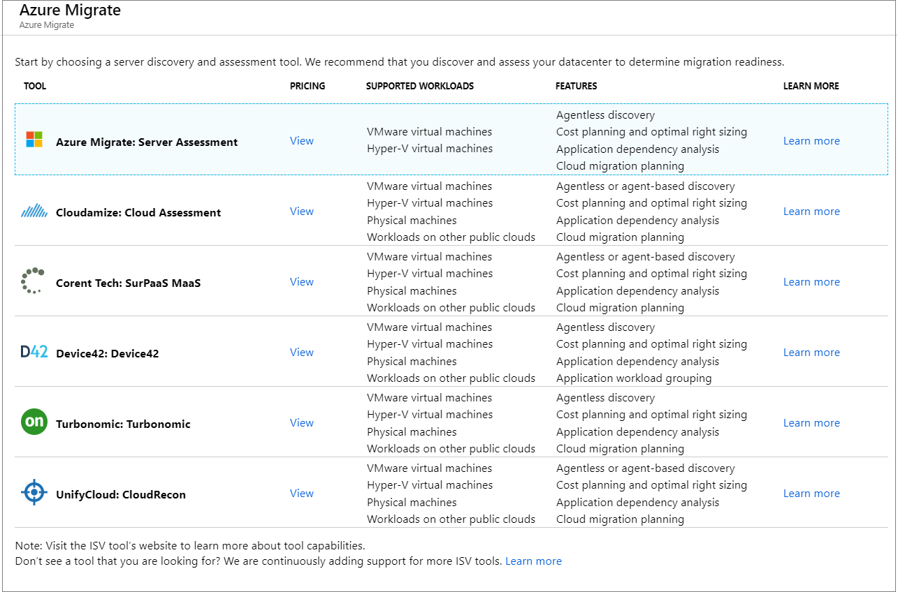

# Add assessment tools

This article describes how to add assessment tools in [Azure Migrate](migrate-overview.md).

Azure Migrate provides a hub of tools for assessment and migration to Azure. It includes native tools, tools provided by other Azure services, and third-party independent software vendor (ISV) offerings.

If you want to add an assessment tool and you don't yet have an Azure Migrate project, follow this [article](how-to-add-tool-first-time.md).

## Selecting an ISV tool

If you choose an [ISV tool](migrate-services-overview.md#isv-integration) for assessment, you can start by obtaining a license, or signing up for a free trial, in accordance with the ISV policy. In each tool, there's an option to connect to Azure Migrate. Follow the tool instructions and documentation to connect the tool workspace with Azure Migrate. 

## Select an assessment scenario

1. In the Azure Migrate project, click **Overview**.
2. Select the assessment scenario you want to use:

    - To discover and assess machines and workloads for migration to Azure, select **Assess and migrate servers**.
    - To assess on-premises SQL machines, select **Assess and migrate databases**.
    - To assess on-premises web apps, select **Assess and migrate web apps**.

    

## Select a server assessment tool 

1. Click **Assess and Migrate Servers**.
2. In **Azure Migrate - Servers**, if you haven't added an assessment tool, under **Assessment tools**, select **Click here to add an assessment tool**. If you've already added assessment tools, in **Add more assessment tools**, select **Change**.

    > [!NOTE]
    > If you need to navigate to a different project, in **Azure Migrate - Servers**, next to **See details for a different migrate project**, click **Click here**.

3. In **Azure Migrate**, select the assessment tool you want to use.

    
    

    - If you use Azure Migrate Server Assessment, you can set up, run, and view assessments directly in the Azure Migrate project.
    - If you use a third-party assessment tool, navigate to the link provided for their site, and run the assessment in accordance with the instructions they provide.

## Select a database assessment tool

1. Click **Assess and migrate databases**
2. In **Databases**, click **Add tools**.
3. In Add a tool > **Select assessment tool**, select the tool you want to use to assess your database.

## Select a web app assessment tool

1. Click **Assess and migrate web apps**.
2. Follow the link to the Migration tool for the Azure App Service. Use the migration tool to:

    - **Assess apps online**: You can assess apps with a public URL online, using the Azure App Service Migration Assistant.
    - **.NET/PHP**: For internal .NET and PHP apps, you can download and run the Migration Assistant.

## Next steps

Try out an assess using Azure Migrate Server Assessment for [Hyper-V](tutorial-prepare-hyper-v.md) or [VMware](tutorial-prepare-vmware.md) VMs.
