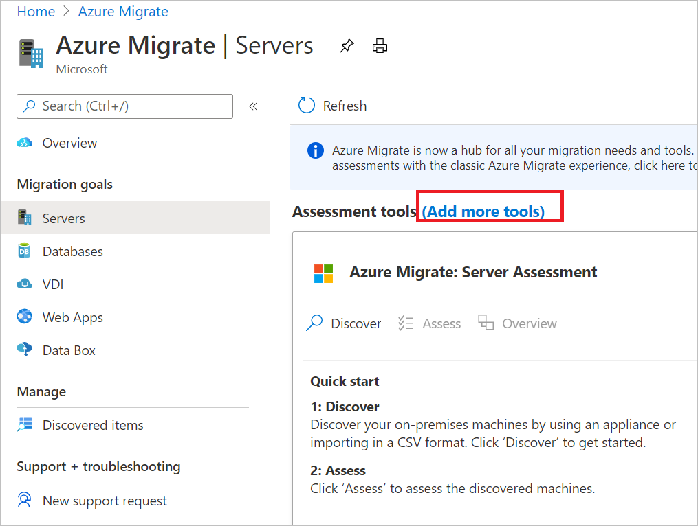
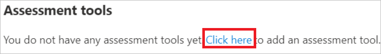
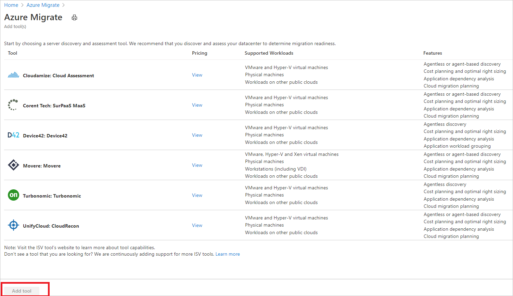

# Add assessment tools

This article describes how to add assessment tools in [Azure Migrate](./migrate-services-overview.md). 

- If you want to add an assessment tool and you don't yet have an Azure Migrate project, follow this [article](create-manage-projects.md).
- If you've added an ISV tool, or Movere, for assessment, [follow the steps](prepare-isv-movere.md), to prepare to work with the tool.

## Select an assessment scenario

1. In the Azure Migrate project, click **Overview**.
2. Select the assessment scenario:

    - To discover, assess and migrate servers (physical or virtual) from your datacenter or other clouds to Azure, select **Discover, assess and migrate**. You can now also discover and assess SQL Server from your VMware environment using this migration goal.
    - To assess on-premises SQL Server databases, select **Assess and migrate databases**.
    - To assess or migrate on-premises web apps,  select **Explore more** > **Web Apps**.
    - To assess your virtual desktop infrastructure, select **Explore more** > **Virtual Desktop Infrastructure**.

    

## Select a discovery and assessment tool 

1. Add a tool:

    - If you created an Azure Migrate project using the **Assess and migrate servers** option in the portal, the Azure Migrate Discovery and assessment tool is automatically added to the project. To add additional assessment tools, in **Windows, Linux and SQL Server**, next to **Assessment tools**, select **Add more tools**.

         

    - If you created a project using a different option, and don't yet have any assessment tools, in **Windows, Linux and SQL Server** > **Assessment tools**, select **Click here**.

        

2. In **Azure Migrate** > **Add tools**, select the tools you want to add. Then select **Add tool**.

    

## Select a database assessment tool

1. Add a tool:

    - If you created an Azure Migrate project using the **Assess and migrate database** option in the portal, the Database Assessment tool is automatically added to the project. To add additional assessment tools, in **Databases**, next to **Assessment tools**, select **Add more tools**.

    - If you created a project using a different option, and don't yet have any database assessment tools, in **Databases** > **Assessment tools**, select **Click here**.

2. In **Azure Migrate** > **Add tools**, select the tools you want to add. Then select **Add tool**.

    

## Select a web app assessment tool

If you created an Azure Migrate project using the **Explore more** > **WebApps** option in the portal, the Web App Assessment tool is automatically added to the project. 

1. If the Web App Assessment tool isn't in the project, in **Web Apps** > **Assessment tools**, select **Click here**.
    
    

2. In **Azure Migrate** > **Add tools**, select the Web app assessment tool. Then select **Add tool**.

    

 

## Next steps

Discover on-premises servers for assessment using Azure Migrate Discovery and assessment tool for [VMware](./tutorial-discover-vmware.md), [Hyper-V](./tutorial-discover-hyper-v.md), or [physical servers](./tutorial-discover-physical.md)