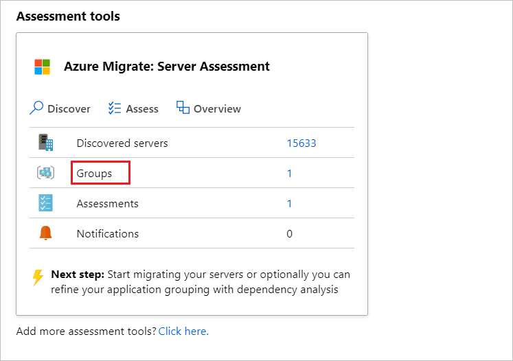
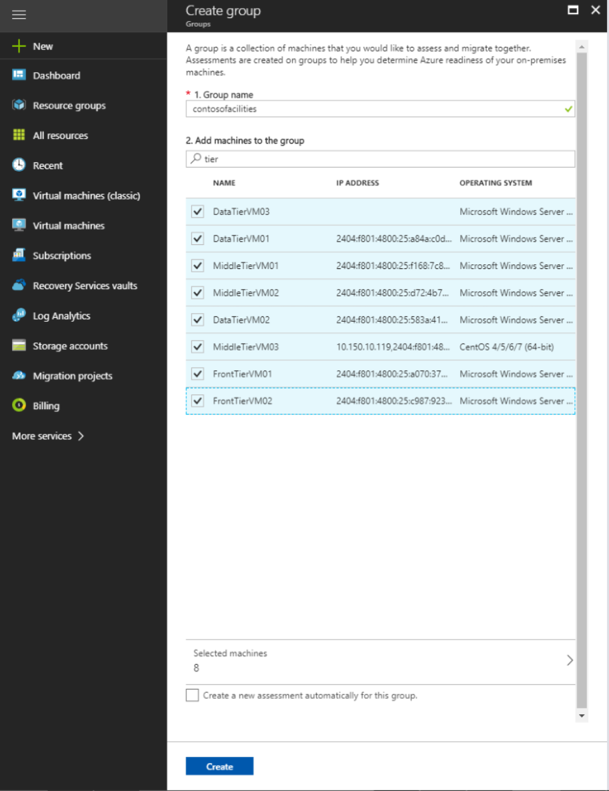
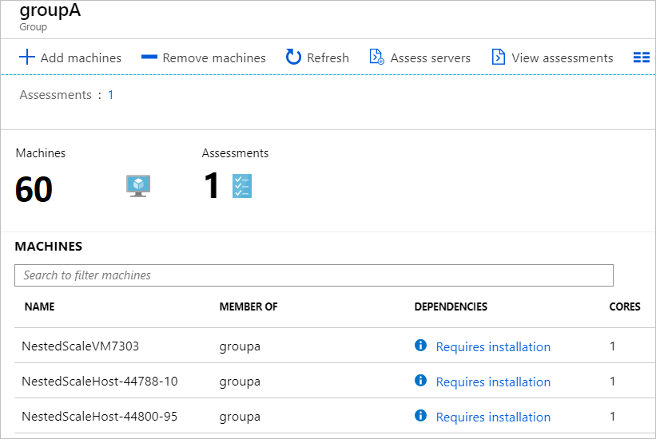

# Create a group for assessment

This article describes how to create groups of servers for assessment with Azure Migrate: Discovery and assessment.

[Azure Migrate](migrate-services-overview.md) helps you to migrate to Azure. Azure Migrate provides a centralized hub to track discovery, assessment, and migration of on-premises infrastructure, applications, and data to Azure. The hub provides Azure tools for assessment and migration, as well as third-party independent software vendor (ISV) offerings.

## Grouping servers

You gather servers into groups to assess whether they're suitable for migration to Azure, and to get Azure sizing and cost estimations for them. There are a couple of ways to create groups:

- If you know the servers that need be migrated together, you can manually create the group in Azure Migrate.
- If you are not sure about the servers that need to be grouped together, you can use the dependency visualization functionality in Azure Migrate to create groups. 

> [!NOTE]
> The dependency visualization functionality is not available in Azure Government.

## Create a group manually

You can create a group at the same time that you [create an assessment](how-to-create-assessment.md).

If you want to create a group manually outside of creating an assessment, do the following:

1. In the Azure Migrate project > **Overview**, click **Assess and migrate servers**. In **Azure Migrate: Discovery and assessment**, click **Groups**
    - If you haven't yet added the Azure Migrate: Discovery and assessment tool, click to add it. [Learn more](how-to-assess.md).
    - If you haven't yet created an Azure Migrate project, [learn more](./create-manage-projects.md).

    

2. Click the **Group** icon.
3. In **Create group**, specify a group name, and in **Appliance name**, select the Azure Migrate appliance you're using for server discovery.
4. From the server list, select the servers you want to add to the group > **Create**.

    

You can now use this group when you [create an Azure VM assessment](how-to-create-assessment.md) or [an Azure VMware Solution (AVS) assessment](how-to-create-azure-vmware-solution-assessment.md) or [an Azure SQL assessment](how-to-create-azure-sql-assessment.md) or [an Azure App Service assessment](how-to-create-azure-app-service-assessment.md).

## Refine a group with dependency mapping

Dependency mapping helps you to visualize dependencies across servers. You typically use dependency mapping when you want to assess server groups with higher levels of confidence.

- It helps you to cross-check server dependencies, before you run an assessment.
- It also helps to effectively plan your migration to Azure, by ensuring that nothing is left behind, and thus avoiding surprise outages during migration.
- You can discover interdependent systems that need to migrate together, and identify whether a running system is still serving users, or is a candidate for decommissioning instead of migration.

If you've already [set up dependency mapping](how-to-create-group-machine-dependencies.md), and want to refine an existing group, do the following:

1. In the **Servers** tab, in **Azure Migrate: Discovery and assessment** tile, click **Groups**.
2. Click the group you want to refine.
    - If you haven't yet set up dependency mapping, the **Dependencies** column will show a **Requires installation** status. For each server for which you want to visualize dependencies, click **Requires installation**. Install a couple of agents on each server, before you can map the server dependencies. [Learn more](how-to-create-group-machine-dependencies.md).

        

    - If you've already set up dependency mapping, on the group page, click **View dependencies** to open the group dependency map.

3. After clicking **View dependencies**, the group dependency map shows the following:

    - Inbound (clients) and outbound (servers) TCP connections to and from all servers in the group that have the dependency agents installed.
    - Dependent servers that don't have the dependency agents installed are grouped by port numbers.
    - Dependent servers with dependency agents installed are shown as separate boxes.
    - Processes running inside the server. Expand each server box to view the processes.
    - Server properties (including FQDN, operating system, MAC address). Click on each server box to view the details.

4. To view dependencies in a time interval of your choice, modify the time range (an hour by default) by specifying  start and end dates, or the duration.

    > [!NOTE]
    > Time range can be up to an hour. If you need a longer range, use [Azure Monitor to query dependent data](how-to-create-group-machine-dependencies.md) for a longer period.

5. After you've identified the dependencies you would like to add to or remove from the group, you can modify the group. Use Ctrl+Click to add or remove servers from the group.

    - You can only add servers that have been discovered.
    - Adding and removing servers invalidates past assessments for a group.
    - You can optionally create a new assessment when you modify the group.

## Next steps

Learn how to set up and use [dependency mapping](how-to-create-group-machine-dependencies.md) to create high confidence groups.