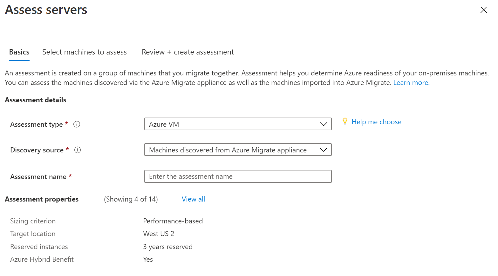
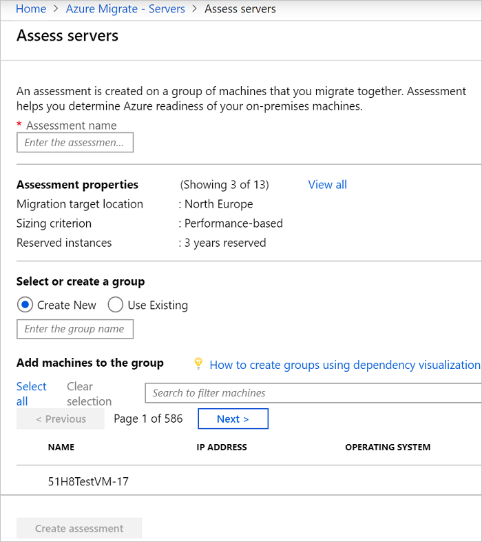

# Create an Azure VM assessment

This article describes how to create an Azure VM assessment for on-premises VMware VMs or Hyper-V VMs with Azure Migrate: Server Assessment.

[Azure Migrate](migrate-services-overview.md) helps you to migrate to Azure. Azure Migrate provides a centralized hub to track discovery, assessment, and migration of on-premises infrastructure, applications, and data to Azure. The hub provides Azure tools for assessment and migration, as well as third-party independent software vendor (ISV) offerings. 

## Before you start

- Make sure you've [created](how-to-add-tool-first-time.md) an Azure Migrate project.
- If you've already created a project, make sure you've [added](how-to-assess.md) the Azure Migrate: Server Assessment tool.
- To create an assessment, you need to set up an Azure Migrate appliance for [VMware](how-to-set-up-appliance-vmware.md) or [Hyper-V](how-to-set-up-appliance-hyper-v.md). The appliance discovers on-premises machines, and sends metadata and performance data to Azure Migrate: Server Assessment. [Learn more](migrate-appliance.md).

## Azure VM Assessment overview
There are two types of sizing criteria you can use to create an Azure VM assessment using Azure Migrate: Server Assessment.

**Assessment** | **Details** | **Data**
--- | --- | ---
**Performance-based** | Assessments based on collected performance data | **Recommended VM size**: Based on CPU and memory utilization data.   **Recommended disk type (standard or premium managed disk)**: Based on the IOPS and throughput of the on-premises disks.
**As on-premises** | Assessments based on on-premises sizing. | **Recommended VM size**: Based on the on-premises VM size   **Recommended disk type**: Based on the storage type setting you select for the assessment.

[Learn more](concepts-assessment-calculation.md) about assessments.

## Run an assessment

Run an assessment as follows:

1. Review the [best practices](best-practices-assessment.md) for creating assessments.
2. In the **Servers** tab, in **Azure Migrate: Server Assessment** tile, click **Assess**.

    

3. In **Assess servers**, select the assessment type as "Azure VM", select the discovery source and specify the assessment name.

    

4. Click **View all** to review the assessment properties.

    

5. Click **next** to **Select machines to assess**. In **Select or create a group**, select **Create New**, and specify a group name. A group gathers one or more VMs together for assessment.
6. In **Add machines to the group**, select VMs to add to the group.
7. Click **next** to **Review + create assessment** to review the assessment details.
8. Click **Create Assessment** to create the group, and run the assessment.

    

9. After the assessment is created, view it in **Servers** > **Azure Migrate: Server Assessment** > **Assessments**.
10. Click **Export assessment**, to download it as an Excel file.

## Review an Azure VM assessment

An Azure VM assessment describes:

- **Azure readiness**: Whether VMs are suitable for migration to Azure.
- **Monthly cost estimation**: The estimated monthly compute and storage costs for running the VMs in Azure.
- **Monthly storage cost estimation**: Estimated costs for disk storage after migration.

### View an Azure VM assessment

1. In **Migration goals** >  **Servers**, click **Assessments** in **Azure Migrate: Server Assessment**.
2. In **Assessments**, click on an assessment to open it.

    

### Review Azure readiness

1. In **Azure readiness**, verify whether VMs are ready for migration to Azure.
2. Review the VM status:
    - **Ready for Azure**: Azure Migrate recommends a VM size and cost estimates for VMs in the assessment.
    - **Ready with conditions**: Shows issues and suggested remediation.
    - **Not ready for Azure**: Shows issues and suggested remediation.
    - **Readiness unknown**: Used when Azure Migrate can't assess readiness, due to data availability issues.

3. Click on an **Azure readiness** status. You can view VM readiness details, and drill down to see VM details, including compute, storage, and network settings.

### Review cost details

This view shows the estimated compute and storage cost of running VMs in Azure.

1. Review the monthly compute and storage costs. Costs are aggregated for all VMs in the assessed group.

    - Cost estimates are based on the size recommendations for a machine, and its disks and properties.
    - Estimated monthly costs for compute and storage are shown.
    - The cost estimation is for running the on-premises VMs as IaaS VMs. Azure Migrate Server Assessment doesn't consider PaaS or SaaS costs.

2. You can review monthly storage cost estimates. This view shows aggregated storage costs for the assessed group, split over different types of storage disks.
3. You can drill down to see details for specific VMs.

### Review confidence rating

When you run performance-based assessments, a confidence rating is assigned to the assessment.

- A rating from 1-star (lowest) to 5-star (highest) is awarded.
- The confidence rating helps you estimate the reliability of the size recommendations provided by the assessment.
- The confidence rating is based on the availability of data points needed to compute the assessment.

Confidence ratings for an assessment are as follows.

**Data point availability** | **Confidence rating**
--- | ---
0%-20% | 1 Star
21%-40% | 2 Star
41%-60% | 3 Star
61%-80% | 4 Star
81%-100% | 5 Star

## Next steps

- Learn how to use [dependency mapping](how-to-create-group-machine-dependencies.md) to create high confidence groups.
- [Learn more](concepts-assessment-calculation.md) about how assessments are calculated.
