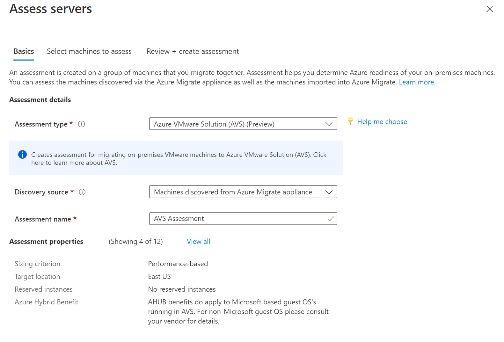
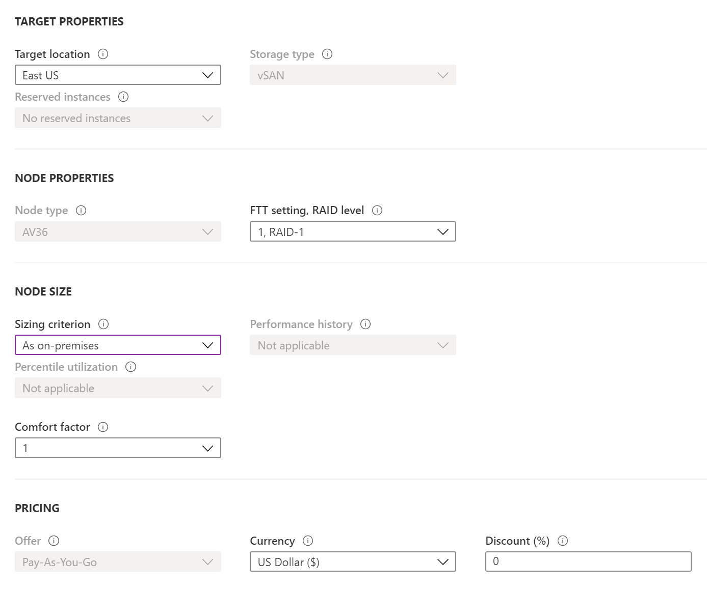
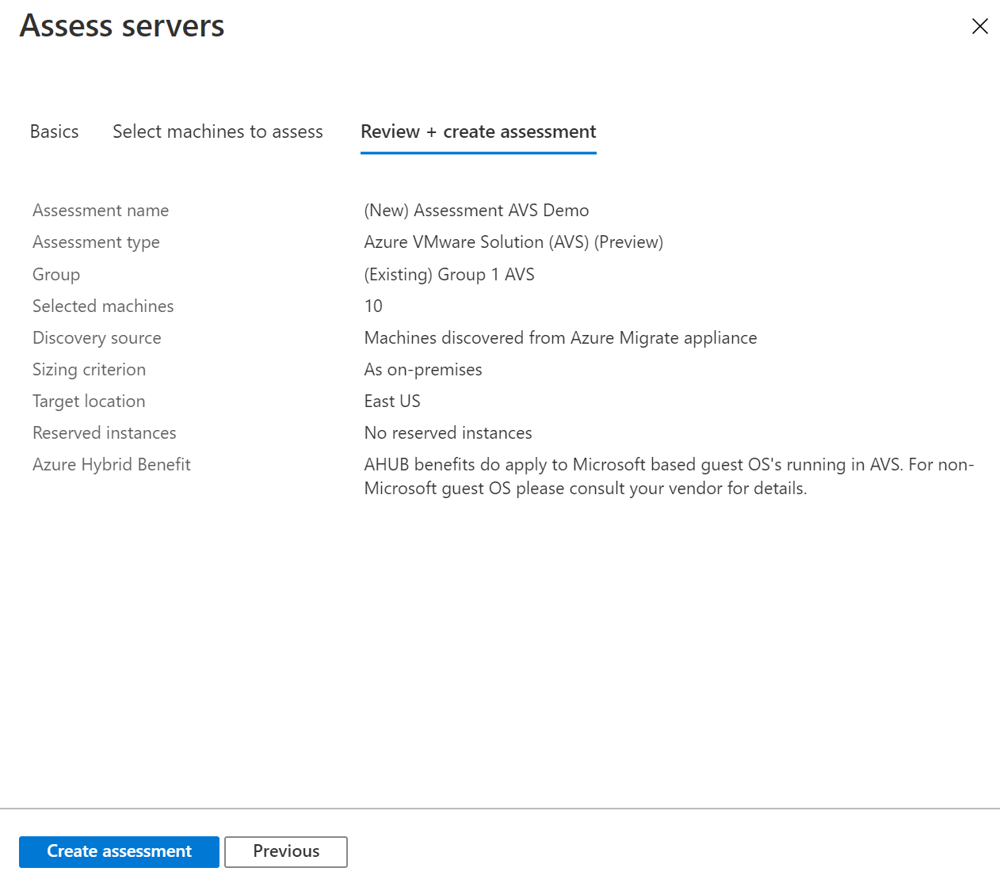
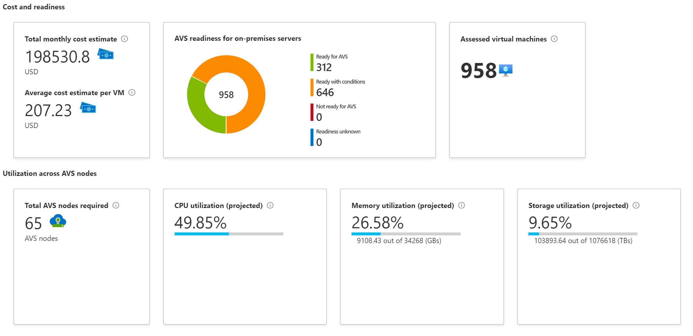

# Create an Azure VMware Solution (AVS) assessment

This article describes how to create an Azure VMware Solution (AVS) assessment for on-premises VMware VMs with Azure Migrate: Server Assessment.

[Azure Migrate](migrate-services-overview.md) helps you to migrate to Azure. Azure Migrate provides a centralized hub to track discovery, assessment, and migration of on-premises infrastructure, applications, and data to Azure. The hub provides Azure tools for assessment and migration, as well as third-party independent software vendor (ISV) offerings.

## Before you start

- Make sure you've [created](how-to-add-tool-first-time.md) an Azure Migrate project.
- If you've already created a project, make sure you've [added](how-to-assess.md) the Azure Migrate: Server Assessment tool.
- To create an assessment, you need to set up an Azure Migrate appliance for [VMware](how-to-set-up-appliance-vmware.md), which discovers the on-premises machines, and sends metadata and performance data to Azure Migrate: Server Assessment. [Learn more](migrate-appliance.md).
- You could also [import the server metadata](tutorial-assess-import.md) in comma-separated values (CSV) format.

## Azure VMware Solution (AVS) Assessment overview

There are two types of assessments you can create using Azure Migrate: Server Assessment.

**Assessment Type** | **Details**
--- | --- 
**Azure VM** | Assessments to migrate your on-premises servers to Azure virtual machines.    You can assess your on-premises [VMware VMs](how-to-set-up-appliance-vmware.md), [Hyper-V VMs](how-to-set-up-appliance-hyper-v.md), and [physical servers](how-to-set-up-appliance-physical.md) for migration to Azure using this assessment type.[Learn more](concepts-assessment-calculation.md)
**Azure VMware Solution (AVS)** | Assessments to migrate your on-premises servers to [Azure VMware Solution (AVS)](https://docs.microsoft.com/azure/azure-vmware/introduction).    You can assess your on-premises [VMware VMs](how-to-set-up-appliance-vmware.md) for migration to Azure VMware Solution (AVS) using this assessment type.[Learn more](concepts-azure-vmware-solution-assessment-calculation.md)

> [!NOTE]
> Azure VMware Solution (AVS) assessment is currently in preview and can be created for VMware VMs only.

There are two types of sizing criteria that you can use to create Azure VMware Solution (AVS) assessments:

**Assessment** | **Details** | **Data**
--- | --- | ---
**Performance-based** | Assessments based on collected performance data of on-premises VMs. | **Recommended Node size**: Based on CPU and memory utilization data along with node type, storage type, and FTT setting that you select for the assessment.
**As on-premises** | Assessments based on on-premises sizing. | **Recommended Node size**: Based on the on-premises VM size along with the node type, storage type, and FTT setting that you select for the assessment.

## Run an Azure VMware Solution (AVS) assessment

Run an Azure VMware Solution (AVS) assessment as follows:

1. Review the [best practices](best-practices-assessment.md) for creating assessments.

2. In the **Servers** tab, in **Azure Migrate: Server Assessment** tile, click **Assess**.

    

3. In **Assess servers**, select the assessment type as "Azure VMware Solution (AVS)", select the discovery source and specify the assessment name.

    

4. Click **View all** to review the assessment properties.

    

5. Click **next** to **Select machines to assess**. In **Select or create a group**, select **Create New**, and specify a group name. A group gathers one or more VMs together for assessment.

6. In **Add machines to the group**, select VMs to add to the group.

7. Click **next** to **Review + create assessment** to review the assessment details.

8. Click **Create Assessment** to create the group, and run the assessment.

    

9. After the assessment is created, view it in **Servers** > **Azure Migrate: Server Assessment** > **Assessments**.

10. Click **Export assessment**, to download it as an Excel file.

## Review an Azure VMware Solution (AVS) assessment

An Azure VMware Solution (AVS) assessment describes:

- **Azure VMware Solution (AVS) readiness**: Whether the on-premises VMs are suitable for migration to Azure VMware Solution (AVS).
- **Number of AVS nodes**: Estimated number of AVS nodes required to run the VMs.
- **Utilization across AVS nodes**: Projected CPU, memory, and storage utilization across all nodes.
- **Monthly cost estimation**: The estimated monthly costs for all Azure VMware Solution (AVS) nodes running the on-premises VMs.

### View an assessment

1. In **Migration goals** >  **Servers**, click **Assessments** in **Azure Migrate: Server Assessment**.

2. In **Assessments**, click on an assessment to open it.

    

### Review Azure VMware Solution (AVS) readiness

1. In **Azure readiness**, verify whether VMs are ready for migration to AVS.

2. Review the VM status:
    - **Ready for AVS**: The machine can be migrated as-is to Azure (AVS) without any changes. It will start in AVS with full AVS support.
    - **Ready with conditions**: The VM might have compatibility issues with the current vSphere version as well as requiring possibly VMware tools and or other settings before full functionality from the VM can be achieved in AVS.
    - **Not ready for AVS**: The VM will not start in AVS. For example, if the on-premises VMware VM has an external device attached such as a cd-rom the VMotion operation will fail (if using VMware VMotion).
    - **Readiness unknown**: Azure Migrate couldn't determine the readiness of the machine because of insufficient metadata collected from the on-premises environment.

3. Review the Suggested tool:
    - **VMware HCX or Enterprise**: For VMware machines, VMWare Hybrid Cloud Extension (HCX) solution is the suggested migration tool to migrate your on-premises workload to your Azure VMWare Solution (AVS) private cloud. [Learn More](https://docs.microsoft.com/azure/azure-vmware/hybrid-cloud-extension-installation).
    - **Unknown**: For machines imported via a CSV file, the default migration tool is unknown. Though for VMware machines, it is suggested to use the VMWare Hybrid Cloud Extension (HCX) solution. 

4. Click on an **AVS readiness** status. You can view VM readiness details, and drill down to see VM details, including compute, storage, and network settings.

### Review cost details

This view shows the estimated cost of running VMs in Azure VMware Solution (AVS).

1. Review the monthly total costs. Costs are aggregated for all VMs in the assessed group. 

    - Cost estimates are based on the number of AVS nodes required considering the resource requirements of all the  VMs in total.
    - As the pricing for Azure VMware Solution (AVS) is per node, the total cost does not have compute cost and storage cost distribution.
    - The cost estimation is for running the on-premises VMs in AVS. Azure Migrate Server Assessment doesn't consider PaaS or SaaS costs.
    
2. You can review monthly storage cost estimates. This view shows aggregated storage costs for the assessed group, split over different types of storage disks.

3. You can drill down to see details for specific VMs.

### Review confidence rating

When you run performance-based assessments, a confidence rating is assigned to the assessment.

- A rating from 1-star (lowest) to 5-star (highest) is awarded.
- The confidence rating helps you estimate the reliability of the size recommendations provided by the assessment.
- The confidence rating is based on the availability of data points needed to compute the assessment.
- For performance-based sizing, AVS assessments in Server Assessment need the utilization data for CPU and VM memory. The following performance data is collected but not used in sizing recommendations for AVS assessments:
  - The disk IOPS and throughput data for every disk attached to the VM.
  - The network I/O to handle performance-based sizing for each network adapter attached to a VM.

Confidence ratings for an assessment are as follows.

**Data point availability** | **Confidence rating**
--- | ---
0%-20% | 1 Star
21%-40% | 2 Star
41%-60% | 3 Star
61%-80% | 4 Star
81%-100% | 5 Star

[Learn more](concepts-azure-vmware-solution-assessment-calculation.md) about performance data 

## Next steps

- Learn how to use [dependency mapping](how-to-create-group-machine-dependencies.md) to create high confidence groups.
- [Learn more](concepts-azure-vmware-solution-assessment-calculation.md) about how AVS assessments are calculated.
