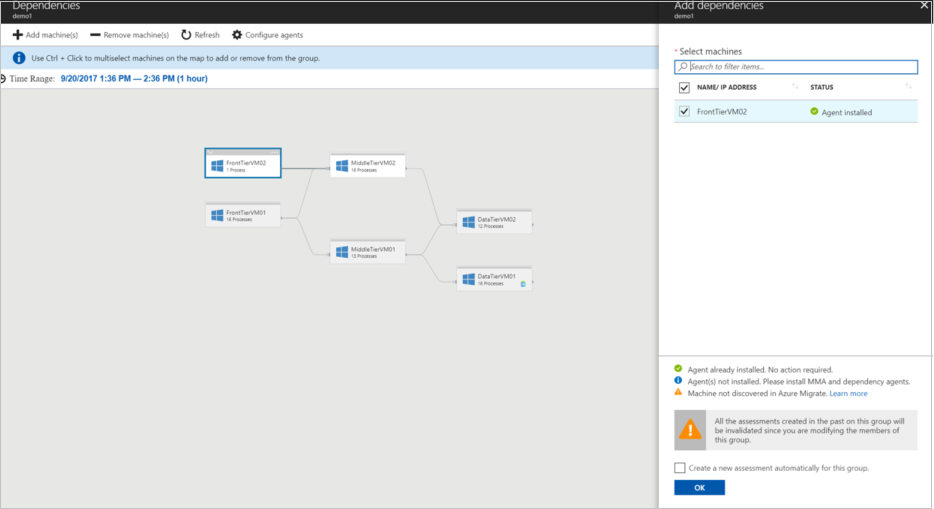

# Refine a group using group dependency mapping

This article describes how to set up group dependency mapping for [Azure Migrate](migrate-overview.md) assessment. You typically use this method when you want to refine settings for an existing group, by cross-checking group dependencies, before you run an assessment. Groups for which you want to run group dependency mapping shouldn't contain more than 10 machines.  

## Modify a group

1. In the Azure Migrate project, under **Manage**, click **Groups**, and select the group.
2. On the group page, click **View Dependencies**, to open the group dependency map. 

     

3. To view more granular dependencies, click the time range to modify it. By default, the range is an hour. You can modify the time range, or specify start and end dates, and duration.
4. Use Ctrl+Click to select machines on the map. Add or remove machines from the map.
    - You can only add machines that have been discovered.
    - Adding and removing machines from a group invalidates past assessments for it.
    - You can optionally create a new assessment when you modify the group.
5. Click **OK** to save the group.

    

If you want to check the dependencies of a specific machine that appears in the group dependency map, [set up machine dependency mapping](how-to-create-group-machine-dependencies.md).

## Next steps

[Learn more](concepts-assessment-calculation.md) about how assessments are calculated.
